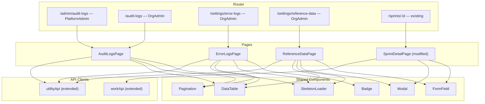

# Design Document: Admin Frontend Features

## Overview

This design covers four feature areas added to the Nexus 2.0 React/TypeScript frontend:

1. **Audit Logs Page** — paginated, filterable table of audit log entries with live/archive toggle, accessible to PlatformAdmin (under AdminLayout) and OrgAdmin (under AppShell).
2. **Error Logs Page** — paginated, filterable table of error log entries with expandable stack traces and severity badges, accessible to OrgAdmin.
3. **Reference Data Page** — tabbed interface for managing department types, priority levels (create), and viewing task types, workflow states (read-only), accessible to OrgAdmin.
4. **Sprint Edit** — edit button + modal on the existing SprintDetailPage for DeptLead/OrgAdmin to update sprint name, goal, and dates.

All features follow existing codebase patterns: `useState`/`useEffect`/`useCallback` hooks, `createApiClient` for API calls, `DataTable`/`Pagination`/`Modal`/`Badge`/`SkeletonLoader` shared components, `useToast` for notifications, `ApiError` + `mapErrorCode` for error handling, `RoleGuard` for access control, and Tailwind CSS for styling.

## Architecture



All new pages are standard React function components. No new shared components are needed — everything composes existing primitives.

## Components and Interfaces

### 1. AuditLogsPage

**File:** `src/frontend/src/features/admin/pages/AuditLogsPage.tsx`

Used by both PlatformAdmin and OrgAdmin routes (same component, different route placement).

**State:**
- `logs: AuditLog[]` — current page of audit log entries
- `loading: boolean` — fetch in progress
- `page: number` — current page (default 1)
- `pageSize: number` — rows per page (default 20)
- `totalCount: number` — total records for pagination
- `isArchive: boolean` — toggle between live (`false`) and archived (`true`)
- Filter state: `filterAction`, `filterEntityType`, `filterActorId`, `filterDateFrom`, `filterDateTo`

**Behavior:**
- `fetchLogs` callback builds params from filters + pagination, calls `utilityApi.getAuditLogs()` or `utilityApi.getArchivedAuditLogs()` based on `isArchive`
- Filter changes reset page to 1
- Archive toggle resets page to 1, preserves filters
- DataTable columns: action, entityType, entityId, actorName, ipAddress, details (truncated), dateCreated (formatted)
- Uses `SkeletonLoader variant="table"` while loading
- Error handling: try/catch with `addToast('error', ...)`

### 2. ErrorLogsPage

**File:** `src/frontend/src/features/admin/pages/ErrorLogsPage.tsx`

**New type needed:** `ErrorLog` interface in `src/frontend/src/types/utility.ts`

**State:**
- `logs: ErrorLog[]` — current page of error log entries
- `loading: boolean`
- `page`, `pageSize`, `totalCount` — pagination
- `expandedRows: Set<string>` — tracks which rows have expanded stack traces
- Filter state: `filterServiceName`, `filterErrorCode`, `filterSeverity`, `filterDateFrom`, `filterDateTo`

**Behavior:**
- `fetchLogs` callback calls `utilityApi.getErrorLogs()` with filter + pagination params
- DataTable columns: serviceName, errorCode, severity (rendered via Badge), message, stackTrace (truncated with expand toggle), dateCreated
- Expand/collapse: clicking a row's chevron icon toggles its ID in `expandedRows` Set; when expanded, a `<pre>` block renders below the row with the full stack trace
- Severity badge uses Badge component with custom color mapping: Critical → red, Error → orange, Warning → yellow, Info → blue
- Uses `SkeletonLoader variant="table"` while loading

### 3. ReferenceDataPage

**File:** `src/frontend/src/features/admin/pages/ReferenceDataPage.tsx`

**State:**
- `activeTab: 'departmentTypes' | 'priorityLevels' | 'taskTypes' | 'workflowStates'`
- `departmentTypes: DepartmentType[]`, `priorityLevels: PriorityLevel[]`, `taskTypes: TaskTypeRef[]`, `workflowStates: WorkflowState[]`
- `loading: boolean`
- `createModalOpen: boolean`
- `saving: boolean`
- Form state for create modals (code, name, level)
- `errors: Record<string, string>` — validation errors

**Behavior:**
- On mount, fetches all four reference data lists via individual `utilityApi` methods
- Tab bar renders four tabs; clicking a tab sets `activeTab`
- Department Types tab: DataTable with code/name columns + "Add Department Type" button → opens Modal with code + name fields
- Priority Levels tab: DataTable with code/name/level columns + "Add Priority Level" button → opens Modal with code + name + level fields
- Task Types tab: read-only DataTable with code/name/defaultDepartment columns
- Workflow States tab: read-only DataTable with entityType/status/validTransitions columns
- Create forms validate required fields, POST via `utilityApi.createDepartmentType()` or `utilityApi.createPriorityLevel()`, refresh list on success
- Error handling: ApiError → `mapErrorCode` → toast

### 4. SprintDetailPage — Edit Addition

**Modified file:** `src/frontend/src/features/sprints/pages/SprintDetailPage.tsx`

**New state:**
- `editOpen: boolean` — controls Sprint Edit Modal visibility

**New sub-component: `SprintEditModal`**
- Props: `open`, `onClose`, `sprint: SprintDetail`, `onUpdated: () => void`
- Pre-populates form with `sprint.name`, `sprint.goal`, `sprint.startDate`, `sprint.endDate`
- Validation: name non-empty, startDate < endDate
- Submit: `workApi.updateSprint(id, payload)` → success toast + `onUpdated()` + close
- Error: ApiError → `mapErrorCode` → error toast

**Edit button visibility:**
- Uses `useAuth()` to get `user.roleName`
- Shows "Edit" button (Pencil icon) only when `roleName` is `'OrgAdmin'` or `'DeptLead'`

### 5. API Client Extensions

#### utilityApi.ts additions

```typescript
// New methods added to utilityApi object:
getArchivedAuditLogs: (params?) => client.get('/api/v1/audit-logs/archive', { params })
getErrorLogs: (params?) => client.get('/api/v1/error-logs', { params })
getDepartmentTypes: () => client.get('/api/v1/reference/department-types')
getPriorityLevels: () => client.get('/api/v1/reference/priority-levels')
getTaskTypes: () => client.get('/api/v1/reference/task-types')
getWorkflowStates: () => client.get('/api/v1/reference/workflow-states')
createDepartmentType: (data) => client.post('/api/v1/reference/department-types', data)
createPriorityLevel: (data) => client.post('/api/v1/reference/priority-levels', data)
```

#### workApi.ts addition

```typescript
// New method added to workApi object:
updateSprint: (id, data) => client.put(`/api/v1/sprints/${id}`, data)
```

### 6. Router Changes

Add to the OrgAdmin-only `RoleGuard` children block:
- `{ path: '/audit-logs', element: <AuditLogsPage /> }`
- `{ path: '/settings/error-logs', element: <ErrorLogsPage /> }`
- `{ path: '/settings/reference-data', element: <ReferenceDataPage /> }`

Add to the PlatformAdmin `AdminLayout` children block:
- `{ path: '/admin/audit-logs', element: <AuditLogsPage /> }`

## Data Models

### New Types (utility.ts)

```typescript
export interface ErrorLog {
    errorLogId: string;
    serviceName: string;
    errorCode: string;
    severity: string;       // 'Critical' | 'Error' | 'Warning' | 'Info'
    message: string;
    stackTrace: string | null;
    dateCreated: string;
}

export interface ErrorLogFilters {
    serviceName?: string;
    errorCode?: string;
    severity?: string;
    dateFrom?: string;
    dateTo?: string;
}

export interface CreateDepartmentTypeRequest {
    code: string;
    name: string;
}

export interface CreatePriorityLevelRequest {
    code: string;
    name: string;
    level: number;
}
```

### New Type (work.ts)

```typescript
export interface UpdateSprintRequest {
    name: string;
    goal?: string;
    startDate: string;
    endDate: string;
}
```

### Existing Types Used (no changes)

- `AuditLog`, `AuditLogFilters` — already defined in `utility.ts`
- `DepartmentType`, `PriorityLevel`, `TaskTypeRef`, `WorkflowState` — already defined in `utility.ts`
- `SprintDetail`, `CreateSprintRequest` — already defined in `work.ts`
- `PaginatedResponse<T>`, `PaginationParams`, `ApiError` — already defined in `api.ts`


## Correctness Properties

*A property is a characteristic or behavior that should hold true across all valid executions of a system — essentially, a formal statement about what the system should do. Properties serve as the bridge between human-readable specifications and machine-verifiable correctness guarantees.*

### Property 1: Audit log entries display all required fields

*For any* valid `AuditLog` object, rendering it in the AuditLogsPage DataTable should produce output containing the values of action, entityType, entityId, actorName, ipAddress, details, and dateCreated.

**Validates: Requirements 1.2**

### Property 2: Error log entries display all required fields

*For any* valid `ErrorLog` object, rendering it in the ErrorLogsPage DataTable should produce output containing the values of serviceName, errorCode, severity, message, a truncated stackTrace, and dateCreated.

**Validates: Requirements 5.2**

### Property 3: Filter changes reset pagination to page 1

*For any* filterable log page (AuditLogsPage or ErrorLogsPage) and any current page number > 1, changing any filter value should reset the page state to 1 before re-fetching data.

**Validates: Requirements 2.2, 7.2**

### Property 4: Archive toggle preserves filters and resets page

*For any* set of active filter values and any current page on the AuditLogsPage, toggling between live and archived views should reset the page to 1 while all filter values remain unchanged.

**Validates: Requirements 3.3**

### Property 5: Severity badge renders correct color per level

*For any* severity value in {Critical, Error, Warning, Info}, the Badge component should render with the corresponding distinct color class (Critical → red, Error → orange, Warning → yellow, Info → blue).

**Validates: Requirements 5.3**

### Property 6: Stack trace expand/collapse round-trip

*For any* `ErrorLog` with a non-null stackTrace, expanding the row should reveal a preformatted block containing the full stackTrace text, and collapsing it should hide the block, returning the row to its original collapsed state. For any `ErrorLog` with a null stackTrace, no expand toggle should be present.

**Validates: Requirements 6.1, 6.2, 6.3**

### Property 7: Tab selection displays correct reference data

*For any* tab in {departmentTypes, priorityLevels, taskTypes, workflowStates}, selecting that tab on the ReferenceDataPage should display a DataTable containing exactly the data fetched for that reference data type.

**Validates: Requirements 9.2**

### Property 8: Reference data create round-trip

*For any* valid create form input (department type with non-empty code/name, or priority level with non-empty code/name and numeric level), submitting the form and then re-fetching the list should include an entry matching the submitted values.

**Validates: Requirements 10.3, 10.6**

### Property 9: Sprint edit button visibility by role

*For any* user role, the SprintDetailPage Edit button should be visible if and only if the role is `OrgAdmin` or `DeptLead`. For roles `Member` and `Viewer`, the button should not be present in the DOM.

**Validates: Requirements 13.1, 13.3**

### Property 10: Sprint edit modal pre-population

*For any* `SprintDetail` object, opening the Sprint Edit Modal should pre-populate the form fields with values equal to the sprint's current name, goal, startDate, and endDate.

**Validates: Requirements 13.2**

### Property 11: Sprint edit validation rejects invalid input

*For any* sprint edit form where the name is empty/whitespace-only OR the startDate is not before the endDate, the form should display validation errors and prevent submission (no API call made).

**Validates: Requirements 14.1, 14.2, 14.3**

### Property 12: Valid sprint edit sends correct API payload

*For any* valid sprint edit form (non-empty name, startDate < endDate), submitting should call `PUT /api/v1/sprints/{id}` with a payload containing exactly the form's name, goal, startDate, and endDate values.

**Validates: Requirements 14.4**

## Error Handling

All pages follow the established codebase error handling pattern:

**API fetch errors:**
- Each page wraps its fetch call in try/catch
- On catch: `addToast('error', 'Failed to load [resource]')` for generic errors
- For `ApiError` instances: `addToast('error', mapErrorCode(err.errorCode))` to show user-friendly mapped messages

**Form submission errors (Reference Data create, Sprint Edit):**
- try/catch around the API call
- `ApiError` → `mapErrorCode(err.errorCode)` → error toast
- Generic errors → fallback error message toast
- Submit button disabled + loading text while request is in progress to prevent double-submission

**Client-side validation errors:**
- Sprint Edit Modal: inline error messages below invalid fields via `FormField` error prop
- Reference Data create modals: inline error messages for required fields
- Validation runs before API call; if invalid, no request is made

**Loading states:**
- All three new pages show `<SkeletonLoader variant="table" />` while initial data is loading
- Sprint Edit Modal shows "Saving..." text on submit button while request is in progress

## Testing Strategy

### Unit Tests

Unit tests should cover specific examples and edge cases:

- AuditLogsPage renders with default page=1, pageSize=20
- AuditLogsPage archive toggle switches API endpoint
- ErrorLogsPage renders severity badges with correct colors for each level
- ErrorLogsPage hides expand toggle when stackTrace is null
- ReferenceDataPage renders all four tabs
- ReferenceDataPage read-only tabs (Task Types, Workflow States) have no create buttons
- SprintDetailPage hides Edit button for Member role
- SprintDetailPage shows Edit button for DeptLead role
- Sprint Edit Modal shows validation error for empty name
- Sprint Edit Modal shows validation error when startDate >= endDate
- Loading states show SkeletonLoader
- Error toasts appear on fetch failure
- Router configuration includes all new routes with correct RoleGuard settings

### Property-Based Tests

Property-based tests validate universal properties across generated inputs. Use `fast-check` as the PBT library for TypeScript/React.

Each property test must:
- Run a minimum of 100 iterations
- Reference its design document property via a comment tag
- Use `fast-check` arbitraries to generate random valid inputs

**Property test mapping:**

- **Property 1** (audit log columns): Generate random AuditLog objects, render in DataTable, assert all field values present
  - Tag: `Feature: admin-frontend-features, Property 1: Audit log entries display all required fields`

- **Property 2** (error log columns): Generate random ErrorLog objects, render in DataTable, assert all field values present
  - Tag: `Feature: admin-frontend-features, Property 2: Error log entries display all required fields`

- **Property 3** (filter resets page): Generate random page numbers > 1 and filter values, simulate filter change, assert page resets to 1
  - Tag: `Feature: admin-frontend-features, Property 3: Filter changes reset pagination to page 1`

- **Property 4** (archive toggle preserves filters): Generate random filter states and page numbers, toggle archive, assert filters unchanged and page = 1
  - Tag: `Feature: admin-frontend-features, Property 4: Archive toggle preserves filters and resets page`

- **Property 5** (severity badge colors): Generate random severity values from the set, render Badge, assert correct color class
  - Tag: `Feature: admin-frontend-features, Property 5: Severity badge renders correct color per level`

- **Property 6** (stack trace expand/collapse): Generate random ErrorLog objects with/without stackTrace, test expand/collapse behavior
  - Tag: `Feature: admin-frontend-features, Property 6: Stack trace expand/collapse round-trip`

- **Property 7** (tab selection): Generate random tab selections, assert correct data displayed
  - Tag: `Feature: admin-frontend-features, Property 7: Tab selection displays correct reference data`

- **Property 8** (reference data create round-trip): Generate random valid department type / priority level inputs, submit, verify in refreshed list
  - Tag: `Feature: admin-frontend-features, Property 8: Reference data create round-trip`

- **Property 9** (edit button visibility): Generate random role names, render SprintDetailPage, assert button visibility matches role
  - Tag: `Feature: admin-frontend-features, Property 9: Sprint edit button visibility by role`

- **Property 10** (modal pre-population): Generate random SprintDetail objects, open modal, assert form values match sprint data
  - Tag: `Feature: admin-frontend-features, Property 10: Sprint edit modal pre-population`

- **Property 11** (validation rejects invalid): Generate random invalid inputs (empty names, invalid date pairs), assert validation errors shown and no API call
  - Tag: `Feature: admin-frontend-features, Property 11: Sprint edit validation rejects invalid input`

- **Property 12** (valid edit payload): Generate random valid sprint edit inputs, submit, assert API called with matching payload
  - Tag: `Feature: admin-frontend-features, Property 12: Valid sprint edit sends correct API payload`
