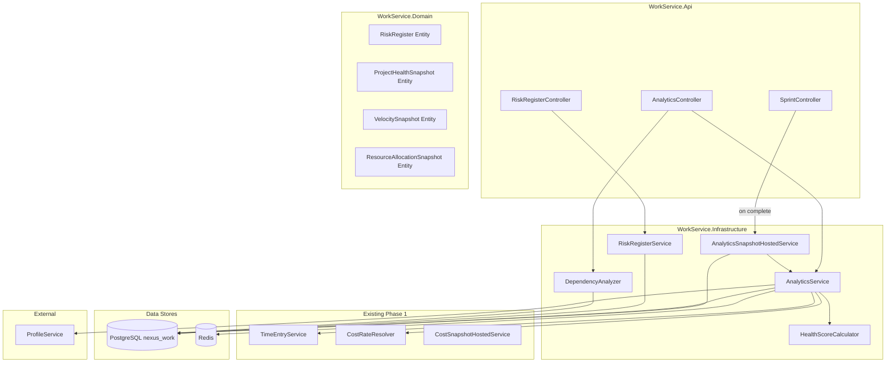
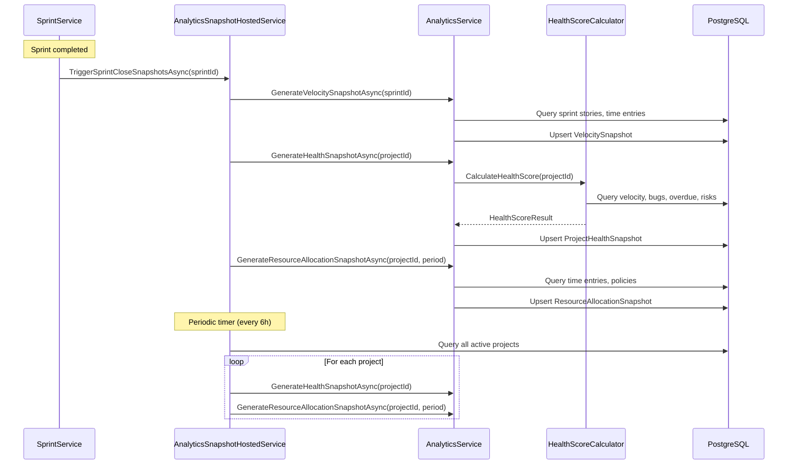
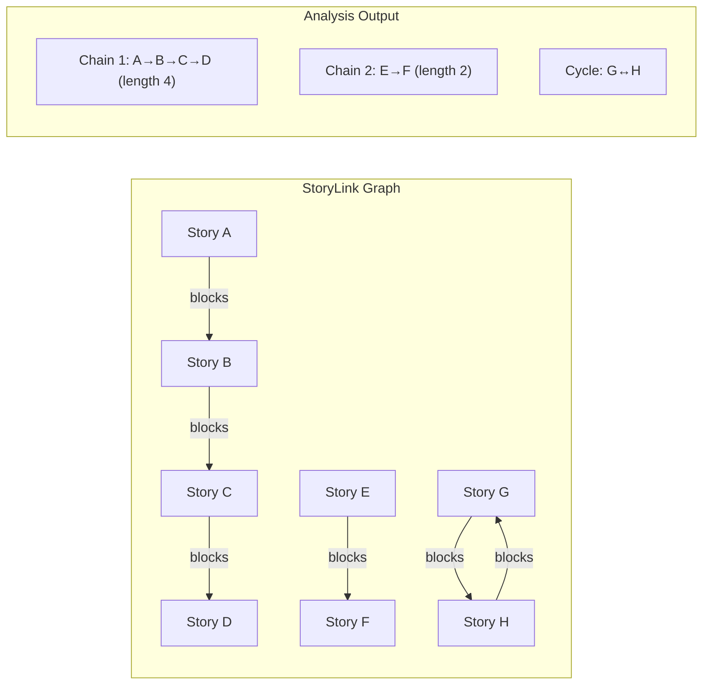
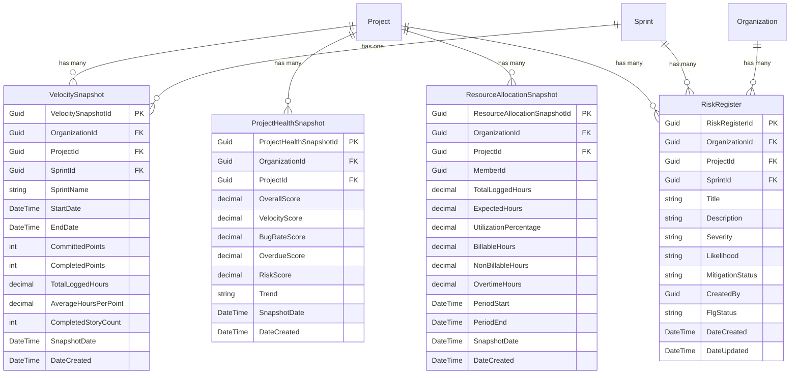

# Design Document — Analytics & Reporting

## Overview

This design adds an analytics and reporting layer (Phase 2) to the existing WorkService, building on top of the Phase 1 time tracking, cost data, sprint, story, and project entities. The feature introduces four new domain entities (`RiskRegister`, `ProjectHealthSnapshot`, `VelocitySnapshot`, `ResourceAllocationSnapshot`), a new `AnalyticsController`, a new `RiskRegisterController`, new service and repository interfaces, and a background hosted service for snapshot generation.

All new entities follow established WorkService patterns: `IOrganizationEntity` for org-scoping, `FlgStatus` soft-delete (where applicable), EF Core global query filters, `ApiResponse<T>` envelope, FluentValidation, and Redis outbox for cross-service events.

### Key Design Decisions

1. **Hybrid query strategy** — Simple metrics (bug counts, dependency graphs, active allocations) are computed in real-time. Expensive calculations (velocity trends, health scores, cost trends) are served from pre-aggregated snapshots.
2. **Snapshot triggers are dual** — Snapshots are generated both on sprint completion (event-driven via `SprintService.CompleteAsync`) and on a configurable periodic timer (default 6 hours) via `AnalyticsSnapshotHostedService`.
3. **Health score is a weighted composite** — `overallScore = velocityScore × 0.30 + bugRateScore × 0.25 + overdueScore × 0.25 + riskScore × 0.20`. Each sub-score is 0–100. When data is missing, a neutral 50 is used.
4. **Dependency analysis uses graph traversal** — `StoryLink` records with `LinkType = "blocks"` / `"is_blocked_by"` are traversed using DFS to find chains and detect cycles.
5. **RiskRegister is a first-class CRUD entity** — It has its own controller, repository, and service, following the same pattern as Story/Task/Sprint.
6. **Error codes 4060–4065** — Continuing the established numbering after time tracking codes (4050–4056).
7. **Snapshot idempotence** — Re-generating a snapshot for the same sprint/period overwrites the existing record, producing identical values.
8. **Dashboard endpoint aggregates from snapshots** — The `/analytics/dashboard` endpoint reads the latest snapshots and falls back to real-time only when no snapshot exists.

## Architecture

### High-Level Component Diagram



### Snapshot Generation Flow



### Dependency Analysis Flow



## Components and Interfaces

### Domain Layer — New Interfaces

#### Repository Interfaces

```
Domain/Interfaces/Repositories/RiskRegisters/IRiskRegisterRepository.cs
Domain/Interfaces/Repositories/VelocitySnapshots/IVelocitySnapshotRepository.cs
Domain/Interfaces/Repositories/ProjectHealthSnapshots/IProjectHealthSnapshotRepository.cs
Domain/Interfaces/Repositories/ResourceAllocationSnapshots/IResourceAllocationSnapshotRepository.cs
```

#### Service Interfaces

```
Domain/Interfaces/Services/Analytics/IAnalyticsService.cs
Domain/Interfaces/Services/Analytics/IHealthScoreCalculator.cs
Domain/Interfaces/Services/Analytics/IDependencyAnalyzer.cs
Domain/Interfaces/Services/Analytics/IAnalyticsSnapshotService.cs
Domain/Interfaces/Services/RiskRegisters/IRiskRegisterService.cs
```

### IRiskRegisterRepository

```csharp
public interface IRiskRegisterRepository
{
    Task<RiskRegister?> GetByIdAsync(Guid riskRegisterId, CancellationToken ct = default);
    Task<RiskRegister> AddAsync(RiskRegister risk, CancellationToken ct = default);
    Task UpdateAsync(RiskRegister risk, CancellationToken ct = default);
    Task<(IEnumerable<RiskRegister> Items, int TotalCount)> ListAsync(
        Guid organizationId, Guid projectId, Guid? sprintId,
        string? severity, string? mitigationStatus,
        int page, int pageSize, CancellationToken ct = default);
    Task<int> CountActiveByProjectAsync(Guid projectId, CancellationToken ct = default);
    Task<IEnumerable<RiskRegister>> GetActiveByProjectAsync(Guid projectId, CancellationToken ct = default);
}
```

### IVelocitySnapshotRepository

```csharp
public interface IVelocitySnapshotRepository
{
    Task<VelocitySnapshot> AddOrUpdateAsync(VelocitySnapshot snapshot, CancellationToken ct = default);
    Task<IEnumerable<VelocitySnapshot>> GetByProjectAsync(
        Guid projectId, int count, CancellationToken ct = default);
    Task<VelocitySnapshot?> GetBySprintAsync(Guid sprintId, CancellationToken ct = default);
}
```

### IProjectHealthSnapshotRepository

```csharp
public interface IProjectHealthSnapshotRepository
{
    Task<ProjectHealthSnapshot> AddAsync(ProjectHealthSnapshot snapshot, CancellationToken ct = default);
    Task<ProjectHealthSnapshot?> GetLatestByProjectAsync(Guid projectId, CancellationToken ct = default);
    Task<IEnumerable<ProjectHealthSnapshot>> GetHistoryByProjectAsync(
        Guid projectId, int count, CancellationToken ct = default);
}
```

### IResourceAllocationSnapshotRepository

```csharp
public interface IResourceAllocationSnapshotRepository
{
    Task<ResourceAllocationSnapshot> AddOrUpdateAsync(
        ResourceAllocationSnapshot snapshot, CancellationToken ct = default);
    Task<IEnumerable<ResourceAllocationSnapshot>> GetByProjectAsync(
        Guid projectId, DateTime periodStart, DateTime periodEnd,
        CancellationToken ct = default);
}
```

### IAnalyticsService

```csharp
public interface IAnalyticsService
{
    // Velocity
    Task<IEnumerable<VelocitySnapshotResponse>> GetVelocityTrendsAsync(
        Guid projectId, int sprintCount, CancellationToken ct = default);
    Task GenerateVelocitySnapshotAsync(Guid sprintId, CancellationToken ct = default);

    // Resource Management
    Task<IEnumerable<ResourceManagementResponse>> GetResourceManagementAsync(
        Guid orgId, DateTime? dateFrom, DateTime? dateTo, Guid? departmentId,
        CancellationToken ct = default);

    // Resource Utilization
    Task<IEnumerable<ResourceUtilizationDetailResponse>> GetResourceUtilizationAsync(
        Guid projectId, DateTime? dateFrom, DateTime? dateTo,
        CancellationToken ct = default);
    Task GenerateResourceAllocationSnapshotAsync(
        Guid projectId, DateTime periodStart, DateTime periodEnd,
        CancellationToken ct = default);

    // Project Cost
    Task<ProjectCostAnalyticsResponse> GetProjectCostAnalyticsAsync(
        Guid projectId, DateTime? dateFrom, DateTime? dateTo,
        CancellationToken ct = default);

    // Project Health
    Task<ProjectHealthResponse> GetProjectHealthAsync(
        Guid projectId, bool includeHistory, CancellationToken ct = default);
    Task GenerateHealthSnapshotAsync(Guid projectId, CancellationToken ct = default);

    // Bug Metrics
    Task<BugMetricsResponse> GetBugMetricsAsync(
        Guid projectId, Guid? sprintId, CancellationToken ct = default);

    // Dashboard
    Task<DashboardSummaryResponse> GetDashboardAsync(
        Guid projectId, CancellationToken ct = default);

    // Snapshot Status
    Task<SnapshotStatusResponse> GetSnapshotStatusAsync(CancellationToken ct = default);
}
```

### IHealthScoreCalculator

A pure calculation service — receives pre-fetched data and returns scores. No database calls.

```csharp
public interface IHealthScoreCalculator
{
    /// <summary>
    /// Calculates the composite health score from sub-scores.
    /// Each sub-score is 0–100. Missing data yields a neutral 50.
    /// overallScore = velocity × 0.30 + bugRate × 0.25 + overdue × 0.25 + risk × 0.20
    /// </summary>
    HealthScoreResult Calculate(
        IEnumerable<VelocitySnapshot> recentVelocity,
        int openBugCount, int totalActiveStories,
        int overdueStoryCount, int totalStoriesWithDueDate,
        IEnumerable<RiskRegister> activeRisks);

    /// <summary>
    /// Determines trend by comparing current score to previous.
    /// improving: current > previous + 5
    /// declining: current < previous - 5
    /// stable: otherwise
    /// </summary>
    string DetermineTrend(decimal currentScore, decimal? previousScore);
}
```

### IDependencyAnalyzer

A pure graph analysis service — receives story links and returns analysis results.

```csharp
public interface IDependencyAnalyzer
{
    /// <summary>
    /// Analyzes story dependencies from StoryLink records.
    /// Returns blocking chains, blocked stories, and circular dependencies.
    /// </summary>
    DependencyAnalysisResult Analyze(
        IEnumerable<StoryLink> links,
        IEnumerable<Story> stories,
        Guid? filterSprintId = null);
}
```

### IAnalyticsSnapshotService

```csharp
public interface IAnalyticsSnapshotService
{
    /// <summary>
    /// Triggered when a sprint is completed. Generates velocity, health, and resource snapshots.
    /// </summary>
    Task TriggerSprintCloseSnapshotsAsync(Guid sprintId, CancellationToken ct = default);

    /// <summary>
    /// Periodic generation of health and resource snapshots for all active projects.
    /// </summary>
    Task GeneratePeriodicSnapshotsAsync(CancellationToken ct = default);
}
```

### IRiskRegisterService

```csharp
public interface IRiskRegisterService
{
    Task<RiskRegisterResponse> CreateAsync(Guid orgId, Guid userId, CreateRiskRequest request, CancellationToken ct = default);
    Task<RiskRegisterResponse> UpdateAsync(Guid riskId, UpdateRiskRequest request, CancellationToken ct = default);
    Task DeleteAsync(Guid riskId, CancellationToken ct = default);
    Task<PaginatedResponse<RiskRegisterResponse>> ListAsync(
        Guid orgId, Guid projectId, Guid? sprintId,
        string? severity, string? mitigationStatus,
        int page, int pageSize, CancellationToken ct = default);
}
```

### API Controllers

#### AnalyticsController — `api/v1/analytics`

| Method | Path | Auth | Attribute | Description |
|--------|------|------|-----------|-------------|
| GET | `/velocity` | Bearer | — | Sprint velocity trends |
| GET | `/resource-management` | Bearer | — | Cross-project resource allocation |
| GET | `/resource-utilization` | Bearer | — | Per-project resource utilization |
| GET | `/project-cost` | Bearer | — | Project cost analytics with burn rate |
| GET | `/project-health` | Bearer | — | Project health score |
| GET | `/dependencies` | Bearer | — | Backlog dependency analysis |
| GET | `/bugs` | Bearer | — | Bug metrics per sprint/project |
| GET | `/dashboard` | Bearer | — | Consolidated dashboard summary |
| GET | `/snapshot-status` | Bearer | DeptLead | Snapshot generation status |

#### RiskRegisterController — `api/v1/analytics/risks`

| Method | Path | Auth | Attribute | Description |
|--------|------|------|-----------|-------------|
| POST | `/` | Bearer | DeptLead | Create risk register entry |
| PUT | `/{riskId}` | Bearer | DeptLead | Update risk register entry |
| DELETE | `/{riskId}` | Bearer | DeptLead | Soft-delete risk register entry |
| GET | `/` | Bearer | — | List/filter risk register entries |

### Integration with Existing SprintService

When `SprintService.CompleteAsync` is called, it will additionally invoke `IAnalyticsSnapshotService.TriggerSprintCloseSnapshotsAsync(sprintId)` to generate velocity, health, and resource allocation snapshots for the completed sprint's project. This call is fire-and-forget with error logging — snapshot generation failure does not block sprint completion.

### Health Score Calculation Algorithm

```
velocityScore:
  - Take last 3 completed sprints' VelocitySnapshots
  - For each: ratio = completedPoints / committedPoints (capped at 1.0)
  - velocityScore = average(ratios) × 100
  - If no sprints: velocityScore = 50 (neutral)

bugRateScore:
  - bugRate = openBugCount / totalActiveStories × 100
  - bugRateScore = max(0, 100 - bugRate)
  - If no stories: bugRateScore = 50 (neutral)

overdueScore:
  - overdueRate = overdueStoryCount / totalStoriesWithDueDate × 100
  - overdueScore = max(0, 100 - overdueRate)
  - If no stories with due dates: overdueScore = 50 (neutral)

riskScore:
  - severityWeights: Critical=4, High=3, Medium=2, Low=1
  - weightedRiskSum = sum(weight for each active risk)
  - maxExpectedRisk = 20 (configurable normalization factor)
  - riskScore = max(0, 100 - (weightedRiskSum / maxExpectedRisk × 100))
  - If no risks: riskScore = 100

overallScore = velocityScore × 0.30 + bugRateScore × 0.25 + overdueScore × 0.25 + riskScore × 0.20

trend:
  - Compare overallScore to previous snapshot's overallScore
  - improving: current > previous + 5
  - declining: current < previous - 5
  - stable: otherwise
```

### Dependency Analysis Algorithm

```
Input: StoryLink records where LinkType = "blocks" or "is_blocked_by"

1. Build adjacency list (directed graph):
   - For "blocks": edge from SourceStoryId → TargetStoryId
   - For "is_blocked_by": edge from TargetStoryId → SourceStoryId

2. Find all chains (DFS from root nodes — stories with no incoming edges):
   - For each root, DFS to find the longest path
   - Record chain as ordered list of story IDs
   - Mark criticalPath = true if any story in chain is in an active sprint

3. Detect circular dependencies (cycle detection via DFS coloring):
   - WHITE = unvisited, GRAY = in current path, BLACK = fully processed
   - If we visit a GRAY node, we've found a cycle
   - Record the cycle as the set of story IDs in the back-edge path

4. Find blocked stories:
   - Stories with at least one incoming "is_blocked_by" link
     where the blocking story status ≠ "Done"

5. If sprintId filter provided:
   - Only include stories assigned to that sprint via SprintStory
```

## Data Models

### Entity Relationship Diagram



### VelocitySnapshot Entity

```csharp
public class VelocitySnapshot : IOrganizationEntity
{
    public Guid VelocitySnapshotId { get; set; } = Guid.NewGuid();
    public Guid OrganizationId { get; set; }
    public Guid ProjectId { get; set; }
    public Guid SprintId { get; set; }
    public string SprintName { get; set; } = string.Empty;
    public DateTime StartDate { get; set; }
    public DateTime EndDate { get; set; }
    public int CommittedPoints { get; set; }
    public int CompletedPoints { get; set; }
    public decimal TotalLoggedHours { get; set; }
    public decimal? AverageHoursPerPoint { get; set; }
    public int CompletedStoryCount { get; set; }
    public DateTime SnapshotDate { get; set; } = DateTime.UtcNow;
    public DateTime DateCreated { get; set; } = DateTime.UtcNow;
}
```

### ProjectHealthSnapshot Entity

```csharp
public class ProjectHealthSnapshot : IOrganizationEntity
{
    public Guid ProjectHealthSnapshotId { get; set; } = Guid.NewGuid();
    public Guid OrganizationId { get; set; }
    public Guid ProjectId { get; set; }
    public decimal OverallScore { get; set; }
    public decimal VelocityScore { get; set; }
    public decimal BugRateScore { get; set; }
    public decimal OverdueScore { get; set; }
    public decimal RiskScore { get; set; }
    public string Trend { get; set; } = "stable"; // improving, stable, declining
    public DateTime SnapshotDate { get; set; } = DateTime.UtcNow;
    public DateTime DateCreated { get; set; } = DateTime.UtcNow;
}
```

### ResourceAllocationSnapshot Entity

```csharp
public class ResourceAllocationSnapshot : IOrganizationEntity
{
    public Guid ResourceAllocationSnapshotId { get; set; } = Guid.NewGuid();
    public Guid OrganizationId { get; set; }
    public Guid ProjectId { get; set; }
    public Guid MemberId { get; set; }
    public decimal TotalLoggedHours { get; set; }
    public decimal ExpectedHours { get; set; }
    public decimal UtilizationPercentage { get; set; }
    public decimal BillableHours { get; set; }
    public decimal NonBillableHours { get; set; }
    public decimal OvertimeHours { get; set; }
    public DateTime PeriodStart { get; set; }
    public DateTime PeriodEnd { get; set; }
    public DateTime SnapshotDate { get; set; } = DateTime.UtcNow;
    public DateTime DateCreated { get; set; } = DateTime.UtcNow;
}
```

### RiskRegister Entity

```csharp
public class RiskRegister : IOrganizationEntity
{
    public Guid RiskRegisterId { get; set; } = Guid.NewGuid();
    public Guid OrganizationId { get; set; }
    public Guid ProjectId { get; set; }
    public Guid? SprintId { get; set; }
    public string Title { get; set; } = string.Empty;
    public string? Description { get; set; }
    public string Severity { get; set; } = "Medium"; // Low, Medium, High, Critical
    public string Likelihood { get; set; } = "Medium"; // Low, Medium, High
    public string MitigationStatus { get; set; } = "Open"; // Open, Mitigating, Mitigated, Accepted
    public Guid CreatedBy { get; set; }
    public string FlgStatus { get; set; } = "A";
    public DateTime DateCreated { get; set; } = DateTime.UtcNow;
    public DateTime DateUpdated { get; set; } = DateTime.UtcNow;
}
```

### EF Core Configuration (WorkDbContext additions)

New `DbSet` properties:

```csharp
public DbSet<VelocitySnapshot> VelocitySnapshots => Set<VelocitySnapshot>();
public DbSet<ProjectHealthSnapshot> ProjectHealthSnapshots => Set<ProjectHealthSnapshot>();
public DbSet<ResourceAllocationSnapshot> ResourceAllocationSnapshots => Set<ResourceAllocationSnapshot>();
public DbSet<RiskRegister> RiskRegisters => Set<RiskRegister>();
```

Key indexes:
- `VelocitySnapshot`: Unique on `(ProjectId, SprintId)` for upsert; index on `(ProjectId, EndDate)` for trend queries
- `ProjectHealthSnapshot`: Index on `(ProjectId, SnapshotDate)` for latest/history queries
- `ResourceAllocationSnapshot`: Unique on `(ProjectId, MemberId, PeriodStart, PeriodEnd)` for upsert; index on `(ProjectId, PeriodStart)`
- `RiskRegister`: Index on `(OrganizationId, ProjectId)`, `(OrganizationId, ProjectId, SprintId)`, filter `FlgStatus = 'A'`

Query filters:
- `VelocitySnapshot`: org-scoped only (no FlgStatus — snapshots are immutable)
- `ProjectHealthSnapshot`: org-scoped only
- `ResourceAllocationSnapshot`: org-scoped only
- `RiskRegister`: org-scoped + `FlgStatus == "A"`

### New Error Codes (added to ErrorCodes.cs)

```csharp
// Analytics & Reporting (4060–4065)
public const string InvalidAnalyticsParameter = "INVALID_ANALYTICS_PARAMETER";
public const int InvalidAnalyticsParameterValue = 4060;
public const string InvalidRiskSeverity = "INVALID_RISK_SEVERITY";
public const int InvalidRiskSeverityValue = 4061;
public const string InvalidRiskLikelihood = "INVALID_RISK_LIKELIHOOD";
public const int InvalidRiskLikelihoodValue = 4062;
public const string InvalidMitigationStatus = "INVALID_MITIGATION_STATUS";
public const int InvalidMitigationStatusValue = 4063;
public const string RiskNotFound = "RISK_NOT_FOUND";
public const int RiskNotFoundValue = 4064;
public const string SnapshotGenerationFailed = "SNAPSHOT_GENERATION_FAILED";
public const int SnapshotGenerationFailedValue = 4065;
```

### Application Layer — DTOs

#### Analytics DTOs

```
Application/DTOs/Analytics/VelocitySnapshotResponse.cs
Application/DTOs/Analytics/ResourceManagementResponse.cs
Application/DTOs/Analytics/ResourceUtilizationDetailResponse.cs
Application/DTOs/Analytics/ProjectCostAnalyticsResponse.cs
Application/DTOs/Analytics/ProjectHealthResponse.cs
Application/DTOs/Analytics/HealthScoreResult.cs
Application/DTOs/Analytics/DependencyAnalysisResponse.cs
Application/DTOs/Analytics/DependencyChain.cs
Application/DTOs/Analytics/BlockedStoryDetail.cs
Application/DTOs/Analytics/BugMetricsResponse.cs
Application/DTOs/Analytics/BugTrendItem.cs
Application/DTOs/Analytics/DashboardSummaryResponse.cs
Application/DTOs/Analytics/SnapshotStatusResponse.cs
Application/DTOs/Analytics/ProjectBreakdownItem.cs
```

#### Risk Register DTOs

```
Application/DTOs/RiskRegisters/CreateRiskRequest.cs
Application/DTOs/RiskRegisters/UpdateRiskRequest.cs
Application/DTOs/RiskRegisters/RiskRegisterResponse.cs
```

### FluentValidation Validators

```
Application/Validators/CreateRiskRequestValidator.cs
Application/Validators/UpdateRiskRequestValidator.cs
```

Key validation rules:
- `CreateRiskRequest`: `Title` required (max 200), `ProjectId` required, `Severity` in `[Low, Medium, High, Critical]`, `Likelihood` in `[Low, Medium, High]`, `MitigationStatus` in `[Open, Mitigating, Mitigated, Accepted]`
- `UpdateRiskRequest`: Same enum validations, all fields optional for partial update

### Infrastructure Layer — File Layout

```
Infrastructure/Repositories/RiskRegisters/RiskRegisterRepository.cs
Infrastructure/Repositories/VelocitySnapshots/VelocitySnapshotRepository.cs
Infrastructure/Repositories/ProjectHealthSnapshots/ProjectHealthSnapshotRepository.cs
Infrastructure/Repositories/ResourceAllocationSnapshots/ResourceAllocationSnapshotRepository.cs
Infrastructure/Services/Analytics/AnalyticsService.cs
Infrastructure/Services/Analytics/HealthScoreCalculator.cs
Infrastructure/Services/Analytics/DependencyAnalyzer.cs
Infrastructure/Services/Analytics/AnalyticsSnapshotHostedService.cs
Infrastructure/Services/RiskRegisters/RiskRegisterService.cs
```

### DI Registration (additions to DependencyInjection.cs)

```csharp
// Repositories
services.AddScoped<IRiskRegisterRepository, RiskRegisterRepository>();
services.AddScoped<IVelocitySnapshotRepository, VelocitySnapshotRepository>();
services.AddScoped<IProjectHealthSnapshotRepository, ProjectHealthSnapshotRepository>();
services.AddScoped<IResourceAllocationSnapshotRepository, ResourceAllocationSnapshotRepository>();

// Services
services.AddScoped<IAnalyticsService, AnalyticsService>();
services.AddScoped<IHealthScoreCalculator, HealthScoreCalculator>();
services.AddScoped<IDependencyAnalyzer, DependencyAnalyzer>();
services.AddScoped<IRiskRegisterService, RiskRegisterService>();
services.AddScoped<IAnalyticsSnapshotService, AnalyticsSnapshotHostedService>();

// Background service
services.AddHostedService<AnalyticsSnapshotHostedService>();
```

### Redis Key Patterns (new)

| Pattern | Purpose | TTL |
|---------|---------|-----|
| `analytics:snapshot_status` | Last snapshot run metadata (JSON) | 24 hours |
| `analytics:dashboard:{projectId}` | Cached dashboard summary | 5 minutes |

### Frontend Components (React/TypeScript)

#### Zustand Stores

- `useAnalyticsStore` — Velocity trends, resource management, utilization, cost analytics, health, bugs, dashboard
- `useRiskRegisterStore` — CRUD for risk register entries
- `useDependencyStore` — Dependency analysis results

#### Key Components

- `VelocityTrendChart` — Line chart of committed vs completed points across sprints
- `ResourceManagementTable` — Table of member allocations with project breakdown
- `ResourceUtilizationChart` — Bar chart of per-member utilization percentages
- `ProjectCostDashboard` — Cost analytics with burn rate and cost trend line
- `ProjectHealthGauge` — Circular gauge showing overall health score with sub-score breakdown
- `RiskRegisterTable` — Paginated table with severity/status filters, create/edit modals
- `DependencyGraph` — Visual graph of blocking chains (using a graph library like react-flow)
- `BugMetricsPanel` — Bug counts, bug rate, severity breakdown, trend chart
- `AnalyticsDashboard` — Consolidated view using the dashboard endpoint, rendering all widgets

## Correctness Properties

*A property is a characteristic or behavior that should hold true across all valid executions of a system — essentially, a formal statement about what the system should do. Properties serve as the bridge between human-readable specifications and machine-verifiable correctness guarantees.*

### Property 1: Velocity query returns ordered snapshots with all required fields

*For any* project with N completed sprints (N ≥ 1) and a requested `sprintCount` in [1, 50], the velocity endpoint shall return min(N, sprintCount) VelocitySnapshot records ordered by `endDate` descending, and each record shall contain non-null `sprintId`, `sprintName`, `startDate`, `endDate`, `committedPoints`, `completedPoints`, `totalLoggedHours`, `averageHoursPerPoint`, and `completedStoryCount`.

**Validates: Requirements 1.1, 1.2**

### Property 2: Invalid sprintCount is rejected

*For any* integer `sprintCount` where `sprintCount < 1` or `sprintCount > 50`, the velocity endpoint shall return error code `INVALID_ANALYTICS_PARAMETER` (4060).

**Validates: Requirements 1.5**

### Property 3: Resource management returns all members with complete allocation data

*For any* organization and date range where at least one member has logged time, the resource management endpoint shall return an entry for every member with time entries in that period, and each entry shall contain `memberId`, `memberName`, `departmentId`, `totalLoggedHours`, a non-empty `projectBreakdown`, and `capacityUtilizationPercentage`.

**Validates: Requirements 2.1, 2.2**

### Property 4: Capacity utilization percentage formula

*For any* member with `totalLoggedHours` and a TimePolicy with `requiredHoursPerDay`, the `capacityUtilizationPercentage` shall equal `(totalLoggedHours / (requiredHoursPerDay × workingDays)) × 100`, where `workingDays` is the count of non-weekend days in the date range.

**Validates: Requirements 2.3**

### Property 5: Project breakdown is sorted by hours descending

*For any* member who has logged time on multiple projects, the `projectBreakdown` array shall be sorted by `hoursLogged` in descending order.

**Validates: Requirements 2.4**

### Property 6: Resource utilization returns complete per-member data

*For any* project and date range where at least one member has logged time, the resource utilization endpoint shall return an entry for every member with time entries on that project, and each entry shall contain `memberId`, `memberName`, `totalLoggedHours`, `expectedHours`, `utilizationPercentage`, `billableHours`, `nonBillableHours`, and `overtimeHours`.

**Validates: Requirements 3.1, 3.2**

### Property 7: Snapshot-to-realtime consistency

*For any* project, date range, and set of time entries, the utilization values in a `ResourceAllocationSnapshot` shall be identical to the values computed in real-time from the same time entry data and TimePolicy.

**Validates: Requirements 3.6**

### Property 8: Cost analytics response completeness

*For any* project with approved billable time entries, the project cost endpoint shall return `totalCost`, `totalBillableHours`, `totalNonBillableHours`, `burnRatePerDay`, a non-empty `costByMember` array, and a non-empty `costByDepartment` array, where `totalCost` equals the sum of all individual member costs.

**Validates: Requirements 4.1**

### Property 9: Burn rate calculation

*For any* project with `totalCost > 0` and a date range spanning at least one working day, `burnRatePerDay` shall equal `totalCost / workingDays`, where `workingDays` is the count of non-weekend days in the range.

**Validates: Requirements 4.2**

### Property 10: Cost trend ordering

*For any* project with historical CostSnapshot records, the `costTrend` array shall contain all snapshots ordered by `snapshotDate` ascending.

**Validates: Requirements 4.3**

### Property 11: Cost calculation confluence

*For any* set of time entries for a project, the computed `totalCost` shall be identical regardless of the order in which the time entries are processed.

**Validates: Requirements 4.5**

### Property 12: Health sub-score calculations

*For any* set of velocity snapshots, bug counts, overdue story counts, and risk register entries:
- `velocityScore` = average(completedPoints / committedPoints) × 100 across the last 3 sprints (capped at 100, neutral 50 if no sprints)
- `bugRateScore` = max(0, 100 − (openBugCount / totalActiveStories × 100)) (neutral 50 if no stories)
- `overdueScore` = max(0, 100 − (overdueCount / totalWithDueDate × 100)) (neutral 50 if no due dates)
- `riskScore` = max(0, 100 − (weightedRiskSum / 20 × 100)) where weights are Critical=4, High=3, Medium=2, Low=1 (100 if no risks)

**Validates: Requirements 5.2, 5.3, 5.4, 5.5**

### Property 13: Health overall score weighted average

*For any* four sub-scores (velocityScore, bugRateScore, overdueScore, riskScore) each in [0, 100], the `overallScore` shall equal `velocityScore × 0.30 + bugRateScore × 0.25 + overdueScore × 0.25 + riskScore × 0.20`, and the result shall be in [0, 100].

**Validates: Requirements 5.6**

### Property 14: Health trend determination

*For any* pair of scores (current, previous), the trend shall be `"improving"` if current > previous + 5, `"declining"` if current < previous − 5, and `"stable"` otherwise. When no previous snapshot exists, the trend shall be `"stable"`.

**Validates: Requirements 5.7**

### Property 15: Health history ordering and limit

*For any* project with N health snapshots (N ≥ 1) and `history=true`, the endpoint shall return min(N, 10) snapshots ordered by `snapshotDate` descending.

**Validates: Requirements 5.9**

### Property 16: Risk creation preserves all fields

*For any* valid `CreateRiskRequest` with a valid `projectId`, `title`, `severity`, `likelihood`, and `mitigationStatus`, creating a risk shall produce a `RiskRegister` record where all submitted fields match the request, `FlgStatus` is `"A"`, and the record is retrievable via the list endpoint.

**Validates: Requirements 6.1**

### Property 17: Risk soft-delete excludes from queries

*For any* active `RiskRegister` record, soft-deleting it (setting `FlgStatus` to `"D"`) shall cause it to no longer appear in list queries filtered by the same project.

**Validates: Requirements 6.3**

### Property 18: Risk list filtering

*For any* set of active `RiskRegister` records with varying `severity` and `mitigationStatus` values, filtering by a specific `severity` and/or `mitigationStatus` shall return only records matching all specified filter criteria.

**Validates: Requirements 6.4**

### Property 19: Risk enum validation

*For any* string value not in the valid set for `severity` (Low, Medium, High, Critical), `likelihood` (Low, Medium, High), or `mitigationStatus` (Open, Mitigating, Mitigated, Accepted), the service shall return the corresponding error code (4061, 4062, or 4063 respectively).

**Validates: Requirements 6.5, 6.6, 6.7**

### Property 20: Risk role-based access control

*For any* user with a role other than DeptLead or OrgAdmin, attempting to create, update, or delete a `RiskRegister` shall return HTTP 403 with error code `INSUFFICIENT_PERMISSIONS` (4032).

**Validates: Requirements 6.8**

### Property 21: Dependency chain identification

*For any* set of `StoryLink` records with `LinkType` = `"blocks"` or `"is_blocked_by"`, the dependency analyzer shall identify all maximal blocking chains by traversing from root nodes (no incoming edges) to leaf nodes (no outgoing edges), and each chain shall include `chainLength` equal to the number of stories, an ordered `stories` array, and `criticalPath` = true if any story is in an active sprint.

**Validates: Requirements 7.2, 7.3**

### Property 22: Blocked story identification

*For any* story with at least one incoming `"is_blocked_by"` link where the blocking story's status is not `"Done"`, that story shall appear in the `blockedStories` array. Stories whose all blockers are `"Done"` shall not appear.

**Validates: Requirements 7.4**

### Property 23: Circular dependency detection

*For any* directed graph of `StoryLink` records containing a cycle, the dependency analyzer shall detect the cycle and include the participating story IDs in the `circularDependencies` array. For any acyclic graph, the `circularDependencies` array shall be empty.

**Validates: Requirements 7.6**

### Property 24: Dependency sprint filtering

*For any* set of story links and a specified `sprintId`, the dependency analysis shall only include stories assigned to that sprint via `SprintStory` records, and chains/blocked stories shall be computed only from the filtered subset.

**Validates: Requirements 7.7**

### Property 25: Bug metrics response completeness and scoping

*For any* project and optional `sprintId`, the bug metrics endpoint shall return `totalBugs`, `openBugs`, `closedBugs`, `reopenedBugs`, `bugRate`, and `bugsBySeverity`. When `sprintId` is provided, counts shall reflect only stories in that sprint. When `sprintId` is omitted, counts shall reflect all stories in the project.

**Validates: Requirements 8.1, 8.3, 8.4**

### Property 26: Bug trend ordering

*For any* project with completed sprints, the `bugTrend` array shall contain bug counts for up to the last 10 completed sprints, ordered by sprint end date ascending.

**Validates: Requirements 8.5**

### Property 27: Sprint-close triggers all snapshot types

*For any* sprint that transitions to `Completed`, the system shall generate a `VelocitySnapshot` for that sprint, a `ProjectHealthSnapshot` for the sprint's project, and a `ResourceAllocationSnapshot` for the sprint's project and period.

**Validates: Requirements 9.1**

### Property 28: Snapshot idempotence

*For any* snapshot type (Velocity, ProjectHealth, ResourceAllocation) and any set of inputs, generating the snapshot twice with the same inputs shall produce identical field values.

**Validates: Requirements 1.6, 9.4**

### Property 29: Dashboard response completeness

*For any* project, the dashboard endpoint shall return a response containing `projectHealth` (with `overallScore` and `trend`), `velocitySnapshot`, `activeBugCount`, `activeRiskCount`, `blockedStoryCount`, `totalProjectCost`, and `burnRatePerDay`.

**Validates: Requirements 10.1**

## Error Handling

### Error Code Summary

| Code | Value | HTTP | Description | Trigger |
|------|-------|------|-------------|---------|
| `INVALID_ANALYTICS_PARAMETER` | 4060 | 400 | Analytics query parameter out of range | `sprintCount < 1` or `> 50`, invalid date ranges |
| `INVALID_RISK_SEVERITY` | 4061 | 400 | Severity not in valid enum | Severity ∉ {Low, Medium, High, Critical} |
| `INVALID_RISK_LIKELIHOOD` | 4062 | 400 | Likelihood not in valid enum | Likelihood ∉ {Low, Medium, High} |
| `INVALID_MITIGATION_STATUS` | 4063 | 400 | Mitigation status not in valid enum | Status ∉ {Open, Mitigating, Mitigated, Accepted} |
| `RISK_NOT_FOUND` | 4064 | 404 | Risk register entry not found | GET/PUT/DELETE with non-existent riskId |
| `SNAPSHOT_GENERATION_FAILED` | 4065 | 500 | Snapshot generation failed | Internal error during snapshot generation |

### Error Handling Strategy

1. **Validation errors** — FluentValidation catches malformed requests before they reach the service layer. Returns `ApiResponse<T>` with `ErrorCode = "VALIDATION_ERROR"` (1000) and detailed `Errors` array.

2. **Domain exceptions** — Each error code has a corresponding `DomainException` subclass (e.g., `RiskNotFoundException`, `InvalidRiskSeverityException`). The `GlobalExceptionHandlerMiddleware` catches these and maps them to the appropriate HTTP status and `ApiResponse<T>` envelope.

3. **Snapshot generation errors** — The `AnalyticsSnapshotHostedService` wraps each project's snapshot generation in a try-catch. On failure, it logs the error with project ID and continues to the next project. The `snapshot-status` endpoint exposes error counts for operational monitoring.

4. **External service failures** — If `ProfileServiceClient` is unavailable when fetching member names for resource management, the service falls back to returning `memberId` without `memberName`. The Polly retry/circuit-breaker policies on the HTTP client handle transient failures.

5. **Missing data gracefully handled** — All analytics endpoints return neutral/zero values when no data exists, never 404. Only the risk register returns 404 for non-existent individual records.

### Exception Classes (new)

```
Domain/Exceptions/InvalidAnalyticsParameterException.cs
Domain/Exceptions/InvalidRiskSeverityException.cs
Domain/Exceptions/InvalidRiskLikelihoodException.cs
Domain/Exceptions/InvalidMitigationStatusException.cs
Domain/Exceptions/RiskNotFoundException.cs
Domain/Exceptions/SnapshotGenerationFailedException.cs
```

Each extends `DomainException` with the appropriate error code and HTTP status.

## Testing Strategy

### Dual Testing Approach

This feature uses both unit tests and property-based tests for comprehensive coverage:

- **Unit tests** — Specific examples, edge cases, integration points, error conditions
- **Property-based tests** — Universal properties across randomized inputs using [FsCheck](https://fscheck.github.io/FsCheck/) (the standard .NET property-based testing library)

### Property-Based Testing Configuration

- **Library**: FsCheck with FsCheck.Xunit integration
- **Minimum iterations**: 100 per property test
- **Tag format**: `// Feature: analytics-reporting, Property {number}: {property_text}`
- **Each correctness property is implemented by a single property-based test**

### Test Organization

```
tests/
  WorkService.Tests/
    Analytics/
      HealthScoreCalculatorTests.cs        — Properties 12, 13, 14
      DependencyAnalyzerTests.cs           — Properties 21, 22, 23, 24
      AnalyticsServiceVelocityTests.cs     — Properties 1, 2, 28
      AnalyticsServiceCostTests.cs         — Properties 8, 9, 10, 11
      AnalyticsServiceResourceTests.cs     — Properties 3, 4, 5, 6, 7
      AnalyticsServiceHealthTests.cs       — Properties 15, 27
      AnalyticsServiceBugTests.cs          — Properties 25, 26
      AnalyticsServiceDashboardTests.cs    — Property 29
      RiskRegisterServiceTests.cs          — Properties 16, 17, 18, 19, 20
```

### Unit Test Focus Areas

- Edge cases: empty projects, no sprints, no time entries, no risks, no story links
- Error conditions: invalid enum values, non-existent IDs, unauthorized roles
- Integration: sprint completion triggering snapshot generation
- Snapshot status endpoint returning correct metadata
- ProfileService fallback when unavailable

### Property Test Focus Areas

The pure calculation services (`HealthScoreCalculator`, `DependencyAnalyzer`, `CostRateResolver`) are the primary targets for property-based testing since they are side-effect-free and accept generated inputs directly.

Service-level properties (e.g., snapshot consistency, CRUD round-trips) use in-memory EF Core with generated test data.

### FsCheck Generators (Custom Arbitraries)

- `ArbVelocitySnapshot` — Generates VelocitySnapshot with valid ranges (points ≥ 0, hours ≥ 0)
- `ArbRiskRegister` — Generates RiskRegister with valid enum values for severity, likelihood, mitigation status
- `ArbStoryLinkGraph` — Generates directed graphs of StoryLink records, including both acyclic and cyclic variants
- `ArbHealthInputs` — Generates tuples of (velocity snapshots, bug counts, overdue counts, risk lists)
- `ArbTimeEntrySet` — Generates sets of TimeEntry records with valid durations and dates
- `ArbSubScores` — Generates four decimal values in [0, 100] for health score weighted average testing
