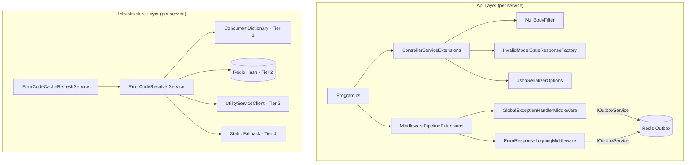

# Design Document: Architecture Hardening

## Overview

This design covers 7 cross-cutting improvements applied uniformly across all 5 backend services (SecurityService, ProfileService, BillingService, WorkService, UtilityService). The changes harden the existing error management pipeline, JSON serialization, and request validation layers without altering the Clean Architecture boundaries or existing API contracts.

All changes are additive or configurational — no existing public interfaces change, no database migrations are needed, and no new inter-service contracts are introduced. The improvements target three areas:

1. **Serialization & Validation** (Requirements 1–3): Null suppression in JSON, NullBodyFilter, InvalidModelStateResponseFactory
2. **Cache Performance** (Requirements 4–5): In-memory Tier 1 cache for error code resolution, background refresh service
3. **Error Observability** (Requirements 6–7): ErrorResponseLoggingMiddleware for ServiceResult-based 5xx, outbox publishing from GlobalExceptionHandlerMiddleware

## Architecture

The changes slot into the existing layered architecture without introducing new layers or cross-cutting concerns:



### Middleware Pipeline Order (Updated)

The only pipeline change is inserting `ErrorResponseLoggingMiddleware` at position #4 (between GlobalExceptionHandler and RateLimiter):

```
Request
  │
  ▼
1. CORS
2. Serilog Request Logging
3. CorrelationIdMiddleware
4. GlobalExceptionHandlerMiddleware  ← now publishes to outbox (Req 7)
5. ErrorResponseLoggingMiddleware    ← NEW (Req 6)
6. RateLimiterMiddleware
7. Routing
8. Authentication
9. Authorization
10. JwtClaimsMiddleware
11. TokenBlacklistMiddleware
12. FirstTimeUserMiddleware / AuthenticatedRateLimiterMiddleware
13. RoleAuthorizationMiddleware
14. OrganizationScopeMiddleware
15. Controller + Filters (NullBodyFilter → FluentValidation → Action)
```

### Error Code Resolution Pipeline (Updated)

The current 3-tier pipeline (Redis → HTTP → Static Fallback) becomes 4-tier with in-memory as Tier 1:

```
Tier 1: ConcurrentDictionary (in-memory)  ← NEW (Req 4)
  ↓ miss
Tier 2: Redis Hash (wep:error_codes_registry, 24h TTL)  ← existing
  ↓ miss or Redis down
Tier 3: HTTP to UtilityService  ← existing
  ↓ miss or UtilityService down
Tier 4: Static MapErrorToResponseCode  ← existing
```

## Components and Interfaces

### Component 1: JSON Null Suppression (Requirement 1)

**Location**: `Program.cs` in each service's Api project

**Change**: Add `DefaultIgnoreCondition = JsonIgnoreCondition.WhenWritingNull` to the `JsonSerializerOptions` configured on `AddControllers()`.

```csharp
// In ControllerServiceExtensions.AddApiControllers()
services.AddControllers(options => { ... })
    .AddJsonOptions(json =>
    {
        json.JsonSerializerOptions.DefaultIgnoreCondition =
            System.Text.Json.Serialization.JsonIgnoreCondition.WhenWritingNull;
    });
```

**Impact**: All `ApiResponse<T>` fields that are null (`errorCode`, `errorValue`, `errors`, `data` on error responses; `errors`, `errorCode`, `errorValue` on success responses) are omitted from the JSON output. No code changes to `ApiResponse<T>` itself — the serializer handles it.

### Component 2: NullBodyFilter (Requirement 2)

**Location**: `Api/Filters/NullBodyFilter.cs` in each service

**Interface**: Inherits `ActionFilterAttribute`, overrides `OnActionExecuting`.

```csharp
public class NullBodyFilter : ActionFilterAttribute
{
    public override void OnActionExecuting(ActionExecutingContext context)
    {
        foreach (var param in context.ActionDescriptor.Parameters)
        {
            if (param.BindingInfo?.BindingSource?.Id == "Body" &&
                context.ActionArguments.TryGetValue(param.Name, out var value) &&
                value == null)
            {
                var correlationId = context.HttpContext.Items["CorrelationId"] as string;
                context.Result = new ObjectResult(new ApiResponse<object>
                {
                    Success = false,
                    ErrorCode = "VALIDATION_ERROR",
                    ErrorValue = 1000,
                    ResponseCode = "99",
                    ResponseDescription = "Validation failed",
                    Message = "Request body is required.",
                    CorrelationId = correlationId
                })
                { StatusCode = 422 };
                return;
            }
        }
    }
}
```

**Registration**: Added as a global filter in `ControllerServiceExtensions.AddApiControllers()`:
```csharp
options.Filters.Add<NullBodyFilter>();
```

**Pipeline position**: Action filters execute before FluentValidation auto-validation, so null bodies are caught first.

### Component 3: InvalidModelStateResponseFactory (Requirement 3)

**Location**: `Api/Extensions/ControllerServiceExtensions.cs` in each service

**Change**: Flip `SuppressModelStateInvalidFilter` from `true` to `false` and configure the factory.

```csharp
// Remove from Program.cs:
// options.SuppressModelStateInvalidFilter = true;

// Add to ControllerServiceExtensions:
services.Configure<ApiBehaviorOptions>(options =>
{
    options.SuppressModelStateInvalidFilter = false;
    options.InvalidModelStateResponseFactory = context =>
    {
        var fieldErrors = context.ModelState
            .Where(e => e.Value?.Errors.Count > 0)
            .SelectMany(e => e.Value!.Errors.Select(err => new
            {
                Field = e.Key,
                Message = err.ErrorMessage
            }))
            .ToList();

        var correlationId = context.HttpContext.Items["CorrelationId"] as string;

        var response = new ApiResponse<object>
        {
            Success = false,
            ErrorCode = "VALIDATION_ERROR",
            ErrorValue = 1000,
            ResponseCode = "96",
            ResponseDescription = "Validation error",
            Message = "Validation error",
            Data = fieldErrors,
            CorrelationId = correlationId
        };

        return new ObjectResult(response) { StatusCode = 422 };
    };
});
```

**Impact**: The `SuppressModelStateInvalidFilter = true` line in each service's `Program.cs` must be removed. The factory in `ControllerServiceExtensions` replaces it.

### Component 4: In-Memory Cache Tier (Requirement 4)

**Location**: `Infrastructure/Services/ErrorCodeResolver/ErrorCodeResolverService.cs` in each service

**Interface change to `IErrorCodeResolverService`**:
```csharp
public interface IErrorCodeResolverService
{
    Task<(string ResponseCode, string ResponseDescription)> ResolveAsync(
        string errorCode, CancellationToken ct = default);
    Task RefreshCacheAsync(CancellationToken ct = default);  // NEW
    void ClearMemoryCache();  // NEW
}
```

**Implementation additions**:
```csharp
private readonly ConcurrentDictionary<string, (string ResponseCode, string ResponseDescription)>
    _memoryCache = new();

public async Task<(string ResponseCode, string ResponseDescription)> ResolveAsync(
    string errorCode, CancellationToken ct = default)
{
    // Tier 1: In-memory
    if (_memoryCache.TryGetValue(errorCode, out var cached))
        return cached;

    // Tier 2: Redis (existing)
    // ... on hit, populate _memoryCache

    // Tier 3: HTTP (existing)
    // ... on hit, populate _memoryCache + Redis

    // Tier 4: Static fallback (existing)
    return FallbackResolve(errorCode);
}

public async Task RefreshCacheAsync(CancellationToken ct = default)
{
    // Fetch all error codes from UtilityService
    // Clear and repopulate _memoryCache and Redis
}

public void ClearMemoryCache() => _memoryCache.Clear();
```

**Registration**: `ErrorCodeResolverService` is already registered as a singleton (it holds the `ConcurrentDictionary`). No DI changes needed.

### Component 5: ErrorCodeCacheRefreshService (Requirement 5)

**Location**: `Infrastructure/Services/BackgroundServices/ErrorCodeCacheRefreshService.cs` in each service

```csharp
public class ErrorCodeCacheRefreshService : BackgroundService
{
    private readonly IServiceScopeFactory _scopeFactory;
    private readonly ILogger<ErrorCodeCacheRefreshService> _logger;
    private static readonly TimeSpan RefreshInterval = TimeSpan.FromHours(24);

    protected override async Task ExecuteAsync(CancellationToken stoppingToken)
    {
        while (!stoppingToken.IsCancellationRequested)
        {
            try
            {
                using var scope = _scopeFactory.CreateScope();
                var resolver = scope.ServiceProvider
                    .GetRequiredService<IErrorCodeResolverService>();
                await resolver.RefreshCacheAsync(stoppingToken);
            }
            catch (Exception ex)
            {
                _logger.LogWarning(ex,
                    "Error code cache refresh failed. Will retry in {Interval}.",
                    RefreshInterval);
            }

            await Task.Delay(RefreshInterval, stoppingToken);
        }
    }
}
```

**Registration**: `builder.Services.AddHostedService<ErrorCodeCacheRefreshService>();` in each service's infrastructure DI setup. Coexists with existing `ErrorCodeValidationHostedService`.

### Component 6: ErrorResponseLoggingMiddleware (Requirement 6)

**Location**: `Api/Middleware/ErrorResponseLoggingMiddleware.cs` in each service

```csharp
public class ErrorResponseLoggingMiddleware
{
    private readonly RequestDelegate _next;
    private readonly ILogger<ErrorResponseLoggingMiddleware> _logger;
    private const string ServiceName = "SecurityService"; // varies per service

    public async Task InvokeAsync(HttpContext context, IOutboxService outboxService)
    {
        await _next(context);

        if (context.Response.StatusCode >= 500 &&
            !context.Items.ContainsKey("ErrorLogged"))
        {
            try
            {
                var correlationId = context.Items["CorrelationId"]?.ToString();
                var tenantId = context.Items["TenantId"]?.ToString();

                var envelope = new
                {
                    Type = "error",
                    Payload = new
                    {
                        TenantId = tenantId,
                        ServiceName,
                        ErrorCode = $"HTTP_{context.Response.StatusCode}",
                        Message = $"{context.Request.Method} {context.Request.Path} returned {context.Response.StatusCode}",
                        CorrelationId = correlationId,
                        Severity = "Error"
                    },
                    Timestamp = DateTime.UtcNow
                };

                await outboxService.PublishAsync(
                    RedisKeys.Outbox,
                    JsonSerializer.Serialize(envelope));
            }
            catch (Exception ex)
            {
                _logger.LogError(ex,
                    "Failed to publish error log for {StatusCode} response.",
                    context.Response.StatusCode);
            }
        }
    }
}
```

### Component 7: GlobalExceptionHandlerMiddleware Outbox Publishing (Requirement 7)

**Location**: Existing `Api/Middleware/GlobalExceptionHandlerMiddleware.cs` in each service

**Change**: Resolve `IOutboxService` from `HttpContext.RequestServices` and publish after writing the error response.

```csharp
// In HandleDomainExceptionAsync, after WriteAsJsonAsync:
if (ex is not RateLimitExceededException)
{
    await PublishErrorLogAsync(context, ex.ErrorCode, ex.Message,
        "Warning", ex.StackTrace);
}

// In HandleUnhandledExceptionAsync, after WriteAsJsonAsync:
var innerMessage = ex.InnerException?.Message ?? ex.Message;
await PublishErrorLogAsync(context, "INTERNAL_ERROR",
    $"{ex.GetType().Name}: {innerMessage}", "Error", ex.StackTrace);

// Shared helper:
private async Task PublishErrorLogAsync(HttpContext context,
    string errorCode, string message, string severity, string? stackTrace)
{
    try
    {
        var outboxService = context.RequestServices.GetService<IOutboxService>();
        if (outboxService is null) return;

        var envelope = new
        {
            Type = "error",
            Payload = new
            {
                TenantId = context.Items["TenantId"]?.ToString(),
                ServiceName,
                ErrorCode = errorCode,
                Message = message,
                StackTrace = stackTrace,
                CorrelationId = context.Items["CorrelationId"]?.ToString(),
                Severity = severity
            },
            Timestamp = DateTime.UtcNow
        };

        await outboxService.PublishAsync(
            RedisKeys.Outbox,
            JsonSerializer.Serialize(envelope));

        context.Items["ErrorLogged"] = true;
    }
    catch (Exception pubEx)
    {
        _logger.LogError(pubEx,
            "Failed to publish error log to outbox for {ErrorCode}.", errorCode);
    }
}
```

**Key design decision**: `IOutboxService` is resolved from `HttpContext.RequestServices` (not constructor-injected) because middleware is singleton-scoped while `IOutboxService` may be scoped. This matches the existing pattern for resolving `IErrorCodeResolverService`.

## Data Models

### Outbox Envelope (Error Log)

Published by both `GlobalExceptionHandlerMiddleware` and `ErrorResponseLoggingMiddleware`:

```json
{
  "type": "error",
  "payload": {
    "tenantId": "guid-string | null",
    "serviceName": "SecurityService",
    "errorCode": "CUSTOMER_ALREADY_EXISTS | INTERNAL_ERROR | HTTP_500",
    "message": "Human-readable error description",
    "stackTrace": "stack trace string (only from GlobalExceptionHandler)",
    "correlationId": "guid-string",
    "severity": "Warning | Error"
  },
  "timestamp": "2025-01-15T10:30:00Z"
}
```

| Field | Source | GlobalExceptionHandler | ErrorResponseLogging |
|-------|--------|----------------------|---------------------|
| `type` | Hardcoded | `"error"` | `"error"` |
| `tenantId` | `HttpContext.Items["TenantId"]` | ✓ | ✓ |
| `serviceName` | Hardcoded constant | ✓ | ✓ |
| `errorCode` | Exception or HTTP status | From `DomainException.ErrorCode` or `"INTERNAL_ERROR"` | `"HTTP_{statusCode}"` |
| `message` | Exception or request info | From exception (includes inner for unhandled) | `"{Method} {Path} returned {StatusCode}"` |
| `stackTrace` | Exception | Full stack trace | Not included |
| `correlationId` | `HttpContext.Items["CorrelationId"]` | ✓ | ✓ |
| `severity` | Logic | `"Warning"` for DomainException, `"Error"` for unhandled | `"Error"` |
| `timestamp` | `DateTime.UtcNow` | ✓ | ✓ |

### In-Memory Cache Entry

```csharp
ConcurrentDictionary<string, (string ResponseCode, string ResponseDescription)>
```

Key: error code string (e.g., `"CUSTOMER_ALREADY_EXISTS"`)
Value: tuple of `(ResponseCode, ResponseDescription)` (e.g., `("06", "Customer already exists")`)

### ApiResponse<T> (Unchanged)

No changes to the `ApiResponse<T>` class itself. The null suppression is handled by `JsonSerializerOptions` at the serializer level.

### InvalidModelStateResponseFactory Field Error Object

```json
{ "field": "PhoneNo", "message": "PhoneNo is required." }
```

This is an anonymous type serialized into the `data` array of the `ApiResponse`. No new DTO class needed.

## Correctness Properties

*A property is a characteristic or behavior that should hold true across all valid executions of a system — essentially, a formal statement about what the system should do. Properties serve as the bridge between human-readable specifications and machine-verifiable correctness guarantees.*

### Property 1: Null field suppression in serialized JSON

*For any* `ApiResponse<T>` instance with an arbitrary combination of null and non-null fields, serializing it with the configured `JsonSerializerOptions` SHALL produce JSON where every null field is absent and every non-null field is present.

**Validates: Requirements 1.2, 1.3**

### Property 2: NullBodyFilter null-body gating

*For any* `ActionExecutingContext` with a `[FromBody]` parameter, the `NullBodyFilter` SHALL set `context.Result` to a 422 `ApiResponse` with `errorCode: "VALIDATION_ERROR"` if and only if the body parameter value is null. When the body is non-null, `context.Result` SHALL remain unset.

**Validates: Requirements 2.2, 2.3**

### Property 3: InvalidModelStateResponseFactory structured output

*For any* `ActionContext` with a non-empty `ModelState` containing field errors and any `correlationId` string in `HttpContext.Items`, the `InvalidModelStateResponseFactory` SHALL produce a 422 `ObjectResult` containing an `ApiResponse` with `responseCode: "96"`, `errorCode: "VALIDATION_ERROR"`, `errorValue: 1000`, a `data` array with one `{ field, message }` entry per ModelState error, and the `correlationId` from `HttpContext.Items`.

**Validates: Requirements 3.2, 3.3, 3.4**

### Property 4: Tiered cache resolution with promotion

*For any* error code string, `ResolveAsync` SHALL return the value from the highest-priority available tier (in-memory → Redis → HTTP → static fallback), and after resolution SHALL populate all higher-priority tiers that had a miss. Specifically: a Redis hit promotes to in-memory; an HTTP hit promotes to both in-memory and Redis.

**Validates: Requirements 4.2, 4.3, 4.4**

### Property 5: Static fallback resolution

*For any* error code string where in-memory, Redis, and HTTP tiers all miss or fail, `ResolveAsync` SHALL return the same `(ResponseCode, ResponseDescription)` as the static `MapErrorToResponseCode` method for that error code.

**Validates: Requirements 4.5**

### Property 6: ErrorResponseLoggingMiddleware conditional publish

*For any* HTTP response, the `ErrorResponseLoggingMiddleware` SHALL publish an error log to `IOutboxService` if and only if the response status code is >= 500 AND `HttpContext.Items["ErrorLogged"]` is not set. The published envelope SHALL contain `type: "error"`, the correct `serviceName`, `errorCode: "HTTP_{statusCode}"`, `correlationId`, `tenantId`, and `severity: "Error"`.

**Validates: Requirements 6.2, 6.3, 6.4**

### Property 7: ErrorResponseLoggingMiddleware outbox failure resilience

*For any* exception thrown by `IOutboxService.PublishAsync` during error response logging, the middleware SHALL catch the exception, log it locally, and allow the HTTP response to proceed to the client without modification.

**Validates: Requirements 6.6**

### Property 8: GlobalExceptionHandler DomainException outbox publish

*For any* `DomainException` (excluding `RateLimitExceededException`) with any `errorCode`, `message`, and `stackTrace`, the `GlobalExceptionHandlerMiddleware` SHALL publish an error log to `IOutboxService` with envelope containing `type: "error"`, the exception's `errorCode`, `message`, `stackTrace`, `correlationId` from `HttpContext.Items`, `tenantId` from `HttpContext.Items`, `severity: "Warning"`, and `timestamp` as UTC. After publishing, it SHALL set `HttpContext.Items["ErrorLogged"] = true`.

**Validates: Requirements 7.2, 7.5, 7.7**

### Property 9: GlobalExceptionHandler unhandled exception outbox publish

*For any* unhandled exception (not `DomainException`) with any type, message, and inner exception, the `GlobalExceptionHandlerMiddleware` SHALL publish an error log to `IOutboxService` with envelope containing `errorCode: "INTERNAL_ERROR"`, a message including the inner exception detail, `severity: "Error"`, `stackTrace`, `correlationId`, `tenantId`, and `timestamp`. After publishing, it SHALL set `HttpContext.Items["ErrorLogged"] = true`.

**Validates: Requirements 7.3, 7.5, 7.7**

### Property 10: GlobalExceptionHandler outbox failure resilience

*For any* exception thrown by `IOutboxService.PublishAsync` during exception handling, the `GlobalExceptionHandlerMiddleware` SHALL catch the publish failure, log it locally, and still return the structured `ApiResponse` error response to the client.

**Validates: Requirements 7.6**

## Error Handling

### Outbox Publish Failures

Both `GlobalExceptionHandlerMiddleware` and `ErrorResponseLoggingMiddleware` wrap outbox publishing in try/catch. If Redis is down or `IOutboxService.PublishAsync` throws:
- The failure is logged locally via `ILogger`
- The HTTP response to the client is unaffected
- The `ErrorLogged` flag is NOT set (since publishing failed), but this is safe because the response has already been written

### Cache Refresh Failures

`ErrorCodeCacheRefreshService` catches all exceptions from `RefreshCacheAsync`:
- Logs a warning with the exception details
- Continues the `while` loop — retries on the next 24-hour cycle
- The service never crashes or stops the host

### ErrorCodeResolverService Tier Failures

Each tier is wrapped in its own try/catch:
- Redis failure → falls through to HTTP tier
- HTTP failure → falls through to static fallback
- Static fallback → always succeeds (switch expression with default case)

### NullBodyFilter Edge Cases

- Multiple `[FromBody]` parameters: The filter iterates all parameters, catches the first null
- No `[FromBody]` parameters: The filter does nothing (no body parameters to check)
- `CorrelationId` not set: Falls back to `null` in the response (CorrelationIdMiddleware runs before filters, so this shouldn't happen in practice)

## Testing Strategy

### Property-Based Tests (xUnit + FsCheck)

Each correctness property maps to a single property-based test with minimum 100 iterations. The property-based testing library is **FsCheck** (FsCheck.Xunit) since the project uses C# and xUnit.

| Property | Test Target | Generator Strategy |
|----------|-------------|-------------------|
| P1: Null suppression | `JsonSerializer.Serialize` with configured options | Generate `ApiResponse<object>` with random null/non-null field combinations |
| P2: NullBodyFilter gating | `NullBodyFilter.OnActionExecuting` | Generate mock `ActionExecutingContext` with null/non-null body params |
| P3: ModelState factory | `InvalidModelStateResponseFactory` delegate | Generate random `ModelStateDictionary` with varying fields/errors |
| P4: Tiered resolution | `ErrorCodeResolverService.ResolveAsync` | Generate random error codes, configure mock tiers with random hit/miss |
| P5: Static fallback | `ErrorCodeResolverService.ResolveAsync` | Generate random error codes, all mocks fail |
| P6: ErrorResponseLogging | `ErrorResponseLoggingMiddleware.InvokeAsync` | Generate random status codes (1xx–5xx), random ErrorLogged flag |
| P7: ErrorResponseLogging resilience | `ErrorResponseLoggingMiddleware.InvokeAsync` | Generate random exceptions from IOutboxService mock |
| P8: GlobalExceptionHandler DomainException | `GlobalExceptionHandlerMiddleware.InvokeAsync` | Generate random DomainExceptions (varying errorCode, message) |
| P9: GlobalExceptionHandler unhandled | `GlobalExceptionHandlerMiddleware.InvokeAsync` | Generate random exceptions with varying inner exceptions |
| P10: GlobalExceptionHandler resilience | `GlobalExceptionHandlerMiddleware.InvokeAsync` | Generate random exceptions + IOutboxService mock throws |

Tag format: `Feature: architecture-hardening, Property {N}: {title}`

### Unit Tests (xUnit)

Focused on specific examples and edge cases not covered by property tests:

- **NullBodyFilter**: Action with no `[FromBody]` params (pass-through), action with multiple body params
- **InvalidModelStateResponseFactory**: Empty ModelState (should not trigger), single field with multiple errors
- **ErrorCodeCacheRefreshService**: Initial refresh on startup, 24h interval timing, UtilityService unavailable on startup
- **RateLimitExceededException exclusion**: Verify GlobalExceptionHandler skips outbox publish for rate limit exceptions
- **ErrorCodeResolverService.ClearMemoryCache**: Verify cache is cleared and repopulated

### Integration Tests

- **Middleware pipeline order**: Send null body request → verify NullBodyFilter response (not FluentValidation)
- **End-to-end validation**: Send invalid request → verify 422 with field errors in `data` array
- **SuppressModelStateInvalidFilter = false**: Verify controller action is not invoked on invalid ModelState
- **Both hosted services coexist**: Verify `ErrorCodeValidationHostedService` and `ErrorCodeCacheRefreshService` both start without conflict
