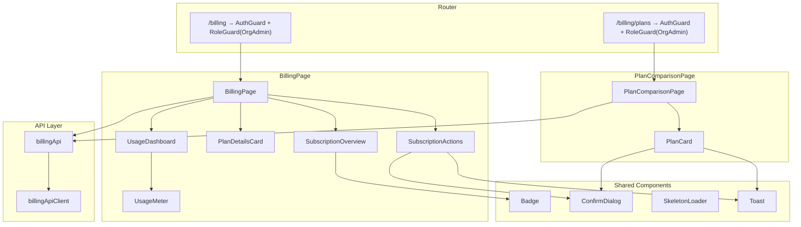
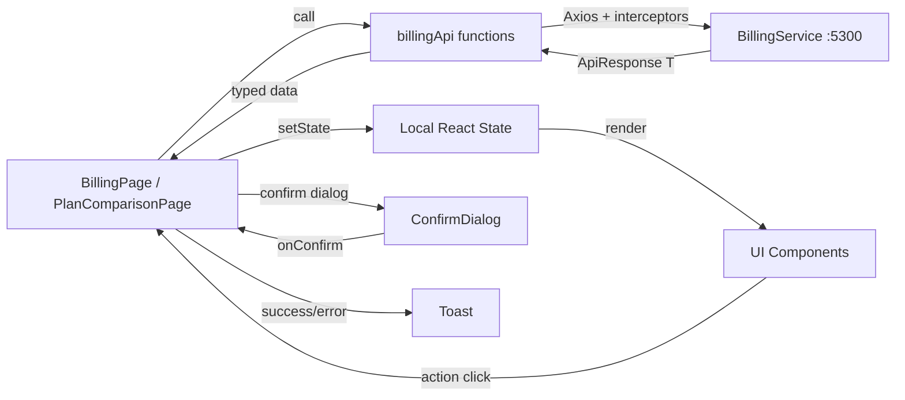

# Design Document — Billing Frontend

## Overview

The Billing Frontend is a new feature module at `src/frontend/src/features/billing/` that adds subscription management, plan comparison, and usage monitoring pages to the Nexus 2.0 React SPA. It consumes the BillingService REST API (port 5300) and follows the established frontend patterns: typed Axios API client, Zustand-compatible state flow, React Router v6 with auth/role guards, Tailwind CSS styling, and shared UI components (Badge, Modal, ConfirmDialog, Toast, SkeletonLoader).

The module provides two pages:
- **BillingPage** (`/billing`) — Subscription overview, plan details card, usage dashboard with progress bars, and subscription action buttons (upgrade, downgrade, cancel, resubscribe).
- **PlanComparisonPage** (`/billing/plans`) — Side-by-side plan grid with feature comparison, pricing, and plan selection (upgrade/downgrade/select).

Both pages are restricted to the OrgAdmin role via `RoleGuard`. The module adds a `CreditCard` sidebar nav item, billing-specific error code mappings, a `VITE_BILLING_API_URL` environment variable, and TypeScript types mirroring the BillingService DTOs.

Key design decisions:
- **No new Zustand store** — Billing data is fetched on-demand via `billingApi` calls within page components using local `useState`/`useEffect`. Billing data is not globally shared and doesn't need cross-component reactivity.
- **Reuse shared components** — Badge (subscription status), ConfirmDialog (cancel/upgrade/downgrade confirmation), SkeletonLoader (loading states), Toast (success/error feedback), Modal (if needed).
- **Error handling via existing `mapErrorCode`** — All 12 billing error codes are added to the existing `errorCodeMap` in `errorMapping.ts`.
- **Responsive Tailwind grid** — Plan comparison uses `grid-cols-1 md:grid-cols-2 lg:grid-cols-4` for responsive layout.

## Architecture

### Component Hierarchy



### Data Flow



## Components and Interfaces

### File Structure

```
src/frontend/src/features/billing/
├── pages/
│   ├── BillingPage.tsx              # Main billing page — subscription overview + usage + actions
│   └── PlanComparisonPage.tsx       # Side-by-side plan comparison grid
├── components/
│   ├── SubscriptionOverview.tsx     # Plan name, status badge, billing period, notices
│   ├── PlanDetailsCard.tsx          # Current plan feature limits and pricing
│   ├── UsageDashboard.tsx           # Container for usage meters
│   ├── UsageMeter.tsx               # Single usage metric progress bar
│   ├── SubscriptionActions.tsx      # Upgrade/cancel/resubscribe buttons
│   └── PlanCard.tsx                 # Single plan card for comparison grid
└── utils/
    └── formatBytes.ts               # Byte-to-human-readable conversion
```

Additional files outside the billing module:
- `src/frontend/src/types/billing.ts` — TypeScript types for billing DTOs
- `src/frontend/src/api/billingApi.ts` — Typed API client for BillingService

### API Client (`src/frontend/src/api/billingApi.ts`)

Follows the same pattern as `securityApi.ts`:

```typescript
import { createApiClient } from './client';
import { env } from '@/utils/env';
import type {
    PlanResponse,
    SubscriptionResponse,
    SubscriptionDetailResponse,
    UsageResponse,
    CreateSubscriptionRequest,
    UpgradeSubscriptionRequest,
    DowngradeSubscriptionRequest,
} from '@/types/billing';

const client = createApiClient({ baseURL: env.BILLING_API_URL });

export const billingApi = {
    getPlans: (): Promise<PlanResponse[]> =>
        client.get('/api/v1/plans').then((r) => r.data),

    getCurrentSubscription: (): Promise<SubscriptionDetailResponse> =>
        client.get('/api/v1/subscriptions/current').then((r) => r.data),

    createSubscription: (data: CreateSubscriptionRequest): Promise<SubscriptionResponse> =>
        client.post('/api/v1/subscriptions', data).then((r) => r.data),

    upgradeSubscription: (data: UpgradeSubscriptionRequest): Promise<SubscriptionResponse> =>
        client.patch('/api/v1/subscriptions/upgrade', data).then((r) => r.data),

    downgradeSubscription: (data: DowngradeSubscriptionRequest): Promise<SubscriptionResponse> =>
        client.patch('/api/v1/subscriptions/downgrade', data).then((r) => r.data),

    cancelSubscription: (): Promise<SubscriptionResponse> =>
        client.post('/api/v1/subscriptions/cancel').then((r) => r.data),

    getUsage: (): Promise<UsageResponse> =>
        client.get('/api/v1/usage').then((r) => r.data),
};
```

### Component Interfaces

```typescript
// SubscriptionOverview.tsx
interface SubscriptionOverviewProps {
    subscription: SubscriptionResponse;
}
// Displays: plan name, status Badge, billing period dates, trial end date,
// scheduled downgrade notice, cancellation notice.

// PlanDetailsCard.tsx
interface PlanDetailsCardProps {
    plan: PlanResponse;
}
// Displays: plan name, pricing, feature limits table (max members, depts,
// stories/month, sprint analytics, custom workflows, priority support).
// Includes "Compare Plans" link to /billing/plans.

// UsageDashboard.tsx
interface UsageDashboardProps {
    metrics: UsageMetric[];
}
// Container that renders a UsageMeter for each metric.

// UsageMeter.tsx
interface UsageMeterProps {
    metricName: string;
    currentValue: number;
    limit: number;
    percentUsed: number;
}
// Renders: display name, "X / Y" or "X / Unlimited", progress bar with
// color coding (blue ≤80%, amber >80%, red >95%), percentage label.
// storage_bytes metric uses formatBytes() for human-readable values.

// SubscriptionActions.tsx
interface SubscriptionActionsProps {
    subscription: SubscriptionResponse;
    onCancelSuccess: () => void;
}
// Renders action buttons based on subscription status:
// - Active/Trialing: "Upgrade Plan" link, "Cancel Subscription" button (if not Free)
// - Cancelled/Expired: "Resubscribe" link
// Cancel opens ConfirmDialog, calls billingApi.cancelSubscription(), shows toast.

// PlanCard.tsx
interface PlanCardProps {
    plan: PlanResponse;
    currentPlanTierLevel: number | null;  // null if no subscription
    subscriptionStatus: string | null;     // null if no subscription
    isCurrentPlan: boolean;
    onUpgrade: (planId: string, planName: string) => void;
    onDowngrade: (planId: string, planName: string) => void;
    onSelect: (planId: string, planName: string) => void;
    loading: boolean;
}
// Displays: plan name, pricing, feature rows, action button.
// Current plan gets "Current Plan" badge + distinct border.
// Button label: "Upgrade" (higher tier), "Downgrade" (lower tier),
// "Select Plan" (no subscription), "Current Plan" (disabled, current).
```

### Utility Functions

```typescript
// src/frontend/src/features/billing/utils/formatBytes.ts
export function formatBytes(bytes: number): string;
// Converts bytes to human-readable string: "0 B", "1.2 KB", "3.5 MB", "2.1 GB", etc.
// Uses 1024-based units.

// Usage meter display name mapping
const metricDisplayNames: Record<string, string> = {
    active_members: 'Active Members',
    stories_created: 'Stories Created',
    storage_bytes: 'Storage',
};
```

### Router Integration

Two new routes added to the OrgAdmin-only `RoleGuard` section in `router.tsx`:

```typescript
// Inside the AuthGuard > AppShell > RoleGuard(OrgAdmin) children:
{ path: '/billing', element: <BillingPage /> },
{ path: '/billing/plans', element: <PlanComparisonPage /> },
```

### Sidebar Navigation Update

Add to the `fallbackNavigation` array in `Sidebar.tsx`:

```typescript
{
    navigationItemId: 'f-12',
    label: 'Billing',
    path: '/billing',
    icon: 'CreditCard',
    sortOrder: 12,
    parentId: null,
    minPermissionLevel: 100,  // OrgAdmin only
    isEnabled: true,
    children: [],
}
```

Add `CreditCard` to the `iconMap` and the lucide-react import.

### Environment Variable Addition

In `src/frontend/src/utils/env.ts`:
- Add `'VITE_BILLING_API_URL'` to the `REQUIRED_VARS` array
- Add `BILLING_API_URL: import.meta.env.VITE_BILLING_API_URL ?? ''` to the `env` object

In `src/frontend/.env.example`:
- Add `VITE_BILLING_API_URL=http://localhost:5300`

### Error Code Mapping Additions

12 new entries added to `errorCodeMap` in `src/frontend/src/utils/errorMapping.ts`:

| Error Code | User Message |
|---|---|
| `SUBSCRIPTION_ALREADY_EXISTS` | "Your organization already has an active subscription." |
| `PLAN_NOT_FOUND` | "The selected plan is no longer available." |
| `SUBSCRIPTION_NOT_FOUND` | "No subscription found for your organization." |
| `INVALID_UPGRADE_PATH` | "Cannot upgrade to this plan. It must be a higher tier than your current plan." |
| `NO_ACTIVE_SUBSCRIPTION` | "No active subscription found." |
| `INVALID_DOWNGRADE_PATH` | "Cannot downgrade to this plan. It must be a lower tier than your current plan." |
| `USAGE_EXCEEDS_PLAN_LIMITS` | "Your current usage exceeds the limits of the selected plan. Reduce usage before downgrading." |
| `SUBSCRIPTION_ALREADY_CANCELLED` | "Subscription is already cancelled." |
| `TRIAL_EXPIRED` | "Your trial period has ended." |
| `PAYMENT_PROVIDER_ERROR` | "Payment processing failed. Please try again or contact support." |
| `FEATURE_NOT_AVAILABLE` | "This feature is not included in your current plan." |
| `USAGE_LIMIT_REACHED` | "Your organization has reached the usage limit for this feature." |

### Badge Status Colors for Billing

The existing `Badge` component's `statusColors` map already includes `Active` (green) and `Cancelled` (red). The following entries need to be added:

| Status | Color |
|---|---|
| `Trialing` | `bg-blue-100 text-blue-700 dark:bg-blue-900 dark:text-blue-300` |
| `PastDue` | `bg-orange-100 text-orange-700 dark:bg-orange-900 dark:text-orange-300` |
| `Expired` | `bg-gray-200 text-gray-600 dark:bg-gray-700 dark:text-gray-400` |

## Data Models

### TypeScript Types (`src/frontend/src/types/billing.ts`)

All types mirror the BillingService C# DTOs with TypeScript conventions (camelCase, string for GUIDs, string for DateTimes).

```typescript
// Plan tier response from GET /api/v1/plans
export interface PlanResponse {
    planId: string;
    planName: string;
    planCode: string;
    tierLevel: number;
    maxTeamMembers: number;
    maxDepartments: number;
    maxStoriesPerMonth: number;
    featuresJson: string | null;
    priceMonthly: number;
    priceYearly: number;
}

// Parsed structure of PlanResponse.featuresJson
export interface PlanFeatures {
    sprintAnalytics: string;    // "none" | "basic" | "full"
    customWorkflows: boolean;
    prioritySupport: boolean;
}

// Subscription response from mutation endpoints
export interface SubscriptionResponse {
    subscriptionId: string;
    organizationId: string;
    planId: string;
    planName: string;
    planCode: string;
    status: SubscriptionStatus;
    currentPeriodStart: string;
    currentPeriodEnd: string | null;
    trialEndDate: string | null;
    cancelledAt: string | null;
    scheduledPlanId: string | null;
    scheduledPlanName: string | null;
}

// Composite response from GET /api/v1/subscriptions/current
export interface SubscriptionDetailResponse {
    subscription: SubscriptionResponse;
    plan: PlanResponse;
    usage: UsageResponse;
}

// Usage response from GET /api/v1/usage
export interface UsageResponse {
    metrics: UsageMetric[];
}

export interface UsageMetric {
    metricName: string;
    currentValue: number;
    limit: number;
    percentUsed: number;
}

// Request DTOs
export interface CreateSubscriptionRequest {
    planId: string;
    paymentMethodToken: string | null;
}

export interface UpgradeSubscriptionRequest {
    newPlanId: string;
}

export interface DowngradeSubscriptionRequest {
    newPlanId: string;
}

// Subscription status union
export type SubscriptionStatus =
    | 'Active'
    | 'Trialing'
    | 'PastDue'
    | 'Cancelled'
    | 'Expired';
```

### Data Flow Summary

| API Call | HTTP Method & Path | Request Body | Response Type |
|---|---|---|---|
| `billingApi.getPlans()` | `GET /api/v1/plans` | — | `PlanResponse[]` |
| `billingApi.getCurrentSubscription()` | `GET /api/v1/subscriptions/current` | — | `SubscriptionDetailResponse` |
| `billingApi.createSubscription(data)` | `POST /api/v1/subscriptions` | `{ planId, paymentMethodToken }` | `SubscriptionResponse` |
| `billingApi.upgradeSubscription(data)` | `PATCH /api/v1/subscriptions/upgrade` | `{ newPlanId }` | `SubscriptionResponse` |
| `billingApi.downgradeSubscription(data)` | `PATCH /api/v1/subscriptions/downgrade` | `{ newPlanId }` | `SubscriptionResponse` |
| `billingApi.cancelSubscription()` | `POST /api/v1/subscriptions/cancel` | — | `SubscriptionResponse` |
| `billingApi.getUsage()` | `GET /api/v1/usage` | — | `UsageResponse` |


## Correctness Properties

*A property is a characteristic or behavior that should hold true across all valid executions of a system — essentially, a formal statement about what the system should do. Properties serve as the bridge between human-readable specifications and machine-verifiable correctness guarantees.*

### Property 1: Usage meter color coding by threshold

*For any* `percentUsed` value between 0 and 100, the UsageMeter component should apply the correct CSS color class: default/blue when `percentUsed ≤ 80`, warning/amber when `80 < percentUsed ≤ 95`, and danger/red when `percentUsed > 95`.

**Validates: Requirements 5.4, 5.5, 5.6**

### Property 2: formatBytes produces correct human-readable output

*For any* non-negative integer byte value, `formatBytes(bytes)` should return a string containing a numeric value followed by a unit suffix (B, KB, MB, GB, TB), where the numeric value is less than 1024 for the chosen unit (except TB), and converting the displayed value back to bytes should approximate the original input.

**Validates: Requirements 5.7**

### Property 3: Subscription action button visibility by status and plan

*For any* subscription status and plan code combination, the SubscriptionActions component should render exactly the correct set of buttons: "Upgrade Plan" and "Change Plan" when status is Active or Trialing; "Cancel Subscription" when status is Active or Trialing and plan is not Free; "Resubscribe" when status is Cancelled or Expired; and no cancel button when status is Cancelled, Expired, or PastDue.

**Validates: Requirements 6.1, 6.2, 6.7, 6.8**

### Property 4: Plans rendered in ascending tier order

*For any* array of PlanResponse objects with distinct tierLevel values, the PlanComparisonPage should render plan cards in strictly ascending `tierLevel` order from left to right (or top to bottom on mobile).

**Validates: Requirements 7.3**

### Property 5: Plan card button label determined by tier comparison

*For any* current subscription tier level and target plan tier level, the PlanCard should display: "Upgrade" when target tier > current tier, "Downgrade" when target tier < current tier, "Current Plan" (disabled) when tiers are equal, and "Select Plan" when no active subscription exists (current tier is null).

**Validates: Requirements 7.9, 7.10**

### Property 6: featuresJson round-trip parsing

*For any* valid `PlanFeatures` object (with `sprintAnalytics` as a string, `customWorkflows` as a boolean, and `prioritySupport` as a boolean), serializing it to JSON and parsing it back should produce an equivalent `PlanFeatures` object.

**Validates: Requirements 7.11, 12.4**

### Property 7: Billing error code mapping completeness

*For any* billing error code in the set {SUBSCRIPTION_ALREADY_EXISTS, PLAN_NOT_FOUND, SUBSCRIPTION_NOT_FOUND, INVALID_UPGRADE_PATH, NO_ACTIVE_SUBSCRIPTION, INVALID_DOWNGRADE_PATH, USAGE_EXCEEDS_PLAN_LIMITS, SUBSCRIPTION_ALREADY_CANCELLED, TRIAL_EXPIRED, PAYMENT_PROVIDER_ERROR, FEATURE_NOT_AVAILABLE, USAGE_LIMIT_REACHED}, calling `mapErrorCode(errorCode)` should return a non-empty string that is not the fallback message "Something went wrong. Please try again."

**Validates: Requirements 11.1**

### Property 8: Usage meter renders all required information

*For any* UsageMetric with a non-negative `currentValue`, non-negative `limit`, and `percentUsed` between 0 and 100, the UsageMeter component should render: the metric display name, the current value, the limit (or "Unlimited" when limit is 0), and the percentage label.

**Validates: Requirements 5.1, 5.2, 5.3**

## Error Handling

### Error Handling Strategy

All billing API errors flow through the existing Axios interceptor pipeline in `client.ts`, which unwraps `ApiResponse<T>` and throws typed `ApiError` instances. Billing page components catch these errors and use `mapErrorCode()` to display user-friendly messages via the Toast system.

| Error Scenario | Error Code | Handling |
|---|---|---|
| No subscription found | `SUBSCRIPTION_NOT_FOUND` | BillingPage shows empty state with "Choose a Plan" CTA |
| Network/server error | `NETWORK_ERROR` / `INTERNAL_ERROR` | Error state with "Retry" button |
| Subscription already exists | `SUBSCRIPTION_ALREADY_EXISTS` | Error toast |
| Plan not found | `PLAN_NOT_FOUND` | Error toast |
| Invalid upgrade path | `INVALID_UPGRADE_PATH` | Error toast |
| Invalid downgrade path | `INVALID_DOWNGRADE_PATH` | Error toast |
| Usage exceeds plan limits | `USAGE_EXCEEDS_PLAN_LIMITS` | Error toast |
| No active subscription | `NO_ACTIVE_SUBSCRIPTION` | Error toast |
| Already cancelled | `SUBSCRIPTION_ALREADY_CANCELLED` | Error toast |
| Payment provider failure | `PAYMENT_PROVIDER_ERROR` | Error toast |
| Feature not available | `FEATURE_NOT_AVAILABLE` | Error toast |
| Usage limit reached | `USAGE_LIMIT_REACHED` | Error toast |

### Loading States

- BillingPage: SkeletonLoader with `variant="form"` while `getCurrentSubscription()` is pending.
- PlanComparisonPage: SkeletonLoader with `variant="card"` (×4) while `getPlans()` and `getCurrentSubscription()` are pending.
- Action buttons: Disabled with spinner while mutation requests are in-flight. Prevents duplicate submissions.

### Edge Cases

- `SUBSCRIPTION_NOT_FOUND` on BillingPage: Treated as "no subscription" state, not an error. Shows empty state with plan selection CTA.
- `getCurrentSubscription()` fails on PlanComparisonPage: Plans still render with "Select Plan" buttons on all cards (graceful degradation).
- `featuresJson` is null: Default to `{ sprintAnalytics: 'none', customWorkflows: false, prioritySupport: false }`.

## Testing Strategy

### Dual Testing Approach

The billing frontend uses both unit tests and property-based tests for comprehensive coverage:

- **Unit tests** (Vitest + React Testing Library): Verify specific UI behaviors, integration points, error handling flows, and edge cases. Focus on component rendering, user interactions, and API call verification with mocked responses.
- **Property-based tests** (Vitest + fast-check): Verify universal properties that hold across all valid inputs. Focus on pure logic functions and component rendering rules that apply to generated data.

### Property-Based Testing Configuration

- Library: `fast-check` (already in devDependencies)
- Framework: Vitest
- Minimum iterations: 100 per property test
- Each property test must reference its design document property with a tag comment:
  `// Feature: billing-frontend, Property {number}: {property_text}`
- Each correctness property is implemented by a single property-based test

### Unit Test Coverage

| Area | Tests |
|---|---|
| `billingApi` | Verify each function calls the correct HTTP method/path with correct payload (mocked Axios) |
| `BillingPage` | Loading skeleton, subscription display, empty state on SUBSCRIPTION_NOT_FOUND, error state with retry, cancel flow with ConfirmDialog |
| `PlanComparisonPage` | Loading skeleton, plan grid rendering, upgrade/downgrade/select flows with ConfirmDialog, error toasts |
| `UsageMeter` | Unlimited display (limit=0), warning/danger colors, storage_bytes formatting |
| `SubscriptionActions` | Button visibility per status/plan, cancel confirmation dialog, loading state during action |
| `PlanCard` | Current plan badge, button labels per tier comparison, feature row rendering |
| `Sidebar` | Billing nav item visible for OrgAdmin, hidden for other roles |
| `errorMapping` | All 12 billing error codes resolve to correct messages |
| `env.ts` | VITE_BILLING_API_URL included in validation |

### Property Test Coverage

| Property | Test Description |
|---|---|
| Property 1 | Generate random `percentUsed` (0–100), verify correct color class on UsageMeter |
| Property 2 | Generate random non-negative integers, verify `formatBytes` output format and unit correctness |
| Property 3 | Generate random `(status, planCode)` pairs, verify correct button set in SubscriptionActions |
| Property 4 | Generate random arrays of plans with distinct tierLevels, verify rendered order is ascending |
| Property 5 | Generate random `(currentTier, targetTier, hasSubscription)` tuples, verify correct button label |
| Property 6 | Generate random PlanFeatures objects, verify `JSON.stringify` → `JSON.parse` round-trip |
| Property 7 | For each billing error code, verify `mapErrorCode` returns a non-fallback message |
| Property 8 | Generate random UsageMetric objects, verify all required info appears in rendered output |
