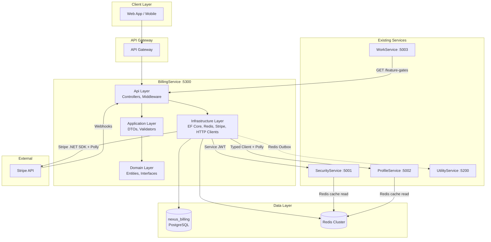
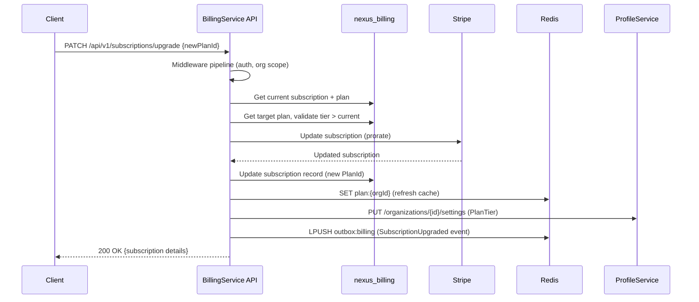
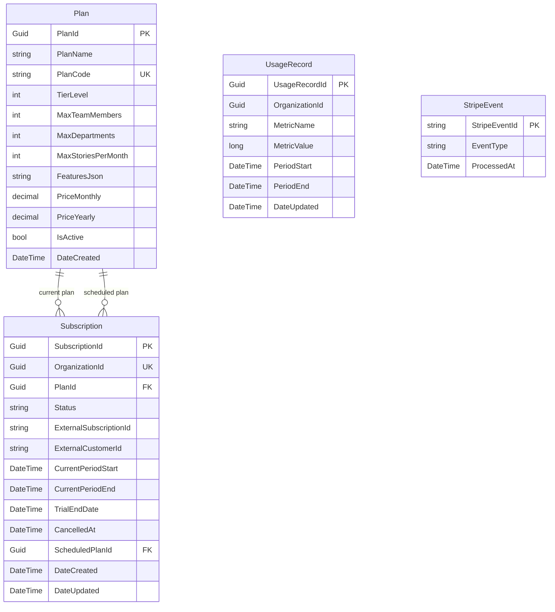

# Design Document — BillingService

## Overview

BillingService is the 5th microservice in the Nexus-2.0 platform, responsible for subscription management, plan tiers, feature gating, usage tracking, trial management, and Stripe payment integration. It runs on port 5300 with database `nexus_billing` and follows the same Clean Architecture pattern (.NET 8) as the existing four services.

The service enables a SaaS billing model where each organization has exactly one subscription tied to a plan tier (Free, Starter, Professional, Enterprise). Plan tier data is cached in Redis and consumed by SecurityService, WorkService, and ProfileService for feature gate enforcement. Stripe handles payment processing for paid plans, with webhook-driven event synchronization.

Key responsibilities:
- CRUD lifecycle for subscriptions (create, upgrade, downgrade, cancel)
- 14-day trial management with automatic expiry
- Feature gate API for cross-service plan limit enforcement
- Usage tracking with Redis counters and periodic database persistence
- Stripe integration for payment processing and webhook handling
- Outbox-based audit event publishing to UtilityService

## Architecture

### High-Level Architecture Diagram



### Request Flow — Subscription Upgrade



### Project Structure

```
src/backend/BillingService/
├── BillingService.Domain/
│   ├── Entities/
│   │   ├── Subscription.cs
│   │   ├── Plan.cs
│   │   ├── UsageRecord.cs
│   │   └── StripeEvent.cs
│   ├── Enums/
│   │   ├── SubscriptionStatus.cs
│   │   └── MetricName.cs
│   ├── Exceptions/
│   │   ├── DomainException.cs
│   │   ├── ErrorCodes.cs
│   │   └── Specific exception subclasses (one per error code)
│   ├── Interfaces/
│   │   ├── Repositories/
│   │   │   ├── ISubscriptionRepository.cs
│   │   │   ├── IPlanRepository.cs
│   │   │   ├── IUsageRecordRepository.cs
│   │   │   └── IStripeEventRepository.cs
│   │   └── Services/
│   │       ├── ISubscriptionService.cs
│   │       ├── IPlanService.cs
│   │       ├── IFeatureGateService.cs
│   │       ├── IUsageService.cs
│   │       ├── IStripePaymentService.cs
│   │       └── IOutboxService.cs
│   └── Common/
│       └── IOrganizationEntity.cs
├── BillingService.Application/
│   ├── DTOs/
│   │   ├── ApiResponse.cs
│   │   ├── ErrorDetail.cs
│   │   ├── OutboxMessage.cs
│   │   ├── Subscriptions/
│   │   │   ├── CreateSubscriptionRequest.cs
│   │   │   ├── UpgradeSubscriptionRequest.cs
│   │   │   ├── DowngradeSubscriptionRequest.cs
│   │   │   ├── SubscriptionResponse.cs
│   │   │   └── SubscriptionDetailResponse.cs
│   │   ├── Plans/
│   │   │   └── PlanResponse.cs
│   │   ├── Usage/
│   │   │   ├── IncrementUsageRequest.cs
│   │   │   └── UsageResponse.cs
│   │   └── FeatureGates/
│   │       └── FeatureGateResponse.cs
│   ├── Contracts/
│   │   └── OrganizationSettingsUpdateRequest.cs
│   └── Validators/
│       ├── CreateSubscriptionRequestValidator.cs
│       ├── UpgradeSubscriptionRequestValidator.cs
│       ├── DowngradeSubscriptionRequestValidator.cs
│       └── IncrementUsageRequestValidator.cs
├── BillingService.Infrastructure/
│   ├── Data/
│   │   ├── BillingDbContext.cs
│   │   └── Migrations/
│   ├── Repositories/
│   │   ├── SubscriptionRepository.cs
│   │   ├── PlanRepository.cs
│   │   ├── UsageRecordRepository.cs
│   │   └── StripeEventRepository.cs
│   ├── Services/
│   │   ├── Subscriptions/
│   │   │   └── SubscriptionService.cs
│   │   ├── Plans/
│   │   │   └── PlanService.cs
│   │   ├── FeatureGates/
│   │   │   └── FeatureGateService.cs
│   │   ├── Usage/
│   │   │   └── UsageService.cs
│   │   ├── Stripe/
│   │   │   ├── StripePaymentService.cs
│   │   │   └── StripeWebhookService.cs
│   │   ├── Outbox/
│   │   │   └── OutboxService.cs
│   │   ├── ServiceClients/
│   │   │   ├── IProfileServiceClient.cs
│   │   │   ├── ProfileServiceClient.cs
│   │   │   ├── ISecurityServiceClient.cs
│   │   │   ├── SecurityServiceClient.cs
│   │   │   └── CorrelationIdDelegatingHandler.cs
│   │   ├── ErrorCodeResolver/
│   │   │   └── ErrorCodeResolverService.cs
│   │   └── BackgroundServices/
│   │       ├── TrialExpiryHostedService.cs
│   │       └── UsagePersistenceHostedService.cs
│   └── Configuration/
│       ├── AppSettings.cs
│       ├── DatabaseMigrationHelper.cs
│       └── DependencyInjection.cs
├── BillingService.Api/
│   ├── Controllers/
│   │   ├── SubscriptionController.cs
│   │   ├── PlanController.cs
│   │   ├── UsageController.cs
│   │   ├── FeatureGateController.cs
│   │   └── StripeWebhookController.cs
│   ├── Middleware/
│   │   ├── CorrelationIdMiddleware.cs
│   │   ├── GlobalExceptionHandlerMiddleware.cs
│   │   ├── JwtClaimsMiddleware.cs
│   │   ├── TokenBlacklistMiddleware.cs
│   │   ├── RateLimiterMiddleware.cs
│   │   ├── RoleAuthorizationMiddleware.cs
│   │   └── OrganizationScopeMiddleware.cs
│   ├── Attributes/
│   │   ├── OrgAdminAttribute.cs
│   │   └── ServiceAuthAttribute.cs
│   ├── Extensions/
│   │   ├── MiddlewarePipelineExtensions.cs
│   │   ├── ControllerServiceExtensions.cs
│   │   ├── SwaggerServiceExtensions.cs
│   │   └── HealthCheckExtensions.cs
│   ├── Program.cs
│   ├── Dockerfile
│   ├── .env.example
│   ├── appsettings.json
│   └── appsettings.Development.json
└── BillingService.Tests/
    ├── Unit/
    ├── Property/
    └── BillingService.Tests.csproj
```

## Components and Interfaces

### Domain Layer Interfaces

#### Repository Interfaces

```csharp
public interface ISubscriptionRepository
{
    Task<Subscription?> GetByOrganizationIdAsync(Guid organizationId, CancellationToken ct);
    Task<Subscription?> GetByIdAsync(Guid subscriptionId, CancellationToken ct);
    Task<Subscription> CreateAsync(Subscription subscription, CancellationToken ct);
    Task UpdateAsync(Subscription subscription, CancellationToken ct);
    Task<List<Subscription>> GetExpiredTrialsAsync(DateTime cutoff, CancellationToken ct);
    Task<List<Subscription>> GetSubscriptionsDueForDowngradeAsync(DateTime cutoff, CancellationToken ct);
}

public interface IPlanRepository
{
    Task<Plan?> GetByIdAsync(Guid planId, CancellationToken ct);
    Task<Plan?> GetByCodeAsync(string planCode, CancellationToken ct);
    Task<List<Plan>> GetAllActiveAsync(CancellationToken ct);
    Task CreateAsync(Plan plan, CancellationToken ct);
    Task<bool> ExistsByCodeAsync(string planCode, CancellationToken ct);
}

public interface IUsageRecordRepository
{
    Task<List<UsageRecord>> GetByOrganizationAndPeriodAsync(Guid organizationId, DateTime periodStart, CancellationToken ct);
    Task UpsertAsync(UsageRecord record, CancellationToken ct);
    Task ArchivePeriodAsync(Guid organizationId, DateTime periodEnd, CancellationToken ct);
}

public interface IStripeEventRepository
{
    Task<bool> ExistsAsync(string stripeEventId, CancellationToken ct);
    Task CreateAsync(StripeEvent stripeEvent, CancellationToken ct);
}
```

#### Service Interfaces

```csharp
public interface ISubscriptionService
{
    Task<SubscriptionDetailResponse> GetCurrentAsync(Guid organizationId, CancellationToken ct);
    Task<SubscriptionResponse> CreateAsync(Guid organizationId, CreateSubscriptionRequest request, CancellationToken ct);
    Task<SubscriptionResponse> UpgradeAsync(Guid organizationId, UpgradeSubscriptionRequest request, CancellationToken ct);
    Task<SubscriptionResponse> DowngradeAsync(Guid organizationId, DowngradeSubscriptionRequest request, CancellationToken ct);
    Task<SubscriptionResponse> CancelAsync(Guid organizationId, CancellationToken ct);
}

public interface IPlanService
{
    Task<List<PlanResponse>> GetAllActiveAsync(CancellationToken ct);
    Task SeedPlansAsync(CancellationToken ct);
}

public interface IFeatureGateService
{
    Task<FeatureGateResponse> CheckFeatureAsync(Guid organizationId, string feature, CancellationToken ct);
}

public interface IUsageService
{
    Task<UsageResponse> GetUsageAsync(Guid organizationId, CancellationToken ct);
    Task IncrementAsync(Guid organizationId, string metricName, long value, CancellationToken ct);
}

public interface IStripePaymentService
{
    Task<(string customerId, string subscriptionId)> CreateSubscriptionAsync(Guid organizationId, string planCode, decimal priceMonthly, string? paymentMethodToken, CancellationToken ct);
    Task UpdateSubscriptionAsync(string externalSubscriptionId, string newPlanCode, decimal newPriceMonthly, CancellationToken ct);
    Task CancelSubscriptionAtPeriodEndAsync(string externalSubscriptionId, CancellationToken ct);
    bool VerifyWebhookSignature(string payload, string signatureHeader, out Stripe.Event? stripeEvent);
}

public interface IOutboxService
{
    Task PublishAsync(object message, CancellationToken ct = default);
}
```

### Infrastructure Service Clients

```csharp
public interface IProfileServiceClient
{
    Task UpdateOrganizationPlanTierAsync(Guid organizationId, string planCode, CancellationToken ct);
}

public interface ISecurityServiceClient
{
    Task<string> GetServiceTokenAsync(CancellationToken ct);
}
```

### API Controllers

| Controller | Route | Auth | Endpoints |
|---|---|---|---|
| `SubscriptionController` | `api/v1/subscriptions` | Bearer (OrgAdmin) | GET /current, POST, PATCH /upgrade, PATCH /downgrade, POST /cancel |
| `PlanController` | `api/v1/plans` | Bearer | GET (list active plans) |
| `UsageController` | `api/v1/usage` | Bearer (OrgAdmin) / Service | GET, POST /increment |
| `FeatureGateController` | `api/v1/feature-gates` | Service | GET /{feature}?organizationId={id} |
| `StripeWebhookController` | `api/v1/webhooks/stripe` | Stripe Signature | POST |

### Background Hosted Services

| Service | Interval | Responsibility |
|---|---|---|
| `TrialExpiryHostedService` | Every 1 hour | Queries subscriptions with `Status = Trialing` and `TrialEndDate <= UtcNow`. Transitions to `Active` (if payment method exists) or `Expired` (downgrade to Free). Publishes `TrialExpired` audit events. |
| `UsagePersistenceHostedService` | Every 5 minutes | Reads Redis usage counters (`usage:{orgId}:{metric}`) and persists to `UsageRecord` table. Ensures Redis counters and database stay in sync. |

Both follow the same `BackgroundService` pattern as UtilityService's hosted services: `IServiceScopeFactory` for scoped DI, structured logging, and `try/catch` with `Task.Delay` loop.

## Data Models

### Entity Relationship Diagram



### Entity Definitions

**Subscription** — One per organization. Tracks the full subscription lifecycle including trial, active billing, downgrades, and cancellation. `ScheduledPlanId` is populated when a downgrade is pending at period end.

**Plan** — Seeded at startup. `TierLevel` (0–3) enables ordering comparisons for upgrade/downgrade validation. `FeaturesJson` stores extended feature flags as a `jsonb` column.

**UsageRecord** — Tracks per-organization, per-metric usage within a billing period. Composite index on `(OrganizationId, MetricName, PeriodStart)` for efficient queries.

**StripeEvent** — Stores processed Stripe event IDs for idempotent webhook handling. The `StripeEventId` is the PK (Stripe's own event ID string).

### EF Core Configuration (BillingDbContext)

The `BillingDbContext` follows the same pattern as `ProfileDbContext`:
- Constructor accepts `DbContextOptions<BillingDbContext>` and `IHttpContextAccessor`
- Extracts `OrganizationId` from `HttpContext.Items` for global query filters
- `Subscription` and `UsageRecord` have query filters scoped by `OrganizationId`
- `Plan` and `StripeEvent` are not organization-scoped (global entities)
- `FeaturesJson` configured as `jsonb` column type
- Unique index on `Subscription.OrganizationId`
- Unique index on `Plan.PlanCode`
- Composite index on `(UsageRecord.OrganizationId, UsageRecord.MetricName, UsageRecord.PeriodStart)`

### Plan Seed Data

| PlanCode | PlanName | TierLevel | MaxTeamMembers | MaxDepartments | MaxStoriesPerMonth | PriceMonthly | PriceYearly | FeaturesJson |
|---|---|---|---|---|---|---|---|---|
| `free` | Free | 0 | 5 | 3 | 50 | 0 | 0 | `{"sprintAnalytics":"none","customWorkflows":false,"prioritySupport":false}` |
| `starter` | Starter | 1 | 25 | 5 | 500 | 29.00 | 290.00 | `{"sprintAnalytics":"basic","customWorkflows":false,"prioritySupport":false}` |
| `pro` | Professional | 2 | 100 | 0 | 0 | 99.00 | 990.00 | `{"sprintAnalytics":"full","customWorkflows":true,"prioritySupport":true}` |
| `enterprise` | Enterprise | 3 | 0 | 0 | 0 | 299.00 | 2990.00 | `{"sprintAnalytics":"full","customWorkflows":true,"prioritySupport":true}` |

### API Endpoint Specifications

#### Subscriptions

**POST /api/v1/subscriptions** — Create subscription
```
Auth: Bearer (OrgAdmin)
Request:  { "planId": "guid", "paymentMethodToken": "string?" }
Response: 201 ApiResponse<SubscriptionResponse>
Errors:   409 SUBSCRIPTION_ALREADY_EXISTS, 404 PLAN_NOT_FOUND, 502 PAYMENT_PROVIDER_ERROR
```

**GET /api/v1/subscriptions/current** — Get current subscription
```
Auth: Bearer (OrgAdmin)
Response: 200 ApiResponse<SubscriptionDetailResponse>
Errors:   404 SUBSCRIPTION_NOT_FOUND
```

**PATCH /api/v1/subscriptions/upgrade** — Upgrade plan
```
Auth: Bearer (OrgAdmin)
Request:  { "newPlanId": "guid" }
Response: 200 ApiResponse<SubscriptionResponse>
Errors:   400 INVALID_UPGRADE_PATH, 400 NO_ACTIVE_SUBSCRIPTION, 502 PAYMENT_PROVIDER_ERROR
```

**PATCH /api/v1/subscriptions/downgrade** — Downgrade plan (scheduled at period end)
```
Auth: Bearer (OrgAdmin)
Request:  { "newPlanId": "guid" }
Response: 200 ApiResponse<SubscriptionResponse>
Errors:   400 INVALID_DOWNGRADE_PATH, 400 NO_ACTIVE_SUBSCRIPTION, 400 USAGE_EXCEEDS_PLAN_LIMITS
```

**POST /api/v1/subscriptions/cancel** — Cancel subscription
```
Auth: Bearer (OrgAdmin)
Response: 200 ApiResponse<SubscriptionResponse>
Errors:   400 SUBSCRIPTION_ALREADY_CANCELLED, 400 NO_ACTIVE_SUBSCRIPTION
```

#### Plans

**GET /api/v1/plans** — List active plans
```
Auth: Bearer
Response: 200 ApiResponse<List<PlanResponse>>
```

#### Usage

**GET /api/v1/usage** — Get organization usage
```
Auth: Bearer (OrgAdmin)
Response: 200 ApiResponse<UsageResponse>
```

**POST /api/v1/usage/increment** — Increment usage metric (service-to-service)
```
Auth: Service JWT
Request:  { "metricName": "active_members|stories_created|storage_bytes", "value": 1 }
Response: 200 ApiResponse<object>
Errors:   422 VALIDATION_ERROR
```

#### Feature Gates

**GET /api/v1/feature-gates/{feature}?organizationId={id}** — Check feature access
```
Auth: Service JWT
Response: 200 { "allowed": bool, "currentUsage": long, "limit": int, "feature": "string" }
```

#### Stripe Webhook

**POST /api/v1/webhooks/stripe** — Stripe webhook handler
```
Auth: Stripe-Signature header
Response: 200 OK
Errors:   400 INVALID_WEBHOOK_SIGNATURE, 400 INVALID_WEBHOOK_PAYLOAD
```

#### Health

**GET /health** — Liveness check
**GET /ready** — Readiness check (PostgreSQL + Redis connectivity)

### DTO Shapes

```csharp
// Request DTOs
public record CreateSubscriptionRequest(Guid PlanId, string? PaymentMethodToken);
public record UpgradeSubscriptionRequest(Guid NewPlanId);
public record DowngradeSubscriptionRequest(Guid NewPlanId);
public record IncrementUsageRequest(string MetricName, long Value);

// Response DTOs
public record SubscriptionResponse(
    Guid SubscriptionId, Guid OrganizationId, Guid PlanId,
    string PlanName, string PlanCode, string Status,
    DateTime CurrentPeriodStart, DateTime? CurrentPeriodEnd,
    DateTime? TrialEndDate, DateTime? CancelledAt,
    Guid? ScheduledPlanId, string? ScheduledPlanName);

public record SubscriptionDetailResponse(
    SubscriptionResponse Subscription,
    PlanResponse Plan,
    UsageResponse Usage);

public record PlanResponse(
    Guid PlanId, string PlanName, string PlanCode, int TierLevel,
    int MaxTeamMembers, int MaxDepartments, int MaxStoriesPerMonth,
    string? FeaturesJson, decimal PriceMonthly, decimal PriceYearly);

public record UsageResponse(
    List<UsageMetric> Metrics);

public record UsageMetric(
    string MetricName, long CurrentValue, int Limit, double PercentUsed);

public record FeatureGateResponse(
    bool Allowed, long CurrentUsage, int Limit, string Feature);
```

### Redis Caching Strategy

| Key Pattern | Value | TTL | Operations |
|---|---|---|---|
| `plan:{organizationId}` | JSON: `{PlanCode, PlanName, TierLevel, MaxTeamMembers, MaxDepartments, MaxStoriesPerMonth, FeaturesJson}` | 60 min | SET on plan change, GET on feature gate check, DEL+SET on invalidation |
| `usage:{organizationId}:{metric}` | Long counter | 5 min | INCRBY on increment, GET on usage read, persisted to DB by background service |
| `outbox:billing` | JSON messages (list) | Until processed | LPUSH to publish, RPOP by UtilityService |
| `service_token:billing` | Service JWT string | 23 hours | SET on token acquisition, GET before service calls |

Cache invalidation is synchronous and immediate on any plan change (upgrade, downgrade, cancel, trial expiry). The `plan:{organizationId}` key is deleted and re-set in the same service method that updates the database, ensuring feature gates reflect the new plan without delay.

### Stripe Integration Design

The `StripePaymentService` wraps the Stripe .NET SDK and is the only component that communicates with Stripe. It is registered as a scoped service and injected into `SubscriptionService`.

Key design decisions:
- **Customer mapping**: One Stripe Customer per organization. `ExternalCustomerId` stored on the Subscription entity. Created on first paid subscription.
- **Price mapping**: Each Plan's `PriceMonthly` maps to a Stripe Price. Price IDs are resolved by plan code convention or stored in configuration.
- **Proration**: Upgrades apply prorated charges immediately. Downgrades are scheduled at period end.
- **Webhook verification**: `StripeWebhookService.VerifyWebhookSignature()` uses `EventUtility.ConstructEvent()` from the Stripe SDK with the webhook signing secret.
- **Idempotency**: `StripeEvent` table stores processed event IDs. Duplicate events are skipped.
- **Resilience**: All Stripe SDK calls are wrapped with Polly policies (retry 3x exponential, circuit breaker 5/30s, timeout 10s) via a custom `HttpClient` configured in DI.

### Cross-Service Communication

| Target | Method | Purpose | Resilience |
|---|---|---|---|
| ProfileService | `PUT /api/v1/organizations/{id}/settings` | Update `OrganizationSettings.PlanTier` on plan changes | Polly: retry 3x, circuit breaker 5/30s, timeout 10s |
| SecurityService | `POST /api/v1/service-tokens/issue` | Obtain service-to-service JWT | Polly: retry 3x, circuit breaker 5/30s, timeout 10s |
| UtilityService | Redis outbox (`outbox:billing`) | Publish audit events | Redis retry with DLQ fallback |

The `CorrelationIdDelegatingHandler` propagates `X-Correlation-Id` on all outgoing HTTP calls. Service JWT is cached in Redis (`service_token:billing`, 23h TTL) and refreshed when within 30 seconds of expiry.

If ProfileService is unavailable during plan tier propagation, the Redis cache (`plan:{organizationId}`) is still updated immediately so feature gates work without delay. The ProfileService update will succeed on retry via Polly.

### Middleware Pipeline

```
CORS → CorrelationId → GlobalExceptionHandler → RateLimiter → Routing →
Authentication → Authorization → JwtClaims → TokenBlacklist →
RoleAuthorization → OrganizationScope → Controllers
```

Same order as ProfileService and SecurityService. The Stripe webhook endpoint (`POST /api/v1/webhooks/stripe`) is decorated with `[AllowAnonymous]` to bypass JWT authentication — it validates via Stripe signature instead. IP-based rate limiting still applies to the webhook endpoint.


## Correctness Properties

*A property is a characteristic or behavior that should hold true across all valid executions of a system — essentially, a formal statement about what the system should do. Properties serve as the bridge between human-readable specifications and machine-verifiable correctness guarantees.*

### Property 1: Active plan filtering

*For any* set of plans in the database (some with `IsActive = true`, some with `IsActive = false`), calling `GetAllActiveAsync` should return exactly the plans where `IsActive == true` and no others.

**Validates: Requirements 1.2**

### Property 2: FeaturesJson round-trip serialization

*For any* valid feature flags object (containing keys like `sprintAnalytics`, `customWorkflows`, `prioritySupport`), serializing to JSON and deserializing back should produce an equivalent object.

**Validates: Requirements 1.5**

### Property 3: Plan seeding idempotency

*For any* initial database state, running the plan seeding operation twice should produce the same set of plans as running it once — no duplicates, no errors.

**Validates: Requirements 1.6**

### Property 4: Paid plan subscription creates with trial

*For any* valid organization and any paid plan (Starter, Professional, Enterprise), creating a subscription should result in `Status = Trialing` and `TrialEndDate` equal to the creation time plus exactly 14 days.

**Validates: Requirements 2.1, 7.1**

### Property 5: One subscription per organization

*For any* organization that already has an active or trialing subscription, attempting to create a second subscription should fail with `SUBSCRIPTION_ALREADY_EXISTS` (5001) and the existing subscription should remain unchanged.

**Validates: Requirements 2.2, 15.3**

### Property 6: Free plan subscription skips Stripe

*For any* organization creating a subscription on the Free plan, the subscription should be created with `Status = Active`, `CurrentPeriodEnd = null`, `ExternalSubscriptionId = null`, and no Stripe API call should be made.

**Validates: Requirements 2.4**

### Property 7: Invalid plan rejection

*For any* plan ID that does not exist in the database or references an inactive plan, subscription creation should fail with `PLAN_NOT_FOUND` (5002).

**Validates: Requirements 2.7**

### Property 8: Stripe failure prevents local record creation

*For any* paid plan subscription creation where the Stripe API call fails, no local `Subscription` record should be persisted in the database, and the error should be `PAYMENT_PROVIDER_ERROR` (5010).

**Validates: Requirements 2.8**

### Property 9: Subscription retrieval completeness

*For any* organization with an active subscription, calling `GetCurrentAsync` should return a response that includes the subscription details, the associated plan's feature limits and pricing, and the current usage metrics.

**Validates: Requirements 3.1, 3.3**

### Property 10: Tier ordering enforcement

*For any* pair of plans (currentPlan, targetPlan), an upgrade should succeed only if `targetPlan.TierLevel > currentPlan.TierLevel`, and a downgrade should succeed only if `targetPlan.TierLevel < currentPlan.TierLevel`. Violations should return `INVALID_UPGRADE_PATH` (5004) or `INVALID_DOWNGRADE_PATH` (5006) respectively.

**Validates: Requirements 4.1, 5.1**

### Property 11: Upgrade during trial ends trial immediately

*For any* subscription with `Status = Trialing`, upgrading to a higher-tier plan should set `Status = Active`, clear `TrialEndDate`, and start the paid billing period immediately.

**Validates: Requirements 4.6, 7.4**

### Property 12: Downgrade scheduled at period end

*For any* active subscription being downgraded, the `ScheduledPlanId` should be set to the target plan's ID, the current `PlanId` should remain unchanged, and the downgrade should take effect only at `CurrentPeriodEnd`.

**Validates: Requirements 5.2**

### Property 13: Downgrade blocked when usage exceeds limits

*For any* organization whose current usage exceeds the target plan's limits (e.g., 30 active members downgrading to Starter with max 25), the downgrade should fail with `USAGE_EXCEEDS_PLAN_LIMITS` (5007) and include the specific limits that are exceeded.

**Validates: Requirements 5.4**

### Property 14: Cancellation records status and timestamp

*For any* active or trialing subscription, cancellation should set `Status = Cancelled`, `CancelledAt = DateTime.UtcNow`, and schedule the effective cancellation at `CurrentPeriodEnd`.

**Validates: Requirements 6.1**

### Property 15: Free plan cancellation skips Stripe

*For any* subscription on the Free plan, cancellation should set `Status = Cancelled` immediately without making any Stripe API call.

**Validates: Requirements 6.6**

### Property 16: Trial expiry transitions based on payment method

*For any* subscription with `Status = Trialing` and `TrialEndDate <= UtcNow`, if a valid payment method exists the subscription should transition to `Active`; if no payment method exists, the subscription should transition to `Expired` and the organization should be downgraded to the Free plan.

**Validates: Requirements 7.2**

### Property 17: Trialing subscriptions grant full plan access

*For any* subscription with `Status = Trialing` and any feature key included in the subscribed plan, the feature gate check should return `allowed = true`.

**Validates: Requirements 7.3**

### Property 18: Feature gate response correctness

*For any* organization with a subscription and any feature key, the feature gate response should return `allowed = true` when `currentUsage < limit` (or limit is 0/unlimited), and `allowed = false` when `currentUsage >= limit`, with the correct `currentUsage` and `limit` values.

**Validates: Requirements 8.1, 8.5, 8.6**

### Property 19: Plan change propagates to cache and ProfileService

*For any* plan change operation (create, upgrade, downgrade effective, cancel effective, trial expiry), the Redis cache key `plan:{organizationId}` should be refreshed with the new plan data, and ProfileService should be called to update `OrganizationSettings.PlanTier`.

**Validates: Requirements 2.5, 4.3, 5.3, 6.2, 8.4, 12.1, 16.3**

### Property 20: Billing state changes publish audit events

*For any* billing state change (subscription created, upgraded, downgraded, cancelled, trial expired, payment failed, webhook processed), an audit event with the correct event type and organization ID should be published to `outbox:billing`.

**Validates: Requirements 2.6, 4.4, 5.5, 6.3, 7.6, 10.7, 12.4**

### Property 21: Usage increment atomicity

*For any* valid metric name and positive integer value, calling the increment operation should increase the Redis counter for `usage:{organizationId}:{metric}` by exactly the specified value.

**Validates: Requirements 9.3, 16.4**

### Property 22: Usage response includes value and limit per metric

*For any* organization, the usage response should include for each tracked metric (`active_members`, `stories_created`, `storage_bytes`) both the `currentValue` and the plan `limit`, enabling percentage utilization calculation.

**Validates: Requirements 9.1, 9.4**

### Property 23: Billing period reset clears period-scoped counters

*For any* organization at the start of a new billing period, the `stories_created` counter should be reset to 0 and the previous period's `UsageRecord` should be archived.

**Validates: Requirements 9.5**

### Property 24: Webhook signature verification

*For any* webhook request with an invalid or missing Stripe signature, the request should be rejected with `INVALID_WEBHOOK_SIGNATURE` (5011) and no subscription state should be modified.

**Validates: Requirements 10.1, 18.6**

### Property 25: Webhook idempotency

*For any* Stripe event that has already been processed (its ID exists in the `StripeEvent` table), processing the same event again should be a no-op — no subscription state changes, no duplicate audit events.

**Validates: Requirements 10.6**

### Property 26: Webhook event processing updates subscription state

*For any* valid Stripe webhook event, the subscription state should be updated correctly: `invoice.payment_succeeded` → update period and set Active; `invoice.payment_failed` → set PastDue; `customer.subscription.updated` → sync with Stripe state; `customer.subscription.deleted` → set Cancelled and downgrade to Free.

**Validates: Requirements 10.2, 10.3, 10.4, 10.5**

### Property 27: Stripe errors wrapped in DomainException

*For any* Stripe API call that returns an error, the error should be wrapped in a `DomainException` with error code `PAYMENT_PROVIDER_ERROR` (5010) and the Stripe error message should be included in the error details.

**Validates: Requirements 11.5**

### Property 28: DomainException returns correct HTTP status and envelope

*For any* `DomainException` thrown during request processing, the `GlobalExceptionHandlerMiddleware` should return the exception's `StatusCode` as the HTTP status and wrap the error in an `ApiResponse` envelope with the correct `ErrorCode`, `ErrorValue`, and `CorrelationId`.

**Validates: Requirements 13.2**

### Property 29: Validation failures return 422 with field errors

*For any* request DTO that fails FluentValidation (e.g., empty GUID for `PlanId`, empty GUID for `NewPlanId`), the response should be HTTP 422 with `VALIDATION_ERROR` (1000) and include field-level error details in the `Errors` array.

**Validates: Requirements 13.3, 18.1, 18.2, 18.3**

### Property 30: Unhandled exceptions return 500 without internals

*For any* unhandled exception (not a `DomainException`), the `GlobalExceptionHandlerMiddleware` should return HTTP 500 with a generic error message and not expose exception details, stack traces, or internal state to the client.

**Validates: Requirements 13.5**

### Property 31: Correlation ID propagation

*For any* API request, if an `X-Correlation-Id` header is present the same value should appear in the response and `HttpContext.Items`; if absent, a new GUID should be generated and attached to both.

**Validates: Requirements 14.2**

### Property 32: OrgAdmin role enforcement

*For any* authenticated user without the `OrgAdmin` role accessing a protected endpoint (subscriptions CRUD, usage GET), the request should be rejected with HTTP 403 `INSUFFICIENT_PERMISSIONS`.

**Validates: Requirements 14.4**

### Property 33: Organization scope validation

*For any* authenticated request where the `organizationId` from JWT claims does not match the `organizationId` in route or query parameters, the request should be rejected with HTTP 403 `ORGANIZATION_MISMATCH`.

**Validates: Requirements 14.5**

### Property 34: Usage metric validation

*For any* increment request where `metricName` is not one of `active_members`, `stories_created`, `storage_bytes`, or where `value` is not a positive integer, the request should be rejected with `VALIDATION_ERROR` (1000).

**Validates: Requirements 18.4**

### Property 35: Plan cache consistency

*For any* organization with a subscription, the cached plan data in Redis (`plan:{organizationId}`) should contain the same `PlanCode`, `TierLevel`, `MaxTeamMembers`, `MaxDepartments`, `MaxStoriesPerMonth`, and `FeaturesJson` as the corresponding `Plan` record in the database.

**Validates: Requirements 1.4, 8.3, 16.1**

### Property 36: ProfileService unavailability still updates Redis

*For any* plan change operation where ProfileService is unreachable, the Redis cache (`plan:{organizationId}`) should still be updated immediately with the new plan data, ensuring feature gates are enforced without delay.

**Validates: Requirements 12.5**

### Property 37: Stripe Customer ID stored on subscription

*For any* paid plan subscription creation that succeeds, the `ExternalCustomerId` field on the subscription record should be populated with the Stripe Customer ID.

**Validates: Requirements 11.6**

### Property 38: ApiResponse envelope wraps all responses

*For any* API response (success or error), the response body should be an `ApiResponse<T>` object containing `ResponseCode`, `Success`, `Data` (on success), `ErrorCode` (on error), and `CorrelationId`.

**Validates: Requirements 13.1**

## Error Handling

### Error Code Registry (5000 Range)

| Code | Value | HTTP | Exception Class | Description |
|---|---|---|---|---|
| SUBSCRIPTION_ALREADY_EXISTS | 5001 | 409 | `SubscriptionAlreadyExistsException` | Organization already has an active/trialing subscription |
| PLAN_NOT_FOUND | 5002 | 404 | `PlanNotFoundException` | Plan does not exist or is inactive |
| SUBSCRIPTION_NOT_FOUND | 5003 | 404 | `SubscriptionNotFoundException` | No subscription for the organization |
| INVALID_UPGRADE_PATH | 5004 | 400 | `InvalidUpgradePathException` | Target plan is not a higher tier |
| NO_ACTIVE_SUBSCRIPTION | 5005 | 400 | `NoActiveSubscriptionException` | No active or trialing subscription |
| INVALID_DOWNGRADE_PATH | 5006 | 400 | `InvalidDowngradePathException` | Target plan is not a lower tier |
| USAGE_EXCEEDS_PLAN_LIMITS | 5007 | 400 | `UsageExceedsPlanLimitsException` | Current usage exceeds target plan limits |
| SUBSCRIPTION_ALREADY_CANCELLED | 5008 | 400 | `SubscriptionAlreadyCancelledException` | Subscription already cancelled |
| TRIAL_EXPIRED | 5009 | 400 | `TrialExpiredException` | Trial period has ended |
| PAYMENT_PROVIDER_ERROR | 5010 | 502 | `PaymentProviderException` | Stripe API error |
| INVALID_WEBHOOK_SIGNATURE | 5011 | 400 | `InvalidWebhookSignatureException` | Stripe signature verification failed |
| INVALID_WEBHOOK_PAYLOAD | 5012 | 400 | `InvalidWebhookPayloadException` | Webhook payload deserialization failed |
| FEATURE_NOT_AVAILABLE | 5013 | 403 | `FeatureNotAvailableException` | Feature not in current plan |
| USAGE_LIMIT_REACHED | 5014 | 403 | `UsageLimitReachedException` | Usage limit reached for feature |

### Error Handling Strategy

All exception subclasses extend `DomainException` with the appropriate `ErrorValue`, `ErrorCode`, and `HttpStatusCode`. The `GlobalExceptionHandlerMiddleware` catches:

1. `DomainException` → Returns the exception's `StatusCode` with `ApiResponse` envelope containing `ErrorCode`, `ErrorValue`, `Message`, and `CorrelationId`. Logs at `Warning` level.
2. `Exception` (unhandled) → Returns HTTP 500 with generic message `"An unexpected error occurred."` and `ErrorCode = "INTERNAL_ERROR"`. Logs full exception at `Error` level. No internal details exposed.

FluentValidation failures are caught by the validation pipeline and returned as HTTP 422 with `VALIDATION_ERROR` (1000) and field-level `ErrorDetail` entries.

Stripe API errors are caught in `StripePaymentService` and re-thrown as `PaymentProviderException` with the Stripe error message included.

### Transactional Guarantees

- Subscription creation: If Stripe call fails, no local record is created (Stripe call happens before `SaveChangesAsync`).
- Plan change propagation: Redis cache is updated before ProfileService call. If ProfileService fails, Polly retries. Redis is already correct so feature gates work immediately.
- Webhook processing: `StripeEvent` record is created in the same transaction as the subscription update, ensuring idempotency.

## Testing Strategy

### Dual Testing Approach

BillingService uses both unit tests and property-based tests for comprehensive coverage:

- **Unit tests**: Specific examples, edge cases, error conditions, integration points
- **Property-based tests**: Universal properties across all valid inputs, verifying correctness guarantees

### Property-Based Testing Configuration

- **Library**: [FsCheck.Xunit](https://github.com/fscheck/FsCheck) (FsCheck 2.x with xUnit integration)
- **Minimum iterations**: 100 per property test
- **Each property test references its design document property** with a tag comment:
  ```
  // Feature: billing-service, Property {N}: {property title}
  ```

### Test Project Structure

```
BillingService.Tests/
├── Unit/
│   ├── Services/
│   │   ├── SubscriptionServiceTests.cs
│   │   ├── PlanServiceTests.cs
│   │   ├── FeatureGateServiceTests.cs
│   │   ├── UsageServiceTests.cs
│   │   └── StripeWebhookServiceTests.cs
│   ├── Validators/
│   │   ├── CreateSubscriptionRequestValidatorTests.cs
│   │   ├── UpgradeSubscriptionRequestValidatorTests.cs
│   │   ├── DowngradeSubscriptionRequestValidatorTests.cs
│   │   └── IncrementUsageRequestValidatorTests.cs
│   ├── Middleware/
│   │   └── GlobalExceptionHandlerMiddlewareTests.cs
│   └── Controllers/
│       └── SubscriptionControllerTests.cs
├── Property/
│   ├── PlanPropertyTests.cs
│   ├── SubscriptionLifecyclePropertyTests.cs
│   ├── FeatureGatePropertyTests.cs
│   ├── UsagePropertyTests.cs
│   ├── WebhookPropertyTests.cs
│   ├── ValidationPropertyTests.cs
│   ├── ErrorHandlingPropertyTests.cs
│   └── Generators/
│       ├── PlanGenerator.cs
│       ├── SubscriptionGenerator.cs
│       ├── UsageRecordGenerator.cs
│       └── StripeEventGenerator.cs
└── BillingService.Tests.csproj
```

### Unit Test Focus Areas

- Specific plan seed data validation (Requirement 1.1, 1.3)
- Health check endpoint responses (Requirement 17.1, 17.2)
- Stripe webhook authentication bypass (Requirement 14.7)
- Rate limiting exemption for webhook endpoint (Requirement 14.6)
- Error code definitions match specification table (Requirement 13.4)
- Edge cases: double cancellation, no subscription, organization with no subscription defaults to Free limits

### Property Test Coverage Map

| Property Test File | Properties Covered |
|---|---|
| `PlanPropertyTests.cs` | P1 (active filtering), P2 (FeaturesJson round-trip), P3 (seeding idempotency), P35 (cache consistency) |
| `SubscriptionLifecyclePropertyTests.cs` | P4 (trial creation), P5 (uniqueness), P6 (Free plan), P10 (tier ordering), P11 (upgrade during trial), P12 (downgrade scheduling), P14 (cancellation), P15 (Free cancellation), P16 (trial expiry), P19 (propagation), P20 (audit events), P37 (Stripe Customer ID) |
| `FeatureGatePropertyTests.cs` | P17 (trialing access), P18 (gate correctness), P36 (ProfileService unavailability) |
| `UsagePropertyTests.cs` | P21 (increment atomicity), P22 (response completeness), P23 (period reset), P34 (metric validation) |
| `WebhookPropertyTests.cs` | P24 (signature verification), P25 (idempotency), P26 (event processing), P27 (Stripe error wrapping) |
| `ValidationPropertyTests.cs` | P29 (validation failures) |
| `ErrorHandlingPropertyTests.cs` | P28 (DomainException handling), P30 (unhandled exceptions), P31 (correlation ID), P32 (OrgAdmin enforcement), P33 (org scope), P38 (ApiResponse envelope) |

### NuGet Dependencies (Test Project)

```xml
<PackageReference Include="xunit" Version="2.7.*" />
<PackageReference Include="xunit.runner.visualstudio" Version="2.5.*" />
<PackageReference Include="FsCheck.Xunit" Version="2.16.*" />
<PackageReference Include="Moq" Version="4.20.*" />
<PackageReference Include="FluentAssertions" Version="6.12.*" />
<PackageReference Include="Microsoft.EntityFrameworkCore.InMemory" Version="8.0.*" />
```

### Generator Strategy

Custom FsCheck `Arbitrary` generators for domain types:
- `PlanGenerator`: Generates plans with valid tier levels (0–3), non-negative limits, valid FeaturesJson
- `SubscriptionGenerator`: Generates subscriptions with valid statuses, consistent date ranges, valid FK references
- `UsageRecordGenerator`: Generates usage records with valid metric names, non-negative values, valid periods
- `StripeEventGenerator`: Generates Stripe event payloads for the four handled event types

Edge cases covered by generators: empty strings, boundary values (0 for unlimited), max int values, null optional fields, all subscription status transitions.
