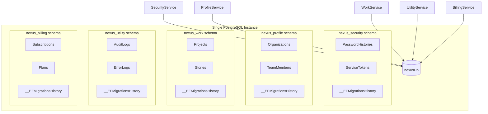
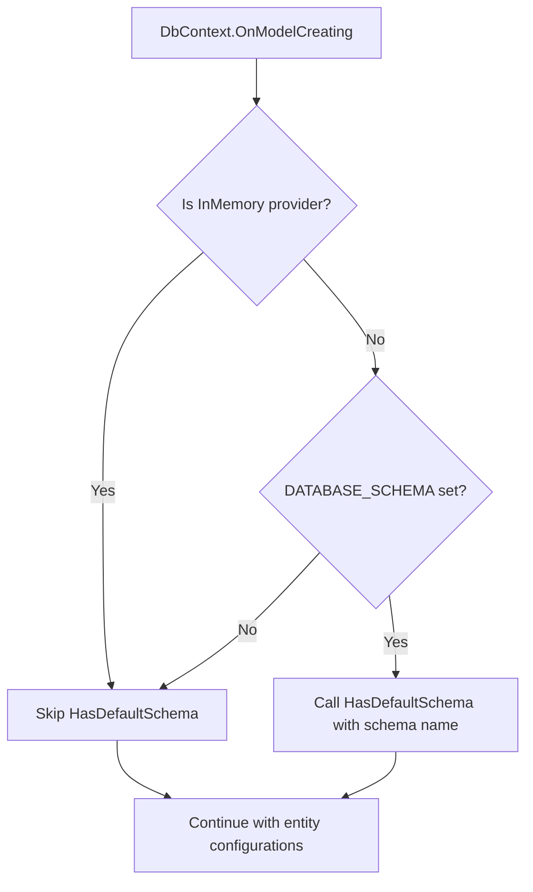

# Design Document: Database Schema Isolation

## Overview

This design migrates Nexus 2.0 from 5 separate PostgreSQL databases to a single shared database (`nexusDb`) with per-service PostgreSQL schema isolation. Each of the 5 backend services (Security, Profile, Work, Utility, Billing) will own a dedicated schema (e.g., `nexus_security`) within the shared database.

The change is purely configuration-level — no business logic, entity models, or API contracts change. The key integration points are:

1. **DbContext `OnModelCreating`** — conditionally calls `HasDefaultSchema()` as the first operation
2. **DI registration** — configures `MigrationsHistoryTable` in the `UseNpgsql` options when a schema is set
3. **AppSettings** — adds an optional `DatabaseSchema` property read from `DATABASE_SCHEMA` env var
4. **DesignTimeDbContextFactory** — each service gets a factory that supports schema-aware migration generation
5. **Docker init script** — switches from `CREATE DATABASE` to `CREATE SCHEMA` within a single database
6. **Environment files** — all `.env`, docker-compose, and config files updated to the shared database pattern

### Design Rationale

- **Single database** reduces PostgreSQL connection overhead and simplifies backup/restore
- **Schema isolation** maintains strict data separation — each service's tables, indexes, and migration history live in their own schema
- **Backward compatibility** is preserved: when `DATABASE_SCHEMA` is not set, the system behaves exactly as before (multi-database mode)
- **InMemory provider detection** ensures tests continue working since the InMemory provider doesn't support schemas

## Architecture



### Schema Resolution Flow



## Components and Interfaces

### 1. DbContext Schema Integration

Each DbContext's `OnModelCreating` method is modified to conditionally apply the schema. The schema value is injected via a `string? databaseSchema` constructor parameter (or read from a static/config source).

**Pattern (applied to all 5 DbContexts):**

```csharp
public class SecurityDbContext : DbContext
{
    private readonly string? _databaseSchema;

    public SecurityDbContext(DbContextOptions<SecurityDbContext> options, string? databaseSchema = null)
        : base(options)
    {
        _databaseSchema = databaseSchema;
    }

    protected override void OnModelCreating(ModelBuilder modelBuilder)
    {
        // Schema MUST be set before any entity configuration
        if (!string.IsNullOrEmpty(_databaseSchema) && !Database.IsInMemory())
        {
            modelBuilder.HasDefaultSchema(_databaseSchema);
        }

        base.OnModelCreating(modelBuilder);
        // ... existing entity configurations
    }
}
```

**Key decisions:**
- `HasDefaultSchema` is called **before** `base.OnModelCreating()` and all entity configurations — this ensures all table mappings inherit the schema
- `Database.IsInMemory()` check prevents schema application when using the InMemory provider in tests
- The `databaseSchema` parameter defaults to `null` for backward compatibility — existing test code that creates DbContexts without the parameter continues to work

### 2. DI Registration Changes

Each service's `DependencyInjection.cs` is updated to pass the schema to both `UseNpgsql` (for `MigrationsHistoryTable`) and the DbContext constructor.

**Pattern:**

```csharp
services.AddDbContext<SecurityDbContext>((sp, options) =>
{
    options.UseNpgsql(appSettings.DatabaseConnectionString, npgsql =>
    {
        if (!string.IsNullOrEmpty(appSettings.DatabaseSchema))
        {
            npgsql.MigrationsHistoryTable("__EFMigrationsHistory", appSettings.DatabaseSchema);
        }
    });
}, contextLifetime: ServiceLifetime.Scoped);
```

The schema string is passed to the DbContext via a factory registration or by registering the schema value in DI.

### 3. AppSettings Changes

Each service's `AppSettings` class gets an optional `DatabaseSchema` property:

```csharp
public string? DatabaseSchema { get; set; }
```

Read from environment:
```csharp
DatabaseSchema = Environment.GetEnvironmentVariable("DATABASE_SCHEMA"),
```

This is optional — `null` when not set, preserving backward compatibility.

**UtilityService standardization:** The `FromEnvironment()` method is updated to read:
- `DATABASE_CONNECTION_STRING` instead of `DATABASE_URL`
- `REDIS_CONNECTION_STRING` instead of `REDIS_URL`
- `JWT_SECRET_KEY` instead of `JWT_SECRET`

### 4. DesignTimeDbContextFactory

Each service needs a `DesignTimeDbContextFactory` for EF Core CLI migration generation. Only UtilityService currently has one.

**Pattern (for each service):**

```csharp
public class DesignTimeDbContextFactory : IDesignTimeDbContextFactory<SecurityDbContext>
{
    public SecurityDbContext CreateDbContext(string[] args)
    {
        DotNetEnv.Env.Load();

        var connectionString = Environment.GetEnvironmentVariable("DATABASE_CONNECTION_STRING")
            ?? "Host=localhost;Port=5432;Database=nexusDb;Username=postgres;Password=pass.123";

        var schema = Environment.GetEnvironmentVariable("DATABASE_SCHEMA");

        var optionsBuilder = new DbContextOptionsBuilder<SecurityDbContext>();
        optionsBuilder.UseNpgsql(connectionString, npgsql =>
        {
            if (!string.IsNullOrEmpty(schema))
            {
                npgsql.MigrationsHistoryTable("__EFMigrationsHistory", schema);
            }
        });

        return new SecurityDbContext(optionsBuilder.Options, schema);
    }
}
```

### 5. Docker Init Script

The `docker/init-databases.sql` changes from creating 5 databases to creating 1 database with 5 schemas:

```sql
-- Create the shared database
CREATE DATABASE "nexusDb";

-- Connect to it and create schemas
\c "nexusDb"

CREATE SCHEMA IF NOT EXISTS nexus_security;
CREATE SCHEMA IF NOT EXISTS nexus_profile;
CREATE SCHEMA IF NOT EXISTS nexus_work;
CREATE SCHEMA IF NOT EXISTS nexus_utility;
CREATE SCHEMA IF NOT EXISTS nexus_billing;

-- Grant privileges
GRANT ALL ON SCHEMA nexus_security TO postgres;
GRANT ALL ON SCHEMA nexus_profile TO postgres;
GRANT ALL ON SCHEMA nexus_work TO postgres;
GRANT ALL ON SCHEMA nexus_utility TO postgres;
GRANT ALL ON SCHEMA nexus_billing TO postgres;
```

### 6. Connection String Format

All services connect to the same database with a `SearchPath` parameter:

```
Host=postgres;Port=5432;Database=nexusDb;Username=postgres;Password=pass.123;SearchPath=nexus_security
```

The `SearchPath` ensures that unqualified table references resolve to the correct schema. This works in conjunction with `HasDefaultSchema` — EF Core generates schema-qualified SQL, and `SearchPath` handles any edge cases with raw SQL or PostgreSQL functions.

### 7. Docker Compose Changes

All 5 services in all 3 docker-compose files are updated:
- `Database=nexusDb` in connection strings (replacing per-service database names)
- `SearchPath={schema}` appended to connection strings
- `DATABASE_SCHEMA` environment variable added
- UtilityService env vars renamed (`DATABASE_URL` → `DATABASE_CONNECTION_STRING`, etc.)

## Data Models

No data model changes. All existing entities, relationships, indexes, and query filters remain identical. The only difference is that tables are created within a named schema instead of the `public` schema.

### Migration Impact

Existing migrations will need to be regenerated or a new migration created after the schema change. The `HasDefaultSchema` call causes EF Core to generate schema-qualified DDL (e.g., `CREATE TABLE "nexus_security"."PasswordHistories"` instead of `CREATE TABLE "PasswordHistories"`).


## Correctness Properties

*A property is a characteristic or behavior that should hold true across all valid executions of a system — essentially, a formal statement about what the system should do. Properties serve as the bridge between human-readable specifications and machine-verifiable correctness guarantees.*

Most of this feature is configuration changes (SQL scripts, env files, docker-compose) which are not suitable for property-based testing. However, the conditional schema application logic in DbContext has two testable properties.

### Property 1: Schema application with Npgsql provider

*For any* non-empty schema string, when a DbContext is configured with the Npgsql provider and that schema value, the EF Core model's default schema SHALL equal the provided schema string.

**Validates: Requirements 2.1, 2.2, 2.3, 2.4, 2.5**

### Property 2: InMemory provider skips schema

*For any* schema string (including non-empty strings), when a DbContext is configured with the InMemory provider, the EF Core model SHALL have no default schema set, regardless of the schema value passed.

**Validates: Requirements 9.1, 9.3**

## Error Handling

This feature introduces minimal new error paths since it's a configuration change:

1. **Missing DATABASE_SCHEMA**: Not an error — the system falls back to the existing multi-database behavior. `AppSettings.DatabaseSchema` is `null`, and `HasDefaultSchema` is not called.

2. **Invalid schema name**: If `DATABASE_SCHEMA` contains an invalid PostgreSQL identifier, the error surfaces at migration time or first query as a PostgreSQL error. No custom validation is added — PostgreSQL's own error messages are sufficient.

3. **Schema doesn't exist in database**: If the init script hasn't run but `DATABASE_SCHEMA` is set, PostgreSQL will return an error when EF Core tries to create tables. This is caught by the existing database health check / startup migration flow.

4. **UtilityService env var rename**: If someone updates the code but not the environment files (or vice versa), the `GetRequired()` call will throw `InvalidOperationException` with a clear message identifying the missing variable. This is the existing error handling pattern.

5. **InMemory provider detection failure**: The `Database.IsInMemory()` extension method is provided by `Microsoft.EntityFrameworkCore.InMemory` and is reliable. No additional error handling needed.

## Testing Strategy

### Property-Based Tests

Property-based testing applies to the conditional schema logic in DbContext. Use **FsCheck** (via `FsCheck.Xunit`) as the PBT library.

- Each property test runs a minimum of **100 iterations**
- Each test is tagged with a comment referencing the design property
- Tag format: **Feature: database-schema-isolation, Property {number}: {property_text}**

**Property 1 test**: Generate random non-empty schema strings → create a DbContext with Npgsql options (using a test connection string) → build the model → assert `model.GetDefaultSchema() == generatedSchema`. Use `DbContextOptionsBuilder` without actually connecting to a database (model building doesn't require a live connection).

**Property 2 test**: Generate random schema strings (including non-empty) → create a DbContext with InMemory provider and the schema value → build the model → assert `model.GetDefaultSchema() == null`.

### Unit Tests (Example-Based)

- **AppSettings.DatabaseSchema**: Set `DATABASE_SCHEMA` env var, call `FromEnvironment()`, verify property value. Also test with env var unset → property is `null`.
- **UtilityService env var rename**: Verify `FromEnvironment()` reads `DATABASE_CONNECTION_STRING`, `REDIS_CONNECTION_STRING`, `JWT_SECRET_KEY` instead of old names.
- **DesignTimeDbContextFactory**: For each service, verify the factory creates a DbContext with the correct schema when `DATABASE_SCHEMA` is set.
- **DI registration**: Verify `MigrationsHistoryTable` is configured with the schema when `DatabaseSchema` is set in AppSettings.
- **Backward compatibility**: Create DbContext without schema → verify no default schema on model.

### Integration / Smoke Tests

- **Init script**: Run against a test PostgreSQL instance, verify database and schemas exist.
- **Migration generation**: Run `dotnet ef migrations add` with `DATABASE_SCHEMA` set, verify generated migration references the schema.
- **Existing test suite**: Run all existing unit and property tests to confirm no regressions (tests use InMemory provider and should be unaffected).
- **Docker compose**: `docker compose up` with new configuration, verify all services start and connect successfully.
