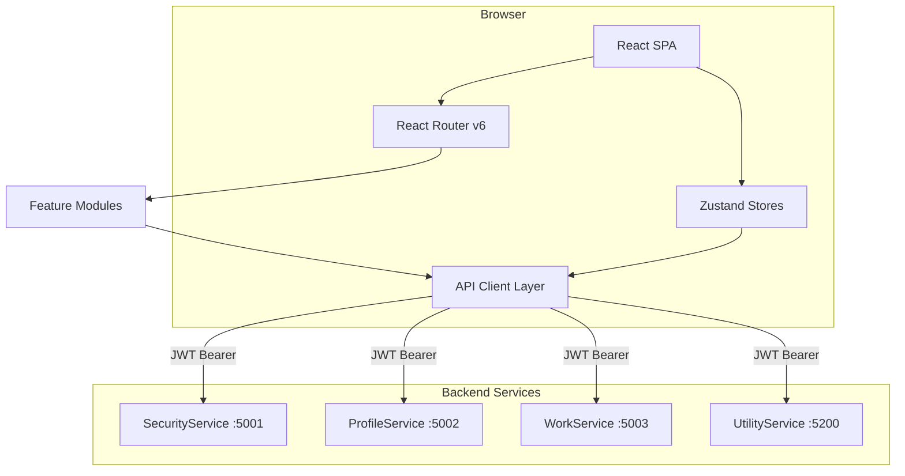
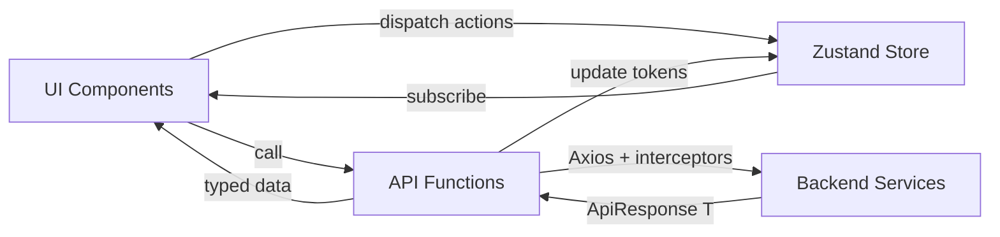
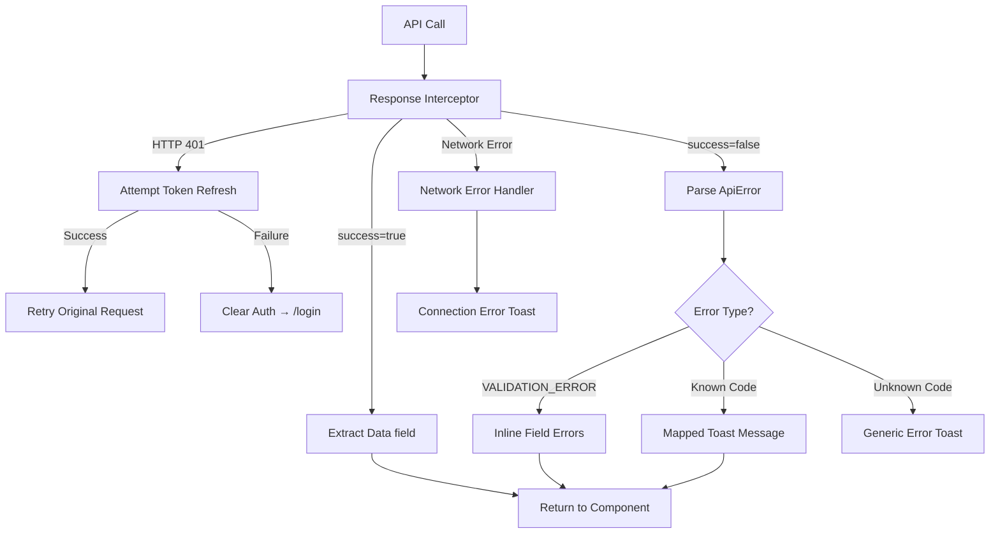

# Design Document — Frontend Application

## Overview

The Nexus 2.0 Frontend Application is a React 18+ / TypeScript / Vite single-page application (SPA) that serves as the unified user interface for the Enterprise Agile Platform. It consumes four backend microservices — SecurityService (auth, sessions), ProfileService (org, members, departments, preferences), WorkService (projects, stories, tasks, sprints, boards, reports), and UtilityService (audit logs, notifications, reference data) — via typed REST API clients.

The frontend provides: multi-step authentication flows (login, forced password change, OTP-based password reset, PlatformAdmin login), a dashboard with real-time widgets, full project/story/task CRUD with workflow state machines, sprint planning with drag-and-drop, four board views (Kanban, Sprint, Department, Backlog), threaded comments with @mentions, team member and department management, organization settings, user preferences with cascade resolution, invitation system, device/session management, notification preferences, global search, reports with Recharts visualizations, and saved filters.

Key architectural decisions:
- **Zustand** for lightweight global state (auth, org, theme) — no Redux boilerplate
- **React Router v6** with auth guards and role guards for route protection
- **Axios interceptors** for JWT attachment, token refresh, and error normalization
- **React Hook Form + Zod** for form state and validation mirroring backend FluentValidation
- **dnd-kit** for drag-and-drop on Kanban board and sprint planning
- **Shadcn/ui + Tailwind CSS** for accessible, themeable UI components
- **Feature-based module organization** under `src/features/` for scalability

## Architecture

### High-Level Architecture



### Data Flow Architecture



### Request Lifecycle

1. UI component calls a typed API function (e.g., `storyApi.getById(id)`)
2. Axios request interceptor attaches `Authorization: Bearer {accessToken}` and `X-Correlation-Id`
3. Request hits the backend service
4. Axios response interceptor unwraps `ApiResponse<T>`, extracting `Data` on success or throwing a typed `ApiError` on failure
5. On HTTP 401: interceptor attempts token refresh via `POST /api/v1/auth/refresh`, retries the original request, or redirects to `/login` if refresh fails
6. UI component receives typed data or catches `ApiError` for toast/inline display

## Components and Interfaces

### Project Structure

```
src/frontend/
├── public/
├── src/
│   ├── api/                          # Typed API clients
│   │   ├── client.ts                 # Base Axios factory + interceptors
│   │   ├── securityApi.ts            # SecurityService endpoints
│   │   ├── profileApi.ts             # ProfileService endpoints
│   │   ├── workApi.ts                # WorkService endpoints
│   │   └── utilityApi.ts             # UtilityService endpoints
│   ├── components/
│   │   ├── layout/                   # App shell
│   │   │   ├── AppShell.tsx
│   │   │   ├── Sidebar.tsx
│   │   │   ├── Header.tsx
│   │   │   ├── AuthLayout.tsx        # Centered card for login/reset
│   │   │   └── AdminLayout.tsx       # PlatformAdmin layout
│   │   ├── common/                   # Shared UI
│   │   │   ├── Badge.tsx
│   │   │   ├── DataTable.tsx
│   │   │   ├── Pagination.tsx
│   │   │   ├── Modal.tsx
│   │   │   ├── Toast.tsx
│   │   │   ├── SkeletonLoader.tsx
│   │   │   ├── ConfirmDialog.tsx
│   │   │   └── EmptyState.tsx
│   │   └── forms/                    # Form primitives
│   │       ├── FormField.tsx
│   │       ├── PasswordInput.tsx
│   │       ├── OtpInput.tsx
│   │       ├── MarkdownEditor.tsx
│   │       ├── MemberSelector.tsx
│   │       ├── DatePicker.tsx
│   │       └── ColorPicker.tsx
│   ├── features/                     # Feature modules
│   │   ├── auth/
│   │   │   ├── pages/
│   │   │   │   ├── LoginPage.tsx
│   │   │   │   ├── PlatformAdminLoginPage.tsx
│   │   │   │   ├── ForcedPasswordChangePage.tsx
│   │   │   │   └── PasswordResetPage.tsx
│   │   │   ├── components/
│   │   │   │   ├── LoginForm.tsx
│   │   │   │   └── PasswordStrengthIndicator.tsx
│   │   │   └── schemas.ts           # Zod schemas for auth forms
│   │   ├── dashboard/
│   │   │   ├── pages/DashboardPage.tsx
│   │   │   └── components/
│   │   │       ├── SprintProgressWidget.tsx
│   │   │       ├── MyTasksWidget.tsx
│   │   │       ├── RecentActivityWidget.tsx
│   │   │       └── VelocityChartWidget.tsx
│   │   ├── projects/
│   │   │   ├── pages/
│   │   │   │   ├── ProjectListPage.tsx
│   │   │   │   └── ProjectDetailPage.tsx
│   │   │   ├── components/
│   │   │   │   └── ProjectForm.tsx
│   │   │   └── schemas.ts
│   │   ├── stories/
│   │   │   ├── pages/
│   │   │   │   ├── StoryListPage.tsx
│   │   │   │   ├── StoryDetailPage.tsx
│   │   │   │   └── StoryByKeyRedirect.tsx
│   │   │   ├── components/
│   │   │   │   ├── StoryForm.tsx
│   │   │   │   ├── StoryCard.tsx
│   │   │   │   ├── StatusTransitionButtons.tsx
│   │   │   │   ├── LabelManager.tsx
│   │   │   │   └── StoryLinkDialog.tsx
│   │   │   └── schemas.ts
│   │   ├── tasks/
│   │   │   ├── components/
│   │   │   │   ├── TaskForm.tsx
│   │   │   │   ├── TaskDetailPanel.tsx
│   │   │   │   ├── TaskCard.tsx
│   │   │   │   └── LogHoursDialog.tsx
│   │   │   └── schemas.ts
│   │   ├── sprints/
│   │   │   ├── pages/
│   │   │   │   ├── SprintListPage.tsx
│   │   │   │   └── SprintDetailPage.tsx
│   │   │   ├── components/
│   │   │   │   ├── SprintForm.tsx
│   │   │   │   ├── SprintPlanningView.tsx
│   │   │   │   ├── BurndownChart.tsx
│   │   │   │   └── SprintMetricsPanel.tsx
│   │   │   └── schemas.ts
│   │   ├── boards/
│   │   │   ├── pages/
│   │   │   │   ├── KanbanBoardPage.tsx
│   │   │   │   ├── SprintBoardPage.tsx
│   │   │   │   ├── DepartmentBoardPage.tsx
│   │   │   │   └── BacklogPage.tsx
│   │   │   ├── components/
│   │   │   │   ├── BoardColumn.tsx
│   │   │   │   ├── DraggableCard.tsx
│   │   │   │   └── BoardFilters.tsx
│   │   │   └── hooks/
│   │   │       └── useBoardDragDrop.ts
│   │   ├── comments/
│   │   │   └── components/
│   │   │       ├── CommentSection.tsx
│   │   │       ├── CommentItem.tsx
│   │   │       ├── CommentInput.tsx
│   │   │       └── MentionAutocomplete.tsx
│   │   ├── members/
│   │   │   ├── pages/
│   │   │   │   ├── MemberListPage.tsx
│   │   │   │   └── MemberProfilePage.tsx
│   │   │   └── components/
│   │   │       ├── MemberManagementActions.tsx
│   │   │       └── CapacityBar.tsx
│   │   ├── departments/
│   │   │   ├── pages/
│   │   │   │   ├── DepartmentListPage.tsx
│   │   │   │   └── DepartmentDetailPage.tsx
│   │   │   ├── components/
│   │   │   │   ├── DepartmentForm.tsx
│   │   │   │   └── DepartmentPreferencesForm.tsx
│   │   │   └── schemas.ts
│   │   ├── settings/
│   │   │   ├── pages/SettingsPage.tsx
│   │   │   └── schemas.ts
│   │   ├── preferences/
│   │   │   ├── pages/PreferencesPage.tsx
│   │   │   └── components/
│   │   │       ├── NotificationPreferencesTable.tsx
│   │   │       └── ResolvedPreferencesView.tsx
│   │   ├── invites/
│   │   │   ├── pages/
│   │   │   │   ├── InviteManagementPage.tsx
│   │   │   │   └── AcceptInvitePage.tsx
│   │   │   ├── components/InviteForm.tsx
│   │   │   └── schemas.ts
│   │   ├── sessions/
│   │   │   └── pages/SessionManagementPage.tsx
│   │   ├── search/
│   │   │   └── pages/SearchPage.tsx
│   │   ├── reports/
│   │   │   ├── pages/ReportsPage.tsx
│   │   │   └── components/
│   │   │       ├── VelocityChart.tsx
│   │   │       ├── DepartmentWorkloadChart.tsx
│   │   │       ├── CapacityUtilizationChart.tsx
│   │   │       ├── CycleTimeChart.tsx
│   │   │       └── TaskCompletionChart.tsx
│   │   ├── saved-filters/
│   │   │   └── components/
│   │   │       ├── SaveFilterDialog.tsx
│   │   │       └── SavedFilterDropdown.tsx
│   │   └── admin/
│   │       └── pages/PlatformAdminOrganizationsPage.tsx
│   ├── hooks/                        # Shared hooks
│   │   ├── useAuth.ts
│   │   ├── useOrg.ts
│   │   ├── useDebounce.ts
│   │   ├── usePagination.ts
│   │   └── useMediaQuery.ts
│   ├── stores/                       # Zustand stores
│   │   ├── authStore.ts
│   │   ├── orgStore.ts
│   │   └── themeStore.ts
│   ├── types/                        # TypeScript types
│   │   ├── api.ts                    # ApiResponse, PaginatedResponse, ErrorDetail
│   │   ├── auth.ts                   # Login, tokens, session
│   │   ├── work.ts                   # Story, Task, Sprint, Board, Comment, Label
│   │   ├── profile.ts               # Organization, Member, Department, Invite, Preferences
│   │   ├── utility.ts               # AuditLog, NotificationLog, ReferenceData
│   │   └── enums.ts                 # All enums
│   ├── utils/                        # Helpers
│   │   ├── errorMapping.ts          # Backend error code → user message
│   │   ├── dateFormatting.ts
│   │   ├── storyKeyParser.ts
│   │   └── workflowStateMachine.ts  # Valid transitions
│   ├── router.tsx                    # Route definitions + guards
│   ├── App.tsx
│   ├── main.tsx
│   └── env.d.ts                     # Vite env type declarations
├── .env.example
├── index.html
├── package.json
├── tsconfig.json
├── vite.config.ts
└── vitest.config.ts
```

### API Client Layer

The API client layer provides a centralized, type-safe HTTP communication layer with automatic JWT handling.

```typescript
// src/api/client.ts — Base Axios factory

interface CreateApiClientOptions {
  baseURL: string;
}

function createApiClient(options: CreateApiClientOptions): AxiosInstance;
// Creates an Axios instance with:
// - Request interceptor: attaches Authorization header from authStore, adds X-Correlation-Id (UUID)
// - Response interceptor: unwraps ApiResponse<T>.Data on success, throws ApiError on failure
// - 401 handler: attempts token refresh, retries original request, redirects to /login on failure
// - REFRESH_TOKEN_REUSE detection: clears auth state, redirects to /login, shows session-expired toast
```

```typescript
// src/api/securityApi.ts
export const securityApi = {
  login(data: LoginRequest): Promise<LoginResponse>;
  refreshToken(data: RefreshTokenRequest): Promise<LoginResponse>;
  logout(): Promise<void>;
  forcedPasswordChange(data: ForcedPasswordChangeRequest): Promise<void>;
  requestPasswordReset(data: PasswordResetRequest): Promise<void>;
  confirmPasswordReset(data: PasswordResetConfirmRequest): Promise<void>;
  getSessions(): Promise<SessionResponse[]>;
  revokeSession(sessionId: string): Promise<void>;
  revokeAllSessions(): Promise<void>;
};
```

```typescript
// src/api/profileApi.ts
export const profileApi = {
  // Organization
  getOrganization(id: string): Promise<Organization>;
  getOrganizationSettings(id: string): Promise<OrganizationSettings>;
  updateOrganizationSettings(id: string, data: UpdateOrganizationSettingsRequest): Promise<OrganizationSettings>;
  // Team Members
  getTeamMembers(params?: PaginationParams & MemberFilters): Promise<PaginatedResponse<TeamMember>>;
  getTeamMember(id: string): Promise<TeamMemberDetail>;
  updateTeamMember(id: string, data: UpdateTeamMemberRequest): Promise<TeamMember>;
  changeRole(memberId: string, deptId: string, data: ChangeRoleRequest): Promise<void>;
  addToDepartment(memberId: string, data: AddDepartmentRequest): Promise<void>;
  // Departments
  getDepartments(): Promise<Department[]>;
  getDepartment(id: string): Promise<Department>;
  createDepartment(data: CreateDepartmentRequest): Promise<Department>;
  getDepartmentPreferences(id: string): Promise<DepartmentPreferences>;
  updateDepartmentPreferences(id: string, data: DepartmentPreferencesRequest): Promise<DepartmentPreferences>;
  // Invites
  getInvites(): Promise<Invite[]>;
  createInvite(data: CreateInviteRequest): Promise<Invite>;
  cancelInvite(id: string): Promise<void>;
  validateInvite(token: string): Promise<InviteValidation>;
  acceptInvite(token: string, data: AcceptInviteRequest): Promise<void>;
  // Devices
  getDevices(): Promise<Device[]>;
  removeDevice(id: string): Promise<void>;
  setPrimaryDevice(id: string): Promise<void>;
  // Preferences
  getPreferences(): Promise<UserPreferences>;
  updatePreferences(data: UpdatePreferencesRequest): Promise<UserPreferences>;
  getResolvedPreferences(): Promise<ResolvedPreferences>;
  // Notification Settings
  getNotificationSettings(): Promise<NotificationSetting[]>;
  updateNotificationSetting(typeId: string, data: UpdateNotificationSettingRequest): Promise<void>;
  // PlatformAdmin
  getAllOrganizations(): Promise<Organization[]>;
  createOrganization(data: CreateOrganizationRequest): Promise<Organization>;
  provisionAdmin(orgId: string, data: ProvisionAdminRequest): Promise<void>;
};
```

```typescript
// src/api/workApi.ts
export const workApi = {
  // Projects
  getProjects(params?: PaginationParams): Promise<PaginatedResponse<ProjectListItem>>;
  getProject(id: string): Promise<ProjectDetail>;
  createProject(data: CreateProjectRequest): Promise<ProjectDetail>;
  updateProject(id: string, data: UpdateProjectRequest): Promise<ProjectDetail>;
  // Stories
  getStories(params?: PaginationParams & StoryFilters): Promise<PaginatedResponse<StoryListItem>>;
  getStory(id: string): Promise<StoryDetail>;
  getStoryByKey(key: string): Promise<StoryDetail>;
  createStory(data: CreateStoryRequest): Promise<StoryDetail>;
  updateStory(id: string, data: UpdateStoryRequest): Promise<StoryDetail>;
  updateStoryStatus(id: string, data: StoryStatusRequest): Promise<void>;
  assignStory(id: string, data: StoryAssignRequest): Promise<void>;
  getStoryActivity(id: string): Promise<ActivityLogEntry[]>;
  // Story Labels
  getLabels(): Promise<Label[]>;
  createLabel(data: CreateLabelRequest): Promise<Label>;
  updateLabel(id: string, data: UpdateLabelRequest): Promise<Label>;
  deleteLabel(id: string): Promise<void>;
  applyLabel(storyId: string, data: ApplyLabelRequest): Promise<void>;
  removeLabel(storyId: string, labelId: string): Promise<void>;
  // Story Links
  createStoryLink(storyId: string, data: CreateStoryLinkRequest): Promise<void>;
  removeStoryLink(storyId: string, linkId: string): Promise<void>;
  // Tasks
  createTask(data: CreateTaskRequest): Promise<TaskDetail>;
  updateTask(id: string, data: UpdateTaskRequest): Promise<TaskDetail>;
  updateTaskStatus(id: string, data: TaskStatusRequest): Promise<void>;
  assignTask(id: string, data: TaskAssignRequest): Promise<void>;
  selfAssignTask(id: string): Promise<void>;
  suggestAssignee(params: { storyId: string; taskType: string }): Promise<SuggestAssigneeResponse>;
  logHours(id: string, data: LogHoursRequest): Promise<void>;
  getTaskActivity(id: string): Promise<ActivityLogEntry[]>;
  // Sprints
  getSprints(params?: PaginationParams & SprintFilters): Promise<PaginatedResponse<SprintListItem>>;
  getSprint(id: string): Promise<SprintDetail>;
  createSprint(projectId: string, data: CreateSprintRequest): Promise<SprintDetail>;
  startSprint(id: string): Promise<void>;
  completeSprint(id: string): Promise<void>;
  cancelSprint(id: string): Promise<void>;
  getSprintMetrics(id: string): Promise<SprintMetrics>;
  getVelocity(params: { count: number }): Promise<VelocityChartData[]>;
  addStoryToSprint(sprintId: string, data: AddStoryToSprintRequest): Promise<void>;
  removeStoryFromSprint(sprintId: string, storyId: string): Promise<void>;
  // Boards
  getKanbanBoard(params?: BoardFilters): Promise<KanbanBoard>;
  getSprintBoard(params?: BoardFilters): Promise<SprintBoard>;
  getDepartmentBoard(params?: BoardFilters): Promise<DepartmentBoard>;
  getBacklog(params?: BoardFilters): Promise<Backlog>;
  // Comments
  getComments(entityType: string, entityId: string): Promise<Comment[]>;
  createComment(data: CreateCommentRequest): Promise<Comment>;
  updateComment(id: string, data: { content: string }): Promise<Comment>;
  deleteComment(id: string): Promise<void>;
  // Search
  search(params: SearchParams): Promise<SearchResponse>;
  // Saved Filters
  getSavedFilters(): Promise<SavedFilter[]>;
  createSavedFilter(data: CreateSavedFilterRequest): Promise<SavedFilter>;
  deleteSavedFilter(id: string): Promise<void>;
  // Reports
  getVelocityReport(params?: ReportFilters): Promise<VelocityChartData[]>;
  getDepartmentWorkloadReport(params?: ReportFilters): Promise<DepartmentWorkloadData[]>;
  getCapacityReport(params?: ReportFilters): Promise<CapacityUtilizationData[]>;
  getCycleTimeReport(params?: ReportFilters): Promise<CycleTimeData[]>;
  getTaskCompletionReport(params?: ReportFilters): Promise<TaskCompletionData[]>;
};
```

```typescript
// src/api/utilityApi.ts
export const utilityApi = {
  getAuditLogs(params?: PaginationParams & AuditLogFilters): Promise<PaginatedResponse<AuditLog>>;
  getNotificationLogs(params?: PaginationParams): Promise<PaginatedResponse<NotificationLog>>;
  getReferenceData(): Promise<{
    departmentTypes: DepartmentType[];
    priorityLevels: PriorityLevel[];
    taskTypes: TaskTypeRef[];
    workflowStates: WorkflowState[];
  }>;
};
```

### Zustand Stores

```typescript
// src/stores/authStore.ts
interface AuthState {
  accessToken: string | null;
  refreshToken: string | null;
  user: AuthUser | null;
  isAuthenticated: boolean;
  isPlatformAdmin: boolean;
  isFirstTimeUser: boolean;
}

interface AuthActions {
  login(tokens: { accessToken: string; refreshToken: string }, user: AuthUser): void;
  logout(): void;
  refreshTokens(accessToken: string, refreshToken: string): void;
  setUser(user: AuthUser): void;
}

interface AuthUser {
  userId: string;
  organizationId: string | null;
  departmentId: string | null;
  roleName: string;
  email: string;
  firstName: string;
  lastName: string;
  isFirstTimeUser: boolean;
}
```

```typescript
// src/stores/orgStore.ts
interface OrgState {
  organization: Organization | null;
  departments: Department[];
  referenceData: ReferenceData | null;
}

interface OrgActions {
  setOrganization(org: Organization): void;
  setDepartments(depts: Department[]): void;
  setReferenceData(data: ReferenceData): void;
  refresh(): Promise<void>;
}
```

```typescript
// src/stores/themeStore.ts
interface ThemeState {
  theme: 'Light' | 'Dark' | 'System';
  resolvedTheme: 'Light' | 'Dark';
}

interface ThemeActions {
  setTheme(theme: 'Light' | 'Dark' | 'System'): void;
}
// Listens to window.matchMedia('(prefers-color-scheme: dark)') when theme='System'
// Toggles 'dark' class on <html> element for Tailwind dark mode
```

### Router Configuration

```typescript
// src/router.tsx
// Uses React Router v6 createBrowserRouter

// Guard components:
function AuthGuard({ children }: { children: ReactNode }): JSX.Element;
// Redirects to /login if !isAuthenticated, stores intended destination
// Redirects to /password/change if isFirstTimeUser

function RoleGuard({ roles, children }: { roles: string[]; children: ReactNode }): JSX.Element;
// Redirects to / with toast if user.roleName not in roles

function GuestGuard({ children }: { children: ReactNode }): JSX.Element;
// Redirects to / if isAuthenticated (for login/reset pages)

function FirstTimeGuard({ children }: { children: ReactNode }): JSX.Element;
// Only allows access when isFirstTimeUser=true, redirects to / otherwise
```

Route tree (abbreviated):
- `/login` → GuestGuard → AuthLayout → LoginPage
- `/admin/login` → GuestGuard → AuthLayout → PlatformAdminLoginPage
- `/password/change` → AuthGuard + FirstTimeGuard → AuthLayout → ForcedPasswordChangePage
- `/password/reset` → GuestGuard → AuthLayout → PasswordResetPage
- `/invites/:token` → AuthLayout → AcceptInvitePage
- `/` → AuthGuard → AppShell → DashboardPage
- `/projects` → AuthGuard → AppShell → ProjectListPage
- `/projects/:id` → AuthGuard → AppShell → ProjectDetailPage
- `/stories` → AuthGuard → AppShell → StoryListPage
- `/stories/:id` → AuthGuard → AppShell → StoryDetailPage
- `/stories/key/:key` → AuthGuard → AppShell → StoryByKeyRedirect
- `/boards/kanban` → AuthGuard → AppShell → KanbanBoardPage
- `/boards/sprint` → AuthGuard → AppShell → SprintBoardPage
- `/boards/department` → AuthGuard → AppShell → DepartmentBoardPage
- `/boards/backlog` → AuthGuard → AppShell → BacklogPage
- `/sprints` → AuthGuard → AppShell → SprintListPage
- `/sprints/:id` → AuthGuard → AppShell → SprintDetailPage
- `/members` → AuthGuard → AppShell → MemberListPage
- `/members/:id` → AuthGuard → AppShell → MemberProfilePage
- `/departments` → AuthGuard → AppShell → DepartmentListPage
- `/departments/:id` → AuthGuard → AppShell → DepartmentDetailPage
- `/settings` → AuthGuard + RoleGuard(OrgAdmin) → AppShell → SettingsPage
- `/preferences` → AuthGuard → AppShell → PreferencesPage
- `/invites` → AuthGuard + RoleGuard(OrgAdmin, DeptLead) → AppShell → InviteManagementPage
- `/sessions` → AuthGuard → AppShell → SessionManagementPage
- `/search` → AuthGuard → AppShell → SearchPage
- `/reports` → AuthGuard → AppShell → ReportsPage
- `/admin/organizations` → AuthGuard + RoleGuard(PlatformAdmin) → AdminLayout → PlatformAdminOrganizationsPage
- `*` → NotFoundPage

### Application Shell

```typescript
// AppShell.tsx
interface AppShellProps {
  children: ReactNode;
}
// Renders: <aside> Sidebar | <header> Header | <main> {children}
// Sidebar: collapsible, persists collapsed state in preferences
// Header: org name, user avatar dropdown, notification bell, global search input
```

```typescript
// Sidebar.tsx
interface SidebarProps {
  collapsed: boolean;
  onToggle: () => void;
}
// Nav items: Dashboard, Projects, Stories, Boards (expandable), Sprints, Members, Departments, Reports, Search
// Conditional: Settings, Invites (OrgAdmin/DeptLead)
// Active item highlighted based on current route via useLocation()
```

### Shared Components

| Component | Props | Purpose |
|-----------|-------|---------|
| `DataTable<T>` | `columns: Column<T>[], data: T[], sortable, onSort, loading` | Paginated sortable table with skeleton loading |
| `Pagination` | `page, pageSize, totalCount, onPageChange, onPageSizeChange` | Page controls with size selector (10/20/50) |
| `Modal` | `open, onClose, title, children` | Accessible dialog with focus trap, Escape to close |
| `ConfirmDialog` | `open, onConfirm, onCancel, title, message` | Confirmation modal for destructive actions |
| `Badge` | `variant: 'status' \| 'priority' \| 'role', value: string` | Color-coded badge (status/priority/role mappings) |
| `Toast` | via `useToast()` hook | Top-right notifications, auto-dismiss 5s (success), manual (error) |
| `SkeletonLoader` | `variant: 'table' \| 'card' \| 'form' \| 'board'` | Layout-matching skeleton placeholders |
| `EmptyState` | `icon, title, description, action` | Empty data placeholder with optional CTA |
| `FormField` | `name, label, error, children` | Form field wrapper with label and inline error |
| `PasswordInput` | `...InputProps, showStrength` | Password field with visibility toggle and strength indicator |
| `OtpInput` | `length: 6, onComplete` | 6-digit OTP input with auto-focus advance |
| `MarkdownEditor` | `value, onChange, preview` | Markdown textarea with preview toggle |
| `MemberSelector` | `departmentId?, onSelect, value` | Searchable team member dropdown |
| `DatePicker` | `value, onChange, minDate?, maxDate?` | Date selection component |
| `ColorPicker` | `value, onChange` | Color selection for labels and branding |

### Key Feature Component Interfaces

```typescript
// Kanban Board drag-and-drop
interface BoardColumnProps {
  status: StoryStatus;
  cards: KanbanCard[];
  cardCount: number;
  totalPoints: number;
}

interface DraggableCardProps {
  card: KanbanCard | SprintBoardCard;
  onClick: () => void;
}

// useBoardDragDrop hook
function useBoardDragDrop(options: {
  onDrop: (itemId: string, targetStatus: string) => Promise<void>;
  onRevert: (itemId: string, originalStatus: string) => void;
}): {
  sensors: SensorDescriptor[];
  handleDragEnd: (event: DragEndEvent) => void;
};
// Implements optimistic update: moves card immediately, reverts + toast on API failure

// Sprint Planning
interface SprintPlanningViewProps {
  sprintId: string;
  projectId: string;
}
// Split view: backlog (left) ↔ sprint (right) with dnd-kit drag-and-drop
// Displays total story points and count in sprint panel header

// Comment Section
interface CommentSectionProps {
  entityType: 'Story' | 'Task';
  entityId: string;
}
// Threaded comments with @mention autocomplete, Markdown rendering, edit/delete

// Status Transition Buttons
interface StatusTransitionButtonsProps {
  entityType: 'Story' | 'Task';
  currentStatus: string;
  entityId: string;
  onTransition: (newStatus: string) => Promise<void>;
}
// Renders only valid transitions from workflowStateMachine
```

### Workflow State Machine

```typescript
// src/utils/workflowStateMachine.ts

const storyTransitions: Record<StoryStatus, StoryStatus[]> = {
  Backlog: ['Ready'],
  Ready: ['InProgress'],
  InProgress: ['InReview'],
  InReview: ['QA', 'InProgress'],
  QA: ['Done', 'InProgress'],
  Done: ['Closed'],
  Closed: [],
};

const taskTransitions: Record<TaskStatus, TaskStatus[]> = {
  ToDo: ['InProgress'],
  InProgress: ['InReview'],
  InReview: ['InProgress', 'Done'],
  Done: [],
};

function getValidTransitions(entityType: 'Story' | 'Task', currentStatus: string): string[];
function isValidTransition(entityType: 'Story' | 'Task', from: string, to: string): boolean;
```

### Error Mapping

```typescript
// src/utils/errorMapping.ts

const errorCodeMap: Record<string, string> = {
  INVALID_CREDENTIALS: 'Invalid email or password',
  ACCOUNT_LOCKED: 'Account locked. Try again later.',
  ACCOUNT_INACTIVE: 'Account is inactive. Contact your administrator.',
  SUSPICIOUS_LOGIN: 'Login blocked due to suspicious activity. Check your email for verification.',
  PASSWORD_COMPLEXITY_FAILED: 'Password must be at least 8 characters with 1 uppercase, 1 lowercase, 1 digit, and 1 special character (!@#$%^&*).',
  PASSWORD_REUSE_NOT_ALLOWED: 'New password cannot be the same as the temporary password.',
  PASSWORD_RECENTLY_USED: 'This password was recently used. Choose a different one.',
  OTP_EXPIRED: 'Code expired. Request a new one.',
  OTP_MAX_ATTEMPTS: 'Too many attempts. Request a new code.',
  REFRESH_TOKEN_REUSE: 'Session expired. Please log in again.',
  PROJECT_KEY_DUPLICATE: 'This project key is already in use.',
  PROJECT_NAME_DUPLICATE: 'A project with this name already exists.',
  INVALID_STORY_TRANSITION: 'Invalid status transition.',
  STORY_REQUIRES_ASSIGNEE: 'Story must have an assignee before this transition.',
  STORY_REQUIRES_TASKS: 'Story must have tasks before this transition.',
  STORY_REQUIRES_POINTS: 'Story must have story points before this transition.',
  INVALID_STORY_POINTS: 'Story points must be a Fibonacci number (1, 2, 3, 5, 8, 13, 21).',
  INVALID_PRIORITY: 'Invalid priority value.',
  ASSIGNEE_NOT_IN_DEPARTMENT: 'Selected member is not in the required department.',
  ASSIGNEE_AT_CAPACITY: 'Selected member has reached their maximum concurrent tasks.',
  LABEL_NAME_DUPLICATE: 'A label with this name already exists.',
  COMMENT_NOT_AUTHOR: 'Only the comment author can edit or delete this comment.',
  MENTION_USER_NOT_FOUND: 'One or more mentioned users were not found.',
  SPRINT_END_BEFORE_START: 'End date must be after start date.',
  ONLY_ONE_ACTIVE_SPRINT: 'Another sprint is already active for this project.',
  STORY_ALREADY_IN_SPRINT: 'This story is already in the sprint.',
  SPRINT_NOT_IN_PLANNING: 'Stories can only be added during sprint planning.',
  STORY_PROJECT_MISMATCH: 'This story belongs to a different project.',
  MEMBER_ALREADY_IN_DEPARTMENT: 'Member is already in this department.',
  LAST_ORGADMIN_CANNOT_DEACTIVATE: 'Cannot deactivate the last OrgAdmin.',
  DEPARTMENT_NAME_DUPLICATE: 'A department with this name already exists.',
  DEPARTMENT_CODE_DUPLICATE: 'A department with this code already exists.',
  STORY_PREFIX_INVALID_FORMAT: 'Story ID prefix must be 2–10 uppercase alphanumeric characters.',
  STORY_PREFIX_DUPLICATE: 'This story ID prefix is already in use by another organization.',
  STORY_PREFIX_IMMUTABLE: 'Story ID prefix cannot be changed after stories have been created.',
  INVALID_PREFERENCE_VALUE: 'Invalid preference value.',
  INVITE_EMAIL_ALREADY_MEMBER: 'This email is already registered as a member.',
  INVITE_EXPIRED_OR_INVALID: 'This invitation has expired or is no longer valid.',
  MAX_DEVICES_REACHED: 'Maximum of 5 devices reached. Remove a device first.',
  ORGANIZATION_NAME_DUPLICATE: 'An organization with this name already exists.',
  VALIDATION_ERROR: 'Please fix the highlighted fields.',
  // Fallbacks
  INTERNAL_ERROR: 'Something went wrong. Please try again.',
};

function mapErrorCode(errorCode: string): string;
function mapApiError(error: ApiError): { message: string; fieldErrors?: Record<string, string> };
```

## Data Models

All TypeScript types mirror the backend C# DTOs. Types are organized by service domain.

### Common Types (`src/types/api.ts`)

```typescript
interface ApiResponse<T> {
  responseCode: string;
  responseDescription: string;
  success: boolean;
  data: T | null;
  errorCode: string | null;
  errorValue: number | null;
  message: string | null;
  correlationId: string | null;
  errors: ErrorDetail[] | null;
}

interface PaginatedResponse<T> {
  data: T[];
  totalCount: number;
  page: number;
  pageSize: number;
  totalPages: number;
}

interface ErrorDetail {
  field: string;
  message: string;
}

// Thrown by API client on non-success responses
class ApiError extends Error {
  errorCode: string;
  errorValue: number;
  errors: ErrorDetail[] | null;
  correlationId: string | null;
}
```

### Enums (`src/types/enums.ts`)

```typescript
enum StoryStatus {
  Backlog = 'Backlog',
  Ready = 'Ready',
  InProgress = 'InProgress',
  InReview = 'InReview',
  QA = 'QA',
  Done = 'Done',
  Closed = 'Closed',
}

enum TaskStatus {
  ToDo = 'ToDo',
  InProgress = 'InProgress',
  InReview = 'InReview',
  Done = 'Done',
}

enum SprintStatus {
  Planning = 'Planning',
  Active = 'Active',
  Completed = 'Completed',
  Cancelled = 'Cancelled',
}

enum Priority {
  Critical = 'Critical',
  High = 'High',
  Medium = 'Medium',
  Low = 'Low',
}

enum TaskType {
  Development = 'Development',
  Testing = 'Testing',
  DevOps = 'DevOps',
  Design = 'Design',
  Documentation = 'Documentation',
  Bug = 'Bug',
}

enum LinkType {
  Blocks = 'Blocks',
  IsBlockedBy = 'IsBlockedBy',
  RelatesTo = 'RelatesTo',
  Duplicates = 'Duplicates',
}

enum Role {
  OrgAdmin = 'OrgAdmin',
  DeptLead = 'DeptLead',
  Member = 'Member',
  Viewer = 'Viewer',
}

enum Availability {
  Available = 'Available',
  Busy = 'Busy',
  Away = 'Away',
  Offline = 'Offline',
}

enum Theme {
  Light = 'Light',
  Dark = 'Dark',
  System = 'System',
}

enum DateFormat {
  ISO = 'ISO',
  US = 'US',
  EU = 'EU',
}

enum TimeFormat {
  H24 = '24h',
  H12 = '12h',
}

enum DigestFrequency {
  Realtime = 'Realtime',
  Hourly = 'Hourly',
  Daily = 'Daily',
  Off = 'Off',
}

enum BoardView {
  Kanban = 'Kanban',
  Sprint = 'Sprint',
  Backlog = 'Backlog',
}

enum NotificationType {
  StoryAssigned = 'StoryAssigned',
  TaskAssigned = 'TaskAssigned',
  SprintStarted = 'SprintStarted',
  SprintEnded = 'SprintEnded',
  MentionedInComment = 'MentionedInComment',
  StoryStatusChanged = 'StoryStatusChanged',
  TaskStatusChanged = 'TaskStatusChanged',
  DueDateApproaching = 'DueDateApproaching',
}

enum FlgStatus {
  Active = 'A',
  Suspended = 'S',
  Deactivated = 'D',
}
```

### Auth Types (`src/types/auth.ts`)

```typescript
interface LoginRequest {
  email: string;
  password: string;
  deviceId?: string;
}

interface LoginResponse {
  accessToken: string;
  refreshToken: string;
  expiresIn: number;
  isFirstTimeUser: boolean;
}

interface RefreshTokenRequest {
  refreshToken: string;
}

interface ForcedPasswordChangeRequest {
  newPassword: string;
  confirmPassword: string;
}

interface PasswordResetRequest {
  email: string;
}

interface PasswordResetConfirmRequest {
  email: string;
  otp: string;
  newPassword: string;
  confirmPassword: string;
}

interface SessionResponse {
  sessionId: string;
  deviceId: string;
  deviceInfo: string | null;
  ipAddress: string | null;
  createdAt: string;
}
```

### Work Types (`src/types/work.ts`)

```typescript
// Stories
interface StoryListItem {
  storyId: string;
  projectId: string;
  projectName: string;
  storyKey: string;
  title: string;
  status: StoryStatus;
  priority: Priority;
  storyPoints: number | null;
  assigneeName: string | null;
  sprintName: string | null;
  departmentName: string | null;
  labels: Label[];
  dateCreated: string;
}

interface StoryDetail {
  storyId: string;
  projectId: string;
  projectName: string;
  projectKey: string;
  storyKey: string;
  sequenceNumber: number;
  title: string;
  description: string | null;
  acceptanceCriteria: string | null;
  storyPoints: number | null;
  priority: Priority;
  status: StoryStatus;
  assigneeId: string | null;
  assigneeName: string | null;
  assigneeAvatarUrl: string | null;
  reporterId: string;
  reporterName: string | null;
  sprintId: string | null;
  sprintName: string | null;
  departmentId: string | null;
  departmentName: string | null;
  dueDate: string | null;
  completedDate: string | null;
  totalTaskCount: number;
  completedTaskCount: number;
  completionPercentage: number;
  departmentContributions: DepartmentContribution[];
  tasks: TaskDetail[];
  labels: Label[];
  links: StoryLink[];
  commentCount: number;
  flgStatus: FlgStatus;
  dateCreated: string;
  dateUpdated: string;
}

interface DepartmentContribution {
  departmentName: string;
  taskCount: number;
  completedTaskCount: number;
}

interface StoryLink {
  linkId: string;
  targetStoryId: string;
  targetStoryKey: string;
  targetStoryTitle: string;
  linkType: LinkType;
}

interface CreateStoryRequest {
  projectId: string;
  title: string;
  description?: string;
  acceptanceCriteria?: string;
  priority?: Priority;
  storyPoints?: number;
  departmentId?: string;
  dueDate?: string;
  labelIds?: string[];
}

interface UpdateStoryRequest {
  title: string;
  description?: string;
  acceptanceCriteria?: string;
  priority?: Priority;
  storyPoints?: number;
  departmentId?: string;
  dueDate?: string;
}

interface StoryStatusRequest {
  status: StoryStatus;
}

interface StoryAssignRequest {
  assigneeId: string;
}

interface CreateStoryLinkRequest {
  targetStoryId: string;
  linkType: LinkType;
}

// Tasks
interface TaskDetail {
  taskId: string;
  storyId: string;
  storyKey: string;
  title: string;
  description: string | null;
  taskType: TaskType;
  status: TaskStatus;
  priority: Priority;
  assigneeId: string | null;
  assigneeName: string | null;
  departmentId: string | null;
  departmentName: string | null;
  estimatedHours: number | null;
  actualHours: number | null;
  dueDate: string | null;
  completedDate: string | null;
  flgStatus: FlgStatus;
  dateCreated: string;
  dateUpdated: string;
}

interface CreateTaskRequest {
  storyId: string;
  title: string;
  description?: string;
  taskType: TaskType;
  priority?: Priority;
  estimatedHours?: number;
  dueDate?: string;
}

interface LogHoursRequest {
  hours: number;
  description?: string;
}

interface TaskStatusRequest {
  status: TaskStatus;
}

interface TaskAssignRequest {
  assigneeId: string;
}

// Labels
interface Label {
  labelId: string;
  name: string;
  color: string;
}

interface CreateLabelRequest {
  name: string;
  color: string;
}

interface UpdateLabelRequest {
  name: string;
  color: string;
}

interface ApplyLabelRequest {
  labelId: string;
}

// Sprints
interface SprintListItem {
  sprintId: string;
  projectId: string;
  projectName: string;
  name: string;
  goal: string | null;
  status: SprintStatus;
  startDate: string;
  endDate: string;
  storyCount: number;
  velocity: number | null;
}

interface SprintDetail extends SprintListItem {
  stories: StoryListItem[];
  totalStoryPoints: number;
  completedStoryPoints: number;
}

interface CreateSprintRequest {
  name: string;
  goal?: string;
  startDate: string;
  endDate: string;
}

interface SprintMetrics {
  totalStories: number;
  completedStories: number;
  totalStoryPoints: number;
  completedStoryPoints: number;
  completionRate: number;
  velocity: number;
  storiesByStatus: Record<string, number>;
  tasksByDepartment: Record<string, number>;
  burndownData: BurndownDataPoint[];
}

interface BurndownDataPoint {
  date: string;
  idealRemaining: number;
  actualRemaining: number;
}

interface VelocityChartData {
  sprintName: string;
  velocity: number;
  totalStoryPoints: number;
  completionRate: number;
  startDate: string;
  endDate: string;
}

interface AddStoryToSprintRequest {
  storyId: string;
}

// Boards
interface KanbanBoard {
  columns: KanbanColumn[];
}

interface KanbanColumn {
  status: StoryStatus;
  cardCount: number;
  totalPoints: number;
  cards: KanbanCard[];
}

interface KanbanCard {
  storyId: string;
  storyKey: string;
  title: string;
  priority: Priority;
  storyPoints: number | null;
  assigneeName: string | null;
  assigneeAvatarUrl: string | null;
  labels: Label[];
  taskCount: number;
  completedTaskCount: number;
  projectName: string;
}

interface SprintBoard {
  sprintName: string | null;
  hasActiveSprint: boolean;
  message: string | null;
  projectName: string | null;
  columns: SprintBoardColumn[];
}

interface SprintBoardColumn {
  status: TaskStatus;
  cards: SprintBoardCard[];
}

interface SprintBoardCard {
  taskId: string;
  storyKey: string;
  taskTitle: string;
  taskType: TaskType;
  assigneeName: string | null;
  departmentName: string | null;
  priority: Priority;
  projectName: string;
}

interface DepartmentBoard {
  departments: DepartmentBoardGroup[];
}

interface DepartmentBoardGroup {
  departmentName: string;
  taskCount: number;
  memberCount: number;
  tasksByStatus: Record<string, number>;
}

interface Backlog {
  totalStories: number;
  totalPoints: number;
  items: BacklogItem[];
}

interface BacklogItem {
  storyId: string;
  storyKey: string;
  title: string;
  priority: Priority;
  storyPoints: number | null;
  status: StoryStatus;
  assigneeName: string | null;
  labels: Label[];
  taskCount: number;
  dateCreated: string;
  projectName: string;
}

// Comments
interface Comment {
  commentId: string;
  entityType: string;
  entityId: string;
  authorId: string;
  authorName: string;
  authorAvatarUrl: string | null;
  content: string;
  parentCommentId: string | null;
  isEdited: boolean;
  replies: Comment[];
  dateCreated: string;
  dateUpdated: string;
}

interface CreateCommentRequest {
  entityType: 'Story' | 'Task';
  entityId: string;
  content: string;
  parentCommentId?: string;
}

// Activity
interface ActivityLogEntry {
  activityLogId: string;
  entityType: string;
  entityId: string;
  storyKey: string | null;
  action: string;
  actorId: string;
  actorName: string;
  oldValue: string | null;
  newValue: string | null;
  description: string;
  dateCreated: string;
}

// Search
interface SearchResponse {
  totalCount: number;
  page: number;
  pageSize: number;
  items: SearchResultItem[];
}

interface SearchResultItem {
  id: string;
  entityType: string;
  storyKey: string | null;
  title: string;
  status: string;
  priority: string;
  assigneeName: string | null;
  departmentName: string | null;
  relevance: number;
}

// Saved Filters
interface SavedFilter {
  savedFilterId: string;
  name: string;
  filters: string; // JSON string
  dateCreated: string;
}

interface CreateSavedFilterRequest {
  name: string;
  filters: string; // JSON string of current filter state
}

// Projects
interface ProjectListItem {
  projectId: string;
  name: string;
  projectKey: string;
  description: string | null;
  storyCount: number;
  sprintCount: number;
  leadName: string | null;
  status: string;
}

interface ProjectDetail extends ProjectListItem {
  leadId: string | null;
  dateCreated: string;
  dateUpdated: string;
}

interface CreateProjectRequest {
  name: string;
  projectKey: string;
  description?: string;
  leadId?: string;
}

interface UpdateProjectRequest {
  name: string;
  description?: string;
  leadId?: string;
}

// Reports
interface DepartmentWorkloadData {
  departmentName: string;
  tasksByType: Record<string, number>;
  totalTasks: number;
}

interface CapacityUtilizationData {
  departmentName: string;
  members: { memberName: string; activeTasks: number; maxTasks: number }[];
}

interface CycleTimeData {
  period: string;
  averageDays: number;
}

interface TaskCompletionData {
  departmentName: string;
  completionsByType: Record<string, { completed: number; total: number }>;
}
```

### Profile Types (`src/types/profile.ts`)

```typescript
interface Organization {
  organizationId: string;
  name: string;
  description: string | null;
  website: string | null;
  storyIdPrefix: string;
  timeZone: string;
  logoUrl: string | null;
  flgStatus: FlgStatus;
  memberCount: number;
  dateCreated: string;
}

interface OrganizationSettings {
  storyPointScale: string | null;
  requiredFieldsByStoryType: Record<string, string[]> | null;
  autoAssignmentEnabled: boolean;
  autoAssignmentStrategy: string | null;
  workingDays: string[] | null;
  workingHoursStart: string | null;
  workingHoursEnd: string | null;
  primaryColor: string | null;
  defaultBoardView: string | null;
  wipLimitsEnabled: boolean;
  defaultWipLimit: number;
  defaultNotificationChannels: string | null;
  digestFrequency: string | null;
  auditRetentionDays: number;
}

interface UpdateOrganizationSettingsRequest {
  storyPointScale?: string;
  autoAssignmentEnabled?: boolean;
  autoAssignmentStrategy?: string;
  workingDays?: string[];
  workingHoursStart?: string;
  workingHoursEnd?: string;
  primaryColor?: string;
  defaultBoardView?: string;
  wipLimitsEnabled?: boolean;
  defaultWipLimit?: number;
  defaultNotificationChannels?: string;
  digestFrequency?: string;
  auditRetentionDays?: number;
}

interface Department {
  departmentId: string;
  name: string;
  code: string;
  description: string | null;
  memberCount: number;
  isDefault: boolean;
  flgStatus: FlgStatus;
}

interface CreateDepartmentRequest {
  name: string;
  code: string;
  description?: string;
}

interface DepartmentPreferences {
  defaultTaskTypes: string[] | null;
  wipLimitPerStatus: Record<string, number> | null;
  defaultAssigneeId: string | null;
  notificationChannelOverrides: Record<string, boolean> | null;
  maxConcurrentTasksDefault: number;
}

interface TeamMember {
  teamMemberId: string;
  professionalId: string;
  firstName: string;
  lastName: string;
  email: string;
  avatarUrl: string | null;
  departmentName: string | null;
  roleName: string | null;
  availability: Availability;
  flgStatus: FlgStatus;
}

interface TeamMemberDetail extends TeamMember {
  skills: string[] | null;
  maxConcurrentTasks: number;
  activeTaskCount: number;
  departmentMemberships: DepartmentMembership[];
  dateCreated: string;
  dateUpdated: string;
}

interface DepartmentMembership {
  departmentId: string;
  departmentName: string;
  roleName: string;
  roleLevel: number;
}

interface Invite {
  inviteId: string;
  email: string;
  firstName: string;
  lastName: string;
  departmentName: string;
  roleName: string;
  expiryDate: string;
  status: string;
}

interface CreateInviteRequest {
  email: string;
  firstName: string;
  lastName: string;
  departmentId: string;
  roleId: string;
}

interface InviteValidation {
  organizationName: string;
  departmentName: string;
  roleName: string;
}

interface AcceptInviteRequest {
  otp: string;
}

interface Device {
  deviceId: string;
  deviceName: string;
  deviceType: string;
  isPrimary: boolean;
  ipAddress: string | null;
  lastActiveDate: string;
}

interface UserPreferences {
  theme: Theme;
  language: string;
  timezoneOverride: string | null;
  defaultBoardView: BoardView | null;
  defaultBoardFilters: unknown | null;
  dashboardLayout: unknown | null;
  emailDigestFrequency: DigestFrequency | null;
  keyboardShortcutsEnabled: boolean;
  dateFormat: DateFormat;
  timeFormat: TimeFormat;
}

interface ResolvedPreferences {
  theme: string;
  language: string;
  timezone: string;
  defaultBoardView: string;
  digestFrequency: string;
  notificationChannels: string;
  keyboardShortcutsEnabled: boolean;
  dateFormat: string;
  timeFormat: string;
  storyPointScale: string;
  autoAssignmentEnabled: boolean;
  autoAssignmentStrategy: string;
  wipLimitsEnabled: boolean;
  defaultWipLimit: number;
  auditRetentionDays: number;
  maxConcurrentTasksDefault: number;
}

interface UpdatePreferencesRequest {
  theme?: Theme;
  language?: string;
  timezoneOverride?: string;
  defaultBoardView?: BoardView;
  emailDigestFrequency?: DigestFrequency;
  keyboardShortcutsEnabled?: boolean;
  dateFormat?: DateFormat;
  timeFormat?: TimeFormat;
}

interface NotificationSetting {
  notificationTypeId: string;
  typeName: string;
  emailEnabled: boolean;
  pushEnabled: boolean;
  inAppEnabled: boolean;
}

interface UpdateNotificationSettingRequest {
  emailEnabled: boolean;
  pushEnabled: boolean;
  inAppEnabled: boolean;
}

interface CreateOrganizationRequest {
  name: string;
  description?: string;
  website?: string;
  storyIdPrefix: string;
}

interface ProvisionAdminRequest {
  email: string;
  firstName: string;
  lastName: string;
}
```

### Utility Types (`src/types/utility.ts`)

```typescript
interface AuditLog {
  auditLogId: string;
  action: string;
  entityType: string;
  entityId: string;
  actorId: string;
  actorName: string;
  details: string | null;
  ipAddress: string | null;
  dateCreated: string;
}

interface NotificationLog {
  notificationLogId: string;
  notificationType: string;
  channel: string;
  subject: string;
  recipientId: string;
  status: string;
  dateCreated: string;
}

interface DepartmentType {
  code: string;
  name: string;
}

interface PriorityLevel {
  code: string;
  name: string;
  level: number;
}

interface TaskTypeRef {
  code: string;
  name: string;
  defaultDepartment: string;
}

interface WorkflowState {
  entityType: string;
  status: string;
  validTransitions: string[];
}

interface ReferenceData {
  departmentTypes: DepartmentType[];
  priorityLevels: PriorityLevel[];
  taskTypes: TaskTypeRef[];
  workflowStates: WorkflowState[];
}
```

### Zod Validation Schemas

Key schemas mirroring backend FluentValidation rules:

```typescript
// src/features/auth/schemas.ts
const loginSchema = z.object({
  email: z.string().email('Invalid email format'),
  password: z.string().min(1, 'Password is required'),
});

const passwordSchema = z.object({
  newPassword: z.string()
    .min(8, 'Minimum 8 characters')
    .regex(/[A-Z]/, 'At least 1 uppercase letter')
    .regex(/[a-z]/, 'At least 1 lowercase letter')
    .regex(/[0-9]/, 'At least 1 digit')
    .regex(/[!@#$%^&*]/, 'At least 1 special character (!@#$%^&*)'),
  confirmPassword: z.string(),
}).refine(d => d.newPassword === d.confirmPassword, {
  message: 'Passwords do not match', path: ['confirmPassword'],
});

const otpSchema = z.string().regex(/^\d{6}$/, 'Must be exactly 6 digits');

// src/features/stories/schemas.ts
const createStorySchema = z.object({
  projectId: z.string().uuid(),
  title: z.string().min(1, 'Title is required').max(200, 'Max 200 characters'),
  description: z.string().max(5000).optional(),
  acceptanceCriteria: z.string().max(5000).optional(),
  priority: z.nativeEnum(Priority).optional(),
  storyPoints: z.number().refine(v => [1,2,3,5,8,13,21].includes(v), 'Must be Fibonacci').optional(),
  departmentId: z.string().uuid().optional(),
  dueDate: z.string().optional(),
  labelIds: z.array(z.string().uuid()).optional(),
});

// src/features/tasks/schemas.ts
const createTaskSchema = z.object({
  storyId: z.string().uuid(),
  title: z.string().min(1, 'Title is required').max(200),
  description: z.string().max(3000).optional(),
  taskType: z.nativeEnum(TaskType),
  priority: z.nativeEnum(Priority).optional(),
  estimatedHours: z.number().positive('Must be positive').optional(),
  dueDate: z.string().optional(),
});

// src/features/sprints/schemas.ts
const createSprintSchema = z.object({
  name: z.string().min(1, 'Sprint name is required'),
  goal: z.string().optional(),
  startDate: z.string().min(1, 'Start date is required'),
  endDate: z.string().min(1, 'End date is required'),
}).refine(d => new Date(d.endDate) > new Date(d.startDate), {
  message: 'End date must be after start date', path: ['endDate'],
});

// src/features/projects/schemas.ts
const createProjectSchema = z.object({
  name: z.string().min(1, 'Project name is required'),
  projectKey: z.string().regex(/^[A-Z0-9]{2,10}$/, '2–10 uppercase alphanumeric characters'),
  description: z.string().optional(),
  leadId: z.string().uuid().optional(),
});

// src/features/invites/schemas.ts
const createInviteSchema = z.object({
  email: z.string().email('Invalid email format'),
  firstName: z.string().min(1, 'First name is required'),
  lastName: z.string().min(1, 'Last name is required'),
  departmentId: z.string().uuid(),
  roleId: z.string().uuid(),
});

// src/features/settings/schemas.ts
const orgSettingsSchema = z.object({
  storyIdPrefix: z.string().regex(/^[A-Z0-9]{2,10}$/).optional(),
  defaultSprintDuration: z.number().min(1).max(4).optional(),
  workingHoursStart: z.string().optional(),
  workingHoursEnd: z.string().optional(),
  // ... additional fields
}).refine(d => {
  if (d.workingHoursStart && d.workingHoursEnd) {
    return d.workingHoursStart < d.workingHoursEnd;
  }
  return true;
}, { message: 'Start must be before end', path: ['workingHoursEnd'] });
```

## Correctness Properties

*A property is a characteristic or behavior that should hold true across all valid executions of a system — essentially, a formal statement about what the system should do. Properties serve as the bridge between human-readable specifications and machine-verifiable correctness guarantees.*

### Property 1: Request interceptor attaches required headers

*For any* outgoing API request when an access token exists in the auth store, the request should contain both an `Authorization: Bearer {accessToken}` header and an `X-Correlation-Id` header that is a valid UUID v4 string.

**Validates: Requirements 1.2, 1.6**

### Property 2: ApiResponse parsing extracts data or throws typed error

*For any* `ApiResponse<T>` received from a backend service, if `success` is `true` the API client should return the `data` field typed as `T`, and if `success` is `false` the API client should throw an `ApiError` containing the `errorCode`, `errorValue`, `message`, and `errors` from the response.

**Validates: Requirements 1.4**

### Property 3: Login form validation schema

*For any* string pair `(email, password)`, the login Zod schema should accept the pair if and only if `email` is a valid email format and `password` is non-empty. Invalid emails or empty passwords should produce the corresponding error message.

**Validates: Requirements 2.9**

### Property 4: JWT decode extracts user claims

*For any* valid JWT payload containing user claims (`userId`, `organizationId`, `departmentId`, `roleName`, `email`, `firstName`, `lastName`, `isFirstTimeUser`), decoding the token should produce an `AuthUser` object with all fields correctly populated. When `organizationId` is absent and `roleName` is `PlatformAdmin`, `isPlatformAdmin` should be `true`.

**Validates: Requirements 7.3, 3.5**

### Property 5: Password complexity validation schema

*For any* string, the password Zod schema should accept it if and only if it has at least 8 characters, contains at least 1 uppercase letter, 1 lowercase letter, 1 digit, and 1 special character from `!@#$%^&*`. Strings failing any single rule should produce the specific error message for that rule.

**Validates: Requirements 4.6**

### Property 6: OTP validation schema

*For any* string, the OTP Zod schema should accept it if and only if it consists of exactly 6 digit characters (`/^\d{6}$/`).

**Validates: Requirements 5.8**

### Property 7: Access token stored in-memory only

*For any* successful login, the access token should be present in the Zustand auth store (in-memory) and should not be present in `localStorage` or `sessionStorage`.

**Validates: Requirements 6.3**

### Property 8: Auth store state consistency

*For any* sequence of `login` and `logout` actions on the auth store, after `login(tokens, user)` the store should have `isAuthenticated=true`, `accessToken` set to the provided token, and `user` populated. After `logout()`, the store should have `isAuthenticated=false`, `accessToken=null`, `refreshToken=null`, and `user=null`.

**Validates: Requirements 7.2**

### Property 9: Auth guard redirects unauthenticated users

*For any* protected route (requiring authentication) and an unauthenticated user (`isAuthenticated=false`), the auth guard should redirect to `/login` and store the intended destination path for post-login redirect.

**Validates: Requirements 8.2**

### Property 10: Role guard redirects unauthorized users

*For any* role-restricted route and a user whose `roleName` is not in the route's allowed roles, the role guard should redirect to `/` and trigger a permission-denied toast.

**Validates: Requirements 8.3**

### Property 11: First-time user guard

*For any* route other than `/password/change` and a user with `isFirstTimeUser=true`, navigation should redirect to `/password/change`.

**Validates: Requirements 4.7**

### Property 12: Role-based sidebar visibility

*For any* user with role `OrgAdmin`, the sidebar should include "Settings" and "Invites" items. *For any* user without `OrgAdmin` role, those items should not be present.

**Validates: Requirements 9.4**

### Property 13: Active sidebar route matching

*For any* current route path, the sidebar item whose route prefix matches the path should be marked as active, and all other items should not be active.

**Validates: Requirements 9.6**

### Property 14: Badge color mapping

*For any* `StoryStatus` enum value, the status Badge component should render with the defined color (Backlog→gray, Ready→blue, InProgress→yellow, InReview→purple, QA→orange, Done→green, Closed→dark gray). *For any* `Priority` enum value, the priority Badge should render with the defined color (Critical→red, High→orange, Medium→yellow, Low→green).

**Validates: Requirements 12.7, 12.8**

### Property 15: Workflow state machine valid transitions

*For any* entity type (`Story` or `Task`) and current status, `getValidTransitions` should return only the statuses defined in the transition map. `isValidTransition(type, from, to)` should return `true` if and only if `to` is in the valid transitions for `from`.

**Validates: Requirements 13.11, 17.4**

### Property 16: Zod form validation schemas accept valid and reject invalid inputs

*For any* generated input matching the valid constraints of a form schema (createStory, createTask, createSprint, createProject, createInvite, orgSettings), the schema should parse successfully. *For any* generated input violating at least one constraint, the schema should produce a validation error with an appropriate message for the violated field.

**Validates: Requirements 14.5, 17.11, 18.9, 11.7, 28.7, 31.6**

### Property 17: Dashboard widget error isolation

*For any* dashboard widget that fails to load (API error), the remaining widgets should still render successfully with their data.

**Validates: Requirements 10.6**

### Property 18: Optimistic update revert on API failure

*For any* drag-and-drop operation on a board that results in an API failure, the card should revert to its original column/position and a toast error should be displayed.

**Validates: Requirements 21.4, 40.5**

### Property 19: Error code to user message mapping

*For any* known backend error code in the error code map, `mapErrorCode` should return the corresponding user-friendly message string. For unknown error codes, it should return a generic fallback message.

**Validates: Requirements 39.2**

### Property 20: Validation error field highlighting

*For any* API validation error (HTTP 422) containing per-field errors, the form should display inline error messages on the specific fields identified in the `errors` array.

**Validates: Requirements 39.3**

### Property 21: Theme store resolves and applies theme correctly

*For any* theme setting (`Light`, `Dark`, `System`), the theme store should resolve to the correct `resolvedTheme`: `Light` → `Light`, `Dark` → `Dark`, `System` → matches OS preference. The `<html>` element should have class `dark` if and only if `resolvedTheme` is `Dark`.

**Validates: Requirements 29.4, 30.2, 30.4**

### Property 22: Search minimum query length enforcement

*For any* search query string with fewer than 2 characters, the search function should not make an API call and should display a validation message. *For any* query with 2 or more characters, the search should proceed.

**Validates: Requirements 35.4**

### Property 23: Form submit button disabled during submission

*For any* form in a submitting state (API call in progress), the submit button should be disabled to prevent duplicate requests.

**Validates: Requirements 40.2**

### Property 24: Form submission prevented with validation errors

*For any* form with one or more Zod validation errors, the form submission handler should not call the API endpoint.

**Validates: Requirements 41.4**

### Property 25: Activity type to icon mapping

*For any* activity log entry action type (status change, assignment, comment, label change, edit), the rendered activity entry should display the correct icon for that type.

**Validates: Requirements 47.4**

### Property 26: Environment variable validation at build time

*For any* missing required environment variable (`VITE_SECURITY_API_URL`, `VITE_PROFILE_API_URL`, `VITE_WORK_API_URL`, `VITE_UTILITY_API_URL`), the application initialization should throw a descriptive error identifying the missing variable.

**Validates: Requirements 50.3**

## Error Handling

### Error Flow



### Error Handling Patterns

1. **API Response Errors**: The Axios response interceptor catches all non-success responses. Known error codes are mapped to user-friendly messages via `errorMapping.ts`. The `ApiError` class carries `errorCode`, `errorValue`, `message`, and field-level `errors`.

2. **Form Validation Errors**: React Hook Form + Zod catches client-side errors before API calls. When the backend returns HTTP 422 with per-field errors, the form maps `errors[].field` to the corresponding form field and displays inline messages.

3. **Authentication Errors**: HTTP 401 triggers the refresh flow. If refresh fails or `REFRESH_TOKEN_REUSE` is detected, the auth store is cleared and the user is redirected to `/login` with a session-expired toast.

4. **Network Errors**: When no response is received (timeout, DNS failure, CORS), a "Unable to connect to the server" toast is displayed.

5. **Unexpected Errors**: HTTP 500 responses display "Something went wrong. Please try again." without exposing technical details.

6. **Toast Configuration**: Success toasts auto-dismiss after 5 seconds. Error toasts require manual dismissal. Toasts are positioned top-right. Uses Shadcn/ui Toast component with ARIA live region for accessibility.

7. **Widget Error Isolation**: Dashboard widgets catch errors independently. A failed widget shows an error state within its boundary without affecting sibling widgets. Implemented via error boundaries or try/catch in each widget's data fetching.

8. **Optimistic Updates**: Board drag-and-drop moves cards immediately for responsiveness. If the API call fails, the card reverts to its original position and an error toast is shown.

## Testing Strategy

### Testing Stack

- **Test Runner**: Vitest (fast, Vite-native, ESM support)
- **Component Testing**: React Testing Library (DOM-based, accessibility-focused)
- **Property-Based Testing**: fast-check (TypeScript-native PBT library)
- **Mocking**: Vitest built-in mocking (`vi.mock`, `vi.fn`) + MSW (Mock Service Worker) for API mocking

### Dual Testing Approach

The testing strategy uses both unit/example tests and property-based tests:

- **Unit/Example Tests**: Verify specific scenarios, edge cases, error conditions, and UI rendering. Cover integration points between components, specific error code handling, and page-level rendering.
- **Property-Based Tests**: Verify universal properties across all valid inputs using fast-check. Each property test runs a minimum of 100 iterations with randomized inputs.

### Property-Based Testing Configuration

- Library: `fast-check` (npm package `fast-check`)
- Minimum iterations: 100 per property test
- Each property test references its design document property via tag comment
- Tag format: `// Feature: frontend-app, Property {number}: {property_text}`
- Each correctness property is implemented by a single property-based test

### Test Organization

```
src/frontend/src/
├── api/__tests__/
│   ├── client.test.ts              # Interceptor behavior (Properties 1, 2)
│   └── client.property.test.ts     # PBT for header attachment, response parsing
├── stores/__tests__/
│   ├── authStore.test.ts           # Auth store actions (Property 8)
│   ├── authStore.property.test.ts  # PBT for state consistency
│   ├── themeStore.test.ts          # Theme store (Property 21)
│   └── themeStore.property.test.ts # PBT for theme resolution
├── utils/__tests__/
│   ├── errorMapping.test.ts        # Error code mapping (Property 19)
│   ├── errorMapping.property.test.ts
│   ├── workflowStateMachine.test.ts # State machine (Property 15)
│   └── workflowStateMachine.property.test.ts
├── features/auth/__tests__/
│   ├── schemas.test.ts             # Login/password/OTP validation (Properties 3, 5, 6)
│   ├── schemas.property.test.ts
│   ├── LoginPage.test.tsx          # Login page rendering and behavior
│   └── guards.test.tsx             # Auth/Role/FirstTime guards (Properties 9, 10, 11)
├── features/stories/__tests__/
│   ├── schemas.property.test.ts    # Story form validation (Property 16)
│   └── StoryDetailPage.test.tsx
├── features/tasks/__tests__/
│   └── schemas.property.test.ts    # Task form validation (Property 16)
├── features/sprints/__tests__/
│   └── schemas.property.test.ts    # Sprint form validation (Property 16)
├── features/boards/__tests__/
│   └── useBoardDragDrop.test.ts    # Optimistic update revert (Property 18)
├── components/common/__tests__/
│   ├── Badge.test.tsx              # Badge color mapping (Property 14)
│   └── Badge.property.test.tsx
└── test-utils/
    ├── renderWithProviders.tsx      # Wrapper with Router + Zustand stores
    ├── apiMocks.ts                  # MSW handlers for API mocking
    └── fixtures.ts                  # Test data factories
```

### Test Utilities

```typescript
// test-utils/renderWithProviders.tsx
function renderWithProviders(
  ui: ReactElement,
  options?: {
    authState?: Partial<AuthState>;
    orgState?: Partial<OrgState>;
    themeState?: Partial<ThemeState>;
    route?: string;
  }
): RenderResult;

// test-utils/fixtures.ts
// Factory functions for generating test data
function createStory(overrides?: Partial<StoryDetail>): StoryDetail;
function createTask(overrides?: Partial<TaskDetail>): TaskDetail;
function createTeamMember(overrides?: Partial<TeamMember>): TeamMember;
function createSprint(overrides?: Partial<SprintDetail>): SprintDetail;
```

### Example Property Test Structure

```typescript
// Feature: frontend-app, Property 15: Workflow state machine valid transitions
import fc from 'fast-check';
import { getValidTransitions, isValidTransition, storyTransitions, taskTransitions } from '../workflowStateMachine';

describe('Property 15: Workflow state machine valid transitions', () => {
  it('getValidTransitions returns only defined transitions for stories', () => {
    const storyStatuses = Object.keys(storyTransitions);
    fc.assert(
      fc.property(
        fc.constantFrom(...storyStatuses),
        (status) => {
          const valid = getValidTransitions('Story', status);
          expect(valid).toEqual(storyTransitions[status]);
        }
      ),
      { numRuns: 100 }
    );
  });

  it('isValidTransition is true iff target is in valid transitions', () => {
    const allStatuses = Object.keys(storyTransitions);
    fc.assert(
      fc.property(
        fc.constantFrom(...allStatuses),
        fc.constantFrom(...allStatuses),
        (from, to) => {
          const result = isValidTransition('Story', from, to);
          expect(result).toBe(storyTransitions[from].includes(to));
        }
      ),
      { numRuns: 100 }
    );
  });
});
```

### Coverage Targets

- Utility functions (errorMapping, workflowStateMachine, storyKeyParser): 90%+
- Zustand stores (authStore, orgStore, themeStore): 90%+
- Zod validation schemas: 95%+ (via property tests)
- API client interceptors: 85%+
- Route guards: 85%+
- Page components: 70%+ (focus on critical paths)
