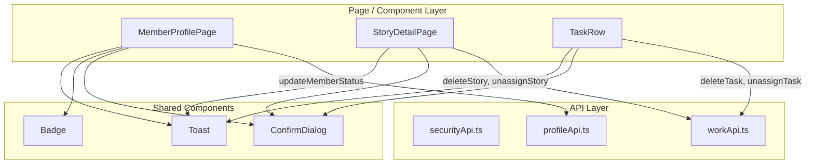

# Design Document: Frontend Missing UI

## Overview

This feature closes gaps between the existing backend API and the React + TypeScript frontend by adding missing API client methods, UI controls, and page-level wiring. The scope covers:

1. **API client additions** — new methods in `securityApi.ts`, `profileApi.ts`, and `workApi.ts` for OTP, member status, availability, story/task deletion, and story/task unassignment.
2. **MemberProfilePage enhancements** — status badge (already partially present), status management dropdown with confirm dialog (OrgAdmin-only).
3. **StoryDetailPage enhancements** — delete button with confirm dialog (DeptLead+), unassign option when a story has an assignee.
4. **TaskRow / task detail enhancements** — delete icon button with confirm dialog (DeptLead+), unassign option when a task has an assignee.
5. **Role-based visibility** — OrgAdmin for status management, DeptLead or OrgAdmin for deletion.

All changes follow existing patterns: `createApiClient` + `.then((r) => r.data)`, `useAuth()` for role checks, `ConfirmDialog` for confirmations, `useToast()` for notifications, `ApiError` + `mapErrorCode()` for error handling, and Tailwind CSS for styling.

## Architecture

The feature is purely additive — no new pages, routes, or stores are introduced. Changes are scoped to three layers:



### Design Decisions

1. **No new components** — Status management uses a native `<select>` dropdown consistent with the existing self-edit section in MemberProfilePage. Delete and unassign controls are inline buttons/icons added to existing layouts.
2. **Confirmation before destructive actions** — All status changes, deletions, and unassignments that are destructive use the existing `ConfirmDialog` component.
3. **Optimistic refresh** — After a successful mutation, the page re-fetches data via the existing `fetchStory` / `fetchMember` callbacks rather than optimistically updating local state. This keeps the pattern consistent with the rest of the codebase.
4. **Role checks at render time** — Visibility of controls is determined by `useAuth().user.roleName` at render time, matching the existing `isOrgAdmin` pattern in MemberProfilePage.

## Components and Interfaces

### 1. API Client Additions

#### securityApi.ts — New Methods

```typescript
requestOtp: (data: { email: string }): Promise<void> =>
    client.post('/api/v1/auth/otp/request', data).then(() => undefined),

verifyOtp: (data: { email: string; otp: string }): Promise<{ verified: boolean }> =>
    client.post('/api/v1/auth/otp/verify', data).then((r) => r.data),
```

#### profileApi.ts — New Methods

```typescript
updateMemberStatus: (id: string, data: { status: FlgStatus }): Promise<void> =>
    client.patch(`/api/v1/team-members/${id}/status`, data).then(() => undefined),

updateAvailability: (id: string, data: { availability: Availability }): Promise<void> =>
    client.patch(`/api/v1/team-members/${id}/availability`, data).then(() => undefined),
```

#### workApi.ts — New Methods

```typescript
deleteStory: (id: string): Promise<void> =>
    client.delete(`/api/v1/stories/${id}`).then(() => undefined),

deleteTask: (id: string): Promise<void> =>
    client.delete(`/api/v1/tasks/${id}`).then(() => undefined),

unassignStory: (id: string): Promise<void> =>
    client.patch(`/api/v1/stories/${id}/unassign`).then(() => undefined),

unassignTask: (id: string): Promise<void> =>
    client.patch(`/api/v1/tasks/${id}/unassign`).then(() => undefined),
```

### 2. MemberProfilePage Changes

New state variables:
- `statusConfirmOpen: boolean` — controls ConfirmDialog visibility
- `pendingStatus: FlgStatus | null` — the status value awaiting confirmation

New UI elements (OrgAdmin-only):
- A `<select>` dropdown next to the existing status Badge in the header, with options: Active (A), Suspended (S), Deactivated (D).
- On change → set `pendingStatus` and open `ConfirmDialog`.
- On confirm → call `profileApi.updateMemberStatus(id, { status: pendingStatus })`, toast success, re-fetch.
- On cancel → reset `pendingStatus`, close dialog.

The existing status Badge already renders `member.flgStatus` mapped to "Active"/"Suspended"/"Deactivated". No change needed there.

### 3. StoryDetailPage Changes

New state variables:
- `deleteConfirmOpen: boolean`
- `unassigning: boolean`

New UI elements:
- **Delete button** (DeptLead/OrgAdmin only): A `Trash2` icon button in the story header, next to the existing Edit button. Opens `ConfirmDialog` with a soft-delete warning. On confirm → `workApi.deleteStory(id)`, toast success, `navigate('/stories')`. On error → toast error.
- **Unassign option**: When `story.assigneeId` is not null, an `UserX` icon button or "Unassign" text link next to the Assignee MetaItem. On click → `workApi.unassignStory(id)`, toast success, re-fetch. On error → toast error. No ConfirmDialog needed (non-destructive).

### 4. TaskRow Changes

The existing `TaskRow` is a local function component inside `StoryDetailPage.tsx`. It needs to be enhanced to accept callbacks and role context.

Updated props:
```typescript
interface TaskRowProps {
    task: TaskDetail;
    canDelete: boolean;
    onDelete: (taskId: string) => void;
    onUnassign: (taskId: string) => void;
}
```

New UI elements:
- **Delete icon** (`Trash2`, size 14): Visible when `canDelete` is true. Calls `onDelete(task.taskId)`.
- **Unassign icon** (`UserX`, size 14): Visible when `task.assigneeId` is not null. Calls `onUnassign(task.taskId)`.

The parent (StoryDetailPage) manages the `ConfirmDialog` state for task deletion and calls `workApi.deleteTask` / `workApi.unassignTask` in the handlers, then re-fetches the story.

### 5. Role-Based Visibility Logic

```typescript
const { user } = useAuth();
const isOrgAdmin = user?.roleName === 'OrgAdmin';
const canDelete = user?.roleName === 'OrgAdmin' || user?.roleName === 'DeptLead';
```

| Control | Visible When |
|---|---|
| Status management dropdown (MemberProfilePage) | `isOrgAdmin` |
| Delete story button (StoryDetailPage) | `canDelete` (OrgAdmin or DeptLead) |
| Delete task icon (TaskRow) | `canDelete` (OrgAdmin or DeptLead) |
| Unassign story (StoryDetailPage) | `story.assigneeId !== null` (any authenticated user) |
| Unassign task (TaskRow) | `task.assigneeId !== null` (any authenticated user) |

## Data Models

No new data models are introduced. All changes use existing types:

- **`FlgStatus`** enum (`'A' | 'S' | 'D'`) — used for member status updates
- **`Availability`** enum — used for availability updates
- **`TeamMemberDetail`** — already contains `flgStatus` and `availability` fields
- **`StoryDetail`** — already contains `assigneeId`, `storyId`
- **`TaskDetail`** — already contains `assigneeId`, `taskId`
- **`ApiError`** — used for error propagation from all new API methods
- **`ConfirmDialogProps`** — `{ open, onConfirm, onCancel, title, message, confirmLabel?, destructive? }`

New request/response shapes (inline, no separate type files needed):

| Method | Request Body | Response |
|---|---|---|
| `requestOtp` | `{ email: string }` | `void` |
| `verifyOtp` | `{ email: string; otp: string }` | `{ verified: boolean }` |
| `updateMemberStatus` | `{ status: FlgStatus }` | `void` |
| `updateAvailability` | `{ availability: Availability }` | `void` |
| `deleteStory` | — | `void` |
| `deleteTask` | — | `void` |
| `unassignStory` | — | `void` |
| `unassignTask` | — | `void` |


## Correctness Properties

*A property is a characteristic or behavior that should hold true across all valid executions of a system — essentially, a formal statement about what the system should do. Properties serve as the bridge between human-readable specifications and machine-verifiable correctness guarantees.*

### Property 1: API client methods produce correct HTTP requests

*For any* new API client method (requestOtp, verifyOtp, updateMemberStatus, updateAvailability, deleteStory, deleteTask, unassignStory, unassignTask) and *for any* valid arguments (random UUIDs for IDs, random valid enum values for status/availability, random strings for email/otp), calling the method should result in an HTTP request with the correct method (POST/PATCH/DELETE), the correct URL path containing the provided ID, and the correct request body containing the provided payload.

**Validates: Requirements 1.1, 1.2, 2.1, 3.1, 4.1, 5.1, 6.1, 7.1**

### Property 2: API client error propagation

*For any* new API client method and *for any* error response from the backend containing an error code, the method should reject with an `ApiError` instance whose `errorCode` matches the backend-provided error code.

**Validates: Requirements 1.3, 1.4, 3.2**

### Property 3: Status management control visibility is determined by OrgAdmin role

*For any* authenticated user and *for any* member profile, the status management dropdown is rendered if and only if `user.roleName === 'OrgAdmin'`.

**Validates: Requirements 2.3, 2.8**

### Property 4: Delete controls visibility is determined by DeptLead or OrgAdmin role

*For any* authenticated user, the story delete button and task delete icon are rendered if and only if `user.roleName` is `'OrgAdmin'` or `'DeptLead'`.

**Validates: Requirements 4.2, 4.7, 5.2, 5.7**

### Property 5: Unassign option visibility is determined by assignee presence

*For any* story or task, the unassign option is rendered if and only if the entity's `assigneeId` is not null.

**Validates: Requirements 6.2, 7.2**

### Property 6: Status badge correctly maps flgStatus to display label

*For any* `TeamMemberDetail` with a `flgStatus` value in `{'A', 'S', 'D'}`, the MemberProfilePage should render a Badge whose text content is the corresponding label: `'A'` → `'Active'`, `'S'` → `'Suspended'`, `'D'` → `'Deactivated'`.

**Validates: Requirements 2.2**

### Property 7: Error toasts display mapped error messages

*For any* failed API call from any of the new UI actions (status change, story delete, task delete, story unassign, task unassign) that rejects with an `ApiError`, the displayed error toast message should equal `mapErrorCode(error.errorCode)`.

**Validates: Requirements 2.7, 4.6, 5.6, 6.5, 7.5**

### Property 8: Confirm action triggers correct API call with correct arguments

*For any* confirmed destructive action (status change, story deletion, task deletion, story unassignment, task unassignment) and *for any* valid entity ID and payload, the corresponding API client method is called exactly once with the entity's ID and the selected payload value.

**Validates: Requirements 2.5, 4.4, 5.4, 6.3, 7.3**

## Error Handling

All new UI actions follow the existing error handling pattern established in the codebase:

### Pattern

```typescript
try {
    await apiMethod(id, payload);
    addToast('success', 'Success message');
    // refresh or navigate
} catch (err) {
    if (err instanceof ApiError) {
        addToast('error', mapErrorCode(err.errorCode));
    } else {
        addToast('error', 'Fallback generic message');
    }
}
```

### Error Scenarios by Action

| Action | Success Behavior | Error Toast |
|---|---|---|
| Update member status | Toast "Member status updated", re-fetch member | `mapErrorCode(err.errorCode)` |
| Delete story | Toast "Story deleted", navigate to `/stories` | `mapErrorCode(err.errorCode)`, stay on page |
| Delete task | Toast "Task deleted", re-fetch story | `mapErrorCode(err.errorCode)` |
| Unassign story | Toast "Story unassigned", re-fetch story | `mapErrorCode(err.errorCode)` |
| Unassign task | Toast "Task unassigned", re-fetch story | `mapErrorCode(err.errorCode)` |
| Request OTP | (consumed by future features) | Propagates `ApiError` to caller |
| Verify OTP | (consumed by future features) | Propagates `ApiError` to caller |
| Update availability | (consumed by future features) | Propagates `ApiError` to caller |

### Relevant Existing Error Codes

The `errorMapping.ts` already maps these relevant codes:
- `LAST_ORGADMIN_CANNOT_DEACTIVATE` — when trying to deactivate the last OrgAdmin
- `ACCOUNT_INACTIVE` — when the target account is already inactive
- `INTERNAL_ERROR` — generic server error
- `VALIDATION_ERROR` — field-level validation failures

No new error codes need to be added to the mapping.

## Testing Strategy

### Dual Testing Approach

This feature uses both unit tests and property-based tests for comprehensive coverage.

### Unit Tests

Unit tests cover specific examples, edge cases, and integration points:

- **API client methods**: Verify each new method sends the correct HTTP request for a specific known input (e.g., a fixed UUID). Verify void methods resolve to `undefined`.
- **ConfirmDialog flow**: Verify that clicking Delete opens the dialog, clicking Cancel closes it without API call, clicking Confirm triggers the API call.
- **Navigation after deletion**: Verify `navigate('/stories')` is called after successful story deletion.
- **Loading/disabled states**: Verify buttons are disabled while an API call is in progress.
- **Edge case — last OrgAdmin**: Verify the error toast shows the correct message when `LAST_ORGADMIN_CANNOT_DEACTIVATE` is returned.

### Property-Based Tests

Property-based tests verify universal properties across generated inputs. The project should use **fast-check** as the PBT library (standard for TypeScript/React projects).

Each property test must:
- Run a minimum of 100 iterations
- Reference its design document property via a tag comment
- Use `fc.uuid()` for IDs, `fc.constantFrom('A', 'S', 'D')` for status values, `fc.constantFrom('OrgAdmin', 'DeptLead', 'Member', 'Viewer')` for roles, and `fc.emailAddress()` for emails

Property test mapping:

| Design Property | Test Tag | Generator Strategy |
|---|---|---|
| Property 1 | `Feature: frontend-missing-ui, Property 1: API client methods produce correct HTTP requests` | Generate random UUIDs, enum values, email strings; mock axios; assert request shape |
| Property 2 | `Feature: frontend-missing-ui, Property 2: API client error propagation` | Generate random error codes; mock axios to reject; assert ApiError fields |
| Property 3 | `Feature: frontend-missing-ui, Property 3: Status management control visibility is determined by OrgAdmin role` | Generate random role names; render MemberProfilePage; assert dropdown presence iff OrgAdmin |
| Property 4 | `Feature: frontend-missing-ui, Property 4: Delete controls visibility is determined by DeptLead or OrgAdmin role` | Generate random role names; render StoryDetailPage/TaskRow; assert delete button presence iff DeptLead or OrgAdmin |
| Property 5 | `Feature: frontend-missing-ui, Property 5: Unassign option visibility is determined by assignee presence` | Generate random nullable UUIDs for assigneeId; render components; assert unassign option presence iff non-null |
| Property 6 | `Feature: frontend-missing-ui, Property 6: Status badge correctly maps flgStatus to display label` | Generate random flgStatus values from {A, S, D}; render Badge; assert text matches mapping |
| Property 7 | `Feature: frontend-missing-ui, Property 7: Error toasts display mapped error messages` | Generate random error codes from errorCodeMap keys; simulate failed API calls; assert toast message equals mapErrorCode output |
| Property 8 | `Feature: frontend-missing-ui, Property 8: Confirm action triggers correct API call with correct arguments` | Generate random UUIDs and payloads; simulate confirm flow; assert API method called with exact arguments |

Each correctness property is implemented by a single property-based test. Unit tests complement these by covering the specific examples, edge cases, and integration behaviors listed above.
