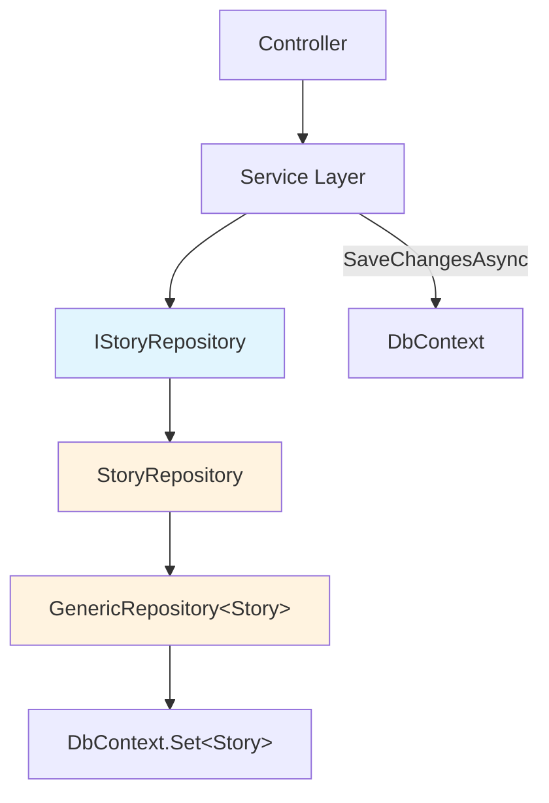
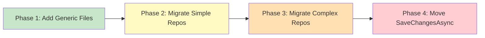

# Design Document: Generic Repository Pattern

## Overview

This design introduces `IGenericRepository<T>` and `GenericRepository<T>` across all five backend services (SecurityService, ProfileService, WorkService, BillingService, UtilityService) to eliminate duplicated CRUD boilerplate from ~43 repositories. The generic repository centralizes 10 common data access operations behind a single interface, while service-specific repositories extend it with custom query methods (pagination, full-text search, cross-entity counts, `IgnoreQueryFilters`). Persistence control (`SaveChangesAsync`) moves out of repositories into the service layer, enabling proper transaction boundaries. Each service defines its own copy of the generic interface and implementation — no shared library — preserving independent deployability.

### Key Design Decisions

1. **`DbContext` (not typed context) as constructor parameter** — `GenericRepository<T>` accepts `DbContext` and uses `Set<T>()`, so the same base class works with `SecurityDbContext`, `ProfileDbContext`, `WorkDbContext`, `BillingDbContext`, and `UtilityDbContext` without modification.
2. **No `SaveChangesAsync` in repositories** — The service layer (e.g., `StoryService`, `PlanService`) calls `SaveChangesAsync` after one or more repository operations, enabling atomic multi-operation transactions.
3. **`FindWithoutFiltersAsync` for cross-org queries** — Repositories like `SubscriptionRepository` and `TeamMemberRepository` that use `IgnoreQueryFilters()` get a dedicated generic method rather than requiring direct `DbContext` access.
4. **Per-service placement, not a shared NuGet package** — Each service owns its copy of the generic code in standardized folder paths, keeping services independently deployable.
5. **Incremental migration** — Services migrate one repository at a time. Migrated and non-migrated repositories coexist within the same service during the transition.

## Architecture

### Layered Structure (Per Service)

```
ServiceName/
├── ServiceName.Domain/
│   └── Interfaces/
│       └── Repositories/
│           ├── Generics/
│           │   └── IGenericRepository.cs          ← Generic interface
│           ├── Stories/
│           │   └── IStoryRepository.cs            ← Extends IGenericRepository<Story>
│           └── Projects/
│               └── IProjectRepository.cs          ← Extends IGenericRepository<Project>
├── ServiceName.Infrastructure/
│   └── Repositories/
│       ├── Generics/
│       │   └── GenericRepository.cs               ← Generic implementation
│       ├── Stories/
│       │   └── StoryRepository.cs                 ← Extends GenericRepository<Story>
│       └── Projects/
│           └── ProjectRepository.cs               ← Extends GenericRepository<Project>
└── ServiceName.Api/
    └── ...
```

### Dependency Flow



The service layer holds a reference to both the repository (via its specific interface) and the `DbContext` (for calling `SaveChangesAsync`). Controllers depend only on service interfaces.

## Components and Interfaces

### IGenericRepository&lt;T&gt; Interface

```csharp
using System.Linq.Expressions;

namespace {ServiceName}.Domain.Interfaces.Repositories.Generics;

public interface IGenericRepository<T> where T : class
{
    Task<T?> GetByIdAsync(Guid id, CancellationToken ct = default);
    Task<List<T>> GetAllAsync(CancellationToken ct = default);
    IQueryable<T> FindAsync(Expression<Func<T, bool>> predicate);
    Task<T> AddAsync(T entity, CancellationToken ct = default);
    Task UpdateAsync(T entity, CancellationToken ct = default);
    Task DeleteAsync(T entity, CancellationToken ct = default);
    Task AddRangeAsync(IEnumerable<T> entities, CancellationToken ct = default);
    Task UpdateRangeAsync(IEnumerable<T> entities, CancellationToken ct = default);
    Task RemoveRangeAsync(IEnumerable<T> entities, CancellationToken ct = default);
    IQueryable<T> FindWithoutFiltersAsync(Expression<Func<T, bool>> predicate);
}
```

### GenericRepository&lt;T&gt; Implementation

```csharp
using System.Linq.Expressions;
using Microsoft.EntityFrameworkCore;

namespace {ServiceName}.Infrastructure.Repositories.Generics;

public class GenericRepository<T> : IGenericRepository<T> where T : class
{
    protected readonly DbContext _context;
    protected readonly DbSet<T> _dbSet;

    public GenericRepository(DbContext context)
    {
        _context = context;
        _dbSet = context.Set<T>();
    }

    public virtual async Task<T?> GetByIdAsync(Guid id, CancellationToken ct = default)
        => await _dbSet.FindAsync(new object[] { id }, ct);

    public virtual async Task<List<T>> GetAllAsync(CancellationToken ct = default)
        => await _dbSet.ToListAsync(ct);

    public virtual IQueryable<T> FindAsync(Expression<Func<T, bool>> predicate)
        => _dbSet.Where(predicate);

    public virtual async Task<T> AddAsync(T entity, CancellationToken ct = default)
    {
        await _dbSet.AddAsync(entity, ct);
        return entity;
    }

    public virtual Task UpdateAsync(T entity, CancellationToken ct = default)
    {
        _dbSet.Update(entity);
        return Task.CompletedTask;
    }

    public virtual Task DeleteAsync(T entity, CancellationToken ct = default)
    {
        _dbSet.Remove(entity);
        return Task.CompletedTask;
    }

    public virtual async Task AddRangeAsync(IEnumerable<T> entities, CancellationToken ct = default)
        => await _dbSet.AddRangeAsync(entities, ct);

    public virtual Task UpdateRangeAsync(IEnumerable<T> entities, CancellationToken ct = default)
    {
        _dbSet.UpdateRange(entities);
        return Task.CompletedTask;
    }

    public virtual Task RemoveRangeAsync(IEnumerable<T> entities, CancellationToken ct = default)
    {
        _dbSet.RemoveRange(entities);
        return Task.CompletedTask;
    }

    public virtual IQueryable<T> FindWithoutFiltersAsync(Expression<Func<T, bool>> predicate)
        => _dbSet.IgnoreQueryFilters().Where(predicate);
}
```

### Design Rationale

- **`virtual` methods**: Allow service-specific repositories to override generic behavior when needed (e.g., `GetByIdAsync` with `Include` chains).
- **`protected DbContext _context`**: Gives subclasses direct access for complex queries that go beyond `Set<T>()` (e.g., cross-entity joins in `StoryRepository.CountTasksAsync`).
- **`DbSet<T> _dbSet`**: Cached once in constructor to avoid repeated `Set<T>()` calls.
- **No `SaveChangesAsync`**: Mutation methods (`Add`, `Update`, `Delete` and their range variants) only stage changes in the EF change tracker. The service layer flushes.

### Service-Specific Interface Extension Pattern

```csharp
// Before: IStoryRepository (standalone)
public interface IStoryRepository
{
    Task<Story?> GetByIdAsync(Guid storyId, CancellationToken ct = default);
    Task<Story> AddAsync(Story story, CancellationToken ct = default);
    Task UpdateAsync(Story story, CancellationToken ct = default);
    // ... custom methods
    Task<(IEnumerable<Story> Items, int TotalCount)> ListAsync(...);
    Task<(IEnumerable<Story> Items, int TotalCount)> SearchAsync(...);
    Task<int> CountTasksAsync(Guid storyId, CancellationToken ct = default);
}

// After: IStoryRepository extends IGenericRepository<Story>
public interface IStoryRepository : IGenericRepository<Story>
{
    // Only custom methods remain — CRUD inherited from IGenericRepository<Story>
    Task<Story?> GetByKeyAsync(Guid organizationId, string storyKey, CancellationToken ct = default);
    Task<(IEnumerable<Story> Items, int TotalCount)> ListAsync(...);
    Task<(IEnumerable<Story> Items, int TotalCount)> SearchAsync(...);
    Task<int> CountTasksAsync(Guid storyId, CancellationToken ct = default);
    Task<int> CountCompletedTasksAsync(Guid storyId, CancellationToken ct = default);
    Task<bool> AllDevTasksDoneAsync(Guid storyId, CancellationToken ct = default);
    Task<bool> AllTasksDoneAsync(Guid storyId, CancellationToken ct = default);
    Task<bool> ExistsByProjectAsync(Guid projectId, CancellationToken ct = default);
}
```

### Service-Specific Implementation Inheritance Pattern

```csharp
// Before: StoryRepository (standalone)
public class StoryRepository : IStoryRepository
{
    private readonly WorkDbContext _db;
    public StoryRepository(WorkDbContext db) => _db = db;

    public async Task<Story?> GetByIdAsync(Guid storyId, CancellationToken ct = default)
        => await _db.Stories.FirstOrDefaultAsync(s => s.StoryId == storyId, ct);

    public async Task<Story> AddAsync(Story story, CancellationToken ct = default)
    {
        _db.Stories.Add(story);
        await _db.SaveChangesAsync(ct);  // ← SaveChangesAsync inside repo
        return story;
    }
    // ...
}

// After: StoryRepository extends GenericRepository<Story>
public class StoryRepository : GenericRepository<Story>, IStoryRepository
{
    private readonly WorkDbContext _db;

    public StoryRepository(WorkDbContext db) : base(db)
    {
        _db = db;
    }

    // GetByIdAsync, AddAsync, UpdateAsync, DeleteAsync — inherited from GenericRepository<Story>
    // No SaveChangesAsync anywhere in this class

    // Custom methods remain unchanged:
    public async Task<Story?> GetByKeyAsync(Guid organizationId, string storyKey, CancellationToken ct = default)
        => await _db.Stories.FirstOrDefaultAsync(s => s.OrganizationId == organizationId && s.StoryKey == storyKey, ct);

    public async Task<(IEnumerable<Story> Items, int TotalCount)> ListAsync(...)
    {
        // Existing pagination/filtering logic unchanged
    }

    public async Task<(IEnumerable<Story> Items, int TotalCount)> SearchAsync(...)
    {
        // Existing full-text search logic unchanged
    }

    // Cross-entity queries use _db directly (not _dbSet)
    public async Task<int> CountTasksAsync(Guid storyId, CancellationToken ct = default)
        => await _db.Tasks.CountAsync(t => t.StoryId == storyId, ct);
}
```

### Service Layer SaveChangesAsync Migration

```csharp
// Before: Service method (SaveChangesAsync handled by repository)
public async Task<StoryResponse> CreateAsync(Guid orgId, Guid reporterId, CreateStoryRequest req, CancellationToken ct)
{
    var story = new Story { /* ... */ };
    await _storyRepo.AddAsync(story, ct);  // SaveChangesAsync called inside AddAsync
    await _activityLogRepo.AddAsync(log, ct);  // SaveChangesAsync called again
    return MapToResponse(story);
}

// After: Service method (SaveChangesAsync in service layer)
public async Task<StoryResponse> CreateAsync(Guid orgId, Guid reporterId, CreateStoryRequest req, CancellationToken ct)
{
    var story = new Story { /* ... */ };
    await _storyRepo.AddAsync(story, ct);       // Only stages in change tracker
    await _activityLogRepo.AddAsync(log, ct);   // Only stages in change tracker
    await _dbContext.SaveChangesAsync(ct);       // Single flush — atomic
    return MapToResponse(story);
}
```

The service layer injects `DbContext` alongside repositories. For services that already inject `DbContext` (some do for direct queries), no new dependency is needed.

### DI Registration Pattern

```csharp
// In DependencyInjection.cs — no changes to registration pattern
// Service-specific interfaces map to service-specific implementations as before
services.AddScoped<IStoryRepository, StoryRepository>();
services.AddScoped<IProjectRepository, ProjectRepository>();

// For entities with no custom methods (hypothetical):
services.AddScoped<IGenericRepository<SomeSimpleEntity>, GenericRepository<SomeSimpleEntity>>();
```

No open-generic registration (`typeof(IGenericRepository<>)`) is used. Each repository is registered against its specific interface.

### Per-Service File Placement

| Service | Interface Path | Implementation Path |
|---------|---------------|---------------------|
| SecurityService | `Domain/Interfaces/Repositories/Generics/IGenericRepository.cs` | `Infrastructure/Repositories/Generics/GenericRepository.cs` |
| ProfileService | `Domain/Interfaces/Repositories/Generics/IGenericRepository.cs` | `Infrastructure/Repositories/Generics/GenericRepository.cs` |
| WorkService | `Domain/Interfaces/Repositories/Generics/IGenericRepository.cs` | `Infrastructure/Repositories/Generics/GenericRepository.cs` |
| BillingService | `Domain/Interfaces/Repositories/Generics/IGenericRepository.cs` | `Infrastructure/Repositories/Generics/GenericRepository.cs` |
| UtilityService | `Domain/Interfaces/Repositories/Generics/IGenericRepository.cs` | `Infrastructure/Repositories/Generics/GenericRepository.cs` |

Each service's namespace differs (e.g., `WorkService.Domain.Interfaces.Repositories.Generics`), so there is no cross-service coupling.


### Incremental Migration Approach



1. **Phase 1 — Add generic files**: Create `IGenericRepository.cs` and `GenericRepository.cs` in each service's `Generics/` folder. No existing code changes.
2. **Phase 2 — Migrate simple repositories**: Start with repos that have few or no custom methods (e.g., `PasswordHistoryRepository`, `StripeEventRepository`). Update interface to extend `IGenericRepository<T>`, update implementation to extend `GenericRepository<T>`, remove duplicated CRUD methods.
3. **Phase 3 — Migrate complex repositories**: Migrate repos with custom queries (e.g., `StoryRepository`, `SubscriptionRepository`). Keep custom methods, remove only the CRUD methods now provided by the base class.
4. **Phase 4 — Move SaveChangesAsync**: For each migrated repository, update the calling service methods to call `SaveChangesAsync` on `DbContext` after repository operations. This is done per-service-method, not per-repository.

During migration, both migrated and non-migrated repositories coexist. The DI registration pattern does not change — each repository is still registered against its specific interface.

### Repository Migration Checklist (Per Repository)

1. Update `IXxxRepository` to extend `IGenericRepository<Xxx>`
2. Remove CRUD method declarations from `IXxxRepository` that match generic signatures
3. Update `XxxRepository` to extend `GenericRepository<Xxx>`
4. Pass the service-specific `DbContext` to `base(db)` constructor
5. Remove CRUD method implementations that are now inherited
6. Keep all custom query methods unchanged
7. Update service methods that called this repository's mutation methods to call `SaveChangesAsync` on `DbContext`
8. Run existing tests — all should pass without assertion changes

## Data Models

No new database entities or tables are introduced. The generic repository operates on existing entity types through `DbContext.Set<T>()`.

### Entity Type Constraints

- `T` is constrained to `class` (reference types only)
- All existing entities already satisfy this constraint
- `GetByIdAsync` uses `DbSet<T>.FindAsync(Guid)`, which requires the entity's primary key to be a `Guid`. This matches the existing codebase where all entities use `Guid` primary keys.

### DbContext Compatibility Matrix

| DbContext | Entities | Query Filters | Notes |
|-----------|----------|---------------|-------|
| SecurityDbContext | PasswordHistory, ServiceToken | None | Simplest context, no org scoping |
| ProfileDbContext | Organization, TeamMember, Department, Invite, Device, ... | Org-scoped on most entities | Uses `IHttpContextAccessor` for org ID |
| WorkDbContext | Project, Story, Task, Sprint, Comment, Label, ... | Org-scoped + soft-delete (`FlgStatus`) | Most entities, heaviest query filter usage |
| BillingDbContext | Subscription, Plan, UsageRecord, StripeEvent | Org-scoped on Subscription, UsageRecord | Plan has no query filter |
| UtilityDbContext | AuditLog, ErrorLog, NotificationLog, DepartmentType, ... | Org-scoped + soft-delete on ref data | Sets `OrganizationId` property directly |

`FindWithoutFiltersAsync` is critical for services that need cross-org queries (e.g., `SubscriptionRepository.GetByOrganizationIdAsync`, `TeamMemberRepository.GetByEmailGlobalAsync`).


## Correctness Properties

*A property is a characteristic or behavior that should hold true across all valid executions of a system — essentially, a formal statement about what the system should do. Properties serve as the bridge between human-readable specifications and machine-verifiable correctness guarantees.*

### Property 1: Add-then-retrieve round trip

*For any* entity of type T and any GenericRepository<T> backed by an in-memory DbContext, if `AddAsync` is called with that entity and then `SaveChangesAsync` is called on the context, then `GetByIdAsync` with the entity's primary key should return a non-null entity equal to the original.

**Validates: Requirements 2.3, 2.6**

### Property 2: GetAllAsync returns all tracked entities

*For any* list of distinct entities of type T added via `AddAsync` (followed by `SaveChangesAsync`), `GetAllAsync` should return a list whose count equals the number of added entities and which contains every added entity.

**Validates: Requirements 2.4**

### Property 3: FindAsync filters correctly

*For any* set of entities of type T in the context and any predicate, `FindAsync(predicate).ToList()` should return exactly the subset of entities that satisfy the predicate — no more, no less.

**Validates: Requirements 2.5**

### Property 4: Single-entity mutation sets correct EntityState

*For any* entity of type T and any single-entity mutation operation (`AddAsync`, `UpdateAsync`, `DeleteAsync`), after calling the operation, the entity's entry in the DbContext change tracker should have the expected `EntityState` (`Added` for AddAsync, `Modified` for UpdateAsync, `Deleted` for DeleteAsync).

**Validates: Requirements 2.6, 2.7, 2.8**

### Property 5: Range mutation sets correct EntityState for all entities

*For any* collection of entities of type T and any range mutation operation (`AddRangeAsync`, `UpdateRangeAsync`, `RemoveRangeAsync`), after calling the operation, every entity in the collection should have the expected `EntityState` in the change tracker (`Added` for AddRangeAsync, `Modified` for UpdateRangeAsync, `Deleted` for RemoveRangeAsync).

**Validates: Requirements 2.9, 2.10, 2.11**

### Property 6: Mutation methods do not persist changes

*For any* entity of type T and any mutation method (`AddAsync`, `UpdateAsync`, `DeleteAsync`, `AddRangeAsync`, `UpdateRangeAsync`, `RemoveRangeAsync`), after calling the method, the DbContext should have unsaved changes (i.e., `ChangeTracker.HasChanges()` returns true) and no data should be written to the underlying store until `SaveChangesAsync` is explicitly called.

**Validates: Requirements 3.1**

### Property 7: FindWithoutFiltersAsync returns superset of FindAsync

*For any* entity type T that has a global query filter configured on its DbContext, and any predicate, the result set of `FindWithoutFiltersAsync(predicate)` should be a superset of (or equal to) the result set of `FindAsync(predicate)`. Specifically, every entity returned by `FindAsync` should also be returned by `FindWithoutFiltersAsync`, and `FindWithoutFiltersAsync` may additionally return entities excluded by the query filter.

**Validates: Requirements 6.1, 6.2**

### Property 8: Service-specific interface has no duplicate generic method signatures

*For any* service-specific repository interface that extends `IGenericRepository<T>`, the set of method signatures declared directly on the service-specific interface should have zero overlap with the method signatures defined on `IGenericRepository<T>`.

**Validates: Requirements 4.2**

### Property 9: Migrated repository behavioral equivalence

*For any* repository that has been migrated to extend `GenericRepository<T>`, and for any CRUD operation (GetByIdAsync, AddAsync, UpdateAsync, DeleteAsync) with any valid entity input, the migrated implementation should produce the same entity state changes and return values as the original standalone implementation.

**Validates: Requirements 5.3, 9.2**

## Error Handling

### Repository-Level Errors

| Scenario | Behavior | Responsibility |
|----------|----------|----------------|
| `GetByIdAsync` with non-existent ID | Returns `null` | Caller (service layer) checks for null and throws domain exception |
| `AddAsync` with null entity | `ArgumentNullException` from EF Core | Let propagate — caller should validate before calling |
| `UpdateAsync` / `DeleteAsync` with untracked entity | EF Core attaches and marks state | Normal EF behavior, no special handling |
| `FindAsync` with null predicate | `ArgumentNullException` from LINQ | Let propagate — caller should validate |
| `FindWithoutFiltersAsync` on entity without query filters | Works normally — `IgnoreQueryFilters()` is a no-op | No special handling needed |
| `SaveChangesAsync` concurrency conflict | `DbUpdateConcurrencyException` | Service layer catches and handles (retry or conflict response) |
| `SaveChangesAsync` constraint violation | `DbUpdateException` | Service layer catches and maps to domain error |

### Migration-Specific Error Handling

- If a service method previously relied on `SaveChangesAsync` being called inside the repository (e.g., to get a database-generated ID), the service method must now call `SaveChangesAsync` before accessing that ID.
- If a service method calls multiple repositories and one fails, the service layer can choose not to call `SaveChangesAsync`, effectively rolling back all staged changes (since nothing was persisted).

## Testing Strategy

### Dual Testing Approach

Both unit tests and property-based tests are required for comprehensive coverage.

### Unit Tests

Unit tests verify specific examples, edge cases, and integration points:

- **Interface structure tests**: Verify `IGenericRepository<T>` has all 10 methods with correct signatures via reflection.
- **Constructor injection test**: Verify `GenericRepository<T>` accepts `DbContext` and initializes `_dbSet`.
- **Null entity handling**: Verify `AddAsync(null)` throws `ArgumentNullException`.
- **Empty collection handling**: Verify `GetAllAsync` returns empty list when no entities exist.
- **DI resolution tests**: Verify service-specific interfaces resolve to correct implementations.
- **Migration smoke tests**: For each migrated repository, verify existing test suite passes unchanged.

### Property-Based Tests

Property-based tests verify universal properties across randomly generated inputs. Use **FsCheck** (or **FsCheck.Xunit**) as the property-based testing library for C#/.NET.

Each property test must:
- Run a minimum of 100 iterations
- Reference its design document property via a tag comment
- Use EF Core's in-memory provider (`UseInMemoryDatabase`) for isolation

**Property test mapping:**

| Property | Test Description | Generator |
|----------|-----------------|-----------|
| Property 1 | Add entity, save, retrieve by ID — should match | Random entity with random Guid ID and string fields |
| Property 2 | Add N entities, save, GetAllAsync — count and contents match | Random list of 0-50 entities |
| Property 3 | Add entities, FindAsync with predicate — returns exact matches | Random entities + random predicate on a string/bool field |
| Property 4 | Call Add/Update/Delete, check EntityState | Random entity + random operation choice |
| Property 5 | Call AddRange/UpdateRange/RemoveRange, check all EntityStates | Random list of 1-20 entities + random range operation |
| Property 6 | Call any mutation, check HasChanges() is true and no DB write | Random entity + random mutation method |
| Property 7 | Add filtered + unfiltered entities, compare Find vs FindWithoutFilters | Random entities, some matching filter, some not |
| Property 8 | Reflect on service-specific interfaces, check no signature overlap | Enumerate all migrated interfaces |
| Property 9 | Run same operation on old and new implementation, compare results | Random entity + random CRUD operation |

**Test tag format:**
```csharp
// Feature: generic-repository-pattern, Property 1: Add-then-retrieve round trip
[Property(MaxTest = 100)]
public Property AddThenRetrieveRoundTrip() { ... }
```

### Test Configuration

```xml
<!-- Add to test project .csproj -->
<PackageReference Include="FsCheck" Version="2.16.*" />
<PackageReference Include="FsCheck.Xunit" Version="2.16.*" />
<PackageReference Include="Microsoft.EntityFrameworkCore.InMemory" Version="8.*" />
```

Each service's test project gets its own property tests targeting `GenericRepository<T>` with that service's entity types. A shared test helper class can create in-memory DbContexts for each service.
