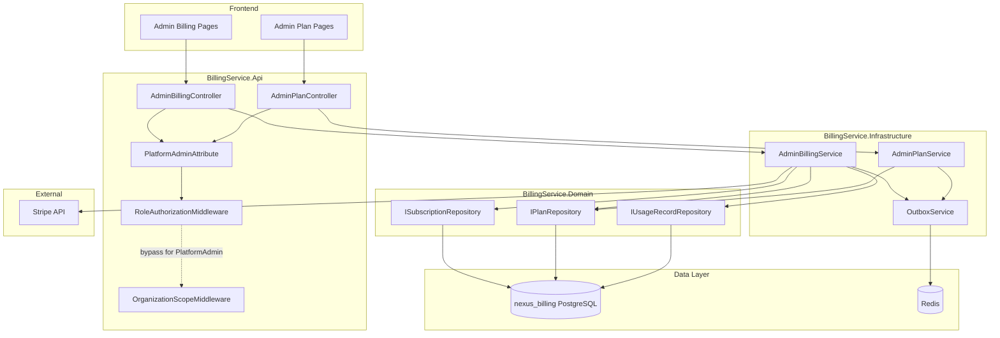
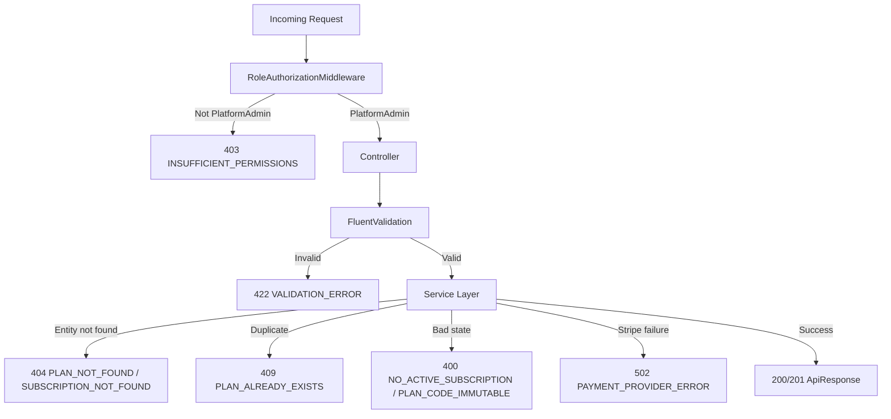

# Design Document: Platform Admin Billing Management

## Overview

This design extends the BillingService and the React frontend to provide PlatformAdmin users with cross-organization billing management capabilities. Currently, billing operations are scoped to individual organizations via the `OrgAdmin` role and `OrganizationScopeMiddleware`. PlatformAdmin users (who authenticate with `organizationId=Guid.Empty`) have no billing visibility.

The feature introduces:
- A new `AdminBillingController` in the BillingService Api layer with endpoints under `/api/v1/admin/billing/*`
- A `PlatformAdminAttribute` and corresponding middleware check to restrict these endpoints
- An `IAdminBillingService` in the Domain/Infrastructure layers for cross-organization billing queries and mutations
- New DTOs for admin-specific request/response shapes (paginated lists, usage summaries, override requests)
- Frontend pages under `/admin/billing` and `/admin/billing/plans` within the existing `AdminLayout`
- A Zustand store for admin billing state management

All new backend code follows the existing Clean Architecture conventions: entity-named subfolders, `ApiResponse<T>` envelope, `DomainException` pattern, FluentValidation, and Redis outbox for audit events.

## Architecture

### High-Level Flow



### Key Architectural Decisions

1. **Separate controller, not extending existing ones.** Admin endpoints live in `AdminBillingController` and `AdminPlanController` rather than adding admin routes to `SubscriptionController` or `PlanController`. This keeps the authorization model clean — existing controllers use `[OrgAdmin]`, admin controllers use `[PlatformAdmin]`.

2. **Bypass OrganizationScopeMiddleware for PlatformAdmin.** PlatformAdmin tokens have `organizationId=Guid.Empty`. The `OrganizationScopeMiddleware` already skips validation when `organizationId` is empty, so admin endpoints naturally bypass org scoping. The `BillingDbContext` query filters also pass through when `_organizationId` is null/empty, allowing cross-org queries.

3. **Unscoped DbContext for admin queries.** Admin service methods will use `IgnoreQueryFilters()` on EF Core queries to read across all organizations, since the global query filter scopes by `_organizationId`.

4. **Reuse existing domain entities.** No new database tables are needed. The `Plan`, `Subscription`, and `UsageRecord` entities already contain all required data. Admin operations are new service methods that query/mutate these existing entities.

5. **ProfileService call for organization names.** Subscription listings need organization names. The admin service will call ProfileService via the existing typed client pattern (with Polly resilience) to resolve organization names, or accept that the frontend can join this data from its existing org list.

## Components and Interfaces

### Backend — Api Layer

#### PlatformAdminAttribute

New attribute in `BillingService.Api/Attributes/PlatformAdminAttribute.cs`:

```csharp
[AttributeUsage(AttributeTargets.Class | AttributeTargets.Method)]
public class PlatformAdminAttribute : Attribute { }
```

#### RoleAuthorizationMiddleware Update

Extend the existing middleware to check for `PlatformAdminAttribute` in addition to `OrgAdminAttribute`:

```csharp
var requiresPlatformAdmin = endpoint?.Metadata.GetMetadata<PlatformAdminAttribute>() is not null;

if (requiresPlatformAdmin && roleName != "PlatformAdmin")
{
    await WriteErrorResponse(context, "PlatformAdmin access required.");
    return;
}
```

When `PlatformAdmin` is detected, the middleware allows the request through without requiring `OrgAdmin`.

#### AdminBillingController

`BillingService.Api/Controllers/AdminBillingController.cs`

| Method | Route | Description |
|--------|-------|-------------|
| GET | `/api/v1/admin/billing/subscriptions` | Paginated list of all subscriptions with org names |
| GET | `/api/v1/admin/billing/organizations/{organizationId}` | Single org billing detail |
| POST | `/api/v1/admin/billing/organizations/{organizationId}/override` | Override subscription plan |
| POST | `/api/v1/admin/billing/organizations/{organizationId}/cancel` | Admin cancel subscription |
| GET | `/api/v1/admin/billing/usage/summary` | Platform-wide usage aggregation |
| GET | `/api/v1/admin/billing/usage/organizations` | Per-org usage list |

All endpoints decorated with `[PlatformAdmin]` and `[Authorize]`.

#### AdminPlanController

`BillingService.Api/Controllers/AdminPlanController.cs`

| Method | Route | Description |
|--------|-------|-------------|
| GET | `/api/v1/admin/billing/plans` | All plans (active + inactive) |
| POST | `/api/v1/admin/billing/plans` | Create new plan |
| PUT | `/api/v1/admin/billing/plans/{planId}` | Update existing plan |
| PATCH | `/api/v1/admin/billing/plans/{planId}/deactivate` | Deactivate plan |

All endpoints decorated with `[PlatformAdmin]` and `[Authorize]`.

### Backend — Domain Layer

#### New Service Interface

`BillingService.Domain/Interfaces/Services/IAdminBillingService.cs`:

```csharp
public interface IAdminBillingService
{
    Task<object> GetAllSubscriptionsAsync(string? status, string? search, int page, int pageSize, CancellationToken ct);
    Task<object> GetOrganizationBillingAsync(Guid organizationId, CancellationToken ct);
    Task<object> OverrideSubscriptionAsync(Guid organizationId, Guid planId, string? reason, Guid adminId, CancellationToken ct);
    Task<object> AdminCancelSubscriptionAsync(Guid organizationId, string? reason, Guid adminId, CancellationToken ct);
    Task<object> GetUsageSummaryAsync(CancellationToken ct);
    Task<object> GetOrganizationUsageListAsync(int? threshold, int page, int pageSize, CancellationToken ct);
}
```

#### New Service Interface

`BillingService.Domain/Interfaces/Services/IAdminPlanService.cs`:

```csharp
public interface IAdminPlanService
{
    Task<object> GetAllPlansAsync(CancellationToken ct);
    Task<object> CreatePlanAsync(object request, CancellationToken ct);
    Task<object> UpdatePlanAsync(Guid planId, object request, CancellationToken ct);
    Task<object> DeactivatePlanAsync(Guid planId, Guid adminId, CancellationToken ct);
}
```

#### Extended Repository Interfaces

New methods on existing repository interfaces:

`IPlanRepository` additions:
```csharp
Task<List<Plan>> GetAllAsync(CancellationToken ct); // includes inactive
Task UpdateAsync(Plan plan, CancellationToken ct);
```

`ISubscriptionRepository` additions:
```csharp
Task<List<Subscription>> GetAllWithPlansAsync(CancellationToken ct); // unscoped, includes Plan nav
Task<int> GetCountByStatusAsync(string status, CancellationToken ct);
```

`IUsageRecordRepository` additions:
```csharp
Task<List<UsageRecord>> GetAllCurrentPeriodAsync(DateTime periodStart, CancellationToken ct); // unscoped
```

#### New Error Codes

Added to `ErrorCodes.cs`:

```csharp
public const string PlanAlreadyExists = "PLAN_ALREADY_EXISTS";
public const int PlanAlreadyExistsValue = 5015;

public const string InsufficientPermissions = "INSUFFICIENT_PERMISSIONS";
public const int InsufficientPermissionsValue = 5016;

public const string PlanCodeImmutable = "PLAN_CODE_IMMUTABLE";
public const int PlanCodeImmutableValue = 5017;
```

### Backend — Application Layer

#### New DTOs

`DTOs/Admin/` subfolder:

```
DTOs/Admin/
├── AdminSubscriptionListResponse.cs
├── AdminSubscriptionListItem.cs
├── AdminOrganizationBillingResponse.cs
├── AdminOverrideRequest.cs
├── AdminCancelRequest.cs
├── AdminUsageSummaryResponse.cs
├── AdminOrganizationUsageItem.cs
├── AdminCreatePlanRequest.cs
├── AdminUpdatePlanRequest.cs
├── AdminPlanResponse.cs
├── PaginatedResponse.cs
```

Key DTOs:

```csharp
public record AdminSubscriptionListItem(
    Guid SubscriptionId,
    Guid OrganizationId,
    string OrganizationName,
    Guid PlanId,
    string PlanName,
    string Status,
    DateTime CurrentPeriodStart,
    DateTime? CurrentPeriodEnd,
    DateTime? TrialEndDate);

public record PaginatedResponse<T>(
    List<T> Items,
    int TotalCount,
    int Page,
    int PageSize);

public record AdminOverrideRequest(
    Guid PlanId,
    string? Reason);

public record AdminCancelRequest(
    string? Reason);

public record AdminCreatePlanRequest(
    string PlanName,
    string PlanCode,
    int TierLevel,
    int MaxTeamMembers,
    int MaxDepartments,
    int MaxStoriesPerMonth,
    decimal PriceMonthly,
    decimal PriceYearly,
    string? FeaturesJson);

public record AdminUpdatePlanRequest(
    string PlanName,
    int TierLevel,
    int MaxTeamMembers,
    int MaxDepartments,
    int MaxStoriesPerMonth,
    decimal PriceMonthly,
    decimal PriceYearly,
    string? FeaturesJson);

public record AdminUsageSummaryResponse(
    long TotalActiveMembers,
    long TotalStoriesCreated,
    long TotalStorageBytes,
    List<PlanTierBreakdown> ByPlanTier);

public record PlanTierBreakdown(
    string PlanName,
    string PlanCode,
    int OrganizationCount);

public record AdminOrganizationUsageItem(
    Guid OrganizationId,
    string OrganizationName,
    string PlanName,
    List<UsageMetricWithLimit> Metrics);

public record UsageMetricWithLimit(
    string MetricName,
    long CurrentValue,
    long Limit,
    double PercentUsed);
```

#### New Validators

`Validators/Admin/` subfolder:

- `AdminCreatePlanRequestValidator` — validates all plan fields (positive integers, non-negative decimals, non-empty strings, planCode format `^[A-Z0-9_]{2,20}$`)
- `AdminUpdatePlanRequestValidator` — same validations minus planCode
- `AdminOverrideRequestValidator` — validates planId is not empty

### Backend — Infrastructure Layer

#### AdminBillingService

`Services/AdminBilling/AdminBillingService.cs`

Key implementation details:
- Uses `_dbContext.Subscriptions.IgnoreQueryFilters()` for cross-org queries
- Joins with `Plan` navigation property for plan names
- Calls ProfileService client to resolve organization names (with Polly resilience)
- Override creates a new subscription or updates existing, sets status to "Active", publishes audit event
- Admin cancel sets status immediately to "Cancelled" (not at period end), cancels Stripe subscription if external ID exists

#### AdminPlanService

`Services/AdminBilling/AdminPlanService.cs`

Key implementation details:
- `GetAllPlansAsync` returns both active and inactive plans
- `CreatePlanAsync` checks for duplicate planCode, creates entity
- `UpdatePlanAsync` validates planCode hasn't changed, updates entity
- `DeactivatePlanAsync` sets `IsActive = false`, publishes audit event

### Frontend

#### New Types

`src/frontend/src/types/adminBilling.ts`:

```typescript
export interface AdminSubscriptionListItem {
    subscriptionId: string;
    organizationId: string;
    organizationName: string;
    planId: string;
    planName: string;
    status: string;
    currentPeriodStart: string;
    currentPeriodEnd: string | null;
    trialEndDate: string | null;
}

export interface PaginatedResponse<T> {
    items: T[];
    totalCount: number;
    page: number;
    pageSize: number;
}

export interface AdminUsageSummary {
    totalActiveMembers: number;
    totalStoriesCreated: number;
    totalStorageBytes: number;
    byPlanTier: PlanTierBreakdown[];
}

export interface PlanTierBreakdown {
    planName: string;
    planCode: string;
    organizationCount: number;
}

export interface AdminOrganizationUsageItem {
    organizationId: string;
    organizationName: string;
    planName: string;
    metrics: UsageMetricWithLimit[];
}

export interface UsageMetricWithLimit {
    metricName: string;
    currentValue: number;
    limit: number;
    percentUsed: number;
}

export interface AdminOverrideRequest {
    planId: string;
    reason?: string;
}

export interface AdminCancelRequest {
    reason?: string;
}

export interface AdminPlanResponse {
    planId: string;
    planName: string;
    planCode: string;
    tierLevel: number;
    maxTeamMembers: number;
    maxDepartments: number;
    maxStoriesPerMonth: number;
    featuresJson: string | null;
    priceMonthly: number;
    priceYearly: number;
    isActive: boolean;
    dateCreated: string;
}

export interface AdminCreatePlanRequest {
    planName: string;
    planCode: string;
    tierLevel: number;
    maxTeamMembers: number;
    maxDepartments: number;
    maxStoriesPerMonth: number;
    priceMonthly: number;
    priceYearly: number;
    featuresJson?: string;
}

export interface AdminUpdatePlanRequest {
    planName: string;
    tierLevel: number;
    maxTeamMembers: number;
    maxDepartments: number;
    maxStoriesPerMonth: number;
    priceMonthly: number;
    priceYearly: number;
    featuresJson?: string;
}
```

#### API Client

`src/frontend/src/api/adminBillingApi.ts` — new API client using the existing `createApiClient` pattern, targeting the BillingService base URL with admin endpoints.

#### Zustand Store

`src/frontend/src/stores/adminBillingStore.ts` — manages subscriptions list, plans list, usage summary, loading states, and filter/pagination state.

#### Pages

| Route | Component | Description |
|-------|-----------|-------------|
| `/admin/billing` | `PlatformAdminBillingPage` | Summary cards + subscriptions table |
| `/admin/billing/organizations/:id` | `PlatformAdminOrgBillingDetailPage` | Single org billing detail |
| `/admin/billing/plans` | `PlatformAdminPlansPage` | Plan management table + CRUD modals |

#### AdminLayout Sidebar Update

Add "Billing" nav item to the existing `AdminLayout` sidebar, using the `CreditCard` icon from lucide-react.

#### Router Update

Add new routes under the PlatformAdmin `RoleGuard` section in `router.tsx`.

## Data Models

### Existing Entities (No Schema Changes)

The feature operates entirely on existing database tables. No migrations are needed.

| Entity | Table | Key Fields Used |
|--------|-------|-----------------|
| `Plan` | `plans` | PlanId, PlanName, PlanCode, TierLevel, MaxTeamMembers, MaxDepartments, MaxStoriesPerMonth, PriceMonthly, PriceYearly, IsActive, FeaturesJson |
| `Subscription` | `subscriptions` | SubscriptionId, OrganizationId, PlanId, Status, ExternalSubscriptionId, CurrentPeriodStart, CurrentPeriodEnd, TrialEndDate, CancelledAt, ScheduledPlanId |
| `UsageRecord` | `usage_records` | UsageRecordId, OrganizationId, MetricName, MetricValue, PeriodStart, PeriodEnd |

### Query Patterns

- **Cross-org subscription list:** `Subscriptions.IgnoreQueryFilters().Include(s => s.Plan)` with optional `.Where(s => s.Status == status)` and `.Where(s => orgNames[s.OrganizationId].Contains(search))`
- **Usage aggregation:** `UsageRecords.IgnoreQueryFilters().Where(u => u.PeriodStart >= currentPeriodStart).GroupBy(u => u.MetricName).Select(g => new { MetricName = g.Key, Total = g.Sum(u => u.MetricValue) })`
- **Per-org usage with threshold:** Group by OrganizationId, join with subscription/plan for limits, filter where any metric's `percentUsed >= threshold`

### Audit Event Shape

Override and cancellation actions publish to `outbox:billing` using the existing `OutboxMessage` structure:

```json
{
    "messageId": "guid",
    "messageType": "AuditEvent",
    "serviceName": "BillingService",
    "organizationId": "target-org-guid",
    "action": "SubscriptionOverride",
    "entityType": "Subscription",
    "entityId": "subscription-guid",
    "oldValue": "{\"planId\":\"old-plan-guid\",\"planName\":\"Starter\"}",
    "newValue": "{\"planId\":\"new-plan-guid\",\"planName\":\"Enterprise\",\"reason\":\"Support escalation\",\"adminId\":\"admin-guid\"}",
    "correlationId": "correlation-id",
    "timestamp": "2024-01-15T10:30:00Z"
}
```


## Correctness Properties

*A property is a characteristic or behavior that should hold true across all valid executions of a system — essentially, a formal statement about what the system should do. Properties serve as the bridge between human-readable specifications and machine-verifiable correctness guarantees.*

### Property 1: PlatformAdmin authorization gate

*For any* HTTP request to an admin billing endpoint (`/api/v1/admin/billing/*`) and *for any* JWT with a `roleName` claim that is not `"PlatformAdmin"`, the middleware SHALL return HTTP 403 with error code `INSUFFICIENT_PERMISSIONS`, and the request SHALL NOT reach the controller action.

**Validates: Requirements 1.4, 9.2, 9.3**

### Property 2: Status filter correctness

*For any* set of subscriptions with mixed statuses and *for any* valid status filter value (Active, Trialing, PastDue, Cancelled, Expired), every item in the filtered response SHALL have a `status` field equal to the requested filter value, and no subscription matching that status SHALL be omitted from the results.

**Validates: Requirements 1.2**

### Property 3: Search filter case-insensitive partial match

*For any* set of organizations with subscriptions and *for any* non-empty search string, every item in the filtered response SHALL have an `organizationName` that contains the search string when both are compared case-insensitively.

**Validates: Requirements 1.3**

### Property 4: Paginated response completeness

*For any* set of N subscriptions in the database and *for any* valid page/pageSize combination, the response SHALL return `totalCount = N`, the number of items SHALL equal `min(pageSize, N - (page - 1) * pageSize)`, and iterating through all pages SHALL yield exactly all N subscriptions with no duplicates.

**Validates: Requirements 1.1**

### Property 5: Usage metrics include plan limits

*For any* organization with a subscription and usage records, the billing detail response SHALL include every tracked metric (active_members, stories_created, storage_bytes) with both the `currentValue` from usage records and the `limit` from the associated plan.

**Validates: Requirements 2.3**

### Property 6: Override sets Active status and current period

*For any* organization (with or without an existing subscription) and *for any* valid plan, after a subscription override the subscription SHALL have `status = "Active"`, `planId` equal to the requested plan, and `currentPeriodStart` within a small delta of the current UTC time.

**Validates: Requirements 3.1**

### Property 7: Override bypasses usage limits

*For any* organization whose current usage exceeds the target plan's limits on one or more metrics, a subscription override to that plan SHALL succeed (HTTP 200) and the subscription SHALL be updated to the target plan.

**Validates: Requirements 3.5**

### Property 8: Admin mutation audit events contain required fields

*For any* admin mutation (subscription override, admin cancellation, plan update, plan deactivation), the outbox message published to `outbox:billing` SHALL contain a non-empty `adminId` (the PlatformAdmin's user ID), the target `entityId`, the `action` type, and when a `reason` is provided in the request it SHALL appear in the `newValue` JSON.

**Validates: Requirements 3.2, 3.4, 4.3, 6.3**

### Property 9: Admin cancellation is immediate

*For any* organization with an Active or Trialing subscription, after an admin cancellation the subscription SHALL have `status = "Cancelled"` and `cancelledAt` within a small delta of the current UTC time (not deferred to period end).

**Validates: Requirements 4.1**

### Property 10: Plan creation round trip

*For any* valid `AdminCreatePlanRequest` with a unique planCode, creating the plan and then retrieving it via the admin plans list SHALL return a plan whose `planName`, `planCode`, `tierLevel`, `maxTeamMembers`, `maxDepartments`, `maxStoriesPerMonth`, `priceMonthly`, and `priceYearly` all match the original request values.

**Validates: Requirements 5.1**

### Property 11: Plan validation rejects invalid inputs

*For any* `AdminCreatePlanRequest` where `tierLevel <= 0`, or `maxTeamMembers <= 0`, or `maxDepartments <= 0`, or `maxStoriesPerMonth <= 0`, or `priceMonthly < 0`, or `priceYearly < 0`, the API SHALL return a validation error (HTTP 422 or 400) and no plan SHALL be created.

**Validates: Requirements 5.3**

### Property 12: Plan update preserves planCode immutability

*For any* existing plan, updating it via `AdminUpdatePlanRequest` SHALL NOT change the `planCode` field. The returned plan's `planCode` SHALL equal the original plan's `planCode`.

**Validates: Requirements 6.4, 6.1**

### Property 13: Deactivated plans excluded from public listing

*For any* plan that has been deactivated (IsActive = false), the public `GET /api/v1/plans` endpoint SHALL NOT include that plan in its results, while the admin `GET /api/v1/admin/billing/plans` endpoint SHALL still include it.

**Validates: Requirements 7.3**

### Property 14: Deactivated plans do not disrupt existing subscriptions

*For any* subscription on a plan that is subsequently deactivated, querying that subscription's details SHALL still return the full plan information and the subscription SHALL remain in its current status (not automatically cancelled or changed).

**Validates: Requirements 7.4**

### Property 15: Usage summary aggregation correctness

*For any* set of usage records across multiple organizations and *for any* set of subscriptions on various plans, the usage summary SHALL report `totalActiveMembers` equal to the sum of all `active_members` metric values, `totalStoriesCreated` equal to the sum of all `stories_created` values, `totalStorageBytes` equal to the sum of all `storage_bytes` values, and the `byPlanTier` breakdown SHALL have an `organizationCount` for each plan that equals the number of subscriptions on that plan.

**Validates: Requirements 8.1, 8.2**

### Property 16: Usage threshold filter correctness

*For any* set of per-organization usage data and *for any* threshold value between 0 and 100, every organization in the filtered response SHALL have at least one metric where `percentUsed >= threshold`, and no organization meeting this criterion SHALL be omitted.

**Validates: Requirements 8.4**

### Property 17: Utilization percentage calculation

*For any* organization with usage records and a plan with positive limits, the `percentUsed` for each metric SHALL equal `(currentValue / limit) * 100`, rounded consistently.

**Validates: Requirements 8.3**

### Property 18: Summary card status counts

*For any* set of subscriptions with known statuses, the dashboard summary cards SHALL display counts where the sum of all status counts equals the total number of subscriptions, and each individual count matches the number of subscriptions with that status.

**Validates: Requirements 10.2**

## Error Handling

All errors follow the existing `DomainException` → `GlobalExceptionHandlerMiddleware` → `ApiResponse<T>` pattern.

### New Error Codes

| Code | Value | HTTP | Trigger |
|------|-------|------|---------|
| `PLAN_ALREADY_EXISTS` | 5015 | 409 | Creating a plan with a duplicate planCode |
| `INSUFFICIENT_PERMISSIONS` | 5016 | 403 | Non-PlatformAdmin accessing admin endpoints |
| `PLAN_CODE_IMMUTABLE` | 5017 | 400 | Attempting to change planCode on update |

### Reused Error Codes

| Code | Value | HTTP | Trigger |
|------|-------|------|---------|
| `PLAN_NOT_FOUND` | 5002 | 404 | Override/update/deactivate with non-existent planId |
| `SUBSCRIPTION_NOT_FOUND` | 5003 | 404 | Org billing detail for org without subscription |
| `NO_ACTIVE_SUBSCRIPTION` | 5005 | 400 | Admin cancel on org without active/trialing subscription |
| `VALIDATION_ERROR` | 1000 | 422 | FluentValidation failures on plan create/update |
| `PAYMENT_PROVIDER_ERROR` | 5010 | 502 | Stripe cancellation failure during admin cancel |

### Error Flow



### Resilience

- Stripe cancellation during admin cancel uses the existing Polly retry policy (3 retries, exponential backoff). If Stripe is unreachable after retries, the subscription is still cancelled locally and the Stripe cancellation is logged for manual follow-up.
- ProfileService calls for organization name resolution use the existing Polly circuit breaker. If ProfileService is down, organization names fall back to displaying the organizationId as a UUID.

## Testing Strategy

### Unit Tests (xUnit + Moq)

Unit tests cover specific examples, edge cases, and integration points:

- **AdminBillingService tests:** Mock repositories and verify correct query construction, pagination math, override logic, cancellation logic
- **AdminPlanService tests:** Mock plan repository, verify create/update/deactivate flows, duplicate code detection
- **Validator tests:** Specific invalid input examples (negative numbers, empty strings, invalid planCode formats)
- **Middleware tests:** Mock HttpContext with different role claims, verify 403 for non-PlatformAdmin
- **Controller tests:** Verify correct HTTP status codes and response shapes for success and error paths
- **Frontend component tests (Vitest):** Render pages with mock data, verify table columns, modal forms, navigation

### Property-Based Tests (FsCheck for backend, fast-check for frontend)

Each correctness property maps to a single property-based test with minimum 100 iterations. Tests are tagged with the property reference.

**Backend (FsCheck + xUnit):**

- **Feature: platform-admin-billing, Property 2: Status filter correctness** — Generate random subscription lists with random statuses, apply each valid status filter, assert all results match
- **Feature: platform-admin-billing, Property 3: Search filter case-insensitive partial match** — Generate random org names and search substrings, assert all results contain the search term
- **Feature: platform-admin-billing, Property 4: Paginated response completeness** — Generate random N subscriptions and random page/pageSize, assert pagination invariants
- **Feature: platform-admin-billing, Property 6: Override sets Active status and current period** — Generate random orgs and plans, perform override, assert post-conditions
- **Feature: platform-admin-billing, Property 7: Override bypasses usage limits** — Generate orgs with usage exceeding plan limits, assert override succeeds
- **Feature: platform-admin-billing, Property 10: Plan creation round trip** — Generate random valid plan requests, create then retrieve, assert field equality
- **Feature: platform-admin-billing, Property 11: Plan validation rejects invalid inputs** — Generate plan requests with at least one invalid field, assert rejection
- **Feature: platform-admin-billing, Property 15: Usage summary aggregation correctness** — Generate random usage records across orgs, assert sum correctness
- **Feature: platform-admin-billing, Property 16: Usage threshold filter correctness** — Generate random per-org usage with random threshold, assert filter correctness
- **Feature: platform-admin-billing, Property 17: Utilization percentage calculation** — Generate random usage/limit pairs, assert percentage formula

**Frontend (fast-check + Vitest):**

- **Feature: platform-admin-billing, Property 18: Summary card status counts** — Generate random subscription arrays with random statuses, render summary component, assert counts match
- **Feature: platform-admin-billing, Property 1: PlatformAdmin authorization gate** — Generate random non-PlatformAdmin role strings, mock middleware, assert 403

### Test Configuration

- Backend PBT: FsCheck with `MaxTest = 100` per property, integrated via `FsCheck.Xunit`
- Frontend PBT: fast-check with `numRuns: 100` per property
- All property tests tagged with comment: `// Feature: platform-admin-billing, Property N: {title}`
- Unit tests and property tests coexist in the same test projects (`BillingService.Tests` and frontend Vitest suite)
