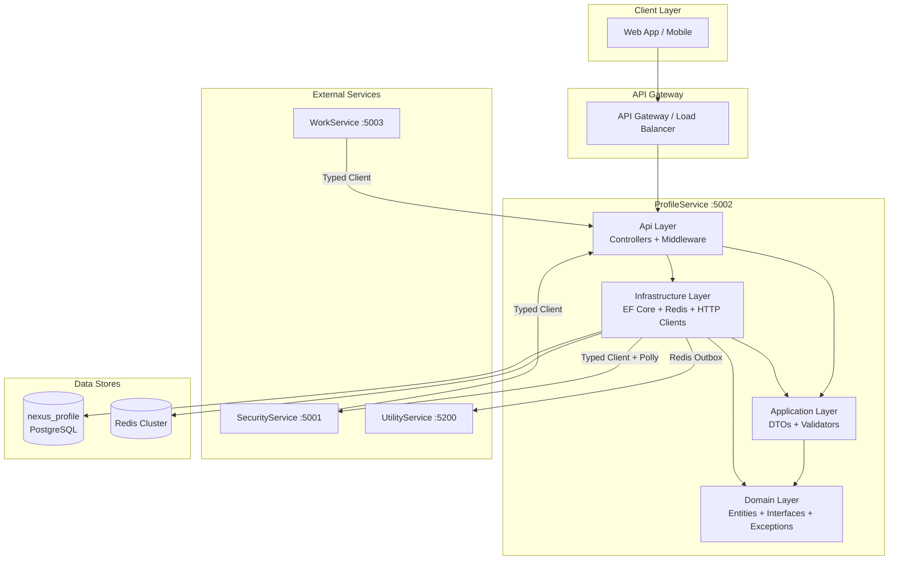
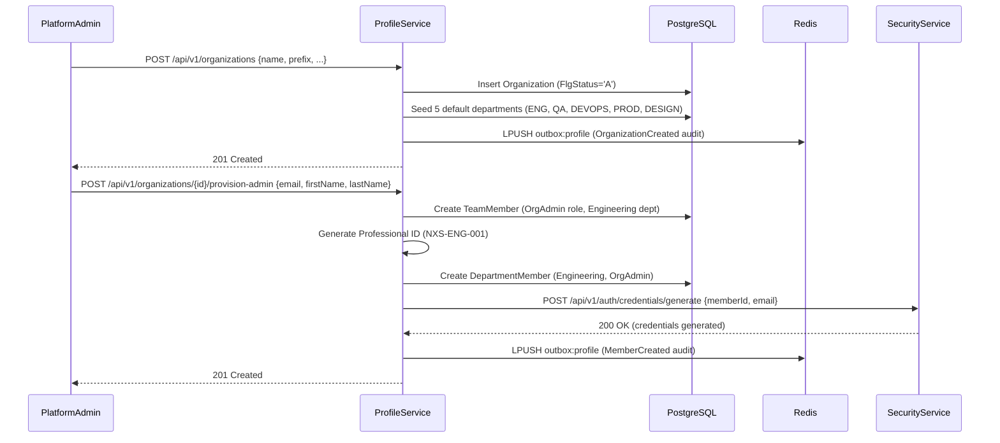
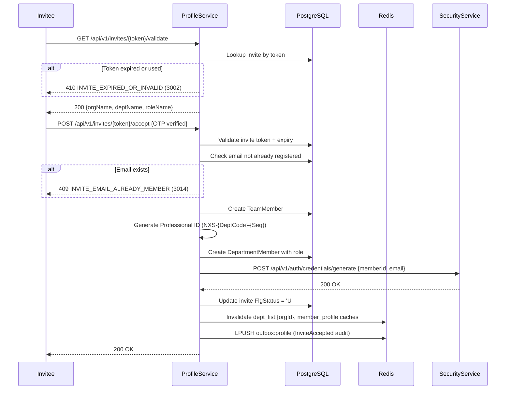
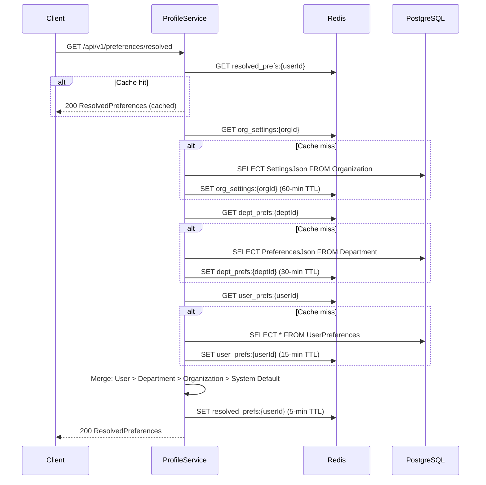
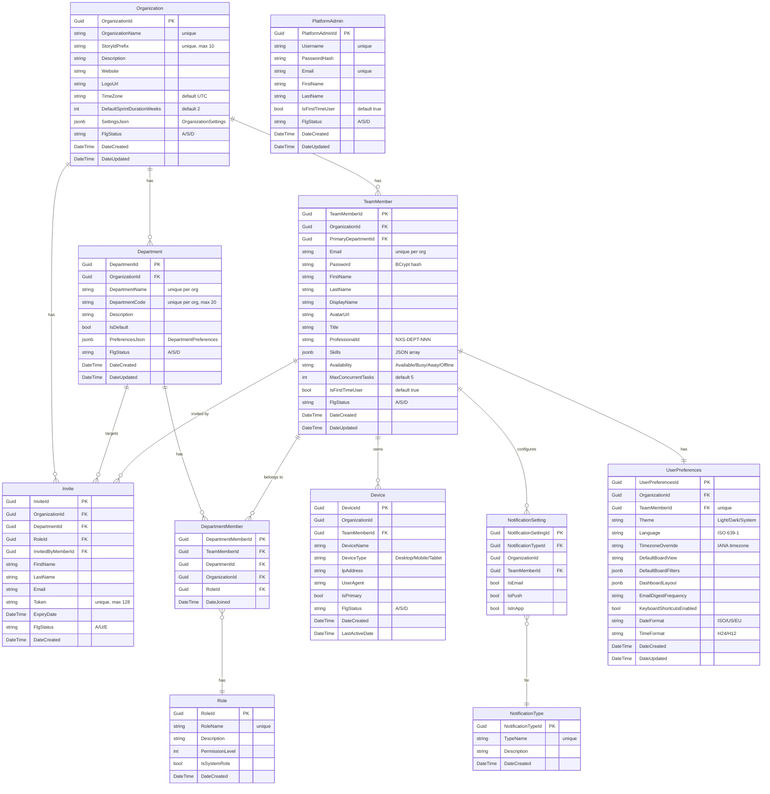

# Design Document — ProfileService

## Overview

ProfileService is the identity, organization, and profile management microservice for the Nexus-2.0 Enterprise Agile Platform. It runs on port 5002 with database `nexus_profile` and follows Clean Architecture (.NET 8) with Domain / Application / Infrastructure / Api layers.

ProfileService is the single source of truth for all TeamMember records and user identity. It manages the organization hierarchy, department structure, team member profiles, role assignments, invitation system, device management, notification settings, user preferences, department preferences, preference cascade resolution, story ID prefix configuration, and PlatformAdmin management.

Other services (SecurityService, WorkService) call ProfileService to resolve user identity and organization settings. ProfileService calls SecurityService for credential generation during invite acceptance and OrgAdmin provisioning.

PlatformAdmin is a separate entity from TeamMember — it exists above the organization scope with its own login flow and JWT claims (no `organizationId` or `departmentId`).

Key responsibilities:
- Organization CRUD with settings JSON column and story ID prefix management
- Department management with 5 predefined departments seeded per organization
- Team member profiles with multi-department membership and department-scoped roles
- Professional ID generation (`NXS-{DeptCode}-{SequentialNumber}`)
- Invitation system with cryptographic tokens and 48-hour expiry
- Device management (max 5 per user, primary device tracking)
- Notification settings per user per notification type
- User preferences, department preferences, and preference cascade resolution
- PlatformAdmin entity management (platform-level administrators)
- Inter-service identity resolution endpoints for SecurityService and WorkService
- Redis caching with tiered TTLs and explicit invalidation
- Audit event publishing via Redis outbox pattern

References:
- `docs/nexus-2.0-backend-specification.md` — Sections 5.1–5.13, Section 8
- `docs/nexus-2.0-backend-requirements.md` — REQ-021 through REQ-035, REQ-086 through REQ-108
- `docs/platform-specification.md` — Predecessor WEP patterns (Sections 3–5)
- `.kiro/specs/profile-service/requirements.md` — Requirements 1 through 44
- `.kiro/specs/security-service/design.md` — SecurityService design patterns

## Architecture

### High-Level Architecture



### Organization Setup Flow



### Invite Acceptance Flow



### Preference Cascade Resolution Flow



### Middleware Pipeline

Requests flow through middleware in this exact order (per Requirement 40):

```
CORS → CorrelationId → GlobalExceptionHandler → RateLimiter → Routing →
Authentication → Authorization → JwtClaims → TokenBlacklist →
FirstTimeUserGuard → RoleAuthorization → OrganizationScope → Controllers
```



```mermaid
graph LR
    A[CORS] --> B[CorrelationId]
    B --> C[GlobalExceptionHandler]
    C --> D[RateLimiter]
    D --> E[Routing]
    E --> F[Authentication]
    F --> G[Authorization]
    G --> H[JwtClaims]
    H --> I[TokenBlacklist]
    I --> J[FirstTimeUserGuard]
    J --> K[RoleAuthorization]
    K --> L[OrganizationScope]
    L --> M[Controllers]
```

`OrganizationScopeMiddleware` bypasses scope enforcement for PlatformAdmin-authenticated requests (PlatformAdmin JWT has no `organizationId` claim, `roleName = "PlatformAdmin"`).

## Components and Interfaces

### Monorepo Folder Structure

```
Nexus-2.0/
├── docs/
├── src/
│   ├── backend/
│   │   ├── SecurityService/
│   │   ├── ProfileService/           # This service
│   │   │   ├── ProfileService.Domain/
│   │   │   ├── ProfileService.Application/
│   │   │   ├── ProfileService.Infrastructure/
│   │   │   ├── ProfileService.Api/
│   │   │   └── ProfileService.Tests/
│   │   ├── WorkService/
│   │   └── UtilityService/
│   └── frontend/
├── docker/
├── Nexus-2.0.sln
└── .kiro/
```

### Clean Architecture Layer Structure

All paths below are relative to `src/backend/ProfileService/`.

```
ProfileService.Domain/
├── Entities/
│   ├── Organization.cs
│   ├── Department.cs
│   ├── TeamMember.cs
│   ├── DepartmentMember.cs
│   ├── Role.cs
│   ├── Invite.cs
│   ├── Device.cs
│   ├── NotificationSetting.cs
│   ├── NotificationType.cs
│   ├── UserPreferences.cs
│   └── PlatformAdmin.cs
├── Exceptions/
│   ├── DomainException.cs
│   ├── ErrorCodes.cs
│   ├── EmailAlreadyRegisteredException.cs
│   ├── InviteExpiredOrInvalidException.cs
│   ├── MaxDevicesReachedException.cs
│   ├── LastOrgAdminCannotDeactivateException.cs
│   ├── OrganizationNameDuplicateException.cs
│   ├── StoryPrefixDuplicateException.cs
│   ├── StoryPrefixImmutableException.cs
│   ├── DepartmentNameDuplicateException.cs
│   ├── DepartmentCodeDuplicateException.cs
│   ├── DefaultDepartmentCannotDeleteException.cs
│   ├── MemberAlreadyInDepartmentException.cs
│   ├── MemberMustHaveDepartmentException.cs
│   ├── InvalidRoleAssignmentException.cs
│   ├── InviteEmailAlreadyMemberException.cs
│   ├── OrganizationMismatchException.cs
│   ├── RateLimitExceededException.cs
│   ├── DepartmentHasActiveMembersException.cs
│   ├── MemberNotInDepartmentException.cs
│   ├── InvalidAvailabilityStatusException.cs
│   ├── StoryPrefixInvalidFormatException.cs
│   ├── NotFoundException.cs
│   ├── ConflictException.cs
│   ├── ServiceUnavailableException.cs
│   ├── DepartmentNotFoundException.cs
│   ├── MemberNotFoundException.cs
│   ├── InvalidPreferenceValueException.cs
│   └── PreferenceKeyUnknownException.cs
├── Interfaces/
│   ├── Repositories/
│   │   ├── IOrganizationRepository.cs
│   │   ├── IDepartmentRepository.cs
│   │   ├── ITeamMemberRepository.cs
│   │   ├── IDepartmentMemberRepository.cs
│   │   ├── IRoleRepository.cs
│   │   ├── IInviteRepository.cs
│   │   ├── IDeviceRepository.cs
│   │   ├── INotificationSettingRepository.cs
│   │   ├── INotificationTypeRepository.cs
│   │   ├── IUserPreferencesRepository.cs
│   │   └── IPlatformAdminRepository.cs
│   └── Services/
│       ├── IOrganizationService.cs
│       ├── IDepartmentService.cs
│       ├── ITeamMemberService.cs
│       ├── IRoleService.cs
│       ├── IInviteService.cs
│       ├── IDeviceService.cs
│       ├── INotificationSettingService.cs
│       ├── IPreferenceService.cs
│       ├── IPreferenceResolver.cs
│       ├── IPlatformAdminService.cs
│       └── IOutboxService.cs
├── Enums/
│   ├── Availability.cs
│   ├── Theme.cs
│   ├── DateFormatType.cs
│   ├── TimeFormatType.cs
│   ├── DigestFrequency.cs
│   ├── BoardView.cs
│   ├── StoryPointScale.cs
│   └── AutoAssignmentStrategy.cs
├── Helpers/
│   ├── RoleNames.cs
│   ├── EntityStatuses.cs
│   ├── InviteStatuses.cs
│   ├── DepartmentTypes.cs
│   └── SystemDefaults.cs
└── Common/
    └── IOrganizationEntity.cs

ProfileService.Application/
├── DTOs/
│   ├── ApiResponse.cs
│   ├── ErrorDetail.cs
│   ├── PaginatedResponse.cs
│   ├── Organizations/
│   │   ├── CreateOrganizationRequest.cs
│   │   ├── UpdateOrganizationRequest.cs
│   │   ├── OrganizationResponse.cs
│   │   ├── OrganizationSettingsRequest.cs
│   │   ├── OrganizationSettingsResponse.cs
│   │   ├── StatusChangeRequest.cs
│   │   └── ProvisionAdminRequest.cs
│   ├── Departments/
│   │   ├── CreateDepartmentRequest.cs
│   │   ├── UpdateDepartmentRequest.cs
│   │   ├── DepartmentResponse.cs
│   │   ├── DepartmentPreferencesRequest.cs
│   │   └── DepartmentPreferencesResponse.cs
│   ├── TeamMembers/
│   │   ├── UpdateTeamMemberRequest.cs
│   │   ├── TeamMemberResponse.cs
│   │   ├── TeamMemberDetailResponse.cs
│   │   ├── TeamMemberInternalResponse.cs
│   │   ├── AvailabilityRequest.cs
│   │   ├── AddDepartmentRequest.cs
│   │   └── ChangeRoleRequest.cs
│   ├── Roles/
│   │   └── RoleResponse.cs
│   ├── Invites/
│   │   ├── CreateInviteRequest.cs
│   │   ├── InviteResponse.cs
│   │   ├── InviteValidationResponse.cs
│   │   └── AcceptInviteRequest.cs
│   ├── Devices/
│   │   └── DeviceResponse.cs
│   ├── NotificationSettings/
│   │   ├── NotificationSettingResponse.cs
│   │   ├── UpdateNotificationSettingRequest.cs
│   │   └── NotificationTypeResponse.cs
│   ├── Preferences/
│   │   ├── UserPreferencesRequest.cs
│   │   ├── UserPreferencesResponse.cs
│   │   └── ResolvedPreferencesResponse.cs
│   └── PlatformAdmins/
│       └── PlatformAdminInternalResponse.cs
├── Contracts/
│   ├── CredentialGenerateRequest.cs
│   └── ErrorCodeResponse.cs
├── Validators/
│   ├── CreateOrganizationRequestValidator.cs
│   ├── UpdateOrganizationRequestValidator.cs
│   ├── OrganizationSettingsRequestValidator.cs
│   ├── ProvisionAdminRequestValidator.cs
│   ├── CreateDepartmentRequestValidator.cs
│   ├── UpdateDepartmentRequestValidator.cs
│   ├── DepartmentPreferencesRequestValidator.cs
│   ├── UpdateTeamMemberRequestValidator.cs
│   ├── AvailabilityRequestValidator.cs
│   ├── AddDepartmentRequestValidator.cs
│   ├── ChangeRoleRequestValidator.cs
│   ├── CreateInviteRequestValidator.cs
│   ├── AcceptInviteRequestValidator.cs
│   ├── UpdateNotificationSettingRequestValidator.cs
│   ├── UserPreferencesRequestValidator.cs
│   └── StatusChangeRequestValidator.cs
└── ProfileService.Application.csproj

ProfileService.Infrastructure/
├── Data/
│   ├── ProfileDbContext.cs
│   └── Migrations/
├── Repositories/
│   ├── OrganizationRepository.cs
│   ├── DepartmentRepository.cs
│   ├── TeamMemberRepository.cs
│   ├── DepartmentMemberRepository.cs
│   ├── RoleRepository.cs
│   ├── InviteRepository.cs
│   ├── DeviceRepository.cs
│   ├── NotificationSettingRepository.cs
│   ├── NotificationTypeRepository.cs
│   ├── UserPreferencesRepository.cs
│   └── PlatformAdminRepository.cs
├── Services/
│   ├── Organizations/
│   │   └── OrganizationService.cs
│   ├── Departments/
│   │   └── DepartmentService.cs
│   ├── TeamMembers/
│   │   └── TeamMemberService.cs
│   ├── Roles/
│   │   └── RoleService.cs
│   ├── Invites/
│   │   └── InviteService.cs
│   ├── Devices/
│   │   └── DeviceService.cs
│   ├── NotificationSettings/
│   │   └── NotificationSettingService.cs
│   ├── Preferences/
│   │   ├── PreferenceService.cs
│   │   └── PreferenceResolver.cs
│   ├── PlatformAdmins/
│   │   └── PlatformAdminService.cs
│   ├── ServiceClients/
│   │   ├── ISecurityServiceClient.cs
│   │   ├── SecurityServiceClient.cs
│   │   ├── IUtilityServiceClient.cs
│   │   └── UtilityServiceClient.cs
│   ├── ErrorCodeResolver/
│   │   └── ErrorCodeResolverService.cs
│   └── Outbox/
│       └── OutboxService.cs
├── Configuration/
│   ├── AppSettings.cs
│   ├── DatabaseMigrationHelper.cs
│   └── DependencyInjection.cs
└── ProfileService.Infrastructure.csproj

ProfileService.Api/
├── Controllers/
│   ├── OrganizationController.cs
│   ├── DepartmentController.cs
│   ├── TeamMemberController.cs
│   ├── RoleController.cs
│   ├── InviteController.cs
│   ├── DeviceController.cs
│   ├── NotificationSettingController.cs
│   ├── PreferenceController.cs
│   └── PlatformAdminController.cs
├── Middleware/
│   ├── CorrelationIdMiddleware.cs
│   ├── GlobalExceptionHandlerMiddleware.cs
│   ├── RateLimiterMiddleware.cs
│   ├── JwtClaimsMiddleware.cs
│   ├── TokenBlacklistMiddleware.cs
│   ├── FirstTimeUserMiddleware.cs
│   ├── RoleAuthorizationMiddleware.cs
│   ├── OrganizationScopeMiddleware.cs
│   └── CorrelationIdDelegatingHandler.cs
├── Attributes/
│   ├── PlatformAdminAttribute.cs
│   └── ServiceAuthAttribute.cs
├── Extensions/
│   ├── MiddlewarePipelineExtensions.cs
│   ├── ControllerServiceExtensions.cs
│   ├── SwaggerServiceExtensions.cs
│   └── HealthCheckExtensions.cs
├── Program.cs
├── Dockerfile
├── .env
├── .env.example
└── ProfileService.Api.csproj
```

### Domain Layer Interfaces

#### IOrganizationService

```csharp
public interface IOrganizationService
{
    Task<OrganizationResponse> CreateAsync(CreateOrganizationRequest request, CancellationToken ct = default);
    Task<OrganizationResponse> GetByIdAsync(Guid organizationId, CancellationToken ct = default);
    Task<OrganizationResponse> UpdateAsync(Guid organizationId, UpdateOrganizationRequest request, CancellationToken ct = default);
    Task UpdateStatusAsync(Guid organizationId, string newStatus, CancellationToken ct = default);
    Task<OrganizationSettingsResponse> UpdateSettingsAsync(Guid organizationId, OrganizationSettingsRequest request, CancellationToken ct = default);
    Task<PaginatedResponse<OrganizationResponse>> ListAllAsync(int page, int pageSize, CancellationToken ct = default);
    Task<TeamMemberDetailResponse> ProvisionAdminAsync(Guid organizationId, ProvisionAdminRequest request, CancellationToken ct = default);
}
```

#### IDepartmentService

```csharp
public interface IDepartmentService
{
    Task<DepartmentResponse> CreateAsync(Guid organizationId, CreateDepartmentRequest request, CancellationToken ct = default);
    Task<PaginatedResponse<DepartmentResponse>> ListAsync(Guid organizationId, int page, int pageSize, CancellationToken ct = default);
    Task<DepartmentResponse> GetByIdAsync(Guid departmentId, CancellationToken ct = default);
    Task<DepartmentResponse> UpdateAsync(Guid departmentId, UpdateDepartmentRequest request, CancellationToken ct = default);
    Task UpdateStatusAsync(Guid departmentId, string newStatus, CancellationToken ct = default);
    Task<PaginatedResponse<TeamMemberResponse>> ListMembersAsync(Guid departmentId, int page, int pageSize, CancellationToken ct = default);
    Task<DepartmentPreferencesResponse> GetPreferencesAsync(Guid departmentId, CancellationToken ct = default);
    Task<DepartmentPreferencesResponse> UpdatePreferencesAsync(Guid departmentId, DepartmentPreferencesRequest request, CancellationToken ct = default);
}
```

#### ITeamMemberService

```csharp
public interface ITeamMemberService
{
    Task<PaginatedResponse<TeamMemberResponse>> ListAsync(Guid organizationId, int page, int pageSize, string? departmentId, string? role, string? status, string? availability, CancellationToken ct = default);
    Task<TeamMemberDetailResponse> GetByIdAsync(Guid memberId, CancellationToken ct = default);
    Task<TeamMemberDetailResponse> UpdateAsync(Guid memberId, UpdateTeamMemberRequest request, CancellationToken ct = default);
    Task UpdateStatusAsync(Guid memberId, string newStatus, CancellationToken ct = default);
    Task UpdateAvailabilityAsync(Guid memberId, string availability, CancellationToken ct = default);
    Task AddToDepartmentAsync(Guid memberId, AddDepartmentRequest request, CancellationToken ct = default);
    Task RemoveFromDepartmentAsync(Guid memberId, Guid departmentId, CancellationToken ct = default);
    Task ChangeDepartmentRoleAsync(Guid memberId, Guid departmentId, ChangeRoleRequest request, CancellationToken ct = default);
    Task<TeamMemberInternalResponse> GetByEmailAsync(string email, CancellationToken ct = default);
    Task UpdatePasswordAsync(Guid memberId, string passwordHash, CancellationToken ct = default);
}
```

#### IRoleService

```csharp
public interface IRoleService
{
    Task<IEnumerable<RoleResponse>> ListAsync(CancellationToken ct = default);
    Task<RoleResponse> GetByIdAsync(Guid roleId, CancellationToken ct = default);
}
```

#### IInviteService

```csharp
public interface IInviteService
{
    Task<InviteResponse> CreateAsync(Guid organizationId, Guid invitedByMemberId, Guid inviterDepartmentId, string inviterRole, CreateInviteRequest request, CancellationToken ct = default);
    Task<PaginatedResponse<InviteResponse>> ListAsync(Guid organizationId, Guid? departmentId, string role, int page, int pageSize, CancellationToken ct = default);
    Task<InviteValidationResponse> ValidateTokenAsync(string token, CancellationToken ct = default);
    Task AcceptAsync(string token, AcceptInviteRequest request, CancellationToken ct = default);
    Task CancelAsync(Guid inviteId, CancellationToken ct = default);
}
```

#### IDeviceService

```csharp
public interface IDeviceService
{
    Task<IEnumerable<DeviceResponse>> ListAsync(Guid memberId, CancellationToken ct = default);
    Task SetPrimaryAsync(Guid memberId, Guid deviceId, CancellationToken ct = default);
    Task RemoveAsync(Guid memberId, Guid deviceId, CancellationToken ct = default);
}
```

#### INotificationSettingService

```csharp
public interface INotificationSettingService
{
    Task<IEnumerable<NotificationSettingResponse>> GetSettingsAsync(Guid memberId, CancellationToken ct = default);
    Task UpdateSettingAsync(Guid memberId, Guid notificationTypeId, UpdateNotificationSettingRequest request, CancellationToken ct = default);
    Task<IEnumerable<NotificationTypeResponse>> ListTypesAsync(CancellationToken ct = default);
}
```

#### IPreferenceService

```csharp
public interface IPreferenceService
{
    Task<UserPreferencesResponse> GetAsync(Guid memberId, CancellationToken ct = default);
    Task<UserPreferencesResponse> UpdateAsync(Guid memberId, UserPreferencesRequest request, CancellationToken ct = default);
}
```

#### IPreferenceResolver

```csharp
public interface IPreferenceResolver
{
    Task<ResolvedPreferencesResponse> ResolveAsync(Guid userId, Guid departmentId, Guid organizationId, CancellationToken ct = default);
}
```

#### IPlatformAdminService

```csharp
public interface IPlatformAdminService
{
    Task<PlatformAdminInternalResponse> GetByUsernameAsync(string username, CancellationToken ct = default);
    Task UpdatePasswordAsync(Guid platformAdminId, string passwordHash, CancellationToken ct = default);
}
```

#### IOutboxService

```csharp
public interface IOutboxService
{
    Task PublishAsync(OutboxMessage message, CancellationToken ct = default);
}
```

#### IErrorCodeResolverService

```csharp
public interface IErrorCodeResolverService
{
    Task<(string ResponseCode, string ResponseDescription)> ResolveAsync(string errorCode, CancellationToken ct = default);
}
```

### Repository Interfaces

```csharp
public interface IOrganizationRepository
{
    Task<Organization?> GetByIdAsync(Guid organizationId, CancellationToken ct = default);
    Task<Organization?> GetByNameAsync(string name, CancellationToken ct = default);
    Task<Organization?> GetByStoryIdPrefixAsync(string prefix, CancellationToken ct = default);
    Task<Organization> AddAsync(Organization organization, CancellationToken ct = default);
    Task UpdateAsync(Organization organization, CancellationToken ct = default);
    Task<(IEnumerable<Organization> Items, int TotalCount)> ListAllAsync(int page, int pageSize, CancellationToken ct = default);
}

public interface IDepartmentRepository
{
    Task<Department?> GetByIdAsync(Guid departmentId, CancellationToken ct = default);
    Task<Department?> GetByNameAsync(Guid organizationId, string name, CancellationToken ct = default);
    Task<Department?> GetByCodeAsync(Guid organizationId, string code, CancellationToken ct = default);
    Task<Department> AddAsync(Department department, CancellationToken ct = default);
    Task AddRangeAsync(IEnumerable<Department> departments, CancellationToken ct = default);
    Task UpdateAsync(Department department, CancellationToken ct = default);
    Task<(IEnumerable<Department> Items, int TotalCount)> ListByOrganizationAsync(Guid organizationId, int page, int pageSize, CancellationToken ct = default);
    Task<int> GetActiveMemberCountAsync(Guid departmentId, CancellationToken ct = default);
}

public interface ITeamMemberRepository
{
    Task<TeamMember?> GetByIdAsync(Guid memberId, CancellationToken ct = default);
    Task<TeamMember?> GetByEmailAsync(Guid organizationId, string email, CancellationToken ct = default);
    Task<TeamMember?> GetByEmailGlobalAsync(string email, CancellationToken ct = default);
    Task<TeamMember> AddAsync(TeamMember member, CancellationToken ct = default);
    Task UpdateAsync(TeamMember member, CancellationToken ct = default);
    Task<(IEnumerable<TeamMember> Items, int TotalCount)> ListAsync(Guid organizationId, int page, int pageSize, Guid? departmentId, string? role, string? status, string? availability, CancellationToken ct = default);
    Task<int> CountOrgAdminsAsync(Guid organizationId, CancellationToken ct = default);
    Task<int> GetNextSequentialNumberAsync(Guid organizationId, string departmentCode, CancellationToken ct = default);
}

public interface IDepartmentMemberRepository
{
    Task<DepartmentMember?> GetAsync(Guid memberId, Guid departmentId, CancellationToken ct = default);
    Task<DepartmentMember> AddAsync(DepartmentMember departmentMember, CancellationToken ct = default);
    Task RemoveAsync(DepartmentMember departmentMember, CancellationToken ct = default);
    Task UpdateAsync(DepartmentMember departmentMember, CancellationToken ct = default);
    Task<IEnumerable<DepartmentMember>> GetByMemberIdAsync(Guid memberId, CancellationToken ct = default);
    Task<(IEnumerable<DepartmentMember> Items, int TotalCount)> ListByDepartmentAsync(Guid departmentId, int page, int pageSize, CancellationToken ct = default);
}

public interface IRoleRepository
{
    Task<Role?> GetByIdAsync(Guid roleId, CancellationToken ct = default);
    Task<Role?> GetByNameAsync(string roleName, CancellationToken ct = default);
    Task<IEnumerable<Role>> ListAsync(CancellationToken ct = default);
    Task AddRangeAsync(IEnumerable<Role> roles, CancellationToken ct = default);
    Task<bool> ExistsAsync(string roleName, CancellationToken ct = default);
}

public interface IInviteRepository
{
    Task<Invite?> GetByIdAsync(Guid inviteId, CancellationToken ct = default);
    Task<Invite?> GetByTokenAsync(string token, CancellationToken ct = default);
    Task<Invite> AddAsync(Invite invite, CancellationToken ct = default);
    Task UpdateAsync(Invite invite, CancellationToken ct = default);
    Task<(IEnumerable<Invite> Items, int TotalCount)> ListPendingAsync(Guid organizationId, Guid? departmentId, int page, int pageSize, CancellationToken ct = default);
}

public interface IDeviceRepository
{
    Task<Device?> GetByIdAsync(Guid deviceId, CancellationToken ct = default);
    Task<IEnumerable<Device>> ListByMemberAsync(Guid memberId, CancellationToken ct = default);
    Task<int> CountByMemberAsync(Guid memberId, CancellationToken ct = default);
    Task<Device> AddAsync(Device device, CancellationToken ct = default);
    Task UpdateAsync(Device device, CancellationToken ct = default);
    Task RemoveAsync(Device device, CancellationToken ct = default);
    Task ClearPrimaryAsync(Guid memberId, CancellationToken ct = default);
}

public interface INotificationSettingRepository
{
    Task<IEnumerable<NotificationSetting>> GetByMemberAsync(Guid memberId, CancellationToken ct = default);
    Task<NotificationSetting?> GetAsync(Guid memberId, Guid notificationTypeId, CancellationToken ct = default);
    Task AddAsync(NotificationSetting setting, CancellationToken ct = default);
    Task UpdateAsync(NotificationSetting setting, CancellationToken ct = default);
}

public interface INotificationTypeRepository
{
    Task<IEnumerable<NotificationType>> ListAsync(CancellationToken ct = default);
    Task AddRangeAsync(IEnumerable<NotificationType> types, CancellationToken ct = default);
    Task<bool> ExistsAsync(string typeName, CancellationToken ct = default);
}

public interface IUserPreferencesRepository
{
    Task<UserPreferences?> GetByMemberIdAsync(Guid memberId, CancellationToken ct = default);
    Task<UserPreferences> AddAsync(UserPreferences preferences, CancellationToken ct = default);
    Task UpdateAsync(UserPreferences preferences, CancellationToken ct = default);
}

public interface IPlatformAdminRepository
{
    Task<PlatformAdmin?> GetByIdAsync(Guid platformAdminId, CancellationToken ct = default);
    Task<PlatformAdmin?> GetByUsernameAsync(string username, CancellationToken ct = default);
    Task UpdateAsync(PlatformAdmin admin, CancellationToken ct = default);
}
```

### Infrastructure Service Clients

#### ISecurityServiceClient

```csharp
public interface ISecurityServiceClient
{
    Task GenerateCredentialsAsync(Guid memberId, string email, CancellationToken ct = default);
}
```

#### IUtilityServiceClient

```csharp
public interface IUtilityServiceClient
{
    Task<ErrorCodeResponse> GetErrorCodeAsync(string code, CancellationToken ct = default);
}
```

### Controller Definitions

#### OrganizationController

```csharp
[ApiController]
[Route("api/v1/organizations")]
public class OrganizationController : ControllerBase
{
    [HttpPost]                              // OrgAdmin, PlatformAdmin — CreateOrganizationRequest → 201 OrganizationResponse
    [HttpGet]                               // PlatformAdmin — Paginated list of all organizations (cross-org)
    [HttpGet("{id}")]                       // Bearer — OrganizationResponse
    [HttpPut("{id}")]                       // OrgAdmin — UpdateOrganizationRequest → OrganizationResponse
    [HttpPatch("{id}/status")]              // OrgAdmin, PlatformAdmin — StatusChangeRequest → 200
    [HttpPut("{id}/settings")]              // OrgAdmin — OrganizationSettingsRequest → OrganizationSettingsResponse
    [HttpPost("{id}/provision-admin")]       // PlatformAdmin — ProvisionAdminRequest → 201 TeamMemberDetailResponse
}
```

#### DepartmentController

```csharp
[ApiController]
[Route("api/v1/departments")]
public class DepartmentController : ControllerBase
{
    [HttpPost]                              // OrgAdmin — CreateDepartmentRequest → 201 DepartmentResponse
    [HttpGet]                               // Bearer — Paginated DepartmentResponse list
    [HttpGet("{id}")]                       // Bearer — DepartmentResponse (with member count)
    [HttpPut("{id}")]                       // OrgAdmin, DeptLead (own) — UpdateDepartmentRequest → DepartmentResponse
    [HttpPatch("{id}/status")]              // OrgAdmin — StatusChangeRequest → 200
    [HttpGet("{id}/members")]               // Bearer — Paginated TeamMemberResponse list
    [HttpGet("{id}/preferences")]           // Bearer — DepartmentPreferencesResponse
    [HttpPut("{id}/preferences")]           // OrgAdmin, DeptLead (own) — DepartmentPreferencesRequest → DepartmentPreferencesResponse
}
```

#### TeamMemberController

```csharp
[ApiController]
[Route("api/v1/team-members")]
public class TeamMemberController : ControllerBase
{
    [HttpGet]                               // Bearer — Paginated TeamMemberResponse list (filterable)
    [HttpGet("{id}")]                       // Bearer — TeamMemberDetailResponse
    [HttpPut("{id}")]                       // OrgAdmin, DeptLead, Self — UpdateTeamMemberRequest → TeamMemberDetailResponse
    [HttpPatch("{id}/status")]              // OrgAdmin — StatusChangeRequest → 200
    [HttpPatch("{id}/availability")]        // Bearer, Self — AvailabilityRequest → 200
    [HttpPost("{id}/departments")]          // OrgAdmin — AddDepartmentRequest → 200
    [HttpDelete("{id}/departments/{deptId}")] // OrgAdmin — 200
    [HttpPatch("{id}/departments/{deptId}/role")] // OrgAdmin — ChangeRoleRequest → 200
    [HttpGet("by-email/{email}")]           // Service auth — TeamMemberInternalResponse
    [HttpPatch("{id}/password")]            // Service auth — {passwordHash} → 200
}
```

#### RoleController

```csharp
[ApiController]
[Route("api/v1/roles")]
public class RoleController : ControllerBase
{
    [HttpGet]                               // Bearer — List of RoleResponse
    [HttpGet("{id}")]                       // Bearer — RoleResponse
}
```

#### InviteController

```csharp
[ApiController]
[Route("api/v1/invites")]
public class InviteController : ControllerBase
{
    [HttpPost]                              // OrgAdmin, DeptLead — CreateInviteRequest → 201 InviteResponse
    [HttpGet]                               // OrgAdmin, DeptLead — Paginated InviteResponse list
    [HttpGet("{token}/validate")]           // None — InviteValidationResponse
    [HttpPost("{token}/accept")]            // None — AcceptInviteRequest → 200
    [HttpDelete("{id}")]                    // OrgAdmin, DeptLead — 200
}
```

#### DeviceController

```csharp
[ApiController]
[Route("api/v1/devices")]
public class DeviceController : ControllerBase
{
    [HttpGet]                               // Bearer — List of DeviceResponse
    [HttpPatch("{id}/primary")]             // Bearer — 200
    [HttpDelete("{id}")]                    // Bearer — 200
}
```

#### NotificationSettingController

```csharp
[ApiController]
[Route("api/v1")]
public class NotificationSettingController : ControllerBase
{
    [HttpGet("notification-settings")]      // Bearer — List of NotificationSettingResponse
    [HttpPut("notification-settings/{typeId}")] // Bearer — UpdateNotificationSettingRequest → 200
    [HttpGet("notification-types")]         // Bearer — List of NotificationTypeResponse
}
```

#### PreferenceController

```csharp
[ApiController]
[Route("api/v1/preferences")]
public class PreferenceController : ControllerBase
{
    [HttpGet]                               // Bearer — UserPreferencesResponse
    [HttpPut]                               // Bearer — UserPreferencesRequest → UserPreferencesResponse
    [HttpGet("resolved")]                   // Bearer — ResolvedPreferencesResponse
}
```

#### PlatformAdminController

```csharp
[ApiController]
[Route("api/v1/platform-admins")]
public class PlatformAdminController : ControllerBase
{
    [HttpGet("by-username/{username}")]     // Service auth — PlatformAdminInternalResponse
    [HttpPatch("{id}/password")]            // Service auth — {passwordHash} → 200
}
```

### Domain Exception Hierarchy

```csharp
// Base exception — all domain exceptions inherit from this
public class DomainException : Exception
{
    public int ErrorValue { get; }
    public string ErrorCode { get; }
    public HttpStatusCode StatusCode { get; }
    public string? CorrelationId { get; set; }

    public DomainException(int errorValue, string errorCode, string message, HttpStatusCode statusCode = HttpStatusCode.BadRequest)
        : base(message)
    {
        ErrorValue = errorValue;
        ErrorCode = errorCode;
        StatusCode = statusCode;
    }
}

// Concrete exceptions (3001–3027)
public class EmailAlreadyRegisteredException : DomainException { /* 3001, 409 */ }
public class InviteExpiredOrInvalidException : DomainException { /* 3002, 410 */ }
public class MaxDevicesReachedException : DomainException { /* 3003, 400 */ }
public class LastOrgAdminCannotDeactivateException : DomainException { /* 3004, 400 */ }
public class OrganizationNameDuplicateException : DomainException { /* 3005, 409 */ }
public class StoryPrefixDuplicateException : DomainException { /* 3006, 409 */ }
public class StoryPrefixImmutableException : DomainException { /* 3007, 400 */ }
public class DepartmentNameDuplicateException : DomainException { /* 3008, 409 */ }
public class DepartmentCodeDuplicateException : DomainException { /* 3009, 409 */ }
public class DefaultDepartmentCannotDeleteException : DomainException { /* 3010, 400 */ }
public class MemberAlreadyInDepartmentException : DomainException { /* 3011, 409 */ }
public class MemberMustHaveDepartmentException : DomainException { /* 3012, 400 */ }
public class InvalidRoleAssignmentException : DomainException { /* 3013, 400 */ }
public class InviteEmailAlreadyMemberException : DomainException { /* 3014, 409 */ }
public class OrganizationMismatchException : DomainException { /* 3015, 403 */ }
public class RateLimitExceededException : DomainException { /* 3016, 429 — includes RetryAfterSeconds */ }
public class DepartmentHasActiveMembersException : DomainException { /* 3017, 400 */ }
public class MemberNotInDepartmentException : DomainException { /* 3018, 400 */ }
public class InvalidAvailabilityStatusException : DomainException { /* 3019, 400 */ }
public class StoryPrefixInvalidFormatException : DomainException { /* 3020, 400 */ }
public class NotFoundException : DomainException { /* 3021, 404 */ }
public class ConflictException : DomainException { /* 3022, 409 */ }
public class ServiceUnavailableException : DomainException { /* 3023, 503 */ }
public class DepartmentNotFoundException : DomainException { /* 3024, 404 */ }
public class MemberNotFoundException : DomainException { /* 3025, 404 */ }
public class InvalidPreferenceValueException : DomainException { /* 3026, 400 */ }
public class PreferenceKeyUnknownException : DomainException { /* 3027, 400 */ }
```

### ErrorCodes Static Class

```csharp
public static class ErrorCodes
{
    // Shared
    public const string ValidationError = "VALIDATION_ERROR";
    public const int ValidationErrorValue = 1000;

    // Profile (3001–3027)
    public const string EmailAlreadyRegistered = "EMAIL_ALREADY_REGISTERED";
    public const int EmailAlreadyRegisteredValue = 3001;

    public const string InviteExpiredOrInvalid = "INVITE_EXPIRED_OR_INVALID";
    public const int InviteExpiredOrInvalidValue = 3002;

    public const string MaxDevicesReached = "MAX_DEVICES_REACHED";
    public const int MaxDevicesReachedValue = 3003;

    public const string LastOrgAdminCannotDeactivate = "LAST_ORGADMIN_CANNOT_DEACTIVATE";
    public const int LastOrgAdminCannotDeactivateValue = 3004;

    public const string OrganizationNameDuplicate = "ORGANIZATION_NAME_DUPLICATE";
    public const int OrganizationNameDuplicateValue = 3005;

    public const string StoryPrefixDuplicate = "STORY_PREFIX_DUPLICATE";
    public const int StoryPrefixDuplicateValue = 3006;

    public const string StoryPrefixImmutable = "STORY_PREFIX_IMMUTABLE";
    public const int StoryPrefixImmutableValue = 3007;

    public const string DepartmentNameDuplicate = "DEPARTMENT_NAME_DUPLICATE";
    public const int DepartmentNameDuplicateValue = 3008;

    public const string DepartmentCodeDuplicate = "DEPARTMENT_CODE_DUPLICATE";
    public const int DepartmentCodeDuplicateValue = 3009;

    public const string DefaultDepartmentCannotDelete = "DEFAULT_DEPARTMENT_CANNOT_DELETE";
    public const int DefaultDepartmentCannotDeleteValue = 3010;

    public const string MemberAlreadyInDepartment = "MEMBER_ALREADY_IN_DEPARTMENT";
    public const int MemberAlreadyInDepartmentValue = 3011;

    public const string MemberMustHaveDepartment = "MEMBER_MUST_HAVE_DEPARTMENT";
    public const int MemberMustHaveDepartmentValue = 3012;

    public const string InvalidRoleAssignment = "INVALID_ROLE_ASSIGNMENT";
    public const int InvalidRoleAssignmentValue = 3013;

    public const string InviteEmailAlreadyMember = "INVITE_EMAIL_ALREADY_MEMBER";
    public const int InviteEmailAlreadyMemberValue = 3014;

    public const string OrganizationMismatch = "ORGANIZATION_MISMATCH";
    public const int OrganizationMismatchValue = 3015;

    public const string RateLimitExceeded = "RATE_LIMIT_EXCEEDED";
    public const int RateLimitExceededValue = 3016;

    public const string DepartmentHasActiveMembers = "DEPARTMENT_HAS_ACTIVE_MEMBERS";
    public const int DepartmentHasActiveMembersValue = 3017;

    public const string MemberNotInDepartment = "MEMBER_NOT_IN_DEPARTMENT";
    public const int MemberNotInDepartmentValue = 3018;

    public const string InvalidAvailabilityStatus = "INVALID_AVAILABILITY_STATUS";
    public const int InvalidAvailabilityStatusValue = 3019;

    public const string StoryPrefixInvalidFormat = "STORY_PREFIX_INVALID_FORMAT";
    public const int StoryPrefixInvalidFormatValue = 3020;

    public const string NotFound = "NOT_FOUND";
    public const int NotFoundValue = 3021;

    public const string Conflict = "CONFLICT";
    public const int ConflictValue = 3022;

    public const string ServiceUnavailable = "SERVICE_UNAVAILABLE";
    public const int ServiceUnavailableValue = 3023;

    public const string DepartmentNotFound = "DEPARTMENT_NOT_FOUND";
    public const int DepartmentNotFoundValue = 3024;

    public const string MemberNotFound = "MEMBER_NOT_FOUND";
    public const int MemberNotFoundValue = 3025;

    public const string InvalidPreferenceValue = "INVALID_PREFERENCE_VALUE";
    public const int InvalidPreferenceValueValue = 3026;

    public const string PreferenceKeyUnknown = "PREFERENCE_KEY_UNKNOWN";
    public const int PreferenceKeyUnknownValue = 3027;

    // Internal
    public const string InternalError = "INTERNAL_ERROR";
    public const int InternalErrorValue = 9999;
}
```

### Application DTOs

#### Request DTOs

```csharp
// Organizations
public class CreateOrganizationRequest
{
    public string OrganizationName { get; set; } = string.Empty;
    public string StoryIdPrefix { get; set; } = string.Empty;
    public string? Description { get; set; }
    public string? Website { get; set; }
    public string? LogoUrl { get; set; }
    public string TimeZone { get; set; } = "UTC";
    public int DefaultSprintDurationWeeks { get; set; } = 2;
}

public class UpdateOrganizationRequest
{
    public string? OrganizationName { get; set; }
    public string? Description { get; set; }
    public string? Website { get; set; }
    public string? LogoUrl { get; set; }
    public string? TimeZone { get; set; }
    public int? DefaultSprintDurationWeeks { get; set; }
}

public class OrganizationSettingsRequest
{
    public string? StoryIdPrefix { get; set; }
    public string? TimeZone { get; set; }
    public int? DefaultSprintDurationWeeks { get; set; }
    public string[]? WorkingDays { get; set; }
    public string? WorkingHoursStart { get; set; }
    public string? WorkingHoursEnd { get; set; }
    public string? PrimaryColor { get; set; }
    public string? StoryPointScale { get; set; }
    public Dictionary<string, string[]>? RequiredFieldsByStoryType { get; set; }
    public bool? AutoAssignmentEnabled { get; set; }
    public string? AutoAssignmentStrategy { get; set; }
    public string? DefaultBoardView { get; set; }
    public bool? WipLimitsEnabled { get; set; }
    public int? DefaultWipLimit { get; set; }
    public string? DefaultNotificationChannels { get; set; }
    public string? DigestFrequency { get; set; }
    public int? AuditRetentionDays { get; set; }
}

public class StatusChangeRequest
{
    public string Status { get; set; } = string.Empty;  // A, S, D
}

public class ProvisionAdminRequest
{
    public string Email { get; set; } = string.Empty;
    public string FirstName { get; set; } = string.Empty;
    public string LastName { get; set; } = string.Empty;
}

// Departments
public class CreateDepartmentRequest
{
    public string DepartmentName { get; set; } = string.Empty;
    public string DepartmentCode { get; set; } = string.Empty;
    public string? Description { get; set; }
}

public class UpdateDepartmentRequest
{
    public string? DepartmentName { get; set; }
    public string? Description { get; set; }
}

public class DepartmentPreferencesRequest
{
    public string[]? DefaultTaskTypes { get; set; }
    public object? CustomWorkflowOverrides { get; set; }
    public Dictionary<string, int>? WipLimitPerStatus { get; set; }
    public Guid? DefaultAssigneeId { get; set; }
    public object? NotificationChannelOverrides { get; set; }
    public int? MaxConcurrentTasksDefault { get; set; }
}

// Team Members
public class UpdateTeamMemberRequest
{
    public string? FirstName { get; set; }
    public string? LastName { get; set; }
    public string? DisplayName { get; set; }
    public string? AvatarUrl { get; set; }
    public string? Title { get; set; }
    public string[]? Skills { get; set; }
    public int? MaxConcurrentTasks { get; set; }
}

public class AvailabilityRequest
{
    public string Availability { get; set; } = string.Empty;  // Available, Busy, Away, Offline
}

public class AddDepartmentRequest
{
    public Guid DepartmentId { get; set; }
    public Guid RoleId { get; set; }
}

public class ChangeRoleRequest
{
    public Guid RoleId { get; set; }
}

// Invites
public class CreateInviteRequest
{
    public string Email { get; set; } = string.Empty;
    public string FirstName { get; set; } = string.Empty;
    public string LastName { get; set; } = string.Empty;
    public Guid DepartmentId { get; set; }
    public Guid RoleId { get; set; }
}

public class AcceptInviteRequest
{
    public string OtpCode { get; set; } = string.Empty;
}

// Notification Settings
public class UpdateNotificationSettingRequest
{
    public bool IsEmail { get; set; }
    public bool IsPush { get; set; }
    public bool IsInApp { get; set; }
}

// Preferences
public class UserPreferencesRequest
{
    public string? Theme { get; set; }
    public string? Language { get; set; }
    public string? TimezoneOverride { get; set; }
    public string? DefaultBoardView { get; set; }
    public object? DefaultBoardFilters { get; set; }
    public object? DashboardLayout { get; set; }
    public string? EmailDigestFrequency { get; set; }
    public bool? KeyboardShortcutsEnabled { get; set; }
    public string? DateFormat { get; set; }
    public string? TimeFormat { get; set; }
}
```

#### Response DTOs

```csharp
// Organizations
public class OrganizationResponse
{
    public Guid OrganizationId { get; set; }
    public string OrganizationName { get; set; } = string.Empty;
    public string StoryIdPrefix { get; set; } = string.Empty;
    public string? Description { get; set; }
    public string? Website { get; set; }
    public string? LogoUrl { get; set; }
    public string TimeZone { get; set; } = string.Empty;
    public int DefaultSprintDurationWeeks { get; set; }
    public OrganizationSettingsResponse? Settings { get; set; }
    public string FlgStatus { get; set; } = string.Empty;
    public DateTime DateCreated { get; set; }
    public DateTime DateUpdated { get; set; }
}

public class OrganizationSettingsResponse
{
    public string? StoryPointScale { get; set; }
    public Dictionary<string, string[]>? RequiredFieldsByStoryType { get; set; }
    public bool AutoAssignmentEnabled { get; set; }
    public string? AutoAssignmentStrategy { get; set; }
    public string[]? WorkingDays { get; set; }
    public string? WorkingHoursStart { get; set; }
    public string? WorkingHoursEnd { get; set; }
    public string? PrimaryColor { get; set; }
    public string? DefaultBoardView { get; set; }
    public bool WipLimitsEnabled { get; set; }
    public int DefaultWipLimit { get; set; }
    public string? DefaultNotificationChannels { get; set; }
    public string? DigestFrequency { get; set; }
    public int AuditRetentionDays { get; set; }
}

// Departments
public class DepartmentResponse
{
    public Guid DepartmentId { get; set; }
    public string DepartmentName { get; set; } = string.Empty;
    public string DepartmentCode { get; set; } = string.Empty;
    public string? Description { get; set; }
    public bool IsDefault { get; set; }
    public string FlgStatus { get; set; } = string.Empty;
    public int MemberCount { get; set; }
    public DateTime DateCreated { get; set; }
    public DateTime DateUpdated { get; set; }
}

public class DepartmentPreferencesResponse
{
    public string[]? DefaultTaskTypes { get; set; }
    public object? CustomWorkflowOverrides { get; set; }
    public Dictionary<string, int>? WipLimitPerStatus { get; set; }
    public Guid? DefaultAssigneeId { get; set; }
    public object? NotificationChannelOverrides { get; set; }
    public int MaxConcurrentTasksDefault { get; set; }
}

// Team Members
public class TeamMemberResponse
{
    public Guid TeamMemberId { get; set; }
    public string Email { get; set; } = string.Empty;
    public string FirstName { get; set; } = string.Empty;
    public string LastName { get; set; } = string.Empty;
    public string? DisplayName { get; set; }
    public string? AvatarUrl { get; set; }
    public string? Title { get; set; }
    public string ProfessionalId { get; set; } = string.Empty;
    public string Availability { get; set; } = string.Empty;
    public string FlgStatus { get; set; } = string.Empty;
}

public class TeamMemberDetailResponse : TeamMemberResponse
{
    public string[]? Skills { get; set; }
    public int MaxConcurrentTasks { get; set; }
    public int ActiveTaskCount { get; set; }
    public List<DepartmentMembershipResponse> DepartmentMemberships { get; set; } = new();
    public DateTime DateCreated { get; set; }
    public DateTime DateUpdated { get; set; }
}

public class DepartmentMembershipResponse
{
    public Guid DepartmentId { get; set; }
    public string DepartmentName { get; set; } = string.Empty;
    public string DepartmentCode { get; set; } = string.Empty;
    public Guid RoleId { get; set; }
    public string RoleName { get; set; } = string.Empty;
    public DateTime DateJoined { get; set; }
}

public class TeamMemberInternalResponse
{
    public Guid TeamMemberId { get; set; }
    public string PasswordHash { get; set; } = string.Empty;
    public string FlgStatus { get; set; } = string.Empty;
    public bool IsFirstTimeUser { get; set; }
    public Guid OrganizationId { get; set; }
    public Guid PrimaryDepartmentId { get; set; }
    public string RoleName { get; set; } = string.Empty;
}

// Roles
public class RoleResponse
{
    public Guid RoleId { get; set; }
    public string RoleName { get; set; } = string.Empty;
    public string? Description { get; set; }
    public int PermissionLevel { get; set; }
    public bool IsSystemRole { get; set; }
}

// Invites
public class InviteResponse
{
    public Guid InviteId { get; set; }
    public string Email { get; set; } = string.Empty;
    public string FirstName { get; set; } = string.Empty;
    public string LastName { get; set; } = string.Empty;
    public string DepartmentName { get; set; } = string.Empty;
    public string RoleName { get; set; } = string.Empty;
    public string FlgStatus { get; set; } = string.Empty;
    public DateTime ExpiryDate { get; set; }
    public DateTime DateCreated { get; set; }
}

public class InviteValidationResponse
{
    public string OrganizationName { get; set; } = string.Empty;
    public string DepartmentName { get; set; } = string.Empty;
    public string RoleName { get; set; } = string.Empty;
}

// Devices
public class DeviceResponse
{
    public Guid DeviceId { get; set; }
    public string? DeviceName { get; set; }
    public string DeviceType { get; set; } = string.Empty;
    public bool IsPrimary { get; set; }
    public string? IpAddress { get; set; }
    public string? UserAgent { get; set; }
    public DateTime LastActiveDate { get; set; }
    public string FlgStatus { get; set; } = string.Empty;
}

// Notification Settings
public class NotificationSettingResponse
{
    public Guid NotificationTypeId { get; set; }
    public string TypeName { get; set; } = string.Empty;
    public bool IsEmail { get; set; }
    public bool IsPush { get; set; }
    public bool IsInApp { get; set; }
}

public class NotificationTypeResponse
{
    public Guid NotificationTypeId { get; set; }
    public string TypeName { get; set; } = string.Empty;
    public string? Description { get; set; }
}

// Preferences
public class UserPreferencesResponse
{
    public string Theme { get; set; } = string.Empty;
    public string Language { get; set; } = string.Empty;
    public string? TimezoneOverride { get; set; }
    public string? DefaultBoardView { get; set; }
    public object? DefaultBoardFilters { get; set; }
    public object? DashboardLayout { get; set; }
    public string? EmailDigestFrequency { get; set; }
    public bool KeyboardShortcutsEnabled { get; set; }
    public string DateFormat { get; set; } = string.Empty;
    public string TimeFormat { get; set; } = string.Empty;
}

public class ResolvedPreferencesResponse
{
    public string Theme { get; set; } = string.Empty;
    public string Language { get; set; } = string.Empty;
    public string Timezone { get; set; } = string.Empty;
    public string DefaultBoardView { get; set; } = string.Empty;
    public string DigestFrequency { get; set; } = string.Empty;
    public string NotificationChannels { get; set; } = string.Empty;
    public bool KeyboardShortcutsEnabled { get; set; }
    public string DateFormat { get; set; } = string.Empty;
    public string TimeFormat { get; set; } = string.Empty;
    public string StoryPointScale { get; set; } = string.Empty;
    public bool AutoAssignmentEnabled { get; set; }
    public string AutoAssignmentStrategy { get; set; } = string.Empty;
    public bool WipLimitsEnabled { get; set; }
    public int DefaultWipLimit { get; set; }
    public int AuditRetentionDays { get; set; }
    public int MaxConcurrentTasksDefault { get; set; }
}

// PlatformAdmin
public class PlatformAdminInternalResponse
{
    public Guid PlatformAdminId { get; set; }
    public string PasswordHash { get; set; } = string.Empty;
    public string FlgStatus { get; set; } = string.Empty;
    public bool IsFirstTimeUser { get; set; }
    public string Email { get; set; } = string.Empty;
}

// Shared
public class ApiResponse<T>
{
    public int ResponseCode { get; set; }
    public bool Success { get; set; }
    public T? Data { get; set; }
    public string? ErrorCode { get; set; }
    public int? ErrorValue { get; set; }
    public string? Message { get; set; }
    public string? CorrelationId { get; set; }
    public List<ErrorDetail>? Errors { get; set; }
}

public class ErrorDetail
{
    public string Field { get; set; } = string.Empty;
    public string Message { get; set; } = string.Empty;
}

public class PaginatedResponse<T>
{
    public IEnumerable<T> Data { get; set; } = Enumerable.Empty<T>();
    public int TotalCount { get; set; }
    public int Page { get; set; }
    public int PageSize { get; set; }
    public int TotalPages { get; set; }
}
```

### FluentValidation Validators

```csharp
public class CreateOrganizationRequestValidator : AbstractValidator<CreateOrganizationRequest>
{
    public CreateOrganizationRequestValidator()
    {
        RuleFor(x => x.OrganizationName).NotEmpty().MaximumLength(200);
        RuleFor(x => x.StoryIdPrefix).NotEmpty().Matches(@"^[A-Z0-9]{2,10}$")
            .WithMessage("StoryIdPrefix must be 2–10 uppercase alphanumeric characters.");
        RuleFor(x => x.TimeZone).NotEmpty();
        RuleFor(x => x.DefaultSprintDurationWeeks).InclusiveBetween(1, 4);
    }
}

public class UpdateOrganizationRequestValidator : AbstractValidator<UpdateOrganizationRequest>
{
    public UpdateOrganizationRequestValidator()
    {
        RuleFor(x => x.OrganizationName).MaximumLength(200).When(x => x.OrganizationName != null);
        RuleFor(x => x.DefaultSprintDurationWeeks).InclusiveBetween(1, 4).When(x => x.DefaultSprintDurationWeeks.HasValue);
    }
}

public class OrganizationSettingsRequestValidator : AbstractValidator<OrganizationSettingsRequest>
{
    public OrganizationSettingsRequestValidator()
    {
        RuleFor(x => x.StoryIdPrefix).Matches(@"^[A-Z0-9]{2,10}$")
            .When(x => x.StoryIdPrefix != null)
            .WithMessage("StoryIdPrefix must be 2–10 uppercase alphanumeric characters.");
        RuleFor(x => x.DefaultSprintDurationWeeks).InclusiveBetween(1, 4).When(x => x.DefaultSprintDurationWeeks.HasValue);
        RuleFor(x => x.AuditRetentionDays).GreaterThan(0).When(x => x.AuditRetentionDays.HasValue);
        RuleFor(x => x.DefaultWipLimit).GreaterThanOrEqualTo(0).When(x => x.DefaultWipLimit.HasValue);
        RuleFor(x => x.StoryPointScale)
            .Must(v => v is "Fibonacci" or "Linear" or "TShirt")
            .When(x => x.StoryPointScale != null);
        RuleFor(x => x.AutoAssignmentStrategy)
            .Must(v => v is "LeastLoaded" or "RoundRobin")
            .When(x => x.AutoAssignmentStrategy != null);
        RuleFor(x => x.DefaultBoardView)
            .Must(v => v is "Kanban" or "Sprint" or "Backlog")
            .When(x => x.DefaultBoardView != null);
        RuleFor(x => x.DigestFrequency)
            .Must(v => v is "Realtime" or "Hourly" or "Daily")
            .When(x => x.DigestFrequency != null);
    }
}

public class ProvisionAdminRequestValidator : AbstractValidator<ProvisionAdminRequest>
{
    public ProvisionAdminRequestValidator()
    {
        RuleFor(x => x.Email).NotEmpty().EmailAddress();
        RuleFor(x => x.FirstName).NotEmpty().MaximumLength(100);
        RuleFor(x => x.LastName).NotEmpty().MaximumLength(100);
    }
}

public class CreateDepartmentRequestValidator : AbstractValidator<CreateDepartmentRequest>
{
    public CreateDepartmentRequestValidator()
    {
        RuleFor(x => x.DepartmentName).NotEmpty().MaximumLength(100);
        RuleFor(x => x.DepartmentCode).NotEmpty().MaximumLength(20).Matches(@"^[A-Z0-9_]+$")
            .WithMessage("DepartmentCode must be uppercase alphanumeric with underscores.");
    }
}

public class UpdateDepartmentRequestValidator : AbstractValidator<UpdateDepartmentRequest>
{
    public UpdateDepartmentRequestValidator()
    {
        RuleFor(x => x.DepartmentName).MaximumLength(100).When(x => x.DepartmentName != null);
    }
}

public class DepartmentPreferencesRequestValidator : AbstractValidator<DepartmentPreferencesRequest>
{
    public DepartmentPreferencesRequestValidator()
    {
        RuleFor(x => x.MaxConcurrentTasksDefault).GreaterThan(0).When(x => x.MaxConcurrentTasksDefault.HasValue);
    }
}

public class UpdateTeamMemberRequestValidator : AbstractValidator<UpdateTeamMemberRequest>
{
    public UpdateTeamMemberRequestValidator()
    {
        RuleFor(x => x.FirstName).MaximumLength(100).When(x => x.FirstName != null);
        RuleFor(x => x.LastName).MaximumLength(100).When(x => x.LastName != null);
        RuleFor(x => x.MaxConcurrentTasks).GreaterThan(0).When(x => x.MaxConcurrentTasks.HasValue);
    }
}

public class AvailabilityRequestValidator : AbstractValidator<AvailabilityRequest>
{
    public AvailabilityRequestValidator()
    {
        RuleFor(x => x.Availability).NotEmpty()
            .Must(v => v is "Available" or "Busy" or "Away" or "Offline")
            .WithMessage("Availability must be one of: Available, Busy, Away, Offline.");
    }
}

public class AddDepartmentRequestValidator : AbstractValidator<AddDepartmentRequest>
{
    public AddDepartmentRequestValidator()
    {
        RuleFor(x => x.DepartmentId).NotEmpty();
        RuleFor(x => x.RoleId).NotEmpty();
    }
}

public class ChangeRoleRequestValidator : AbstractValidator<ChangeRoleRequest>
{
    public ChangeRoleRequestValidator()
    {
        RuleFor(x => x.RoleId).NotEmpty();
    }
}

public class CreateInviteRequestValidator : AbstractValidator<CreateInviteRequest>
{
    public CreateInviteRequestValidator()
    {
        RuleFor(x => x.Email).NotEmpty().EmailAddress();
        RuleFor(x => x.FirstName).NotEmpty().MaximumLength(100);
        RuleFor(x => x.LastName).NotEmpty().MaximumLength(100);
        RuleFor(x => x.DepartmentId).NotEmpty();
        RuleFor(x => x.RoleId).NotEmpty();
    }
}

public class AcceptInviteRequestValidator : AbstractValidator<AcceptInviteRequest>
{
    public AcceptInviteRequestValidator()
    {
        RuleFor(x => x.OtpCode).NotEmpty().Length(6).Matches(@"^\d{6}$");
    }
}

public class UpdateNotificationSettingRequestValidator : AbstractValidator<UpdateNotificationSettingRequest>
{
    public UpdateNotificationSettingRequestValidator()
    {
        // All booleans — no additional validation needed beyond model binding
    }
}

public class UserPreferencesRequestValidator : AbstractValidator<UserPreferencesRequest>
{
    public UserPreferencesRequestValidator()
    {
        RuleFor(x => x.Theme)
            .Must(v => v is "Light" or "Dark" or "System")
            .When(x => x.Theme != null);
        RuleFor(x => x.Language).MaximumLength(10).When(x => x.Language != null);
        RuleFor(x => x.DefaultBoardView)
            .Must(v => v is "Kanban" or "Sprint" or "Backlog")
            .When(x => x.DefaultBoardView != null);
        RuleFor(x => x.EmailDigestFrequency)
            .Must(v => v is "Realtime" or "Hourly" or "Daily" or "Off")
            .When(x => x.EmailDigestFrequency != null);
        RuleFor(x => x.DateFormat)
            .Must(v => v is "ISO" or "US" or "EU")
            .When(x => x.DateFormat != null);
        RuleFor(x => x.TimeFormat)
            .Must(v => v is "H24" or "H12")
            .When(x => x.TimeFormat != null);
    }
}

public class StatusChangeRequestValidator : AbstractValidator<StatusChangeRequest>
{
    public StatusChangeRequestValidator()
    {
        RuleFor(x => x.Status).NotEmpty()
            .Must(v => v is "A" or "S" or "D")
            .WithMessage("Status must be one of: A (Active), S (Suspended), D (Deactivated).");
    }
}
```

### Infrastructure Implementations

#### ProfileDbContext

```csharp
public class ProfileDbContext : DbContext
{
    private readonly Guid? _organizationId;

    public DbSet<Organization> Organizations => Set<Organization>();
    public DbSet<Department> Departments => Set<Department>();
    public DbSet<TeamMember> TeamMembers => Set<TeamMember>();
    public DbSet<DepartmentMember> DepartmentMembers => Set<DepartmentMember>();
    public DbSet<Role> Roles => Set<Role>();
    public DbSet<Invite> Invites => Set<Invite>();
    public DbSet<Device> Devices => Set<Device>();
    public DbSet<NotificationSetting> NotificationSettings => Set<NotificationSetting>();
    public DbSet<NotificationType> NotificationTypes => Set<NotificationType>();
    public DbSet<UserPreferences> UserPreferences => Set<UserPreferences>();
    public DbSet<PlatformAdmin> PlatformAdmins => Set<PlatformAdmin>();

    public ProfileDbContext(DbContextOptions<ProfileDbContext> options, IHttpContextAccessor httpContextAccessor)
        : base(options)
    {
        // Extract organizationId from HttpContext for global query filters
        if (httpContextAccessor.HttpContext?.Items.TryGetValue("OrganizationId", out var orgId) == true
            && orgId is Guid id)
        {
            _organizationId = id;
        }
    }

    protected override void OnModelCreating(ModelBuilder modelBuilder)
    {
        // Organization
        modelBuilder.Entity<Organization>(entity =>
        {
            entity.HasKey(e => e.OrganizationId);
            entity.HasIndex(e => e.OrganizationName).IsUnique();
            entity.HasIndex(e => e.StoryIdPrefix).IsUnique();
            entity.Property(e => e.OrganizationName).IsRequired().HasMaxLength(200);
            entity.Property(e => e.StoryIdPrefix).IsRequired().HasMaxLength(10);
            entity.Property(e => e.SettingsJson).HasColumnType("jsonb");
        });

        // Department — global query filter by OrganizationId
        modelBuilder.Entity<Department>(entity =>
        {
            entity.HasKey(e => e.DepartmentId);
            entity.HasIndex(e => new { e.OrganizationId, e.DepartmentName }).IsUnique();
            entity.HasIndex(e => new { e.OrganizationId, e.DepartmentCode }).IsUnique();
            entity.Property(e => e.DepartmentName).IsRequired().HasMaxLength(100);
            entity.Property(e => e.DepartmentCode).IsRequired().HasMaxLength(20);
            entity.Property(e => e.PreferencesJson).HasColumnType("jsonb");
            entity.HasQueryFilter(e => _organizationId == null || e.OrganizationId == _organizationId);
        });

        // TeamMember — global query filter by OrganizationId
        modelBuilder.Entity<TeamMember>(entity =>
        {
            entity.HasKey(e => e.TeamMemberId);
            entity.HasIndex(e => new { e.OrganizationId, e.Email }).IsUnique();
            entity.Property(e => e.Email).IsRequired();
            entity.Property(e => e.Password).IsRequired();
            entity.Property(e => e.FirstName).IsRequired().HasMaxLength(100);
            entity.Property(e => e.LastName).IsRequired().HasMaxLength(100);
            entity.Property(e => e.ProfessionalId).IsRequired();
            entity.Property(e => e.Skills).HasColumnType("jsonb");
            entity.HasQueryFilter(e => _organizationId == null || e.OrganizationId == _organizationId);
        });

        // DepartmentMember — global query filter by OrganizationId
        modelBuilder.Entity<DepartmentMember>(entity =>
        {
            entity.HasKey(e => e.DepartmentMemberId);
            entity.HasIndex(e => new { e.OrganizationId, e.TeamMemberId, e.DepartmentId }).IsUnique();
            entity.HasQueryFilter(e => _organizationId == null || e.OrganizationId == _organizationId);
        });

        // Role — no org filter (system-wide)
        modelBuilder.Entity<Role>(entity =>
        {
            entity.HasKey(e => e.RoleId);
            entity.HasIndex(e => e.RoleName).IsUnique();
            entity.Property(e => e.RoleName).IsRequired();
        });

        // Invite — global query filter by OrganizationId
        modelBuilder.Entity<Invite>(entity =>
        {
            entity.HasKey(e => e.InviteId);
            entity.HasIndex(e => e.Token).IsUnique();
            entity.Property(e => e.Token).IsRequired().HasMaxLength(128);
            entity.Property(e => e.Email).IsRequired();
            entity.Property(e => e.FirstName).IsRequired().HasMaxLength(100);
            entity.Property(e => e.LastName).IsRequired().HasMaxLength(100);
            entity.HasQueryFilter(e => _organizationId == null || e.OrganizationId == _organizationId);
        });

        // Device — global query filter by OrganizationId
        modelBuilder.Entity<Device>(entity =>
        {
            entity.HasKey(e => e.DeviceId);
            entity.Property(e => e.DeviceType).IsRequired();
            entity.HasQueryFilter(e => _organizationId == null || e.OrganizationId == _organizationId);
        });

        // NotificationSetting — global query filter by OrganizationId
        modelBuilder.Entity<NotificationSetting>(entity =>
        {
            entity.HasKey(e => e.NotificationSettingId);
            entity.HasQueryFilter(e => _organizationId == null || e.OrganizationId == _organizationId);
        });

        // NotificationType — no org filter (system-wide)
        modelBuilder.Entity<NotificationType>(entity =>
        {
            entity.HasKey(e => e.NotificationTypeId);
            entity.HasIndex(e => e.TypeName).IsUnique();
            entity.Property(e => e.TypeName).IsRequired();
        });

        // UserPreferences — global query filter by OrganizationId
        modelBuilder.Entity<UserPreferences>(entity =>
        {
            entity.HasKey(e => e.UserPreferencesId);
            entity.HasIndex(e => e.TeamMemberId).IsUnique();
            entity.Property(e => e.DefaultBoardFilters).HasColumnType("jsonb");
            entity.Property(e => e.DashboardLayout).HasColumnType("jsonb");
            entity.HasQueryFilter(e => _organizationId == null || e.OrganizationId == _organizationId);
        });

        // PlatformAdmin — no org filter (platform-level entity)
        modelBuilder.Entity<PlatformAdmin>(entity =>
        {
            entity.HasKey(e => e.PlatformAdminId);
            entity.HasIndex(e => e.Username).IsUnique();
            entity.HasIndex(e => e.Email).IsUnique();
            entity.Property(e => e.Username).IsRequired();
            entity.Property(e => e.PasswordHash).IsRequired();
            entity.Property(e => e.Email).IsRequired();
            entity.Property(e => e.FirstName).IsRequired().HasMaxLength(100);
            entity.Property(e => e.LastName).IsRequired().HasMaxLength(100);
        });
    }
}
```

Note: `Organization`, `Role`, `NotificationType`, and `PlatformAdmin` are NOT organization-scoped — they do not implement `IOrganizationEntity` and have no global query filters. All other entities implement `IOrganizationEntity` and are filtered by `OrganizationId`.

#### SecurityServiceClient (Typed Client with Polly)

```csharp
public class SecurityServiceClient : ISecurityServiceClient
{
    private const string DownstreamServiceName = "SecurityService";
    private readonly IHttpClientFactory _httpClientFactory;
    private readonly IHttpContextAccessor _httpContextAccessor;
    private readonly ILogger<SecurityServiceClient> _logger;
    private readonly AppSettings _appSettings;

    private string? _cachedToken;
    private DateTime _tokenExpiry = DateTime.MinValue;

    public async Task GenerateCredentialsAsync(Guid memberId, string email, CancellationToken ct = default)
    {
        var client = _httpClientFactory.CreateClient(DownstreamServiceName);
        await AttachHeadersAsync(client);

        var request = new { MemberId = memberId, Email = email };
        var response = await client.PostAsJsonAsync("/api/v1/auth/credentials/generate", request, ct);

        if (!response.IsSuccessStatusCode)
        {
            var errorBody = await TryDeserializeError(response, ct);
            throw errorBody != null
                ? new DomainException(errorBody.ErrorValue ?? 3023, errorBody.ErrorCode ?? "SERVICE_UNAVAILABLE",
                    errorBody.Message ?? "Downstream error", (HttpStatusCode)response.StatusCode)
                : new ServiceUnavailableException("SecurityService credential generation failed");
        }
    }

    private async Task AttachHeadersAsync(HttpClient client)
    {
        var token = await GetServiceTokenAsync();
        client.DefaultRequestHeaders.Authorization = new AuthenticationHeaderValue("Bearer", token);

        if (_httpContextAccessor.HttpContext?.Items.TryGetValue("OrganizationId", out var orgId) == true)
            client.DefaultRequestHeaders.TryAddWithoutValidation("X-Organization-Id", orgId?.ToString());
    }

    private async Task<string> GetServiceTokenAsync()
    {
        if (_cachedToken != null && DateTime.UtcNow.AddSeconds(30) < _tokenExpiry)
            return _cachedToken;

        // Call SecurityService to issue a service token
        var client = _httpClientFactory.CreateClient(DownstreamServiceName);
        var request = new { ServiceId = _appSettings.ServiceId, ServiceName = _appSettings.ServiceName };
        var response = await client.PostAsJsonAsync("/api/v1/service-tokens/issue", request);
        response.EnsureSuccessStatusCode();

        var result = await response.Content.ReadFromJsonAsync<ApiResponse<ServiceTokenResult>>();
        _cachedToken = result!.Data!.Token;
        _tokenExpiry = DateTime.UtcNow.AddSeconds(result.Data.ExpiresInSeconds);
        return _cachedToken;
    }
}
```

Polly policies registered at `AddHttpClient` time:

```csharp
services.AddHttpClient("SecurityService", client =>
    {
        client.BaseAddress = new Uri(appSettings.SecurityServiceBaseUrl);
    })
    .AddHttpMessageHandler<CorrelationIdDelegatingHandler>()
    .AddTransientHttpErrorPolicy(p =>
        p.WaitAndRetryAsync(3, attempt => TimeSpan.FromSeconds(Math.Pow(2, attempt - 1))))
    .AddTransientHttpErrorPolicy(p =>
        p.CircuitBreakerAsync(5, TimeSpan.FromSeconds(30)))
    .AddPolicyHandler(Policy.TimeoutAsync<HttpResponseMessage>(TimeSpan.FromSeconds(10)));
```

| Policy | Parameter | Value |
|--------|-----------|-------|
| Retry | Max retries | 3 |
| Retry | Backoff | Exponential: 1s, 2s, 4s |
| Retry | Triggers | 5xx, 408 (transient HTTP errors) |
| Circuit Breaker | Failure threshold | 5 consecutive failures |
| Circuit Breaker | Break duration | 30 seconds |
| Timeout | Per-request | 10 seconds |

#### Preference Cascade Resolution Algorithm

```csharp
public class PreferenceResolver : IPreferenceResolver
{
    private readonly IConnectionMultiplexer _redis;
    private readonly IOrganizationRepository _orgRepo;
    private readonly IDepartmentRepository _deptRepo;
    private readonly IUserPreferencesRepository _userPrefsRepo;

    public async Task<ResolvedPreferencesResponse> ResolveAsync(
        Guid userId, Guid departmentId, Guid organizationId, CancellationToken ct = default)
    {
        // 1. Check Redis cache: resolved_prefs:{userId}
        var db = _redis.GetDatabase();
        var cached = await db.StringGetAsync($"resolved_prefs:{userId}");
        if (cached.HasValue) return JsonSerializer.Deserialize<ResolvedPreferencesResponse>(cached!)!;

        // 2. Load all three levels (each with its own cache)
        var orgSettings = await GetOrgSettingsCachedAsync(organizationId, ct);   // 60-min TTL
        var deptPrefs = await GetDeptPrefsCachedAsync(departmentId, ct);         // 30-min TTL
        var userPrefs = await GetUserPrefsCachedAsync(userId, ct);               // 15-min TTL

        // 3. Merge: User > Department > Organization > System Default
        var resolved = new ResolvedPreferencesResponse
        {
            Theme              = userPrefs?.Theme              ?? SystemDefaults.Theme,
            Language           = userPrefs?.Language            ?? SystemDefaults.Language,
            Timezone           = userPrefs?.TimezoneOverride    ?? orgSettings?.TimeZone ?? SystemDefaults.Timezone,
            DefaultBoardView   = userPrefs?.DefaultBoardView   ?? orgSettings?.DefaultBoardView ?? SystemDefaults.DefaultBoardView,
            DigestFrequency    = userPrefs?.EmailDigestFrequency ?? orgSettings?.DigestFrequency ?? SystemDefaults.DigestFrequency,
            NotificationChannels = deptPrefs?.NotificationChannelOverrides?.ToString()
                                ?? orgSettings?.DefaultNotificationChannels
                                ?? SystemDefaults.NotificationChannels,
            KeyboardShortcutsEnabled = userPrefs?.KeyboardShortcutsEnabled ?? SystemDefaults.KeyboardShortcutsEnabled,
            DateFormat         = userPrefs?.DateFormat          ?? SystemDefaults.DateFormat,
            TimeFormat         = userPrefs?.TimeFormat          ?? SystemDefaults.TimeFormat,
            StoryPointScale    = orgSettings?.StoryPointScale   ?? SystemDefaults.StoryPointScale,
            AutoAssignmentEnabled = orgSettings?.AutoAssignmentEnabled ?? SystemDefaults.AutoAssignmentEnabled,
            AutoAssignmentStrategy = orgSettings?.AutoAssignmentStrategy ?? SystemDefaults.AutoAssignmentStrategy,
            WipLimitsEnabled   = orgSettings?.WipLimitsEnabled  ?? SystemDefaults.WipLimitsEnabled,
            DefaultWipLimit    = orgSettings?.DefaultWipLimit    ?? SystemDefaults.DefaultWipLimit,
            AuditRetentionDays = orgSettings?.AuditRetentionDays ?? SystemDefaults.AuditRetentionDays,
            MaxConcurrentTasksDefault = deptPrefs?.MaxConcurrentTasksDefault ?? SystemDefaults.MaxConcurrentTasksDefault,
        };

        // 4. Cache resolved result with short TTL (5 min)
        await db.StringSetAsync(
            $"resolved_prefs:{userId}",
            JsonSerializer.Serialize(resolved),
            TimeSpan.FromMinutes(5));

        return resolved;
    }
}
```

#### Professional ID Generation

```csharp
// Called during invite acceptance and OrgAdmin provisioning
public string GenerateProfessionalId(string departmentCode, int sequentialNumber)
{
    return $"NXS-{departmentCode}-{sequentialNumber:D3}";
    // Examples: NXS-ENG-001, NXS-QA-002, NXS-DEVOPS-001
}

// Sequential number is obtained via:
// SELECT COUNT(*) + 1 FROM team_member
// WHERE organization_id = @orgId
//   AND professional_id LIKE 'NXS-{deptCode}-%'
// This ensures uniqueness within the organization and sequentiality within the department.
```

#### Seed Data Logic

```csharp
public static class SeedData
{
    public static async Task SeedRolesAsync(ProfileDbContext context)
    {
        if (await context.Roles.AnyAsync()) return; // Idempotent

        var roles = new[]
        {
            new Role { RoleName = "OrgAdmin", Description = "Full access to everything in the organization", PermissionLevel = 100, IsSystemRole = true },
            new Role { RoleName = "DeptLead", Description = "Full access within department", PermissionLevel = 75, IsSystemRole = true },
            new Role { RoleName = "Member", Description = "Standard access within department", PermissionLevel = 50, IsSystemRole = true },
            new Role { RoleName = "Viewer", Description = "Read-only access", PermissionLevel = 25, IsSystemRole = true },
        };
        await context.Roles.AddRangeAsync(roles);
        await context.SaveChangesAsync();
    }

    public static async Task SeedNotificationTypesAsync(ProfileDbContext context)
    {
        if (await context.NotificationTypes.AnyAsync()) return; // Idempotent

        var types = new[]
        {
            new NotificationType { TypeName = "StoryAssigned" },
            new NotificationType { TypeName = "TaskAssigned" },
            new NotificationType { TypeName = "SprintStarted" },
            new NotificationType { TypeName = "SprintEnded" },
            new NotificationType { TypeName = "MentionedInComment" },
            new NotificationType { TypeName = "StoryStatusChanged" },
            new NotificationType { TypeName = "TaskStatusChanged" },
            new NotificationType { TypeName = "DueDateApproaching" },
        };
        await context.NotificationTypes.AddRangeAsync(types);
        await context.SaveChangesAsync();
    }

    public static async Task SeedDefaultDepartmentsAsync(ProfileDbContext context, Guid organizationId)
    {
        var defaults = new[]
        {
            new Department { OrganizationId = organizationId, DepartmentName = "Engineering", DepartmentCode = "ENG", IsDefault = true },
            new Department { OrganizationId = organizationId, DepartmentName = "QA", DepartmentCode = "QA", IsDefault = true },
            new Department { OrganizationId = organizationId, DepartmentName = "DevOps", DepartmentCode = "DEVOPS", IsDefault = true },
            new Department { OrganizationId = organizationId, DepartmentName = "Product", DepartmentCode = "PROD", IsDefault = true },
            new Department { OrganizationId = organizationId, DepartmentName = "Design", DepartmentCode = "DESIGN", IsDefault = true },
        };
        await context.Departments.AddRangeAsync(defaults);
        await context.SaveChangesAsync();
    }
}
```

#### ErrorCodeResolverService

```csharp
public class ErrorCodeResolverService : IErrorCodeResolverService
{
    private readonly IUtilityServiceClient _utilityClient;
    private readonly IConnectionMultiplexer _redis;

    public async Task<(string ResponseCode, string ResponseDescription)> ResolveAsync(string errorCode, CancellationToken ct = default)
    {
        var db = _redis.GetDatabase();
        var cached = await db.StringGetAsync($"error_code:{errorCode}");
        if (cached.HasValue) return DeserializeCached(cached);

        try
        {
            var result = await _utilityClient.GetErrorCodeAsync(errorCode, ct);
            await db.StringSetAsync($"error_code:{errorCode}", Serialize(result), TimeSpan.FromHours(24));
            return (result.ResponseCode, result.Description);
        }
        catch
        {
            return (MapErrorToResponseCode(errorCode), errorCode);
        }
    }

    public static string MapErrorToResponseCode(string errorCode) => errorCode switch
    {
        _ when errorCode.Contains("DUPLICATE") || errorCode.Contains("CONFLICT") || errorCode.Contains("ALREADY") => "06",
        _ when errorCode.Contains("NOT_FOUND") => "07",
        "ORGANIZATION_MISMATCH" or "INSUFFICIENT_PERMISSIONS" => "03",
        "RATE_LIMIT_EXCEEDED" => "08",
        _ when errorCode.StartsWith("INVALID_") => "09",
        _ when errorCode.Contains("IMMUTABLE") || errorCode.Contains("CANNOT") => "10",
        "VALIDATION_ERROR" => "96",
        "INTERNAL_ERROR" => "98",
        _ => "99"
    };
}
```

### Middleware Details

#### GlobalExceptionHandlerMiddleware

Catches all exceptions and returns standardized `ApiResponse<object>` with `application/problem+json` content type:

- `DomainException` → Uses `IErrorCodeResolverService` to resolve error code, returns appropriate HTTP status with `ErrorCode`, `ErrorValue`, `Message`, `CorrelationId`
- `RateLimitExceededException` → Adds `Retry-After` header
- Unhandled exceptions → HTTP 500 with `INTERNAL_ERROR`, no stack trace leakage, publishes error event to `outbox:profile`

#### OrganizationScopeMiddleware

Extracts `organizationId` from JWT claims. Validates against route/query parameters. **PlatformAdmin-authenticated requests bypass org scope** (PlatformAdmin JWT has `roleName = "PlatformAdmin"` and no `organizationId` claim). Service-auth tokens also skip org scope. Propagates `X-Organization-Id` header on inter-service calls. Returns 403 `ORGANIZATION_MISMATCH` (3015) on mismatch.

#### RoleAuthorizationMiddleware

Extracts `roleName` and `departmentId` from JWT claims. Compares against endpoint-level role requirements defined via custom attributes (`PlatformAdminAttribute`, `ServiceAuthAttribute`, or role-based attributes). OrgAdmin gets organization-wide access. DeptLead gets access only within their department. PlatformAdmin gets access to PlatformAdmin-decorated endpoints. Returns 403 `INSUFFICIENT_PERMISSIONS` on failure.

#### TokenBlacklistMiddleware

For every authenticated request, checks `blacklist:{jti}` in Redis. If found, returns 401 `TOKEN_REVOKED`.

#### FirstTimeUserMiddleware

For authenticated users with `IsFirstTimeUser=true` claim, blocks all endpoints except `POST /api/v1/password/forced-change` (on SecurityService). Returns 403 `FIRST_TIME_USER_RESTRICTED`.

### Configuration

#### AppSettings

```csharp
public class AppSettings
{
    // Database
    public string DatabaseConnectionString { get; set; } = string.Empty;

    // Redis
    public string RedisConnectionString { get; set; } = string.Empty;

    // JWT (for token validation — tokens issued by SecurityService)
    public string JwtSecretKey { get; set; } = string.Empty;
    public string JwtIssuer { get; set; } = string.Empty;
    public string JwtAudience { get; set; } = string.Empty;

    // Service URLs
    public string SecurityServiceBaseUrl { get; set; } = string.Empty;
    public string UtilityServiceBaseUrl { get; set; } = string.Empty;

    // CORS
    public string[] AllowedOrigins { get; set; } = [];

    // Service Auth (for inter-service calls)
    public string ServiceId { get; set; } = string.Empty;
    public string ServiceName { get; set; } = string.Empty;
    public string ServiceSecret { get; set; } = string.Empty;

    // Invite
    public int InviteExpiryHours { get; set; } = 48;
    public int InviteTokenLength { get; set; } = 128;

    // Device
    public int MaxDevicesPerUser { get; set; } = 5;

    public static AppSettings FromEnvironment()
    {
        return new AppSettings
        {
            DatabaseConnectionString = GetRequired("DATABASE_CONNECTION_STRING"),
            RedisConnectionString = GetRequired("REDIS_CONNECTION_STRING"),
            JwtSecretKey = GetRequired("JWT_SECRET_KEY"),
            JwtIssuer = GetRequired("JWT_ISSUER"),
            JwtAudience = GetRequired("JWT_AUDIENCE"),
            SecurityServiceBaseUrl = GetRequired("SECURITY_SERVICE_BASE_URL"),
            UtilityServiceBaseUrl = GetRequired("UTILITY_SERVICE_BASE_URL"),
            AllowedOrigins = (Environment.GetEnvironmentVariable("ALLOWED_ORIGINS") ?? "")
                .Split(',', StringSplitOptions.RemoveEmptyEntries | StringSplitOptions.TrimEntries),
            ServiceId = GetRequired("SERVICE_ID"),
            ServiceName = GetRequired("SERVICE_NAME"),
            ServiceSecret = GetRequired("SERVICE_SECRET"),
            InviteExpiryHours = GetOptionalInt("INVITE_EXPIRY_HOURS", 48),
            InviteTokenLength = GetOptionalInt("INVITE_TOKEN_LENGTH", 128),
            MaxDevicesPerUser = GetOptionalInt("MAX_DEVICES_PER_USER", 5),
        };
    }

    private static string GetRequired(string key)
    {
        return Environment.GetEnvironmentVariable(key)
            ?? throw new InvalidOperationException($"Required environment variable '{key}' is not set.");
    }

    private static int GetOptionalInt(string key, int defaultValue)
    {
        var value = Environment.GetEnvironmentVariable(key);
        return value is not null && int.TryParse(value, out var parsed) ? parsed : defaultValue;
    }
}
```

#### Environment Variables (.env.example)

```env
DATABASE_CONNECTION_STRING=Host=localhost;Database=nexus_profile;Username=postgres;Password=postgres
REDIS_CONNECTION_STRING=localhost:6379
JWT_SECRET_KEY=your-secret-key-here
JWT_ISSUER=nexus-2.0
JWT_AUDIENCE=nexus-2.0
SECURITY_SERVICE_BASE_URL=http://localhost:5001
UTILITY_SERVICE_BASE_URL=http://localhost:5200
ALLOWED_ORIGINS=http://localhost:3000
SERVICE_ID=ProfileService
SERVICE_NAME=ProfileService
SERVICE_SECRET=your-service-secret-here
INVITE_EXPIRY_HOURS=48
INVITE_TOKEN_LENGTH=128
MAX_DEVICES_PER_USER=5
```

### Outbox Message Format

```csharp
public class OutboxMessage
{
    public Guid MessageId { get; set; } = Guid.NewGuid();
    public string MessageType { get; set; } = string.Empty;       // "AuditEvent", "NotificationRequest"
    public string ServiceName { get; set; } = "ProfileService";
    public Guid? OrganizationId { get; set; }
    public Guid? UserId { get; set; }
    public string Action { get; set; } = string.Empty;            // "OrganizationCreated", "MemberInvited", "InviteAccepted", etc.
    public string EntityType { get; set; } = string.Empty;        // "Organization", "TeamMember", "Invite", etc.
    public string EntityId { get; set; } = string.Empty;
    public string? OldValue { get; set; }
    public string? NewValue { get; set; }
    public string? IpAddress { get; set; }
    public string CorrelationId { get; set; } = string.Empty;
    public DateTime Timestamp { get; set; } = DateTime.UtcNow;
    public int RetryCount { get; set; } = 0;
}
```

Published to `outbox:profile` via `LPUSH`. On failure, retries up to 3 times with exponential backoff. After 3 failures, moved to `dlq:profile`.

### Redis Key Patterns

| Pattern | Purpose | TTL |
|---------|---------|-----|
| `org_settings:{organizationId}` | Cached organization settings (prefix, timezone, sprint duration, all settings) | 60 min |
| `dept_list:{organizationId}` | Cached department list for organization | 30 min |
| `member_profile:{memberId}` | Cached team member profile with department memberships | 15 min |
| `dept_prefs:{departmentId}` | Cached department preferences (DepartmentPreferences JSON) | 30 min |
| `user_prefs:{userId}` | Cached user preferences (UserPreferences entity) | 15 min |
| `resolved_prefs:{userId}` | Cached resolved preferences (all levels merged) | 5 min |
| `outbox:profile` | Outbox queue for audit events and notifications | Until processed |
| `dlq:profile` | Dead-letter queue for failed outbox messages | Until processed |
| `blacklist:{jti}` | Token deny list (shared with SecurityService) | Remaining token TTL |
| `error_code:{code}` | Cached error code resolution from UtilityService | 24 hours |

### Health Checks

```csharp
public static IServiceCollection AddProfileHealthChecks(this IServiceCollection services, AppSettings appSettings)
{
    services.AddHealthChecks()
        .AddNpgSql(appSettings.DatabaseConnectionString, name: "postgresql")
        .AddRedis(appSettings.RedisConnectionString, name: "redis");
    return services;
}

// GET /health  → Liveness (always 200 if process running)
// GET /ready   → Readiness (checks PostgreSQL + Redis connectivity)
```

### DependencyInjection

```csharp
public static class DependencyInjection
{
    public static IServiceCollection AddInfrastructureServices(
        this IServiceCollection services, AppSettings appSettings)
    {
        // Database
        services.AddDbContext<ProfileDbContext>(options =>
            options.UseNpgsql(appSettings.DatabaseConnectionString));

        // Redis
        services.AddSingleton<IConnectionMultiplexer>(_ =>
            ConnectionMultiplexer.Connect(appSettings.RedisConnectionString));

        // Configuration
        services.AddSingleton(appSettings);

        // Repositories
        services.AddScoped<IOrganizationRepository, OrganizationRepository>();
        services.AddScoped<IDepartmentRepository, DepartmentRepository>();
        services.AddScoped<ITeamMemberRepository, TeamMemberRepository>();
        services.AddScoped<IDepartmentMemberRepository, DepartmentMemberRepository>();
        services.AddScoped<IRoleRepository, RoleRepository>();
        services.AddScoped<IInviteRepository, InviteRepository>();
        services.AddScoped<IDeviceRepository, DeviceRepository>();
        services.AddScoped<INotificationSettingRepository, NotificationSettingRepository>();
        services.AddScoped<INotificationTypeRepository, NotificationTypeRepository>();
        services.AddScoped<IUserPreferencesRepository, UserPreferencesRepository>();
        services.AddScoped<IPlatformAdminRepository, PlatformAdminRepository>();

        // Domain services
        services.AddScoped<IOrganizationService, OrganizationService>();
        services.AddScoped<IDepartmentService, DepartmentService>();
        services.AddScoped<ITeamMemberService, TeamMemberService>();
        services.AddScoped<IRoleService, RoleService>();
        services.AddScoped<IInviteService, InviteService>();
        services.AddScoped<IDeviceService, DeviceService>();
        services.AddScoped<INotificationSettingService, NotificationSettingService>();
        services.AddScoped<IPreferenceService, PreferenceService>();
        services.AddScoped<IPreferenceResolver, PreferenceResolver>();
        services.AddScoped<IPlatformAdminService, PlatformAdminService>();
        services.AddScoped<IOutboxService, OutboxService>();
        services.AddScoped<IErrorCodeResolverService, ErrorCodeResolverService>();

        // Infrastructure service clients
        services.AddScoped<ISecurityServiceClient, SecurityServiceClient>();
        services.AddScoped<IUtilityServiceClient, UtilityServiceClient>();

        // HTTP context accessor
        services.AddHttpContextAccessor();

        // Delegating handler
        services.AddTransient<CorrelationIdDelegatingHandler>();

        // Typed HTTP clients with Polly
        services.AddHttpClient("SecurityService", client =>
            {
                client.BaseAddress = new Uri(appSettings.SecurityServiceBaseUrl);
            })
            .AddHttpMessageHandler<CorrelationIdDelegatingHandler>()
            .AddTransientHttpErrorPolicy(p =>
                p.WaitAndRetryAsync(3, attempt => TimeSpan.FromSeconds(Math.Pow(2, attempt - 1))))
            .AddTransientHttpErrorPolicy(p =>
                p.CircuitBreakerAsync(5, TimeSpan.FromSeconds(30)))
            .AddPolicyHandler(Policy.TimeoutAsync<HttpResponseMessage>(TimeSpan.FromSeconds(10)));

        services.AddHttpClient("UtilityService", client =>
            {
                client.BaseAddress = new Uri(appSettings.UtilityServiceBaseUrl);
            })
            .AddHttpMessageHandler<CorrelationIdDelegatingHandler>()
            .AddTransientHttpErrorPolicy(p =>
                p.WaitAndRetryAsync(3, attempt => TimeSpan.FromSeconds(Math.Pow(2, attempt - 1))))
            .AddTransientHttpErrorPolicy(p =>
                p.CircuitBreakerAsync(5, TimeSpan.FromSeconds(30)))
            .AddPolicyHandler(Policy.TimeoutAsync<HttpResponseMessage>(TimeSpan.FromSeconds(10)));

        return services;
    }
}
```


## Data Models

### Entity Definitions

#### Organization

```csharp
public class Organization
{
    public Guid OrganizationId { get; set; } = Guid.NewGuid();
    public string OrganizationName { get; set; } = string.Empty;
    public string StoryIdPrefix { get; set; } = string.Empty;
    public string? Description { get; set; }
    public string? Website { get; set; }
    public string? LogoUrl { get; set; }
    public string TimeZone { get; set; } = "UTC";
    public int DefaultSprintDurationWeeks { get; set; } = 2;
    public string? SettingsJson { get; set; }  // JSON column → OrganizationSettings
    public string FlgStatus { get; set; } = "A";
    public DateTime DateCreated { get; set; } = DateTime.UtcNow;
    public DateTime DateUpdated { get; set; } = DateTime.UtcNow;

    // Navigation
    public ICollection<Department> Departments { get; set; } = new List<Department>();
    public ICollection<TeamMember> TeamMembers { get; set; } = new List<TeamMember>();
}
```

#### OrganizationSettings (Typed class, deserialized from SettingsJson)

```csharp
public class OrganizationSettings
{
    // Workflow
    public string StoryPointScale { get; set; } = "Fibonacci";
    public Dictionary<string, string[]> RequiredFieldsByStoryType { get; set; } = new();
    public bool AutoAssignmentEnabled { get; set; } = false;
    public string AutoAssignmentStrategy { get; set; } = "LeastLoaded";

    // General
    public string[] WorkingDays { get; set; } = ["Monday", "Tuesday", "Wednesday", "Thursday", "Friday"];
    public string WorkingHoursStart { get; set; } = "09:00";
    public string WorkingHoursEnd { get; set; } = "17:00";
    public string? PrimaryColor { get; set; }

    // Board
    public string DefaultBoardView { get; set; } = "Kanban";
    public bool WipLimitsEnabled { get; set; } = false;
    public int DefaultWipLimit { get; set; } = 0;

    // Notification
    public string DefaultNotificationChannels { get; set; } = "Email,Push,InApp";
    public string DigestFrequency { get; set; } = "Realtime";

    // Data
    public int AuditRetentionDays { get; set; } = 90;
}
```

#### Department

```csharp
public class Department : IOrganizationEntity
{
    public Guid DepartmentId { get; set; } = Guid.NewGuid();
    public Guid OrganizationId { get; set; }
    public string DepartmentName { get; set; } = string.Empty;
    public string DepartmentCode { get; set; } = string.Empty;
    public string? Description { get; set; }
    public bool IsDefault { get; set; }
    public string? PreferencesJson { get; set; }  // JSON column → DepartmentPreferences
    public string FlgStatus { get; set; } = "A";
    public DateTime DateCreated { get; set; } = DateTime.UtcNow;
    public DateTime DateUpdated { get; set; } = DateTime.UtcNow;

    // Navigation
    public Organization Organization { get; set; } = null!;
    public ICollection<DepartmentMember> DepartmentMembers { get; set; } = new List<DepartmentMember>();
}
```

#### DepartmentPreferences (Typed class, deserialized from PreferencesJson)

```csharp
public class DepartmentPreferences
{
    public string[] DefaultTaskTypes { get; set; } = [];
    public object? CustomWorkflowOverrides { get; set; }
    public Dictionary<string, int>? WipLimitPerStatus { get; set; }
    public Guid? DefaultAssigneeId { get; set; }
    public object? NotificationChannelOverrides { get; set; }
    public int MaxConcurrentTasksDefault { get; set; } = 5;
}
```

#### TeamMember

```csharp
public class TeamMember : IOrganizationEntity
{
    public Guid TeamMemberId { get; set; } = Guid.NewGuid();
    public Guid OrganizationId { get; set; }
    public Guid PrimaryDepartmentId { get; set; }
    public string Email { get; set; } = string.Empty;
    public string Password { get; set; } = string.Empty;  // BCrypt hash
    public string FirstName { get; set; } = string.Empty;
    public string LastName { get; set; } = string.Empty;
    public string? DisplayName { get; set; }
    public string? AvatarUrl { get; set; }
    public string? Title { get; set; }
    public string ProfessionalId { get; set; } = string.Empty;  // NXS-{DeptCode}-{Seq}
    public string? Skills { get; set; }  // JSON array
    public string Availability { get; set; } = "Available";
    public int MaxConcurrentTasks { get; set; } = 5;
    public bool IsFirstTimeUser { get; set; } = true;
    public string FlgStatus { get; set; } = "A";
    public DateTime DateCreated { get; set; } = DateTime.UtcNow;
    public DateTime DateUpdated { get; set; } = DateTime.UtcNow;

    // Navigation
    public Organization Organization { get; set; } = null!;
    public Department PrimaryDepartment { get; set; } = null!;
    public ICollection<DepartmentMember> DepartmentMemberships { get; set; } = new List<DepartmentMember>();
}
```

#### DepartmentMember

```csharp
public class DepartmentMember : IOrganizationEntity
{
    public Guid DepartmentMemberId { get; set; } = Guid.NewGuid();
    public Guid TeamMemberId { get; set; }
    public Guid DepartmentId { get; set; }
    public Guid OrganizationId { get; set; }
    public Guid RoleId { get; set; }
    public DateTime DateJoined { get; set; } = DateTime.UtcNow;

    // Navigation
    public TeamMember TeamMember { get; set; } = null!;
    public Department Department { get; set; } = null!;
    public Role Role { get; set; } = null!;
}
```

#### Role

```csharp
public class Role
{
    public Guid RoleId { get; set; } = Guid.NewGuid();
    public string RoleName { get; set; } = string.Empty;
    public string? Description { get; set; }
    public int PermissionLevel { get; set; }
    public bool IsSystemRole { get; set; }
    public DateTime DateCreated { get; set; } = DateTime.UtcNow;
}
```

#### Invite

```csharp
public class Invite : IOrganizationEntity
{
    public Guid InviteId { get; set; } = Guid.NewGuid();
    public Guid OrganizationId { get; set; }
    public Guid DepartmentId { get; set; }
    public Guid RoleId { get; set; }
    public Guid InvitedByMemberId { get; set; }
    public string FirstName { get; set; } = string.Empty;
    public string LastName { get; set; } = string.Empty;
    public string Email { get; set; } = string.Empty;
    public string Token { get; set; } = string.Empty;  // 128 chars max
    public DateTime ExpiryDate { get; set; }
    public string FlgStatus { get; set; } = "A";  // A (Active), U (Used), E (Expired)
    public DateTime DateCreated { get; set; } = DateTime.UtcNow;

    // Navigation
    public Organization Organization { get; set; } = null!;
    public Department Department { get; set; } = null!;
    public Role Role { get; set; } = null!;
    public TeamMember InvitedByMember { get; set; } = null!;
}
```

#### Device

```csharp
public class Device : IOrganizationEntity
{
    public Guid DeviceId { get; set; } = Guid.NewGuid();
    public Guid OrganizationId { get; set; }
    public Guid TeamMemberId { get; set; }
    public string? DeviceName { get; set; }
    public string DeviceType { get; set; } = string.Empty;  // Desktop, Mobile, Tablet
    public string? IpAddress { get; set; }
    public string? UserAgent { get; set; }
    public bool IsPrimary { get; set; }
    public string FlgStatus { get; set; } = "A";
    public DateTime DateCreated { get; set; } = DateTime.UtcNow;
    public DateTime LastActiveDate { get; set; } = DateTime.UtcNow;

    // Navigation
    public TeamMember TeamMember { get; set; } = null!;
}
```

#### NotificationSetting

```csharp
public class NotificationSetting : IOrganizationEntity
{
    public Guid NotificationSettingId { get; set; } = Guid.NewGuid();
    public Guid NotificationTypeId { get; set; }
    public Guid OrganizationId { get; set; }
    public Guid TeamMemberId { get; set; }
    public bool IsEmail { get; set; } = true;
    public bool IsPush { get; set; } = true;
    public bool IsInApp { get; set; } = true;

    // Navigation
    public NotificationType NotificationType { get; set; } = null!;
    public TeamMember TeamMember { get; set; } = null!;
}
```

#### NotificationType

```csharp
public class NotificationType
{
    public Guid NotificationTypeId { get; set; } = Guid.NewGuid();
    public string TypeName { get; set; } = string.Empty;
    public string? Description { get; set; }
    public DateTime DateCreated { get; set; } = DateTime.UtcNow;
}
```

#### UserPreferences

```csharp
public class UserPreferences : IOrganizationEntity
{
    public Guid UserPreferencesId { get; set; } = Guid.NewGuid();
    public Guid OrganizationId { get; set; }
    public Guid TeamMemberId { get; set; }
    public string Theme { get; set; } = "System";
    public string Language { get; set; } = "en";
    public string? TimezoneOverride { get; set; }
    public string? DefaultBoardView { get; set; }
    public string? DefaultBoardFilters { get; set; }  // JSON
    public string? DashboardLayout { get; set; }  // JSON
    public string? EmailDigestFrequency { get; set; }
    public bool KeyboardShortcutsEnabled { get; set; } = true;
    public string DateFormat { get; set; } = "ISO";
    public string TimeFormat { get; set; } = "H24";
    public DateTime DateCreated { get; set; } = DateTime.UtcNow;
    public DateTime DateUpdated { get; set; } = DateTime.UtcNow;

    // Navigation
    public TeamMember TeamMember { get; set; } = null!;
}
```

#### PlatformAdmin

```csharp
public class PlatformAdmin
{
    public Guid PlatformAdminId { get; set; } = Guid.NewGuid();
    public string Username { get; set; } = string.Empty;
    public string PasswordHash { get; set; } = string.Empty;
    public string Email { get; set; } = string.Empty;
    public string FirstName { get; set; } = string.Empty;
    public string LastName { get; set; } = string.Empty;
    public bool IsFirstTimeUser { get; set; } = true;
    public string FlgStatus { get; set; } = "A";
    public DateTime DateCreated { get; set; } = DateTime.UtcNow;
    public DateTime DateUpdated { get; set; } = DateTime.UtcNow;
}
```

### ER Diagram




## Correctness Properties

*A property is a characteristic or behavior that should hold true across all valid executions of a system — essentially, a formal statement about what the system should do. Properties serve as the bridge between human-readable specifications and machine-verifiable correctness guarantees.*

### Property 1: Organization create-read round trip

*For any* valid organization data (name, prefix, timezone, sprint duration), creating an organization and then retrieving it by ID should return an organization with matching fields, `FlgStatus = "A"`, and exactly 5 default departments (Engineering/ENG, QA/QA, DevOps/DEVOPS, Product/PROD, Design/DESIGN) each with `IsDefault = true`.

**Validates: Requirements 1.1, 1.3, 22.2**

### Property 2: Organization name uniqueness

*For any* two organizations with the same name, the second creation attempt should be rejected with error code `ORGANIZATION_NAME_DUPLICATE` (3005).

**Validates: Requirements 1.2**

### Property 3: StoryIdPrefix format validation

*For any* string, setting it as a StoryIdPrefix should succeed if and only if it matches `^[A-Z0-9]{2,10}$`. Invalid formats should be rejected with `STORY_PREFIX_INVALID_FORMAT` (3020).

**Validates: Requirements 2.2**

### Property 4: StoryIdPrefix uniqueness across organizations

*For any* two organizations, if they attempt to use the same StoryIdPrefix, the second should be rejected with `STORY_PREFIX_DUPLICATE` (3006).

**Validates: Requirements 2.3**

### Property 5: Organization settings update round trip

*For any* valid organization settings (StoryPointScale, DefaultSprintDurationWeeks 1-4, AutoAssignmentStrategy, DefaultBoardView, DigestFrequency, AuditRetentionDays > 0), updating settings and then retrieving them should return matching values.

**Validates: Requirements 2.1, 2.5**

### Property 6: Department uniqueness constraints

*For any* organization, creating two departments with the same name should be rejected with `DEPARTMENT_NAME_DUPLICATE` (3008), and creating two departments with the same code should be rejected with `DEPARTMENT_CODE_DUPLICATE` (3009).

**Validates: Requirements 3.2, 3.3**

### Property 7: Custom department creation sets IsDefault to false

*For any* department created via the API (not seeded), the `IsDefault` field should be `false`.

**Validates: Requirements 3.1**

### Property 8: Default department deletion prevention

*For any* of the 5 predefined departments (Engineering, QA, DevOps, Product, Design), attempting to delete or deactivate them should be rejected with `DEFAULT_DEPARTMENT_CANNOT_DELETE` (3010).

**Validates: Requirements 3.8**

### Property 9: Department deactivation with active members prevention

*For any* department that has at least one active member, attempting to deactivate it should be rejected with `DEPARTMENT_HAS_ACTIVE_MEMBERS` (3017).

**Validates: Requirements 3.7**

### Property 10: Team member filtering

*For any* set of team members with varying departments, roles, statuses, and availability values, filtering the list endpoint by any combination of these parameters should return only members matching all specified filter criteria.

**Validates: Requirements 4.1**

### Property 11: Last OrgAdmin deactivation prevention

*For any* organization with exactly one active OrgAdmin, attempting to deactivate that OrgAdmin should be rejected with `LAST_ORGADMIN_CANNOT_DEACTIVATE` (3004).

**Validates: Requirements 4.4**

### Property 12: Availability validation

*For any* string value, setting it as a team member's availability should succeed if and only if it is one of `Available`, `Busy`, `Away`, `Offline`. Invalid values should be rejected with `INVALID_AVAILABILITY_STATUS` (3019).

**Validates: Requirements 4.5**

### Property 13: Multi-department membership with different roles

*For any* team member added to multiple departments, each department membership should independently maintain its assigned role. Changing the role in one department should not affect the role in another department.

**Validates: Requirements 5.1, 5.4, 5.5**

### Property 14: Department membership duplicate prevention

*For any* team member already assigned to a department, attempting to add them to the same department again should be rejected with `MEMBER_ALREADY_IN_DEPARTMENT` (3011).

**Validates: Requirements 5.2**

### Property 15: Last department removal prevention

*For any* team member with exactly one department membership, attempting to remove that membership should be rejected with `MEMBER_MUST_HAVE_DEPARTMENT` (3012).

**Validates: Requirements 5.3**

### Property 16: Professional ID format and uniqueness

*For any* team member created in a department with code `{DeptCode}`, the generated professional ID should match the pattern `NXS-{DeptCode}-{NNN}` where NNN is a zero-padded sequential number, and the ID should be unique within the organization.

**Validates: Requirements 6.1, 6.2**

### Property 17: Professional ID immutability on department transfer

*For any* team member who is added to a new department, the original professional ID should remain unchanged.

**Validates: Requirements 6.3**

### Property 18: Invite token generation and validation round trip

*For any* valid invite (email, firstName, lastName, departmentId, roleId), creating an invite should produce a token of at most 128 characters with a 48-hour expiry, and validating that token should return the correct organization name, department name, and role name.

**Validates: Requirements 8.1, 8.5**

### Property 19: Invite acceptance creates all required artifacts

*For any* valid invite that is accepted, the system should create a TeamMember with the correct department and role, generate a professional ID, update the invite status to `U`, and the new member should be retrievable by email.

**Validates: Requirements 8.6**

### Property 20: Expired or used invite rejection

*For any* invite that has been used (FlgStatus = U) or whose ExpiryDate has passed, attempting to validate or accept it should be rejected with `INVITE_EXPIRED_OR_INVALID` (3002).

**Validates: Requirements 8.7**

### Property 21: Invite email duplicate prevention

*For any* email that is already registered as a team member in the organization, creating an invite for that email should be rejected with `INVITE_EMAIL_ALREADY_MEMBER` (3014).

**Validates: Requirements 8.2**

### Property 22: Device limit enforcement

*For any* team member who already has 5 registered devices, attempting to register a 6th device should be rejected with `MAX_DEVICES_REACHED` (3003).

**Validates: Requirements 9.2**

### Property 23: Primary device exclusivity

*For any* team member with multiple devices, setting a device as primary should result in exactly one device being marked as primary — the newly set one — and all others should have `IsPrimary = false`.

**Validates: Requirements 9.3**

### Property 24: Preference cascade resolution order

*For any* preference field that exists at multiple levels (user, department, organization, system default), the resolved value should equal the highest-priority non-null value in the order: User → Department → Organization → System Default.

**Validates: Requirements 10.4, 13.4, 14.4, 15.1**

### Property 25: Preference update round trip

*For any* valid user preference values (Theme in Light/Dark/System, Language as ISO 639-1, DateFormat in ISO/US/EU, TimeFormat in H24/H12, EmailDigestFrequency in Realtime/Hourly/Daily/Off), updating preferences and then retrieving them should return matching values.

**Validates: Requirements 14.1, 14.2**

### Property 26: Invalid preference value rejection

*For any* preference field with an enum constraint (Theme, DefaultBoardView, EmailDigestFrequency, DateFormat, TimeFormat), providing a value outside the allowed set should be rejected with `INVALID_PREFERENCE_VALUE` (3026).

**Validates: Requirements 14.5**

### Property 27: Cache invalidation on entity update

*For any* entity update (organization settings, department, department preferences, team member profile, user preferences), the corresponding Redis cache key should be invalidated (deleted) after the update completes.

**Validates: Requirements 2.6, 3.10, 4.6, 5.6, 13.3, 14.3, 15.3**

### Property 28: Soft delete preserves records

*For any* entity that is "deleted" (status changed to D), the record should still exist in the database with `FlgStatus = "D"`, and it should not appear in normal query results (filtered by global query filter), but should be accessible via `IgnoreQueryFilters()`.

**Validates: Requirements 34.1, 34.2, 34.4**

### Property 29: Organization isolation via global query filters

*For any* two organizations, querying entities (departments, team members, invites, devices, etc.) in the context of one organization should never return entities belonging to the other organization.

**Validates: Requirements 36.1, 36.2**

### Property 30: Pagination metadata correctness

*For any* list endpoint with N total items, requesting page P with pageSize S should return `TotalCount = N`, `Page = P`, `PageSize = min(S, 100)`, `TotalPages = ceil(N / min(S, 100))`, and the data array should contain at most `min(S, 100)` items.

**Validates: Requirements 33.1, 33.2, 33.3**

### Property 31: DomainException produces correct ApiResponse

*For any* `DomainException` thrown during request processing, the response should be an `ApiResponse<object>` with the exception's `ErrorCode`, `ErrorValue`, appropriate HTTP status code, and a non-null `CorrelationId`.

**Validates: Requirements 20.3, 26.1, 26.4**

### Property 32: FluentValidation produces 422 with field errors

*For any* request DTO that fails FluentValidation, the response should be HTTP 422 with `ErrorCode = "VALIDATION_ERROR"`, `ErrorValue = 1000`, and a non-empty `Errors` array containing `{field, message}` objects for each failing rule.

**Validates: Requirements 20.4, 27.1, 27.2**

### Property 33: Seed data idempotency

*For any* number of times the seed logic is executed, the database should contain exactly 4 system roles and exactly 8 notification types — no duplicates.

**Validates: Requirements 22.1, 22.3**

### Property 34: PlatformAdmin lookup round trip

*For any* PlatformAdmin with a given username, looking up by username via the internal endpoint should return the correct `PlatformAdminId`, `PasswordHash`, `FlgStatus`, `IsFirstTimeUser`, and `Email`.

**Validates: Requirements 16.3, 18.1**

### Property 35: PlatformAdmin bypasses organization scope

*For any* request authenticated with a PlatformAdmin JWT (roleName = "PlatformAdmin", no organizationId claim), the `OrganizationScopeMiddleware` should not reject the request, and the PlatformAdmin should be able to access cross-organization endpoints.

**Validates: Requirements 17.5, 17.6, 18.3**

### Property 36: Outbox message contains required fields

*For any* audit event published to `outbox:profile`, the message should contain non-null `MessageId`, `MessageType`, `ServiceName = "ProfileService"`, `Action`, `EntityType`, `EntityId`, `CorrelationId`, and `Timestamp`.

**Validates: Requirements 1.6, 38.1**

### Property 37: Organization status lifecycle transitions

*For any* organization, the only valid status transitions are `A → S`, `S → D`, and `A → D`. Attempting any other transition (e.g., `D → A`, `S → A`) should be rejected.

**Validates: Requirements 1.5**

### Property 38: DefaultSprintDurationWeeks range validation

*For any* integer value, setting it as `DefaultSprintDurationWeeks` should succeed if and only if it is between 1 and 4 (inclusive).

**Validates: Requirements 2.5**

### Property 39: DeptLead invite scoping

*For any* DeptLead creating an invite, the invite's `DepartmentId` must match the DeptLead's own department. Attempting to create an invite for a different department should be rejected.

**Validates: Requirements 8.3**


## Error Handling

### Error Response Format

All errors are returned in the `ApiResponse<object>` envelope with `application/problem+json` content type:

```json
{
  "responseCode": 0,
  "success": false,
  "data": null,
  "errorCode": "ORGANIZATION_NAME_DUPLICATE",
  "errorValue": 3005,
  "message": "An organization with this name already exists.",
  "correlationId": "abc-123-def",
  "errors": null
}
```

For validation errors (HTTP 422):

```json
{
  "responseCode": 0,
  "success": false,
  "data": null,
  "errorCode": "VALIDATION_ERROR",
  "errorValue": 1000,
  "message": "One or more validation errors occurred.",
  "correlationId": "abc-123-def",
  "errors": [
    { "field": "Email", "message": "'Email' is not a valid email address." },
    { "field": "FirstName", "message": "'First Name' must not be empty." }
  ]
}
```

### Error Handling Pipeline

1. **FluentValidation** — Auto-discovered validators run before controller actions. Failures return HTTP 422 with `VALIDATION_ERROR` (1000) and per-field errors. ASP.NET Core's `ModelStateInvalidFilter` is disabled via `SuppressModelStateInvalidFilter = true`.

2. **DomainException** — Business rule violations throw typed `DomainException` subclasses. `GlobalExceptionHandlerMiddleware` catches them, resolves the error code via `IErrorCodeResolverService`, and returns the appropriate HTTP status with `ErrorCode`, `ErrorValue`, `Message`, and `CorrelationId`.

3. **RateLimitExceededException** — Special handling adds `Retry-After` header to the response.

4. **Unhandled Exceptions** — Caught by `GlobalExceptionHandlerMiddleware`, returns HTTP 500 with `INTERNAL_ERROR` (9999). No stack traces or internal details are leaked. An error event is published to `outbox:profile`.

5. **Downstream Service Errors** — When SecurityService or UtilityService returns an error, the typed client attempts to deserialize the response as `ApiResponse<object>` and throws a `DomainException` with the downstream error code. If deserialization fails, throws `ServiceUnavailableException` (3023).

### Error Code to HTTP Status Mapping

| HTTP Status | Error Codes |
|-------------|-------------|
| 400 | MAX_DEVICES_REACHED, LAST_ORGADMIN_CANNOT_DEACTIVATE, STORY_PREFIX_IMMUTABLE, DEFAULT_DEPARTMENT_CANNOT_DELETE, MEMBER_MUST_HAVE_DEPARTMENT, INVALID_ROLE_ASSIGNMENT, DEPARTMENT_HAS_ACTIVE_MEMBERS, MEMBER_NOT_IN_DEPARTMENT, INVALID_AVAILABILITY_STATUS, STORY_PREFIX_INVALID_FORMAT, INVALID_PREFERENCE_VALUE, PREFERENCE_KEY_UNKNOWN |
| 403 | ORGANIZATION_MISMATCH |
| 404 | NOT_FOUND, DEPARTMENT_NOT_FOUND, MEMBER_NOT_FOUND |
| 409 | EMAIL_ALREADY_REGISTERED, ORGANIZATION_NAME_DUPLICATE, STORY_PREFIX_DUPLICATE, DEPARTMENT_NAME_DUPLICATE, DEPARTMENT_CODE_DUPLICATE, MEMBER_ALREADY_IN_DEPARTMENT, INVITE_EMAIL_ALREADY_MEMBER, CONFLICT |
| 410 | INVITE_EXPIRED_OR_INVALID |
| 422 | VALIDATION_ERROR |
| 429 | RATE_LIMIT_EXCEEDED |
| 500 | INTERNAL_ERROR |
| 503 | SERVICE_UNAVAILABLE |

## Testing Strategy

### Dual Testing Approach

ProfileService testing uses both unit tests and property-based tests for comprehensive coverage:

- **Unit tests**: Verify specific examples, edge cases, error conditions, and integration points
- **Property tests**: Verify universal properties across all valid inputs using randomized generation

### Property-Based Testing Configuration

- **Library**: [FsCheck.Xunit](https://github.com/fscheck/FsCheck) (FsCheck for .NET with xUnit integration)
- **Minimum iterations**: 100 per property test
- **Tag format**: `Feature: profile-service, Property {number}: {property_text}`
- **Each correctness property is implemented by a SINGLE property-based test**

### Unit Test Focus Areas

- Specific examples demonstrating correct behavior (e.g., creating an org with known data)
- Integration points between services (e.g., SecurityService credential generation call)
- Edge cases: empty strings, boundary values (pageSize = 0, 100, 101), null fields
- Error conditions: expired invites, duplicate emails, invalid status transitions
- Seed data verification (exact 4 roles, 8 notification types)
- Health check endpoint responses

### Property Test Focus Areas

Each property test corresponds to a correctness property from the design:

- **Property 1**: Organization create-read round trip — `Feature: profile-service, Property 1: Organization create-read round trip`
- **Property 2**: Organization name uniqueness — `Feature: profile-service, Property 2: Organization name uniqueness`
- **Property 3**: StoryIdPrefix format validation — `Feature: profile-service, Property 3: StoryIdPrefix format validation`
- **Property 4**: StoryIdPrefix uniqueness — `Feature: profile-service, Property 4: StoryIdPrefix uniqueness across organizations`
- **Property 5**: Organization settings round trip — `Feature: profile-service, Property 5: Organization settings update round trip`
- **Property 6**: Department uniqueness — `Feature: profile-service, Property 6: Department uniqueness constraints`
- **Property 7**: Custom department IsDefault — `Feature: profile-service, Property 7: Custom department creation sets IsDefault to false`
- **Property 8**: Default department protection — `Feature: profile-service, Property 8: Default department deletion prevention`
- **Property 9**: Department deactivation guard — `Feature: profile-service, Property 9: Department deactivation with active members prevention`
- **Property 10**: Team member filtering — `Feature: profile-service, Property 10: Team member filtering`
- **Property 11**: Last OrgAdmin guard — `Feature: profile-service, Property 11: Last OrgAdmin deactivation prevention`
- **Property 12**: Availability validation — `Feature: profile-service, Property 12: Availability validation`
- **Property 13**: Multi-department roles — `Feature: profile-service, Property 13: Multi-department membership with different roles`
- **Property 14**: Department membership duplicate — `Feature: profile-service, Property 14: Department membership duplicate prevention`
- **Property 15**: Last department guard — `Feature: profile-service, Property 15: Last department removal prevention`
- **Property 16**: Professional ID format — `Feature: profile-service, Property 16: Professional ID format and uniqueness`
- **Property 17**: Professional ID immutability — `Feature: profile-service, Property 17: Professional ID immutability on department transfer`
- **Property 18**: Invite token round trip — `Feature: profile-service, Property 18: Invite token generation and validation round trip`
- **Property 19**: Invite acceptance artifacts — `Feature: profile-service, Property 19: Invite acceptance creates all required artifacts`
- **Property 20**: Expired invite rejection — `Feature: profile-service, Property 20: Expired or used invite rejection`
- **Property 21**: Invite email duplicate — `Feature: profile-service, Property 21: Invite email duplicate prevention`
- **Property 22**: Device limit — `Feature: profile-service, Property 22: Device limit enforcement`
- **Property 23**: Primary device exclusivity — `Feature: profile-service, Property 23: Primary device exclusivity`
- **Property 24**: Preference cascade — `Feature: profile-service, Property 24: Preference cascade resolution order`
- **Property 25**: Preference update round trip — `Feature: profile-service, Property 25: Preference update round trip`
- **Property 26**: Invalid preference rejection — `Feature: profile-service, Property 26: Invalid preference value rejection`
- **Property 27**: Cache invalidation — `Feature: profile-service, Property 27: Cache invalidation on entity update`
- **Property 28**: Soft delete — `Feature: profile-service, Property 28: Soft delete preserves records`
- **Property 29**: Organization isolation — `Feature: profile-service, Property 29: Organization isolation via global query filters`
- **Property 30**: Pagination — `Feature: profile-service, Property 30: Pagination metadata correctness`
- **Property 31**: DomainException response — `Feature: profile-service, Property 31: DomainException produces correct ApiResponse`
- **Property 32**: Validation error format — `Feature: profile-service, Property 32: FluentValidation produces 422 with field errors`
- **Property 33**: Seed idempotency — `Feature: profile-service, Property 33: Seed data idempotency`
- **Property 34**: PlatformAdmin lookup — `Feature: profile-service, Property 34: PlatformAdmin lookup round trip`
- **Property 35**: PlatformAdmin org scope bypass — `Feature: profile-service, Property 35: PlatformAdmin bypasses organization scope`
- **Property 36**: Outbox message format — `Feature: profile-service, Property 36: Outbox message contains required fields`
- **Property 37**: Status lifecycle — `Feature: profile-service, Property 37: Organization status lifecycle transitions`
- **Property 38**: Sprint duration range — `Feature: profile-service, Property 38: DefaultSprintDurationWeeks range validation`
- **Property 39**: DeptLead invite scoping — `Feature: profile-service, Property 39: DeptLead invite scoping`

### Test Project Structure

```
ProfileService.Tests/
├── Unit/
│   ├── Services/
│   │   ├── OrganizationServiceTests.cs
│   │   ├── DepartmentServiceTests.cs
│   │   ├── TeamMemberServiceTests.cs
│   │   ├── InviteServiceTests.cs
│   │   ├── DeviceServiceTests.cs
│   │   ├── PreferenceResolverTests.cs
│   │   └── PlatformAdminServiceTests.cs
│   ├── Validators/
│   │   ├── CreateOrganizationRequestValidatorTests.cs
│   │   ├── OrganizationSettingsRequestValidatorTests.cs
│   │   ├── CreateInviteRequestValidatorTests.cs
│   │   └── UserPreferencesRequestValidatorTests.cs
│   └── Middleware/
│       ├── GlobalExceptionHandlerMiddlewareTests.cs
│       └── OrganizationScopeMiddlewareTests.cs
├── Properties/
│   ├── OrganizationProperties.cs
│   ├── DepartmentProperties.cs
│   ├── TeamMemberProperties.cs
│   ├── InviteProperties.cs
│   ├── DeviceProperties.cs
│   ├── PreferenceProperties.cs
│   ├── PaginationProperties.cs
│   ├── SoftDeleteProperties.cs
│   ├── OrganizationIsolationProperties.cs
│   └── ValidationProperties.cs
├── Generators/
│   ├── OrganizationGenerator.cs
│   ├── DepartmentGenerator.cs
│   ├── TeamMemberGenerator.cs
│   ├── InviteGenerator.cs
│   └── PreferenceGenerator.cs
├── Helpers/
│   └── TestDbContextFactory.cs
└── ProfileService.Tests.csproj
```

### Test Dependencies

```xml
<PackageReference Include="xunit" Version="2.*" />
<PackageReference Include="xunit.runner.visualstudio" Version="2.*" />
<PackageReference Include="FsCheck.Xunit" Version="2.*" />
<PackageReference Include="Moq" Version="4.*" />
<PackageReference Include="Microsoft.EntityFrameworkCore.InMemory" Version="8.*" />
<PackageReference Include="FluentAssertions" Version="6.*" />
```
