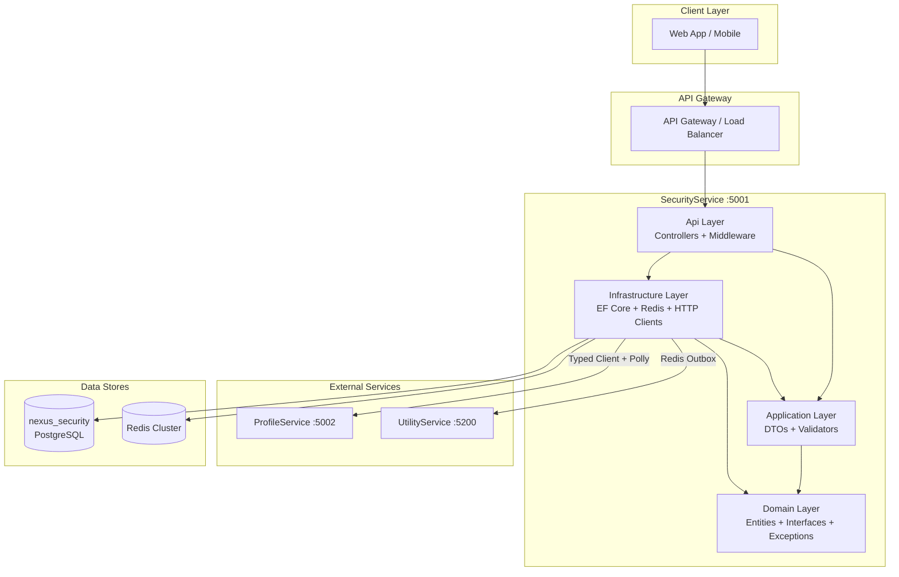
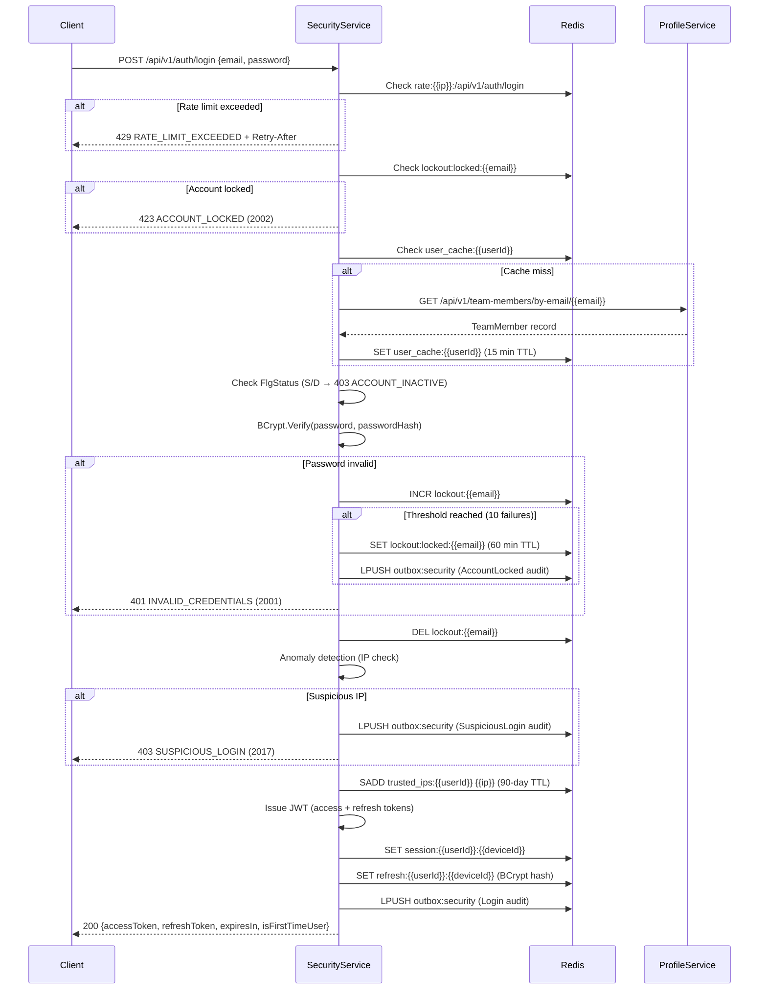
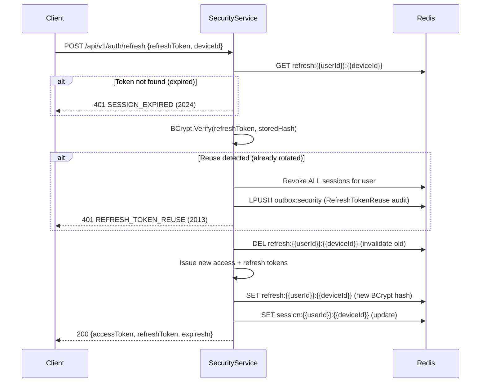
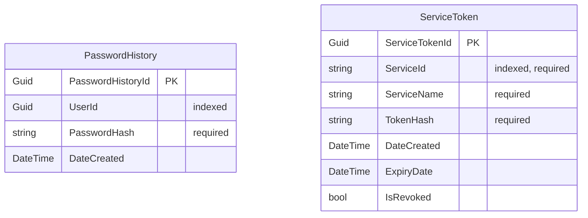

# Design Document — SecurityService

## Overview

SecurityService is the authentication, authorization, and security microservice for the Nexus-2.0 Enterprise Agile Platform. It runs on port 5001 with database `nexus_security` and follows Clean Architecture (.NET 8) with Domain / Application / Infrastructure / Api layers.

SecurityService does NOT own user records. ProfileService (port 5002) is the source of truth for TeamMember data. SecurityService resolves user identity by calling ProfileService via service-to-service JWT, with a 15-minute Redis cache (`user_cache:{userId}`).

Key responsibilities:
- JWT-based authentication with department-aware claims
- Token lifecycle management (issuance, refresh rotation, blacklisting)
- Multi-device session management (Redis-backed)
- Department-based RBAC enforcement via middleware
- OTP verification for sensitive operations
- Account lockout after repeated failed logins
- Password management with complexity enforcement and history tracking
- Sliding-window rate limiting via Redis Lua scripts
- Anomaly detection (IP-based geo-location checks)
- Service-to-service JWT authentication
- Audit event publishing via Redis outbox pattern
- Organization scope enforcement via middleware

References:
- `docs/nexus-2.0-backend-specification.md` — Sections 4.1–4.15, Section 8
- `docs/nexus-2.0-backend-requirements.md` — REQ-001 through REQ-020
- `docs/platform-specification.md` — Predecessor WEP patterns (Sections 3–4)
- `.kiro/specs/security-service/requirements.md` — REQ-001 through REQ-033

## Architecture

### High-Level Architecture



### Authentication Flow



### Token Refresh Flow



### Middleware Pipeline

Requests flow through middleware in this exact order (per REQ-017):

```
CORS → CorrelationId → GlobalExceptionHandler → RateLimiter → Routing →
Authentication → Authorization → JwtClaims → TokenBlacklist →
FirstTimeUserGuard → RoleAuthorization → OrganizationScope → Controllers
```



```mermaid
graph LR
    A[CORS] --> B[CorrelationId]
    B --> C[GlobalExceptionHandler]
    C --> D[RateLimiter]
    D --> E[Routing]
    E --> F[Authentication]
    F --> G[Authorization]
    G --> H[JwtClaims]
    H --> I[TokenBlacklist]
    I --> J[FirstTimeUserGuard]
    J --> K[RoleAuthorization]
    K --> L[OrganizationScope]
    L --> M[Controllers]
```

## Components and Interfaces

### Monorepo Folder Structure

The Nexus-2.0 monorepo organizes frontend and backend code under `src/`, with each backend service containing its Clean Architecture projects and co-located tests:

```
Nexus-2.0/
├── docs/                              # Platform specifications
├── src/
│   ├── backend/
│   │   ├── SecurityService/           # This service
│   │   │   ├── SecurityService.Domain/
│   │   │   ├── SecurityService.Application/
│   │   │   ├── SecurityService.Infrastructure/
│   │   │   ├── SecurityService.Api/
│   │   │   └── SecurityService.Tests/
│   │   ├── ProfileService/            # Identity & org management
│   │   ├── WorkService/               # Stories, tasks, sprints
│   │   └── UtilityService/            # Audit, notifications
│   └── frontend/                      # React + TypeScript + Vite
├── docker/                            # docker-compose, shared Dockerfiles
├── Nexus-2.0.sln
└── .kiro/
```

### Clean Architecture Layer Structure

All paths below are relative to `src/backend/SecurityService/`.

```
SecurityService.Domain/
├── Entities/
│   ├── PasswordHistory.cs
│   └── ServiceToken.cs
├── Exceptions/
│   ├── DomainException.cs
│   ├── ErrorCodes.cs
│   ├── AccountLockedException.cs
│   ├── InvalidCredentialsException.cs
│   ├── RateLimitExceededException.cs
│   ├── AccountInactiveException.cs
│   ├── FirstTimeUserRestrictedException.cs
│   ├── InsufficientPermissionsException.cs
│   ├── TokenRevokedException.cs
│   ├── RefreshTokenReuseException.cs
│   ├── SessionExpiredException.cs
│   ├── OtpExpiredException.cs
│   ├── OtpVerificationFailedException.cs
│   ├── OtpMaxAttemptsException.cs
│   ├── PasswordComplexityFailedException.cs
│   ├── PasswordRecentlyUsedException.cs
│   ├── PasswordReuseNotAllowedException.cs
│   ├── ServiceNotAuthorizedException.cs
│   ├── SuspiciousLoginException.cs
│   ├── OrganizationMismatchException.cs
│   ├── DepartmentAccessDeniedException.cs
│   ├── InvalidDepartmentRoleException.cs
│   ├── NotFoundException.cs
│   ├── ConflictException.cs
│   └── ServiceUnavailableException.cs
├── Interfaces/
│   ├── Repositories/
│   │   └── IPasswordHistoryRepository.cs
│   └── Services/
│       ├── IAuthService.cs
│       ├── IJwtService.cs
│       ├── ISessionService.cs
│       ├── IOtpService.cs
│       ├── IRateLimiterService.cs
│       ├── IAnomalyDetectionService.cs
│       ├── IPasswordService.cs
│       ├── IServiceTokenService.cs
│       └── IOutboxService.cs
├── Helpers/
│   ├── RoleNames.cs
│   └── EntityStatuses.cs
└── Common/
    └── IOrganizationEntity.cs

SecurityService.Application/
├── DTOs/
│   ├── ApiResponse.cs
│   ├── ErrorDetail.cs
│   ├── Auth/
│   │   ├── LoginRequest.cs
│   │   ├── LoginResponse.cs
│   │   ├── RefreshTokenRequest.cs
│   │   ├── LogoutRequest.cs
│   │   └── CredentialGenerateRequest.cs
│   ├── Otp/
│   │   ├── OtpRequest.cs
│   │   └── OtpVerifyRequest.cs
│   ├── Password/
│   │   ├── ForcedPasswordChangeRequest.cs
│   │   ├── PasswordResetRequest.cs
│   │   └── PasswordResetConfirmRequest.cs
│   ├── Session/
│   │   └── SessionResponse.cs
│   └── ServiceToken/
│       ├── ServiceTokenIssueRequest.cs
│       └── ServiceTokenResponse.cs
├── Contracts/
│   ├── ProfileUserResponse.cs
│   └── ErrorCodeResponse.cs
├── Validators/
│   ├── LoginRequestValidator.cs
│   ├── RefreshTokenRequestValidator.cs
│   ├── OtpRequestValidator.cs
│   ├── OtpVerifyRequestValidator.cs
│   ├── ForcedPasswordChangeRequestValidator.cs
│   ├── PasswordResetRequestValidator.cs
│   ├── PasswordResetConfirmRequestValidator.cs
│   ├── CredentialGenerateRequestValidator.cs
│   └── ServiceTokenIssueRequestValidator.cs
└── SecurityService.Application.csproj

SecurityService.Infrastructure/
├── Data/
│   ├── SecurityDbContext.cs
│   └── Migrations/
├── Repositories/
│   └── PasswordHistoryRepository.cs
├── Services/
│   ├── Auth/
│   │   └── AuthService.cs
│   ├── Jwt/
│   │   └── JwtService.cs
│   ├── Session/
│   │   └── SessionService.cs
│   ├── Otp/
│   │   └── OtpService.cs
│   ├── RateLimiter/
│   │   └── RateLimiterService.cs
│   ├── AnomalyDetection/
│   │   └── AnomalyDetectionService.cs
│   ├── Password/
│   │   └── PasswordService.cs
│   ├── ServiceToken/
│   │   └── ServiceTokenService.cs
│   ├── ServiceClients/
│   │   ├── IProfileServiceClient.cs
│   │   ├── ProfileServiceClient.cs
│   │   ├── IUtilityServiceClient.cs
│   │   └── UtilityServiceClient.cs
│   ├── ErrorCodeResolver/
│   │   └── ErrorCodeResolverService.cs
│   └── Outbox/
│       └── OutboxService.cs
├── Configuration/
│   ├── AppSettings.cs
│   ├── JwtConfig.cs
│   ├── DatabaseMigrationHelper.cs
│   └── DependencyInjection.cs
└── SecurityService.Infrastructure.csproj

SecurityService.Api/
├── Controllers/
│   ├── AuthController.cs
│   ├── PasswordController.cs
│   ├── SessionController.cs
│   └── ServiceTokenController.cs
├── Middleware/
│   ├── CorrelationIdMiddleware.cs
│   ├── GlobalExceptionHandlerMiddleware.cs
│   ├── RateLimiterMiddleware.cs
│   ├── JwtClaimsMiddleware.cs
│   ├── TokenBlacklistMiddleware.cs
│   ├── FirstTimeUserMiddleware.cs
│   ├── AuthenticatedRateLimiterMiddleware.cs
│   ├── RoleAuthorizationMiddleware.cs
│   ├── OrganizationScopeMiddleware.cs
│   └── CorrelationIdDelegatingHandler.cs
├── Attributes/
│   └── ServiceAuthAttribute.cs
├── Extensions/
│   ├── MiddlewarePipelineExtensions.cs
│   ├── ControllerServiceExtensions.cs
│   ├── SwaggerServiceExtensions.cs
│   └── HealthCheckExtensions.cs
├── Program.cs
├── Dockerfile
├── .env
├── .env.example
└── SecurityService.Api.csproj
```

### Domain Layer Interfaces

#### IAuthService

```csharp
public interface IAuthService
{
    Task<LoginResponse> LoginAsync(LoginRequest request, string ipAddress, string deviceId, CancellationToken ct = default);
    Task LogoutAsync(Guid userId, string deviceId, string jti, DateTime tokenExpiry, CancellationToken ct = default);
    Task<LoginResponse> RefreshTokenAsync(string refreshToken, string deviceId, CancellationToken ct = default);
    Task GenerateCredentialsAsync(Guid memberId, string email, CancellationToken ct = default);
}
```

#### IJwtService

```csharp
public interface IJwtService
{
    string GenerateAccessToken(Guid userId, Guid organizationId, Guid departmentId, string roleName, string departmentRole, string deviceId);
    string GenerateRefreshToken();
    string GenerateServiceToken(string serviceId, string serviceName);
    ClaimsPrincipal? ValidateToken(string token);
    DateTime GetTokenExpiry(string token);
    string GetJti(string token);
}
```

#### ISessionService

```csharp
public interface ISessionService
{
    Task CreateSessionAsync(Guid userId, string deviceId, string ipAddress, string jti, DateTime tokenExpiry, CancellationToken ct = default);
    Task<IEnumerable<SessionResponse>> GetSessionsAsync(Guid userId, int page, int pageSize, CancellationToken ct = default);
    Task RevokeSessionAsync(Guid userId, string sessionId, CancellationToken ct = default);
    Task RevokeAllSessionsExceptCurrentAsync(Guid userId, string currentDeviceId, CancellationToken ct = default);
    Task RevokeAllSessionsAsync(Guid userId, CancellationToken ct = default);
}
```

#### IOtpService

```csharp
public interface IOtpService
{
    Task<string> GenerateOtpAsync(string identity, CancellationToken ct = default);
    Task<bool> VerifyOtpAsync(string identity, string code, CancellationToken ct = default);
}
```

#### IRateLimiterService

```csharp
public interface IRateLimiterService
{
    Task<(bool IsAllowed, int RetryAfterSeconds)> CheckRateLimitAsync(string identity, string endpoint, int maxRequests, TimeSpan window, CancellationToken ct = default);
}
```

#### IAnomalyDetectionService

```csharp
public interface IAnomalyDetectionService
{
    Task<bool> CheckLoginAnomalyAsync(Guid userId, string ipAddress, CancellationToken ct = default);
    Task AddTrustedIpAsync(Guid userId, string ipAddress, CancellationToken ct = default);
}
```

#### IPasswordService

```csharp
public interface IPasswordService
{
    Task ForcedChangeAsync(Guid userId, string currentPasswordHash, string newPassword, CancellationToken ct = default);
    Task ResetRequestAsync(string email, CancellationToken ct = default);
    Task ResetConfirmAsync(string email, string otpCode, string newPassword, CancellationToken ct = default);
    bool ValidateComplexity(string password);
    Task<bool> IsPasswordInHistoryAsync(Guid userId, string newPassword, CancellationToken ct = default);
}
```

#### IServiceTokenService

```csharp
public interface IServiceTokenService
{
    Task<ServiceTokenResponse> IssueTokenAsync(string serviceId, string serviceName, CancellationToken ct = default);
    Task<bool> ValidateServiceTokenAsync(string token, CancellationToken ct = default);
}
```

#### IOutboxService

```csharp
public interface IOutboxService
{
    Task PublishAsync(OutboxMessage message, CancellationToken ct = default);
}
```

#### IPasswordHistoryRepository

```csharp
public interface IPasswordHistoryRepository
{
    Task<IEnumerable<PasswordHistory>> GetLastNByUserIdAsync(Guid userId, int count, CancellationToken ct = default);
    Task AddAsync(PasswordHistory entry, CancellationToken ct = default);
}
```

#### IErrorCodeResolverService

```csharp
public interface IErrorCodeResolverService
{
    Task<(string ResponseCode, string ResponseDescription)> ResolveAsync(string errorCode, CancellationToken ct = default);
}
```

### Infrastructure Service Clients

#### IProfileServiceClient

```csharp
public interface IProfileServiceClient
{
    Task<ProfileUserResponse> GetTeamMemberByEmailAsync(string email, CancellationToken ct = default);
    Task UpdatePasswordHashAsync(Guid memberId, string passwordHash, CancellationToken ct = default);
    Task SetIsFirstTimeUserAsync(Guid memberId, bool isFirstTimeUser, CancellationToken ct = default);
}
```

#### IUtilityServiceClient

```csharp
public interface IUtilityServiceClient
{
    Task<ErrorCodeResponse> GetErrorCodeAsync(string code, CancellationToken ct = default);
}
```

### Controller Definitions

#### AuthController

```csharp
[ApiController]
[Route("api/v1/auth")]
public class AuthController : ControllerBase
{
    [HttpPost("login")]                    // None auth — LoginRequest → LoginResponse
    [HttpPost("logout")]                   // Bearer auth — Logout current session
    [HttpPost("refresh")]                  // None auth — RefreshTokenRequest → LoginResponse
    [HttpPost("otp/request")]              // None auth — OtpRequest → 200
    [HttpPost("otp/verify")]               // None auth — OtpVerifyRequest → 200
    [HttpPost("credentials/generate")]     // Service auth — CredentialGenerateRequest → 200
}
```

#### PasswordController

```csharp
[ApiController]
[Route("api/v1/password")]
public class PasswordController : ControllerBase
{
    [HttpPost("forced-change")]            // Bearer auth — ForcedPasswordChangeRequest → 200
    [HttpPost("reset/request")]            // None auth — PasswordResetRequest → 200
    [HttpPost("reset/confirm")]            // None auth — PasswordResetConfirmRequest → 200
}
```

#### SessionController

```csharp
[ApiController]
[Route("api/v1/sessions")]
public class SessionController : ControllerBase
{
    [HttpGet]                              // Bearer auth — Paginated SessionResponse list
    [HttpDelete("{sessionId}")]            // Bearer auth — Revoke specific session
    [HttpDelete("all")]                    // Bearer auth — Revoke all except current
}
```

#### ServiceTokenController

```csharp
[ApiController]
[Route("api/v1/service-tokens")]
public class ServiceTokenController : ControllerBase
{
    [HttpPost("issue")]                    // Service auth — ServiceTokenIssueRequest → ServiceTokenResponse
}
```

### Domain Exception Hierarchy

```csharp
// Base exception — all domain exceptions inherit from this
public class DomainException : Exception
{
    public int ErrorValue { get; }
    public string ErrorCode { get; }
    public HttpStatusCode StatusCode { get; }
    public string? CorrelationId { get; set; }

    public DomainException(int errorValue, string errorCode, string message, HttpStatusCode statusCode = HttpStatusCode.BadRequest)
        : base(message)
    {
        ErrorValue = errorValue;
        ErrorCode = errorCode;
        StatusCode = statusCode;
    }
}

// Concrete exceptions
public class AccountLockedException : DomainException { /* 2002, 423 */ }
public class InvalidCredentialsException : DomainException { /* 2001, 401 */ }
public class AccountInactiveException : DomainException { /* 2003, 403 */ }
public class PasswordReuseNotAllowedException : DomainException { /* 2004, 400 */ }
public class PasswordRecentlyUsedException : DomainException { /* 2005, 400 */ }
public class FirstTimeUserRestrictedException : DomainException { /* 2006, 403 */ }
public class OtpExpiredException : DomainException { /* 2007, 400 */ }
public class OtpVerificationFailedException : DomainException { /* 2008, 400 */ }
public class OtpMaxAttemptsException : DomainException { /* 2009, 429 */ }
public class RateLimitExceededException : DomainException { /* 2010, 429 — includes RetryAfterSeconds */ }
public class InsufficientPermissionsException : DomainException { /* 2011, 403 */ }
public class TokenRevokedException : DomainException { /* 2012, 401 */ }
public class RefreshTokenReuseException : DomainException { /* 2013, 401 */ }
public class ServiceNotAuthorizedException : DomainException { /* 2016, 403 */ }
public class SuspiciousLoginException : DomainException { /* 2017, 403 */ }
public class PasswordComplexityFailedException : DomainException { /* 2018, 400 */ }
public class OrganizationMismatchException : DomainException { /* 2019, 403 */ }
public class DepartmentAccessDeniedException : DomainException { /* 2020, 403 */ }
public class NotFoundException : DomainException { /* 2021, 404 */ }
public class ConflictException : DomainException { /* 2022, 409 */ }
public class ServiceUnavailableException : DomainException { /* 2023, 503 */ }
public class SessionExpiredException : DomainException { /* 2024, 401 */ }
public class InvalidDepartmentRoleException : DomainException { /* 2025, 403 */ }
```

### ErrorCodes Static Class

```csharp
public static class ErrorCodes
{
    // Shared
    public const string ValidationError = "VALIDATION_ERROR";
    public const int ValidationErrorValue = 1000;

    // Authentication (2001–2003)
    public const string InvalidCredentials = "INVALID_CREDENTIALS";
    public const int InvalidCredentialsValue = 2001;
    public const string AccountLocked = "ACCOUNT_LOCKED";
    public const int AccountLockedValue = 2002;
    public const string AccountInactive = "ACCOUNT_INACTIVE";
    public const int AccountInactiveValue = 2003;

    // Password (2004–2006, 2018)
    public const string PasswordReuseNotAllowed = "PASSWORD_REUSE_NOT_ALLOWED";
    public const int PasswordReuseNotAllowedValue = 2004;
    public const string PasswordRecentlyUsed = "PASSWORD_RECENTLY_USED";
    public const int PasswordRecentlyUsedValue = 2005;
    public const string FirstTimeUserRestricted = "FIRST_TIME_USER_RESTRICTED";
    public const int FirstTimeUserRestrictedValue = 2006;
    public const string PasswordComplexityFailed = "PASSWORD_COMPLEXITY_FAILED";
    public const int PasswordComplexityFailedValue = 2018;

    // OTP (2007–2009)
    public const string OtpExpired = "OTP_EXPIRED";
    public const int OtpExpiredValue = 2007;
    public const string OtpVerificationFailed = "OTP_VERIFICATION_FAILED";
    public const int OtpVerificationFailedValue = 2008;
    public const string OtpMaxAttempts = "OTP_MAX_ATTEMPTS";
    public const int OtpMaxAttemptsValue = 2009;

    // Rate Limiting (2010)
    public const string RateLimitExceeded = "RATE_LIMIT_EXCEEDED";
    public const int RateLimitExceededValue = 2010;

    // Authorization (2011, 2020, 2025)
    public const string InsufficientPermissions = "INSUFFICIENT_PERMISSIONS";
    public const int InsufficientPermissionsValue = 2011;
    public const string DepartmentAccessDenied = "DEPARTMENT_ACCESS_DENIED";
    public const int DepartmentAccessDeniedValue = 2020;
    public const string InvalidDepartmentRole = "INVALID_DEPARTMENT_ROLE";
    public const int InvalidDepartmentRoleValue = 2025;

    // Token (2012–2013, 2024)
    public const string TokenRevoked = "TOKEN_REVOKED";
    public const int TokenRevokedValue = 2012;
    public const string RefreshTokenReuse = "REFRESH_TOKEN_REUSE";
    public const int RefreshTokenReuseValue = 2013;
    public const string SessionExpired = "SESSION_EXPIRED";
    public const int SessionExpiredValue = 2024;

    // Service Auth (2016)
    public const string ServiceNotAuthorized = "SERVICE_NOT_AUTHORIZED";
    public const int ServiceNotAuthorizedValue = 2016;

    // Anomaly (2017)
    public const string SuspiciousLogin = "SUSPICIOUS_LOGIN";
    public const int SuspiciousLoginValue = 2017;

    // Organization (2019)
    public const string OrganizationMismatch = "ORGANIZATION_MISMATCH";
    public const int OrganizationMismatchValue = 2019;

    // General (2021–2023)
    public const string NotFound = "NOT_FOUND";
    public const int NotFoundValue = 2021;
    public const string Conflict = "CONFLICT";
    public const int ConflictValue = 2022;
    public const string ServiceUnavailable = "SERVICE_UNAVAILABLE";
    public const int ServiceUnavailableValue = 2023;

    // Internal
    public const string InternalError = "INTERNAL_ERROR";
    public const int InternalErrorValue = 9999;
}
```

### Application DTOs

#### Request DTOs

```csharp
public class LoginRequest
{
    public string Email { get; set; } = string.Empty;
    public string Password { get; set; } = string.Empty;
    public string? DeviceId { get; set; }
}

public class RefreshTokenRequest
{
    public string RefreshToken { get; set; } = string.Empty;
    public string DeviceId { get; set; } = string.Empty;
}

public class OtpRequest
{
    public string Identity { get; set; } = string.Empty;  // email or phone
}

public class OtpVerifyRequest
{
    public string Identity { get; set; } = string.Empty;
    public string Code { get; set; } = string.Empty;
}

public class CredentialGenerateRequest
{
    public Guid MemberId { get; set; }
    public string Email { get; set; } = string.Empty;
}

public class ForcedPasswordChangeRequest
{
    public string NewPassword { get; set; } = string.Empty;
}

public class PasswordResetRequest
{
    public string Email { get; set; } = string.Empty;
}

public class PasswordResetConfirmRequest
{
    public string Email { get; set; } = string.Empty;
    public string OtpCode { get; set; } = string.Empty;
    public string NewPassword { get; set; } = string.Empty;
}

public class ServiceTokenIssueRequest
{
    public string ServiceId { get; set; } = string.Empty;
    public string ServiceName { get; set; } = string.Empty;
}
```

#### Response DTOs

```csharp
public class LoginResponse
{
    public string AccessToken { get; set; } = string.Empty;
    public string RefreshToken { get; set; } = string.Empty;
    public int ExpiresIn { get; set; }
    public bool IsFirstTimeUser { get; set; }
}

public class SessionResponse
{
    public string SessionId { get; set; } = string.Empty;
    public string DeviceId { get; set; } = string.Empty;
    public string IpAddress { get; set; } = string.Empty;
    public DateTime CreatedAt { get; set; }
}

public class ServiceTokenResponse
{
    public string Token { get; set; } = string.Empty;
    public int ExpiresInSeconds { get; set; }
}
```

#### ApiResponse Envelope

```csharp
public class ApiResponse<T>
{
    public int ResponseCode { get; set; }
    public bool Success { get; set; }
    public T? Data { get; set; }
    public string? ErrorCode { get; set; }
    public int? ErrorValue { get; set; }
    public string? Message { get; set; }
    public string? CorrelationId { get; set; }
    public List<ErrorDetail>? Errors { get; set; }
}

public class ErrorDetail
{
    public string Field { get; set; } = string.Empty;
    public string Message { get; set; } = string.Empty;
}
```

### FluentValidation Validators

```csharp
public class LoginRequestValidator : AbstractValidator<LoginRequest>
{
    public LoginRequestValidator()
    {
        RuleFor(x => x.Email).NotEmpty().EmailAddress();
        RuleFor(x => x.Password).NotEmpty();
    }
}

public class RefreshTokenRequestValidator : AbstractValidator<RefreshTokenRequest>
{
    public RefreshTokenRequestValidator()
    {
        RuleFor(x => x.RefreshToken).NotEmpty();
        RuleFor(x => x.DeviceId).NotEmpty();
    }
}

public class OtpRequestValidator : AbstractValidator<OtpRequest>
{
    public OtpRequestValidator()
    {
        RuleFor(x => x.Identity).NotEmpty();
    }
}

public class OtpVerifyRequestValidator : AbstractValidator<OtpVerifyRequest>
{
    public OtpVerifyRequestValidator()
    {
        RuleFor(x => x.Identity).NotEmpty();
        RuleFor(x => x.Code).NotEmpty().Length(6).Matches(@"^\d{6}$");
    }
}

public class ForcedPasswordChangeRequestValidator : AbstractValidator<ForcedPasswordChangeRequest>
{
    public ForcedPasswordChangeRequestValidator()
    {
        RuleFor(x => x.NewPassword).NotEmpty().MinimumLength(8)
            .Matches(@"[A-Z]").WithMessage("Must contain at least one uppercase letter.")
            .Matches(@"[a-z]").WithMessage("Must contain at least one lowercase letter.")
            .Matches(@"\d").WithMessage("Must contain at least one digit.")
            .Matches(@"[!@#$%^&*]").WithMessage("Must contain at least one special character (!@#$%^&*).");
    }
}

public class PasswordResetRequestValidator : AbstractValidator<PasswordResetRequest>
{
    public PasswordResetRequestValidator()
    {
        RuleFor(x => x.Email).NotEmpty().EmailAddress();
    }
}

public class PasswordResetConfirmRequestValidator : AbstractValidator<PasswordResetConfirmRequest>
{
    public PasswordResetConfirmRequestValidator()
    {
        RuleFor(x => x.Email).NotEmpty().EmailAddress();
        RuleFor(x => x.OtpCode).NotEmpty().Length(6).Matches(@"^\d{6}$");
        RuleFor(x => x.NewPassword).NotEmpty().MinimumLength(8)
            .Matches(@"[A-Z]").Matches(@"[a-z]").Matches(@"\d").Matches(@"[!@#$%^&*]");
    }
}

public class CredentialGenerateRequestValidator : AbstractValidator<CredentialGenerateRequest>
{
    public CredentialGenerateRequestValidator()
    {
        RuleFor(x => x.MemberId).NotEmpty();
        RuleFor(x => x.Email).NotEmpty().EmailAddress();
    }
}

public class ServiceTokenIssueRequestValidator : AbstractValidator<ServiceTokenIssueRequest>
{
    public ServiceTokenIssueRequestValidator()
    {
        RuleFor(x => x.ServiceId).NotEmpty();
        RuleFor(x => x.ServiceName).NotEmpty();
    }
}
```

### Infrastructure Implementations

#### SecurityDbContext

```csharp
public class SecurityDbContext : DbContext
{
    public DbSet<PasswordHistory> PasswordHistories => Set<PasswordHistory>();
    public DbSet<ServiceToken> ServiceTokens => Set<ServiceToken>();

    protected override void OnModelCreating(ModelBuilder modelBuilder)
    {
        // PasswordHistory
        modelBuilder.Entity<PasswordHistory>(entity =>
        {
            entity.HasKey(e => e.PasswordHistoryId);
            entity.HasIndex(e => e.UserId);
            entity.Property(e => e.PasswordHash).IsRequired();
        });

        // ServiceToken
        modelBuilder.Entity<ServiceToken>(entity =>
        {
            entity.HasKey(e => e.ServiceTokenId);
            entity.HasIndex(e => e.ServiceId);
            entity.Property(e => e.ServiceId).IsRequired();
            entity.Property(e => e.ServiceName).IsRequired();
            entity.Property(e => e.TokenHash).IsRequired();
        });
    }
}
```

Note: SecurityService entities (PasswordHistory, ServiceToken) are NOT organization-scoped — they do not implement `IOrganizationEntity` and have no global query filters by `OrganizationId`.

#### Redis Sliding Window Rate Limiter (Lua Script)

```lua
-- Sliding window rate limiter
-- KEYS[1] = rate:{identity}:{endpoint}
-- ARGV[1] = current timestamp (ms)
-- ARGV[2] = window size (ms)
-- ARGV[3] = max requests
-- Returns: {allowed (0/1), remaining, retryAfterMs}

local key = KEYS[1]
local now = tonumber(ARGV[1])
local window = tonumber(ARGV[2])
local maxRequests = tonumber(ARGV[3])
local windowStart = now - window

-- Remove expired entries
redis.call('ZREMRANGEBYSCORE', key, '-inf', windowStart)

-- Count current entries
local count = redis.call('ZCARD', key)

if count >= maxRequests then
    -- Get oldest entry to calculate retry-after
    local oldest = redis.call('ZRANGE', key, 0, 0, 'WITHSCORES')
    local retryAfter = 0
    if #oldest > 0 then
        retryAfter = tonumber(oldest[2]) + window - now
    end
    return {0, 0, retryAfter}
end

-- Add current request
redis.call('ZADD', key, now, now .. ':' .. math.random(1000000))
redis.call('PEXPIRE', key, window)

return {1, maxRequests - count - 1, 0}
```

#### ProfileServiceClient (Typed Client with Polly)

```csharp
public class ProfileServiceClient : IProfileServiceClient
{
    private const string DownstreamServiceName = "ProfileService";
    private readonly IHttpClientFactory _httpClientFactory;
    private readonly IServiceTokenService _serviceTokenService;
    private readonly IHttpContextAccessor _httpContextAccessor;
    private readonly ILogger<ProfileServiceClient> _logger;

    private string? _cachedToken;
    private DateTime _tokenExpiry = DateTime.MinValue;

    public async Task<ProfileUserResponse> GetTeamMemberByEmailAsync(string email, CancellationToken ct = default)
    {
        var endpoint = $"/api/v1/team-members/by-email/{Uri.EscapeDataString(email)}";
        var client = _httpClientFactory.CreateClient(DownstreamServiceName);
        await AttachHeadersAsync(client);
        // ... standard downstream call pattern with error handling
    }

    private async Task<string> GetServiceTokenAsync()
    {
        if (_cachedToken != null && DateTime.UtcNow.AddSeconds(30) < _tokenExpiry)
            return _cachedToken;
        var result = await _serviceTokenService.IssueTokenAsync("SecurityService", "SecurityService");
        _cachedToken = result.Token;
        _tokenExpiry = DateTime.UtcNow.AddSeconds(result.ExpiresInSeconds);
        return _cachedToken;
    }
}
```

Polly policies registered at `AddHttpClient` time:

```csharp
services.AddHttpClient("ProfileService", client =>
    {
        client.BaseAddress = new Uri(appSettings.ProfileServiceBaseUrl);
    })
    .AddHttpMessageHandler<CorrelationIdDelegatingHandler>()
    .AddPolicyHandler(Policy.TimeoutAsync<HttpResponseMessage>(TimeSpan.FromSeconds(10)))
    .AddTransientHttpErrorPolicy(p => p.WaitAndRetryAsync(3, attempt => TimeSpan.FromSeconds(Math.Pow(2, attempt - 1))))
    .AddTransientHttpErrorPolicy(p => p.CircuitBreakerAsync(5, TimeSpan.FromSeconds(30)));
```

| Policy | Parameter | Value |
|--------|-----------|-------|
| Retry | Max retries | 3 |
| Retry | Backoff | Exponential: 1s, 2s, 4s |
| Retry | Triggers | 5xx, 408 (transient HTTP errors) |
| Circuit Breaker | Failure threshold | 5 consecutive failures |
| Circuit Breaker | Break duration | 30 seconds |
| Timeout | Per-request | 10 seconds |

#### ErrorCodeResolverService

```csharp
public class ErrorCodeResolverService : IErrorCodeResolverService
{
    private readonly IUtilityServiceClient _utilityClient;
    private readonly IConnectionMultiplexer _redis;

    public async Task<(string ResponseCode, string ResponseDescription)> ResolveAsync(string errorCode, CancellationToken ct = default)
    {
        // 1. Check Redis cache: error_code:{code}
        var db = _redis.GetDatabase();
        var cached = await db.StringGetAsync($"error_code:{errorCode}");
        if (cached.HasValue) return DeserializeCached(cached);

        // 2. Call UtilityService
        try
        {
            var result = await _utilityClient.GetErrorCodeAsync(errorCode, ct);
            await db.StringSetAsync($"error_code:{errorCode}", Serialize(result), TimeSpan.FromHours(24));
            return (result.ResponseCode, result.Description);
        }
        catch
        {
            // 3. Fallback to local static mapping
            return (MapErrorToResponseCode(errorCode), errorCode);
        }
    }

    public static string MapErrorToResponseCode(string errorCode) => errorCode switch
    {
        "INVALID_CREDENTIALS" => "01",
        "ACCOUNT_LOCKED" or "ACCOUNT_INACTIVE" => "02",
        "INSUFFICIENT_PERMISSIONS" or "DEPARTMENT_ACCESS_DENIED" or "ORGANIZATION_MISMATCH" => "03",
        _ when errorCode.StartsWith("OTP_") => "04",
        _ when errorCode.StartsWith("PASSWORD_") => "05",
        _ when errorCode.Contains("DUPLICATE") || errorCode.Contains("CONFLICT") => "06",
        _ when errorCode.Contains("NOT_FOUND") => "07",
        "RATE_LIMIT_EXCEEDED" => "08",
        _ when errorCode.StartsWith("INVALID_") => "09",
        "VALIDATION_ERROR" => "96",
        "INTERNAL_ERROR" => "98",
        _ => "99"
    };
}
```

### Middleware Details

#### GlobalExceptionHandlerMiddleware

Catches all exceptions and returns standardized `ApiResponse<object>` with `application/problem+json` content type:

- `DomainException` → Uses `IErrorCodeResolverService` to resolve error code, returns appropriate HTTP status with `ErrorCode`, `ErrorValue`, `Message`, `CorrelationId`
- `RateLimitExceededException` → Adds `Retry-After` header
- Unhandled exceptions → HTTP 500 with `INTERNAL_ERROR`, no stack trace leakage, publishes error event to `outbox:security`

#### TokenBlacklistMiddleware

For every authenticated request, checks `blacklist:{jti}` in Redis. If found, returns 401 `TOKEN_REVOKED`.

#### FirstTimeUserMiddleware

For authenticated users with `IsFirstTimeUser=true` claim, blocks all endpoints except `POST /api/v1/password/forced-change`. Returns 403 `FIRST_TIME_USER_RESTRICTED`.

#### RoleAuthorizationMiddleware

Extracts `roleName` and `departmentId` from JWT claims. Compares against endpoint-level role requirements. OrgAdmin gets organization-wide access. DeptLead gets access only within their department. Returns 403 `INSUFFICIENT_PERMISSIONS` or `DEPARTMENT_ACCESS_DENIED` on failure.

#### OrganizationScopeMiddleware

Extracts `organizationId` from JWT claims. Validates against route/query parameters. Service-auth tokens skip org scope. Propagates `X-Organization-Id` header on inter-service calls. Returns 403 `ORGANIZATION_MISMATCH` on mismatch.

### Configuration

#### AppSettings

```csharp
public class AppSettings
{
    public string DatabaseConnectionString { get; set; } = string.Empty;
    public string JwtIssuer { get; set; } = string.Empty;
    public string JwtAudience { get; set; } = string.Empty;
    public string JwtSecretKey { get; set; } = string.Empty;
    public int AccessTokenExpiryMinutes { get; set; } = 15;
    public int RefreshTokenExpiryDays { get; set; } = 7;
    public string RedisConnectionString { get; set; } = string.Empty;
    public string[] AllowedOrigins { get; set; } = [];
    public string ProfileServiceBaseUrl { get; set; } = string.Empty;
    public string UtilityServiceBaseUrl { get; set; } = string.Empty;
    public int RateLimitLoginMax { get; set; } = 5;
    public int RateLimitLoginWindowMinutes { get; set; } = 15;
    public int RateLimitOtpMax { get; set; } = 3;
    public int RateLimitOtpWindowMinutes { get; set; } = 5;
    public int OtpExpiryMinutes { get; set; } = 5;
    public int OtpMaxAttempts { get; set; } = 3;
    public int AccountLockoutMaxAttempts { get; set; } = 10;
    public int AccountLockoutWindowHours { get; set; } = 24;
    public int AccountLockoutDurationMinutes { get; set; } = 60;

    public static AppSettings FromEnvironment() { /* loads from env vars */ }
}
```

#### JwtConfig

```csharp
public class JwtConfig
{
    public string Issuer { get; set; } = string.Empty;
    public string Audience { get; set; } = string.Empty;
    public string SecretKey { get; set; } = string.Empty;
    public int AccessTokenExpiryMinutes { get; set; } = 15;
    public int RefreshTokenExpiryDays { get; set; } = 7;
}
```

### JWT Claims Structure

```json
{
  "userId": "guid",
  "organizationId": "guid",
  "departmentId": "guid",
  "roleName": "OrgAdmin|DeptLead|Member|Viewer",
  "departmentRole": "string",
  "deviceId": "string",
  "jti": "unique-token-id",
  "iss": "JWT_ISSUER",
  "aud": "JWT_AUDIENCE",
  "exp": 1234567890,
  "iat": 1234567890
}
```

Service tokens contain only:
```json
{
  "serviceId": "string",
  "serviceName": "string",
  "jti": "unique-token-id",
  "iss": "JWT_ISSUER",
  "aud": "JWT_AUDIENCE",
  "exp": 1234567890
}
```

### Outbox Message Format

```csharp
public class OutboxMessage
{
    public Guid MessageId { get; set; } = Guid.NewGuid();
    public string MessageType { get; set; } = string.Empty;       // "AuditEvent", "NotificationRequest"
    public string ServiceName { get; set; } = "SecurityService";
    public Guid? OrganizationId { get; set; }
    public Guid? UserId { get; set; }
    public string Action { get; set; } = string.Empty;            // "Login", "Logout", "PasswordChanged", etc.
    public string EntityType { get; set; } = string.Empty;        // "Session", "Password", "Account"
    public string EntityId { get; set; } = string.Empty;
    public string? OldValue { get; set; }
    public string? NewValue { get; set; }
    public string? IpAddress { get; set; }
    public string CorrelationId { get; set; } = string.Empty;
    public DateTime Timestamp { get; set; } = DateTime.UtcNow;
    public int RetryCount { get; set; } = 0;
}
```

Published to `outbox:security` via `LPUSH`. On failure, retries up to 3 times with exponential backoff. After 3 failures, moved to `dlq:security`.

### Redis Key Patterns

| Pattern | Purpose | TTL |
|---------|---------|-----|
| `rate:{identity}:{endpoint}` | Sliding window rate limit counters | Window duration |
| `otp:{identity}` | OTP code + attempt counter (JSON) | 5 minutes |
| `session:{userId}:{deviceId}` | Active session metadata (JSON) | Access token expiry |
| `refresh:{userId}:{deviceId}` | BCrypt-hashed refresh token | 7 days |
| `blacklist:{jti}` | Revoked access token JTI | Remaining token TTL |
| `lockout:{identity}` | Failed login attempt counter | 24 hours |
| `lockout:locked:{identity}` | Account locked flag | 1 hour |
| `trusted_ips:{userId}` | Set of known IP addresses | 90 days |
| `service_token:{serviceId}` | Service-to-service JWT cache | 23 hours |
| `outbox:security` | Outbox queue for audit events | Until processed |
| `dlq:security` | Dead-letter queue for failed outbox messages | Until processed |
| `user_cache:{userId}` | Cached user record from ProfileService | 15 minutes |
| `error_code:{code}` | Cached error code resolution from UtilityService | 24 hours |

### Health Checks

```csharp
// HealthCheckExtensions.cs
public static IServiceCollection AddSecurityHealthChecks(this IServiceCollection services)
{
    services.AddHealthChecks()
        .AddNpgSql(connectionString, name: "postgresql")
        .AddRedis(redisConnectionString, name: "redis");
    return services;
}

// Endpoints
// GET /health  → Liveness (always 200 if process running)
// GET /ready   → Readiness (checks PostgreSQL + Redis connectivity)
```

### Swagger Configuration

```csharp
// SwaggerServiceExtensions.cs — Development mode only
services.AddSwaggerGen(c =>
{
    c.SwaggerDoc("v1", new OpenApiInfo { Title = "SecurityService API", Version = "v1" });
    c.AddSecurityDefinition("Bearer", new OpenApiSecurityScheme
    {
        Description = "JWT Authorization header using the Bearer scheme.",
        Name = "Authorization",
        In = ParameterLocation.Header,
        Type = SecuritySchemeType.Http,
        Scheme = "bearer"
    });
    c.AddSecurityRequirement(/* Bearer requirement */);
});
```

## Data Models

### PasswordHistory Entity

| Column | Type | Constraints | Description |
|--------|------|-------------|-------------|
| `PasswordHistoryId` | `Guid` | PK, auto-generated | Primary key |
| `UserId` | `Guid` | Indexed, required | Team member reference |
| `PasswordHash` | `string` | Required | BCrypt hash of the password |
| `DateCreated` | `DateTime` | Required | UTC timestamp of creation |

```csharp
public class PasswordHistory
{
    public Guid PasswordHistoryId { get; set; } = Guid.NewGuid();
    public Guid UserId { get; set; }
    public string PasswordHash { get; set; } = string.Empty;
    public DateTime DateCreated { get; set; } = DateTime.UtcNow;
}
```

### ServiceToken Entity

| Column | Type | Constraints | Description |
|--------|------|-------------|-------------|
| `ServiceTokenId` | `Guid` | PK, auto-generated | Primary key |
| `ServiceId` | `string` | Indexed, required | Calling service identifier |
| `ServiceName` | `string` | Required | Human-readable service name |
| `TokenHash` | `string` | Required | Hash of issued token |
| `DateCreated` | `DateTime` | Required | Issuance timestamp |
| `ExpiryDate` | `DateTime` | Required | Token expiry |
| `IsRevoked` | `bool` | Default false | Revocation flag |

```csharp
public class ServiceToken
{
    public Guid ServiceTokenId { get; set; } = Guid.NewGuid();
    public string ServiceId { get; set; } = string.Empty;
    public string ServiceName { get; set; } = string.Empty;
    public string TokenHash { get; set; } = string.Empty;
    public DateTime DateCreated { get; set; } = DateTime.UtcNow;
    public DateTime ExpiryDate { get; set; }
    public bool IsRevoked { get; set; } = false;
}
```

### ER Diagram



Note: SecurityService has a minimal PostgreSQL footprint. Most state (sessions, tokens, rate limits, OTP, lockouts) lives in Redis. The only persistent tables are `password_history` (for password reuse prevention) and `service_token` (for service-to-service JWT audit trail).
