# Design Document: Standardized API Responses

## Overview

This feature introduces an `ApiResponseExtensions` static class per service that provides `ToActionResult<T>()` and `ToBadRequest()` extension methods on the existing `ApiResponse<T>` class. The goal is to replace the scattered `Wrap()` + `Ok()`/`StatusCode()` pattern found in every controller across all five Nexus 2.0 backend services with a single, centralized call: `response.ToActionResult(HttpContext)`.

Currently, each controller defines a private `Wrap()` method that:
1. Calls `ApiResponse<T>.Ok(data, message)` to create a success response
2. Manually sets `CorrelationId` from `HttpContext.Items["CorrelationId"]`
3. Returns the wrapped response via `Ok()` or `StatusCode(201, ...)` manually

This leads to duplicated logic across 46+ controllers and inconsistent HTTP status code selection. The extension method centralizes all of this: CorrelationId injection, HTTP status code determination from `ErrorCode`, null response handling, and custom status code overrides for 201 Created scenarios.

The extension operates purely at the API layer and does not modify the existing `ApiResponse<T>` class, `DomainException`, or `GlobalExceptionHandlerMiddleware`. It handles the "happy path" and "service-returned error" flows, while the middleware continues to handle thrown `DomainException` instances.

## Architecture

```mermaid
flowchart TD
    subgraph Controller["Controller Action"]
        A[Service Method Call] --> B{Returns ApiResponse&lt;T&gt;}
        B --> C["response.ToActionResult(HttpContext)"]
        B --> D["response.ToActionResult(HttpContext, 201)"]
    end

    subgraph Extension["ApiResponseExtensions"]
        C --> E{response == null?}
        D --> E
        E -->|Yes| F[Return 500 with INTERNAL_ERROR]
        E -->|No| G{response.Success?}
        G -->|Yes| H{Custom status code?}
        H -->|Yes| I[Return ObjectResult with custom code]
        H -->|No| J[Return OkObjectResult 200]
        G -->|No| K[DetermineStatusCodeFromErrorCode]
        K --> L[Return ObjectResult with mapped code]
    end

    subgraph CorrelationId["CorrelationId Injection"]
        E -->|Before branching| M[Set response.CorrelationId from HttpContext.Items]
    end

    subgraph Middleware["GlobalExceptionHandlerMiddleware"]
        N[DomainException thrown] --> O[Catches exception]
        O --> P[Builds ApiResponse&lt;object&gt; with same JSON structure]
        P --> Q[Returns HTTP status from DomainException.StatusCode]
    end

    style Extension fill:#e1f5fe
    style Middleware fill:#fff3e0
```



The extension and middleware operate on separate code paths:
- **Extension path**: Service returns `ApiResponse<T>` → controller calls `.ToActionResult()` → extension maps to `IActionResult`
- **Middleware path**: Service throws `DomainException` → middleware catches → middleware builds `ApiResponse<object>` and writes HTTP response directly

Both produce the same `ApiResponse<T>` JSON structure, ensuring API consumers see a consistent format regardless of which path handled the response.

## Components and Interfaces

### ApiResponseExtensions Static Class

One copy per service, placed in `{Service}.Api/Extensions/ApiResponseExtensions.cs`. Each copy references its own service's `ApiResponse<T>` namespace.

```csharp
namespace {Service}.Api.Extensions;

using Microsoft.AspNetCore.Mvc;
using {Service}.Application.DTOs;

public static class ApiResponseExtensions
{
    /// <summary>
    /// Converts an ApiResponse&lt;T&gt; into an IActionResult with the correct HTTP status code.
    /// Automatically injects CorrelationId from HttpContext.
    /// </summary>
    /// <param name="response">The ApiResponse from the service layer (may be null).</param>
    /// <param name="httpContext">The current HttpContext for CorrelationId injection.</param>
    /// <param name="successStatusCode">Optional custom HTTP status code for success (e.g., 201). Defaults to 200.</param>
    public static IActionResult ToActionResult<T>(
        this ApiResponse<T>? response,
        HttpContext httpContext,
        int? successStatusCode = null);

    /// <summary>
    /// Creates a standardized 400 Bad Request response from a message string.
    /// </summary>
    /// <param name="message">The validation/error message.</param>
    /// <param name="httpContext">Optional HttpContext for CorrelationId injection.</param>
    public static IActionResult ToBadRequest(
        string message,
        HttpContext? httpContext = null);

    /// <summary>
    /// Maps an ErrorCode string to the appropriate HTTP status code.
    /// </summary>
    internal static int DetermineStatusCodeFromErrorCode(string? errorCode);
}
```

### Method Signatures

| Method | Input | Output | Purpose |
|--------|-------|--------|---------|
| `ToActionResult<T>` | `ApiResponse<T>?`, `HttpContext`, `int?` | `IActionResult` | Main extension: maps response to correct HTTP status |
| `ToBadRequest` | `string`, `HttpContext?` | `IActionResult` | Quick 400 response for simple validation rejections |
| `DetermineStatusCodeFromErrorCode` | `string?` | `int` | Internal: ErrorCode → HTTP status mapping |

### DetermineStatusCodeFromErrorCode Mapping

This is the centralized mapping logic used by `ToActionResult` when `Success` is false:

```csharp
internal static int DetermineStatusCodeFromErrorCode(string? errorCode)
{
    if (string.IsNullOrEmpty(errorCode))
        return 400;

    return errorCode switch
    {
        // 401 Unauthorized — authentication failures
        "INVALID_CREDENTIALS" or "TOKEN_REVOKED" or "REFRESH_TOKEN_REUSE"
            or "SESSION_EXPIRED" => 401,

        // 403 Forbidden — authorization failures
        "INSUFFICIENT_PERMISSIONS" or "DEPARTMENT_ACCESS_DENIED"
            or "ORGANIZATION_MISMATCH" => 403,

        // 423 Locked
        "ACCOUNT_LOCKED" => 423,

        // 429 Too Many Requests
        "RATE_LIMIT_EXCEEDED" => 429,

        // 500 Internal Server Error
        "INTERNAL_ERROR" => 500,

        // 503 Service Unavailable
        "SERVICE_UNAVAILABLE" => 503,

        // Pattern-based matches (order matters — checked after exact matches)
        _ when errorCode.Contains("NOT_FOUND") => 404,
        _ when errorCode.Contains("ALREADY_EXISTS")
            || errorCode.Contains("DUPLICATE")
            || errorCode.Contains("CONFLICT") => 409,
        _ when errorCode.Contains("PAYMENT_PROVIDER_ERROR") => 502,

        // Default fallback
        _ => 400
    };
}
```

This mapping covers all `ErrorCodes.cs` constants across all five services:
- **SecurityService** (2000s): `INVALID_CREDENTIALS` → 401, `ACCOUNT_LOCKED` → 423, `TOKEN_REVOKED`/`REFRESH_TOKEN_REUSE`/`SESSION_EXPIRED` → 401, `INSUFFICIENT_PERMISSIONS`/`DEPARTMENT_ACCESS_DENIED`/`ORGANIZATION_MISMATCH` → 403, `RATE_LIMIT_EXCEEDED` → 429, `*_NOT_FOUND` → 404, `CONFLICT` → 409
- **ProfileService** (3000s): `*_DUPLICATE` → 409, `*_NOT_FOUND` → 404, `ORGANIZATION_MISMATCH` → 403, `RATE_LIMIT_EXCEEDED` → 429, `CONFLICT` → 409
- **WorkService** (4000s): `*_NOT_FOUND` → 404, `*_DUPLICATE` → 409, `ORGANIZATION_MISMATCH`/`DEPARTMENT_ACCESS_DENIED`/`INSUFFICIENT_PERMISSIONS` → 403
- **BillingService** (5000s): `*_NOT_FOUND` → 404, `*_ALREADY_EXISTS`/`*_ALREADY_CANCELLED` → 409, `PAYMENT_PROVIDER_ERROR` → 502, `INSUFFICIENT_PERMISSIONS` → 403
- **UtilityService** (6000s): `*_NOT_FOUND` → 404, `*_DUPLICATE` → 409, `ORGANIZATION_MISMATCH` → 403
- **Shared**: `VALIDATION_ERROR` → 400 (falls through to default), `INTERNAL_ERROR` → 500, `SERVICE_UNAVAILABLE` → 503

### ToActionResult Implementation Logic

```csharp
public static IActionResult ToActionResult<T>(
    this ApiResponse<T>? response,
    HttpContext httpContext,
    int? successStatusCode = null)
{
    // 1. Null guard
    if (response is null)
    {
        var errorResponse = new ApiResponse<T>
        {
            Success = false,
            ErrorCode = "INTERNAL_ERROR",
            ErrorValue = 9999,
            Message = "An unexpected null response was received.",
            ResponseCode = "98",
            ResponseDescription = "An unexpected null response was received.",
            CorrelationId = httpContext.Items["CorrelationId"]?.ToString()
        };
        return new ObjectResult(errorResponse) { StatusCode = 500 };
    }

    // 2. Inject CorrelationId
    var correlationId = httpContext.Items["CorrelationId"]?.ToString();
    if (correlationId is not null)
    {
        response.CorrelationId = correlationId;
    }

    // 3. Error path — ignore custom status code
    if (!response.Success)
    {
        var statusCode = DetermineStatusCodeFromErrorCode(response.ErrorCode);
        return new ObjectResult(response) { StatusCode = statusCode };
    }

    // 4. Success path — use custom status code or default 200
    if (successStatusCode.HasValue)
    {
        return new ObjectResult(response) { StatusCode = successStatusCode.Value };
    }

    return new OkObjectResult(response);
}
```

### ToBadRequest Implementation

```csharp
public static IActionResult ToBadRequest(string message, HttpContext? httpContext = null)
{
    var response = new ApiResponse<object>
    {
        Success = false,
        ErrorCode = "VALIDATION_ERROR",
        ErrorValue = 1000,
        Message = message,
        ResponseCode = "96",
        ResponseDescription = message,
        CorrelationId = httpContext?.Items["CorrelationId"]?.ToString()
    };
    return new ObjectResult(response) { StatusCode = 400 };
}
```

### Controller Migration Pattern

**Before** (current pattern in every controller):
```csharp
// Private Wrap method in each controller
private ApiResponse<object> Wrap(object data, string? message = null)
{
    var response = ApiResponse<object>.Ok(data, message);
    response.CorrelationId = HttpContext.Items["CorrelationId"]?.ToString();
    return response;
}

// 200 OK
return Ok(Wrap(result, "Story created."));

// 201 Created
return StatusCode(201, Wrap(result, "Story created."));

// Inline construction (AuthController pattern)
var apiResponse = ApiResponse<LoginResponse>.Ok(response, "Login successful.");
apiResponse.CorrelationId = HttpContext.Items["CorrelationId"]?.ToString();
return Ok(apiResponse);
```

**After** (migrated pattern):
```csharp
// Add using directive
using {Service}.Api.Extensions;

// 200 OK — no Wrap, no manual CorrelationId
return ApiResponse<object>.Ok(result, "Story created.").ToActionResult(HttpContext);

// 201 Created
return ApiResponse<object>.Ok(result, "Story created.").ToActionResult(HttpContext, 201);

// Typed response (AuthController pattern)
return ApiResponse<LoginResponse>.Ok(response, "Login successful.").ToActionResult(HttpContext);

// Remove the private Wrap() method entirely
```

### Per-Service File Placement

| Service | Extension File Path |
|---------|-------------------|
| SecurityService | `src/backend/SecurityService/SecurityService.Api/Extensions/ApiResponseExtensions.cs` |
| ProfileService | `src/backend/ProfileService/ProfileService.Api/Extensions/ApiResponseExtensions.cs` |
| WorkService | `src/backend/WorkService/WorkService.Api/Extensions/ApiResponseExtensions.cs` |
| BillingService | `src/backend/BillingService/BillingService.Api/Extensions/ApiResponseExtensions.cs` |
| UtilityService | `src/backend/UtilityService/UtilityService.Api/Extensions/ApiResponseExtensions.cs` |

Each file uses the same implementation but references its own service's `ApiResponse<T>` namespace (e.g., `using SecurityService.Application.DTOs;`).

## Data Models

No new data models are introduced. The extension operates entirely on the existing `ApiResponse<T>` class:

```csharp
public class ApiResponse<T>
{
    public string ResponseCode { get; set; } = "00";
    public string ResponseDescription { get; set; } = "Request successful";
    public bool Success { get; set; }
    public T? Data { get; set; }
    public string? ErrorCode { get; set; }
    public int? ErrorValue { get; set; }
    public string? Message { get; set; }
    public string? CorrelationId { get; set; }
    public List<ErrorDetail>? Errors { get; set; }
}
```

The extension reads `Success`, `ErrorCode`, and `CorrelationId` to determine behavior. It writes `CorrelationId` from `HttpContext.Items["CorrelationId"]`. All other properties pass through unchanged into the `IActionResult` body.

The `ErrorDetail` class is also unchanged:

```csharp
public class ErrorDetail
{
    public string Field { get; set; } = string.Empty;
    public string Message { get; set; } = string.Empty;
}
```


## Correctness Properties

*A property is a characteristic or behavior that should hold true across all valid executions of a system — essentially, a formal statement about what the system should do. Properties serve as the bridge between human-readable specifications and machine-verifiable correctness guarantees.*

### Property 1: Response body preserves all ApiResponse properties

*For any* `ApiResponse<T>` instance (success or failure, with any combination of populated fields), calling `ToActionResult(HttpContext)` shall produce an `IActionResult` whose body object contains the same `ResponseCode`, `ResponseDescription`, `Success`, `Data`, `ErrorCode`, `ErrorValue`, `Message`, and `Errors` values as the original `ApiResponse<T>`.

**Validates: Requirements 1.3, 9.2**

### Property 2: ErrorCode-to-HTTP-status mapping is correct

*For any* `ApiResponse<T>` with `Success = false` and any `ErrorCode` string, `DetermineStatusCodeFromErrorCode` shall return the HTTP status code defined by the mapping table: `NOT_FOUND`-containing → 404, `VALIDATION_ERROR` → 400, `ALREADY_EXISTS`/`DUPLICATE`/`CONFLICT`-containing → 409, `INSUFFICIENT_PERMISSIONS`/`DEPARTMENT_ACCESS_DENIED`/`ORGANIZATION_MISMATCH` → 403, `INVALID_CREDENTIALS`/`TOKEN_REVOKED`/`REFRESH_TOKEN_REUSE`/`SESSION_EXPIRED` → 401, `ACCOUNT_LOCKED` → 423, `RATE_LIMIT_EXCEEDED` → 429, `INTERNAL_ERROR` → 500, `SERVICE_UNAVAILABLE` → 503, `PAYMENT_PROVIDER_ERROR`-containing → 502, and any unmatched code → 400.

**Validates: Requirements 2.1, 2.2, 2.3, 2.4, 2.5, 2.6, 2.7, 2.8, 2.9, 2.10, 2.11, 10.2, 10.3**

### Property 3: Success responses use custom or default status code

*For any* `ApiResponse<T>` with `Success = true`, calling `ToActionResult(HttpContext, successStatusCode)` shall return an `IActionResult` with the provided `successStatusCode` if specified, or HTTP 200 if not specified.

**Validates: Requirements 1.1, 1.2, 4.1, 4.2**

### Property 4: Custom status code is ignored for error responses

*For any* `ApiResponse<T>` with `Success = false` and any `ErrorCode`, calling `ToActionResult(HttpContext, successStatusCode)` with any custom status code shall return an `IActionResult` whose status code equals `DetermineStatusCodeFromErrorCode(ErrorCode)`, ignoring the custom status code.

**Validates: Requirements 4.3**

### Property 5: CorrelationId injection from HttpContext

*For any* `ApiResponse<T>` (or `ToBadRequest` call) and any `HttpContext` where `Items["CorrelationId"]` is set to a non-null string value, the returned response body's `CorrelationId` shall equal that value. When `Items["CorrelationId"]` is null or absent, the original `CorrelationId` on the `ApiResponse<T>` shall remain unchanged.

**Validates: Requirements 5.2, 5.3, 6.3**

### Property 6: ToBadRequest produces correct structure

*For any* non-null message string, `ToBadRequest(message, httpContext)` shall return an `IActionResult` with HTTP 400 status code and a body containing `Success = false`, `ResponseCode = "96"`, `ErrorCode = "VALIDATION_ERROR"`, `ErrorValue = 1000`, and `Message` equal to the input message string.

**Validates: Requirements 6.1, 6.2**

## Existing Test Migration

### Impact Assessment

The migration to `ToActionResult()` affects only controller-level tests that assert against the response type returned by controller actions. Other test categories are unaffected.

| Test Category | Affected? | Reason |
|---------------|-----------|--------|
| Controller tests (Unit/Controllers) | Yes | Assert against `OkObjectResult`, `ObjectResult`, and `ApiResponse<object>` types |
| Middleware tests (GlobalExceptionHandler, CorrelationId, RoleAuthorization, etc.) | No | Middleware writes directly to `HttpResponse` — no controller involvement |
| Service-level tests (e.g., `OrganizationServiceTests`, `SubscriptionLifecyclePropertyTests`) | No | Test service/domain logic, not controller response wrapping |
| Property-based tests (e.g., `BillingService.Tests/Property/`) | No | Test domain invariants via service layer, not HTTP response types |
| Helper tests (e.g., `WorkService.Tests/Helpers/`) | No | Test utility functions unrelated to controller responses |

### Affected Test Projects

- **BillingService.Tests** — `Unit/Controllers/SubscriptionControllerTests.cs` and any other controller test files
- **ProfileService.Tests** — Any controller test files under `Controllers/`
- **SecurityService.Tests** — Any controller test files (AuthController, PasswordController, SessionController, etc.)
- **WorkService.Tests** — Any controller test files (StoryController, TaskController, etc.)
- **UtilityService.Tests** — Any controller test files (AuditLogController, NotificationController, etc.)

### Assertion Changes Required

The primary change is the type inside `ObjectResult.Value`. Currently, controllers use `Wrap()` which always returns `ApiResponse<object>`. After migration, controllers call `ApiResponse<T>.Ok(result, message).ToActionResult(HttpContext)`, which preserves the typed `ApiResponse<T>`.

#### Change 1: Typed ApiResponse in ObjectResult.Value

Tests that assert `Assert.IsType<ApiResponse<object>>(objectResult.Value)` may need to change if the controller now returns a typed response (e.g., `ApiResponse<SubscriptionResponse>`).

However, if the controller continues to use `ApiResponse<object>.Ok(result, message)` (which boxes the result into `object`), the assertion remains unchanged. The key question per controller is whether the migration switches from `ApiResponse<object>` to `ApiResponse<T>`.

**Decision**: During migration, controllers will continue using `ApiResponse<object>` to minimize test churn. The typed `ApiResponse<T>` migration can be done as a separate follow-up. This means `Assert.IsType<ApiResponse<object>>` assertions remain valid.

#### Change 2: HTTP Status Code and Result Type (No Change Expected)

The `ToActionResult()` extension returns the same result types as the current manual pattern:
- `Ok(Wrap(result))` → `OkObjectResult` (200) — `ToActionResult(HttpContext)` also returns `OkObjectResult` for success with no custom code
- `StatusCode(201, Wrap(result))` → `ObjectResult` with `StatusCode = 201` — `ToActionResult(HttpContext, 201)` also returns `ObjectResult` with `StatusCode = 201`

So `Assert.IsType<OkObjectResult>` and `Assert.IsType<ObjectResult>` assertions remain unchanged.

#### Change 3: CorrelationId Assertion (No Change Expected)

Tests that set `httpContext.Items["CorrelationId"] = "test-corr"` and then assert `Assert.Equal("test-corr", apiResponse.CorrelationId)` will continue to work because `ToActionResult(HttpContext)` reads from the same `HttpContext.Items["CorrelationId"]` key.

### Before/After Example

Using `BillingService.Tests/Unit/Controllers/SubscriptionControllerTests.cs` as the reference:

**Before** (current test — no changes needed):
```csharp
[Fact]
public async Task Create_Returns201WithApiResponse()
{
    var orgId = Guid.NewGuid();
    var planId = Guid.NewGuid();
    var subResponse = new SubscriptionResponse(/* ... */);

    _mockService.Setup(s => s.CreateAsync(orgId, It.IsAny<CreateSubscriptionRequest>(), It.IsAny<CancellationToken>()))
        .ReturnsAsync(subResponse);

    var controller = CreateController(orgId);
    var result = await controller.Create(new CreateSubscriptionRequest(planId, null), CancellationToken.None);

    // These assertions remain valid after migration:
    var objectResult = Assert.IsType<ObjectResult>(result.Result);
    Assert.Equal(201, objectResult.StatusCode);

    var apiResponse = Assert.IsType<ApiResponse<object>>(objectResult.Value);
    Assert.True(apiResponse.Success);
    Assert.Equal("test-corr", apiResponse.CorrelationId);
}
```

**After** (if a future follow-up migrates to typed `ApiResponse<T>`):
```csharp
[Fact]
public async Task Create_Returns201WithApiResponse()
{
    var orgId = Guid.NewGuid();
    var planId = Guid.NewGuid();
    var subResponse = new SubscriptionResponse(/* ... */);

    _mockService.Setup(s => s.CreateAsync(orgId, It.IsAny<CreateSubscriptionRequest>(), It.IsAny<CancellationToken>()))
        .ReturnsAsync(subResponse);

    var controller = CreateController(orgId);
    var result = await controller.Create(new CreateSubscriptionRequest(planId, null), CancellationToken.None);

    var objectResult = Assert.IsType<ObjectResult>(result.Result);
    Assert.Equal(201, objectResult.StatusCode);

    // CHANGED: ApiResponse<object> → ApiResponse<SubscriptionResponse> if controller uses typed version
    var apiResponse = Assert.IsType<ApiResponse<SubscriptionResponse>>(objectResult.Value);
    Assert.True(apiResponse.Success);
    Assert.Equal("test-corr", apiResponse.CorrelationId);
}
```

### Migration Strategy

1. **Phase 1 (this feature)**: Migrate controllers to use `ApiResponse<object>.Ok(result, message).ToActionResult(HttpContext)` — keeping `ApiResponse<object>` to avoid test changes. Existing controller tests pass without modification.
2. **Phase 2 (optional follow-up)**: Migrate controllers to use typed `ApiResponse<T>.Ok(result, message).ToActionResult(HttpContext)` — update test assertions from `ApiResponse<object>` to `ApiResponse<T>` at the same time.

### Validation Checklist

After the controller migration, run all existing test suites to confirm:
- [ ] `BillingService.Tests` — all controller tests pass
- [ ] `ProfileService.Tests` — all controller tests pass
- [ ] `SecurityService.Tests` — all controller tests pass
- [ ] `WorkService.Tests` — all controller tests pass
- [ ] `UtilityService.Tests` — all controller tests pass
- [ ] All middleware tests pass (should be unaffected)
- [ ] All service-level tests pass (should be unaffected)
- [ ] All property-based tests pass (should be unaffected)

## Error Handling

### Null Response Handling

When `ToActionResult` receives a null `ApiResponse<T>`, it returns HTTP 500 with a synthetic `ApiResponse<T>` containing:
- `Success = false`
- `ErrorCode = "INTERNAL_ERROR"`
- `ErrorValue = 9999`
- `Message = "An unexpected null response was received."`
- `ResponseCode = "98"`
- `CorrelationId` injected from `HttpContext.Items["CorrelationId"]`

This prevents `NullReferenceException` from propagating and ensures API consumers always receive a structured JSON response.

### Interaction with GlobalExceptionHandlerMiddleware

The extension and middleware handle different failure modes:

| Scenario | Handler | HTTP Status Source |
|----------|---------|-------------------|
| Service returns `ApiResponse<T>` with `Success = false` | `ToActionResult` extension | `DetermineStatusCodeFromErrorCode(ErrorCode)` |
| Service throws `DomainException` | `GlobalExceptionHandlerMiddleware` | `DomainException.StatusCode` property |
| Service throws unhandled `Exception` | `GlobalExceptionHandlerMiddleware` | Hardcoded `500` |
| Service returns `null` | `ToActionResult` extension | Hardcoded `500` |

The extension does not catch exceptions — it only processes `ApiResponse<T>` return values. The middleware continues to operate as-is in the pipeline, catching any exceptions before they reach the controller action result.

### Error Code Coverage

The `DetermineStatusCodeFromErrorCode` mapping uses string pattern matching (exact match + `Contains`) rather than integer ranges. This means:
- New error codes added to any service's `ErrorCodes.cs` that follow naming conventions (e.g., `SOMETHING_NOT_FOUND`) will automatically map to the correct HTTP status.
- Error codes that don't match any pattern default to 400, which is a safe fallback for business validation errors.

## Testing Strategy

### Property-Based Testing (New)

Use **FsCheck** (via `FsCheck.Xunit`) as the property-based testing library for C#/.NET. Each property test runs a minimum of 100 iterations with randomly generated inputs.

Each property test must be tagged with a comment referencing the design property:
```
// Feature: standardized-api-responses, Property {N}: {property_text}
```

Property tests should be placed in a test project (e.g., `{Service}.Api.Tests`) and cover:

1. **Property 1 — Response body preservation**: Generate random `ApiResponse<T>` instances with all field combinations. Call `ToActionResult`. Extract the body from the `ObjectResult` and assert all fields match the original.

2. **Property 2 — ErrorCode mapping**: Generate random `ErrorCode` strings from the known set (exact matches + pattern-containing strings + unknown strings). Call `DetermineStatusCodeFromErrorCode` and assert the result matches the expected HTTP status from a reference lookup table.

3. **Property 3 — Success status code**: Generate random `ApiResponse<T>` with `Success = true` and optional `successStatusCode` integers. Assert the result status code is the custom code when provided, or 200 when not.

4. **Property 4 — Custom code ignored on error**: Generate random `ApiResponse<T>` with `Success = false`, random `ErrorCode`, and a random custom status code. Assert the result status code equals `DetermineStatusCodeFromErrorCode(ErrorCode)`.

5. **Property 5 — CorrelationId injection**: Generate random `ApiResponse<T>` instances and random CorrelationId strings. Set up `HttpContext.Items["CorrelationId"]` and call `ToActionResult`. Assert the response body's `CorrelationId` matches. Also test with null/absent CorrelationId.

6. **Property 6 — ToBadRequest structure**: Generate random non-null message strings. Call `ToBadRequest`. Assert status code is 400 and all fields match the expected structure.

### Unit Testing (New)

Unit tests complement property tests for specific examples and edge cases:

- **Null response**: Call `ToActionResult` on a null `ApiResponse<T>` and verify 500 response with exact field values.
- **Each known ErrorCode**: One example test per exact-match error code (e.g., `INVALID_CREDENTIALS` → 401, `ACCOUNT_LOCKED` → 423) to serve as regression anchors.
- **Real-world controller scenarios**: Test the before/after migration pattern for representative controllers (e.g., `StoryController.Create` returning 201, `AuthController.Login` returning 200).
- **ToBadRequest with null HttpContext**: Verify CorrelationId is null when no HttpContext is provided.

### Existing Test Migration

Existing tests across all five service test projects must continue to pass after the controller migration. See the [Existing Test Migration](#existing-test-migration) section above for the full impact assessment.

**Summary of existing test impact**:
- **Controller tests** (e.g., `SubscriptionControllerTests`, and equivalents in other services): No assertion changes required in Phase 1, since controllers will continue using `ApiResponse<object>`. The `OkObjectResult`/`ObjectResult` types and `CorrelationId` injection behavior are preserved by `ToActionResult()`.
- **Middleware tests** (e.g., `GlobalExceptionHandlerMiddlewareTests`, `OrganizationScopeMiddlewareTests`, `RoleAuthorizationMiddlewareTests`): Zero changes — these test the middleware pipeline, not controller return values.
- **Service tests** (e.g., `OrganizationServiceTests`, `SubscriptionLifecyclePropertyTests`): Zero changes — these test domain/service logic via mocked repositories, not HTTP responses.
- **Property tests** (e.g., `BillingService.Tests/Property/`): Zero changes — these validate domain invariants, not API response formatting.

**Regression gate**: All existing test suites across `BillingService.Tests`, `ProfileService.Tests`, `SecurityService.Tests`, `WorkService.Tests`, and `UtilityService.Tests` must pass green before the migration is considered complete.

### Test Configuration

- Property-based testing library: **FsCheck.Xunit** (`FsCheck.Xunit` NuGet package)
- Minimum iterations per property: **100**
- Test framework: **xUnit**
- Mocking library: **Moq**
- Each property test tagged: `// Feature: standardized-api-responses, Property {N}: {title}`
- Each correctness property implemented by a single property-based test
