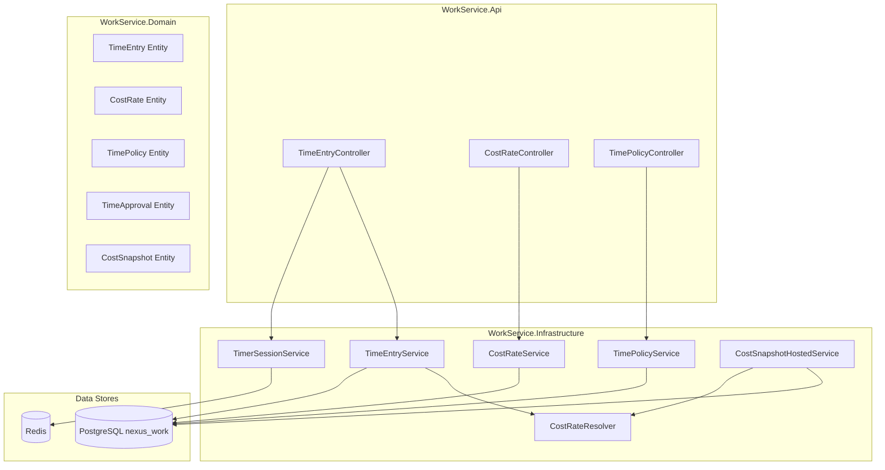
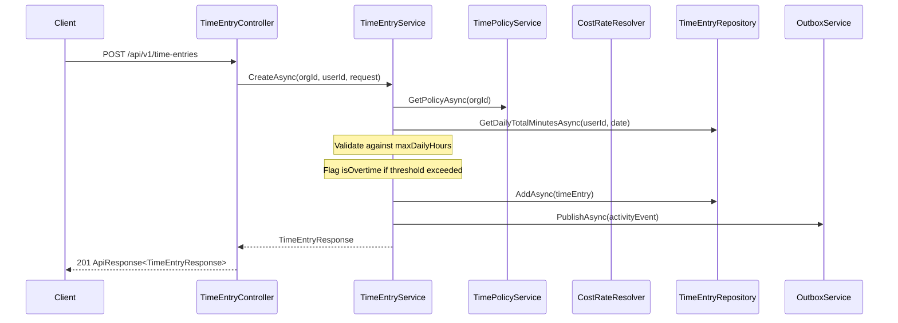
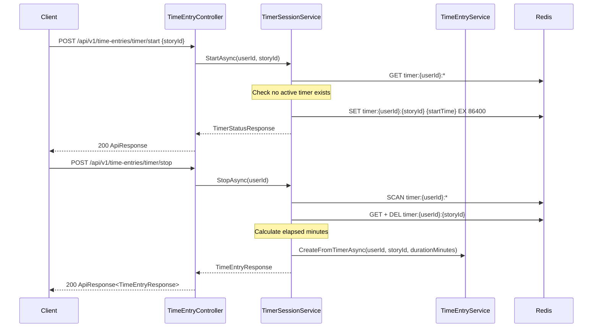
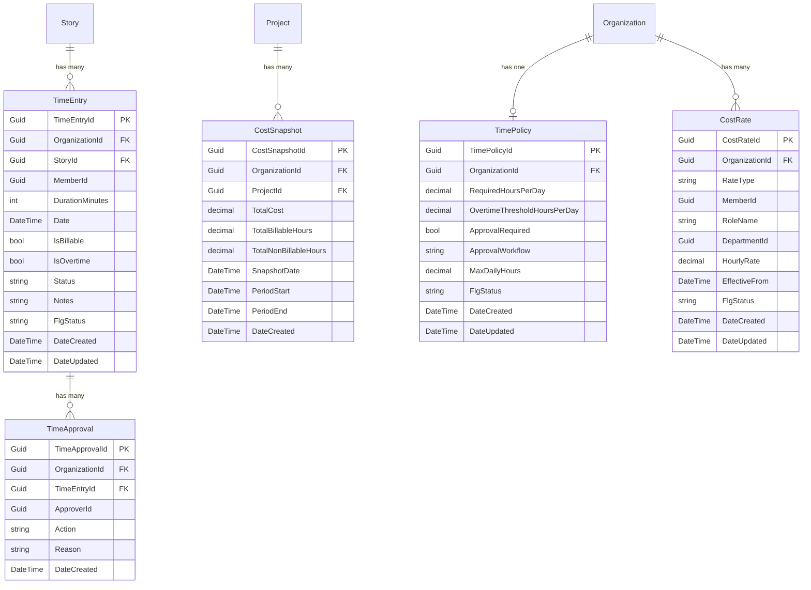
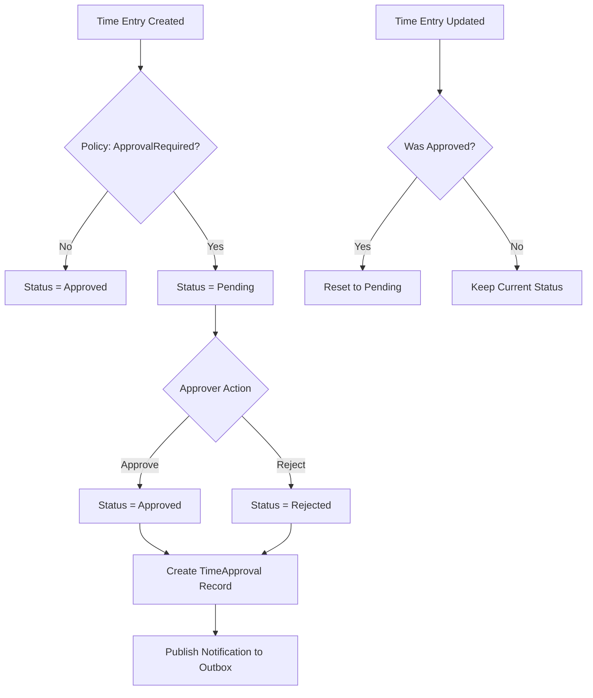

# Design Document — Time Tracking & Cost Data

## Overview

This design adds time tracking, cost rate management, approval workflows, and cost analytics to the existing WorkService microservice. The feature introduces six new domain entities (`TimeEntry`, `CostRate`, `TimePolicy`, `TimeApproval`, `CostSnapshot`, and a Redis-backed `TimerSession`), three new API controllers, four new service interfaces, and a background hosted service for snapshot generation.

All new entities follow the established WorkService patterns: `IOrganizationEntity` for org-scoping, `FlgStatus` soft-delete, EF Core global query filters, `ApiResponse<T>` envelope, FluentValidation, and Redis outbox for cross-service events.

### Key Design Decisions

1. **Time entries link to stories, not tasks** — Stories are the primary cost-bearing unit. This keeps the cost model simple and aligns with sprint velocity enrichment.
2. **Cost rate resolution is a pure function** — Given a member ID, role, department, date, and the set of active rates, the resolver deterministically picks the most specific applicable rate. This is testable in isolation.
3. **Timer sessions live in Redis only** — No database persistence for in-progress timers. On stop, a `TimeEntry` is created in PostgreSQL. Redis TTL (24h) auto-expires abandoned timers.
4. **Approval is optional and configurable** — The `TimePolicy` entity controls whether approval is required and which workflow applies. When disabled, entries are auto-approved on creation.
5. **Cost snapshots are idempotent** — Re-running snapshot generation for the same period overwrites the existing snapshot, producing identical results.
6. **Error codes start at 4050** — The existing `ErrorCodes.cs` uses 4041–4046 for Project codes. The requirements doc specifies 4041–4047 for time tracking, but those conflict. We'll remap to avoid collision: `TIMER_ALREADY_ACTIVE` = 4050, `NO_ACTIVE_TIMER` = 4051, `TIME_ENTRY_NOT_FOUND` = 4052, `COST_RATE_DUPLICATE` = 4053, `INVALID_COST_RATE` = 4054, `INVALID_TIME_POLICY` = 4055, `DAILY_HOURS_EXCEEDED` = 4056.

## Architecture

### High-Level Component Diagram



### Request Flow — Manual Time Entry Creation



### Request Flow — Timer Start/Stop



## Components and Interfaces

### Domain Layer — New Interfaces

#### Repository Interfaces

```
Domain/Interfaces/Repositories/TimeEntries/ITimeEntryRepository.cs
Domain/Interfaces/Repositories/CostRates/ICostRateRepository.cs
Domain/Interfaces/Repositories/TimePolicies/ITimePolicyRepository.cs
Domain/Interfaces/Repositories/TimeApprovals/ITimeApprovalRepository.cs
Domain/Interfaces/Repositories/CostSnapshots/ICostSnapshotRepository.cs
```

#### Service Interfaces

```
Domain/Interfaces/Services/TimeEntries/ITimeEntryService.cs
Domain/Interfaces/Services/CostRates/ICostRateService.cs
Domain/Interfaces/Services/CostRates/ICostRateResolver.cs
Domain/Interfaces/Services/TimePolicies/ITimePolicyService.cs
Domain/Interfaces/Services/TimerSessions/ITimerSessionService.cs
Domain/Interfaces/Services/CostSnapshots/ICostSnapshotService.cs
```

### ITimeEntryRepository

```csharp
public interface ITimeEntryRepository
{
    Task<TimeEntry?> GetByIdAsync(Guid timeEntryId, CancellationToken ct = default);
    Task<TimeEntry> AddAsync(TimeEntry entry, CancellationToken ct = default);
    Task UpdateAsync(TimeEntry entry, CancellationToken ct = default);
    Task<(IEnumerable<TimeEntry> Items, int TotalCount)> ListAsync(
        Guid organizationId, Guid? storyId, Guid? projectId, Guid? sprintId,
        Guid? memberId, DateTime? dateFrom, DateTime? dateTo,
        bool? isBillable, string? status, int page, int pageSize,
        CancellationToken ct = default);
    Task<int> GetDailyTotalMinutesAsync(Guid memberId, DateTime date, CancellationToken ct = default);
    Task<IEnumerable<TimeEntry>> GetApprovedBillableByProjectAsync(
        Guid projectId, DateTime? dateFrom, DateTime? dateTo, CancellationToken ct = default);
    Task<IEnumerable<TimeEntry>> GetApprovedBySprintAsync(
        Guid sprintId, CancellationToken ct = default);
}
```

### ICostRateRepository

```csharp
public interface ICostRateRepository
{
    Task<CostRate?> GetByIdAsync(Guid costRateId, CancellationToken ct = default);
    Task<CostRate> AddAsync(CostRate rate, CancellationToken ct = default);
    Task UpdateAsync(CostRate rate, CancellationToken ct = default);
    Task<(IEnumerable<CostRate> Items, int TotalCount)> ListAsync(
        Guid organizationId, string? rateType, Guid? memberId,
        Guid? departmentId, string? roleName, int page, int pageSize,
        CancellationToken ct = default);
    Task<bool> ExistsDuplicateAsync(Guid organizationId, string rateType,
        Guid? memberId, string? roleName, Guid? departmentId,
        CancellationToken ct = default);
    Task<IEnumerable<CostRate>> GetActiveRatesForMemberAsync(
        Guid organizationId, Guid memberId, DateTime asOfDate,
        CancellationToken ct = default);
    Task<IEnumerable<CostRate>> GetActiveRatesForRoleDepartmentAsync(
        Guid organizationId, string roleName, Guid departmentId, DateTime asOfDate,
        CancellationToken ct = default);
    Task<CostRate?> GetOrgDefaultAsync(Guid organizationId, DateTime asOfDate,
        CancellationToken ct = default);
}
```

### ITimePolicyRepository

```csharp
public interface ITimePolicyRepository
{
    Task<TimePolicy?> GetByOrganizationAsync(Guid organizationId, CancellationToken ct = default);
    Task<TimePolicy> AddAsync(TimePolicy policy, CancellationToken ct = default);
    Task UpdateAsync(TimePolicy policy, CancellationToken ct = default);
}
```

### ITimeApprovalRepository

```csharp
public interface ITimeApprovalRepository
{
    Task<TimeApproval> AddAsync(TimeApproval approval, CancellationToken ct = default);
    Task<IEnumerable<TimeApproval>> GetByTimeEntryAsync(Guid timeEntryId, CancellationToken ct = default);
}
```

### ICostSnapshotRepository

```csharp
public interface ICostSnapshotRepository
{
    Task<CostSnapshot> AddOrUpdateAsync(CostSnapshot snapshot, CancellationToken ct = default);
    Task<(IEnumerable<CostSnapshot> Items, int TotalCount)> ListByProjectAsync(
        Guid projectId, DateTime? dateFrom, DateTime? dateTo,
        int page, int pageSize, CancellationToken ct = default);
}
```

### ICostRateResolver

The cost rate resolver is a pure function — no side effects, no database calls. It receives the candidate rates and returns the applicable one.

```csharp
public interface ICostRateResolver
{
    /// <summary>
    /// Resolves the applicable hourly rate for a time entry.
    /// Precedence: Member rate → Role+Department rate → Org default.
    /// Within each level, picks the most recent effectiveFrom <= entryDate.
    /// Returns 0 if no rate found.
    /// </summary>
    decimal Resolve(
        Guid memberId, string roleName, Guid departmentId, DateTime entryDate,
        IEnumerable<CostRate> memberRates,
        IEnumerable<CostRate> roleDeptRates,
        CostRate? orgDefault);
}
```

### ITimeEntryService

```csharp
public interface ITimeEntryService
{
    Task<object> CreateAsync(Guid orgId, Guid userId, object request, CancellationToken ct = default);
    Task<object> UpdateAsync(Guid timeEntryId, Guid userId, object request, CancellationToken ct = default);
    Task DeleteAsync(Guid timeEntryId, Guid userId, CancellationToken ct = default);
    Task<object> ListAsync(Guid orgId, Guid? storyId, Guid? projectId, Guid? sprintId,
        Guid? memberId, DateTime? dateFrom, DateTime? dateTo, bool? isBillable,
        string? status, int page, int pageSize, CancellationToken ct = default);
    Task<object> ApproveAsync(Guid timeEntryId, Guid approverId, string approverRole,
        Guid approverDeptId, CancellationToken ct = default);
    Task<object> RejectAsync(Guid timeEntryId, Guid approverId, string approverRole,
        Guid approverDeptId, string reason, CancellationToken ct = default);
    Task<object> GetProjectCostSummaryAsync(Guid projectId, DateTime? dateFrom,
        DateTime? dateTo, CancellationToken ct = default);
    Task<object> GetProjectUtilizationAsync(Guid projectId, DateTime? dateFrom,
        DateTime? dateTo, CancellationToken ct = default);
    Task<object> GetSprintVelocityAsync(Guid sprintId, CancellationToken ct = default);
}
```

### ITimerSessionService

```csharp
public interface ITimerSessionService
{
    Task<object> StartAsync(Guid userId, Guid storyId, Guid orgId, CancellationToken ct = default);
    Task<object> StopAsync(Guid userId, Guid orgId, CancellationToken ct = default);
    Task<object?> GetStatusAsync(Guid userId, CancellationToken ct = default);
}
```

### API Controllers

#### TimeEntryController — `api/v1/time-entries`

| Method | Path | Auth | Attribute | Description |
|--------|------|------|-----------|-------------|
| POST | `/` | Bearer | — | Create manual time entry |
| GET | `/` | Bearer | — | List/filter time entries |
| PUT | `/{timeEntryId}` | Bearer | — | Update own time entry |
| DELETE | `/{timeEntryId}` | Bearer | — | Soft-delete own time entry |
| POST | `/{timeEntryId}/approve` | Bearer | DeptLead | Approve time entry |
| POST | `/{timeEntryId}/reject` | Bearer | DeptLead | Reject time entry |
| POST | `/timer/start` | Bearer | — | Start timer |
| POST | `/timer/stop` | Bearer | — | Stop timer |
| GET | `/timer/status` | Bearer | — | Get active timer status |

#### CostRateController — `api/v1/cost-rates`

| Method | Path | Auth | Attribute | Description |
|--------|------|------|-----------|-------------|
| POST | `/` | Bearer | OrgAdmin | Create cost rate |
| GET | `/` | Bearer | — | List cost rates |
| PUT | `/{costRateId}` | Bearer | OrgAdmin | Update cost rate |
| DELETE | `/{costRateId}` | Bearer | OrgAdmin | Soft-delete cost rate |

#### TimePolicyController — `api/v1/time-policies`

| Method | Path | Auth | Attribute | Description |
|--------|------|------|-----------|-------------|
| GET | `/` | Bearer | — | Get org time policy |
| PUT | `/` | Bearer | OrgAdmin | Create/update time policy |

#### Extended Endpoints on Existing Controllers

| Method | Path | Controller | Description |
|--------|------|------------|-------------|
| GET | `/api/v1/projects/{projectId}/cost-summary` | ProjectController | Project cost summary |
| GET | `/api/v1/projects/{projectId}/utilization` | ProjectController | Resource utilization |
| GET | `/api/v1/projects/{projectId}/cost-snapshots` | ProjectController | Historical snapshots |
| GET | `/api/v1/sprints/{sprintId}/velocity` | SprintController | Enriched velocity |

## Data Models

### Entity Relationship Diagram



### TimeEntry Entity

```csharp
public class TimeEntry : IOrganizationEntity
{
    public Guid TimeEntryId { get; set; } = Guid.NewGuid();
    public Guid OrganizationId { get; set; }
    public Guid StoryId { get; set; }
    public Guid MemberId { get; set; }
    public int DurationMinutes { get; set; }
    public DateTime Date { get; set; }
    public bool IsBillable { get; set; } = true;
    public bool IsOvertime { get; set; } = false;
    public string Status { get; set; } = "Pending"; // Pending, Approved, Rejected
    public string? Notes { get; set; }
    public string FlgStatus { get; set; } = "A";
    public DateTime DateCreated { get; set; } = DateTime.UtcNow;
    public DateTime DateUpdated { get; set; } = DateTime.UtcNow;
}
```

### CostRate Entity

```csharp
public class CostRate : IOrganizationEntity
{
    public Guid CostRateId { get; set; } = Guid.NewGuid();
    public Guid OrganizationId { get; set; }
    public string RateType { get; set; } = string.Empty; // Member, RoleDepartment, OrgDefault
    public Guid? MemberId { get; set; }          // Set when RateType = Member
    public string? RoleName { get; set; }         // Set when RateType = RoleDepartment
    public Guid? DepartmentId { get; set; }       // Set when RateType = RoleDepartment
    public decimal HourlyRate { get; set; }
    public DateTime EffectiveFrom { get; set; } = DateTime.UtcNow;
    public string FlgStatus { get; set; } = "A";
    public DateTime DateCreated { get; set; } = DateTime.UtcNow;
    public DateTime DateUpdated { get; set; } = DateTime.UtcNow;
}
```

### TimePolicy Entity

```csharp
public class TimePolicy : IOrganizationEntity
{
    public Guid TimePolicyId { get; set; } = Guid.NewGuid();
    public Guid OrganizationId { get; set; }
    public decimal RequiredHoursPerDay { get; set; } = 8m;
    public decimal OvertimeThresholdHoursPerDay { get; set; } = 10m;
    public bool ApprovalRequired { get; set; } = false;
    public string ApprovalWorkflow { get; set; } = "None"; // None, DeptLeadApproval, ProjectLeadApproval
    public decimal MaxDailyHours { get; set; } = 24m;
    public string FlgStatus { get; set; } = "A";
    public DateTime DateCreated { get; set; } = DateTime.UtcNow;
    public DateTime DateUpdated { get; set; } = DateTime.UtcNow;
}
```

### TimeApproval Entity

```csharp
public class TimeApproval : IOrganizationEntity
{
    public Guid TimeApprovalId { get; set; } = Guid.NewGuid();
    public Guid OrganizationId { get; set; }
    public Guid TimeEntryId { get; set; }
    public Guid ApproverId { get; set; }
    public string Action { get; set; } = string.Empty; // Approved, Rejected
    public string? Reason { get; set; }
    public DateTime DateCreated { get; set; } = DateTime.UtcNow;
}
```

### CostSnapshot Entity

```csharp
public class CostSnapshot : IOrganizationEntity
{
    public Guid CostSnapshotId { get; set; } = Guid.NewGuid();
    public Guid OrganizationId { get; set; }
    public Guid ProjectId { get; set; }
    public decimal TotalCost { get; set; }
    public decimal TotalBillableHours { get; set; }
    public decimal TotalNonBillableHours { get; set; }
    public DateTime SnapshotDate { get; set; } = DateTime.UtcNow;
    public DateTime PeriodStart { get; set; }
    public DateTime PeriodEnd { get; set; }
    public DateTime DateCreated { get; set; } = DateTime.UtcNow;
}
```

### Timer Session (Redis — No Entity)

Stored in Redis, not in PostgreSQL. Key pattern: `timer:{userId}:{storyId}`

```json
{
  "storyId": "guid",
  "startTime": "2025-01-15T10:30:00Z",
  "organizationId": "guid"
}
```

TTL: 86400 seconds (24 hours). Auto-expires abandoned timers.

### EF Core Configuration (WorkDbContext additions)

New `DbSet` properties and `OnModelCreating` configuration methods:

```csharp
// New DbSet properties
public DbSet<TimeEntry> TimeEntries => Set<TimeEntry>();
public DbSet<CostRate> CostRates => Set<CostRate>();
public DbSet<TimePolicy> TimePolicies => Set<TimePolicy>();
public DbSet<TimeApproval> TimeApprovals => Set<TimeApproval>();
public DbSet<CostSnapshot> CostSnapshots => Set<CostSnapshot>();
```

Key indexes:
- `TimeEntry`: Composite on `(OrganizationId, StoryId)`, `(OrganizationId, MemberId, Date)`, `(OrganizationId, Status)`
- `CostRate`: Unique on `(OrganizationId, RateType, MemberId, RoleName, DepartmentId)` with filter `FlgStatus = 'A'`
- `TimePolicy`: Unique on `OrganizationId` with filter `FlgStatus = 'A'`
- `CostSnapshot`: Composite on `(ProjectId, PeriodStart, PeriodEnd)`, unique to enable upsert
- `TimeApproval`: Index on `TimeEntryId`

All org-scoped entities get the standard query filter: `e.OrganizationId == _organizationId && e.FlgStatus == "A"`.

### New Error Codes (added to ErrorCodes.cs)

```csharp
// Time Tracking (4050–4056)
public const string TimerAlreadyActive = "TIMER_ALREADY_ACTIVE";
public const int TimerAlreadyActiveValue = 4050;
public const string NoActiveTimer = "NO_ACTIVE_TIMER";
public const int NoActiveTimerValue = 4051;
public const string TimeEntryNotFound = "TIME_ENTRY_NOT_FOUND";
public const int TimeEntryNotFoundValue = 4052;
public const string CostRateDuplicate = "COST_RATE_DUPLICATE";
public const int CostRateDuplicateValue = 4053;
public const string InvalidCostRate = "INVALID_COST_RATE";
public const int InvalidCostRateValue = 4054;
public const string InvalidTimePolicy = "INVALID_TIME_POLICY";
public const int InvalidTimePolicyValue = 4055;
public const string DailyHoursExceeded = "DAILY_HOURS_EXCEEDED";
public const int DailyHoursExceededValue = 4056;
```

### Redis Key Patterns (new)

| Pattern | Purpose | TTL |
|---------|---------|-----|
| `timer:{userId}:{storyId}` | Active timer session | 24 hours |
| `outbox:work` | Existing outbox queue (reused) | Until processed |

### Cost Rate Resolution Algorithm

The resolver is a pure function with this precedence:

```
1. Find all CostRate where RateType = "Member" AND MemberId = entry.MemberId
   → Pick the one with the latest EffectiveFrom <= entry.Date
   → If found, return its HourlyRate

2. Find all CostRate where RateType = "RoleDepartment" AND RoleName = member.RoleName AND DepartmentId = member.DepartmentId
   → Pick the one with the latest EffectiveFrom <= entry.Date
   → If found, return its HourlyRate

3. Find CostRate where RateType = "OrgDefault"
   → Pick the one with the latest EffectiveFrom <= entry.Date
   → If found, return its HourlyRate

4. Return 0 (no rate found — log warning)
```

This is deterministic: same inputs always produce the same rate. The resolver receives pre-fetched rate collections, making it side-effect-free and easily testable.

### Approval Workflow Logic



Approval role check:
- `DeptLeadApproval`: Approver must be DeptLead or OrgAdmin in the time entry owner's department
- `ProjectLeadApproval`: Approver must be the project lead (from `Project.LeadId`) or OrgAdmin

### Cost Snapshot Generation (Background Service)

`CostSnapshotHostedService` runs as an `IHostedService` using a periodic timer (configurable interval, default: every 6 hours).

On each tick:
1. Query all active projects for the organization
2. For each project, compute cost summary using the same logic as the real-time endpoint
3. Upsert a `CostSnapshot` record keyed by `(ProjectId, PeriodStart, PeriodEnd)`
4. Idempotent: running twice for the same period produces identical results

### Application Layer — DTOs

#### Time Entry DTOs

```
Application/DTOs/TimeEntries/CreateTimeEntryRequest.cs
Application/DTOs/TimeEntries/UpdateTimeEntryRequest.cs
Application/DTOs/TimeEntries/TimeEntryResponse.cs
Application/DTOs/TimeEntries/TimerStartRequest.cs
Application/DTOs/TimeEntries/TimerStatusResponse.cs
Application/DTOs/TimeEntries/RejectTimeEntryRequest.cs
Application/DTOs/TimeEntries/ProjectCostSummaryResponse.cs
Application/DTOs/TimeEntries/MemberCostDetail.cs
Application/DTOs/TimeEntries/DepartmentCostDetail.cs
Application/DTOs/TimeEntries/ResourceUtilizationResponse.cs
Application/DTOs/TimeEntries/MemberUtilizationDetail.cs
Application/DTOs/TimeEntries/SprintVelocityResponse.cs
```

#### Cost Rate DTOs

```
Application/DTOs/CostRates/CreateCostRateRequest.cs
Application/DTOs/CostRates/UpdateCostRateRequest.cs
Application/DTOs/CostRates/CostRateResponse.cs
```

#### Time Policy DTOs

```
Application/DTOs/TimePolicies/UpdateTimePolicyRequest.cs
Application/DTOs/TimePolicies/TimePolicyResponse.cs
```

#### Cost Snapshot DTOs

```
Application/DTOs/CostSnapshots/CostSnapshotResponse.cs
```

### FluentValidation Validators

```
Application/Validators/CreateTimeEntryRequestValidator.cs
Application/Validators/UpdateTimeEntryRequestValidator.cs
Application/Validators/TimerStartRequestValidator.cs
Application/Validators/RejectTimeEntryRequestValidator.cs
Application/Validators/CreateCostRateRequestValidator.cs
Application/Validators/UpdateCostRateRequestValidator.cs
Application/Validators/UpdateTimePolicyRequestValidator.cs
```

Key validation rules:
- `CreateTimeEntryRequest`: `DurationMinutes > 0`, `StoryId` required, `Date` not in future
- `CreateCostRateRequest`: `HourlyRate > 0`, `RateType` in `[Member, RoleDepartment, OrgDefault]`, conditional `MemberId`/`RoleName`+`DepartmentId` based on type
- `UpdateTimePolicyRequest`: `RequiredHoursPerDay` in `(0, 24]`, `MaxDailyHours >= RequiredHoursPerDay`

### Infrastructure Layer — File Layout

```
Infrastructure/Repositories/TimeEntries/TimeEntryRepository.cs
Infrastructure/Repositories/CostRates/CostRateRepository.cs
Infrastructure/Repositories/TimePolicies/TimePolicyRepository.cs
Infrastructure/Repositories/TimeApprovals/TimeApprovalRepository.cs
Infrastructure/Repositories/CostSnapshots/CostSnapshotRepository.cs
Infrastructure/Services/TimeEntries/TimeEntryService.cs
Infrastructure/Services/CostRates/CostRateService.cs
Infrastructure/Services/CostRates/CostRateResolver.cs
Infrastructure/Services/TimePolicies/TimePolicyService.cs
Infrastructure/Services/TimerSessions/TimerSessionService.cs
Infrastructure/Services/CostSnapshots/CostSnapshotHostedService.cs
```

### DI Registration (additions to DependencyInjection.cs)

```csharp
// Repositories
services.AddScoped<ITimeEntryRepository, TimeEntryRepository>();
services.AddScoped<ICostRateRepository, CostRateRepository>();
services.AddScoped<ITimePolicyRepository, TimePolicyRepository>();
services.AddScoped<ITimeApprovalRepository, TimeApprovalRepository>();
services.AddScoped<ICostSnapshotRepository, CostSnapshotRepository>();

// Services
services.AddScoped<ITimeEntryService, TimeEntryService>();
services.AddScoped<ICostRateService, CostRateService>();
services.AddScoped<ICostRateResolver, CostRateResolver>();
services.AddScoped<ITimePolicyService, TimePolicyService>();
services.AddScoped<ITimerSessionService, TimerSessionService>();
services.AddScoped<ICostSnapshotService, CostSnapshotHostedService>();

// Background service
services.AddHostedService<CostSnapshotHostedService>();
```

### Frontend Components (React/TypeScript)

#### Zustand Stores

- `useTimeEntryStore` — CRUD for time entries, timer state, list/filter
- `useCostRateStore` — CRUD for cost rates (OrgAdmin only)
- `useTimePolicyStore` — Get/update time policy (OrgAdmin only)

#### Key Components

- `TimeEntryList` — Paginated table with filters (story, project, sprint, member, date range, billable, status)
- `TimeEntryForm` — Create/edit time entry modal
- `TimerWidget` — Persistent floating timer with start/stop/status
- `CostRateManager` — Admin panel for managing cost rates
- `TimePolicySettings` — Admin panel for time policy configuration
- `ProjectCostDashboard` — Cost summary with member/department breakdowns
- `ResourceUtilizationChart` — Bar chart of utilization percentages
- `SprintVelocityEnriched` — Velocity chart with hours overlay
- `TimeApprovalQueue` — List of pending time entries for approvers

## Correctness Properties

*A property is a characteristic or behavior that should hold true across all valid executions of a system — essentially, a formal statement about what the system should do. Properties serve as the bridge between human-readable specifications and machine-verifiable correctness guarantees.*

### Property 1: Time entry creation preserves all fields and applies defaults

*For any* valid `CreateTimeEntryRequest` with a positive `durationMinutes`, existing `storyId`, and a valid `date`, creating a time entry should produce a record where all submitted fields match the request, `isBillable` defaults to `true` when not specified, and the status is `Pending` when `ApprovalRequired` is `true` or `Approved` when `ApprovalRequired` is `false`.

**Validates: Requirements 1.1, 1.4, 13.1, 13.2**

### Property 2: Non-positive duration is always rejected

*For any* integer `durationMinutes` where `durationMinutes <= 0`, submitting a time entry creation request should be rejected with error code `HOURS_MUST_BE_POSITIVE`.

**Validates: Requirements 1.3**

### Property 3: Timer start/stop round trip produces a valid time entry

*For any* user and valid story, starting a timer and then stopping it should: (a) create a `TimeEntry` with `durationMinutes` equal to the elapsed time in minutes (rounded), (b) remove the `TimerSession` from Redis, and (c) the created entry should be retrievable via the list endpoint.

**Validates: Requirements 2.1, 2.2**

### Property 4: Only one active timer per member

*For any* user who already has an active timer session, attempting to start a second timer should be rejected with error code `TIMER_ALREADY_ACTIVE`, and the original timer session should remain unchanged.

**Validates: Requirements 2.3**

### Property 5: Timer status reflects current state

*For any* user, the timer status endpoint should return the active session details when a timer is running, and return no content when no timer is active. Starting a timer then querying status should return that timer's details.

**Validates: Requirements 2.4**

### Property 6: Time entry ownership enforcement

*For any* time entry owned by member A, when member B (where B ≠ A and B is not OrgAdmin) attempts to update or delete that entry, the operation should be rejected with `INSUFFICIENT_PERMISSIONS`. The original entry should remain unchanged.

**Validates: Requirements 3.2, 3.5**

### Property 7: Updating an approved entry resets status to Pending

*For any* time entry with status `Approved`, when the owning member updates any field, the status should be reset to `Pending`.

**Validates: Requirements 3.3**

### Property 8: Soft-delete sets FlgStatus to D

*For any* active time entry (FlgStatus = A), when the owning member deletes it, the `FlgStatus` should be set to `D` and the entry should no longer appear in list queries.

**Validates: Requirements 3.4**

### Property 9: List filtering returns only matching entries and is ordered by date descending

*For any* combination of filter parameters applied to a list of time entries, every returned entry must match all specified filters, results must be scoped to the requesting organization, and entries must be ordered by `date` descending.

**Validates: Requirements 4.1, 4.2, 4.4, 13.4**

### Property 10: Approval and rejection create audit records

*For any* pending time entry and a valid approver, approving should set status to `Approved` and create a `TimeApproval` record; rejecting should set status to `Rejected` and create a `TimeApproval` record with the provided reason. Re-approving or re-rejecting an already-decided entry should also succeed and create a new `TimeApproval` record.

**Validates: Requirements 5.1, 5.2, 5.6**

### Property 11: Approval authorization enforcement

*For any* time entry and any user attempting to approve/reject: when the policy is `DeptLeadApproval`, only users with DeptLead or OrgAdmin role in the entry owner's department should succeed; when the policy is `ProjectLeadApproval`, only the project lead or OrgAdmin should succeed. All other users should receive `INSUFFICIENT_PERMISSIONS`.

**Validates: Requirements 5.3, 5.4, 5.5**

### Property 12: Cost rate CRUD with OrgAdmin restriction

*For any* cost rate creation, update, or deletion request: when the caller is OrgAdmin, the operation should succeed; when the caller is not OrgAdmin, the operation should be rejected with `INSUFFICIENT_PERMISSIONS`. Soft-deleted rates should not appear in list queries.

**Validates: Requirements 6.1, 6.2, 6.3, 6.4, 6.5**

### Property 13: Duplicate cost rate rejection

*For any* cost rate with the same `(rateType, memberId, roleName, departmentId)` combination that already exists for the organization, creating a new rate with the same scope should be rejected with `COST_RATE_DUPLICATE`.

**Validates: Requirements 6.6**

### Property 14: Non-positive hourly rate is always rejected

*For any* decimal `hourlyRate` where `hourlyRate <= 0`, creating or updating a cost rate should be rejected with `INVALID_COST_RATE`.

**Validates: Requirements 6.7**

### Property 15: Cost rate resolution follows precedence hierarchy

*For any* time entry with a known `memberId`, `roleName`, `departmentId`, and `date`, and any set of cost rates: the resolver should return the member-specific rate if one exists with `effectiveFrom <= date`; otherwise the role+department rate; otherwise the org default rate. Within each level, the rate with the most recent `effectiveFrom` on or before the entry date is selected. The resolution is deterministic — calling it twice with the same inputs produces the same result.

**Validates: Requirements 7.1, 7.2, 7.4**

### Property 16: Time policy CRUD with validation

*For any* `UpdateTimePolicyRequest`, when `requiredHoursPerDay` is in `(0, 24]` and `maxDailyHours >= requiredHoursPerDay`, the upsert should succeed. When `requiredHoursPerDay <= 0` or `> 24`, or `maxDailyHours < requiredHoursPerDay`, the request should be rejected with `INVALID_TIME_POLICY`. Only OrgAdmin users should be able to update the policy.

**Validates: Requirements 8.1, 8.2, 8.4, 8.5, 8.6**

### Property 17: Project cost calculation is correct and order-independent

*For any* set of approved, billable time entries for a project, the total cost should equal the sum of `(durationMinutes / 60) × applicableRate` for each entry. The total should be the same regardless of the order in which entries are processed. The response should include `totalCost`, `totalBillableHours`, `totalNonBillableHours`, `costByMember`, and `costByDepartment`.

**Validates: Requirements 9.1, 9.2, 9.5, 13.3**

### Property 18: Project cost date filtering excludes out-of-range entries

*For any* date range `[dateFrom, dateTo]`, the project cost summary should only include time entries where `entry.date` falls within the range. Entries outside the range should not contribute to the totals.

**Validates: Requirements 9.3**

### Property 19: Utilization calculation is correct

*For any* project, date range, and set of team members with logged time, the utilization percentage for each member should equal `(totalLoggedHours / expectedHours) × 100`, where `expectedHours = requiredHoursPerDay × workingDaysInRange`. The response should include all required fields per member.

**Validates: Requirements 10.1, 10.2, 10.3**

### Property 20: Sprint velocity enrichment includes time data

*For any* sprint with completed stories, the velocity response should include `totalStoryPoints` (sum of completed story points), `totalLoggedHours` (sum of approved time entry hours), `averageHoursPerPoint` (totalLoggedHours / totalStoryPoints when points > 0, null when points = 0), and `completedStoryCount`.

**Validates: Requirements 11.1**

### Property 21: Cost snapshot idempotence

*For any* project and time period, generating a cost snapshot twice should produce identical `totalCost`, `totalBillableHours`, and `totalNonBillableHours` values. The snapshot totals should match the real-time cost calculation for the same period.

**Validates: Requirements 12.1, 12.4**

### Property 22: Daily hours policy enforcement

*For any* member and date, when creating a time entry that would cause the total daily minutes to exceed `maxDailyHours × 60`, the creation should be rejected with `DAILY_HOURS_EXCEEDED`. When the total exceeds `overtimeThresholdHoursPerDay × 60` but not `maxDailyHours × 60`, the entry should be created with `isOvertime = true`.

**Validates: Requirements 14.1, 14.2, 14.3**

### Property 23: Error responses use standard envelope

*For any* error returned by time tracking endpoints, the response should be wrapped in `ApiResponse<T>` with non-null `ErrorCode`, `ErrorValue`, and `CorrelationId` fields.

**Validates: Requirements 15.2**

## Error Handling

### Error Response Format

All errors follow the existing `ApiResponse<T>` envelope with `DomainException` hierarchy:

```csharp
{
  "success": false,
  "errorCode": "TIMER_ALREADY_ACTIVE",
  "errorValue": 4050,
  "message": "Member already has a running timer",
  "correlationId": "abc-123",
  "data": null
}
```

### New Domain Exceptions

| Exception Class | Error Code | HTTP | Trigger |
|----------------|------------|------|---------|
| `TimerAlreadyActiveException` | 4050 | 409 | Start timer when one exists |
| `NoActiveTimerException` | 4051 | 400 | Stop timer when none exists |
| `TimeEntryNotFoundException` | 4052 | 404 | Time entry ID not found |
| `CostRateDuplicateException` | 4053 | 409 | Duplicate rate scope |
| `InvalidCostRateException` | 4054 | 400 | Rate <= 0 |
| `InvalidTimePolicyException` | 4055 | 400 | Policy validation failure |
| `DailyHoursExceededException` | 4056 | 400 | Daily max exceeded |

All exceptions extend `DomainException` and are caught by the existing `GlobalExceptionHandlerMiddleware`.

### Transient Failure Handling

- Redis timer operations: If Redis is unavailable, timer start/stop returns 503 `SERVICE_UNAVAILABLE`. Time entry CRUD (PostgreSQL) is unaffected.
- Cost snapshot generation: On failure, the hosted service logs the error and retries on the next interval. No partial snapshots are persisted (transaction per project).
- Outbox publishing: Uses the existing Redis outbox pattern with dead-letter retry.

## Testing Strategy

### Dual Testing Approach

Both unit tests and property-based tests are required for comprehensive coverage.

**Unit tests** cover:
- Specific examples and edge cases (empty results, division by zero, missing rates)
- Integration points (Redis timer operations, EF Core queries, outbox publishing)
- Error conditions (invalid story ID, unauthorized access, duplicate rates)
- Controller response codes and envelope structure

**Property-based tests** cover:
- Universal properties across all valid inputs (rate resolution, cost calculation, policy enforcement)
- Comprehensive input coverage through randomization
- Each correctness property from the design document maps to exactly one property-based test

### Property-Based Testing Configuration

- Library: **FsCheck.Xunit** (mature .NET PBT library, integrates with xUnit)
- Minimum iterations: 100 per property test
- Each test tagged with: `Feature: time-tracking-cost, Property {number}: {property_text}`
- Generators: Custom `Arbitrary<T>` implementations for `TimeEntry`, `CostRate`, `TimePolicy`, and related DTOs

### Test Organization

```
WorkService.Tests/
├── Properties/
│   ├── CostRateResolverProperties.cs      (Properties 15)
│   ├── TimeEntryCreationProperties.cs     (Properties 1, 2)
│   ├── TimerRoundTripProperties.cs        (Properties 3, 4, 5)
│   ├── OwnershipProperties.cs             (Properties 6, 7, 8)
│   ├── ListFilterProperties.cs            (Property 9)
│   ├── ApprovalProperties.cs              (Properties 10, 11)
│   ├── CostRateCrudProperties.cs          (Properties 12, 13, 14)
│   ├── TimePolicyProperties.cs            (Property 16)
│   ├── ProjectCostProperties.cs           (Properties 17, 18)
│   ├── UtilizationProperties.cs           (Property 19)
│   ├── VelocityProperties.cs              (Property 20)
│   ├── SnapshotProperties.cs              (Property 21)
│   ├── DailyHoursProperties.cs            (Property 22)
│   └── ErrorEnvelopeProperties.cs         (Property 23)
├── Unit/
│   ├── TimeEntryServiceTests.cs
│   ├── CostRateServiceTests.cs
│   ├── TimePolicyServiceTests.cs
│   ├── TimerSessionServiceTests.cs
│   ├── CostSnapshotServiceTests.cs
│   └── TimeEntryControllerTests.cs
├── Generators/
│   ├── TimeEntryGenerators.cs
│   ├── CostRateGenerators.cs
│   └── TimePolicyGenerators.cs
└── Helpers/
    └── TestDbContextFactory.cs
```

### Key Property Test Examples

**Property 15 (Cost Rate Resolution)** — the most critical property test:
```
// Feature: time-tracking-cost, Property 15: Cost rate resolution follows precedence hierarchy
// For any set of rates at member, role+dept, and org levels,
// the resolver should always pick the most specific applicable rate.
[Property(MaxTest = 100)]
public Property ResolverPicksMostSpecificRate(...)
```

**Property 17 (Cost Calculation Confluence)**:
```
// Feature: time-tracking-cost, Property 17: Project cost calculation is correct and order-independent
// Shuffle the time entries and verify the total cost is identical.
[Property(MaxTest = 100)]
public Property CostIsOrderIndependent(...)
```

**Property 21 (Snapshot Idempotence)**:
```
// Feature: time-tracking-cost, Property 21: Cost snapshot idempotence
// Generate snapshot, then generate again — values must match.
[Property(MaxTest = 100)]
public Property SnapshotIsIdempotent(...)
```
