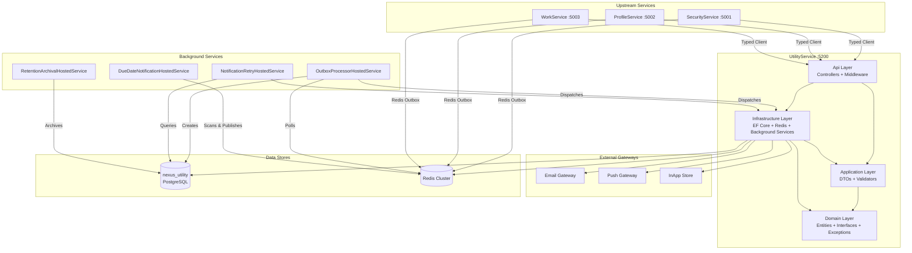
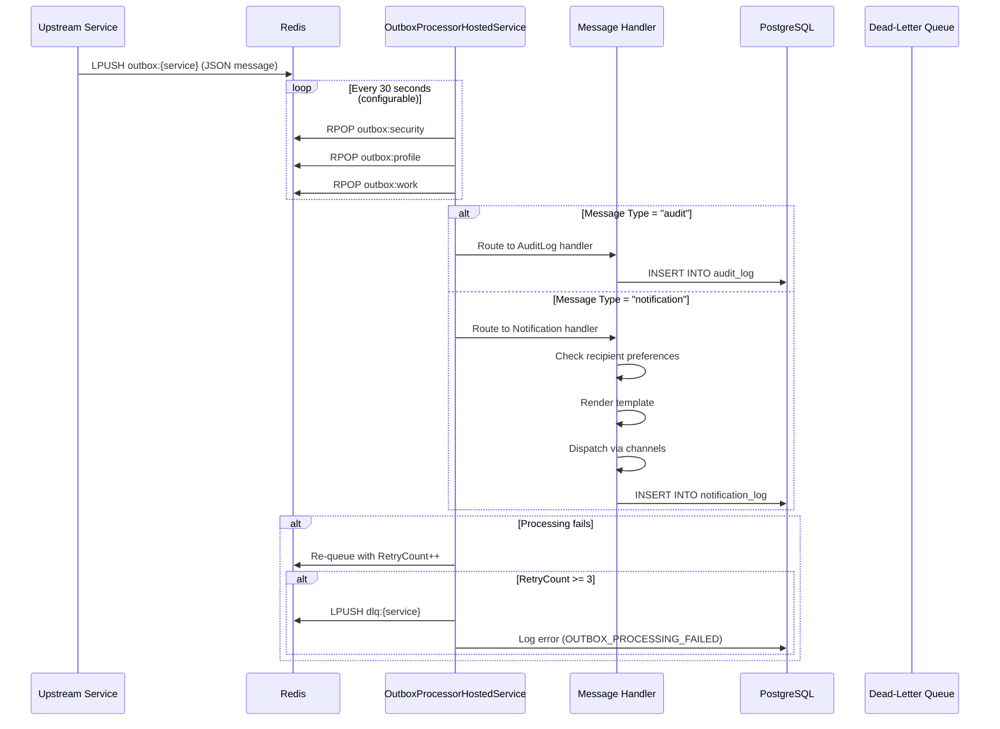
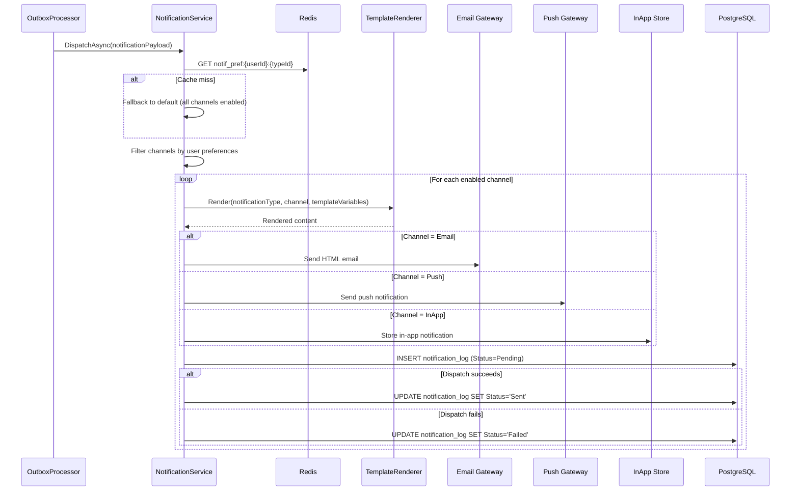
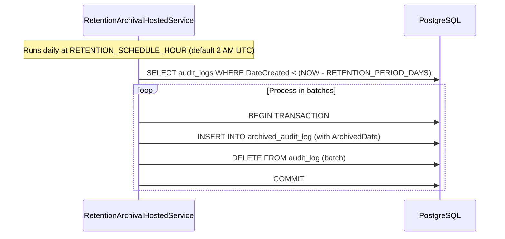
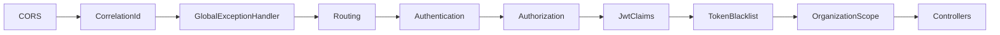
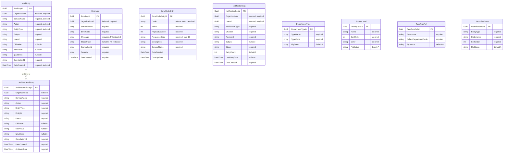

# Design Document — UtilityService

## Overview

UtilityService is the cross-cutting operational microservice for the Nexus-2.0 Enterprise Agile Platform. It runs on port 5200 with database `nexus_utility` and follows Clean Architecture (.NET 8) with Domain / Application / Infrastructure / Api layers.

UtilityService is an internal/service-to-service platform — it has no direct user-facing features. It provides operational capabilities consumed by all other services: immutable audit logging, error logging with PII redaction, notification dispatch (Email, Push, InApp), error code registry, reference data management, retention archival, and outbox processing.

UtilityService polls Redis outbox queues from SecurityService (`outbox:security`), ProfileService (`outbox:profile`), and WorkService (`outbox:work`) via `OutboxProcessorHostedService`, routing messages to audit log creation or notification dispatch handlers.

Key responsibilities:
- Immutable audit logging with organization-scoped queries and archival
- Error logging with automatic PII redaction (emails, names, IPs → `[REDACTED]`)
- Centralized error code registry with Redis caching (`error_codes_registry` hash, 24h TTL)
- Multi-channel notification dispatch (Email, Push, InApp) with 8 Agile-specific templates
- Reference data management (DepartmentType, PriorityLevel, TaskTypeRef, WorkflowState) with Redis caching (24h TTL)
- Background outbox processing from all upstream services with dead-letter queue handling
- Retention archival of audit logs (configurable period, default 90 days)
- Notification retry with exponential backoff (max 3 retries)
- Due date notification scanning (every 6 hours)
- Seed data for reference tables on first deployment

UtilityService is an internal service — its middleware pipeline does NOT include `FirstTimeUserMiddleware` or `RateLimiterMiddleware`.

References:
- `docs/nexus-2.0-backend-specification.md` — Sections 7.1–7.10, Section 8
- `docs/nexus-2.0-backend-requirements.md` — REQ-071 through REQ-085, REQ-086 through REQ-108
- `.kiro/specs/utility-service/requirements.md` — Requirements 1 through 31
- `.kiro/specs/security-service/design.md` — SecurityService design patterns
- `.kiro/specs/profile-service/design.md` — ProfileService design patterns
- `.kiro/specs/work-service/design.md` — WorkService design patterns

## Architecture

### High-Level Architecture



### Outbox Processing Flow



### Notification Dispatch Flow



### Retention Archival Flow



### Middleware Pipeline

UtilityService is an internal service — no `FirstTimeUserMiddleware` and no `RateLimiterMiddleware`.

```
CORS → CorrelationId → GlobalExceptionHandler → Routing →
Authentication → Authorization → JwtClaims → TokenBlacklist →
OrganizationScope → Controllers
```



## Components and Interfaces

### Monorepo Folder Structure

```
Nexus-2.0/
├── docs/
├── src/
│   ├── backend/
│   │   ├── SecurityService/
│   │   ├── ProfileService/
│   │   ├── WorkService/
│   │   ├── UtilityService/            # This service
│   │   │   ├── UtilityService.Domain/
│   │   │   ├── UtilityService.Application/
│   │   │   ├── UtilityService.Infrastructure/
│   │   │   ├── UtilityService.Api/
│   │   │   └── UtilityService.Tests/
│   └── frontend/
├── docker/
├── Nexus-2.0.sln
└── .kiro/
```

### Clean Architecture Layer Structure

All paths below are relative to `src/backend/UtilityService/`.

```
UtilityService.Domain/
├── Entities/
│   ├── AuditLog.cs
│   ├── ArchivedAuditLog.cs
│   ├── ErrorLog.cs
│   ├── ErrorCodeEntry.cs
│   ├── NotificationLog.cs
│   ├── DepartmentType.cs
│   ├── PriorityLevel.cs
│   ├── TaskTypeRef.cs
│   └── WorkflowState.cs
├── Exceptions/
│   ├── DomainException.cs
│   ├── ErrorCodes.cs
│   ├── AuditLogImmutableException.cs
│   ├── ErrorCodeDuplicateException.cs
│   ├── ErrorCodeNotFoundException.cs
│   ├── NotificationDispatchFailedException.cs
│   ├── ReferenceDataNotFoundException.cs
│   ├── OrganizationMismatchException.cs
│   ├── TemplateNotFoundException.cs
│   ├── NotFoundException.cs
│   ├── ConflictException.cs
│   ├── ServiceUnavailableException.cs
│   ├── InvalidNotificationTypeException.cs
│   ├── InvalidChannelException.cs
│   ├── RetentionPeriodInvalidException.cs
│   ├── ReferenceDataDuplicateException.cs
│   └── OutboxProcessingFailedException.cs
├── Interfaces/
│   ├── Repositories/
│   │   ├── IAuditLogRepository.cs
│   │   ├── IArchivedAuditLogRepository.cs
│   │   ├── IErrorLogRepository.cs
│   │   ├── IErrorCodeEntryRepository.cs
│   │   ├── INotificationLogRepository.cs
│   │   ├── IDepartmentTypeRepository.cs
│   │   ├── IPriorityLevelRepository.cs
│   │   ├── ITaskTypeRefRepository.cs
│   │   └── IWorkflowStateRepository.cs
│   └── Services/
│       ├── IAuditLogService.cs
│       ├── IErrorLogService.cs
│       ├── IErrorCodeService.cs
│       ├── INotificationService.cs
│       ├── INotificationDispatcher.cs
│       ├── IReferenceDataService.cs
│       ├── IPiiRedactionService.cs
│       ├── ITemplateRenderer.cs
│       └── IOutboxMessageRouter.cs
├── Helpers/
│   ├── NotificationTypes.cs
│   ├── NotificationChannels.cs
│   ├── NotificationStatuses.cs
│   ├── SeverityLevels.cs
│   └── EntityStatuses.cs
└── Common/
    └── IOrganizationEntity.cs

UtilityService.Application/
├── DTOs/
│   ├── ApiResponse.cs
│   ├── ErrorDetail.cs
│   ├── PaginatedResponse.cs
│   ├── OutboxMessage.cs
│   ├── AuditLogs/
│   │   ├── CreateAuditLogRequest.cs
│   │   ├── AuditLogResponse.cs
│   │   └── AuditLogFilterRequest.cs
│   ├── ErrorLogs/
│   │   ├── CreateErrorLogRequest.cs
│   │   ├── ErrorLogResponse.cs
│   │   └── ErrorLogFilterRequest.cs
│   ├── ErrorCodes/
│   │   ├── CreateErrorCodeRequest.cs
│   │   ├── UpdateErrorCodeRequest.cs
│   │   └── ErrorCodeResponse.cs
│   ├── Notifications/
│   │   ├── DispatchNotificationRequest.cs
│   │   ├── NotificationLogResponse.cs
│   │   └── NotificationLogFilterRequest.cs
│   └── ReferenceData/
│       ├── CreateDepartmentTypeRequest.cs
│       ├── CreatePriorityLevelRequest.cs
│       ├── DepartmentTypeResponse.cs
│       ├── PriorityLevelResponse.cs
│       ├── TaskTypeRefResponse.cs
│       └── WorkflowStateResponse.cs
├── Contracts/
│   └── ErrorCodeResolverResponse.cs
├── Validators/
│   ├── CreateAuditLogRequestValidator.cs
│   ├── CreateErrorLogRequestValidator.cs
│   ├── CreateErrorCodeRequestValidator.cs
│   ├── UpdateErrorCodeRequestValidator.cs
│   ├── DispatchNotificationRequestValidator.cs
│   ├── CreateDepartmentTypeRequestValidator.cs
│   └── CreatePriorityLevelRequestValidator.cs
└── UtilityService.Application.csproj

UtilityService.Infrastructure/
├── Data/
│   ├── UtilityDbContext.cs
│   └── Migrations/
├── Repositories/
│   ├── AuditLogRepository.cs
│   ├── ArchivedAuditLogRepository.cs
│   ├── ErrorLogRepository.cs
│   ├── ErrorCodeEntryRepository.cs
│   ├── NotificationLogRepository.cs
│   ├── DepartmentTypeRepository.cs
│   ├── PriorityLevelRepository.cs
│   ├── TaskTypeRefRepository.cs
│   └── WorkflowStateRepository.cs
├── Services/
│   ├── AuditLogs/
│   │   └── AuditLogService.cs
│   ├── ErrorLogs/
│   │   └── ErrorLogService.cs
│   ├── ErrorCodes/
│   │   └── ErrorCodeService.cs
│   ├── Notifications/
│   │   ├── NotificationService.cs
│   │   ├── NotificationDispatcher.cs
│   │   └── TemplateRenderer.cs
│   ├── ReferenceData/
│   │   └── ReferenceDataService.cs
│   ├── PiiRedaction/
│   │   └── PiiRedactionService.cs
│   ├── Outbox/
│   │   └── OutboxMessageRouter.cs
│   ├── ErrorCodeResolver/
│   │   └── ErrorCodeResolverService.cs
│   └── BackgroundServices/
│       ├── OutboxProcessorHostedService.cs
│       ├── RetentionArchivalHostedService.cs
│       ├── NotificationRetryHostedService.cs
│       └── DueDateNotificationHostedService.cs
├── Templates/
│   ├── Email/
│   │   ├── story-assigned.html
│   │   ├── task-assigned.html
│   │   ├── sprint-started.html
│   │   ├── sprint-ended.html
│   │   ├── mentioned-in-comment.html
│   │   ├── story-status-changed.html
│   │   ├── task-status-changed.html
│   │   └── due-date-approaching.html
│   └── Push/
│       ├── story-assigned.txt
│       ├── task-assigned.txt
│       ├── sprint-started.txt
│       ├── sprint-ended.txt
│       ├── mentioned-in-comment.txt
│       ├── story-status-changed.txt
│       ├── task-status-changed.txt
│       └── due-date-approaching.txt
├── Configuration/
│   ├── AppSettings.cs
│   ├── DatabaseMigrationHelper.cs
│   ├── SeedDataHelper.cs
│   └── DependencyInjection.cs
└── UtilityService.Infrastructure.csproj

UtilityService.Api/
├── Controllers/
│   ├── AuditLogController.cs
│   ├── ErrorLogController.cs
│   ├── ErrorCodeController.cs
│   ├── NotificationController.cs
│   └── ReferenceDataController.cs
├── Middleware/
│   ├── CorrelationIdMiddleware.cs
│   ├── GlobalExceptionHandlerMiddleware.cs
│   ├── JwtClaimsMiddleware.cs
│   ├── TokenBlacklistMiddleware.cs
│   ├── OrganizationScopeMiddleware.cs
│   └── CorrelationIdDelegatingHandler.cs
├── Attributes/
│   ├── OrgAdminAttribute.cs
│   └── ServiceAuthAttribute.cs
├── Extensions/
│   ├── MiddlewarePipelineExtensions.cs
│   ├── ControllerServiceExtensions.cs
│   ├── SwaggerServiceExtensions.cs
│   └── HealthCheckExtensions.cs
├── Program.cs
├── Dockerfile
├── .env
├── .env.example
└── UtilityService.Api.csproj
```

### Domain Layer Interfaces

#### IAuditLogService

```csharp
public interface IAuditLogService
{
    Task<AuditLogResponse> CreateAsync(CreateAuditLogRequest request, CancellationToken ct = default);
    Task<PaginatedResponse<AuditLogResponse>> QueryAsync(Guid organizationId, AuditLogFilterRequest filter, int page, int pageSize, CancellationToken ct = default);
    Task<PaginatedResponse<AuditLogResponse>> QueryArchiveAsync(Guid organizationId, AuditLogFilterRequest filter, int page, int pageSize, CancellationToken ct = default);
}
```

#### IErrorLogService

```csharp
public interface IErrorLogService
{
    Task<ErrorLogResponse> CreateAsync(CreateErrorLogRequest request, CancellationToken ct = default);
    Task<PaginatedResponse<ErrorLogResponse>> QueryAsync(Guid organizationId, ErrorLogFilterRequest filter, int page, int pageSize, CancellationToken ct = default);
}
```

#### IErrorCodeService

```csharp
public interface IErrorCodeService
{
    Task<ErrorCodeResponse> CreateAsync(CreateErrorCodeRequest request, CancellationToken ct = default);
    Task<IEnumerable<ErrorCodeResponse>> ListAsync(CancellationToken ct = default);
    Task<ErrorCodeResponse> UpdateAsync(string code, UpdateErrorCodeRequest request, CancellationToken ct = default);
    Task DeleteAsync(string code, CancellationToken ct = default);
}
```

#### INotificationService

```csharp
public interface INotificationService
{
    Task DispatchAsync(DispatchNotificationRequest request, CancellationToken ct = default);
    Task<PaginatedResponse<NotificationLogResponse>> GetUserHistoryAsync(Guid userId, Guid organizationId, NotificationLogFilterRequest filter, int page, int pageSize, CancellationToken ct = default);
    Task RetryFailedAsync(CancellationToken ct = default);
}
```

#### INotificationDispatcher

```csharp
public interface INotificationDispatcher
{
    Task<bool> SendEmailAsync(string recipient, string subject, string htmlBody, CancellationToken ct = default);
    Task<bool> SendPushAsync(string deviceToken, string title, string body, CancellationToken ct = default);
    Task<bool> SendInAppAsync(Guid userId, string title, string body, CancellationToken ct = default);
}
```

#### IReferenceDataService

```csharp
public interface IReferenceDataService
{
    Task<IEnumerable<DepartmentTypeResponse>> GetDepartmentTypesAsync(CancellationToken ct = default);
    Task<IEnumerable<PriorityLevelResponse>> GetPriorityLevelsAsync(CancellationToken ct = default);
    Task<IEnumerable<TaskTypeRefResponse>> GetTaskTypesAsync(CancellationToken ct = default);
    Task<IEnumerable<WorkflowStateResponse>> GetWorkflowStatesAsync(CancellationToken ct = default);
    Task<DepartmentTypeResponse> CreateDepartmentTypeAsync(CreateDepartmentTypeRequest request, CancellationToken ct = default);
    Task<PriorityLevelResponse> CreatePriorityLevelAsync(CreatePriorityLevelRequest request, CancellationToken ct = default);
}
```

#### IPiiRedactionService

```csharp
public interface IPiiRedactionService
{
    string Redact(string input);
}
```

#### ITemplateRenderer

```csharp
public interface ITemplateRenderer
{
    string Render(string notificationType, string channel, Dictionary<string, string> templateVariables);
}
```

#### IOutboxMessageRouter

```csharp
public interface IOutboxMessageRouter
{
    Task RouteAsync(string rawMessage, string sourceQueue, CancellationToken ct = default);
}
```

#### IErrorCodeResolverService

```csharp
public interface IErrorCodeResolverService
{
    Task<(string ResponseCode, string ResponseDescription)> ResolveAsync(string errorCode, CancellationToken ct = default);
}
```

### Repository Interfaces

```csharp
public interface IAuditLogRepository
{
    Task<AuditLog> AddAsync(AuditLog auditLog, CancellationToken ct = default);
    Task<(IEnumerable<AuditLog> Items, int TotalCount)> QueryAsync(Guid organizationId, string? serviceName, string? action, string? entityType, string? userId, DateTime? dateFrom, DateTime? dateTo, int page, int pageSize, CancellationToken ct = default);
}

public interface IArchivedAuditLogRepository
{
    Task AddRangeAsync(IEnumerable<ArchivedAuditLog> logs, CancellationToken ct = default);
    Task<(IEnumerable<ArchivedAuditLog> Items, int TotalCount)> QueryAsync(Guid organizationId, string? serviceName, string? action, string? entityType, string? userId, DateTime? dateFrom, DateTime? dateTo, int page, int pageSize, CancellationToken ct = default);
}

public interface IErrorLogRepository
{
    Task<ErrorLog> AddAsync(ErrorLog errorLog, CancellationToken ct = default);
    Task<(IEnumerable<ErrorLog> Items, int TotalCount)> QueryAsync(Guid organizationId, string? serviceName, string? errorCode, string? severity, DateTime? dateFrom, DateTime? dateTo, int page, int pageSize, CancellationToken ct = default);
}

public interface IErrorCodeEntryRepository
{
    Task<ErrorCodeEntry?> GetByCodeAsync(string code, CancellationToken ct = default);
    Task<ErrorCodeEntry> AddAsync(ErrorCodeEntry entry, CancellationToken ct = default);
    Task UpdateAsync(ErrorCodeEntry entry, CancellationToken ct = default);
    Task RemoveAsync(ErrorCodeEntry entry, CancellationToken ct = default);
    Task<IEnumerable<ErrorCodeEntry>> ListAsync(CancellationToken ct = default);
}

public interface INotificationLogRepository
{
    Task<NotificationLog> AddAsync(NotificationLog log, CancellationToken ct = default);
    Task UpdateAsync(NotificationLog log, CancellationToken ct = default);
    Task<(IEnumerable<NotificationLog> Items, int TotalCount)> QueryByUserAsync(Guid userId, Guid organizationId, string? notificationType, string? channel, string? status, DateTime? dateFrom, DateTime? dateTo, int page, int pageSize, CancellationToken ct = default);
    Task<IEnumerable<NotificationLog>> GetFailedForRetryAsync(int maxRetryCount, CancellationToken ct = default);
}

public interface IDepartmentTypeRepository
{
    Task<DepartmentType?> GetByNameAsync(string typeName, CancellationToken ct = default);
    Task<DepartmentType?> GetByCodeAsync(string typeCode, CancellationToken ct = default);
    Task<DepartmentType> AddAsync(DepartmentType departmentType, CancellationToken ct = default);
    Task<IEnumerable<DepartmentType>> ListAsync(CancellationToken ct = default);
    Task AddRangeAsync(IEnumerable<DepartmentType> types, CancellationToken ct = default);
    Task<bool> ExistsAsync(string typeName, CancellationToken ct = default);
}

public interface IPriorityLevelRepository
{
    Task<PriorityLevel?> GetByNameAsync(string name, CancellationToken ct = default);
    Task<PriorityLevel> AddAsync(PriorityLevel priorityLevel, CancellationToken ct = default);
    Task<IEnumerable<PriorityLevel>> ListAsync(CancellationToken ct = default);
    Task AddRangeAsync(IEnumerable<PriorityLevel> levels, CancellationToken ct = default);
    Task<bool> ExistsAsync(string name, CancellationToken ct = default);
}

public interface ITaskTypeRefRepository
{
    Task<IEnumerable<TaskTypeRef>> ListAsync(CancellationToken ct = default);
    Task AddRangeAsync(IEnumerable<TaskTypeRef> types, CancellationToken ct = default);
    Task<bool> ExistsAsync(string typeName, CancellationToken ct = default);
}

public interface IWorkflowStateRepository
{
    Task<IEnumerable<WorkflowState>> ListAsync(CancellationToken ct = default);
    Task AddRangeAsync(IEnumerable<WorkflowState> states, CancellationToken ct = default);
    Task<bool> ExistsAsync(string entityType, string stateName, CancellationToken ct = default);
}
```

### Controller Definitions

#### AuditLogController

```csharp
[ApiController]
[Route("api/v1/audit-logs")]
public class AuditLogController : ControllerBase
{
    [HttpPost]                              // Service auth — CreateAuditLogRequest → 201 AuditLogResponse
    [HttpGet]                               // Bearer auth — Paginated, filtered audit logs (org-scoped)
    [HttpGet("archive")]                    // Bearer auth — Paginated, filtered archived audit logs (org-scoped)
    // No PUT or DELETE — returns 405 AUDIT_LOG_IMMUTABLE
}
```

#### ErrorLogController

```csharp
[ApiController]
[Route("api/v1/error-logs")]
public class ErrorLogController : ControllerBase
{
    [HttpPost]                              // Service auth — CreateErrorLogRequest → 201 ErrorLogResponse
    [HttpGet]                               // OrgAdmin — Paginated, filtered error logs (org-scoped)
}
```

#### ErrorCodeController

```csharp
[ApiController]
[Route("api/v1/error-codes")]
public class ErrorCodeController : ControllerBase
{
    [HttpPost]                              // OrgAdmin — CreateErrorCodeRequest → 201 ErrorCodeResponse
    [HttpGet]                               // Bearer auth — List all error codes
    [HttpPut("{code}")]                     // OrgAdmin — UpdateErrorCodeRequest → ErrorCodeResponse
    [HttpDelete("{code}")]                  // OrgAdmin — Delete error code → 204
}
```

#### NotificationController

```csharp
[ApiController]
[Route("api/v1")]
public class NotificationController : ControllerBase
{
    [HttpPost("notifications/dispatch")]    // Service auth — DispatchNotificationRequest → 200
    [HttpGet("notification-logs")]          // Bearer auth — Paginated user notification history
}
```

#### ReferenceDataController

```csharp
[ApiController]
[Route("api/v1/reference")]
public class ReferenceDataController : ControllerBase
{
    [HttpGet("department-types")]           // No auth — List department types
    [HttpGet("priority-levels")]            // No auth — List priority levels
    [HttpGet("task-types")]                 // No auth — List task types
    [HttpGet("workflow-states")]            // No auth — List workflow states
    [HttpPost("department-types")]          // OrgAdmin — CreateDepartmentTypeRequest → 201
    [HttpPost("priority-levels")]           // OrgAdmin — CreatePriorityLevelRequest → 201
}
```

### Domain Exception Hierarchy

```csharp
// Base exception — all domain exceptions inherit from this
public class DomainException : Exception
{
    public int ErrorValue { get; }
    public string ErrorCode { get; }
    public HttpStatusCode StatusCode { get; }
    public string? CorrelationId { get; set; }

    public DomainException(int errorValue, string errorCode, string message, HttpStatusCode statusCode = HttpStatusCode.BadRequest)
        : base(message)
    {
        ErrorValue = errorValue;
        ErrorCode = errorCode;
        StatusCode = statusCode;
    }
}

// Concrete exceptions
public class AuditLogImmutableException : DomainException { /* 6001, 405 */ }
public class ErrorCodeDuplicateException : DomainException { /* 6002, 409 */ }
public class ErrorCodeNotFoundException : DomainException { /* 6003, 404 */ }
public class NotificationDispatchFailedException : DomainException { /* 6004, 500 */ }
public class ReferenceDataNotFoundException : DomainException { /* 6005, 404 */ }
public class OrganizationMismatchException : DomainException { /* 6006, 403 */ }
public class TemplateNotFoundException : DomainException { /* 6007, 404 */ }
public class NotFoundException : DomainException { /* 6008, 404 */ }
public class ConflictException : DomainException { /* 6009, 409 */ }
public class ServiceUnavailableException : DomainException { /* 6010, 503 */ }
public class InvalidNotificationTypeException : DomainException { /* 6011, 400 */ }
public class InvalidChannelException : DomainException { /* 6012, 400 */ }
public class RetentionPeriodInvalidException : DomainException { /* 6013, 400 */ }
public class ReferenceDataDuplicateException : DomainException { /* 6014, 409 */ }
public class OutboxProcessingFailedException : DomainException { /* 6015, 500 */ }
```

### ErrorCodes Static Class

```csharp
public static class ErrorCodes
{
    // Shared
    public const string ValidationError = "VALIDATION_ERROR";
    public const int ValidationErrorValue = 1000;

    // Audit (6001)
    public const string AuditLogImmutable = "AUDIT_LOG_IMMUTABLE";
    public const int AuditLogImmutableValue = 6001;

    // Error Codes (6002–6003)
    public const string ErrorCodeDuplicate = "ERROR_CODE_DUPLICATE";
    public const int ErrorCodeDuplicateValue = 6002;
    public const string ErrorCodeNotFound = "ERROR_CODE_NOT_FOUND";
    public const int ErrorCodeNotFoundValue = 6003;

    // Notifications (6004, 6011–6012)
    public const string NotificationDispatchFailed = "NOTIFICATION_DISPATCH_FAILED";
    public const int NotificationDispatchFailedValue = 6004;
    public const string InvalidNotificationType = "INVALID_NOTIFICATION_TYPE";
    public const int InvalidNotificationTypeValue = 6011;
    public const string InvalidChannel = "INVALID_CHANNEL";
    public const int InvalidChannelValue = 6012;

    // Reference Data (6005, 6014)
    public const string ReferenceDataNotFound = "REFERENCE_DATA_NOT_FOUND";
    public const int ReferenceDataNotFoundValue = 6005;
    public const string ReferenceDataDuplicate = "REFERENCE_DATA_DUPLICATE";
    public const int ReferenceDataDuplicateValue = 6014;

    // Organization (6006)
    public const string OrganizationMismatch = "ORGANIZATION_MISMATCH";
    public const int OrganizationMismatchValue = 6006;

    // Templates (6007)
    public const string TemplateNotFound = "TEMPLATE_NOT_FOUND";
    public const int TemplateNotFoundValue = 6007;

    // General (6008–6010)
    public const string NotFound = "NOT_FOUND";
    public const int NotFoundValue = 6008;
    public const string Conflict = "CONFLICT";
    public const int ConflictValue = 6009;
    public const string ServiceUnavailable = "SERVICE_UNAVAILABLE";
    public const int ServiceUnavailableValue = 6010;

    // Retention (6013)
    public const string RetentionPeriodInvalid = "RETENTION_PERIOD_INVALID";
    public const int RetentionPeriodInvalidValue = 6013;

    // Outbox (6015)
    public const string OutboxProcessingFailed = "OUTBOX_PROCESSING_FAILED";
    public const int OutboxProcessingFailedValue = 6015;

    // Internal
    public const string InternalError = "INTERNAL_ERROR";
    public const int InternalErrorValue = 9999;
}
```

### Application DTOs

#### Request DTOs

```csharp
public class CreateAuditLogRequest
{
    public Guid OrganizationId { get; set; }
    public string ServiceName { get; set; } = string.Empty;
    public string Action { get; set; } = string.Empty;
    public string EntityType { get; set; } = string.Empty;
    public string EntityId { get; set; } = string.Empty;
    public string UserId { get; set; } = string.Empty;
    public string? OldValue { get; set; }
    public string? NewValue { get; set; }
    public string? IpAddress { get; set; }
    public string CorrelationId { get; set; } = string.Empty;
}

public class AuditLogFilterRequest
{
    public string? ServiceName { get; set; }
    public string? Action { get; set; }
    public string? EntityType { get; set; }
    public string? UserId { get; set; }
    public DateTime? DateFrom { get; set; }
    public DateTime? DateTo { get; set; }
}

public class CreateErrorLogRequest
{
    public Guid OrganizationId { get; set; }
    public string ServiceName { get; set; } = string.Empty;
    public string ErrorCode { get; set; } = string.Empty;
    public string Message { get; set; } = string.Empty;
    public string? StackTrace { get; set; }
    public string CorrelationId { get; set; } = string.Empty;
    public string Severity { get; set; } = string.Empty;
}

public class ErrorLogFilterRequest
{
    public string? ServiceName { get; set; }
    public string? ErrorCode { get; set; }
    public string? Severity { get; set; }
    public DateTime? DateFrom { get; set; }
    public DateTime? DateTo { get; set; }
}

public class CreateErrorCodeRequest
{
    public string Code { get; set; } = string.Empty;
    public int Value { get; set; }
    public int HttpStatusCode { get; set; }
    public string ResponseCode { get; set; } = string.Empty;
    public string Description { get; set; } = string.Empty;
    public string ServiceName { get; set; } = string.Empty;
}

public class UpdateErrorCodeRequest
{
    public int? Value { get; set; }
    public int? HttpStatusCode { get; set; }
    public string? ResponseCode { get; set; }
    public string? Description { get; set; }
    public string? ServiceName { get; set; }
}

public class DispatchNotificationRequest
{
    public Guid OrganizationId { get; set; }
    public Guid UserId { get; set; }
    public string NotificationType { get; set; } = string.Empty;
    public string Channels { get; set; } = string.Empty;       // Comma-separated: "Email,Push,InApp"
    public string Recipient { get; set; } = string.Empty;
    public string? Subject { get; set; }
    public Dictionary<string, string> TemplateVariables { get; set; } = new();
}

public class NotificationLogFilterRequest
{
    public string? NotificationType { get; set; }
    public string? Channel { get; set; }
    public string? Status { get; set; }
    public DateTime? DateFrom { get; set; }
    public DateTime? DateTo { get; set; }
}

public class CreateDepartmentTypeRequest
{
    public string TypeName { get; set; } = string.Empty;
    public string TypeCode { get; set; } = string.Empty;
}

public class CreatePriorityLevelRequest
{
    public string Name { get; set; } = string.Empty;
    public int SortOrder { get; set; }
    public string Color { get; set; } = string.Empty;
}
```

#### Response DTOs

```csharp
public class AuditLogResponse
{
    public Guid AuditLogId { get; set; }
    public Guid OrganizationId { get; set; }
    public string ServiceName { get; set; } = string.Empty;
    public string Action { get; set; } = string.Empty;
    public string EntityType { get; set; } = string.Empty;
    public string EntityId { get; set; } = string.Empty;
    public string UserId { get; set; } = string.Empty;
    public string? OldValue { get; set; }
    public string? NewValue { get; set; }
    public string? IpAddress { get; set; }
    public string CorrelationId { get; set; } = string.Empty;
    public DateTime DateCreated { get; set; }
    public DateTime? ArchivedDate { get; set; }     // Only populated for archived logs
}

public class ErrorLogResponse
{
    public Guid ErrorLogId { get; set; }
    public Guid OrganizationId { get; set; }
    public string ServiceName { get; set; } = string.Empty;
    public string ErrorCode { get; set; } = string.Empty;
    public string Message { get; set; } = string.Empty;
    public string? StackTrace { get; set; }
    public string CorrelationId { get; set; } = string.Empty;
    public string Severity { get; set; } = string.Empty;
    public DateTime DateCreated { get; set; }
}

public class ErrorCodeResponse
{
    public Guid ErrorCodeEntryId { get; set; }
    public string Code { get; set; } = string.Empty;
    public int Value { get; set; }
    public int HttpStatusCode { get; set; }
    public string ResponseCode { get; set; } = string.Empty;
    public string Description { get; set; } = string.Empty;
    public string ServiceName { get; set; } = string.Empty;
    public DateTime DateCreated { get; set; }
    public DateTime DateUpdated { get; set; }
}

public class NotificationLogResponse
{
    public Guid NotificationLogId { get; set; }
    public Guid OrganizationId { get; set; }
    public Guid UserId { get; set; }
    public string NotificationType { get; set; } = string.Empty;
    public string Channel { get; set; } = string.Empty;
    public string Recipient { get; set; } = string.Empty;
    public string? Subject { get; set; }
    public string Status { get; set; } = string.Empty;
    public int RetryCount { get; set; }
    public DateTime? LastRetryDate { get; set; }
    public DateTime DateCreated { get; set; }
}

public class DepartmentTypeResponse
{
    public Guid DepartmentTypeId { get; set; }
    public string TypeName { get; set; } = string.Empty;
    public string TypeCode { get; set; } = string.Empty;
}

public class PriorityLevelResponse
{
    public Guid PriorityLevelId { get; set; }
    public string Name { get; set; } = string.Empty;
    public int SortOrder { get; set; }
    public string Color { get; set; } = string.Empty;
}

public class TaskTypeRefResponse
{
    public Guid TaskTypeRefId { get; set; }
    public string TypeName { get; set; } = string.Empty;
    public string DefaultDepartmentCode { get; set; } = string.Empty;
}

public class WorkflowStateResponse
{
    public Guid WorkflowStateId { get; set; }
    public string EntityType { get; set; } = string.Empty;
    public string StateName { get; set; } = string.Empty;
    public int SortOrder { get; set; }
}
```

#### OutboxMessage DTO

```csharp
public class OutboxMessage
{
    public Guid Id { get; set; } = Guid.NewGuid();
    public string Type { get; set; } = string.Empty;           // "audit" or "notification"
    public string Payload { get; set; } = string.Empty;        // JSON-serialized event data
    public DateTime Timestamp { get; set; } = DateTime.UtcNow;
    public int RetryCount { get; set; } = 0;
}
```

#### ApiResponse Envelope

```csharp
public class ApiResponse<T>
{
    public string ResponseCode { get; set; } = "00";
    public string ResponseDescription { get; set; } = "Request successful";
    public bool Success { get; set; }
    public T? Data { get; set; }
    public string? ErrorCode { get; set; }
    public int? ErrorValue { get; set; }
    public string? Message { get; set; }
    public string? CorrelationId { get; set; }
    public List<ErrorDetail>? Errors { get; set; }
}

public class ErrorDetail
{
    public string Field { get; set; } = string.Empty;
    public string Message { get; set; } = string.Empty;
}

public class PaginatedResponse<T>
{
    public int TotalCount { get; set; }
    public int Page { get; set; }
    public int PageSize { get; set; }
    public int TotalPages { get; set; }
    public IEnumerable<T> Data { get; set; } = Enumerable.Empty<T>();
}
```

### FluentValidation Validators

```csharp
public class CreateAuditLogRequestValidator : AbstractValidator<CreateAuditLogRequest>
{
    public CreateAuditLogRequestValidator()
    {
        RuleFor(x => x.OrganizationId).NotEmpty();
        RuleFor(x => x.ServiceName).NotEmpty();
        RuleFor(x => x.Action).NotEmpty();
        RuleFor(x => x.EntityType).NotEmpty();
        RuleFor(x => x.EntityId).NotEmpty();
        RuleFor(x => x.UserId).NotEmpty();
        RuleFor(x => x.CorrelationId).NotEmpty();
    }
}

public class CreateErrorLogRequestValidator : AbstractValidator<CreateErrorLogRequest>
{
    public CreateErrorLogRequestValidator()
    {
        RuleFor(x => x.OrganizationId).NotEmpty();
        RuleFor(x => x.ServiceName).NotEmpty();
        RuleFor(x => x.ErrorCode).NotEmpty();
        RuleFor(x => x.Message).NotEmpty();
        RuleFor(x => x.CorrelationId).NotEmpty();
        RuleFor(x => x.Severity).NotEmpty()
            .Must(s => new[] { "Info", "Warning", "Error", "Critical" }.Contains(s))
            .WithMessage("Severity must be Info, Warning, Error, or Critical.");
    }
}

public class CreateErrorCodeRequestValidator : AbstractValidator<CreateErrorCodeRequest>
{
    public CreateErrorCodeRequestValidator()
    {
        RuleFor(x => x.Code).NotEmpty();
        RuleFor(x => x.Value).GreaterThan(0);
        RuleFor(x => x.HttpStatusCode).InclusiveBetween(100, 599);
        RuleFor(x => x.ResponseCode).NotEmpty().MaximumLength(10);
        RuleFor(x => x.Description).NotEmpty();
        RuleFor(x => x.ServiceName).NotEmpty();
    }
}

public class UpdateErrorCodeRequestValidator : AbstractValidator<UpdateErrorCodeRequest>
{
    public UpdateErrorCodeRequestValidator()
    {
        RuleFor(x => x.HttpStatusCode).InclusiveBetween(100, 599).When(x => x.HttpStatusCode.HasValue);
        RuleFor(x => x.ResponseCode).MaximumLength(10).When(x => x.ResponseCode != null);
    }
}

public class DispatchNotificationRequestValidator : AbstractValidator<DispatchNotificationRequest>
{
    private static readonly string[] ValidTypes = { "StoryAssigned", "TaskAssigned", "SprintStarted", "SprintEnded", "MentionedInComment", "StoryStatusChanged", "TaskStatusChanged", "DueDateApproaching" };
    private static readonly string[] ValidChannels = { "Email", "Push", "InApp" };

    public DispatchNotificationRequestValidator()
    {
        RuleFor(x => x.OrganizationId).NotEmpty();
        RuleFor(x => x.UserId).NotEmpty();
        RuleFor(x => x.NotificationType).NotEmpty()
            .Must(t => ValidTypes.Contains(t))
            .WithMessage("NotificationType must be one of: " + string.Join(", ", ValidTypes));
        RuleFor(x => x.Channels).NotEmpty()
            .Must(c => c.Split(',').All(ch => ValidChannels.Contains(ch.Trim())))
            .WithMessage("Each channel must be one of: " + string.Join(", ", ValidChannels));
        RuleFor(x => x.Recipient).NotEmpty();
    }
}

public class CreateDepartmentTypeRequestValidator : AbstractValidator<CreateDepartmentTypeRequest>
{
    public CreateDepartmentTypeRequestValidator()
    {
        RuleFor(x => x.TypeName).NotEmpty();
        RuleFor(x => x.TypeCode).NotEmpty().MaximumLength(10).Matches(@"^[A-Z0-9]+$")
            .WithMessage("TypeCode must be uppercase alphanumeric.");
    }
}

public class CreatePriorityLevelRequestValidator : AbstractValidator<CreatePriorityLevelRequest>
{
    public CreatePriorityLevelRequestValidator()
    {
        RuleFor(x => x.Name).NotEmpty();
        RuleFor(x => x.SortOrder).GreaterThan(0);
        RuleFor(x => x.Color).NotEmpty().Matches(@"^#[0-9A-Fa-f]{6}$")
            .WithMessage("Color must be a valid hex color (e.g., #DC2626).");
    }
}
```

### Infrastructure Implementations

#### UtilityDbContext

```csharp
public class UtilityDbContext : DbContext
{
    public Guid OrganizationId { get; set; }

    public DbSet<AuditLog> AuditLogs => Set<AuditLog>();
    public DbSet<ArchivedAuditLog> ArchivedAuditLogs => Set<ArchivedAuditLog>();
    public DbSet<ErrorLog> ErrorLogs => Set<ErrorLog>();
    public DbSet<ErrorCodeEntry> ErrorCodeEntries => Set<ErrorCodeEntry>();
    public DbSet<NotificationLog> NotificationLogs => Set<NotificationLog>();
    public DbSet<DepartmentType> DepartmentTypes => Set<DepartmentType>();
    public DbSet<PriorityLevel> PriorityLevels => Set<PriorityLevel>();
    public DbSet<TaskTypeRef> TaskTypeRefs => Set<TaskTypeRef>();
    public DbSet<WorkflowState> WorkflowStates => Set<WorkflowState>();

    protected override void OnModelCreating(ModelBuilder modelBuilder)
    {
        // Organization-scoped entities — global query filters
        modelBuilder.Entity<AuditLog>()
            .HasQueryFilter(e => e.OrganizationId == OrganizationId);
        modelBuilder.Entity<ErrorLog>()
            .HasQueryFilter(e => e.OrganizationId == OrganizationId);
        modelBuilder.Entity<NotificationLog>()
            .HasQueryFilter(e => e.OrganizationId == OrganizationId);

        // AuditLog
        modelBuilder.Entity<AuditLog>(entity =>
        {
            entity.HasKey(e => e.AuditLogId);
            entity.HasIndex(e => e.OrganizationId);
            entity.HasIndex(e => e.ServiceName);
            entity.HasIndex(e => e.Action);
            entity.HasIndex(e => e.EntityType);
            entity.HasIndex(e => e.DateCreated);
            entity.Property(e => e.ServiceName).IsRequired();
            entity.Property(e => e.Action).IsRequired();
            entity.Property(e => e.EntityType).IsRequired();
            entity.Property(e => e.EntityId).IsRequired();
            entity.Property(e => e.UserId).IsRequired();
            entity.Property(e => e.CorrelationId).IsRequired();
        });

        // ArchivedAuditLog — no global query filter (not org-scoped via filter)
        modelBuilder.Entity<ArchivedAuditLog>(entity =>
        {
            entity.HasKey(e => e.ArchivedAuditLogId);
            entity.HasIndex(e => e.OrganizationId);
            entity.HasIndex(e => e.DateCreated);
            entity.Property(e => e.ArchivedDate).IsRequired();
        });

        // ErrorLog
        modelBuilder.Entity<ErrorLog>(entity =>
        {
            entity.HasKey(e => e.ErrorLogId);
            entity.HasIndex(e => e.OrganizationId);
            entity.Property(e => e.ServiceName).IsRequired();
            entity.Property(e => e.ErrorCode).IsRequired();
            entity.Property(e => e.Message).IsRequired();
            entity.Property(e => e.CorrelationId).IsRequired();
            entity.Property(e => e.Severity).IsRequired();
        });

        // ErrorCodeEntry — not org-scoped
        modelBuilder.Entity<ErrorCodeEntry>(entity =>
        {
            entity.HasKey(e => e.ErrorCodeEntryId);
            entity.HasIndex(e => e.Code).IsUnique();
            entity.Property(e => e.Code).IsRequired();
            entity.Property(e => e.ResponseCode).IsRequired().HasMaxLength(10);
            entity.Property(e => e.Description).IsRequired();
            entity.Property(e => e.ServiceName).IsRequired();
        });

        // NotificationLog
        modelBuilder.Entity<NotificationLog>(entity =>
        {
            entity.HasKey(e => e.NotificationLogId);
            entity.HasIndex(e => e.OrganizationId);
            entity.HasIndex(e => e.UserId);
            entity.Property(e => e.NotificationType).IsRequired();
            entity.Property(e => e.Channel).IsRequired();
            entity.Property(e => e.Recipient).IsRequired();
            entity.Property(e => e.Status).IsRequired();
        });

        // Reference data — soft delete via FlgStatus global query filter
        modelBuilder.Entity<DepartmentType>(entity =>
        {
            entity.HasKey(e => e.DepartmentTypeId);
            entity.HasQueryFilter(e => e.FlgStatus != "D");
            entity.Property(e => e.TypeName).IsRequired();
            entity.Property(e => e.TypeCode).IsRequired();
        });

        modelBuilder.Entity<PriorityLevel>(entity =>
        {
            entity.HasKey(e => e.PriorityLevelId);
            entity.HasQueryFilter(e => e.FlgStatus != "D");
            entity.Property(e => e.Name).IsRequired();
            entity.Property(e => e.Color).IsRequired();
        });

        modelBuilder.Entity<TaskTypeRef>(entity =>
        {
            entity.HasKey(e => e.TaskTypeRefId);
            entity.HasQueryFilter(e => e.FlgStatus != "D");
            entity.Property(e => e.TypeName).IsRequired();
            entity.Property(e => e.DefaultDepartmentCode).IsRequired();
        });

        modelBuilder.Entity<WorkflowState>(entity =>
        {
            entity.HasKey(e => e.WorkflowStateId);
            entity.HasQueryFilter(e => e.FlgStatus != "D");
            entity.Property(e => e.EntityType).IsRequired();
            entity.Property(e => e.StateName).IsRequired();
        });
    }
}
```

Note: Organization-scoped entities (AuditLog, ErrorLog, NotificationLog) implement `IOrganizationEntity` and have global query filters by `OrganizationId`. Non-organization-scoped entities (ErrorCodeEntry, DepartmentType, PriorityLevel, TaskTypeRef, WorkflowState, ArchivedAuditLog) do not have organization query filters. Reference data entities have soft-delete query filters (`FlgStatus != 'D'`).

#### PiiRedactionService

```csharp
public class PiiRedactionService : IPiiRedactionService
{
    // Email pattern: anything@anything.anything
    private static readonly Regex EmailPattern = new(@"[a-zA-Z0-9._%+-]+@[a-zA-Z0-9.-]+\.[a-zA-Z]{2,}", RegexOptions.Compiled);
    // IPv4 pattern
    private static readonly Regex Ipv4Pattern = new(@"\b\d{1,3}\.\d{1,3}\.\d{1,3}\.\d{1,3}\b", RegexOptions.Compiled);
    // IPv6 pattern (simplified)
    private static readonly Regex Ipv6Pattern = new(@"([0-9a-fA-F]{1,4}:){2,7}[0-9a-fA-F]{1,4}", RegexOptions.Compiled);

    public string Redact(string input)
    {
        if (string.IsNullOrEmpty(input)) return input;

        var result = EmailPattern.Replace(input, "[REDACTED]");
        result = Ipv4Pattern.Replace(result, "[REDACTED]");
        result = Ipv6Pattern.Replace(result, "[REDACTED]");
        return result;
    }
}
```

#### Background Services

```csharp
// OutboxProcessorHostedService — polls all 3 outbox queues
public class OutboxProcessorHostedService : BackgroundService
{
    private readonly IServiceScopeFactory _scopeFactory;
    private readonly IConnectionMultiplexer _redis;
    private readonly AppSettings _appSettings;
    private readonly ILogger<OutboxProcessorHostedService> _logger;

    private static readonly string[] OutboxQueues = { "outbox:security", "outbox:profile", "outbox:work" };

    protected override async Task ExecuteAsync(CancellationToken stoppingToken)
    {
        while (!stoppingToken.IsCancellationRequested)
        {
            foreach (var queue in OutboxQueues)
            {
                await ProcessQueueAsync(queue, stoppingToken);
            }
            await Task.Delay(TimeSpan.FromSeconds(_appSettings.OutboxPollIntervalSeconds), stoppingToken);
        }
    }

    private async Task ProcessQueueAsync(string queue, CancellationToken ct)
    {
        var db = _redis.GetDatabase();
        while (true)
        {
            var message = await db.ListRightPopAsync(queue);
            if (message.IsNullOrEmpty) break;

            using var scope = _scopeFactory.CreateScope();
            var router = scope.ServiceProvider.GetRequiredService<IOutboxMessageRouter>();
            try
            {
                await router.RouteAsync(message!, queue, ct);
            }
            catch (Exception ex)
            {
                await HandleFailureAsync(db, queue, message!, ex, ct);
            }
        }
    }

    private async Task HandleFailureAsync(IDatabase db, string queue, string message, Exception ex, CancellationToken ct)
    {
        var outboxMessage = JsonSerializer.Deserialize<OutboxMessage>(message);
        if (outboxMessage == null)
        {
            var dlqKey = queue.Replace("outbox:", "dlq:");
            await db.ListLeftPushAsync(dlqKey, message);
            return;
        }

        outboxMessage.RetryCount++;
        if (outboxMessage.RetryCount >= 3)
        {
            var dlqKey = queue.Replace("outbox:", "dlq:");
            await db.ListLeftPushAsync(dlqKey, JsonSerializer.Serialize(outboxMessage));
            _logger.LogWarning("Message moved to DLQ. Queue={Queue} MessageId={MessageId} RetryCount={RetryCount} Error={Error}",
                queue, outboxMessage.Id, outboxMessage.RetryCount, ex.Message);
        }
        else
        {
            await db.ListLeftPushAsync(queue, JsonSerializer.Serialize(outboxMessage));
        }
    }
}

// RetentionArchivalHostedService — daily archival
public class RetentionArchivalHostedService : BackgroundService
{
    // Runs daily at RETENTION_SCHEDULE_HOUR (default 2 AM UTC)
    // Moves audit logs older than RETENTION_PERIOD_DAYS to archived_audit_log
    // Processes in batches to avoid long-running transactions
}

// NotificationRetryHostedService — retries failed notifications
public class NotificationRetryHostedService : BackgroundService
{
    // Runs every 60 seconds
    // Queries NotificationLog with Status='Failed' and RetryCount < 3
    // Retries with exponential backoff: 2^RetryCount minutes
    // On success: Status='Sent'
    // On final failure (RetryCount=3): Status='PermanentlyFailed'
}

// DueDateNotificationHostedService — scans for approaching due dates
public class DueDateNotificationHostedService : BackgroundService
{
    // Runs every 6 hours
    // Scans for stories/tasks with due dates within 24 hours
    // Publishes DueDateApproaching notification events
    // Avoids duplicate notifications within 24-hour window
}
```

#### SeedDataHelper

```csharp
public static class SeedDataHelper
{
    public static async Task SeedAsync(UtilityDbContext context)
    {
        // Department Types
        if (!await context.DepartmentTypes.AnyAsync())
        {
            context.DepartmentTypes.AddRange(
                new DepartmentType { TypeName = "Engineering", TypeCode = "ENG" },
                new DepartmentType { TypeName = "QA", TypeCode = "QA" },
                new DepartmentType { TypeName = "DevOps", TypeCode = "DEVOPS" },
                new DepartmentType { TypeName = "Product", TypeCode = "PROD" },
                new DepartmentType { TypeName = "Design", TypeCode = "DESIGN" }
            );
        }

        // Priority Levels
        if (!await context.PriorityLevels.AnyAsync())
        {
            context.PriorityLevels.AddRange(
                new PriorityLevel { Name = "Critical", SortOrder = 1, Color = "#DC2626" },
                new PriorityLevel { Name = "High", SortOrder = 2, Color = "#EA580C" },
                new PriorityLevel { Name = "Medium", SortOrder = 3, Color = "#CA8A04" },
                new PriorityLevel { Name = "Low", SortOrder = 4, Color = "#16A34A" }
            );
        }

        // Task Types
        if (!await context.TaskTypeRefs.AnyAsync())
        {
            context.TaskTypeRefs.AddRange(
                new TaskTypeRef { TypeName = "Development", DefaultDepartmentCode = "ENG" },
                new TaskTypeRef { TypeName = "Testing", DefaultDepartmentCode = "QA" },
                new TaskTypeRef { TypeName = "DevOps", DefaultDepartmentCode = "DEVOPS" },
                new TaskTypeRef { TypeName = "Design", DefaultDepartmentCode = "DESIGN" },
                new TaskTypeRef { TypeName = "Documentation", DefaultDepartmentCode = "PROD" },
                new TaskTypeRef { TypeName = "Bug", DefaultDepartmentCode = "ENG" }
            );
        }

        // Story Workflow States
        if (!await context.WorkflowStates.Where(w => w.EntityType == "Story").IgnoreQueryFilters().AnyAsync())
        {
            context.WorkflowStates.AddRange(
                new WorkflowState { EntityType = "Story", StateName = "Backlog", SortOrder = 1 },
                new WorkflowState { EntityType = "Story", StateName = "Ready", SortOrder = 2 },
                new WorkflowState { EntityType = "Story", StateName = "InProgress", SortOrder = 3 },
                new WorkflowState { EntityType = "Story", StateName = "InReview", SortOrder = 4 },
                new WorkflowState { EntityType = "Story", StateName = "QA", SortOrder = 5 },
                new WorkflowState { EntityType = "Story", StateName = "Done", SortOrder = 6 },
                new WorkflowState { EntityType = "Story", StateName = "Closed", SortOrder = 7 }
            );
        }

        // Task Workflow States
        if (!await context.WorkflowStates.Where(w => w.EntityType == "Task").IgnoreQueryFilters().AnyAsync())
        {
            context.WorkflowStates.AddRange(
                new WorkflowState { EntityType = "Task", StateName = "ToDo", SortOrder = 1 },
                new WorkflowState { EntityType = "Task", StateName = "InProgress", SortOrder = 2 },
                new WorkflowState { EntityType = "Task", StateName = "InReview", SortOrder = 3 },
                new WorkflowState { EntityType = "Task", StateName = "Done", SortOrder = 4 }
            );
        }

        await context.SaveChangesAsync();
    }
}
```

### Configuration

#### AppSettings

```csharp
public class AppSettings
{
    public string DatabaseConnectionString { get; set; } = string.Empty;
    public string JwtIssuer { get; set; } = string.Empty;
    public string JwtAudience { get; set; } = string.Empty;
    public string JwtSecretKey { get; set; } = string.Empty;
    public string RedisConnectionString { get; set; } = string.Empty;
    public string[] AllowedOrigins { get; set; } = [];

    // Outbox settings
    public int OutboxPollIntervalSeconds { get; set; } = 30;

    // Retention settings
    public int RetentionPeriodDays { get; set; } = 90;
    public int RetentionScheduleHour { get; set; } = 2;

    // Notification settings
    public int NotificationRetryMax { get; set; } = 3;

    public static AppSettings FromEnvironment()
    {
        return new AppSettings
        {
            DatabaseConnectionString = GetRequired("DATABASE_URL"),
            RedisConnectionString = GetRequired("REDIS_URL"),
            JwtSecretKey = GetRequired("JWT_SECRET"),
            JwtIssuer = Environment.GetEnvironmentVariable("JWT_ISSUER") ?? "Nexus-2.0",
            JwtAudience = Environment.GetEnvironmentVariable("JWT_AUDIENCE") ?? "Nexus-2.0",
            AllowedOrigins = (Environment.GetEnvironmentVariable("ALLOWED_ORIGINS") ?? "*").Split(','),
            OutboxPollIntervalSeconds = int.TryParse(Environment.GetEnvironmentVariable("OUTBOX_POLL_INTERVAL_SECONDS"), out var poll) ? poll : 30,
            RetentionPeriodDays = int.TryParse(Environment.GetEnvironmentVariable("RETENTION_PERIOD_DAYS"), out var ret) ? ret : 90,
            RetentionScheduleHour = int.TryParse(Environment.GetEnvironmentVariable("RETENTION_SCHEDULE_HOUR"), out var hour) ? hour : 2,
            NotificationRetryMax = int.TryParse(Environment.GetEnvironmentVariable("NOTIFICATION_RETRY_MAX"), out var retry) ? retry : 3,
        };
    }

    private static string GetRequired(string key)
    {
        return Environment.GetEnvironmentVariable(key)
            ?? throw new InvalidOperationException($"Required environment variable '{key}' is not set.");
    }
}
```

### Redis Key Patterns

| Pattern | Purpose | TTL |
|---------|---------|-----|
| `ref:department_types` | Cached department type list | 24 hours |
| `ref:priority_levels` | Cached priority level list | 24 hours |
| `ref:task_types` | Cached task type list | 24 hours |
| `ref:workflow_states` | Cached workflow state list | 24 hours |
| `notif_pref:{userId}:{typeId}` | Cached notification preferences | 5 minutes |
| `outbox:profile` | Inbound outbox from ProfileService | Until processed |
| `outbox:security` | Inbound outbox from SecurityService | Until processed |
| `outbox:work` | Inbound outbox from WorkService | Until processed |
| `dlq:profile` | Dead-letter queue for ProfileService outbox | Until manually processed |
| `dlq:security` | Dead-letter queue for SecurityService outbox | Until manually processed |
| `dlq:work` | Dead-letter queue for WorkService outbox | Until manually processed |
| `error_codes_registry` | Cached error code registry (hash) | 24 hours |
| `blacklist:{jti}` | Token deny list (shared with other services) | Remaining token TTL |

## Data Models

### Entity Definitions

#### AuditLog

```csharp
public class AuditLog : IOrganizationEntity
{
    public Guid AuditLogId { get; set; } = Guid.NewGuid();
    public Guid OrganizationId { get; set; }
    public string ServiceName { get; set; } = string.Empty;
    public string Action { get; set; } = string.Empty;
    public string EntityType { get; set; } = string.Empty;
    public string EntityId { get; set; } = string.Empty;
    public string UserId { get; set; } = string.Empty;
    public string? OldValue { get; set; }
    public string? NewValue { get; set; }
    public string? IpAddress { get; set; }
    public string CorrelationId { get; set; } = string.Empty;
    public DateTime DateCreated { get; set; } = DateTime.UtcNow;
}
```

#### ArchivedAuditLog

```csharp
public class ArchivedAuditLog
{
    public Guid ArchivedAuditLogId { get; set; } = Guid.NewGuid();
    public Guid OrganizationId { get; set; }
    public string ServiceName { get; set; } = string.Empty;
    public string Action { get; set; } = string.Empty;
    public string EntityType { get; set; } = string.Empty;
    public string EntityId { get; set; } = string.Empty;
    public string UserId { get; set; } = string.Empty;
    public string? OldValue { get; set; }
    public string? NewValue { get; set; }
    public string? IpAddress { get; set; }
    public string CorrelationId { get; set; } = string.Empty;
    public DateTime DateCreated { get; set; }
    public DateTime ArchivedDate { get; set; } = DateTime.UtcNow;
}
```

#### ErrorLog

```csharp
public class ErrorLog : IOrganizationEntity
{
    public Guid ErrorLogId { get; set; } = Guid.NewGuid();
    public Guid OrganizationId { get; set; }
    public string ServiceName { get; set; } = string.Empty;
    public string ErrorCode { get; set; } = string.Empty;
    public string Message { get; set; } = string.Empty;
    public string? StackTrace { get; set; }
    public string CorrelationId { get; set; } = string.Empty;
    public string Severity { get; set; } = string.Empty;
    public DateTime DateCreated { get; set; } = DateTime.UtcNow;
}
```

#### ErrorCodeEntry

```csharp
public class ErrorCodeEntry
{
    public Guid ErrorCodeEntryId { get; set; } = Guid.NewGuid();
    public string Code { get; set; } = string.Empty;
    public int Value { get; set; }
    public int HttpStatusCode { get; set; }
    public string ResponseCode { get; set; } = string.Empty;
    public string Description { get; set; } = string.Empty;
    public string ServiceName { get; set; } = string.Empty;
    public DateTime DateCreated { get; set; } = DateTime.UtcNow;
    public DateTime DateUpdated { get; set; } = DateTime.UtcNow;
}
```

#### NotificationLog

```csharp
public class NotificationLog : IOrganizationEntity
{
    public Guid NotificationLogId { get; set; } = Guid.NewGuid();
    public Guid OrganizationId { get; set; }
    public Guid UserId { get; set; }
    public string NotificationType { get; set; } = string.Empty;
    public string Channel { get; set; } = string.Empty;
    public string Recipient { get; set; } = string.Empty;
    public string? Subject { get; set; }
    public string Status { get; set; } = "Pending";
    public int RetryCount { get; set; } = 0;
    public DateTime? LastRetryDate { get; set; }
    public DateTime DateCreated { get; set; } = DateTime.UtcNow;
}
```

#### DepartmentType

```csharp
public class DepartmentType
{
    public Guid DepartmentTypeId { get; set; } = Guid.NewGuid();
    public string TypeName { get; set; } = string.Empty;
    public string TypeCode { get; set; } = string.Empty;
    public string FlgStatus { get; set; } = "A";
}
```

#### PriorityLevel

```csharp
public class PriorityLevel
{
    public Guid PriorityLevelId { get; set; } = Guid.NewGuid();
    public string Name { get; set; } = string.Empty;
    public int SortOrder { get; set; }
    public string Color { get; set; } = string.Empty;
    public string FlgStatus { get; set; } = "A";
}
```

#### TaskTypeRef

```csharp
public class TaskTypeRef
{
    public Guid TaskTypeRefId { get; set; } = Guid.NewGuid();
    public string TypeName { get; set; } = string.Empty;
    public string DefaultDepartmentCode { get; set; } = string.Empty;
    public string FlgStatus { get; set; } = "A";
}
```

#### WorkflowState

```csharp
public class WorkflowState
{
    public Guid WorkflowStateId { get; set; } = Guid.NewGuid();
    public string EntityType { get; set; } = string.Empty;
    public string StateName { get; set; } = string.Empty;
    public int SortOrder { get; set; }
    public string FlgStatus { get; set; } = "A";
}
```

### ER Diagram



## Correctness Properties

*A property is a characteristic or behavior that should hold true across all valid executions of a system — essentially, a formal statement about what the system should do. Properties serve as the bridge between human-readable specifications and machine-verifiable correctness guarantees.*

### Property 1: PII redaction replaces all PII patterns

*For any* input string containing email addresses (matching `*@*.*`), IPv4 addresses, or IPv6 addresses, the `PiiRedactionService.Redact()` method should return a string where every such pattern is replaced with `[REDACTED]` and no PII patterns remain in the output.

**Validates: Requirements 2.1, 2.6**

### Property 2: PII redaction preserves non-PII content

*For any* input string that contains no email addresses, IPv4 addresses, or IPv6 addresses, the `PiiRedactionService.Redact()` method should return the original string unchanged.

**Validates: Requirements 2.1, 2.6**

### Property 3: Audit log immutability

*For any* existing audit log record, any attempt to update or delete it should be rejected with error code `AUDIT_LOG_IMMUTABLE` (6001) and HTTP 405, and the record should remain unchanged in the database.

**Validates: Requirements 1.3**

### Property 4: Audit log query returns only org-scoped, filter-matching results

*For any* set of audit logs across multiple organizations and any combination of filters (ServiceName, Action, EntityType, UserId, date range), the query result should contain only records that match ALL specified filters AND belong to the querying user's organization.

**Validates: Requirements 1.2, 1.4, 11.2, 11.3**

### Property 5: Error code uniqueness enforcement

*For any* two error code creation requests with the same `Code` value, the second request should be rejected with `ERROR_CODE_DUPLICATE` (6002) and HTTP 409, and only one entry should exist in the database.

**Validates: Requirements 3.2**

### Property 6: Error code CRUD round-trip with cache invalidation

*For any* valid error code entry, creating it then listing all error codes should include the new entry. Updating it should reflect the new values on subsequent reads. Deleting it should remove it from subsequent reads. After each mutation, the `error_codes_registry` Redis hash should be invalidated.

**Validates: Requirements 3.1, 3.3, 3.4, 3.5, 3.7, 3.8**

### Property 7: Error code not-found handling

*For any* non-existent error code string, attempting to update or delete it should return `ERROR_CODE_NOT_FOUND` (6003) and HTTP 404.

**Validates: Requirements 3.6**

### Property 8: Notification dispatch creates log entries per channel

*For any* valid dispatch notification request with N enabled channels, the system should create N `NotificationLog` entries (one per channel), each with the correct `NotificationType`, `Channel`, `Recipient`, `OrganizationId`, and `UserId`.

**Validates: Requirements 4.1, 4.2**

### Property 9: Notification preference filtering

*For any* notification dispatch request, if the recipient has disabled a specific channel for the given notification type, that channel should be skipped and no `NotificationLog` entry should be created for it.

**Validates: Requirements 4.5**

### Property 10: Invalid notification type or channel rejection

*For any* string that is not one of the 8 defined notification types (StoryAssigned, TaskAssigned, SprintStarted, SprintEnded, MentionedInComment, StoryStatusChanged, TaskStatusChanged, DueDateApproaching), the dispatch request should be rejected with `INVALID_NOTIFICATION_TYPE` (6011). *For any* channel string that is not Email, Push, or InApp, the dispatch request should be rejected with `INVALID_CHANNEL` (6012).

**Validates: Requirements 4.7, 4.8**

### Property 11: Template rendering injects all variables

*For any* notification type, channel, and set of template variables, the `TemplateRenderer.Render()` method should return a string that contains the substituted value for every template variable key. Email channel should produce HTML output; Push/InApp channels should produce plain-text output.

**Validates: Requirements 5.2, 6.1, 6.2, 6.3**

### Property 12: Reference data queries return only active entries

*For any* set of reference data entities (DepartmentType, PriorityLevel, TaskTypeRef, WorkflowState) with mixed `FlgStatus` values (A, S, D), the list endpoints should return only entities where `FlgStatus != 'D'`.

**Validates: Requirements 7.1, 7.2, 7.3, 7.4, 25.2**

### Property 13: Reference data creation with cache invalidation

*For any* valid department type or priority level creation request, the new entry should appear in subsequent list queries, and the corresponding Redis cache key (`ref:department_types` or `ref:priority_levels`) should be invalidated.

**Validates: Requirements 7.6, 7.7**

### Property 14: Reference data duplicate rejection

*For any* two department type creation requests with the same `TypeName` or `TypeCode`, or two priority level creation requests with the same `Name`, the second request should be rejected with `REFERENCE_DATA_DUPLICATE` (6014) and HTTP 409.

**Validates: Requirements 7.8**

### Property 15: Retention archival moves only expired logs

*For any* set of audit logs with various `DateCreated` values and a configured `RETENTION_PERIOD_DAYS`, the archival process should move only logs where `DateCreated` is older than `NOW - RETENTION_PERIOD_DAYS` to the `archived_audit_log` table, setting `ArchivedDate` to the current UTC time, and delete the originals from `audit_log`.

**Validates: Requirements 8.1, 8.2**

### Property 16: Outbox message routing by type

*For any* outbox message with `Type = "audit"`, the router should create an `AuditLog` record with fields matching the message payload. *For any* outbox message with `Type = "notification"`, the router should dispatch a notification. *For any* message with an unknown `Type` or that cannot be deserialized, the message should be moved to the dead-letter queue.

**Validates: Requirements 9.2, 9.5, 9.6, 9.7**

### Property 17: Outbox retry and dead-letter queue escalation

*For any* outbox message that fails processing, the retry count should be incremented and the message re-queued. *For any* message where the retry count reaches 3, the message should be moved to the dead-letter queue (`dlq:{service}`) and not re-queued to the outbox.

**Validates: Requirements 9.3**

### Property 18: Notification retry with exponential backoff

*For any* `NotificationLog` entry with `Status = 'Failed'` and `RetryCount < 3`, the retry service should attempt re-dispatch after a delay of `2^RetryCount` minutes. On success, the status should be updated to `Sent`. When `RetryCount` reaches 3 and the retry fails, the status should be updated to `PermanentlyFailed`.

**Validates: Requirements 10.2, 10.3, 10.4**

### Property 19: Seed data idempotence

*For any* number of times the seed data process runs, the reference data tables should contain exactly the expected seed entries with no duplicates.

**Validates: Requirements 15.6**

### Property 20: Organization isolation via global query filters

*For any* query on organization-scoped entities (AuditLog, ErrorLog, NotificationLog), the results should contain only records where `OrganizationId` matches the current context's organization. Records from other organizations should never be returned.

**Validates: Requirements 18.1, 18.5**

### Property 21: Soft delete retains records physically

*For any* reference data entity that is soft-deleted (FlgStatus set to 'D'), the record should still exist in the database when queried with `IgnoreQueryFilters()`, but should not appear in standard queries.

**Validates: Requirements 25.1, 25.2**

### Property 22: Pagination metadata consistency

*For any* paginated list endpoint called with `page` and `pageSize` parameters, the response should satisfy: `TotalPages = ceil(TotalCount / PageSize)`, `Page` equals the requested page, `PageSize` is capped at 100, and `Data.Count <= PageSize`.

**Validates: Requirements 24.1, 24.2, 24.3**

### Property 23: Validation error format

*For any* request that fails FluentValidation, the response should be HTTP 422 with `ErrorCode = "VALIDATION_ERROR"`, `ErrorValue = 1000`, and an `Errors` array containing per-field `{ Field, Message }` objects.

**Validates: Requirements 12.4, 20.2**

### Property 24: Severity validation

*For any* error log creation request where the `Severity` field is not one of "Info", "Warning", "Error", or "Critical", the request should be rejected with HTTP 422 and `VALIDATION_ERROR` (1000).

**Validates: Requirements 2.5**

### Property 25: DueDateNotification deduplication

*For any* entity with a due date within 24 hours, the `DueDateNotificationHostedService` should publish at most one `DueDateApproaching` notification per entity within a 24-hour window, even if the service runs multiple times.

**Validates: Requirements 10.5**

## Error Handling

### DomainException Mapping

All business rule violations throw a `DomainException` subclass. `GlobalExceptionHandlerMiddleware` catches these and maps them to `ApiResponse<object>`:

| Exception | Error Code | HTTP Status | Trigger |
|-----------|-----------|-------------|---------|
| `AuditLogImmutableException` | AUDIT_LOG_IMMUTABLE (6001) | 405 | Attempt to update/delete audit log |
| `ErrorCodeDuplicateException` | ERROR_CODE_DUPLICATE (6002) | 409 | Duplicate error code creation |
| `ErrorCodeNotFoundException` | ERROR_CODE_NOT_FOUND (6003) | 404 | Update/delete non-existent error code |
| `NotificationDispatchFailedException` | NOTIFICATION_DISPATCH_FAILED (6004) | 500 | All notification channels failed |
| `ReferenceDataNotFoundException` | REFERENCE_DATA_NOT_FOUND (6005) | 404 | Non-existent reference data |
| `OrganizationMismatchException` | ORGANIZATION_MISMATCH (6006) | 403 | Cross-organization access |
| `TemplateNotFoundException` | TEMPLATE_NOT_FOUND (6007) | 404 | Missing notification template |
| `NotFoundException` | NOT_FOUND (6008) | 404 | Generic entity not found |
| `ConflictException` | CONFLICT (6009) | 409 | Generic duplicate/state conflict |
| `ServiceUnavailableException` | SERVICE_UNAVAILABLE (6010) | 503 | Downstream timeout/circuit open |
| `InvalidNotificationTypeException` | INVALID_NOTIFICATION_TYPE (6011) | 400 | Unknown notification type |
| `InvalidChannelException` | INVALID_CHANNEL (6012) | 400 | Unknown notification channel |
| `RetentionPeriodInvalidException` | RETENTION_PERIOD_INVALID (6013) | 400 | Non-positive retention period |
| `ReferenceDataDuplicateException` | REFERENCE_DATA_DUPLICATE (6014) | 409 | Duplicate reference data |
| `OutboxProcessingFailedException` | OUTBOX_PROCESSING_FAILED (6015) | 500 | Outbox message processing failure |

### Unhandled Exception Handling

Unhandled exceptions return HTTP 500 with:
- `ErrorCode = "INTERNAL_ERROR"`
- `Message = "An unexpected error occurred."`
- `CorrelationId` from the request context
- No stack trace or internal details leaked

### FluentValidation Errors

Validation failures return HTTP 422 with:
- `ErrorCode = "VALIDATION_ERROR"`
- `ErrorValue = 1000`
- `Errors` array with per-field `{ Field, Message }` objects

## Testing Strategy

### Dual Testing Approach

UtilityService testing uses both unit tests and property-based tests for comprehensive coverage.

### Unit Tests

Unit tests cover specific examples, edge cases, and integration points:

- Seed data verification (exact values for department types, priority levels, task types, workflow states)
- Health check endpoint responses (200 for healthy, 503 for unhealthy)
- Template file existence (all 16 templates present)
- Specific error code mappings (each DomainException maps to correct HTTP status)
- Middleware pipeline ordering verification
- Configuration loading with missing required variables

### Property-Based Tests

Property-based tests verify universal properties across all inputs using a PBT library (e.g., `FsCheck` for .NET or `CsCheck`).

**Configuration:**
- Minimum 100 iterations per property test
- Each test tagged with: `Feature: utility-service, Property {number}: {property_text}`

**Properties to implement:**

1. **Feature: utility-service, Property 1: PII redaction replaces all PII patterns** — Generate random strings with embedded emails, IPv4, IPv6 addresses. Verify all are replaced with `[REDACTED]`.

2. **Feature: utility-service, Property 2: PII redaction preserves non-PII content** — Generate random strings without PII patterns. Verify output equals input.

3. **Feature: utility-service, Property 3: Audit log immutability** — Generate random audit logs, attempt update/delete, verify rejection.

4. **Feature: utility-service, Property 4: Audit log query org-scoping and filtering** — Generate audit logs across orgs with various fields, query with filters, verify all results match.

5. **Feature: utility-service, Property 5: Error code uniqueness** — Generate random error codes, attempt duplicate creation, verify rejection.

6. **Feature: utility-service, Property 6: Error code CRUD round-trip** — Create, read, update, delete error codes and verify consistency.

7. **Feature: utility-service, Property 7: Error code not-found** — Generate random non-existent codes, verify 404.

8. **Feature: utility-service, Property 8: Notification dispatch log creation** — Generate dispatch requests with various channels, verify log entries.

9. **Feature: utility-service, Property 9: Notification preference filtering** — Generate preferences with disabled channels, verify skipped.

10. **Feature: utility-service, Property 10: Invalid notification type/channel rejection** — Generate invalid types/channels, verify rejection.

11. **Feature: utility-service, Property 11: Template rendering variable injection** — Generate random template variables, verify all appear in output.

12. **Feature: utility-service, Property 12: Reference data active-only filtering** — Generate reference data with mixed FlgStatus, verify only active returned.

13. **Feature: utility-service, Property 13: Reference data creation + cache invalidation** — Create reference data, verify in list and cache invalidated.

14. **Feature: utility-service, Property 14: Reference data duplicate rejection** — Generate duplicate names/codes, verify rejection.

15. **Feature: utility-service, Property 15: Retention archival correctness** — Generate audit logs with various dates, run archival, verify only expired moved.

16. **Feature: utility-service, Property 16: Outbox message routing** — Generate messages with various types, verify correct routing.

17. **Feature: utility-service, Property 17: Outbox retry and DLQ escalation** — Generate failing messages, verify retry count and DLQ behavior.

18. **Feature: utility-service, Property 18: Notification retry exponential backoff** — Generate failed notifications, verify retry timing and state transitions.

19. **Feature: utility-service, Property 19: Seed data idempotence** — Run seed multiple times, verify no duplicates.

20. **Feature: utility-service, Property 20: Organization isolation** — Generate data across orgs, verify query isolation.

21. **Feature: utility-service, Property 21: Soft delete physical retention** — Soft-delete reference data, verify physical existence but query exclusion.

22. **Feature: utility-service, Property 22: Pagination metadata consistency** — Generate various page/pageSize values, verify metadata formulas.

23. **Feature: utility-service, Property 23: Validation error format** — Generate invalid requests, verify 422 response format.

24. **Feature: utility-service, Property 24: Severity validation** — Generate invalid severity strings, verify rejection.

25. **Feature: utility-service, Property 25: DueDateNotification deduplication** — Generate entities with approaching due dates, run service multiple times, verify no duplicate notifications.

Each correctness property above is implemented by a single property-based test. The PBT library (`FsCheck` via `FsCheck.Xunit` or `CsCheck`) handles random input generation and shrinking on failure.
