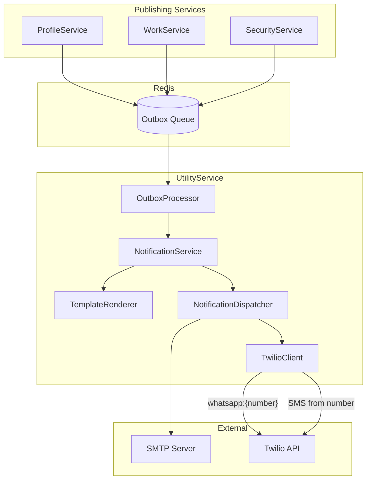
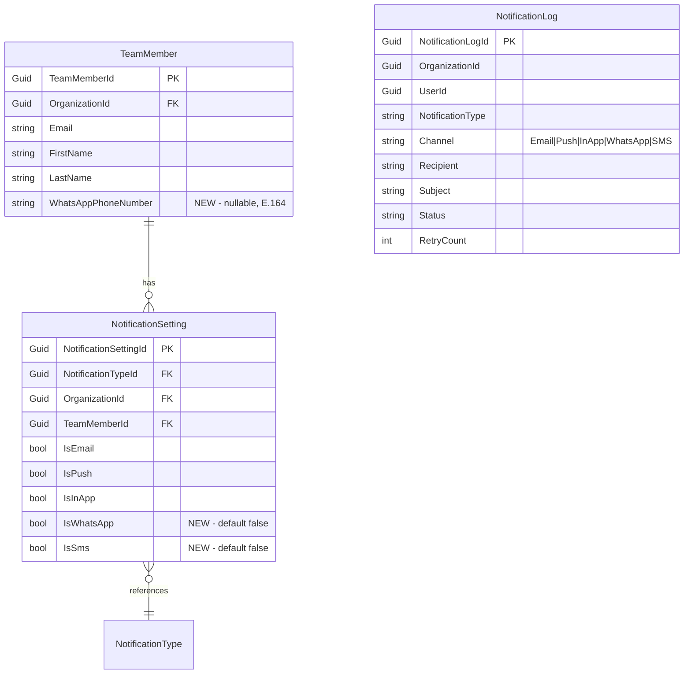

# Design Document: WhatsApp Notifications

## Overview

This design adds WhatsApp and SMS as notification channels to the existing UtilityService notification system, using the Twilio REST API (via `Twilio.Rest.Api.V2010`) for both WhatsApp Business messaging and SMS delivery. The integration plugs into the existing multi-channel dispatch architecture — `NotificationService` → `NotificationDispatcher` → channel transport — by adding two new branches to the channel `switch` expression and a new `TwilioClient` service that wraps the Twilio SDK.

On the ProfileService side, `TeamMember` gains an optional `WhatsAppPhoneNumber` field (E.164 format), and `NotificationSetting` gains `IsWhatsApp` and `IsSms` boolean toggles per notification type. A cross-field validation rule prevents enabling WhatsApp/SMS channels without a phone number on file.

The template system extends with two new subdirectories (`WhatsApp/` and `SMS/`) under the existing `Templates/` folder. WhatsApp templates use numbered placeholders (`{{1}}`, `{{2}}`) to comply with Meta's template requirements, while SMS templates use the same named placeholder format (`{{VariableName}}`) as existing Push templates.

When Twilio credentials are not configured, the system degrades gracefully — channels are skipped with a warning log, matching the existing pattern where Push and InApp are stub implementations.

## Architecture



The dispatch flow remains unchanged:

1. Publishing service writes a notification event to the Redis outbox with `Channels: "Email,WhatsApp,SMS"`
2. `OutboxProcessorHostedService` picks up the event and calls `NotificationService.DispatchAsync`
3. `NotificationService` splits channels, renders templates per channel, and dispatches each independently
4. For WhatsApp/SMS channels, `NotificationDispatcher` delegates to `TwilioClient`
5. `NotificationRetryHostedService` retries failed WhatsApp/SMS deliveries using the same retry logic

### Key Design Decision: Single TwilioClient for Both Channels

Both WhatsApp and SMS use the same Twilio `MessageResource.CreateAsync` API — the only difference is the `From` number format (`whatsapp:+1234...` vs `+1234...`). A single `TwilioClient` class handles both, with separate methods `SendWhatsAppAsync` and `SendSmsAsync` that set the appropriate `From` prefix.

## Components and Interfaces

### New: ITwilioClient Interface

```csharp
// UtilityService.Domain/Interfaces/Services/Notifications/ITwilioClient.cs
namespace UtilityService.Domain.Interfaces.Services.Notifications;

public interface ITwilioClient
{
    Task<bool> SendWhatsAppAsync(string toPhoneNumber, string templateName,
        List<string> templateParams, CancellationToken ct = default);
    Task<bool> SendSmsAsync(string toPhoneNumber, string messageBody,
        CancellationToken ct = default);
}
```

### New: TwilioClient Implementation

```csharp
// UtilityService.Infrastructure/Services/WhatsApp/TwilioClient.cs
```

Location: `UtilityService.Infrastructure/Services/WhatsApp/TwilioClient.cs`

- Reads `TwilioAccountSid`, `TwilioAuthToken`, `TwilioWhatsAppFrom`, `TwilioSmsFrom` from `AppSettings`
- Initializes `TwilioClient` SDK in constructor (or throws if SID/Token missing)
- `SendWhatsAppAsync`: calls `MessageResource.CreateAsync` with `from: "whatsapp:{TwilioWhatsAppFrom}"`, `to: "whatsapp:{toPhoneNumber}"`, `body: renderedContent`
- `SendSmsAsync`: calls `MessageResource.CreateAsync` with `from: TwilioSmsFrom`, `to: toPhoneNumber`, `body: messageBody`
- Returns `true` on success, logs error and returns `false` on Twilio API errors
- When `TwilioWhatsAppFrom` is empty, `SendWhatsAppAsync` logs a warning and returns `false` (graceful degradation)
- When `TwilioSmsFrom` is empty, `SendSmsAsync` logs a warning and returns `false`

### Modified: INotificationDispatcher

Add two new methods to the existing interface:

```csharp
Task<bool> SendWhatsAppAsync(string phoneNumber, string templateName,
    List<string> templateParams, CancellationToken ct = default);
Task<bool> SendSmsAsync(string phoneNumber, string messageBody,
    CancellationToken ct = default);
```

### Modified: NotificationDispatcher

Add implementations that delegate to `ITwilioClient`:

```csharp
public async Task<bool> SendWhatsAppAsync(string phoneNumber, string templateName,
    List<string> templateParams, CancellationToken ct = default)
{
    return await _twilioClient.SendWhatsAppAsync(phoneNumber, templateName, templateParams, ct);
}

public async Task<bool> SendSmsAsync(string phoneNumber, string messageBody,
    CancellationToken ct = default)
{
    return await _twilioClient.SendSmsAsync(phoneNumber, messageBody, ct);
}
```

### Modified: NotificationChannels

```csharp
public static class NotificationChannels
{
    public const string Email = "Email";
    public const string Push = "Push";
    public const string InApp = "InApp";
    public const string WhatsApp = "WhatsApp";
    public const string Sms = "SMS";

    public static readonly string[] All = { Email, Push, InApp, WhatsApp, Sms };
}
```

### Modified: NotificationService.DispatchAsync

Extend the channel `switch` expression:

```csharp
var success = channel switch
{
    NotificationChannels.Email => await _dispatcher.SendEmailAsync(
        req.Recipient, req.Subject ?? req.NotificationType, renderedContent, ct),
    NotificationChannels.Push => await _dispatcher.SendPushAsync(
        req.Recipient, req.Subject ?? req.NotificationType, renderedContent, ct),
    NotificationChannels.InApp => await _dispatcher.SendInAppAsync(
        req.UserId, req.Subject ?? req.NotificationType, renderedContent, ct),
    NotificationChannels.WhatsApp => string.IsNullOrEmpty(req.PhoneNumber)
        ? LogAndSkip("WhatsApp", req)
        : await _dispatcher.SendWhatsAppAsync(
            req.PhoneNumber, req.NotificationType,
            req.TemplateVariables.Values.ToList(), ct),
    NotificationChannels.Sms => string.IsNullOrEmpty(req.PhoneNumber)
        ? LogAndSkip("SMS", req)
        : await _dispatcher.SendSmsAsync(req.PhoneNumber, renderedContent, ct),
    _ => false
};
```

The same pattern applies in `RetryFailedAsync` for retry dispatch.

### Modified: TemplateRenderer.Render

Extend the channel-to-path mapping:

```csharp
if (channel == NotificationChannels.Email)
    templatePath = Path.Combine(_templateBasePath, "Email", $"{fileName}.html");
else if (channel == NotificationChannels.WhatsApp)
    templatePath = Path.Combine(_templateBasePath, "WhatsApp", $"{fileName}.txt");
else if (channel == NotificationChannels.Sms)
    templatePath = Path.Combine(_templateBasePath, "SMS", $"{fileName}.txt");
else
    templatePath = Path.Combine(_templateBasePath, "Push", $"{fileName}.txt");
```

For WhatsApp templates, the renderer substitutes numbered placeholders (`{{1}}`, `{{2}}`) by mapping the `templateVariables` dictionary values to positional indices. For SMS templates, the existing named placeholder substitution (`{{VariableName}}`) is reused as-is.

### Modified: DispatchNotificationRequest

```csharp
public class DispatchNotificationRequest
{
    public Guid OrganizationId { get; set; }
    public Guid UserId { get; set; }
    public string NotificationType { get; set; } = string.Empty;
    public string Channels { get; set; } = string.Empty;
    public string Recipient { get; set; } = string.Empty;
    public string? Subject { get; set; }
    public string? PhoneNumber { get; set; }  // NEW: E.164 format for WhatsApp/SMS
    public Dictionary<string, string> TemplateVariables { get; set; } = new();
}
```

### Modified: AppSettings

```csharp
// New Twilio properties
public string TwilioAccountSid { get; set; } = string.Empty;
public string TwilioAuthToken { get; set; } = string.Empty;
public string TwilioWhatsAppFrom { get; set; } = string.Empty;
public string TwilioSmsFrom { get; set; } = string.Empty;
```

In `FromEnvironment()`:
```csharp
TwilioAccountSid = Environment.GetEnvironmentVariable("TWILIO_ACCOUNT_SID") ?? string.Empty,
TwilioAuthToken = Environment.GetEnvironmentVariable("TWILIO_AUTH_TOKEN") ?? string.Empty,
TwilioWhatsAppFrom = Environment.GetEnvironmentVariable("TWILIO_WHATSAPP_FROM") ?? string.Empty,
TwilioSmsFrom = Environment.GetEnvironmentVariable("TWILIO_SMS_FROM") ?? string.Empty,
```

Note: These default to empty strings (not `GetRequired`) to allow graceful degradation when Twilio is not configured.


### Modified: TeamMember Entity (ProfileService)

```csharp
public class TeamMember : IOrganizationEntity
{
    // ... existing fields ...
    public string? WhatsAppPhoneNumber { get; set; }  // NEW: E.164 format, nullable
}
```

E.164 validation regex: `^\+[1-9]\d{6,14}$`

### Modified: NotificationSetting Entity (ProfileService)

```csharp
public class NotificationSetting : IOrganizationEntity
{
    // ... existing fields ...
    public bool IsWhatsApp { get; set; }  // NEW: defaults to false
    public bool IsSms { get; set; }       // NEW: defaults to false
}
```

### Cross-Field Validation Rules (ProfileService)

1. When updating `NotificationSetting` with `IsWhatsApp = true` or `IsSms = true`, validate that the `TeamMember` has a non-null `WhatsAppPhoneNumber`. Return validation error if missing.
2. When clearing `TeamMember.WhatsAppPhoneNumber` (setting to null), cascade-disable `IsWhatsApp` and `IsSms` on all `NotificationSetting` records for that team member.

### Modified DTOs (ProfileService)

**NotificationSettingResponse** — add `IsWhatsApp` and `IsSms` fields.
**UpdateNotificationSettingRequest** — add `IsWhatsApp` and `IsSms` fields.

### WhatsApp Template Files

New directory: `Templates/WhatsApp/` with 8 `.txt` files using numbered placeholders.

Example `Templates/WhatsApp/task-assigned.txt`:
```
You've been assigned a task: {{1}} ({{2}}) on story {{3}} by {{4}}.
```

Where `{{1}}` = TaskTitle, `{{2}}` = TaskType, `{{3}}` = StoryKey, `{{4}}` = AssignerName.

### SMS Template Files

New directory: `Templates/SMS/` with 8 `.txt` files using named placeholders (same format as Push templates).

Example `Templates/SMS/task-assigned.txt`:
```
Task Assigned: {{TaskTitle}} ({{TaskType}}) on {{StoryKey}} by {{AssignerName}}
```

## Data Models

### Entity Changes



### Database Migrations

**ProfileService migration:**
- Add `WhatsAppPhoneNumber` column (nullable `varchar(16)`) to `team_members` table
- Add `IsWhatsApp` column (`boolean`, default `false`) to `notification_settings` table
- Add `IsSms` column (`boolean`, default `false`) to `notification_settings` table

**UtilityService:** No schema changes — `NotificationLog.Channel` already stores string values, and `"WhatsApp"` / `"SMS"` are just new string constants.

### Environment Configuration

New entries in `config/{environment}/utility-service.env`:

```env
# Twilio (WhatsApp + SMS)
TWILIO_ACCOUNT_SID=
TWILIO_AUTH_TOKEN=
TWILIO_WHATSAPP_FROM=
TWILIO_SMS_FROM=
```

### NuGet Package

Add `Twilio` NuGet package to `UtilityService.Infrastructure.csproj`:

```xml
<PackageReference Include="Twilio" Version="7.*" />
```


## Correctness Properties

*A property is a characteristic or behavior that should hold true across all valid executions of a system — essentially, a formal statement about what the system should do. Properties serve as the bridge between human-readable specifications and machine-verifiable correctness guarantees.*

### Property 1: WhatsApp Numbered Placeholder Substitution

*For any* list of N string values (where N matches the template's placeholder count), rendering a WhatsApp template by substituting `{{1}}` through `{{N}}` with those values SHALL produce output where each positional placeholder is replaced by its corresponding value and no `{{n}}` placeholders remain.

**Validates: Requirements 5.2**

### Property 2: SMS Named Placeholder Substitution

*For any* dictionary of string key-value pairs where the keys match the template's named placeholders, rendering an SMS template by substituting `{{Key}}` with the corresponding value SHALL produce output where every placeholder is replaced and no `{{Key}}` patterns remain for known keys.

**Validates: Requirements 6.2**

### Property 3: Channel Dispatch Independence

*For any* dispatch request targeting multiple channels (from the set Email, Push, InApp, WhatsApp, SMS), and *for any* combination of per-channel success/failure outcomes, each channel's `NotificationLog` status SHALL reflect only that channel's own dispatch result — a failure in one channel SHALL NOT change the status of any other channel's log entry.

**Validates: Requirements 7.5**

### Property 4: E.164 Phone Number Validation

*For any* string input, the E.164 phone number validator SHALL accept the input if and only if it matches the pattern `^\+[1-9]\d{6,14}$` (a `+` followed by 7 to 15 digits, first digit non-zero). All other strings SHALL be rejected with a validation error.

**Validates: Requirements 8.2, 8.3, 8.4**

### Property 5: Notification Setting Channel Flags Persistence

*For any* combination of boolean values for the 5 channel flags (IsEmail, IsPush, IsInApp, IsWhatsApp, IsSms), persisting a `NotificationSetting` and then reloading it SHALL produce a record with identical flag values.

**Validates: Requirements 9.3**

### Property 6: Phone Number Prerequisite for WhatsApp/SMS Toggles

*For any* `UpdateNotificationSettingRequest` where `IsWhatsApp` is true or `IsSms` is true, if the associated `TeamMember` has a null `WhatsAppPhoneNumber`, the update SHALL be rejected with a validation error and the existing settings SHALL remain unchanged.

**Validates: Requirements 10.1**

### Property 7: Cascade Disable on Phone Number Removal

*For any* `TeamMember` with N notification settings where at least one has `IsWhatsApp = true` or `IsSms = true`, clearing the `WhatsAppPhoneNumber` to null SHALL result in all N notification settings having `IsWhatsApp = false` and `IsSms = false`, while all other channel flags (IsEmail, IsPush, IsInApp) SHALL remain unchanged.

**Validates: Requirements 10.2**

### Property 8: Skip Dispatch When Phone Number Missing

*For any* `DispatchNotificationRequest` that includes the "WhatsApp" or "SMS" channel with a null or empty `PhoneNumber` field, the `NotificationService` SHALL skip that channel (not call the dispatcher) and log a warning, while still dispatching to all other channels in the request normally.

**Validates: Requirements 12.2**

## Error Handling

| Scenario | Component | Behavior |
|----------|-----------|----------|
| Twilio API returns error (4xx/5xx) | TwilioClient | Log error details (status code, error message, SID), return `false`. NotificationService marks log as `Failed` for retry. |
| Twilio SDK throws exception | TwilioClient | Catch `ApiException`, log with structured fields, return `false`. |
| Twilio credentials missing (SID/Token) | TwilioClient constructor | Throw `InvalidOperationException` at startup — fail fast. App won't start without required credentials when Twilio is explicitly configured. |
| Twilio WhatsApp/SMS `From` number empty | TwilioClient | Log warning, return `false`. Graceful degradation — channel is effectively disabled. |
| WhatsApp template file missing | TemplateRenderer | Throw `TemplateNotFoundException` (existing pattern). NotificationService catches, logs, marks as `Failed`. |
| SMS template file missing | TemplateRenderer | Throw `TemplateNotFoundException` (existing pattern). |
| PhoneNumber null/empty on WhatsApp/SMS dispatch | NotificationService | Skip channel, log warning. Other channels in the same request proceed normally. |
| Phone number fails E.164 validation | ProfileService validator | Return `400 Bad Request` with validation error message. |
| Enable WhatsApp/SMS without phone number | ProfileService validator | Return `400 Bad Request` with "Phone number required" message. |
| Clear phone number with active WhatsApp/SMS settings | ProfileService | Cascade-disable IsWhatsApp/IsSms on all notification settings, then clear the phone number. |
| Twilio rate limiting (429) | TwilioClient | Treated as a failed delivery — logged, returns `false`, eligible for retry with exponential backoff via existing `NotificationRetryHostedService`. |
| Network timeout to Twilio | TwilioClient | SDK throws `ApiConnectionException`. Caught, logged, returns `false`. Retry handles it. |

### Graceful Degradation Strategy

When Twilio is not configured (empty SID/Token), the system should still start and function for all other channels. The approach:

1. `AppSettings.FromEnvironment` defaults Twilio values to empty strings (not `GetRequired`)
2. `TwilioClient` constructor checks if SID and Token are non-empty. If empty, it sets an internal `_isConfigured = false` flag
3. `SendWhatsAppAsync` and `SendSmsAsync` check `_isConfigured` first — if false, log a warning and return `false`
4. This matches the existing pattern where Push and InApp are stub implementations that always return `true`

## Testing Strategy

### Property-Based Tests (FsCheck.Xunit)

The project already uses **FsCheck.Xunit 3.3.2** with **xunit 2.5.3** across all test projects. Each property test runs a minimum of 100 iterations.

| Property | Test Location | Tag |
|----------|--------------|-----|
| Property 1: WhatsApp placeholder substitution | UtilityService.Tests | `Feature: whatsapp-notifications, Property 1: WhatsApp numbered placeholder substitution` |
| Property 2: SMS placeholder substitution | UtilityService.Tests | `Feature: whatsapp-notifications, Property 2: SMS named placeholder substitution` |
| Property 3: Channel dispatch independence | UtilityService.Tests | `Feature: whatsapp-notifications, Property 3: Channel dispatch independence` |
| Property 4: E.164 validation | ProfileService.Tests | `Feature: whatsapp-notifications, Property 4: E.164 phone number validation` |
| Property 5: Channel flags persistence | ProfileService.Tests | `Feature: whatsapp-notifications, Property 5: Notification setting channel flags persistence` |
| Property 6: Phone prerequisite validation | ProfileService.Tests | `Feature: whatsapp-notifications, Property 6: Phone number prerequisite for WhatsApp/SMS toggles` |
| Property 7: Cascade disable | ProfileService.Tests | `Feature: whatsapp-notifications, Property 7: Cascade disable on phone number removal` |
| Property 8: Skip dispatch without phone | UtilityService.Tests | `Feature: whatsapp-notifications, Property 8: Skip dispatch when phone number missing` |

### Unit Tests (xunit + Moq)

| Area | Tests | Notes |
|------|-------|-------|
| TwilioClient.SendWhatsAppAsync | Success, API error, empty From number | Mock Twilio SDK via interface wrapper |
| TwilioClient.SendSmsAsync | Success, API error, empty From number | Mock Twilio SDK |
| TwilioClient constructor | Missing SID throws, missing Token throws | Edge cases |
| NotificationService.DispatchAsync | WhatsApp routing, SMS routing | Mock dispatcher, verify correct method called |
| NotificationService.RetryFailedAsync | WhatsApp retry, SMS retry | Mock dispatcher, verify retry calls correct method |
| TemplateRenderer (WhatsApp) | Loads from WhatsApp dir, throws on missing | File-based tests with temp directory |
| TemplateRenderer (SMS) | Loads from SMS dir, throws on missing | File-based tests with temp directory |
| NotificationChannels | WhatsApp and SMS constants exist | Smoke tests |
| AppSettings.FromEnvironment | Reads Twilio env vars, defaults to empty | Set/unset env vars |
| Email backward compatibility | Email still uses Recipient field | Regression test |

### Integration Tests

| Area | Tests | Notes |
|------|-------|-------|
| ProfileService API | Update phone number, clear phone number, cascade disable | In-memory DB |
| ProfileService API | Enable WhatsApp without phone → 400 | Validation integration |
| NotificationSetting persistence | Save/load with new boolean fields | EF Core in-memory |
| Database migration | New columns exist with correct defaults | Against test DB |

### Test File Organization

```
UtilityService.Tests/
  Services/Notifications/
    TwilioClientTests.cs
    NotificationServiceWhatsAppTests.cs
    TemplateRendererWhatsAppTests.cs
    TemplateRendererSmsTests.cs
  Properties/
    WhatsAppNotificationProperties.cs

ProfileService.Tests/
  Validators/
    E164PhoneNumberValidatorTests.cs
  Services/
    NotificationSettingWhatsAppTests.cs
  Properties/
    WhatsAppNotificationProperties.cs
```
