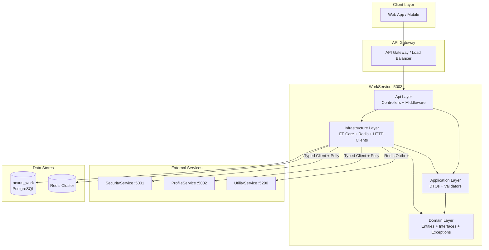
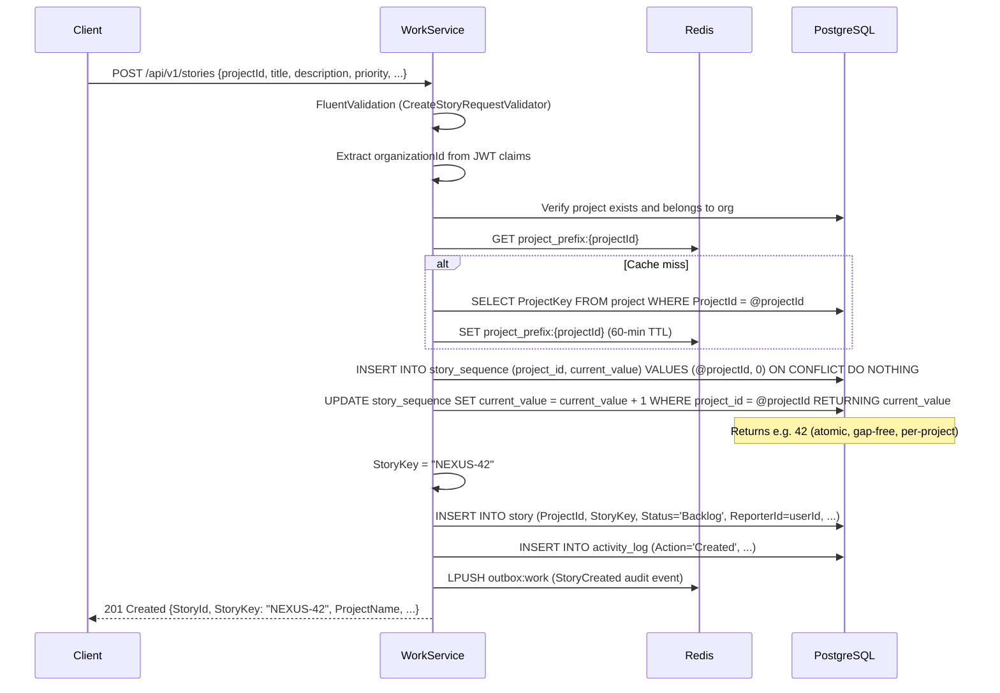
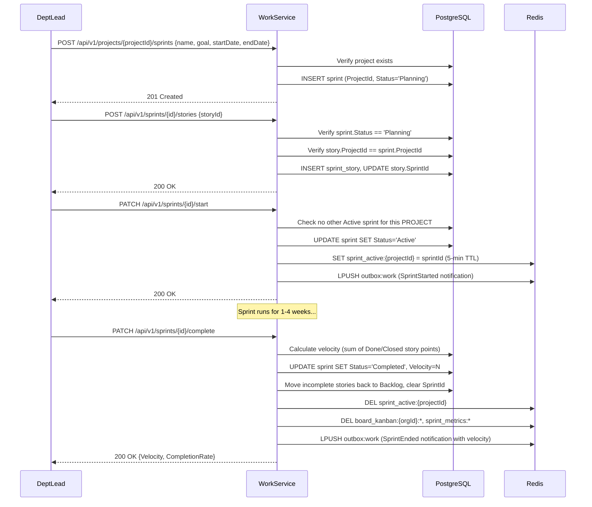
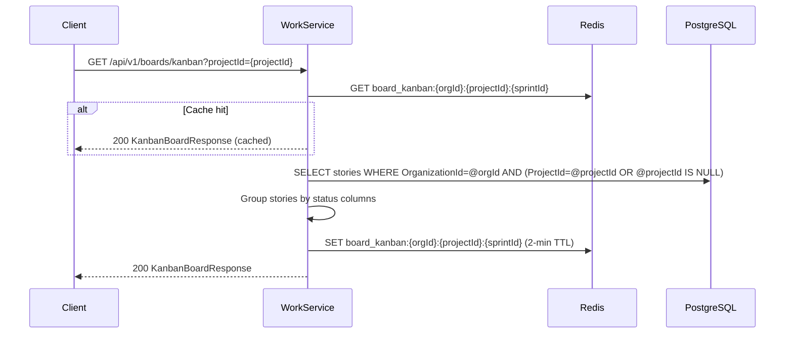
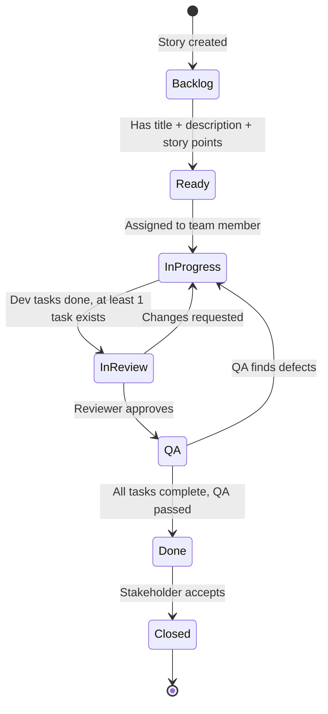
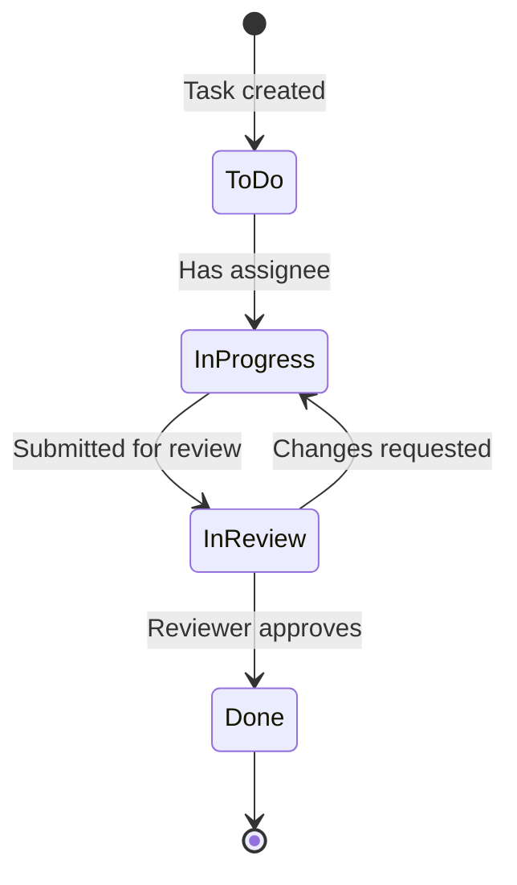
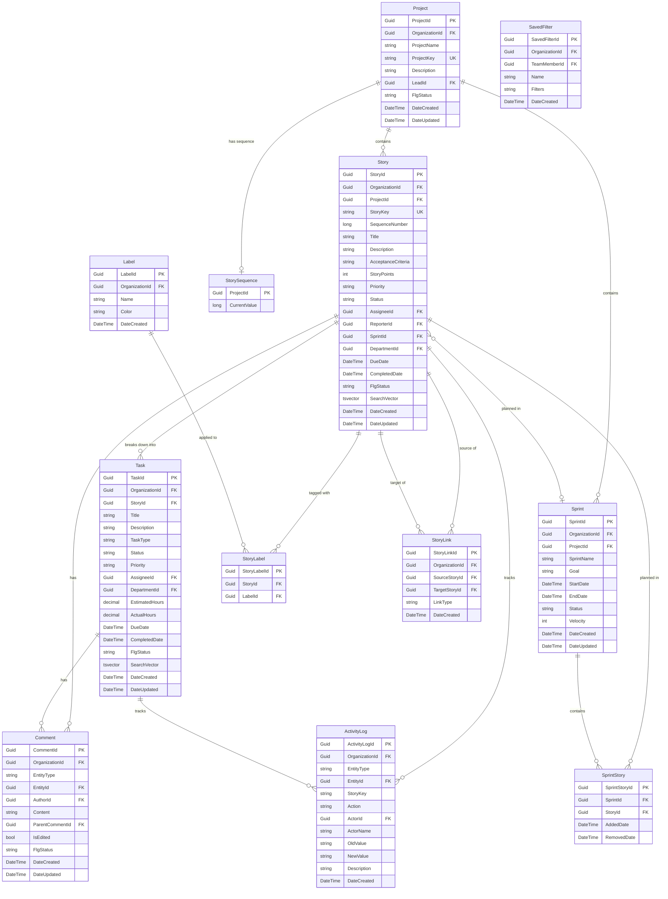

# Design Document — WorkService

## Overview

WorkService is the core Agile workflow management microservice for the Nexus-2.0 Enterprise Agile Platform. It runs on port 5003 with database `nexus_work` and follows Clean Architecture (.NET 8) with Domain / Application / Infrastructure / Api layers.

WorkService is the largest and most feature-rich service in the platform. It manages the entire Agile lifecycle: projects as organizational containers with unique story key prefixes, stories with professional IDs (e.g., `NEXUS-42`), tasks with department-based assignment, sprints, board views (Kanban, Sprint, Department, Backlog), comments with @mentions, labels, activity feeds, full-text search, reports, saved filters, story linking, and workflow customization.

The scoping model is: **Organization → Projects → Stories/Sprints**. Each organization can have multiple projects, and each project has its own backlog, sprints, and story key prefix (e.g., `NEXUS`, `ACME`). Stories and sprints are scoped to a project within an organization. The `ProjectKey` replaces the old organization-level `StoryIdPrefix` for story key generation.

WorkService depends on ProfileService (port 5002) for organization settings (sprint duration), team member lookup, and department member lists. It depends on SecurityService (port 5001) for service-to-service JWT issuance. It publishes audit events and notifications to `outbox:work` for UtilityService (port 5200) processing.

Key responsibilities:
- **Project management** with globally unique `ProjectKey` (2–10 uppercase alphanumeric) and CRUD operations
- **Professional story ID generation** with atomic PostgreSQL sequence per project (`{ProjectKey}-{SequenceNumber}`)
- Story CRUD with workflow state machine (Backlog → Ready → InProgress → InReview → QA → Done → Closed)
- Task CRUD with department-based auto-routing and workflow state machine (ToDo → InProgress → InReview → Done)
- Sprint lifecycle management (Planning → Active → Completed/Cancelled) with **one active sprint per project**
- Board view data aggregation (Kanban, Sprint, Backlog, Department) with optional `projectId` filter
- Threaded comments with @mention resolution and notifications
- Organization-scoped labels with max 10 per story
- Immutable activity log for complete entity timeline
- Bidirectional story linking (blocks, is_blocked_by, relates_to, duplicates)
- Full-text search with PostgreSQL tsvector/tsquery and weighted search
- Sprint metrics, burndown calculation, and velocity tracking
- Reports (velocity, department workload, capacity utilization, cycle time, task completion)
- Saved filters for custom board/search views
- Workflow customization (organization and department level overrides)
- Redis caching with tiered TTLs and explicit invalidation (keys include `projectId` where relevant)
- Audit event and notification publishing via Redis outbox pattern

References:
- `docs/nexus-2.0-backend-specification.md` — Sections 6.1–6.12, Section 8
- `docs/nexus-2.0-backend-requirements.md` — REQ-036 through REQ-070, REQ-086 through REQ-108
- `.kiro/specs/work-service/requirements.md` — Requirements 1 through 57
- `.kiro/specs/security-service/design.md` — SecurityService design patterns
- `.kiro/specs/profile-service/design.md` — ProfileService design patterns

## Architecture

### High-Level Architecture



### Story Creation with Project-Scoped Professional ID Generation



### Sprint Lifecycle Flow (Per-Project)



### Board View with Project Filter



### Story Workflow State Machine



### Task Workflow State Machine



### Middleware Pipeline

Requests flow through middleware in this exact order (per Requirement 57):

```
CORS → CorrelationId → GlobalExceptionHandler → RateLimiter → Routing →
Authentication → Authorization → JwtClaims → TokenBlacklist →
RoleAuthorization → OrganizationScope → Controllers
```


Note: WorkService does not include `FirstTimeUserMiddleware` — that is enforced by SecurityService. WorkService trusts the JWT claims set by SecurityService.

## Components and Interfaces

### Monorepo Folder Structure

```
Nexus-2.0/
├── docs/
├── src/
│   ├── backend/
│   │   ├── SecurityService/
│   │   ├── ProfileService/
│   │   ├── WorkService/              # This service
│   │   │   ├── WorkService.Domain/
│   │   │   ├── WorkService.Application/
│   │   │   ├── WorkService.Infrastructure/
│   │   │   ├── WorkService.Api/
│   │   │   └── WorkService.Tests/
│   │   └── UtilityService/
│   └── frontend/
├── docker/
├── Nexus-2.0.sln
└── .kiro/
```

### Clean Architecture Layer Structure

All paths below are relative to `src/backend/WorkService/`.

```
WorkService.Domain/
├── Entities/
│   ├── Project.cs
│   ├── Story.cs
│   ├── Task.cs
│   ├── Sprint.cs
│   ├── SprintStory.cs
│   ├── Comment.cs
│   ├── ActivityLog.cs
│   ├── Label.cs
│   ├── StoryLabel.cs
│   ├── StoryLink.cs
│   ├── StorySequence.cs
│   └── SavedFilter.cs
├── Exceptions/
│   ├── DomainException.cs
│   ├── ErrorCodes.cs
│   ├── ProjectNotFoundException.cs
│   ├── ProjectNameDuplicateException.cs
│   ├── ProjectKeyDuplicateException.cs
│   ├── ProjectKeyImmutableException.cs
│   ├── ProjectKeyInvalidFormatException.cs
│   ├── StoryProjectMismatchException.cs
│   ├── StoryNotFoundException.cs
│   ├── TaskNotFoundException.cs
│   ├── SprintNotFoundException.cs
│   ├── InvalidStoryTransitionException.cs
│   ├── InvalidTaskTransitionException.cs
│   ├── SprintNotInPlanningException.cs
│   ├── StoryAlreadyInSprintException.cs
│   ├── StoryNotInSprintException.cs
│   ├── SprintOverlapException.cs
│   ├── LabelNotFoundException.cs
│   ├── LabelNameDuplicateException.cs
│   ├── CommentNotFoundException.cs
│   ├── StoryRequiresAssigneeException.cs
│   ├── StoryRequiresTasksException.cs
│   ├── StoryRequiresPointsException.cs
│   ├── OnlyOneActiveSprintException.cs
│   ├── CommentNotAuthorException.cs
│   ├── AssigneeNotInDepartmentException.cs
│   ├── AssigneeAtCapacityException.cs
│   ├── StoryKeyNotFoundException.cs
│   ├── SprintAlreadyActiveException.cs
│   ├── SprintAlreadyCompletedException.cs
│   ├── InvalidStoryPointsException.cs
│   ├── InvalidPriorityException.cs
│   ├── InvalidTaskTypeException.cs
│   ├── StoryInActiveSprintException.cs
│   ├── TaskInProgressException.cs
│   ├── SearchQueryTooShortException.cs
│   ├── MentionUserNotFoundException.cs
│   ├── OrganizationMismatchException.cs
│   ├── DepartmentAccessDeniedException.cs
│   ├── InsufficientPermissionsException.cs
│   ├── SprintEndBeforeStartException.cs
│   ├── StorySequenceInitFailedException.cs
│   ├── HoursMustBePositiveException.cs
│   ├── NotFoundException.cs
│   ├── ConflictException.cs
│   ├── ServiceUnavailableException.cs
│   ├── StoryDescriptionRequiredException.cs
│   ├── MaxLabelsPerStoryException.cs
│   └── RateLimitExceededException.cs
├── Interfaces/
│   ├── Repositories/
│   │   ├── IProjectRepository.cs
│   │   ├── IStoryRepository.cs
│   │   ├── ITaskRepository.cs
│   │   ├── ISprintRepository.cs
│   │   ├── ISprintStoryRepository.cs
│   │   ├── ICommentRepository.cs
│   │   ├── IActivityLogRepository.cs
│   │   ├── ILabelRepository.cs
│   │   ├── IStoryLabelRepository.cs
│   │   ├── IStoryLinkRepository.cs
│   │   ├── IStorySequenceRepository.cs
│   │   └── ISavedFilterRepository.cs
│   └── Services/
│       ├── IProjectService.cs
│       ├── IStoryService.cs
│       ├── ITaskService.cs
│       ├── ISprintService.cs
│       ├── ICommentService.cs
│       ├── ILabelService.cs
│       ├── IActivityLogService.cs
│       ├── ISearchService.cs
│       ├── IBoardService.cs
│       ├── IReportService.cs
│       ├── IStoryIdGenerator.cs
│       ├── IWorkflowService.cs
│       └── IOutboxService.cs
├── Enums/
│   ├── StoryStatus.cs
│   ├── TaskStatus.cs
│   ├── TaskType.cs
│   ├── Priority.cs
│   ├── SprintStatus.cs
│   └── LinkType.cs
├── Helpers/
│   ├── WorkflowStateMachine.cs
│   ├── DepartmentTypes.cs
│   └── TaskTypeDepartmentMap.cs
└── Common/
    └── IOrganizationEntity.cs

WorkService.Application/
├── DTOs/
│   ├── ApiResponse.cs
│   ├── ErrorDetail.cs
│   ├── PaginatedResponse.cs
│   ├── Projects/
│   │   ├── CreateProjectRequest.cs
│   │   ├── UpdateProjectRequest.cs
│   │   ├── ProjectDetailResponse.cs
│   │   ├── ProjectListResponse.cs
│   │   └── ProjectStatusRequest.cs
│   ├── Stories/
│   │   ├── CreateStoryRequest.cs
│   │   ├── UpdateStoryRequest.cs
│   │   ├── StoryDetailResponse.cs
│   │   ├── StoryListResponse.cs
│   │   ├── StoryStatusRequest.cs
│   │   ├── StoryAssignRequest.cs
│   │   └── CreateStoryLinkRequest.cs
│   ├── Tasks/
│   │   ├── CreateTaskRequest.cs
│   │   ├── UpdateTaskRequest.cs
│   │   ├── TaskDetailResponse.cs
│   │   ├── TaskStatusRequest.cs
│   │   ├── TaskAssignRequest.cs
│   │   ├── LogHoursRequest.cs
│   │   └── SuggestAssigneeResponse.cs
│   ├── Sprints/
│   │   ├── CreateSprintRequest.cs
│   │   ├── UpdateSprintRequest.cs
│   │   ├── SprintDetailResponse.cs
│   │   ├── SprintListResponse.cs
│   │   ├── SprintMetricsResponse.cs
│   │   ├── BurndownDataPoint.cs
│   │   ├── AddStoryToSprintRequest.cs
│   │   └── VelocityResponse.cs
│   ├── Comments/
│   │   ├── CreateCommentRequest.cs
│   │   └── CommentResponse.cs
│   ├── Labels/
│   │   ├── CreateLabelRequest.cs
│   │   ├── UpdateLabelRequest.cs
│   │   ├── LabelResponse.cs
│   │   └── ApplyLabelRequest.cs
│   ├── Boards/
│   │   ├── KanbanBoardResponse.cs
│   │   ├── KanbanColumn.cs
│   │   ├── KanbanCard.cs
│   │   ├── SprintBoardResponse.cs
│   │   ├── BacklogResponse.cs
│   │   ├── BacklogItem.cs
│   │   ├── DepartmentBoardResponse.cs
│   │   └── DepartmentBoardGroup.cs
│   ├── Search/
│   │   ├── SearchRequest.cs
│   │   ├── SearchResponse.cs
│   │   └── SearchResultItem.cs
│   ├── Reports/
│   │   ├── VelocityChartResponse.cs
│   │   ├── DepartmentWorkloadResponse.cs
│   │   ├── CapacityUtilizationResponse.cs
│   │   ├── CycleTimeResponse.cs
│   │   └── TaskCompletionResponse.cs
│   ├── SavedFilters/
│   │   ├── CreateSavedFilterRequest.cs
│   │   └── SavedFilterResponse.cs
│   ├── Workflows/
│   │   ├── WorkflowDefinitionResponse.cs
│   │   └── WorkflowOverrideRequest.cs
│   └── Activity/
│       └── ActivityLogResponse.cs
├── Contracts/
│   ├── TeamMemberResponse.cs
│   ├── DepartmentResponse.cs
│   ├── OrganizationSettingsResponse.cs
│   └── ErrorCodeResponse.cs
├── Validators/
│   ├── CreateProjectRequestValidator.cs
│   ├── UpdateProjectRequestValidator.cs
│   ├── CreateStoryRequestValidator.cs
│   ├── UpdateStoryRequestValidator.cs
│   ├── StoryStatusRequestValidator.cs
│   ├── CreateStoryLinkRequestValidator.cs
│   ├── CreateTaskRequestValidator.cs
│   ├── UpdateTaskRequestValidator.cs
│   ├── TaskStatusRequestValidator.cs
│   ├── LogHoursRequestValidator.cs
│   ├── CreateSprintRequestValidator.cs
│   ├── UpdateSprintRequestValidator.cs
│   ├── AddStoryToSprintRequestValidator.cs
│   ├── CreateCommentRequestValidator.cs
│   ├── CreateLabelRequestValidator.cs
│   ├── UpdateLabelRequestValidator.cs
│   ├── SearchRequestValidator.cs
│   ├── CreateSavedFilterRequestValidator.cs
│   └── WorkflowOverrideRequestValidator.cs
└── WorkService.Application.csproj

WorkService.Infrastructure/
├── Data/
│   ├── WorkDbContext.cs
│   └── Migrations/
├── Repositories/
│   ├── ProjectRepository.cs
│   ├── StoryRepository.cs
│   ├── TaskRepository.cs
│   ├── SprintRepository.cs
│   ├── SprintStoryRepository.cs
│   ├── CommentRepository.cs
│   ├── ActivityLogRepository.cs
│   ├── LabelRepository.cs
│   ├── StoryLabelRepository.cs
│   ├── StoryLinkRepository.cs
│   ├── StorySequenceRepository.cs
│   └── SavedFilterRepository.cs
├── Services/
│   ├── Projects/
│   │   └── ProjectService.cs
│   ├── Stories/
│   │   ├── StoryService.cs
│   │   └── StoryIdGenerator.cs
│   ├── Tasks/
│   │   └── TaskService.cs
│   ├── Sprints/
│   │   └── SprintService.cs
│   ├── Comments/
│   │   └── CommentService.cs
│   ├── Labels/
│   │   └── LabelService.cs
│   ├── ActivityLog/
│   │   └── ActivityLogService.cs
│   ├── Search/
│   │   └── SearchService.cs
│   ├── Boards/
│   │   └── BoardService.cs
│   ├── Reports/
│   │   └── ReportService.cs
│   ├── Workflows/
│   │   └── WorkflowService.cs
│   ├── ServiceClients/
│   │   ├── IProfileServiceClient.cs
│   │   ├── ProfileServiceClient.cs
│   │   ├── ISecurityServiceClient.cs
│   │   └── SecurityServiceClient.cs
│   ├── ErrorCodeResolver/
│   │   └── ErrorCodeResolverService.cs
│   └── Outbox/
│       └── OutboxService.cs
├── Configuration/
│   ├── AppSettings.cs
│   ├── DatabaseMigrationHelper.cs
│   └── DependencyInjection.cs
└── WorkService.Infrastructure.csproj

WorkService.Api/
├── Controllers/
│   ├── ProjectController.cs
│   ├── StoryController.cs
│   ├── TaskController.cs
│   ├── SprintController.cs
│   ├── BoardController.cs
│   ├── CommentController.cs
│   ├── LabelController.cs
│   ├── SearchController.cs
│   ├── ReportController.cs
│   ├── WorkflowController.cs
│   └── SavedFilterController.cs
├── Middleware/
│   ├── CorrelationIdMiddleware.cs
│   ├── GlobalExceptionHandlerMiddleware.cs
│   ├── RateLimiterMiddleware.cs
│   ├── JwtClaimsMiddleware.cs
│   ├── TokenBlacklistMiddleware.cs
│   ├── RoleAuthorizationMiddleware.cs
│   ├── OrganizationScopeMiddleware.cs
│   └── CorrelationIdDelegatingHandler.cs
├── Attributes/
│   ├── OrgAdminAttribute.cs
│   ├── DeptLeadAttribute.cs
│   └── ServiceAuthAttribute.cs
├── Extensions/
│   ├── MiddlewarePipelineExtensions.cs
│   ├── ControllerServiceExtensions.cs
│   ├── SwaggerServiceExtensions.cs
│   └── HealthCheckExtensions.cs
├── Program.cs
├── Dockerfile
├── .env
├── .env.example
└── WorkService.Api.csproj
```

### Domain Layer Interfaces

#### IProjectService

```csharp
public interface IProjectService
{
    Task<ProjectDetailResponse> CreateAsync(Guid organizationId, Guid creatorId, CreateProjectRequest request, CancellationToken ct = default);
    Task<ProjectDetailResponse> GetByIdAsync(Guid projectId, CancellationToken ct = default);
    Task<PaginatedResponse<ProjectListResponse>> ListAsync(Guid organizationId, int page, int pageSize, string? status, CancellationToken ct = default);
    Task<ProjectDetailResponse> UpdateAsync(Guid projectId, UpdateProjectRequest request, CancellationToken ct = default);
    Task UpdateStatusAsync(Guid projectId, string newStatus, CancellationToken ct = default);
}
```

#### IStoryService

```csharp
public interface IStoryService
{
    Task<StoryDetailResponse> CreateAsync(Guid organizationId, Guid reporterId, CreateStoryRequest request, CancellationToken ct = default);
    Task<StoryDetailResponse> GetByIdAsync(Guid storyId, CancellationToken ct = default);
    Task<StoryDetailResponse> GetByKeyAsync(string storyKey, CancellationToken ct = default);
    Task<PaginatedResponse<StoryListResponse>> ListAsync(Guid organizationId, int page, int pageSize, Guid? projectId, string? status, string? priority, Guid? departmentId, Guid? assigneeId, Guid? sprintId, List<string>? labels, DateTime? dateFrom, DateTime? dateTo, CancellationToken ct = default);
    Task<StoryDetailResponse> UpdateAsync(Guid storyId, Guid actorId, UpdateStoryRequest request, CancellationToken ct = default);
    Task DeleteAsync(Guid storyId, CancellationToken ct = default);
    Task<StoryDetailResponse> TransitionStatusAsync(Guid storyId, Guid actorId, string newStatus, CancellationToken ct = default);
    Task<StoryDetailResponse> AssignAsync(Guid storyId, Guid actorId, Guid assigneeId, string actorRole, Guid actorDepartmentId, CancellationToken ct = default);
    Task UnassignAsync(Guid storyId, Guid actorId, CancellationToken ct = default);
    Task CreateLinkAsync(Guid storyId, Guid targetStoryId, string linkType, CancellationToken ct = default);
    Task DeleteLinkAsync(Guid storyId, Guid linkId, CancellationToken ct = default);
    Task ApplyLabelAsync(Guid storyId, Guid labelId, CancellationToken ct = default);
    Task RemoveLabelAsync(Guid storyId, Guid labelId, CancellationToken ct = default);
}
```

#### ITaskService

```csharp
public interface ITaskService
{
    Task<TaskDetailResponse> CreateAsync(Guid organizationId, Guid creatorId, CreateTaskRequest request, CancellationToken ct = default);
    Task<TaskDetailResponse> GetByIdAsync(Guid taskId, CancellationToken ct = default);
    Task<IEnumerable<TaskDetailResponse>> ListByStoryAsync(Guid storyId, CancellationToken ct = default);
    Task<TaskDetailResponse> UpdateAsync(Guid taskId, Guid actorId, UpdateTaskRequest request, CancellationToken ct = default);
    Task DeleteAsync(Guid taskId, CancellationToken ct = default);
    Task<TaskDetailResponse> TransitionStatusAsync(Guid taskId, Guid actorId, string newStatus, CancellationToken ct = default);
    Task<TaskDetailResponse> AssignAsync(Guid taskId, Guid actorId, Guid assigneeId, string actorRole, Guid actorDepartmentId, CancellationToken ct = default);
    Task<TaskDetailResponse> SelfAssignAsync(Guid taskId, Guid userId, CancellationToken ct = default);
    Task UnassignAsync(Guid taskId, Guid actorId, CancellationToken ct = default);
    Task LogHoursAsync(Guid taskId, Guid actorId, decimal hours, string? description, CancellationToken ct = default);
    Task<SuggestAssigneeResponse> SuggestAssigneeAsync(string taskType, Guid organizationId, CancellationToken ct = default);
}
```

#### ISprintService

```csharp
public interface ISprintService
{
    Task<SprintDetailResponse> CreateAsync(Guid organizationId, Guid projectId, CreateSprintRequest request, CancellationToken ct = default);
    Task<SprintDetailResponse> GetByIdAsync(Guid sprintId, CancellationToken ct = default);
    Task<PaginatedResponse<SprintListResponse>> ListAsync(Guid organizationId, int page, int pageSize, string? status, Guid? projectId, CancellationToken ct = default);
    Task<SprintDetailResponse> UpdateAsync(Guid sprintId, UpdateSprintRequest request, CancellationToken ct = default);
    Task<SprintDetailResponse> StartAsync(Guid sprintId, CancellationToken ct = default);
    Task<SprintDetailResponse> CompleteAsync(Guid sprintId, CancellationToken ct = default);
    Task<SprintDetailResponse> CancelAsync(Guid sprintId, CancellationToken ct = default);
    Task AddStoryAsync(Guid sprintId, Guid storyId, CancellationToken ct = default);
    Task RemoveStoryAsync(Guid sprintId, Guid storyId, CancellationToken ct = default);
    Task<SprintMetricsResponse> GetMetricsAsync(Guid sprintId, CancellationToken ct = default);
    Task<IEnumerable<VelocityResponse>> GetVelocityHistoryAsync(Guid organizationId, int count, CancellationToken ct = default);
    Task<SprintDetailResponse?> GetActiveSprintAsync(Guid organizationId, Guid? projectId, CancellationToken ct = default);
}
```

#### ICommentService

```csharp
public interface ICommentService
{
    Task<CommentResponse> CreateAsync(Guid organizationId, Guid authorId, CreateCommentRequest request, CancellationToken ct = default);
    Task<CommentResponse> UpdateAsync(Guid commentId, Guid userId, string content, CancellationToken ct = default);
    Task DeleteAsync(Guid commentId, Guid userId, string userRole, CancellationToken ct = default);
    Task<IEnumerable<CommentResponse>> ListByEntityAsync(string entityType, Guid entityId, CancellationToken ct = default);
}
```

#### ILabelService

```csharp
public interface ILabelService
{
    Task<LabelResponse> CreateAsync(Guid organizationId, CreateLabelRequest request, CancellationToken ct = default);
    Task<IEnumerable<LabelResponse>> ListAsync(Guid organizationId, CancellationToken ct = default);
    Task<LabelResponse> UpdateAsync(Guid labelId, UpdateLabelRequest request, CancellationToken ct = default);
    Task DeleteAsync(Guid labelId, CancellationToken ct = default);
}
```

#### IActivityLogService

```csharp
public interface IActivityLogService
{
    Task LogAsync(Guid organizationId, string entityType, Guid entityId, string storyKey, string action, Guid actorId, string actorName, string? oldValue, string? newValue, string description, CancellationToken ct = default);
    Task<IEnumerable<ActivityLogResponse>> GetByEntityAsync(string entityType, Guid entityId, CancellationToken ct = default);
}
```

#### ISearchService

```csharp
public interface ISearchService
{
    Task<SearchResponse> SearchAsync(Guid organizationId, SearchRequest request, CancellationToken ct = default);
}
```

#### IBoardService

```csharp
public interface IBoardService
{
    Task<KanbanBoardResponse> GetKanbanBoardAsync(Guid organizationId, Guid? projectId, Guid? sprintId, Guid? departmentId, Guid? assigneeId, string? priority, List<string>? labels, CancellationToken ct = default);
    Task<SprintBoardResponse> GetSprintBoardAsync(Guid organizationId, Guid? projectId, CancellationToken ct = default);
    Task<BacklogResponse> GetBacklogAsync(Guid organizationId, Guid? projectId, CancellationToken ct = default);
    Task<DepartmentBoardResponse> GetDepartmentBoardAsync(Guid organizationId, Guid? projectId, Guid? sprintId, CancellationToken ct = default);
}
```

#### IReportService

```csharp
public interface IReportService
{
    Task<IEnumerable<VelocityChartResponse>> GetVelocityChartAsync(Guid organizationId, int count, CancellationToken ct = default);
    Task<IEnumerable<DepartmentWorkloadResponse>> GetDepartmentWorkloadAsync(Guid organizationId, Guid? sprintId, CancellationToken ct = default);
    Task<IEnumerable<CapacityUtilizationResponse>> GetCapacityUtilizationAsync(Guid organizationId, Guid? departmentId, CancellationToken ct = default);
    Task<IEnumerable<CycleTimeResponse>> GetCycleTimeAsync(Guid organizationId, DateTime? dateFrom, DateTime? dateTo, CancellationToken ct = default);
    Task<IEnumerable<TaskCompletionResponse>> GetTaskCompletionAsync(Guid organizationId, Guid? sprintId, DateTime? dateFrom, DateTime? dateTo, CancellationToken ct = default);
}
```

#### IStoryIdGenerator

```csharp
public interface IStoryIdGenerator
{
    Task<(string StoryKey, long SequenceNumber)> GenerateNextIdAsync(Guid projectId, CancellationToken ct = default);
}
```

#### IWorkflowService

```csharp
public interface IWorkflowService
{
    Task<WorkflowDefinitionResponse> GetWorkflowsAsync(Guid organizationId, CancellationToken ct = default);
    Task SaveOrganizationOverrideAsync(Guid organizationId, WorkflowOverrideRequest request, CancellationToken ct = default);
    Task SaveDepartmentOverrideAsync(Guid organizationId, Guid departmentId, WorkflowOverrideRequest request, CancellationToken ct = default);
}
```

#### IOutboxService

```csharp
public interface IOutboxService
{
    Task PublishAsync(OutboxMessage message, CancellationToken ct = default);
}
```

#### IErrorCodeResolverService

```csharp
public interface IErrorCodeResolverService
{
    Task<(string ResponseCode, string ResponseDescription)> ResolveAsync(string errorCode, CancellationToken ct = default);
}
```

### Repository Interfaces

```csharp
public interface IProjectRepository
{
    Task<Project?> GetByIdAsync(Guid projectId, CancellationToken ct = default);
    Task<Project?> GetByKeyAsync(string projectKey, CancellationToken ct = default);
    Task<Project?> GetByNameAsync(Guid organizationId, string projectName, CancellationToken ct = default);
    Task<Project> AddAsync(Project project, CancellationToken ct = default);
    Task UpdateAsync(Project project, CancellationToken ct = default);
    Task<(IEnumerable<Project> Items, int TotalCount)> ListAsync(Guid organizationId, int page, int pageSize, string? status, CancellationToken ct = default);
    Task<int> GetStoryCountAsync(Guid projectId, CancellationToken ct = default);
    Task<int> GetSprintCountAsync(Guid projectId, CancellationToken ct = default);
}

public interface IStoryRepository
{
    Task<Story?> GetByIdAsync(Guid storyId, CancellationToken ct = default);
    Task<Story?> GetByKeyAsync(Guid organizationId, string storyKey, CancellationToken ct = default);
    Task<Story> AddAsync(Story story, CancellationToken ct = default);
    Task UpdateAsync(Story story, CancellationToken ct = default);
    Task<(IEnumerable<Story> Items, int TotalCount)> ListAsync(Guid organizationId, int page, int pageSize, Guid? projectId, string? status, string? priority, Guid? departmentId, Guid? assigneeId, Guid? sprintId, List<string>? labels, DateTime? dateFrom, DateTime? dateTo, CancellationToken ct = default);
    Task<int> CountTasksAsync(Guid storyId, CancellationToken ct = default);
    Task<int> CountCompletedTasksAsync(Guid storyId, CancellationToken ct = default);
    Task<bool> AllDevTasksDoneAsync(Guid storyId, CancellationToken ct = default);
    Task<bool> AllTasksDoneAsync(Guid storyId, CancellationToken ct = default);
    Task<bool> ExistsByProjectAsync(Guid projectId, CancellationToken ct = default);
}

public interface ITaskRepository
{
    Task<Entities.Task?> GetByIdAsync(Guid taskId, CancellationToken ct = default);
    Task<Entities.Task> AddAsync(Entities.Task task, CancellationToken ct = default);
    Task UpdateAsync(Entities.Task task, CancellationToken ct = default);
    Task<IEnumerable<Entities.Task>> ListByStoryAsync(Guid storyId, CancellationToken ct = default);
    Task<int> CountActiveByAssigneeAsync(Guid assigneeId, CancellationToken ct = default);
    Task<IEnumerable<Entities.Task>> ListBySprintAsync(Guid sprintId, CancellationToken ct = default);
    Task<IEnumerable<Entities.Task>> ListByDepartmentAsync(Guid organizationId, Guid? sprintId, CancellationToken ct = default);
}

public interface ISprintRepository
{
    Task<Sprint?> GetByIdAsync(Guid sprintId, CancellationToken ct = default);
    Task<Sprint> AddAsync(Sprint sprint, CancellationToken ct = default);
    Task UpdateAsync(Sprint sprint, CancellationToken ct = default);
    Task<(IEnumerable<Sprint> Items, int TotalCount)> ListAsync(Guid organizationId, int page, int pageSize, string? status, Guid? projectId, CancellationToken ct = default);
    Task<Sprint?> GetActiveByProjectAsync(Guid projectId, CancellationToken ct = default);
    Task<IEnumerable<Sprint>> GetCompletedAsync(Guid organizationId, int count, CancellationToken ct = default);
    Task<bool> HasOverlappingAsync(Guid projectId, DateTime startDate, DateTime endDate, Guid? excludeSprintId, CancellationToken ct = default);
}

public interface ISprintStoryRepository
{
    Task<SprintStory?> GetAsync(Guid sprintId, Guid storyId, CancellationToken ct = default);
    Task<SprintStory> AddAsync(SprintStory sprintStory, CancellationToken ct = default);
    Task UpdateAsync(SprintStory sprintStory, CancellationToken ct = default);
    Task<IEnumerable<SprintStory>> ListBySprintAsync(Guid sprintId, CancellationToken ct = default);
}

public interface ICommentRepository
{
    Task<Comment?> GetByIdAsync(Guid commentId, CancellationToken ct = default);
    Task<Comment> AddAsync(Comment comment, CancellationToken ct = default);
    Task UpdateAsync(Comment comment, CancellationToken ct = default);
    Task<IEnumerable<Comment>> ListByEntityAsync(string entityType, Guid entityId, CancellationToken ct = default);
}

public interface IActivityLogRepository
{
    Task<ActivityLog> AddAsync(ActivityLog log, CancellationToken ct = default);
    Task<IEnumerable<ActivityLog>> ListByEntityAsync(string entityType, Guid entityId, CancellationToken ct = default);
}

public interface ILabelRepository
{
    Task<Label?> GetByIdAsync(Guid labelId, CancellationToken ct = default);
    Task<Label?> GetByNameAsync(Guid organizationId, string name, CancellationToken ct = default);
    Task<Label> AddAsync(Label label, CancellationToken ct = default);
    Task UpdateAsync(Label label, CancellationToken ct = default);
    Task RemoveAsync(Label label, CancellationToken ct = default);
    Task<IEnumerable<Label>> ListAsync(Guid organizationId, CancellationToken ct = default);
}

public interface IStoryLabelRepository
{
    Task<StoryLabel?> GetAsync(Guid storyId, Guid labelId, CancellationToken ct = default);
    Task<StoryLabel> AddAsync(StoryLabel storyLabel, CancellationToken ct = default);
    Task RemoveAsync(StoryLabel storyLabel, CancellationToken ct = default);
    Task<int> CountByStoryAsync(Guid storyId, CancellationToken ct = default);
    Task<IEnumerable<StoryLabel>> ListByStoryAsync(Guid storyId, CancellationToken ct = default);
}

public interface IStoryLinkRepository
{
    Task<StoryLink?> GetByIdAsync(Guid linkId, CancellationToken ct = default);
    Task<StoryLink> AddAsync(StoryLink link, CancellationToken ct = default);
    Task RemoveAsync(StoryLink link, CancellationToken ct = default);
    Task<IEnumerable<StoryLink>> ListByStoryAsync(Guid storyId, CancellationToken ct = default);
    Task<StoryLink?> FindInverseAsync(Guid targetStoryId, Guid sourceStoryId, string linkType, CancellationToken ct = default);
}

public interface IStorySequenceRepository
{
    Task InitializeAsync(Guid projectId, CancellationToken ct = default);
    Task<long> IncrementAndGetAsync(Guid projectId, CancellationToken ct = default);
}

public interface ISavedFilterRepository
{
    Task<SavedFilter?> GetByIdAsync(Guid filterId, CancellationToken ct = default);
    Task<SavedFilter> AddAsync(SavedFilter filter, CancellationToken ct = default);
    Task RemoveAsync(SavedFilter filter, CancellationToken ct = default);
    Task<IEnumerable<SavedFilter>> ListByMemberAsync(Guid organizationId, Guid memberId, CancellationToken ct = default);
}
```

### Infrastructure Service Clients

#### IProfileServiceClient

```csharp
public interface IProfileServiceClient
{
    Task<OrganizationSettingsResponse> GetOrganizationSettingsAsync(Guid organizationId, CancellationToken ct = default);
    Task<TeamMemberResponse?> GetTeamMemberAsync(Guid memberId, CancellationToken ct = default);
    Task<IEnumerable<TeamMemberResponse>> GetDepartmentMembersAsync(Guid departmentId, CancellationToken ct = default);
    Task<DepartmentResponse?> GetDepartmentByCodeAsync(Guid organizationId, string departmentCode, CancellationToken ct = default);
    Task<TeamMemberResponse?> ResolveUserByDisplayNameAsync(Guid organizationId, string displayName, CancellationToken ct = default);
    Task<TeamMemberResponse?> ResolveUserByEmailAsync(Guid organizationId, string email, CancellationToken ct = default);
}
```

#### ISecurityServiceClient

```csharp
public interface ISecurityServiceClient
{
    Task<string> GetServiceTokenAsync(CancellationToken ct = default);
}
```

### Controller Definitions

#### ProjectController

```csharp
[ApiController]
[Route("api/v1/projects")]
public class ProjectController : ControllerBase
{
    [HttpPost]                                      // Bearer (OrgAdmin, DeptLead) — CreateProjectRequest → 201 ProjectDetailResponse
    [HttpGet]                                       // Bearer — Paginated ProjectListResponse (filterable by status)
    [HttpGet("{id}")]                               // Bearer — ProjectDetailResponse (story count, sprint count, lead info)
    [HttpPut("{id}")]                               // Bearer (OrgAdmin, DeptLead) — UpdateProjectRequest → ProjectDetailResponse
    [HttpPatch("{id}/status")]                      // Bearer (OrgAdmin) — ProjectStatusRequest → 200
}
```

#### StoryController

```csharp
[ApiController]
[Route("api/v1/stories")]
public class StoryController : ControllerBase
{
    [HttpPost]                                      // Bearer (OrgAdmin, DeptLead, Member) — CreateStoryRequest → 201 StoryDetailResponse
    [HttpGet]                                       // Bearer — Paginated StoryListResponse (filterable by projectId, status, priority, etc.)
    [HttpGet("{id}")]                               // Bearer — StoryDetailResponse (tasks, comments count, labels, activity, links, completion %)
    [HttpGet("by-key/{storyKey}")]                  // Bearer — StoryDetailResponse by professional key (e.g., NEXUS-42)
    [HttpPut("{id}")]                               // Bearer (OrgAdmin, DeptLead, Member) — UpdateStoryRequest → StoryDetailResponse
    [HttpDelete("{id}")]                            // Bearer (OrgAdmin, DeptLead) — Soft delete (FlgStatus=D)
    [HttpPatch("{id}/status")]                      // Bearer (Member+) — StoryStatusRequest → StoryDetailResponse
    [HttpPatch("{id}/assign")]                      // Bearer (DeptLead+) — StoryAssignRequest → StoryDetailResponse
    [HttpPatch("{id}/unassign")]                    // Bearer (DeptLead+) — 200
    [HttpPost("{id}/links")]                        // Bearer (Member+) — CreateStoryLinkRequest → 201
    [HttpDelete("{id}/links/{linkId}")]             // Bearer (Member+) — 200
    [HttpPost("{id}/labels")]                       // Bearer (Member+) — ApplyLabelRequest → 200
    [HttpDelete("{id}/labels/{labelId}")]           // Bearer (Member+) — 200
    [HttpGet("{id}/comments")]                      // Bearer — List CommentResponse (threaded)
    [HttpGet("{id}/activity")]                      // Bearer — List ActivityLogResponse
}
```

#### TaskController

```csharp
[ApiController]
[Route("api/v1/tasks")]
public class TaskController : ControllerBase
{
    [HttpPost]                                      // Bearer (OrgAdmin, DeptLead, Member) — CreateTaskRequest → 201 TaskDetailResponse
    [HttpGet("{id}")]                               // Bearer — TaskDetailResponse
    [HttpPut("{id}")]                               // Bearer (OrgAdmin, DeptLead, Member) — UpdateTaskRequest → TaskDetailResponse
    [HttpDelete("{id}")]                            // Bearer (OrgAdmin, DeptLead) — Soft delete
    [HttpPatch("{id}/status")]                      // Bearer (Member+) — TaskStatusRequest → TaskDetailResponse
    [HttpPatch("{id}/assign")]                      // Bearer (DeptLead+) — TaskAssignRequest → TaskDetailResponse
    [HttpPatch("{id}/self-assign")]                 // Bearer (Member+) — 200 TaskDetailResponse
    [HttpPatch("{id}/unassign")]                    // Bearer (DeptLead+) — 200
    [HttpPatch("{id}/log-hours")]                   // Bearer (Member+) — LogHoursRequest → 200
    [HttpGet("{id}/activity")]                      // Bearer — List ActivityLogResponse
    [HttpGet("{id}/comments")]                      // Bearer — List CommentResponse
    [HttpGet("suggest-assignee")]                   // Bearer — SuggestAssigneeResponse
}

// Nested route for story tasks
[ApiController]
[Route("api/v1/stories/{storyId}/tasks")]
public class StoryTaskController : ControllerBase
{
    [HttpGet]                                       // Bearer — List TaskDetailResponse for story
}
```

#### SprintController

```csharp
[ApiController]
[Route("api/v1")]
public class SprintController : ControllerBase
{
    // Sprint creation is scoped to a project
    [HttpPost("projects/{projectId}/sprints")]      // Bearer (OrgAdmin, DeptLead) — CreateSprintRequest → 201 SprintDetailResponse

    [HttpGet("sprints")]                            // Bearer — Paginated SprintListResponse (filterable by status, projectId)
    [HttpGet("sprints/{id}")]                       // Bearer — SprintDetailResponse (project info, stories, metrics, burndown)
    [HttpPut("sprints/{id}")]                       // Bearer (OrgAdmin, DeptLead) — UpdateSprintRequest → SprintDetailResponse
    [HttpPatch("sprints/{id}/start")]               // Bearer (OrgAdmin, DeptLead) — 200 SprintDetailResponse
    [HttpPatch("sprints/{id}/complete")]             // Bearer (OrgAdmin, DeptLead) — 200 SprintDetailResponse
    [HttpPatch("sprints/{id}/cancel")]               // Bearer (OrgAdmin, DeptLead) — 200 SprintDetailResponse
    [HttpPost("sprints/{sprintId}/stories")]         // Bearer (OrgAdmin, DeptLead) — AddStoryToSprintRequest → 200
    [HttpDelete("sprints/{sprintId}/stories/{storyId}")] // Bearer (OrgAdmin, DeptLead) — 200
    [HttpGet("sprints/{id}/metrics")]               // Bearer — SprintMetricsResponse
    [HttpGet("sprints/velocity")]                   // Bearer — List VelocityResponse
    [HttpGet("sprints/active")]                     // Bearer — SprintDetailResponse (current active sprint, optional ?projectId)
}
```

#### BoardController

```csharp
[ApiController]
[Route("api/v1/boards")]
public class BoardController : ControllerBase
{
    [HttpGet("kanban")]                             // Bearer — KanbanBoardResponse (optional ?projectId, ?sprintId, ?departmentId, ?assigneeId, ?priority, ?labels)
    [HttpGet("sprint")]                             // Bearer — SprintBoardResponse (optional ?projectId — active sprint tasks by status)
    [HttpGet("backlog")]                            // Bearer — BacklogResponse (optional ?projectId — stories not in sprint, sorted by priority)
    [HttpGet("department")]                         // Bearer — DepartmentBoardResponse (optional ?projectId, ?sprintId)
}
```

#### CommentController

```csharp
[ApiController]
[Route("api/v1/comments")]
public class CommentController : ControllerBase
{
    [HttpPost]                                      // Bearer (Member+) — CreateCommentRequest → 201 CommentResponse
    [HttpPut("{id}")]                               // Bearer (Author only) — {content} → CommentResponse
    [HttpDelete("{id}")]                            // Bearer (Author, OrgAdmin) — 200
}
```

#### LabelController

```csharp
[ApiController]
[Route("api/v1/labels")]
public class LabelController : ControllerBase
{
    [HttpPost]                                      // Bearer (DeptLead+) — CreateLabelRequest → 201 LabelResponse
    [HttpGet]                                       // Bearer — List LabelResponse
    [HttpPut("{id}")]                               // Bearer (DeptLead+) — UpdateLabelRequest → LabelResponse
    [HttpDelete("{id}")]                            // Bearer (OrgAdmin) — 200
}
```

#### SearchController

```csharp
[ApiController]
[Route("api/v1/search")]
public class SearchController : ControllerBase
{
    [HttpGet]                                       // Bearer — SearchRequest (query params) → SearchResponse
}
```

#### ReportController

```csharp
[ApiController]
[Route("api/v1/reports")]
public class ReportController : ControllerBase
{
    [HttpGet("velocity")]                           // Bearer — VelocityChartResponse (optional ?count)
    [HttpGet("department-workload")]                // Bearer — DepartmentWorkloadResponse (optional ?sprintId)
    [HttpGet("capacity")]                           // Bearer — CapacityUtilizationResponse (optional ?departmentId)
    [HttpGet("cycle-time")]                         // Bearer — CycleTimeResponse (optional ?dateFrom, ?dateTo)
    [HttpGet("task-completion")]                    // Bearer — TaskCompletionResponse (optional ?sprintId, ?dateFrom, ?dateTo)
}
```

#### WorkflowController

```csharp
[ApiController]
[Route("api/v1/workflows")]
public class WorkflowController : ControllerBase
{
    [HttpGet]                                       // Bearer — WorkflowDefinitionResponse
    [HttpPut("organization")]                       // OrgAdmin — WorkflowOverrideRequest → 200
    [HttpPut("department/{departmentId}")]           // OrgAdmin, DeptLead — WorkflowOverrideRequest → 200
}
```

#### SavedFilterController

```csharp
[ApiController]
[Route("api/v1/saved-filters")]
public class SavedFilterController : ControllerBase
{
    [HttpPost]                                      // Bearer — CreateSavedFilterRequest → 201 SavedFilterResponse
    [HttpGet]                                       // Bearer — List SavedFilterResponse
    [HttpDelete("{id}")]                            // Bearer — 200
}
```

### Domain Exception Hierarchy

```csharp
// Base exception — all domain exceptions inherit from this
public class DomainException : Exception
{
    public int ErrorValue { get; }
    public string ErrorCode { get; }
    public HttpStatusCode StatusCode { get; }
    public string? CorrelationId { get; set; }

    public DomainException(int errorValue, string errorCode, string message, HttpStatusCode statusCode = HttpStatusCode.BadRequest)
        : base(message)
    {
        ErrorValue = errorValue;
        ErrorCode = errorCode;
        StatusCode = statusCode;
    }
}

// Concrete exceptions (4001–4046)
public class StoryNotFoundException : DomainException { /* 4001, 404 */ }
public class TaskNotFoundException : DomainException { /* 4002, 404 */ }
public class SprintNotFoundException : DomainException { /* 4003, 404 */ }
public class InvalidStoryTransitionException : DomainException { /* 4004, 400 */ }
public class InvalidTaskTransitionException : DomainException { /* 4005, 400 */ }
public class SprintNotInPlanningException : DomainException { /* 4006, 400 */ }
public class StoryAlreadyInSprintException : DomainException { /* 4007, 409 */ }
public class StoryNotInSprintException : DomainException { /* 4008, 400 */ }
public class SprintOverlapException : DomainException { /* 4009, 400 */ }
public class LabelNotFoundException : DomainException { /* 4010, 404 */ }
public class LabelNameDuplicateException : DomainException { /* 4011, 409 */ }
public class CommentNotFoundException : DomainException { /* 4012, 404 */ }
public class StoryRequiresAssigneeException : DomainException { /* 4013, 400 */ }
public class StoryRequiresTasksException : DomainException { /* 4014, 400 */ }
public class StoryRequiresPointsException : DomainException { /* 4015, 400 */ }
public class OnlyOneActiveSprintException : DomainException { /* 4016, 400 — per project */ }
public class CommentNotAuthorException : DomainException { /* 4017, 403 */ }
public class AssigneeNotInDepartmentException : DomainException { /* 4018, 400 */ }
public class AssigneeAtCapacityException : DomainException { /* 4019, 400 */ }
public class StoryKeyNotFoundException : DomainException { /* 4020, 404 */ }
public class SprintAlreadyActiveException : DomainException { /* 4021, 400 */ }
public class SprintAlreadyCompletedException : DomainException { /* 4022, 400 */ }
public class InvalidStoryPointsException : DomainException { /* 4023, 400 */ }
public class InvalidPriorityException : DomainException { /* 4024, 400 */ }
public class InvalidTaskTypeException : DomainException { /* 4025, 400 */ }
public class StoryInActiveSprintException : DomainException { /* 4026, 400 */ }
public class TaskInProgressException : DomainException { /* 4027, 400 */ }
public class SearchQueryTooShortException : DomainException { /* 4028, 400 */ }
public class MentionUserNotFoundException : DomainException { /* 4029, 400 */ }
public class OrganizationMismatchException : DomainException { /* 4030, 403 */ }
public class DepartmentAccessDeniedException : DomainException { /* 4031, 403 */ }
public class InsufficientPermissionsException : DomainException { /* 4032, 403 */ }
public class SprintEndBeforeStartException : DomainException { /* 4033, 400 */ }
public class StorySequenceInitFailedException : DomainException { /* 4034, 500 */ }
public class HoursMustBePositiveException : DomainException { /* 4035, 400 */ }
public class NotFoundException : DomainException { /* 4036, 404 */ }
public class ConflictException : DomainException { /* 4037, 409 */ }
public class ServiceUnavailableException : DomainException { /* 4038, 503 */ }
public class StoryDescriptionRequiredException : DomainException { /* 4039, 400 */ }
public class MaxLabelsPerStoryException : DomainException { /* 4040, 400 */ }
public class ProjectNotFoundException : DomainException { /* 4041, 404 */ }
public class ProjectNameDuplicateException : DomainException { /* 4042, 409 */ }
public class ProjectKeyDuplicateException : DomainException { /* 4043, 409 */ }
public class ProjectKeyImmutableException : DomainException { /* 4044, 400 */ }
public class ProjectKeyInvalidFormatException : DomainException { /* 4045, 400 */ }
public class StoryProjectMismatchException : DomainException { /* 4046, 400 */ }
public class RateLimitExceededException : DomainException { /* includes RetryAfterSeconds */ }
```

### ErrorCodes Static Class

```csharp
public static class ErrorCodes
{
    // Shared
    public const string ValidationError = "VALIDATION_ERROR";
    public const int ValidationErrorValue = 1000;

    // Story (4001, 4004, 4013–4015, 4020, 4023–4024, 4026, 4039)
    public const string StoryNotFound = "STORY_NOT_FOUND";
    public const int StoryNotFoundValue = 4001;
    public const string InvalidStoryTransition = "INVALID_STORY_TRANSITION";
    public const int InvalidStoryTransitionValue = 4004;
    public const string StoryRequiresAssignee = "STORY_REQUIRES_ASSIGNEE";
    public const int StoryRequiresAssigneeValue = 4013;
    public const string StoryRequiresTasks = "STORY_REQUIRES_TASKS";
    public const int StoryRequiresTasksValue = 4014;
    public const string StoryRequiresPoints = "STORY_REQUIRES_POINTS";
    public const int StoryRequiresPointsValue = 4015;
    public const string StoryKeyNotFound = "STORY_KEY_NOT_FOUND";
    public const int StoryKeyNotFoundValue = 4020;
    public const string InvalidStoryPoints = "INVALID_STORY_POINTS";
    public const int InvalidStoryPointsValue = 4023;
    public const string InvalidPriority = "INVALID_PRIORITY";
    public const int InvalidPriorityValue = 4024;
    public const string StoryInActiveSprint = "STORY_IN_ACTIVE_SPRINT";
    public const int StoryInActiveSprintValue = 4026;
    public const string StoryDescriptionRequired = "STORY_DESCRIPTION_REQUIRED";
    public const int StoryDescriptionRequiredValue = 4039;

    // Task (4002, 4005, 4018–4019, 4025, 4027, 4035)
    public const string TaskNotFound = "TASK_NOT_FOUND";
    public const int TaskNotFoundValue = 4002;
    public const string InvalidTaskTransition = "INVALID_TASK_TRANSITION";
    public const int InvalidTaskTransitionValue = 4005;
    public const string AssigneeNotInDepartment = "ASSIGNEE_NOT_IN_DEPARTMENT";
    public const int AssigneeNotInDepartmentValue = 4018;
    public const string AssigneeAtCapacity = "ASSIGNEE_AT_CAPACITY";
    public const int AssigneeAtCapacityValue = 4019;
    public const string InvalidTaskType = "INVALID_TASK_TYPE";
    public const int InvalidTaskTypeValue = 4025;
    public const string TaskInProgress = "TASK_IN_PROGRESS";
    public const int TaskInProgressValue = 4027;
    public const string HoursMustBePositive = "HOURS_MUST_BE_POSITIVE";
    public const int HoursMustBePositiveValue = 4035;

    // Sprint (4003, 4006–4009, 4016, 4021–4022, 4033)
    public const string SprintNotFound = "SPRINT_NOT_FOUND";
    public const int SprintNotFoundValue = 4003;
    public const string SprintNotInPlanning = "SPRINT_NOT_IN_PLANNING";
    public const int SprintNotInPlanningValue = 4006;
    public const string StoryAlreadyInSprint = "STORY_ALREADY_IN_SPRINT";
    public const int StoryAlreadyInSprintValue = 4007;
    public const string StoryNotInSprint = "STORY_NOT_IN_SPRINT";
    public const int StoryNotInSprintValue = 4008;
    public const string SprintOverlap = "SPRINT_OVERLAP";
    public const int SprintOverlapValue = 4009;
    public const string OnlyOneActiveSprint = "ONLY_ONE_ACTIVE_SPRINT";
    public const int OnlyOneActiveSprintValue = 4016;
    public const string SprintAlreadyActive = "SPRINT_ALREADY_ACTIVE";
    public const int SprintAlreadyActiveValue = 4021;
    public const string SprintAlreadyCompleted = "SPRINT_ALREADY_COMPLETED";
    public const int SprintAlreadyCompletedValue = 4022;
    public const string SprintEndBeforeStart = "SPRINT_END_BEFORE_START";
    public const int SprintEndBeforeStartValue = 4033;

    // Label (4010–4011, 4040)
    public const string LabelNotFound = "LABEL_NOT_FOUND";
    public const int LabelNotFoundValue = 4010;
    public const string LabelNameDuplicate = "LABEL_NAME_DUPLICATE";
    public const int LabelNameDuplicateValue = 4011;
    public const string MaxLabelsPerStory = "MAX_LABELS_PER_STORY";
    public const int MaxLabelsPerStoryValue = 4040;

    // Comment (4012, 4017, 4029)
    public const string CommentNotFound = "COMMENT_NOT_FOUND";
    public const int CommentNotFoundValue = 4012;
    public const string CommentNotAuthor = "COMMENT_NOT_AUTHOR";
    public const int CommentNotAuthorValue = 4017;
    public const string MentionUserNotFound = "MENTION_USER_NOT_FOUND";
    public const int MentionUserNotFoundValue = 4029;

    // Search (4028)
    public const string SearchQueryTooShort = "SEARCH_QUERY_TOO_SHORT";
    public const int SearchQueryTooShortValue = 4028;

    // Sequence (4034)
    public const string StorySequenceInitFailed = "STORY_SEQUENCE_INIT_FAILED";
    public const int StorySequenceInitFailedValue = 4034;

    // Authorization (4030–4032)
    public const string OrganizationMismatch = "ORGANIZATION_MISMATCH";
    public const int OrganizationMismatchValue = 4030;
    public const string DepartmentAccessDenied = "DEPARTMENT_ACCESS_DENIED";
    public const int DepartmentAccessDeniedValue = 4031;
    public const string InsufficientPermissions = "INSUFFICIENT_PERMISSIONS";
    public const int InsufficientPermissionsValue = 4032;

    // General (4036–4038)
    public const string NotFound = "NOT_FOUND";
    public const int NotFoundValue = 4036;
    public const string Conflict = "CONFLICT";
    public const int ConflictValue = 4037;
    public const string ServiceUnavailable = "SERVICE_UNAVAILABLE";
    public const int ServiceUnavailableValue = 4038;

    // Project (4041–4046)
    public const string ProjectNotFound = "PROJECT_NOT_FOUND";
    public const int ProjectNotFoundValue = 4041;
    public const string ProjectNameDuplicate = "PROJECT_NAME_DUPLICATE";
    public const int ProjectNameDuplicateValue = 4042;
    public const string ProjectKeyDuplicate = "PROJECT_KEY_DUPLICATE";
    public const int ProjectKeyDuplicateValue = 4043;
    public const string ProjectKeyImmutable = "PROJECT_KEY_IMMUTABLE";
    public const int ProjectKeyImmutableValue = 4044;
    public const string ProjectKeyInvalidFormat = "PROJECT_KEY_INVALID_FORMAT";
    public const int ProjectKeyInvalidFormatValue = 4045;
    public const string StoryProjectMismatch = "STORY_PROJECT_MISMATCH";
    public const int StoryProjectMismatchValue = 4046;

    // Internal
    public const string InternalError = "INTERNAL_ERROR";
    public const int InternalErrorValue = 9999;
}
```

### WorkflowStateMachine Helper

```csharp
public static class WorkflowStateMachine
{
    private static readonly Dictionary<string, HashSet<string>> StoryTransitions = new()
    {
        ["Backlog"] = new() { "Ready" },
        ["Ready"] = new() { "InProgress" },
        ["InProgress"] = new() { "InReview" },
        ["InReview"] = new() { "InProgress", "QA" },
        ["QA"] = new() { "InProgress", "Done" },
        ["Done"] = new() { "Closed" },
        ["Closed"] = new()
    };

    private static readonly Dictionary<string, HashSet<string>> TaskTransitions = new()
    {
        ["ToDo"] = new() { "InProgress" },
        ["InProgress"] = new() { "InReview" },
        ["InReview"] = new() { "InProgress", "Done" },
        ["Done"] = new()
    };

    public static bool IsValidStoryTransition(string from, string to)
        => StoryTransitions.TryGetValue(from, out var targets) && targets.Contains(to);

    public static bool IsValidTaskTransition(string from, string to)
        => TaskTransitions.TryGetValue(from, out var targets) && targets.Contains(to);

    public static IReadOnlyDictionary<string, HashSet<string>> GetStoryTransitions() => StoryTransitions;
    public static IReadOnlyDictionary<string, HashSet<string>> GetTaskTransitions() => TaskTransitions;
}
```

### TaskTypeDepartmentMap Helper

```csharp
public static class TaskTypeDepartmentMap
{
    private static readonly Dictionary<string, string> Map = new()
    {
        ["Development"] = "ENG",
        ["Testing"] = "QA",
        ["DevOps"] = "DEVOPS",
        ["Design"] = "DESIGN",
        ["Documentation"] = "PROD",
        ["Bug"] = "ENG"
    };

    public static string GetDepartmentCode(string taskType)
        => Map.TryGetValue(taskType, out var code) ? code : throw new InvalidTaskTypeException(taskType);

    public static IReadOnlyDictionary<string, string> GetAll() => Map;
}
```

### Application DTOs

#### Request DTOs

```csharp
// Projects
public class CreateProjectRequest
{
    public string ProjectName { get; set; } = string.Empty;
    public string ProjectKey { get; set; } = string.Empty;
    public string? Description { get; set; }
    public Guid? LeadId { get; set; }
}

public class UpdateProjectRequest
{
    public string? ProjectName { get; set; }
    public string? ProjectKey { get; set; }
    public string? Description { get; set; }
    public Guid? LeadId { get; set; }
}

public class ProjectStatusRequest
{
    public string Status { get; set; } = string.Empty;  // A, D
}

// Stories
public class CreateStoryRequest
{
    public Guid ProjectId { get; set; }
    public string Title { get; set; } = string.Empty;
    public string? Description { get; set; }
    public string? AcceptanceCriteria { get; set; }
    public int? StoryPoints { get; set; }
    public string Priority { get; set; } = "Medium";
    public Guid? DepartmentId { get; set; }
    public DateTime? DueDate { get; set; }
}

public class UpdateStoryRequest
{
    public string? Title { get; set; }
    public string? Description { get; set; }
    public string? AcceptanceCriteria { get; set; }
    public int? StoryPoints { get; set; }
    public string? Priority { get; set; }
    public Guid? DepartmentId { get; set; }
    public DateTime? DueDate { get; set; }
}

public class StoryStatusRequest
{
    public string Status { get; set; } = string.Empty;
}

public class StoryAssignRequest
{
    public Guid AssigneeId { get; set; }
}

public class CreateStoryLinkRequest
{
    public Guid TargetStoryId { get; set; }
    public string LinkType { get; set; } = string.Empty;
}

// Tasks
public class CreateTaskRequest
{
    public Guid StoryId { get; set; }
    public string Title { get; set; } = string.Empty;
    public string? Description { get; set; }
    public string TaskType { get; set; } = string.Empty;
    public string Priority { get; set; } = "Medium";
    public decimal? EstimatedHours { get; set; }
    public DateTime? DueDate { get; set; }
}

public class UpdateTaskRequest
{
    public string? Title { get; set; }
    public string? Description { get; set; }
    public string? Priority { get; set; }
    public decimal? EstimatedHours { get; set; }
    public DateTime? DueDate { get; set; }
}

public class TaskStatusRequest { public string Status { get; set; } = string.Empty; }
public class TaskAssignRequest { public Guid AssigneeId { get; set; } }
public class LogHoursRequest { public decimal Hours { get; set; } public string? Description { get; set; } }

// Sprints
public class CreateSprintRequest
{
    public string SprintName { get; set; } = string.Empty;
    public string? Goal { get; set; }
    public DateTime StartDate { get; set; }
    public DateTime EndDate { get; set; }
}

public class UpdateSprintRequest
{
    public string? SprintName { get; set; }
    public string? Goal { get; set; }
    public DateTime? StartDate { get; set; }
    public DateTime? EndDate { get; set; }
}

public class AddStoryToSprintRequest { public Guid StoryId { get; set; } }

// Comments
public class CreateCommentRequest
{
    public string EntityType { get; set; } = string.Empty;
    public Guid EntityId { get; set; }
    public string Content { get; set; } = string.Empty;
    public Guid? ParentCommentId { get; set; }
}

// Labels
public class CreateLabelRequest { public string Name { get; set; } = string.Empty; public string Color { get; set; } = string.Empty; }
public class UpdateLabelRequest { public string? Name { get; set; } public string? Color { get; set; } }
public class ApplyLabelRequest { public Guid LabelId { get; set; } }

// Search
public class SearchRequest
{
    public string? Query { get; set; }
    public string? Status { get; set; }
    public string? Priority { get; set; }
    public Guid? AssigneeId { get; set; }
    public Guid? DepartmentId { get; set; }
    public Guid? SprintId { get; set; }
    public List<string>? Labels { get; set; }
    public string? EntityType { get; set; }
    public DateTime? DateFrom { get; set; }
    public DateTime? DateTo { get; set; }
    public int Page { get; set; } = 1;
    public int PageSize { get; set; } = 20;
}

// Saved Filters
public class CreateSavedFilterRequest { public string Name { get; set; } = string.Empty; public string Filters { get; set; } = string.Empty; }

// Workflows
public class WorkflowOverrideRequest
{
    public Dictionary<string, List<string>>? StoryTransitions { get; set; }
    public Dictionary<string, List<string>>? TaskTransitions { get; set; }
    public List<string>? CustomStatuses { get; set; }
}
```

#### Response DTOs

```csharp
// Projects
public class ProjectDetailResponse
{
    public Guid ProjectId { get; set; }
    public Guid OrganizationId { get; set; }
    public string ProjectName { get; set; } = string.Empty;
    public string ProjectKey { get; set; } = string.Empty;
    public string? Description { get; set; }
    public Guid? LeadId { get; set; }
    public string? LeadName { get; set; }
    public int StoryCount { get; set; }
    public int SprintCount { get; set; }
    public string FlgStatus { get; set; } = string.Empty;
    public DateTime DateCreated { get; set; }
    public DateTime DateUpdated { get; set; }
}

public class ProjectListResponse
{
    public Guid ProjectId { get; set; }
    public string ProjectName { get; set; } = string.Empty;
    public string ProjectKey { get; set; } = string.Empty;
    public string? Description { get; set; }
    public string? LeadName { get; set; }
    public int StoryCount { get; set; }
    public string FlgStatus { get; set; } = string.Empty;
    public DateTime DateCreated { get; set; }
}

// Stories
public class StoryDetailResponse
{
    public Guid StoryId { get; set; }
    public Guid ProjectId { get; set; }
    public string ProjectName { get; set; } = string.Empty;
    public string ProjectKey { get; set; } = string.Empty;
    public string StoryKey { get; set; } = string.Empty;
    public long SequenceNumber { get; set; }
    public string Title { get; set; } = string.Empty;
    public string? Description { get; set; }
    public string? AcceptanceCriteria { get; set; }
    public int? StoryPoints { get; set; }
    public string Priority { get; set; } = string.Empty;
    public string Status { get; set; } = string.Empty;
    public Guid? AssigneeId { get; set; }
    public string? AssigneeName { get; set; }
    public string? AssigneeAvatarUrl { get; set; }
    public Guid ReporterId { get; set; }
    public string? ReporterName { get; set; }
    public Guid? SprintId { get; set; }
    public string? SprintName { get; set; }
    public Guid? DepartmentId { get; set; }
    public string? DepartmentName { get; set; }
    public DateTime? DueDate { get; set; }
    public DateTime? CompletedDate { get; set; }
    public int TotalTaskCount { get; set; }
    public int CompletedTaskCount { get; set; }
    public decimal CompletionPercentage { get; set; }
    public List<DepartmentContribution> DepartmentContributions { get; set; } = new();
    public List<TaskDetailResponse> Tasks { get; set; } = new();
    public List<LabelResponse> Labels { get; set; } = new();
    public List<StoryLinkResponse> Links { get; set; } = new();
    public int CommentCount { get; set; }
    public string FlgStatus { get; set; } = string.Empty;
    public DateTime DateCreated { get; set; }
    public DateTime DateUpdated { get; set; }
}

public class DepartmentContribution { public string DepartmentName { get; set; } = string.Empty; public int TaskCount { get; set; } public int CompletedTaskCount { get; set; } }
public class StoryLinkResponse { public Guid LinkId { get; set; } public Guid TargetStoryId { get; set; } public string TargetStoryKey { get; set; } = string.Empty; public string TargetStoryTitle { get; set; } = string.Empty; public string LinkType { get; set; } = string.Empty; }

public class StoryListResponse
{
    public Guid StoryId { get; set; }
    public string StoryKey { get; set; } = string.Empty;
    public string Title { get; set; } = string.Empty;
    public string Priority { get; set; } = string.Empty;
    public string Status { get; set; } = string.Empty;
    public int? StoryPoints { get; set; }
    public string? AssigneeName { get; set; }
    public string? SprintName { get; set; }
    public string ProjectName { get; set; } = string.Empty;
    public int TaskCount { get; set; }
    public int CompletedTaskCount { get; set; }
    public List<LabelResponse> Labels { get; set; } = new();
    public DateTime DateCreated { get; set; }
}

// Tasks
public class TaskDetailResponse
{
    public Guid TaskId { get; set; }
    public Guid StoryId { get; set; }
    public string StoryKey { get; set; } = string.Empty;
    public string Title { get; set; } = string.Empty;
    public string? Description { get; set; }
    public string TaskType { get; set; } = string.Empty;
    public string Status { get; set; } = string.Empty;
    public string Priority { get; set; } = string.Empty;
    public Guid? AssigneeId { get; set; }
    public string? AssigneeName { get; set; }
    public Guid? DepartmentId { get; set; }
    public string? DepartmentName { get; set; }
    public decimal? EstimatedHours { get; set; }
    public decimal? ActualHours { get; set; }
    public DateTime? DueDate { get; set; }
    public DateTime? CompletedDate { get; set; }
    public string FlgStatus { get; set; } = string.Empty;
    public DateTime DateCreated { get; set; }
    public DateTime DateUpdated { get; set; }
}

public class SuggestAssigneeResponse { public Guid? SuggestedAssigneeId { get; set; } public string? SuggestedAssigneeName { get; set; } public string? DepartmentName { get; set; } public int ActiveTaskCount { get; set; } public int MaxConcurrentTasks { get; set; } }

// Sprints
public class SprintDetailResponse
{
    public Guid SprintId { get; set; }
    public Guid ProjectId { get; set; }
    public string ProjectName { get; set; } = string.Empty;
    public string SprintName { get; set; } = string.Empty;
    public string? Goal { get; set; }
    public DateTime StartDate { get; set; }
    public DateTime EndDate { get; set; }
    public string Status { get; set; } = string.Empty;
    public int? Velocity { get; set; }
    public List<StoryListResponse> Stories { get; set; } = new();
    public DateTime DateCreated { get; set; }
    public DateTime DateUpdated { get; set; }
}

public class SprintListResponse { public Guid SprintId { get; set; } public string SprintName { get; set; } = string.Empty; public string ProjectName { get; set; } = string.Empty; public string Status { get; set; } = string.Empty; public DateTime StartDate { get; set; } public DateTime EndDate { get; set; } public int? Velocity { get; set; } public int StoryCount { get; set; } }
public class SprintMetricsResponse { public int TotalStories { get; set; } public int CompletedStories { get; set; } public int TotalStoryPoints { get; set; } public int CompletedStoryPoints { get; set; } public decimal CompletionRate { get; set; } public int Velocity { get; set; } public Dictionary<string, int> StoriesByStatus { get; set; } = new(); public Dictionary<string, int> TasksByDepartment { get; set; } = new(); public List<BurndownDataPoint> BurndownData { get; set; } = new(); }
public class BurndownDataPoint { public DateTime Date { get; set; } public int RemainingPoints { get; set; } public decimal IdealRemainingPoints { get; set; } }
public class VelocityResponse { public string SprintName { get; set; } = string.Empty; public int Velocity { get; set; } public DateTime StartDate { get; set; } public DateTime EndDate { get; set; } }

// Comments
public class CommentResponse { public Guid CommentId { get; set; } public string EntityType { get; set; } = string.Empty; public Guid EntityId { get; set; } public Guid AuthorId { get; set; } public string AuthorName { get; set; } = string.Empty; public string? AuthorAvatarUrl { get; set; } public string Content { get; set; } = string.Empty; public Guid? ParentCommentId { get; set; } public bool IsEdited { get; set; } public List<CommentResponse> Replies { get; set; } = new(); public DateTime DateCreated { get; set; } public DateTime DateUpdated { get; set; } }

// Labels
public class LabelResponse { public Guid LabelId { get; set; } public string Name { get; set; } = string.Empty; public string Color { get; set; } = string.Empty; }

// Boards
public class KanbanBoardResponse { public List<KanbanColumn> Columns { get; set; } = new(); }
public class KanbanColumn { public string Status { get; set; } = string.Empty; public int CardCount { get; set; } public int TotalPoints { get; set; } public List<KanbanCard> Cards { get; set; } = new(); }
public class KanbanCard { public Guid StoryId { get; set; } public string StoryKey { get; set; } = string.Empty; public string Title { get; set; } = string.Empty; public string Priority { get; set; } = string.Empty; public int? StoryPoints { get; set; } public string? AssigneeName { get; set; } public string? AssigneeAvatarUrl { get; set; } public List<LabelResponse> Labels { get; set; } = new(); public int TaskCount { get; set; } public int CompletedTaskCount { get; set; } public string ProjectName { get; set; } = string.Empty; }
public class SprintBoardResponse { public string? SprintName { get; set; } public bool HasActiveSprint { get; set; } public string? Message { get; set; } public string? ProjectName { get; set; } public List<SprintBoardColumn> Columns { get; set; } = new(); }
public class SprintBoardColumn { public string Status { get; set; } = string.Empty; public List<SprintBoardCard> Cards { get; set; } = new(); }
public class SprintBoardCard { public Guid TaskId { get; set; } public string StoryKey { get; set; } = string.Empty; public string TaskTitle { get; set; } = string.Empty; public string TaskType { get; set; } = string.Empty; public string? AssigneeName { get; set; } public string? DepartmentName { get; set; } public string Priority { get; set; } = string.Empty; public string ProjectName { get; set; } = string.Empty; }
public class BacklogResponse { public int TotalStories { get; set; } public int TotalPoints { get; set; } public List<BacklogItem> Items { get; set; } = new(); }
public class BacklogItem { public Guid StoryId { get; set; } public string StoryKey { get; set; } = string.Empty; public string Title { get; set; } = string.Empty; public string Priority { get; set; } = string.Empty; public int? StoryPoints { get; set; } public string Status { get; set; } = string.Empty; public string? AssigneeName { get; set; } public List<LabelResponse> Labels { get; set; } = new(); public int TaskCount { get; set; } public DateTime DateCreated { get; set; } public string ProjectName { get; set; } = string.Empty; }
public class DepartmentBoardResponse { public List<DepartmentBoardGroup> Departments { get; set; } = new(); }
public class DepartmentBoardGroup { public string DepartmentName { get; set; } = string.Empty; public int TaskCount { get; set; } public int MemberCount { get; set; } public Dictionary<string, int> TasksByStatus { get; set; } = new(); }

// Search
public class SearchResponse { public int TotalCount { get; set; } public int Page { get; set; } public int PageSize { get; set; } public List<SearchResultItem> Items { get; set; } = new(); }
public class SearchResultItem { public Guid Id { get; set; } public string EntityType { get; set; } = string.Empty; public string? StoryKey { get; set; } public string Title { get; set; } = string.Empty; public string Status { get; set; } = string.Empty; public string Priority { get; set; } = string.Empty; public string? AssigneeName { get; set; } public string? DepartmentName { get; set; } public decimal Relevance { get; set; } }

// Reports
public class VelocityChartResponse { public string SprintName { get; set; } = string.Empty; public int Velocity { get; set; } public int TotalStoryPoints { get; set; } public decimal CompletionRate { get; set; } public DateTime StartDate { get; set; } public DateTime EndDate { get; set; } }
public class DepartmentWorkloadResponse { public string DepartmentName { get; set; } = string.Empty; public int TotalTasks { get; set; } public int CompletedTasks { get; set; } public int InProgressTasks { get; set; } public int MemberCount { get; set; } public decimal AvgTasksPerMember { get; set; } }
public class CapacityUtilizationResponse { public string MemberName { get; set; } = string.Empty; public string Department { get; set; } = string.Empty; public int ActiveTasks { get; set; } public int MaxConcurrentTasks { get; set; } public decimal UtilizationRate { get; set; } public string Availability { get; set; } = string.Empty; }
public class CycleTimeResponse { public string StoryKey { get; set; } = string.Empty; public string Title { get; set; } = string.Empty; public int CycleTimeDays { get; set; } public int LeadTimeDays { get; set; } public DateTime CompletedDate { get; set; } }
public class TaskCompletionResponse { public string DepartmentName { get; set; } = string.Empty; public int TotalTasks { get; set; } public int CompletedTasks { get; set; } public decimal CompletionRate { get; set; } public decimal AvgCompletionTimeHours { get; set; } }

// Saved Filters
public class SavedFilterResponse { public Guid SavedFilterId { get; set; } public string Name { get; set; } = string.Empty; public string Filters { get; set; } = string.Empty; public DateTime DateCreated { get; set; } }

// Workflows
public class WorkflowDefinitionResponse { public Dictionary<string, List<string>> StoryTransitions { get; set; } = new(); public Dictionary<string, List<string>> TaskTransitions { get; set; } = new(); }

// Activity
public class ActivityLogResponse { public Guid ActivityLogId { get; set; } public string EntityType { get; set; } = string.Empty; public Guid EntityId { get; set; } public string? StoryKey { get; set; } public string Action { get; set; } = string.Empty; public Guid ActorId { get; set; } public string ActorName { get; set; } = string.Empty; public string? OldValue { get; set; } public string? NewValue { get; set; } public string Description { get; set; } = string.Empty; public DateTime DateCreated { get; set; } }

// Shared
public class ApiResponse<T> { public string ResponseCode { get; set; } = string.Empty; public bool Success { get; set; } public T? Data { get; set; } public string? ErrorCode { get; set; } public int? ErrorValue { get; set; } public string? Message { get; set; } public string? CorrelationId { get; set; } public List<ErrorDetail>? Errors { get; set; } }
public class ErrorDetail { public string Field { get; set; } = string.Empty; public string Message { get; set; } = string.Empty; }
public class PaginatedResponse<T> { public IEnumerable<T> Data { get; set; } = Enumerable.Empty<T>(); public int TotalCount { get; set; } public int Page { get; set; } public int PageSize { get; set; } public int TotalPages { get; set; } }
```

### FluentValidation Validators

```csharp
public class CreateProjectRequestValidator : AbstractValidator<CreateProjectRequest>
{
    public CreateProjectRequestValidator()
    {
        RuleFor(x => x.ProjectName).NotEmpty().MaximumLength(200);
        RuleFor(x => x.ProjectKey).NotEmpty().Matches(@"^[A-Z0-9]{2,10}$")
            .WithMessage("ProjectKey must be 2–10 uppercase alphanumeric characters.");
    }
}

public class UpdateProjectRequestValidator : AbstractValidator<UpdateProjectRequest>
{
    public UpdateProjectRequestValidator()
    {
        RuleFor(x => x.ProjectName).MaximumLength(200).When(x => x.ProjectName != null);
        RuleFor(x => x.ProjectKey).Matches(@"^[A-Z0-9]{2,10}$")
            .When(x => x.ProjectKey != null)
            .WithMessage("ProjectKey must be 2–10 uppercase alphanumeric characters.");
    }
}

public class CreateStoryRequestValidator : AbstractValidator<CreateStoryRequest>
{
    private static readonly HashSet<int> FibonacciPoints = new() { 1, 2, 3, 5, 8, 13, 21 };
    private static readonly HashSet<string> ValidPriorities = new() { "Critical", "High", "Medium", "Low" };

    public CreateStoryRequestValidator()
    {
        RuleFor(x => x.ProjectId).NotEmpty();
        RuleFor(x => x.Title).NotEmpty().MaximumLength(200);
        RuleFor(x => x.Description).MaximumLength(5000).When(x => x.Description != null);
        RuleFor(x => x.AcceptanceCriteria).MaximumLength(5000).When(x => x.AcceptanceCriteria != null);
        RuleFor(x => x.StoryPoints).Must(v => FibonacciPoints.Contains(v!.Value))
            .When(x => x.StoryPoints.HasValue)
            .WithMessage("Story points must be a Fibonacci number (1, 2, 3, 5, 8, 13, 21).");
        RuleFor(x => x.Priority).Must(v => ValidPriorities.Contains(v))
            .WithMessage("Priority must be one of: Critical, High, Medium, Low.");
    }
}

public class UpdateStoryRequestValidator : AbstractValidator<UpdateStoryRequest>
{
    private static readonly HashSet<int> FibonacciPoints = new() { 1, 2, 3, 5, 8, 13, 21 };
    private static readonly HashSet<string> ValidPriorities = new() { "Critical", "High", "Medium", "Low" };

    public UpdateStoryRequestValidator()
    {
        RuleFor(x => x.Title).MaximumLength(200).When(x => x.Title != null);
        RuleFor(x => x.Description).MaximumLength(5000).When(x => x.Description != null);
        RuleFor(x => x.StoryPoints).Must(v => FibonacciPoints.Contains(v!.Value))
            .When(x => x.StoryPoints.HasValue);
        RuleFor(x => x.Priority).Must(v => ValidPriorities.Contains(v!))
            .When(x => x.Priority != null);
    }
}

public class CreateTaskRequestValidator : AbstractValidator<CreateTaskRequest>
{
    private static readonly HashSet<string> ValidTaskTypes = new() { "Development", "Testing", "DevOps", "Design", "Documentation", "Bug" };
    private static readonly HashSet<string> ValidPriorities = new() { "Critical", "High", "Medium", "Low" };

    public CreateTaskRequestValidator()
    {
        RuleFor(x => x.StoryId).NotEmpty();
        RuleFor(x => x.Title).NotEmpty().MaximumLength(200);
        RuleFor(x => x.Description).MaximumLength(3000).When(x => x.Description != null);
        RuleFor(x => x.TaskType).NotEmpty().Must(v => ValidTaskTypes.Contains(v))
            .WithMessage("TaskType must be one of: Development, Testing, DevOps, Design, Documentation, Bug.");
        RuleFor(x => x.Priority).Must(v => ValidPriorities.Contains(v));
        RuleFor(x => x.EstimatedHours).GreaterThan(0).When(x => x.EstimatedHours.HasValue);
    }
}

public class CreateSprintRequestValidator : AbstractValidator<CreateSprintRequest>
{
    public CreateSprintRequestValidator()
    {
        RuleFor(x => x.SprintName).NotEmpty().MaximumLength(100);
        RuleFor(x => x.Goal).MaximumLength(500).When(x => x.Goal != null);
        RuleFor(x => x.StartDate).NotEmpty();
        RuleFor(x => x.EndDate).NotEmpty().GreaterThan(x => x.StartDate)
            .WithMessage("End date must be after start date.");
    }
}

public class CreateCommentRequestValidator : AbstractValidator<CreateCommentRequest>
{
    public CreateCommentRequestValidator()
    {
        RuleFor(x => x.EntityType).NotEmpty().Must(v => v is "Story" or "Task");
        RuleFor(x => x.EntityId).NotEmpty();
        RuleFor(x => x.Content).NotEmpty();
    }
}

public class CreateLabelRequestValidator : AbstractValidator<CreateLabelRequest>
{
    public CreateLabelRequestValidator()
    {
        RuleFor(x => x.Name).NotEmpty().MaximumLength(50);
        RuleFor(x => x.Color).NotEmpty().MaximumLength(7).Matches(@"^#[0-9A-Fa-f]{6}$");
    }
}

public class SearchRequestValidator : AbstractValidator<SearchRequest>
{
    public SearchRequestValidator()
    {
        RuleFor(x => x.Query).MinimumLength(2).When(x => x.Query != null);
        RuleFor(x => x.PageSize).InclusiveBetween(1, 100);
        RuleFor(x => x.Page).GreaterThanOrEqualTo(1);
    }
}

public class LogHoursRequestValidator : AbstractValidator<LogHoursRequest>
{
    public LogHoursRequestValidator()
    {
        RuleFor(x => x.Hours).GreaterThan(0).WithMessage("Hours must be positive.");
    }
}

public class CreateSavedFilterRequestValidator : AbstractValidator<CreateSavedFilterRequest>
{
    public CreateSavedFilterRequestValidator()
    {
        RuleFor(x => x.Name).NotEmpty().MaximumLength(100);
        RuleFor(x => x.Filters).NotEmpty();
    }
}
```

## Data Models

### Entity-Relationship Diagram



### Entity Definitions

#### Project

| Column | Type | Constraints | Description |
|--------|------|-------------|-------------|
| `ProjectId` | `Guid` | PK, auto | Primary key |
| `OrganizationId` | `Guid` | Required, indexed | Organization reference (global query filter) |
| `ProjectName` | `string` | Required, max 200 | Project name |
| `ProjectKey` | `string` | Required, 2-10 chars, unique globally | Story key prefix (e.g., `NEXUS`, `ACME`) |
| `Description` | `string?` | | Project description |
| `LeadId` | `Guid?` | | Project lead team member |
| `FlgStatus` | `string` | Required, default `A` | A (Active), D (Deactivated) |
| `DateCreated` | `DateTime` | Required | Creation timestamp |
| `DateUpdated` | `DateTime` | Required | Last update timestamp |

Indexes: `ProjectKey` unique (global), `(OrganizationId, ProjectName)` unique.

#### Story

| Column | Type | Constraints | Description |
|--------|------|-------------|-------------|
| `StoryId` | `Guid` | PK, auto | Internal primary key |
| `OrganizationId` | `Guid` | Required, indexed | Organization reference (global query filter) |
| `ProjectId` | `Guid` | Required, FK, indexed | Parent project |
| `StoryKey` | `string` | Required, max 20, unique per project | Professional ID (e.g., `NEXUS-42`) |
| `SequenceNumber` | `long` | Required | Numeric sequence within project |
| `Title` | `string` | Required, max 200 | Story title |
| `Description` | `string?` | Max 5000 | Detailed description (Markdown) |
| `AcceptanceCriteria` | `string?` | Max 5000 | Acceptance criteria (Markdown) |
| `StoryPoints` | `int?` | Fibonacci only | Estimated story points (1,2,3,5,8,13,21) |
| `Priority` | `string` | Required, default `Medium` | Critical, High, Medium, Low |
| `Status` | `string` | Required, default `Backlog` | Workflow state |
| `AssigneeId` | `Guid?` | Indexed | Assigned team member |
| `ReporterId` | `Guid` | Required | Creator team member |
| `SprintId` | `Guid?` | Indexed | Current sprint (null = backlog) |
| `DepartmentId` | `Guid?` | Indexed | Owning department |
| `DueDate` | `DateTime?` | | Target completion date |
| `CompletedDate` | `DateTime?` | | Actual completion date |
| `FlgStatus` | `string` | Required, default `A` | A (Active), D (Deleted) |
| `SearchVector` | `tsvector` | Generated, GIN index | Full-text search vector |
| `DateCreated` | `DateTime` | Required | Creation timestamp |
| `DateUpdated` | `DateTime` | Required | Last update timestamp |

Indexes: `(ProjectId, StoryKey)` unique, `(OrganizationId, Status)`, `(OrganizationId, ProjectId)`, `(OrganizationId, SprintId)`, `(OrganizationId, AssigneeId)`, GIN on `SearchVector`.

#### Task

| Column | Type | Constraints | Description |
|--------|------|-------------|-------------|
| `TaskId` | `Guid` | PK, auto | Primary key |
| `OrganizationId` | `Guid` | Required, indexed | Organization reference |
| `StoryId` | `Guid` | Required, FK, indexed | Parent story |
| `Title` | `string` | Required, max 200 | Task title |
| `Description` | `string?` | Max 3000 | Task description |
| `TaskType` | `string` | Required | Development, Testing, DevOps, Design, Documentation, Bug |
| `Status` | `string` | Required, default `ToDo` | Workflow state |
| `Priority` | `string` | Required, default `Medium` | Critical, High, Medium, Low |
| `AssigneeId` | `Guid?` | Indexed | Assigned team member |
| `DepartmentId` | `Guid?` | Indexed | Auto-mapped department |
| `EstimatedHours` | `decimal?` | | Estimated effort |
| `ActualHours` | `decimal?` | Default 0 | Logged actual hours |
| `DueDate` | `DateTime?` | | Target completion date |
| `CompletedDate` | `DateTime?` | | Actual completion date |
| `FlgStatus` | `string` | Required, default `A` | A/D |
| `SearchVector` | `tsvector` | Generated, GIN index | Full-text search vector |
| `DateCreated` | `DateTime` | Required | Creation timestamp |
| `DateUpdated` | `DateTime` | Required | Last update timestamp |

#### Sprint

| Column | Type | Constraints | Description |
|--------|------|-------------|-------------|
| `SprintId` | `Guid` | PK, auto | Primary key |
| `OrganizationId` | `Guid` | Required, indexed | Organization reference |
| `ProjectId` | `Guid` | Required, FK, indexed | Parent project |
| `SprintName` | `string` | Required, max 100 | Sprint name |
| `Goal` | `string?` | Max 500 | Sprint goal |
| `StartDate` | `DateTime` | Required | Sprint start date |
| `EndDate` | `DateTime` | Required | Sprint end date |
| `Status` | `string` | Required, default `Planning` | Planning, Active, Completed, Cancelled |
| `Velocity` | `int?` | | Calculated on completion |
| `DateCreated` | `DateTime` | Required | Creation timestamp |
| `DateUpdated` | `DateTime` | Required | Last update timestamp |

Indexes: `(OrganizationId, ProjectId, Status)`.

#### SprintStory

| Column | Type | Constraints | Description |
|--------|------|-------------|-------------|
| `SprintStoryId` | `Guid` | PK, auto | Primary key |
| `SprintId` | `Guid` | Required, FK | Sprint reference |
| `StoryId` | `Guid` | Required, FK | Story reference |
| `AddedDate` | `DateTime` | Required | When story was added |
| `RemovedDate` | `DateTime?` | | When story was removed |

Unique index: `(SprintId, StoryId)` where `RemovedDate IS NULL`.

#### Comment

| Column | Type | Constraints | Description |
|--------|------|-------------|-------------|
| `CommentId` | `Guid` | PK, auto | Primary key |
| `OrganizationId` | `Guid` | Required | Organization reference |
| `EntityType` | `string` | Required | `Story` or `Task` |
| `EntityId` | `Guid` | Required, indexed | Referenced entity ID |
| `AuthorId` | `Guid` | Required | Comment author |
| `Content` | `string` | Required | Comment content (Markdown) |
| `ParentCommentId` | `Guid?` | FK | Parent comment for threading |
| `IsEdited` | `bool` | Default false | Whether comment was edited |
| `FlgStatus` | `string` | Required, default `A` | A/D |
| `DateCreated` | `DateTime` | Required | Creation timestamp |
| `DateUpdated` | `DateTime` | Required | Last update timestamp |

#### ActivityLog

| Column | Type | Constraints | Description |
|--------|------|-------------|-------------|
| `ActivityLogId` | `Guid` | PK, auto | Primary key |
| `OrganizationId` | `Guid` | Required | Organization reference |
| `EntityType` | `string` | Required | `Story` or `Task` |
| `EntityId` | `Guid` | Required, indexed | Referenced entity ID |
| `StoryKey` | `string?` | | Story key for display |
| `Action` | `string` | Required | Action type |
| `ActorId` | `Guid` | Required | Who performed the action |
| `ActorName` | `string` | Required | Actor display name |
| `OldValue` | `string?` | | Previous value |
| `NewValue` | `string?` | | New value |
| `Description` | `string` | Required | Human-readable description |
| `DateCreated` | `DateTime` | Required | Event timestamp |

Activity action types: `Created`, `StatusChanged`, `Assigned`, `Unassigned`, `PriorityChanged`, `PointsChanged`, `SprintAdded`, `SprintRemoved`, `LabelAdded`, `LabelRemoved`, `CommentAdded`, `DescriptionUpdated`, `DueDateChanged`, `TaskAdded`, `DepartmentChanged`.

#### Label

| Column | Type | Constraints | Description |
|--------|------|-------------|-------------|
| `LabelId` | `Guid` | PK, auto | Primary key |
| `OrganizationId` | `Guid` | Required | Organization reference |
| `Name` | `string` | Required, max 50 | Label name |
| `Color` | `string` | Required, max 7 | Hex color code |
| `DateCreated` | `DateTime` | Required | Creation timestamp |

Unique index: `(OrganizationId, Name)`.

#### StoryLabel

Unique index: `(StoryId, LabelId)`. Columns: `StoryLabelId` (Guid PK), `StoryId` (Guid FK), `LabelId` (Guid FK).

#### StoryLink

Columns: `StoryLinkId` (Guid PK), `OrganizationId` (Guid), `SourceStoryId` (Guid FK), `TargetStoryId` (Guid FK), `LinkType` (string: blocks, is_blocked_by, relates_to, duplicates), `DateCreated` (DateTime).

#### StorySequence

| Column | Type | Constraints | Description |
|--------|------|-------------|-------------|
| `ProjectId` | `Guid` | PK | Project reference (per-project sequence) |
| `CurrentValue` | `long` | Required, default 0 | Current sequence counter |

Note: Keyed by `ProjectId` (not `OrganizationId`). Each project has its own independent sequence.

#### SavedFilter

Columns: `SavedFilterId` (Guid PK), `OrganizationId` (Guid), `TeamMemberId` (Guid, indexed), `Name` (string), `Filters` (string — JSON/jsonb), `DateCreated` (DateTime).

### Infrastructure Implementations

#### WorkDbContext

```csharp
public class WorkDbContext : DbContext
{
    private readonly Guid? _organizationId;

    public DbSet<Project> Projects => Set<Project>();
    public DbSet<Story> Stories => Set<Story>();
    public DbSet<Entities.Task> Tasks => Set<Entities.Task>();
    public DbSet<Sprint> Sprints => Set<Sprint>();
    public DbSet<SprintStory> SprintStories => Set<SprintStory>();
    public DbSet<Comment> Comments => Set<Comment>();
    public DbSet<ActivityLog> ActivityLogs => Set<ActivityLog>();
    public DbSet<Label> Labels => Set<Label>();
    public DbSet<StoryLabel> StoryLabels => Set<StoryLabel>();
    public DbSet<StoryLink> StoryLinks => Set<StoryLink>();
    public DbSet<StorySequence> StorySequences => Set<StorySequence>();
    public DbSet<SavedFilter> SavedFilters => Set<SavedFilter>();

    public WorkDbContext(DbContextOptions<WorkDbContext> options, IHttpContextAccessor httpContextAccessor)
        : base(options)
    {
        if (httpContextAccessor.HttpContext?.Items.TryGetValue("OrganizationId", out var orgId) == true
            && orgId is Guid id)
        {
            _organizationId = id;
        }
    }

    protected override void OnModelCreating(ModelBuilder modelBuilder)
    {
        // Project
        modelBuilder.Entity<Project>(entity =>
        {
            entity.HasKey(e => e.ProjectId);
            entity.HasIndex(e => e.ProjectKey).IsUnique();  // Globally unique
            entity.HasIndex(e => new { e.OrganizationId, e.ProjectName }).IsUnique();
            entity.Property(e => e.ProjectName).IsRequired().HasMaxLength(200);
            entity.Property(e => e.ProjectKey).IsRequired().HasMaxLength(10);
            entity.Property(e => e.FlgStatus).IsRequired().HasDefaultValue("A");
            entity.HasQueryFilter(e => _organizationId == null || e.OrganizationId == _organizationId);
            entity.HasQueryFilter(e => e.FlgStatus == "A");
        });

        // Story
        modelBuilder.Entity<Story>(entity =>
        {
            entity.HasKey(e => e.StoryId);
            entity.HasIndex(e => new { e.ProjectId, e.StoryKey }).IsUnique();
            entity.HasIndex(e => new { e.OrganizationId, e.Status });
            entity.HasIndex(e => new { e.OrganizationId, e.ProjectId });
            entity.HasIndex(e => new { e.OrganizationId, e.SprintId });
            entity.HasIndex(e => new { e.OrganizationId, e.AssigneeId });
            entity.Property(e => e.Title).IsRequired().HasMaxLength(200);
            entity.Property(e => e.Description).HasMaxLength(5000);
            entity.Property(e => e.AcceptanceCriteria).HasMaxLength(5000);
            entity.Property(e => e.StoryKey).IsRequired().HasMaxLength(20);
            entity.Property(e => e.Priority).IsRequired().HasDefaultValue("Medium");
            entity.Property(e => e.Status).IsRequired().HasDefaultValue("Backlog");
            entity.Property(e => e.FlgStatus).IsRequired().HasDefaultValue("A");
            entity.HasOne<Project>().WithMany().HasForeignKey(e => e.ProjectId);

            entity.Property(e => e.SearchVector)
                .HasColumnType("tsvector")
                .HasComputedColumnSql(
                    "setweight(to_tsvector('english', coalesce(\"StoryKey\", '')), 'A') || " +
                    "setweight(to_tsvector('english', coalesce(\"Title\", '')), 'A') || " +
                    "setweight(to_tsvector('english', coalesce(\"Description\", '')), 'B')",
                    stored: true);
            entity.HasIndex(e => e.SearchVector).HasMethod("GIN");

            entity.HasQueryFilter(e => _organizationId == null || e.OrganizationId == _organizationId);
            entity.HasQueryFilter(e => e.FlgStatus == "A");
        });

        // Task
        modelBuilder.Entity<Entities.Task>(entity =>
        {
            entity.HasKey(e => e.TaskId);
            entity.HasIndex(e => new { e.OrganizationId, e.StoryId });
            entity.HasIndex(e => new { e.OrganizationId, e.AssigneeId });
            entity.HasIndex(e => new { e.OrganizationId, e.DepartmentId });
            entity.Property(e => e.Title).IsRequired().HasMaxLength(200);
            entity.Property(e => e.Description).HasMaxLength(3000);
            entity.Property(e => e.TaskType).IsRequired();
            entity.Property(e => e.Status).IsRequired().HasDefaultValue("ToDo");
            entity.Property(e => e.Priority).IsRequired().HasDefaultValue("Medium");
            entity.Property(e => e.FlgStatus).IsRequired().HasDefaultValue("A");
            entity.Property(e => e.ActualHours).HasDefaultValue(0m);
            entity.HasOne<Story>().WithMany().HasForeignKey(e => e.StoryId);

            entity.Property(e => e.SearchVector)
                .HasColumnType("tsvector")
                .HasComputedColumnSql(
                    "setweight(to_tsvector('english', coalesce(\"Title\", '')), 'A') || " +
                    "setweight(to_tsvector('english', coalesce(\"Description\", '')), 'B')",
                    stored: true);
            entity.HasIndex(e => e.SearchVector).HasMethod("GIN");

            entity.HasQueryFilter(e => _organizationId == null || e.OrganizationId == _organizationId);
            entity.HasQueryFilter(e => e.FlgStatus == "A");
        });

        // Sprint
        modelBuilder.Entity<Sprint>(entity =>
        {
            entity.HasKey(e => e.SprintId);
            entity.HasIndex(e => new { e.OrganizationId, e.ProjectId, e.Status });
            entity.Property(e => e.SprintName).IsRequired().HasMaxLength(100);
            entity.Property(e => e.Goal).HasMaxLength(500);
            entity.Property(e => e.Status).IsRequired().HasDefaultValue("Planning");
            entity.HasOne<Project>().WithMany().HasForeignKey(e => e.ProjectId);
            entity.HasQueryFilter(e => _organizationId == null || e.OrganizationId == _organizationId);
        });

        // SprintStory
        modelBuilder.Entity<SprintStory>(entity =>
        {
            entity.HasKey(e => e.SprintStoryId);
            entity.HasIndex(e => new { e.SprintId, e.StoryId })
                .IsUnique()
                .HasFilter("\"RemovedDate\" IS NULL");
            entity.HasOne<Sprint>().WithMany().HasForeignKey(e => e.SprintId);
            entity.HasOne<Story>().WithMany().HasForeignKey(e => e.StoryId);
        });

        // Comment
        modelBuilder.Entity<Comment>(entity =>
        {
            entity.HasKey(e => e.CommentId);
            entity.HasIndex(e => new { e.EntityType, e.EntityId });
            entity.Property(e => e.Content).IsRequired();
            entity.Property(e => e.EntityType).IsRequired();
            entity.Property(e => e.FlgStatus).IsRequired().HasDefaultValue("A");
            entity.HasQueryFilter(e => _organizationId == null || e.OrganizationId == _organizationId);
            entity.HasQueryFilter(e => e.FlgStatus == "A");
        });

        // ActivityLog
        modelBuilder.Entity<ActivityLog>(entity =>
        {
            entity.HasKey(e => e.ActivityLogId);
            entity.HasIndex(e => new { e.EntityType, e.EntityId });
            entity.Property(e => e.Action).IsRequired();
            entity.Property(e => e.ActorName).IsRequired();
            entity.Property(e => e.Description).IsRequired();
            entity.HasQueryFilter(e => _organizationId == null || e.OrganizationId == _organizationId);
        });

        // Label
        modelBuilder.Entity<Label>(entity =>
        {
            entity.HasKey(e => e.LabelId);
            entity.HasIndex(e => new { e.OrganizationId, e.Name }).IsUnique();
            entity.Property(e => e.Name).IsRequired().HasMaxLength(50);
            entity.Property(e => e.Color).IsRequired().HasMaxLength(7);
            entity.HasQueryFilter(e => _organizationId == null || e.OrganizationId == _organizationId);
        });

        // StoryLabel
        modelBuilder.Entity<StoryLabel>(entity =>
        {
            entity.HasKey(e => e.StoryLabelId);
            entity.HasIndex(e => new { e.StoryId, e.LabelId }).IsUnique();
        });

        // StoryLink
        modelBuilder.Entity<StoryLink>(entity =>
        {
            entity.HasKey(e => e.StoryLinkId);
            entity.HasOne<Story>().WithMany().HasForeignKey(e => e.SourceStoryId).OnDelete(DeleteBehavior.Restrict);
            entity.HasOne<Story>().WithMany().HasForeignKey(e => e.TargetStoryId).OnDelete(DeleteBehavior.Restrict);
            entity.HasQueryFilter(e => _organizationId == null || e.OrganizationId == _organizationId);
        });

        // StorySequence — keyed by ProjectId, NOT org-scoped via global filter
        modelBuilder.Entity<StorySequence>(entity =>
        {
            entity.HasKey(e => e.ProjectId);
            entity.Property(e => e.CurrentValue).IsRequired().HasDefaultValue(0L);
        });

        // SavedFilter
        modelBuilder.Entity<SavedFilter>(entity =>
        {
            entity.HasKey(e => e.SavedFilterId);
            entity.HasIndex(e => new { e.OrganizationId, e.TeamMemberId });
            entity.Property(e => e.Name).IsRequired();
            entity.Property(e => e.Filters).IsRequired().HasColumnType("jsonb");
            entity.HasQueryFilter(e => _organizationId == null || e.OrganizationId == _organizationId);
        });
    }
}
```

Note: `StorySequence` is keyed by `ProjectId` and NOT organization-scoped via global query filter — it is accessed directly by `ProjectId` PK. All other entities implement `IOrganizationEntity` and are filtered by `OrganizationId` and (where applicable) `FlgStatus == "A"`.

#### StoryIdGenerator Implementation (Per-Project)

```csharp
public class StoryIdGenerator : IStoryIdGenerator
{
    private readonly WorkDbContext _dbContext;
    private readonly IProjectRepository _projectRepository;
    private readonly IConnectionMultiplexer _redis;

    public async Task<(string StoryKey, long SequenceNumber)> GenerateNextIdAsync(
        Guid projectId, CancellationToken ct = default)
    {
        // 1. Get project key (cached in Redis for 60 min)
        var projectKey = await GetProjectKeyAsync(projectId, ct);

        // 2. Initialize sequence row if first story for this project
        await _dbContext.Database.ExecuteSqlRawAsync(
            "INSERT INTO \"StorySequences\" (\"ProjectId\", \"CurrentValue\") " +
            "VALUES ({0}, 0) ON CONFLICT DO NOTHING",
            projectId);

        // 3. Atomic increment via raw SQL (per-project sequence)
        var nextVal = await _dbContext.Database
            .SqlQueryRaw<long>(
                "UPDATE \"StorySequences\" SET \"CurrentValue\" = \"CurrentValue\" + 1 " +
                "WHERE \"ProjectId\" = {0} RETURNING \"CurrentValue\"",
                projectId)
            .FirstAsync(ct);

        return ($"{projectKey}-{nextVal}", nextVal);
    }

    private async Task<string> GetProjectKeyAsync(Guid projectId, CancellationToken ct)
    {
        var db = _redis.GetDatabase();
        var cached = await db.StringGetAsync($"project_prefix:{projectId}");
        if (cached.HasValue) return cached.ToString();

        var project = await _projectRepository.GetByIdAsync(projectId, ct)
            ?? throw new ProjectNotFoundException(projectId);

        await db.StringSetAsync(
            $"project_prefix:{projectId}",
            project.ProjectKey,
            TimeSpan.FromMinutes(60));

        return project.ProjectKey;
    }
}
```

#### DependencyInjection

```csharp
public static class DependencyInjection
{
    public static IServiceCollection AddInfrastructureServices(
        this IServiceCollection services, AppSettings appSettings)
    {
        // Database
        services.AddDbContext<WorkDbContext>(options =>
            options.UseNpgsql(appSettings.DatabaseConnectionString));

        // Redis
        services.AddSingleton<IConnectionMultiplexer>(_ =>
            ConnectionMultiplexer.Connect(appSettings.RedisConnectionString));

        // Configuration
        services.AddSingleton(appSettings);

        // Repositories
        services.AddScoped<IProjectRepository, ProjectRepository>();
        services.AddScoped<IStoryRepository, StoryRepository>();
        services.AddScoped<ITaskRepository, TaskRepository>();
        services.AddScoped<ISprintRepository, SprintRepository>();
        services.AddScoped<ISprintStoryRepository, SprintStoryRepository>();
        services.AddScoped<ICommentRepository, CommentRepository>();
        services.AddScoped<IActivityLogRepository, ActivityLogRepository>();
        services.AddScoped<ILabelRepository, LabelRepository>();
        services.AddScoped<IStoryLabelRepository, StoryLabelRepository>();
        services.AddScoped<IStoryLinkRepository, StoryLinkRepository>();
        services.AddScoped<IStorySequenceRepository, StorySequenceRepository>();
        services.AddScoped<ISavedFilterRepository, SavedFilterRepository>();

        // Domain services
        services.AddScoped<IProjectService, ProjectService>();
        services.AddScoped<IStoryService, StoryService>();
        services.AddScoped<ITaskService, TaskService>();
        services.AddScoped<ISprintService, SprintService>();
        services.AddScoped<ICommentService, CommentService>();
        services.AddScoped<ILabelService, LabelService>();
        services.AddScoped<IActivityLogService, ActivityLogService>();
        services.AddScoped<ISearchService, SearchService>();
        services.AddScoped<IBoardService, BoardService>();
        services.AddScoped<IReportService, ReportService>();
        services.AddScoped<IWorkflowService, WorkflowService>();
        services.AddScoped<IStoryIdGenerator, StoryIdGenerator>();
        services.AddScoped<IOutboxService, OutboxService>();
        services.AddScoped<IErrorCodeResolverService, ErrorCodeResolverService>();

        // Infrastructure service clients
        services.AddScoped<IProfileServiceClient, ProfileServiceClient>();
        services.AddScoped<ISecurityServiceClient, SecurityServiceClient>();

        // HTTP context accessor
        services.AddHttpContextAccessor();

        // Delegating handler
        services.AddTransient<CorrelationIdDelegatingHandler>();

        // Typed HTTP clients with Polly
        services.AddHttpClient("ProfileService", client =>
            {
                client.BaseAddress = new Uri(appSettings.ProfileServiceBaseUrl);
            })
            .AddHttpMessageHandler<CorrelationIdDelegatingHandler>()
            .AddTransientHttpErrorPolicy(p =>
                p.WaitAndRetryAsync(3, attempt => TimeSpan.FromSeconds(Math.Pow(2, attempt - 1))))
            .AddTransientHttpErrorPolicy(p =>
                p.CircuitBreakerAsync(5, TimeSpan.FromSeconds(30)))
            .AddPolicyHandler(Policy.TimeoutAsync<HttpResponseMessage>(TimeSpan.FromSeconds(10)));

        services.AddHttpClient("SecurityService", client =>
            {
                client.BaseAddress = new Uri(appSettings.SecurityServiceBaseUrl);
            })
            .AddHttpMessageHandler<CorrelationIdDelegatingHandler>()
            .AddTransientHttpErrorPolicy(p =>
                p.WaitAndRetryAsync(3, attempt => TimeSpan.FromSeconds(Math.Pow(2, attempt - 1))))
            .AddTransientHttpErrorPolicy(p =>
                p.CircuitBreakerAsync(5, TimeSpan.FromSeconds(30)))
            .AddPolicyHandler(Policy.TimeoutAsync<HttpResponseMessage>(TimeSpan.FromSeconds(10)));

        return services;
    }
}
```

### Redis Key Patterns

| Pattern | Purpose | TTL |
|---------|---------|-----|
| `project_prefix:{projectId}` | Cached project story key prefix | 60 min |
| `sprint_active:{projectId}` | Cached active sprint ID for a project | 5 min |
| `board_kanban:{organizationId}:{projectId}:{sprintId}` | Cached kanban board data | 2 min |
| `board_backlog:{organizationId}:{projectId}` | Cached backlog data | 2 min |
| `board_dept:{organizationId}:{projectId}:{sprintId}` | Cached department board data | 2 min |
| `sprint_metrics:{sprintId}` | Cached sprint metrics | 5 min |
| `story_detail:{storyId}` | Cached story detail | 5 min |
| `search_results:{hash}` | Cached search results by query hash | 1 min |
| `outbox:work` | Outbox queue for audit events and notifications | Until processed |
| `dlq:work` | Dead-letter queue for failed outbox messages | Until processed |
| `blacklist:{jti}` | Token deny list (shared) | Remaining token TTL |
| `error_code:{code}` | Cached error code resolution from UtilityService | 24 hours |

### Outbox Message Format

```csharp
public class OutboxMessage
{
    public Guid MessageId { get; set; } = Guid.NewGuid();
    public string MessageType { get; set; } = string.Empty;       // "AuditEvent", "NotificationRequest"
    public string ServiceName { get; set; } = "WorkService";
    public Guid? OrganizationId { get; set; }
    public Guid? UserId { get; set; }
    public string Action { get; set; } = string.Empty;            // "StoryCreated", "TaskAssigned", "SprintStarted", etc.
    public string EntityType { get; set; } = string.Empty;        // "Project", "Story", "Task", "Sprint", "Comment"
    public string EntityId { get; set; } = string.Empty;
    public string? OldValue { get; set; }
    public string? NewValue { get; set; }
    public string? IpAddress { get; set; }
    public string CorrelationId { get; set; } = string.Empty;
    public DateTime Timestamp { get; set; } = DateTime.UtcNow;
    public int RetryCount { get; set; } = 0;
    public string? NotificationType { get; set; }
    public Dictionary<string, string>? TemplateVariables { get; set; }
}
```

### Configuration

#### AppSettings

```csharp
public class AppSettings
{
    public string DatabaseConnectionString { get; set; } = string.Empty;
    public string RedisConnectionString { get; set; } = string.Empty;
    public string JwtSecretKey { get; set; } = string.Empty;
    public string JwtIssuer { get; set; } = string.Empty;
    public string JwtAudience { get; set; } = string.Empty;
    public string ProfileServiceBaseUrl { get; set; } = string.Empty;
    public string SecurityServiceBaseUrl { get; set; } = string.Empty;
    public string UtilityServiceBaseUrl { get; set; } = string.Empty;
    public string[] AllowedOrigins { get; set; } = [];
    public string ServiceId { get; set; } = string.Empty;
    public string ServiceName { get; set; } = string.Empty;
    public string ServiceSecret { get; set; } = string.Empty;

    public static AppSettings FromEnvironment()
    {
        return new AppSettings
        {
            DatabaseConnectionString = GetRequired("DATABASE_CONNECTION_STRING"),
            RedisConnectionString = GetRequired("REDIS_CONNECTION_STRING"),
            JwtSecretKey = GetRequired("JWT_SECRET_KEY"),
            JwtIssuer = GetRequired("JWT_ISSUER"),
            JwtAudience = GetRequired("JWT_AUDIENCE"),
            ProfileServiceBaseUrl = GetRequired("PROFILE_SERVICE_BASE_URL"),
            SecurityServiceBaseUrl = GetRequired("SECURITY_SERVICE_BASE_URL"),
            UtilityServiceBaseUrl = GetRequired("UTILITY_SERVICE_BASE_URL"),
            AllowedOrigins = (Environment.GetEnvironmentVariable("ALLOWED_ORIGINS") ?? "")
                .Split(',', StringSplitOptions.RemoveEmptyEntries | StringSplitOptions.TrimEntries),
            ServiceId = GetRequired("SERVICE_ID"),
            ServiceName = GetRequired("SERVICE_NAME"),
            ServiceSecret = GetRequired("SERVICE_SECRET"),
        };
    }

    private static string GetRequired(string key)
        => Environment.GetEnvironmentVariable(key)
            ?? throw new InvalidOperationException($"Required environment variable '{key}' is not set.");
}
```

## Correctness Properties

*A property is a characteristic or behavior that should hold true across all valid executions of a system — essentially, a formal statement about what the system should do. Properties serve as the bridge between human-readable specifications and machine-verifiable correctness guarantees.*

### Property 1: Story key matches project key prefix

*For any* project with a valid `ProjectKey` and any story created within that project, the generated `StoryKey` should match the format `{ProjectKey}-{N}` where `N` is a positive integer.

**Validates: Requirements 1.1, 3.1**

### Property 2: Per-project sequence monotonicity

*For any* project and any sequence of N story creations within that project, the resulting sequence numbers should be exactly `1, 2, 3, ..., N` with no gaps and no duplicates.

**Validates: Requirements 1.3**

### Property 3: ProjectKey format validation

*For any* string that does not match the regex `^[A-Z0-9]{2,10}$`, attempting to create a project with that string as `ProjectKey` should be rejected with `PROJECT_KEY_INVALID_FORMAT` (4045).

**Validates: Requirements 2.2**

### Property 4: Project uniqueness constraints

*For any* two projects, if they share the same `ProjectKey` (regardless of organization), the second creation should be rejected with `PROJECT_KEY_DUPLICATE` (4043). Similarly, *for any* two projects in the same organization with the same `ProjectName`, the second creation should be rejected with `PROJECT_NAME_DUPLICATE` (4042).

**Validates: Requirements 2.3, 2.4**

### Property 5: ProjectKey immutability when stories exist

*For any* project that has at least one story, attempting to update the `ProjectKey` should be rejected with `PROJECT_KEY_IMMUTABLE` (4044). *For any* project with zero stories, updating the `ProjectKey` should succeed.

**Validates: Requirements 2.7**

### Property 6: Story field validation — Fibonacci points and priority

*For any* integer not in the set `{1, 2, 3, 5, 8, 13, 21}`, setting story points to that value should be rejected. *For any* string not in `{Critical, High, Medium, Low}`, setting priority to that value should be rejected.

**Validates: Requirements 3.7, 3.8**

### Property 7: Initial entity status invariant

*For any* newly created story, its status should be `Backlog`. *For any* newly created task, its status should be `ToDo`. *For any* newly created sprint, its status should be `Planning`.

**Validates: Requirements 4.1, 9.1, 12.1**

### Property 8: Workflow state machine enforces valid transitions

*For any* story status `from` and target status `to`, the transition should succeed if and only if `(from, to)` is in the valid story transitions map. The same holds *for any* task status pair against the valid task transitions map.

**Validates: Requirements 4.2, 4.3, 9.2, 9.3**

### Property 9: Story transition preconditions

*For any* story transitioning to `Ready` without a description, the transition should be rejected. *For any* story transitioning to `Ready` without story points, the transition should be rejected. *For any* story transitioning to `InProgress` without an assignee, the transition should be rejected. *For any* story transitioning to `InReview` without tasks, the transition should be rejected.

**Validates: Requirements 4.4, 4.5, 4.6, 4.7**

### Property 10: CompletedDate set on Done transition

*For any* story or task that transitions to `Done`, the `CompletedDate` field should be set to a non-null value representing the current UTC time.

**Validates: Requirements 4.8, 9.4**

### Property 11: Activity log creation on status change

*For any* story or task status change, an `ActivityLog` entry should be created with `Action = "StatusChanged"`, the correct `OldValue` and `NewValue`, and the actor's identity.

**Validates: Requirements 4.9, 9.5, 24.1**

### Property 12: Story link bidirectionality round-trip

*For any* two stories A and B, creating a link of type `blocks` from A to B should also create an inverse link of type `is_blocked_by` from B to A. Deleting either direction should remove both directions.

**Validates: Requirements 6.1, 6.2, 6.4**

### Property 13: Task department auto-mapping

*For any* valid task type, the auto-mapped department code should match the `TaskTypeDepartmentMap`: Development→ENG, Testing→QA, DevOps→DEVOPS, Design→DESIGN, Documentation→PROD, Bug→ENG.

**Validates: Requirements 7.1, 8.1**

### Property 14: Task type validation

*For any* string not in `{Development, Testing, DevOps, Design, Documentation, Bug}`, creating a task with that task type should be rejected with `INVALID_TASK_TYPE` (4025).

**Validates: Requirements 7.2**

### Property 15: Assignment department membership check

*For any* task assignment where the assignee is not a member of the task's target department, the assignment should be rejected with `ASSIGNEE_NOT_IN_DEPARTMENT` (4018).

**Validates: Requirements 8.3**

### Property 16: Assignment capacity check

*For any* task assignment where the assignee's active task count equals their `MaxConcurrentTasks`, the assignment should be rejected with `ASSIGNEE_AT_CAPACITY` (4019).

**Validates: Requirements 8.4**

### Property 17: Hour logging accumulation

*For any* task and any sequence of positive hour values logged against it, the `ActualHours` field should equal the sum of all logged values. *For any* non-positive hour value, logging should be rejected.

**Validates: Requirements 10.1, 10.2**

### Property 18: Completion percentage calculation

*For any* story with N total tasks and M completed tasks, the completion percentage should equal `M / N * 100` (or 0 if N is 0).

**Validates: Requirements 11.1**

### Property 19: Sprint end-after-start validation

*For any* sprint creation where `EndDate <= StartDate`, the creation should be rejected with `SPRINT_END_BEFORE_START` (4033).

**Validates: Requirements 12.2**

### Property 20: One active sprint per project

*For any* project that already has an `Active` sprint, attempting to start another sprint in the same project should be rejected with `ONLY_ONE_ACTIVE_SPRINT` (4016).

**Validates: Requirements 13.2**

### Property 21: Sprint completion velocity and story cleanup

*For any* completed sprint, the `Velocity` field should equal the sum of story points for stories that reached `Done` or `Closed` status. All incomplete stories should have their `SprintId` set to null and `Status` set to `Backlog`.

**Validates: Requirements 13.3**

### Property 22: Story-sprint project matching

*For any* story and sprint belonging to different projects, adding the story to the sprint should be rejected with `STORY_PROJECT_MISMATCH` (4046).

**Validates: Requirements 14.1, 14.6**

### Property 23: Max labels per story

*For any* story that already has 10 labels applied, attempting to apply an additional label should be rejected with `MAX_LABELS_PER_STORY` (4040).

**Validates: Requirements 23.4**

### Property 24: Organization isolation

*For any* database query executed within an organization context, the results should contain only entities belonging to that organization. No entity from a different organization should ever appear in query results.

**Validates: Requirements 38.1, 38.2**

### Property 25: Pagination correctness

*For any* list endpoint with `page` and `pageSize` parameters, the response `TotalPages` should equal `ceil(TotalCount / PageSize)`, and the `Data` array length should be at most `PageSize`.

**Validates: Requirements 47.1, 47.2, 47.3**

### Property 26: Soft delete exclusion

*For any* entity that has been soft-deleted (`FlgStatus = 'D'`), subsequent standard queries should not return that entity.

**Validates: Requirements 48.1, 48.2**

## Error Handling

### Error Response Format

All errors are returned in the `ApiResponse<T>` envelope with `application/problem+json` content type:

```json
{
  "responseCode": "96",
  "success": false,
  "data": null,
  "errorCode": "STORY_NOT_FOUND",
  "errorValue": 4001,
  "message": "Story does not exist.",
  "correlationId": "abc-123-def",
  "errors": null
}
```

### GlobalExceptionHandlerMiddleware

- Catches `DomainException` → maps to appropriate HTTP status code with error details
- Catches `FluentValidation.ValidationException` → HTTP 422 with per-field errors
- Catches unhandled exceptions → HTTP 500 with generic message, no stack trace leak
- Always includes `CorrelationId` from `HttpContext.Items["CorrelationId"]`
- `RateLimitExceededException` adds `Retry-After` header

### Error Code Resolution Chain

1. In-memory `ConcurrentDictionary` (fastest)
2. Redis hash `error_codes_registry` (24h TTL)
3. HTTP call to UtilityService `GET /api/v1/error-codes`
4. Local static fallback map in `ErrorCodes` class

### Error Code Summary (4001–4046)

| Range | Category | Count |
|-------|----------|-------|
| 4001–4004 | Entity not found (Story, Task, Sprint, Story transition) | 4 |
| 4005–4009 | Sprint/story state errors | 5 |
| 4010–4012 | Label/comment not found | 3 |
| 4013–4016 | Story/sprint preconditions | 4 |
| 4017–4020 | Comment/assignment/key errors | 4 |
| 4021–4029 | Sprint/story/task validation | 9 |
| 4030–4035 | Authorization/sequence/hours | 6 |
| 4036–4040 | General/description/labels | 5 |
| 4041–4046 | Project-related errors | 6 |

## Testing Strategy

### Dual Testing Approach

WorkService testing uses both unit tests and property-based tests for comprehensive coverage:

- **Unit tests**: Verify specific examples, edge cases, error conditions, and integration points
- **Property-based tests**: Verify universal properties across all valid inputs using randomized generation

### Property-Based Testing Configuration

- **Library**: [FsCheck.Xunit](https://github.com/fscheck/FsCheck) (mature .NET PBT library)
- **Minimum iterations**: 100 per property test
- **Tag format**: `Feature: work-service, Property {number}: {property_text}`
- Each correctness property from the design document maps to exactly one property-based test

### Unit Test Focus Areas

- Specific examples demonstrating correct behavior (e.g., creating a story with known inputs)
- Integration points between services (e.g., ProfileService client calls)
- Edge cases: empty collections, boundary values, null handling
- Error conditions: all 46 error codes with specific trigger scenarios
- Middleware pipeline behavior (correlation ID, exception handling)

### Property Test Focus Areas

Each of the 26 correctness properties defined above will be implemented as a property-based test:

1. **Story key format** — Generate random project keys and verify story key format
2. **Sequence monotonicity** — Generate random creation sequences and verify ordering
3. **ProjectKey format validation** — Generate random strings and verify rejection of invalid formats
4. **Project uniqueness** — Generate random projects and verify duplicate detection
5. **ProjectKey immutability** — Generate projects with/without stories and verify key update behavior
6. **Story field validation** — Generate random integers/strings and verify Fibonacci/priority validation
7. **Initial status invariant** — Generate random creation requests and verify initial status
8. **Workflow state machine** — Generate random (from, to) pairs and verify against transition map
9. **Story transition preconditions** — Generate stories with missing fields and verify rejection
10. **CompletedDate on Done** — Generate transitions to Done and verify CompletedDate is set
11. **Activity log on status change** — Generate status changes and verify log creation
12. **Link bidirectionality** — Generate random link operations and verify both directions
13. **Task department mapping** — Generate all task types and verify department codes
14. **Task type validation** — Generate random strings and verify rejection of invalid types
15. **Department membership check** — Generate assignments with non-members and verify rejection
16. **Capacity check** — Generate assignments at capacity and verify rejection
17. **Hour logging** — Generate random hour sequences and verify accumulation
18. **Completion percentage** — Generate stories with random task counts and verify calculation
19. **Sprint date validation** — Generate random date pairs and verify end-after-start
20. **One active sprint per project** — Generate projects with active sprints and verify constraint
21. **Sprint completion** — Generate sprints with mixed story statuses and verify velocity/cleanup
22. **Story-sprint project matching** — Generate cross-project pairs and verify rejection
23. **Max labels** — Generate stories with 10 labels and verify rejection of 11th
24. **Organization isolation** — Generate multi-org data and verify query scoping
25. **Pagination** — Generate random total counts and page sizes and verify math
26. **Soft delete** — Generate delete operations and verify exclusion from queries

### Test Project Structure

```
WorkService.Tests/
├── Unit/
│   ├── Services/
│   │   ├── ProjectServiceTests.cs
│   │   ├── StoryServiceTests.cs
│   │   ├── TaskServiceTests.cs
│   │   ├── SprintServiceTests.cs
│   │   ├── CommentServiceTests.cs
│   │   ├── LabelServiceTests.cs
│   │   ├── BoardServiceTests.cs
│   │   ├── SearchServiceTests.cs
│   │   └── StoryIdGeneratorTests.cs
│   ├── Helpers/
│   │   ├── WorkflowStateMachineTests.cs
│   │   └── TaskTypeDepartmentMapTests.cs
│   ├── Validators/
│   │   ├── CreateProjectRequestValidatorTests.cs
│   │   ├── CreateStoryRequestValidatorTests.cs
│   │   ├── CreateTaskRequestValidatorTests.cs
│   │   └── CreateSprintRequestValidatorTests.cs
│   └── Middleware/
│       ├── GlobalExceptionHandlerTests.cs
│       └── CorrelationIdMiddlewareTests.cs
├── Properties/
│   ├── StoryKeyFormatPropertyTests.cs
│   ├── SequenceMonotonicityPropertyTests.cs
│   ├── ProjectKeyValidationPropertyTests.cs
│   ├── ProjectUniquenessPropertyTests.cs
│   ├── ProjectKeyImmutabilityPropertyTests.cs
│   ├── StoryFieldValidationPropertyTests.cs
│   ├── InitialStatusPropertyTests.cs
│   ├── WorkflowStateMachinePropertyTests.cs
│   ├── TransitionPreconditionsPropertyTests.cs
│   ├── CompletedDatePropertyTests.cs
│   ├── ActivityLogPropertyTests.cs
│   ├── LinkBidirectionalityPropertyTests.cs
│   ├── TaskDepartmentMappingPropertyTests.cs
│   ├── TaskTypeValidationPropertyTests.cs
│   ├── DepartmentMembershipPropertyTests.cs
│   ├── CapacityCheckPropertyTests.cs
│   ├── HourLoggingPropertyTests.cs
│   ├── CompletionPercentagePropertyTests.cs
│   ├── SprintDateValidationPropertyTests.cs
│   ├── OneActiveSprintPropertyTests.cs
│   ├── SprintCompletionPropertyTests.cs
│   ├── StorySprintProjectMatchPropertyTests.cs
│   ├── MaxLabelsPropertyTests.cs
│   ├── OrganizationIsolationPropertyTests.cs
│   ├── PaginationPropertyTests.cs
│   └── SoftDeletePropertyTests.cs
└── WorkService.Tests.csproj
```
