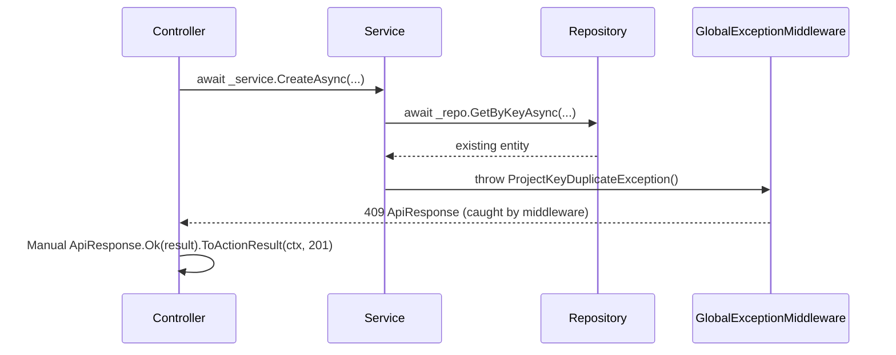
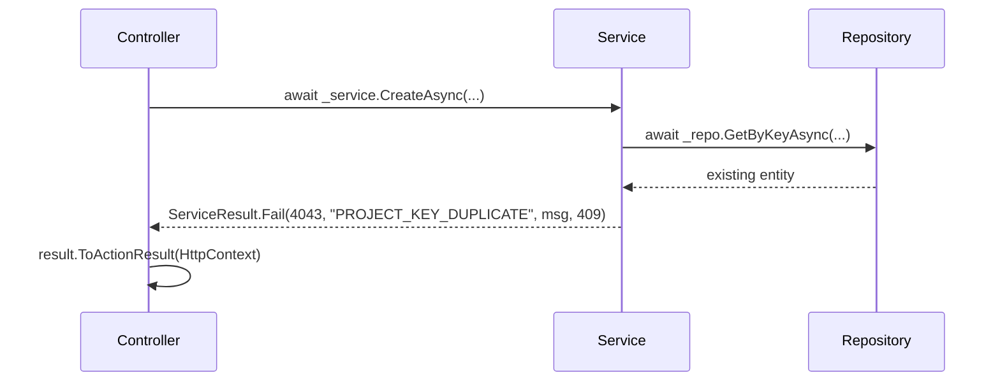

# Design Document: WorkService ServiceResult Migration

## Overview

This design migrates the WorkService from exception-driven control flow (`throw new XyzException()`) to the `ServiceResult<T>` return-value pattern already proven in BillingService, SecurityService, ProfileService, and UtilityService. The migration touches 13 service interfaces, their implementations, 18 controllers, and existing unit tests.

The core idea: service methods return `ServiceResult<T>` for expected business outcomes (not found, conflict, validation failure) instead of throwing exceptions. Controllers become one-liners that call `.ToActionResult(HttpContext)`. DomainExceptions remain for truly unexpected invariant violations thrown from repositories and deep call-stack code.

### Reference Implementation

BillingService is the canonical reference. The WorkService migration produces identical patterns:

- `ServiceResult<T>` class → exact copy from `BillingService.Domain.Results`
- `ServiceResultExtensions.ToActionResult()` → exact copy from `BillingService.Api.Extensions`
- Controller pattern → `return (await _service.Method(...)).ToActionResult(HttpContext);`

### Scope

| Category | Count | Action |
|----------|-------|--------|
| Service interfaces | 13 | Change `Task<object>` → `Task<ServiceResult<T>>` |
| Service implementations | 13 | Replace `throw` with `ServiceResult.Fail(...)` |
| Controllers | 18 | Replace manual `ApiResponse` construction with `.ToActionResult()` |
| Exception classes | 60+ | Preserved (still used by repositories/middleware) |
| Unit test files | 5+ | Update assertions from exception-catching to ServiceResult property checks |
| Excluded interfaces | 2 | `IStoryIdGenerator` (internal utility), `IActivityLogService.LogAsync` (fire-and-forget) |

---

## Architecture

### Current Flow (Exception-Based)



### Target Flow (ServiceResult-Based)



### Layer Responsibilities After Migration

```
┌─────────────────────────────────────────────────────────┐
│  Controller (thin)                                       │
│  return (await _service.Method(...)).ToActionResult();   │
│  No try/catch, no ApiResponse construction, no logic     │
└──────────────────────┬──────────────────────────────────┘
                       │
┌──────────────────────▼──────────────────────────────────┐
│  Service (business logic)                                │
│  Returns ServiceResult<T> for ALL expected outcomes      │
│  - Ok(data) / Created(data) / NoContent()               │
│  - Fail(errorValue, errorCode, message, statusCode)     │
│  Lets DomainExceptions from repos propagate upward       │
└──────────────────────┬──────────────────────────────────┘
                       │
┌──────────────────────▼──────────────────────────────────┐
│  Repository                                              │
│  Returns entities or null. Throws DomainException for    │
│  constraint violations (caught by middleware).            │
└─────────────────────────────────────────────────────────┘
```

---

## Components and Interfaces

### 1. ServiceResult\<T\> (Domain Layer)

Location: `WorkService.Domain/Results/ServiceResult.cs`

Exact copy of `BillingService.Domain.Results.ServiceResult<T>`:

```csharp
namespace WorkService.Domain.Results;

public class ServiceResult<T>
{
    public bool IsSuccess { get; init; }
    public T? Data { get; init; }
    public string? Message { get; init; }
    public int StatusCode { get; init; } = 200;
    public int? ErrorValue { get; init; }
    public string? ErrorCode { get; init; }

    public static ServiceResult<T> Ok(T data, string? message = null) => new()
    {
        IsSuccess = true, Data = data, Message = message, StatusCode = 200
    };

    public static ServiceResult<T> Created(T data, string? message = null) => new()
    {
        IsSuccess = true, Data = data, Message = message, StatusCode = 201
    };

    public static ServiceResult<T> NoContent(string? message = null) => new()
    {
        IsSuccess = true, Data = default, Message = message, StatusCode = 204
    };

    public static ServiceResult<T> Fail(int errorValue, string errorCode, string message, int statusCode = 400) => new()
    {
        IsSuccess = false, Data = default, Message = message,
        StatusCode = statusCode, ErrorValue = errorValue, ErrorCode = errorCode
    };
}
```

### 2. ToActionResult Extension (API Layer)

Location: `WorkService.Api/Extensions/ServiceResultExtensions.cs`

Exact copy of `BillingService.Api.Extensions.ServiceResultExtensions`:

```csharp
namespace WorkService.Api.Extensions;

public static class ServiceResultExtensions
{
    public static IActionResult ToActionResult<T>(this ServiceResult<T> result, HttpContext? httpContext = null)
    {
        var correlationId = httpContext?.Items["CorrelationId"]?.ToString();

        if (result is null)
        {
            var error = ApiResponse<object>.Fail(9999, "INTERNAL_ERROR", "An unexpected error occurred.");
            error.CorrelationId = correlationId;
            return new ObjectResult(error) { StatusCode = 500 };
        }

        if (!result.IsSuccess)
        {
            var error = ApiResponse<object>.Fail(
                result.ErrorValue ?? 0, result.ErrorCode ?? "INTERNAL_ERROR",
                result.Message ?? "An error occurred.");
            error.CorrelationId = correlationId;
            return new ObjectResult(error) { StatusCode = result.StatusCode };
        }

        var response = ApiResponse<T>.Ok(result.Data!, result.Message);
        response.CorrelationId = correlationId;
        return new ObjectResult(response) { StatusCode = result.StatusCode };
    }
}
```

### 3. Service Interface Changes

Each interface changes from untyped `Task<object>` to typed `Task<ServiceResult<T>>`. Example for IProjectService:

**Before:**
```csharp
Task<object> CreateAsync(Guid organizationId, Guid creatorId, object request, CancellationToken ct = default);
Task<object> GetByIdAsync(Guid projectId, CancellationToken ct = default);
```

**After:**
```csharp
Task<ServiceResult<ProjectDetailResponse>> CreateAsync(Guid organizationId, Guid creatorId, CreateProjectRequest request, CancellationToken ct = default);
Task<ServiceResult<ProjectDetailResponse>> GetByIdAsync(Guid projectId, CancellationToken ct = default);
```

Key changes across all interfaces:
- `Task<object>` → `Task<ServiceResult<SpecificDto>>` (typed return)
- `object request` → `SpecificRequestDto request` (typed input)
- `Task` (void) → `Task<ServiceResult<object>>` with `NoContent()` for void operations
- `Task<byte[]>` → `Task<ServiceResult<byte[]>>` for export methods

### 4. Exception-to-ServiceResult Conversion Rules

**Convert to ServiceResult.Fail()** — exceptions thrown directly in service implementations for expected business failures:

| Exception | ErrorCode | StatusCode | ServiceResult.Fail() |
|-----------|-----------|------------|---------------------|
| `ProjectNotFoundException` | `PROJECT_NOT_FOUND` (4041) | 404 | `Fail(4041, "PROJECT_NOT_FOUND", msg, 404)` |
| `ProjectKeyDuplicateException` | `PROJECT_KEY_DUPLICATE` (4043) | 409 | `Fail(4043, "PROJECT_KEY_DUPLICATE", msg, 409)` |
| `ProjectKeyInvalidFormatException` | `PROJECT_KEY_INVALID_FORMAT` (4045) | 400 | `Fail(4045, "PROJECT_KEY_INVALID_FORMAT", msg, 400)` |
| `ProjectNameDuplicateException` | `PROJECT_NAME_DUPLICATE` (4042) | 409 | `Fail(4042, "PROJECT_NAME_DUPLICATE", msg, 409)` |
| `ProjectKeyImmutableException` | `PROJECT_KEY_IMMUTABLE` (4044) | 400 | `Fail(4044, "PROJECT_KEY_IMMUTABLE", msg, 400)` |
| `StoryNotFoundException` | `STORY_NOT_FOUND` (4001) | 404 | `Fail(4001, "STORY_NOT_FOUND", msg, 404)` |
| `InvalidStoryTransitionException` | `INVALID_STORY_TRANSITION` (4004) | 400 | `Fail(4004, "INVALID_STORY_TRANSITION", msg, 400)` |
| `StoryRequiresAssigneeException` | `STORY_REQUIRES_ASSIGNEE` (4013) | 400 | `Fail(4013, "STORY_REQUIRES_ASSIGNEE", msg, 400)` |
| `TaskNotFoundException` | `TASK_NOT_FOUND` (4002) | 404 | `Fail(4002, "TASK_NOT_FOUND", msg, 404)` |
| `InvalidTaskTransitionException` | `INVALID_TASK_TRANSITION` (4005) | 400 | `Fail(4005, "INVALID_TASK_TRANSITION", msg, 400)` |
| `AssigneeNotInDepartmentException` | `ASSIGNEE_NOT_IN_DEPARTMENT` (4018) | 400 | `Fail(4018, "ASSIGNEE_NOT_IN_DEPARTMENT", msg, 400)` |
| `AssigneeAtCapacityException` | `ASSIGNEE_AT_CAPACITY` (4019) | 400 | `Fail(4019, "ASSIGNEE_AT_CAPACITY", msg, 400)` |
| `SprintNotFoundException` | `SPRINT_NOT_FOUND` (4003) | 404 | `Fail(4003, "SPRINT_NOT_FOUND", msg, 404)` |
| `SprintOverlapException` | `SPRINT_OVERLAP` (4009) | 409 | `Fail(4009, "SPRINT_OVERLAP", msg, 409)` |
| `SprintAlreadyActiveException` | `SPRINT_ALREADY_ACTIVE` (4021) | 400 | `Fail(4021, "SPRINT_ALREADY_ACTIVE", msg, 400)` |
| `SprintAlreadyCompletedException` | `SPRINT_ALREADY_COMPLETED` (4022) | 400 | `Fail(4022, "SPRINT_ALREADY_COMPLETED", msg, 400)` |
| `CommentNotFoundException` | `COMMENT_NOT_FOUND` (4012) | 404 | `Fail(4012, "COMMENT_NOT_FOUND", msg, 404)` |
| `CommentNotAuthorException` | `COMMENT_NOT_AUTHOR` (4017) | 403 | `Fail(4017, "COMMENT_NOT_AUTHOR", msg, 403)` |
| `LabelNameDuplicateException` | `LABEL_NAME_DUPLICATE` (4011) | 409 | `Fail(4011, "LABEL_NAME_DUPLICATE", msg, 409)` |
| `LabelNotFoundException` | `LABEL_NOT_FOUND` (4010) | 404 | `Fail(4010, "LABEL_NOT_FOUND", msg, 404)` |
| `SearchQueryTooShortException` | `SEARCH_QUERY_TOO_SHORT` (4028) | 400 | `Fail(4028, "SEARCH_QUERY_TOO_SHORT", msg, 400)` |
| `TimeEntryNotFoundException` | `TIME_ENTRY_NOT_FOUND` (4052) | 404 | `Fail(4052, "TIME_ENTRY_NOT_FOUND", msg, 404)` |
| `DailyHoursExceededException` | `DAILY_HOURS_EXCEEDED` (4056) | 400 | `Fail(4056, "DAILY_HOURS_EXCEEDED", msg, 400)` |
| `CostRateDuplicateException` | `COST_RATE_DUPLICATE` (4053) | 409 | `Fail(4053, "COST_RATE_DUPLICATE", msg, 409)` |
| `TimerAlreadyActiveException` | `TIMER_ALREADY_ACTIVE` (4050) | 400 | `Fail(4050, "TIMER_ALREADY_ACTIVE", msg, 400)` |
| `NoActiveTimerException` | `NO_ACTIVE_TIMER` (4051) | 404 | `Fail(4051, "NO_ACTIVE_TIMER", msg, 404)` |
| `InvalidAnalyticsParameterException` | `INVALID_ANALYTICS_PARAMETER` (4060) | 400 | `Fail(4060, "INVALID_ANALYTICS_PARAMETER", msg, 400)` |
| `SnapshotGenerationFailedException` | `SNAPSHOT_GENERATION_FAILED` (4065) | 500 | `Fail(4065, "SNAPSHOT_GENERATION_FAILED", msg, 500)` |
| `RiskNotFoundException` | `RISK_NOT_FOUND` (4064) | 404 | `Fail(4064, "RISK_NOT_FOUND", msg, 404)` |

**Keep as DomainException (NOT converted)** — exceptions thrown from repositories, validators, or deep call-stack code:

- All exceptions thrown by `TenantScopedRepository` (constraint violations → `ConflictException`)
- `StorySequenceInitFailedException` (thrown from `StoryIdGenerator` internals)
- `OrganizationMismatchException` (thrown from authorization checks in repositories)
- `DepartmentAccessDeniedException` (thrown from authorization middleware/filters)
- `InsufficientPermissionsException` (thrown from authorization middleware/filters)
- `RateLimitExceededException` (thrown from rate limiter middleware)
- Any exception from `IOutboxService` (infrastructure failure)

**Rule of thumb:** If the exception is thrown in a service method's own business logic (the service itself decides to throw), convert it to `ServiceResult.Fail()`. If it's thrown from a dependency the service calls (repository, middleware, external client), let it propagate to `GlobalExceptionHandlerMiddleware`.

### 5. Controller Simplification Pattern

**Before (current WorkService pattern):**
```csharp
[HttpPost]
public async Task<IActionResult> Create([FromBody] CreateProjectRequest request, CancellationToken ct)
{
    var orgId = GetOrganizationId();
    var userId = GetUserId();
    var result = await _projectService.CreateAsync(orgId, userId, request, ct);
    return ApiResponse<object>.Ok(result, "Project created successfully.").ToActionResult(HttpContext, 201);
}
```

**After (target pattern — matches BillingService):**
```csharp
[HttpPost]
public async Task<IActionResult> Create([FromBody] CreateProjectRequest request, CancellationToken ct)
{
    var orgId = GetOrganizationId();
    var userId = GetUserId();
    return (await _projectService.CreateAsync(orgId, userId, request, ct)).ToActionResult(HttpContext);
}
```

Key differences:
- No manual `ApiResponse<object>.Ok(...)` construction — the service sets the message and status code
- No explicit status code parameter (201) — `ServiceResult.Created()` sets `StatusCode = 201`
- No `null!` for void operations — service returns `ServiceResult.NoContent()`
- The controller is a pure pass-through

### 6. SavedFilterController Special Case

`SavedFilterController` currently calls `ISavedFilterRepository` directly, bypassing the service layer. This violates the thin-controller pattern. The migration introduces a new `ISavedFilterService` / `SavedFilterService` to wrap the repository calls, then the controller follows the standard one-liner pattern.

### 7. Migration Order

The migration is organized into 5 groups, ordered by dependency and complexity:

**Group 1 — Foundation (no service dependencies)**
1. `ServiceResult<T>` class creation
2. `ServiceResultExtensions.ToActionResult()` creation

**Group 2 — Core CRUD Services (most methods, most tests)**
3. `IProjectService` / `ProjectService` / `ProjectController`
4. `IStoryService` / `StoryService` / `StoryController` + `StoryTaskController`
5. `ITaskService` / `TaskService` / `TaskController`
6. `ISprintService` / `SprintService` / `SprintController`

**Group 3 — Supporting Services (fewer methods, simpler logic)**
7. `ICommentService` / `CommentService` / `CommentController`
8. `ILabelService` / `LabelService` / `LabelController`
9. `ISearchService` / `SearchService` / `SearchController`
10. `IBoardService` / `BoardService` / `BoardController`
11. `IReportService` / `ReportService` / `ReportController`
12. `IWorkflowService` / `WorkflowService` / `WorkflowController`

**Group 4 — Time Tracking Services**
13. `ITimeEntryService` / `TimeEntryService` / `TimeEntryController`
14. `ITimePolicyService` / `TimePolicyService` / `TimePolicyController`
15. `ICostRateService` / `CostRateService` / `CostRateController`
16. `ITimerSessionService` / `TimerSessionService` (used by TimeEntryController)

**Group 5 — Analytics, Risk, Templates, Export, SavedFilter**
17. `IAnalyticsService` / `AnalyticsService` / `AnalyticsController`
18. `IAnalyticsSnapshotService` / `AnalyticsSnapshotService` (used by AnalyticsController)
19. `ICostSnapshotService` / `CostSnapshotService` (used by ProjectController)
20. `IRiskRegisterService` / `RiskRegisterService` / `RiskRegisterController`
21. `IStoryTemplateService` / `StoryTemplateService` / `StoryTemplateController`
22. `IExportService` / `ExportService` (used by ProjectController)
23. `ISavedFilterService` (new) / `SavedFilterService` (new) / `SavedFilterController`

Each step within a group is an atomic unit: interface + implementation + controller + test updates. The system compiles and all tests pass after each step.

---

## Data Models

### ServiceResult\<T\> Properties

| Property | Type | Description |
|----------|------|-------------|
| `IsSuccess` | `bool` | Whether the operation succeeded |
| `Data` | `T?` | The typed response payload (null on failure or NoContent) |
| `Message` | `string?` | Human-readable message for the response envelope |
| `StatusCode` | `int` | HTTP status code (default 200) |
| `ErrorValue` | `int?` | Numeric error code for programmatic handling |
| `ErrorCode` | `string?` | Machine-readable error code string |

### Factory Method → Property Mapping

| Factory | IsSuccess | StatusCode | Data | ErrorValue | ErrorCode |
|---------|-----------|------------|------|------------|-----------|
| `Ok(data, msg)` | `true` | 200 | `data` | `null` | `null` |
| `Created(data, msg)` | `true` | 201 | `data` | `null` | `null` |
| `NoContent(msg)` | `true` | 204 | `default` | `null` | `null` |
| `Fail(ev, ec, msg, sc)` | `false` | `sc` | `default` | `ev` | `ec` |

### Interfaces Excluded from Migration

| Interface | Reason |
|-----------|--------|
| `IStoryIdGenerator` | Returns typed tuple `(string StoryKey, long SequenceNumber)` — internal utility, not in controller response flow |
| `IActivityLogService.LogAsync` | Fire-and-forget void method — no caller inspects the result |
| `IActivityLogService.GetByEntityAsync` | Returns `Task<object>` — this WILL be migrated |
| `IActivityLogService.GetOrganizationFeedAsync` | Returns `Task<object>` — this WILL be migrated |
| `IOutboxService` | Infrastructure concern — not in controller response flow |
| `IErrorCodeResolverService` | Infrastructure concern — used by middleware |
| `IDependencyAnalyzer` | Internal analytics utility |
| `IHealthScoreCalculator` | Internal analytics utility |
| `ICostRateResolver` | Internal cost calculation utility |

---

## Correctness Properties

*A property is a characteristic or behavior that should hold true across all valid executions of a system — essentially, a formal statement about what the system should do. Properties serve as the bridge between human-readable specifications and machine-verifiable correctness guarantees.*

### Property 1: ServiceResult factory methods produce correct state

*For any* typed data value `T`, any message string, any error value, any error code, and any status code, calling the corresponding `ServiceResult<T>` factory method (`Ok`, `Created`, `NoContent`, `Fail`) SHALL produce an instance where `IsSuccess`, `StatusCode`, `Data`, `ErrorValue`, and `ErrorCode` match the expected values for that factory method.

**Validates: Requirements 1.3, 1.4, 1.5, 1.6, 1.7**

### Property 2: ToActionResult conversion preserves ServiceResult semantics

*For any* `ServiceResult<T>` instance (whether success or failure), calling `ToActionResult(httpContext)` SHALL produce an `ObjectResult` whose `StatusCode` equals the ServiceResult's `StatusCode`, and whose `Value` is an `ApiResponse` with `Success` matching `IsSuccess`, `Data` matching the ServiceResult's `Data` on success, and `ErrorCode`/`ErrorValue` matching on failure.

**Validates: Requirements 2.2, 2.3, 2.5**

### Property 3: Invalid project key format rejection

*For any* string that does not match the pattern `^[A-Z0-9]{2,10}$`, calling `ProjectService.CreateAsync` with that string as the project key SHALL return a `ServiceResult` with `IsSuccess = false`, `ErrorCode = "PROJECT_KEY_INVALID_FORMAT"`, and `StatusCode = 400`.

**Validates: Requirements 3.4**

### Property 4: Invalid story status transition rejection

*For any* story with a current status and *any* target status that is not a valid transition from the current status, calling `StoryService.TransitionStatusAsync` SHALL return a `ServiceResult` with `IsSuccess = false`, `ErrorCode = "INVALID_STORY_TRANSITION"`, and `StatusCode = 400`.

**Validates: Requirements 4.3**

### Property 5: Bulk operation success/failure counting

*For any* list of story IDs where some exist and some do not, calling `StoryService.BulkUpdateStatusAsync` SHALL return a `ServiceResult` with `IsSuccess = true` and a response where the success count plus the failure count equals the total number of input story IDs.

**Validates: Requirements 4.5**

### Property 6: Invalid task status transition rejection

*For any* task with a current status and *any* target status that is not a valid transition from the current status, calling `TaskService.TransitionStatusAsync` SHALL return a `ServiceResult` with `IsSuccess = false`, `ErrorCode = "INVALID_TASK_TRANSITION"`, and `StatusCode = 400`.

**Validates: Requirements 5.3**

### Property 7: Sprint date overlap detection

*For any* two sprint date ranges within the same project where the ranges overlap (start1 < end2 AND start2 < end1), calling `SprintService.CreateAsync` with the second range SHALL return a `ServiceResult` with `IsSuccess = false`, `ErrorCode = "SPRINT_OVERLAP"`, and `StatusCode = 409`.

**Validates: Requirements 6.3**

### Property 8: Short search query rejection

*For any* search query string shorter than the minimum required length, calling `SearchService.SearchAsync` SHALL return a `ServiceResult` with `IsSuccess = false`, `ErrorCode = "SEARCH_QUERY_TOO_SHORT"`, and `StatusCode = 400`.

**Validates: Requirements 9.2**

### Property 9: Daily hours exceeded rejection

*For any* time entry hours value that, when added to existing logged hours for the same user and date, exceeds the daily maximum, calling `TimeEntryService.CreateAsync` SHALL return a `ServiceResult` with `IsSuccess = false`, `ErrorCode = "DAILY_HOURS_EXCEEDED"`, and `StatusCode = 400`.

**Validates: Requirements 11.3**

---

## Error Handling

### Three-Layer Error Strategy (Unchanged)

The existing three-layer error strategy remains intact. The migration only changes WHERE errors are expressed, not HOW they flow:

| Layer | Before Migration | After Migration |
|-------|-----------------|-----------------|
| **ServiceResult\<T\>** | Not used in WorkService | All expected business failures |
| **DomainException** | All business failures + invariant violations | Only invariant violations from repos/deep code |
| **GlobalExceptionHandlerMiddleware** | Catches everything | Still catches DomainExceptions + unexpected errors |

### Error Flow After Migration

```
Expected business failure (service logic):
  Service → ServiceResult.Fail(...) → Controller → ToActionResult() → HTTP 4xx

Invariant violation (repository/deep code):
  Repository → throw DomainException → GlobalExceptionHandlerMiddleware → HTTP 4xx

Unexpected error:
  Any layer → throw Exception → GlobalExceptionHandlerMiddleware → HTTP 500
```

### What Does NOT Change

- `GlobalExceptionHandlerMiddleware` pipeline position and behavior
- `CorrelationIdMiddleware` injection
- `ErrorResponseLoggingMiddleware` for 5xx logging
- `ApiResponse<T>` envelope structure
- `ErrorCodes` static class (all constants remain)
- All `DomainException` subclasses in `WorkService.Domain.Exceptions` (preserved for repository use)
- FluentValidation pipeline (422 responses before controller runs)
- Authorization attributes (`[OrgAdmin]`, `[DeptLead]`, etc.)

---

## Testing Strategy

### Dual Testing Approach

- **Unit tests (example-based):** Verify specific scenarios — not-found returns 404, duplicate returns 409, successful create returns 201, etc.
- **Property tests (property-based):** Verify universal properties — factory methods always produce correct state, ToActionResult always preserves semantics, invalid inputs always rejected.

### Property-Based Testing

Library: **FsCheck.Xunit** (already used in `WorkService.Tests/Properties/` and `WorkService.Tests/Property/`)

Configuration: Minimum 100 iterations per property test.

Tag format: `Feature: workservice-serviceresult, Property {number}: {property_text}`

Each correctness property from the design maps to a single property-based test:

| Property | Test File | What's Generated |
|----------|-----------|-----------------|
| P1: Factory method correctness | `ServiceResultPropertyTests.cs` | Random data values, messages, error codes, status codes |
| P2: ToActionResult conversion | `ServiceResultExtensionsPropertyTests.cs` | Random ServiceResult instances (success + failure) |
| P3: Invalid project key rejection | `ProjectServicePropertyTests.cs` | Random strings not matching `^[A-Z0-9]{2,10}$` |
| P4: Invalid story transition | `StoryServicePropertyTests.cs` | Random invalid status transition pairs |
| P5: Bulk operation counting | `StoryServicePropertyTests.cs` | Random lists of story IDs with mixed existence |
| P6: Invalid task transition | `TaskServicePropertyTests.cs` | Random invalid task status transition pairs |
| P7: Sprint date overlap | `SprintServicePropertyTests.cs` | Random overlapping date range pairs |
| P8: Short search query | `SearchServicePropertyTests.cs` | Random strings below minimum length |
| P9: Daily hours exceeded | `TimeEntryServicePropertyTests.cs` | Random hours values exceeding daily limit |

### Unit Test Update Strategy

Existing tests in `WorkService.Tests/Services/` follow this pattern:

**Before:**
```csharp
await Assert.ThrowsAsync<ProjectKeyDuplicateException>(
    () => _sut.CreateAsync(_orgId, _creatorId, request));
```

**After:**
```csharp
var result = await _sut.CreateAsync(_orgId, _creatorId, request);
Assert.False(result.IsSuccess);
Assert.Equal(409, result.StatusCode);
Assert.Equal("PROJECT_KEY_DUPLICATE", result.ErrorCode);
```

**Before (success):**
```csharp
var result = await _sut.CreateAsync(_orgId, _creatorId, request);
Assert.NotNull(result);
```

**After (success):**
```csharp
var result = await _sut.CreateAsync(_orgId, _creatorId, request);
Assert.True(result.IsSuccess);
Assert.Equal(201, result.StatusCode);
Assert.NotNull(result.Data);
```

### Test Files Requiring Updates

| Test File | Changes |
|-----------|---------|
| `Services/ProjectServiceTests.cs` | Exception assertions → ServiceResult assertions |
| `Services/StoryServiceTests.cs` | Exception assertions → ServiceResult assertions |
| `Services/TaskServiceTests.cs` | Exception assertions → ServiceResult assertions |
| `Services/SprintServiceTests.cs` | Exception assertions → ServiceResult assertions |
| `Services/ErrorCodeResolverTests.cs` | No changes (tests middleware, not services) |
| `Helpers/WorkflowStateMachineTests.cs` | No changes (tests internal helper) |
| `Helpers/TaskTypeDepartmentMapTests.cs` | No changes (tests internal helper) |
| `Validators/FluentValidationTests.cs` | No changes (tests validation pipeline) |
| `Middleware/MiddlewareTests.cs` | No changes (tests middleware) |
| `Properties/*.cs` | No changes (tests internal utilities) |
| `Property/ApiResponseExtensionsPropertyTests.cs` | No changes (tests ApiResponse, not ServiceResult) |
