# Nexus-2.0 — Enterprise Agile Microservices Platform — Full Specification

> **Version:** 1.0  
> **Architecture:** Clean Architecture (.NET 8)  
> **Target:** Standalone build specification — no access to any existing codebase required.

---

## Table of Contents

1. [Overview](#1-overview)
2. [Architecture](#2-architecture)
3. [Clean Architecture Layer Definitions](#3-clean-architecture-layer-definitions)
4. [SecurityService Specification](#4-securityservice-specification)
5. [ProfileService Specification](#5-profileservice-specification)
6. [WorkService Specification](#6-workservice-specification)
7. [UtilityService Specification](#7-utilityservice-specification)
8. [Cross-Cutting Patterns](#8-cross-cutting-patterns)
9. [Data Models](#9-data-models)
10. [Configuration](#10-configuration)
11. [Testing Strategy](#11-testing-strategy)
12. [Key Workflows](#12-key-workflows)

---

## 1. Overview

### 1.1 Platform Purpose and Scope

Nexus-2.0 is an enterprise Agile microservices platform implementing story-driven development workflow management. The platform enables organizations to manage their entire Agile lifecycle — from story creation with professional ID systems through task breakdown, department-based assignment, sprint planning, and delivery tracking.

Key capabilities:
- **Authentication & Security** — JWT-based auth, department-aware RBAC, session management, OTP, rate limiting, anomaly detection
- **Profile & Organization** — Organization management, department hierarchy, team member profiles, skills tracking, availability, invitation system
- **Work Management** — Story management with professional IDs (e.g., NEXUS-1234), task breakdown with department-based assignment, sprint planning, kanban boards, activity feeds, comments with @mentions, full-text search
- **Utility & Operations** — Audit logging, error tracking with PII redaction, notification dispatch (SMS/email/push), reference data, retention archival

### 1.2 Multi-Tenant Architecture Overview

The platform enforces organization-level isolation at every layer:

- **Database level:** EF Core global query filters automatically scope all queries by `OrganizationId`
- **API level:** `OrganizationScopeMiddleware` extracts `organizationId` from JWT claims and validates against route/query parameters
- **Entity level:** All organization-scoped entities implement `IOrganizationEntity` interface
- **Inter-service level:** `X-Organization-Id` header propagated on all service-to-service calls

Hierarchy: **Organization → Departments → Team Members**

An Organization is the top-level tenant. Each Organization has Departments (Engineering, QA, DevOps, Product, Design, and custom departments). Each Department has Team Members with department-scoped roles (OrgAdmin, DeptLead, Member, Viewer).

### 1.3 Service Decomposition

| Service | Port | Database | Responsibility |
|---------|------|----------|----------------|
| SecurityService | 5001 | `nexus_security` | Authentication, JWT, sessions, department-aware RBAC, rate limiting, OTP, password management, anomaly detection, service-to-service auth |
| ProfileService | 5002 | `nexus_profile` | Organizations, departments, team members, roles, invites, devices, notification settings, story ID prefix configuration |
| WorkService | 5003 | `nexus_work` | Stories (with professional IDs), tasks, sprints, boards, activity feeds, comments, labels, search |
| UtilityService | 5200 | `nexus_utility` | Audit logs, error logs, notifications, error code registry, reference data, retention archival |

Each service owns its own PostgreSQL database and shares a Redis cluster for caching, rate limiting, sessions, outbox messaging, and token blacklisting.

### 1.4 Professional Story ID System

A key differentiator of Nexus-2.0 is the professional story ID system. Each organization configures a prefix (e.g., `NEXUS`, `ACME`, `PROJ`), and stories are assigned sequential IDs in the format `{PREFIX}-{auto_increment}`:

- `NEXUS-1`, `NEXUS-2`, `NEXUS-3`, ...
- `ACME-1`, `ACME-2`, ...

The prefix is configurable per organization and stored in the Organization entity. The auto-increment counter is maintained per organization using a database sequence, ensuring gap-free, monotonically increasing IDs even under concurrent story creation.

### 1.5 Department-Based Assignment

Tasks are assigned based on department mapping:

| Task Type | Default Department |
|-----------|-------------------|
| Development | Engineering |
| Testing | QA |
| DevOps | DevOps |
| Design | Design |
| Documentation | Product |
| Bug | Engineering |

Auto-assignment suggestions consider department membership, current workload (active task count), and availability status.

---

## 2. Architecture

### 2.1 Clean Architecture Layer Structure

Each service is composed of four .NET projects:

```
{Service}.Domain/          — Entities, value objects, exceptions, error codes, interfaces
{Service}.Application/     — DTOs, validators, service interfaces, use-case orchestration
{Service}.Infrastructure/  — EF Core, Redis, HTTP clients, repository implementations
{Service}.Api/             — Controllers, middleware, Program.cs, DI composition root
```

### 2.2 High-Level Architecture Diagram

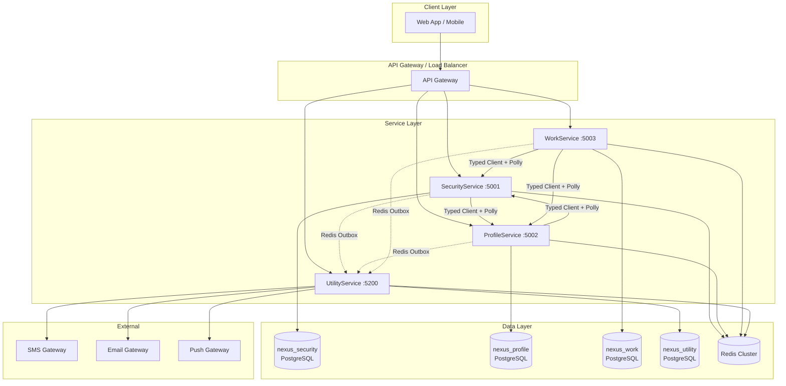
```mermaid
graph TB
    subgraph "Client Layer"
        WEB[Web App / Mobile]
    end

    subgraph "API Gateway / Load Balancer"
        GW[API Gateway]
    end

    subgraph "Service Layer"
        SEC[SecurityService :5001]
        PRO[ProfileService :5002]
        WRK[WorkService :5003]
        UTL[UtilityService :5200]
    end

    subgraph "Data Layer"
        DB_SEC[(nexus_security<br/>PostgreSQL)]
        DB_PRO[(nexus_profile<br/>PostgreSQL)]
        DB_WRK[(nexus_work<br/>PostgreSQL)]
        DB_UTL[(nexus_utility<br/>PostgreSQL)]
        REDIS[(Redis Cluster)]
    end

    subgraph "External"
        SMS[SMS Gateway]
        EMAIL[Email Gateway]
        PUSH[Push Gateway]
    end

    WEB --> GW
    GW --> SEC
    GW --> PRO
    GW --> WRK
    GW --> UTL

    SEC -->|Typed Client + Polly| PRO
    PRO -->|Typed Client + Polly| SEC
    WRK -->|Typed Client + Polly| PRO
    WRK -->|Typed Client + Polly| SEC
    SEC -.->|Redis Outbox| UTL
    PRO -.->|Redis Outbox| UTL
    WRK -.->|Redis Outbox| UTL

    SEC --> DB_SEC
    PRO --> DB_PRO
    WRK --> DB_WRK
    UTL --> DB_UTL

    SEC --> REDIS
    PRO --> REDIS
    WRK --> REDIS
    UTL --> REDIS

    UTL --> SMS
    UTL --> EMAIL
    UTL --> PUSH
```

### 2.3 Inter-Service Communication Patterns

**Synchronous:** Typed service client interfaces (`IProfileServiceClient`, `ISecurityServiceClient`) with:
- Polly resilience policies (retry 3x exponential, circuit breaker 5/30s, timeout 10s)
- `CorrelationIdDelegatingHandler` for trace propagation
- Automatic service-to-service JWT attachment and refresh
- Downstream error deserialization and propagation as `DomainException`

**Asynchronous:** Redis outbox pattern for audit events and notifications:
- Each service publishes to its own outbox queue (`outbox:{service}`)
- UtilityService polls all queues via `OutboxProcessorHostedService`
- Dead-letter retry with exponential backoff

### 2.4 Data Stores

| Store | Purpose |
|-------|---------|
| PostgreSQL (per service) | Primary data store, EF Core with Npgsql |
| Redis (shared cluster) | Sessions, rate limiting, token blacklist, caching, outbox queues, OTP storage, story ID counter cache |

---

## 3. Clean Architecture Layer Definitions

### 3.1 Domain Layer (`{Service}.Domain`)

**What goes here:**
- Entity classes (e.g., `Organization`, `Story`, `Task`, `Sprint`)
- Value objects
- Domain exception classes (`DomainException` base + subclasses)
- Error code constants (`ErrorCodes` static class)
- Enums and helper constants (e.g., `RoleNames`, `DepartmentTypes`, `StoryStatuses`, `TaskTypes`)
- Repository interfaces (e.g., `IStoryRepository`, `ISprintRepository`)
- Domain service interfaces (e.g., `IAuthService`, `IStoryIdGenerator`)
- `IOrganizationEntity` marker interface

**Dependency rules:**
- Zero `ProjectReference` entries
- Zero ASP.NET Core or EF Core package references
- Target: `net8.0`

**Example folder structure (WorkService):**
```
WorkService.Domain/
├── Entities/
│   ├── Story.cs
│   ├── Task.cs
│   ├── Sprint.cs
│   ├── SprintStory.cs
│   ├── Comment.cs
│   ├── ActivityLog.cs
│   ├── Label.cs
│   └── StoryLabel.cs
├── Exceptions/
│   ├── DomainException.cs
│   ├── ErrorCodes.cs
│   ├── StoryNotFoundException.cs
│   ├── InvalidStateTransitionException.cs
│   └── SprintCapacityExceededException.cs
├── Interfaces/
│   ├── Repositories/
│   │   ├── IStoryRepository.cs
│   │   ├── ITaskRepository.cs
│   │   ├── ISprintRepository.cs
│   │   └── ICommentRepository.cs
│   └── Services/
│       ├── IStoryIdGenerator.cs
│       ├── IStoryService.cs
│       ├── ITaskService.cs
│       └── ISprintService.cs
├── Enums/
│   ├── StoryStatus.cs
│   ├── TaskStatus.cs
│   ├── TaskType.cs
│   ├── Priority.cs
│   └── SprintStatus.cs
├── Helpers/
│   ├── RoleNames.cs
│   ├── DepartmentTypes.cs
│   └── WorkflowStateMachine.cs
└── Common/
    └── IOrganizationEntity.cs
```

**NuGet restrictions:** None allowed except pure .NET Standard/8 libraries (no framework dependencies).

### 3.2 Application Layer (`{Service}.Application`)

**What goes here:**
- DTOs (request/response classes)
- `ApiResponse<T>` envelope class
- FluentValidation validator classes
- Application-level service interfaces (use-case orchestration)
- Inter-service contract DTOs (typed request/response for downstream calls)

**Dependency rules:**
- References only `{Service}.Domain`
- No ASP.NET Core hosting, EF Core, or infrastructure packages

**Example folder structure (WorkService):**
```
WorkService.Application/
├── DTOs/
│   ├── ApiResponse.cs
│   ├── ErrorDetail.cs
│   ├── Stories/
│   │   ├── CreateStoryRequest.cs
│   │   ├── CreateStoryResponse.cs
│   │   ├── UpdateStoryRequest.cs
│   │   ├── StoryDetailResponse.cs
│   │   └── StoryListResponse.cs
│   ├── Tasks/
│   │   ├── CreateTaskRequest.cs
│   │   ├── UpdateTaskRequest.cs
│   │   └── TaskDetailResponse.cs
│   ├── Sprints/
│   │   ├── CreateSprintRequest.cs
│   │   ├── SprintDetailResponse.cs
│   │   └── SprintMetricsResponse.cs
│   ├── Comments/
│   │   ├── CreateCommentRequest.cs
│   │   └── CommentResponse.cs
│   ├── Boards/
│   │   ├── KanbanBoardResponse.cs
│   │   ├── BacklogResponse.cs
│   │   └── DepartmentBoardResponse.cs
│   └── Search/
│       ├── SearchRequest.cs
│       └── SearchResponse.cs
├── Contracts/
│   ├── TeamMemberResponse.cs
│   ├── DepartmentResponse.cs
│   └── OrganizationSettingsResponse.cs
├── Validators/
│   ├── CreateStoryRequestValidator.cs
│   ├── CreateTaskRequestValidator.cs
│   ├── CreateSprintRequestValidator.cs
│   └── CreateCommentRequestValidator.cs
└── WorkService.Application.csproj
```

**Allowed NuGet packages:** `FluentValidation` (no `.AspNetCore` variant).

### 3.3 Infrastructure Layer (`{Service}.Infrastructure`)

**What goes here:**
- EF Core `DbContext` class
- EF Core migration files
- Repository implementations
- Service implementations (Redis, HTTP clients, JWT, etc.)
- Typed service client implementations (`ProfileServiceClient`, etc.)
- Configuration classes (`AppSettings`, `JwtConfig`, `DatabaseMigrationHelper`)
- DI extension methods for infrastructure registration

**Dependency rules:**
- References `{Service}.Domain` and `{Service}.Application`
- Contains infrastructure-specific NuGet packages

**Example folder structure (WorkService):**
```
WorkService.Infrastructure/
├── Data/
│   ├── WorkDbContext.cs
│   └── Migrations/
├── Repositories/
│   ├── StoryRepository.cs
│   ├── TaskRepository.cs
│   ├── SprintRepository.cs
│   └── CommentRepository.cs
├── Services/
│   ├── Stories/
│   │   ├── StoryService.cs
│   │   └── StoryIdGenerator.cs
│   ├── Tasks/
│   │   └── TaskService.cs
│   ├── Sprints/
│   │   └── SprintService.cs
│   ├── Search/
│   │   └── SearchService.cs
│   ├── ServiceClients/
│   │   ├── IProfileServiceClient.cs
│   │   ├── ProfileServiceClient.cs
│   │   ├── ISecurityServiceClient.cs
│   │   └── SecurityServiceClient.cs
│   ├── ErrorCodeResolver/
│   │   └── ErrorCodeResolverService.cs
│   └── Outbox/
│       └── OutboxService.cs
├── Configuration/
│   ├── AppSettings.cs
│   ├── JwtConfig.cs
│   ├── DatabaseMigrationHelper.cs
│   └── DependencyInjection.cs
└── WorkService.Infrastructure.csproj
```

**Allowed NuGet packages:**
- `Npgsql.EntityFrameworkCore.PostgreSQL`
- `StackExchange.Redis`
- `Microsoft.Extensions.Http.Polly`
- `Polly`
- `Microsoft.AspNetCore.Authentication.JwtBearer`
- Health check packages

### 3.4 Api Layer (`{Service}.Api`)

**What goes here:**
- Controllers
- Middleware classes (all ASP.NET Core pipeline middleware)
- Custom authorization attributes
- `Program.cs` (composition root)
- Swagger configuration
- Health check endpoint registration
- CORS configuration
- Middleware pipeline ordering
- `Dockerfile`, `.env`, `.env.example`

**Dependency rules:**
- References `{Service}.Application` and `{Service}.Infrastructure`
- Serves as the composition root where all DI registrations are wired

**Example folder structure (WorkService):**
```
WorkService.Api/
├── Controllers/
│   ├── StoryController.cs
│   ├── TaskController.cs
│   ├── SprintController.cs
│   ├── CommentController.cs
│   ├── BoardController.cs
│   ├── LabelController.cs
│   └── SearchController.cs
├── Middleware/
│   ├── CorrelationIdMiddleware.cs
│   ├── GlobalExceptionHandlerMiddleware.cs
│   ├── JwtClaimsMiddleware.cs
│   ├── TokenBlacklistMiddleware.cs
│   ├── RoleAuthorizationMiddleware.cs
│   ├── OrganizationScopeMiddleware.cs
│   └── CorrelationIdDelegatingHandler.cs
├── Attributes/
│   ├── OrgAdminAttribute.cs
│   ├── DeptLeadAttribute.cs
│   └── ServiceAuthAttribute.cs
├── Extensions/
│   ├── MiddlewarePipelineExtensions.cs
│   ├── ControllerServiceExtensions.cs
│   ├── SwaggerServiceExtensions.cs
│   └── HealthCheckExtensions.cs
├── Program.cs
├── Dockerfile
├── .env
├── .env.example
└── WorkService.Api.csproj
```

---

## 4. SecurityService Specification

SecurityService handles all authentication, authorization, and security concerns. It does NOT own user records — ProfileService is the single source of truth for TeamMember data. SecurityService resolves user identity by calling ProfileService via service-to-service JWT, with a 15-minute Redis cache.

### 4.1 Authentication Flow

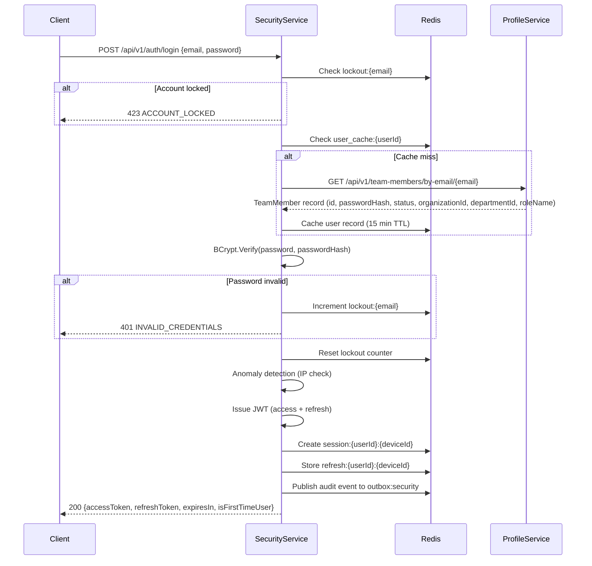
```mermaid
sequenceDiagram
    participant Client
    participant SecurityService
    participant Redis
    participant ProfileService

    Client->>SecurityService: POST /api/v1/auth/login {email, password}
    SecurityService->>Redis: Check lockout:{email}
    alt Account locked
        SecurityService-->>Client: 423 ACCOUNT_LOCKED
    end
    SecurityService->>Redis: Check user_cache:{userId}
    alt Cache miss
        SecurityService->>ProfileService: GET /api/v1/team-members/by-email/{email}
        ProfileService-->>SecurityService: TeamMember record (id, passwordHash, status, organizationId, departmentId, roleName)
        SecurityService->>Redis: Cache user record (15 min TTL)
    end
    SecurityService->>SecurityService: BCrypt.Verify(password, passwordHash)
    alt Password invalid
        SecurityService->>Redis: Increment lockout:{email}
        SecurityService-->>Client: 401 INVALID_CREDENTIALS
    end
    SecurityService->>Redis: Reset lockout counter
    SecurityService->>SecurityService: Anomaly detection (IP check)
    SecurityService->>SecurityService: Issue JWT (access + refresh)
    SecurityService->>Redis: Create session:{userId}:{deviceId}
    SecurityService->>Redis: Store refresh:{userId}:{deviceId}
    SecurityService->>Redis: Publish audit event to outbox:security
    SecurityService-->>Client: 200 {accessToken, refreshToken, expiresIn, isFirstTimeUser}
```

### 4.2 JWT Claims (Department-Aware)

| Claim | Type | Description |
|-------|------|-------------|
| `userId` | `Guid` | Team member ID |
| `organizationId` | `Guid` | Organization (tenant) ID |
| `departmentId` | `Guid` | Primary department ID |
| `roleName` | `string` | `OrgAdmin`, `DeptLead`, `Member`, `Viewer` |
| `departmentRole` | `string` | Role scoped to department context |
| `deviceId` | `string` | Device identifier |
| `jti` | `string` | Unique token ID for blacklisting |

**Token Lifecycle:**
- Access token: configurable TTL (default 15 minutes)
- Refresh token: configurable TTL (default 7 days), BCrypt-hashed before storage
- Refresh rotation: old refresh token invalidated on use, new pair issued
- Refresh reuse detection: if a previously-used refresh token is presented, all sessions for the user are revoked

### 4.3 Department-Based RBAC

Roles are department-aware, not global:

| Role | Scope | Permissions |
|------|-------|-------------|
| `OrgAdmin` | Organization-wide | Full access to all departments, settings, members, stories, tasks, sprints |
| `DeptLead` | Department-scoped | Full access within their department; can assign tasks, manage members, view cross-department stories |
| `Member` | Department-scoped | Create/update stories and tasks within department; self-assign tasks |
| `Viewer` | Department-scoped | Read-only access to stories, tasks, sprints, boards within department |

Enforcement via `RoleAuthorizationMiddleware` in the pipeline:
- Extracts `roleName` and `departmentId` from JWT claims (set by `JwtClaimsMiddleware`)
- Compares against endpoint-level role requirements defined via custom attributes
- For department-scoped operations, validates the user belongs to the target department
- Returns 403 `INSUFFICIENT_PERMISSIONS` if role lacks access

**Department access matrix:**

| Operation | OrgAdmin | DeptLead | Member | Viewer |
|-----------|----------|----------|--------|--------|
| Create story | ✅ | ✅ | ✅ | ❌ |
| Assign story to any dept | ✅ | ❌ | ❌ | ❌ |
| Assign story within dept | ✅ | ✅ | ❌ | ❌ |
| Create task | ✅ | ✅ | ✅ | ❌ |
| Assign task to any dept | ✅ | ❌ | ❌ | ❌ |
| Assign task within dept | ✅ | ✅ | ❌ | ❌ |
| Self-assign task | ✅ | ✅ | ✅ | ❌ |
| Manage sprint | ✅ | ✅ | ❌ | ❌ |
| View board | ✅ | ✅ | ✅ | ✅ |
| Manage organization | ✅ | ❌ | ❌ | ❌ |
| Manage department | ✅ | ✅ (own) | ❌ | ❌ |
| Invite members | ✅ | ✅ (own dept) | ❌ | ❌ |

### 4.4 Session Management (Redis-Backed, Multi-Device)

Each user can have multiple active sessions (one per device). Sessions are stored in Redis with the key pattern `session:{userId}:{deviceId}`.

**Operations:**
- `GET /api/v1/sessions` — List all active sessions for the authenticated user
- `DELETE /api/v1/sessions/{sessionId}` — Revoke a specific session
- `DELETE /api/v1/sessions/all` — Revoke all sessions except the current one

When a session is revoked, the corresponding JWT's `jti` is added to the token blacklist (`blacklist:{jti}`) with TTL equal to the remaining token lifetime.

### 4.5 OTP Verification

- 6-digit numeric code
- 5-minute TTL (`OTP_EXPIRY_MINUTES`)
- Maximum 3 verification attempts (`OTP_MAX_ATTEMPTS`)
- Redis key: `otp:{identity}` storing code + attempt counter
- Rate limited: max 3 OTP requests per 5-minute window

**Endpoints:**
- `POST /api/v1/auth/otp/request` — Generate and send OTP
- `POST /api/v1/auth/otp/verify` — Verify OTP code

### 4.6 Account Lockout

- Configurable max attempts (default: 10)
- Tracking window (default: 24 hours)
- Lockout duration (default: 60 minutes)
- Redis keys: `lockout:{identity}` (counter, 24h TTL), `lockout:locked:{identity}` (flag, 1h TTL)
- Audit event published on lockout

### 4.7 Password Management

**Complexity rules:**
- Minimum 8 characters
- At least 1 uppercase, 1 lowercase, 1 digit, 1 special character (`!@#$%^&*`)
- Cannot match the temporary password (on first change)
- Cannot match any of the last 5 passwords (tracked in `password_history` table)

**First-time user flow:**
- `IsFirstTimeUser` flag set on credential generation
- `FirstTimeUserMiddleware` blocks all endpoints except `POST /api/v1/password/forced-change`
- Returns 403 `FIRST_TIME_USER_RESTRICTED` for any other request

**Password reset:**
- `POST /api/v1/password/reset/request` — Sends OTP to registered email
- `POST /api/v1/password/reset/confirm` — Verifies OTP and sets new password

### 4.8 Anomaly Detection

- Maintains a set of trusted IPs per user: `trusted_ips:{userId}` (90-day TTL)
- On login, compares request IP against trusted set
- If IP is new and geo-location differs significantly, flags as suspicious
- Publishes audit event and throws `SUSPICIOUS_LOGIN` (403)

### 4.9 Rate Limiting

**Sliding window algorithm** implemented via Redis Lua script.

| Endpoint Category | Max Requests | Window | Key Pattern |
|-------------------|-------------|--------|-------------|
| Login | 5 | 15 min | `rate:{ip}:/api/v1/auth/login` |
| OTP Request | 3 | 5 min | `rate:{ip}:/api/v1/auth/otp/request` |
| Authenticated (per-user) | Configurable | Configurable | `rate:{userId}:{endpoint}` |

Returns 429 `RATE_LIMIT_EXCEEDED` with `Retry-After` header.

### 4.10 Service-to-Service JWT Auth

**Issuance:**
- `POST /api/v1/service-tokens/issue` — Issues a short-lived JWT for service-to-service calls
- Requires `ServiceAuth` attribute (validated via shared secret or pre-registered service credentials)
- Token cached in Redis: `service_token:{serviceId}` (23-hour TTL)
- Token contains `serviceId` and `serviceName` claims (no `organizationId`)

**Validation:**
- Downstream services validate the service JWT using the shared secret
- ACL check: `ServiceNotAuthorized` (2016) if the calling service is not permitted

**Service client token refresh:**
- Cached locally in the client implementation
- Refreshed if within 30 seconds of expiry

### 4.11 API Endpoints

| Method | Path | Auth | Description |
|--------|------|------|-------------|
| POST | `/api/v1/auth/login` | None | Team member login |
| POST | `/api/v1/auth/logout` | Bearer | Invalidate session |
| POST | `/api/v1/auth/refresh` | None | Rotate refresh token |
| POST | `/api/v1/auth/otp/request` | None | Request OTP |
| POST | `/api/v1/auth/otp/verify` | None | Verify OTP |
| POST | `/api/v1/auth/credentials/generate` | Service | Generate initial credentials for invited member |
| POST | `/api/v1/password/forced-change` | Bearer | First-time password change |
| POST | `/api/v1/password/reset/request` | None | Request password reset |
| POST | `/api/v1/password/reset/confirm` | None | Confirm password reset |
| GET | `/api/v1/sessions` | Bearer | List active sessions |
| DELETE | `/api/v1/sessions/{sessionId}` | Bearer | Revoke specific session |
| DELETE | `/api/v1/sessions/all` | Bearer | Revoke all except current |
| POST | `/api/v1/service-tokens/issue` | Service | Issue service-to-service JWT |
| GET | `/health` | None | Health check |
| GET | `/ready` | None | Readiness check |

### 4.12 Error Codes (2001–2025)

| Code | Value | HTTP | Description |
|------|-------|------|-------------|
| VALIDATION_ERROR | 1000 | 422 | FluentValidation failure |
| INVALID_CREDENTIALS | 2001 | 401 | Wrong email/password |
| ACCOUNT_LOCKED | 2002 | 423 | Too many failed attempts |
| ACCOUNT_INACTIVE | 2003 | 403 | Account suspended or deactivated |
| PASSWORD_REUSE_NOT_ALLOWED | 2004 | 400 | Same as temporary password |
| PASSWORD_RECENTLY_USED | 2005 | 400 | Matches last 5 passwords |
| FIRST_TIME_USER_RESTRICTED | 2006 | 403 | Must change password first |
| OTP_EXPIRED | 2007 | 400 | OTP past TTL |
| OTP_VERIFICATION_FAILED | 2008 | 400 | Wrong OTP code |
| OTP_MAX_ATTEMPTS | 2009 | 429 | 3 failed OTP attempts |
| RATE_LIMIT_EXCEEDED | 2010 | 429 | Sliding window exceeded |
| INSUFFICIENT_PERMISSIONS | 2011 | 403 | Role lacks access |
| TOKEN_REVOKED | 2012 | 401 | Blacklisted JWT |
| REFRESH_TOKEN_REUSE | 2013 | 401 | Rotation reuse detected |
| SERVICE_NOT_AUTHORIZED | 2016 | 403 | Service ACL denied |
| SUSPICIOUS_LOGIN | 2017 | 403 | Geo anomaly detected |
| PASSWORD_COMPLEXITY_FAILED | 2018 | 400 | Does not meet rules |
| ORGANIZATION_MISMATCH | 2019 | 403 | Cross-organization access |
| DEPARTMENT_ACCESS_DENIED | 2020 | 403 | User not in target department |
| NOT_FOUND | 2021 | 404 | Entity not found |
| CONFLICT | 2022 | 409 | Duplicate or state conflict |
| SERVICE_UNAVAILABLE | 2023 | 503 | Downstream timeout or circuit open |
| SESSION_EXPIRED | 2024 | 401 | Session no longer valid |
| INVALID_DEPARTMENT_ROLE | 2025 | 403 | Role not valid for department operation |

### 4.13 Redis Key Patterns

| Pattern | Purpose | TTL |
|---------|---------|-----|
| `rate:{identity}:{endpoint}` | Sliding window rate limit counters | Window duration |
| `otp:{identity}` | OTP code + attempt counter | 5 min |
| `session:{userId}:{deviceId}` | Active session metadata | Access token expiry |
| `refresh:{userId}:{deviceId}` | Refresh token hash | 7 days |
| `blacklist:{jti}` | Revoked access token JTI | Remaining token TTL |
| `lockout:{identity}` | Failed login attempt counter | 24 hours |
| `lockout:locked:{identity}` | Account locked flag | 1 hour |
| `trusted_ips:{userId}` | Set of known IP addresses | 90 days |
| `service_token:{serviceId}` | Service-to-service JWT cache | 23 hours |
| `outbox:security` | Outbox queue for audit events | Until processed |
| `user_cache:{userId}` | Cached user record from ProfileService | 15 min |

### 4.14 Middleware Pipeline Order

```
CORS → CorrelationId → GlobalExceptionHandler → RateLimiter → Routing →
Authentication → Authorization → JwtClaims → TokenBlacklist →
FirstTimeUserGuard → RoleAuthorization → OrganizationScope → Controllers
```

### 4.15 Data Models

**PasswordHistory**

| Column | Type | Description |
|--------|------|-------------|
| `PasswordHistoryId` | `Guid` (PK) | Primary key |
| `UserId` | `Guid` (indexed) | Team member reference |
| `PasswordHash` | `string` (required) | BCrypt hash |
| `DateCreated` | `DateTime` | Creation timestamp |

**ServiceToken**

| Column | Type | Description |
|--------|------|-------------|
| `ServiceTokenId` | `Guid` (PK) | Primary key |
| `ServiceId` | `string` (indexed, required) | Calling service identifier |
| `ServiceName` | `string` (required) | Human-readable service name |
| `TokenHash` | `string` (required) | Hash of issued token |
| `DateCreated` | `DateTime` | Issuance timestamp |
| `ExpiryDate` | `DateTime` | Token expiry |
| `IsRevoked` | `bool` | Revocation flag |

---

## 5. ProfileService Specification

ProfileService is the identity and organization management hub. It owns all team member records and serves as the source of truth for user identity resolution by other services. It also manages the organization hierarchy, department structure, and story ID prefix configuration.

### 5.1 Organization Management

**CRUD operations** for organizations (top-level tenants).

**Status lifecycle:** `A` (Active) → `S` (Suspended) → `D` (Deactivated)

| Field | Type | Description |
|-------|------|-------------|
| `OrganizationId` | `Guid` (PK, auto) | Primary key |
| `OrganizationName` | `string` (required, unique) | Organization name |
| `StoryIdPrefix` | `string` (required, max 10, unique) | Story ID prefix (e.g., `NEXUS`, `ACME`) |
| `Description` | `string?` | Organization description |
| `Website` | `string?` | Organization website |
| `LogoUrl` | `string?` | Logo URL |
| `TimeZone` | `string` (default: `UTC`) | Organization timezone |
| `DefaultSprintDurationWeeks` | `int` (default: 2) | Default sprint length |
| `SettingsJson` | `string?` (JSON column) | Serialized `OrganizationSettings` object containing all organization-level preferences |
| `FlgStatus` | `string` | A/S/D |
| `DateCreated` | `DateTime` | Creation timestamp |
| `DateUpdated` | `DateTime` | Last update timestamp |

**OrganizationSettings** (typed class, deserialized from `SettingsJson`):

| Property | Type | Default | Description |
|----------|------|---------|-------------|
| `StoryPointScale` | enum | `Fibonacci` | `Fibonacci`, `Linear`, `TShirt` |
| `RequiredFieldsByStoryType` | `Dictionary<string, string[]>` | `{}` | Required fields per story type (e.g., Bug → `["StepsToReproduce"]`) |
| `AutoAssignmentEnabled` | `bool` | `false` | Enable auto-assignment of tasks |
| `AutoAssignmentStrategy` | enum | `LeastLoaded` | `LeastLoaded`, `RoundRobin` |
| `WorkingDays` | `string[]` | `["Monday"..."Friday"]` | Working days of the week |
| `WorkingHoursStart` | `string` | `"09:00"` | Start of working hours |
| `WorkingHoursEnd` | `string` | `"17:00"` | End of working hours |
| `PrimaryColor` | `string?` | `null` | Hex color for branding (e.g., `"#3B82F6"`) |
| `DefaultBoardView` | enum | `Kanban` | `Kanban`, `Sprint`, `Backlog` |
| `WipLimitsEnabled` | `bool` | `false` | Enable WIP limits on boards |
| `DefaultWipLimit` | `int` | `0` | Default WIP limit (0 = unlimited) |
| `DefaultNotificationChannels` | `string` | `"Email,Push,InApp"` | Comma-separated default channels |
| `DigestFrequency` | enum | `Realtime` | `Realtime`, `Hourly`, `Daily` |
| `AuditRetentionDays` | `int` | `90` | Days to retain audit logs |

**Story ID Prefix rules:**
- 2–10 uppercase alphanumeric characters
- Must be unique across all organizations
- Cannot be changed once stories exist (enforced by WorkService check)
- Validated via FluentValidation: `Matches("^[A-Z0-9]{2,10}$")`

**Endpoints:**
- `POST /api/v1/organizations` (OrgAdmin) — Create organization
- `GET /api/v1/organizations/{id}` (Bearer) — Get organization
- `PUT /api/v1/organizations/{id}` (OrgAdmin) — Update organization
- `PATCH /api/v1/organizations/{id}/status` (OrgAdmin) — Activate/deactivate
- `PUT /api/v1/organizations/{id}/settings` (OrgAdmin) — Update settings (prefix, timezone, sprint duration)

### 5.2 Department Management

Departments organize team members by function. Five predefined departments are seeded on organization creation, with support for custom departments.

**Predefined departments:** Engineering, QA, DevOps, Product, Design

| Field | Type | Description |
|-------|------|-------------|
| `DepartmentId` | `Guid` (PK, auto) | Primary key |
| `OrganizationId` | `Guid` (required, FK) | Organization reference |
| `DepartmentName` | `string` (required) | Department name |
| `DepartmentCode` | `string` (required, max 20) | Short code (e.g., `ENG`, `QA`, `DEVOPS`) |
| `Description` | `string?` | Department description |
| `IsDefault` | `bool` | Whether this is a predefined department |
| `PreferencesJson` | `string?` (JSON column) | Serialized `DepartmentPreferences` object containing department-level preferences |
| `FlgStatus` | `string` | A/S/D |
| `DateCreated` | `DateTime` | Creation timestamp |
| `DateUpdated` | `DateTime` | Last update timestamp |

**DepartmentPreferences** (typed class, deserialized from `PreferencesJson`):

| Property | Type | Default | Description |
|----------|------|---------|-------------|
| `DefaultTaskTypes` | `string[]` | `[]` | Task type codes relevant to this department |
| `CustomWorkflowOverrides` | `JsonDocument?` | `null` | Custom status names and transitions |
| `WipLimitPerStatus` | `Dictionary<string, int>?` | `null` | Per-column WIP limits (e.g., `{"InProgress": 5}`) |
| `DefaultAssigneeId` | `Guid?` | `null` | Default assignee for unassigned tasks |
| `NotificationChannelOverrides` | `JsonDocument?` | `null` | Department-specific notification channel defaults |
| `MaxConcurrentTasksDefault` | `int` | `5` | Default `MaxConcurrentTasks` for new members |

**Business rules:**
- Default departments cannot be deleted (`DEFAULT_DEPARTMENT_CANNOT_DELETE`)
- Department names must be unique within an organization
- Department codes must be unique within an organization

**Endpoints:**
- `POST /api/v1/departments` (OrgAdmin) — Create custom department
- `GET /api/v1/departments` (Bearer) — List departments for organization
- `GET /api/v1/departments/{id}` (Bearer) — Get department details
- `PUT /api/v1/departments/{id}` (OrgAdmin, DeptLead) — Update department
- `PATCH /api/v1/departments/{id}/status` (OrgAdmin) — Activate/deactivate
- `GET /api/v1/departments/{id}/members` (Bearer) — List department members
- `GET /api/v1/departments/{id}/preferences` (Bearer) — Get department preferences
- `PUT /api/v1/departments/{id}/preferences` (OrgAdmin, DeptLead) — Update department preferences

### 5.3 Team Member Management

Team members are users within an organization, assigned to one or more departments with department-scoped roles.

| Field | Type | Description |
|-------|------|-------------|
| `TeamMemberId` | `Guid` (PK, auto) | Primary key |
| `OrganizationId` | `Guid` (required, FK) | Organization reference |
| `PrimaryDepartmentId` | `Guid` (required, FK) | Primary department |
| `Email` | `string` (required, unique per org) | Login email |
| `Password` | `string` (required) | BCrypt hash |
| `FirstName` | `string` (required) | First name |
| `LastName` | `string` (required) | Last name |
| `DisplayName` | `string?` | Display name (defaults to FirstName LastName) |
| `AvatarUrl` | `string?` | Profile picture URL |
| `Title` | `string?` | Job title (e.g., "Senior Engineer") |
| `Skills` | `string?` | JSON array of skills (e.g., `["C#", ".NET", "React"]`) |
| `Availability` | `string` (default: `Available`) | `Available`, `Busy`, `Away`, `Offline` |
| `MaxConcurrentTasks` | `int` (default: 5) | Max tasks assignable at once |
| `IsFirstTimeUser` | `bool` | Must change password on first login |
| `FlgStatus` | `string` | A/S/D |
| `DateCreated` | `DateTime` | Creation timestamp |
| `DateUpdated` | `DateTime` | Last update timestamp |

**DepartmentMember** (many-to-many: team member ↔ department with role):

| Field | Type | Description |
|-------|------|-------------|
| `DepartmentMemberId` | `Guid` (PK) | Primary key |
| `TeamMemberId` | `Guid` (FK) | Team member reference |
| `DepartmentId` | `Guid` (FK) | Department reference |
| `OrganizationId` | `Guid` (FK) | Organization reference |
| `RoleId` | `Guid` (FK) | Role in this department |
| `DateJoined` | `DateTime` | When member joined department |
| Unique index on `(OrganizationId, TeamMemberId, DepartmentId)` |

**Business rules:**
- A team member must belong to at least one department
- A team member can belong to multiple departments with different roles
- The last OrgAdmin cannot be deactivated (`LAST_ORGADMIN_CANNOT_DEACTIVATE`)

**Endpoints:**
- `GET /api/v1/team-members` (Bearer) — List team members (paginated, filtered by department)
- `GET /api/v1/team-members/{id}` (Bearer) — Get team member profile
- `PUT /api/v1/team-members/{id}` (OrgAdmin, DeptLead, Self) — Update profile
- `PATCH /api/v1/team-members/{id}/status` (OrgAdmin) — Activate/deactivate
- `PATCH /api/v1/team-members/{id}/availability` (Bearer, Self) — Update availability
- `POST /api/v1/team-members/{id}/departments` (OrgAdmin) — Add to department
- `DELETE /api/v1/team-members/{id}/departments/{deptId}` (OrgAdmin) — Remove from department
- `PATCH /api/v1/team-members/{id}/departments/{deptId}/role` (OrgAdmin) — Change department role
- `GET /api/v1/team-members/by-email/{email}` (Service) — Internal: fetch member for auth
- `PATCH /api/v1/team-members/{id}/password` (Service) — Internal: update password hash

### 5.4 Role Management

Roles are department-scoped and define permissions within a department context.

| Field | Type | Description |
|-------|------|-------------|
| `RoleId` | `Guid` (PK, auto) | Primary key |
| `RoleName` | `string` (required, unique) | Role name |
| `Description` | `string?` | Role description |
| `PermissionLevel` | `int` | Numeric level (OrgAdmin=100, DeptLead=75, Member=50, Viewer=25) |
| `IsSystemRole` | `bool` | Whether this is a built-in role |
| `DateCreated` | `DateTime` | Creation timestamp |

**Seed roles:**

| Role | PermissionLevel | Description |
|------|----------------|-------------|
| OrgAdmin | 100 | Full access to everything in the organization |
| DeptLead | 75 | Full access within their department |
| Member | 50 | Standard access within their department |
| Viewer | 25 | Read-only access |

**Endpoints:**
- `GET /api/v1/roles` (Bearer) — List all roles
- `GET /api/v1/roles/{id}` (Bearer) — Get role details

### 5.5 Invitation System

Invites allow OrgAdmins and DeptLeads to invite new team members to join the organization.

**Flow:**
1. Admin/Lead creates invite with recipient details and target department
2. System generates a cryptographic token (128 chars max) and sets 48-hour expiry
3. Invite link sent via notification (Email)
4. Recipient validates invite token via `GET /api/v1/invites/{token}/validate`
5. Recipient accepts invite via `POST /api/v1/invites/{token}/accept` with OTP verification
6. New TeamMember created with specified role in target department
7. SecurityService called to generate initial credentials

| Field | Type | Description |
|-------|------|-------------|
| `InviteId` | `Guid` (PK, auto) | Primary key |
| `OrganizationId` | `Guid` (required, FK) | Organization reference |
| `DepartmentId` | `Guid` (required, FK) | Target department |
| `RoleId` | `Guid` (required, FK) | Assigned role |
| `InvitedByMemberId` | `Guid` (required, FK) | Inviting member |
| `FirstName` | `string` (required) | Invitee first name |
| `LastName` | `string` (required) | Invitee last name |
| `Email` | `string` (required) | Invitee email |
| `Token` | `string` (required, max 128) | Cryptographic token |
| `ExpiryDate` | `DateTime` (required) | 48 hours from creation |
| `FlgStatus` | `string` | A (Active) / U (Used) / E (Expired) |
| `DateCreated` | `DateTime` | Creation timestamp |

**Endpoints:**
- `POST /api/v1/invites` (OrgAdmin, DeptLead) — Create invite
- `GET /api/v1/invites` (OrgAdmin, DeptLead) — List pending invites
- `GET /api/v1/invites/{token}/validate` (None) — Validate invite link
- `POST /api/v1/invites/{token}/accept` (None) — Accept invite
- `DELETE /api/v1/invites/{id}` (OrgAdmin, DeptLead) — Cancel invite

### 5.6 Device Management

Users can register up to 5 devices. One device can be marked as primary.

| Field | Type | Description |
|-------|------|-------------|
| `DeviceId` | `Guid` (PK, auto) | Primary key |
| `OrganizationId` | `Guid` (required) | Organization reference |
| `TeamMemberId` | `Guid` (required, FK) | Team member reference |
| `DeviceName` | `string?` | Device name |
| `DeviceType` | `string` (required) | `Desktop`, `Mobile`, `Tablet` |
| `IpAddress` | `string?` | Last known IP |
| `UserAgent` | `string?` | Browser/app user agent |
| `IsPrimary` | `bool` | Primary device flag |
| `FlgStatus` | `string` | A/S/D |
| `DateCreated` | `DateTime` | Creation timestamp |
| `LastActiveDate` | `DateTime` | Last activity timestamp |

**Business rule:** Max 5 devices per user (`MAX_DEVICES_REACHED`).

**Endpoints:**
- `GET /api/v1/devices` (Bearer) — List user devices
- `PATCH /api/v1/devices/{id}/primary` (Bearer) — Set primary device
- `DELETE /api/v1/devices/{id}` (Bearer) — Remove device

### 5.7 Notification Settings

Per-user preferences for each notification type, controlling which channels (Email, Push) are enabled.

Notification channel preferences cascade: User preference → Department override (`NotificationChannelOverrides`) → Organization default (`DefaultNotificationChannels`) → System default (all channels enabled).

| Field | Type | Description |
|-------|------|-------------|
| `NotificationSettingId` | `Guid` (PK, auto) | Primary key |
| `NotificationTypeId` | `Guid` (required, FK) | Notification type reference |
| `OrganizationId` | `Guid` (required) | Organization reference |
| `TeamMemberId` | `Guid` (required, FK) | Team member reference |
| `IsEmail` | `bool` | Email notification enabled |
| `IsPush` | `bool` | Push notification enabled |
| `IsInApp` | `bool` | In-app notification enabled |

**Endpoints:**
- `GET /api/v1/notification-settings` (Bearer) — Get preferences
- `PUT /api/v1/notification-settings/{typeId}` (Bearer) — Update preference
- `GET /api/v1/notification-types` (Bearer) — List notification types

### 5.8 API Endpoints (Complete)

| Method | Path | Auth | Description |
|--------|------|------|-------------|
| POST | `/api/v1/organizations` | OrgAdmin | Create organization |
| GET | `/api/v1/organizations/{id}` | Bearer | Get organization |
| PUT | `/api/v1/organizations/{id}` | OrgAdmin | Update organization |
| PATCH | `/api/v1/organizations/{id}/status` | OrgAdmin | Activate/deactivate |
| PUT | `/api/v1/organizations/{id}/settings` | OrgAdmin | Update settings |
| POST | `/api/v1/departments` | OrgAdmin | Create department |
| GET | `/api/v1/departments` | Bearer | List departments |
| GET | `/api/v1/departments/{id}` | Bearer | Get department |
| PUT | `/api/v1/departments/{id}` | OrgAdmin, DeptLead | Update department |
| PATCH | `/api/v1/departments/{id}/status` | OrgAdmin | Activate/deactivate |
| GET | `/api/v1/departments/{id}/members` | Bearer | List department members |
| GET | `/api/v1/team-members` | Bearer | List team members |
| GET | `/api/v1/team-members/{id}` | Bearer | Get team member |
| PUT | `/api/v1/team-members/{id}` | OrgAdmin, DeptLead, Self | Update profile |
| PATCH | `/api/v1/team-members/{id}/status` | OrgAdmin | Activate/deactivate |
| PATCH | `/api/v1/team-members/{id}/availability` | Bearer, Self | Update availability |
| POST | `/api/v1/team-members/{id}/departments` | OrgAdmin | Add to department |
| DELETE | `/api/v1/team-members/{id}/departments/{deptId}` | OrgAdmin | Remove from department |
| PATCH | `/api/v1/team-members/{id}/departments/{deptId}/role` | OrgAdmin | Change department role |
| GET | `/api/v1/roles` | Bearer | List roles |
| GET | `/api/v1/roles/{id}` | Bearer | Get role |
| POST | `/api/v1/invites` | OrgAdmin, DeptLead | Create invite |
| GET | `/api/v1/invites` | OrgAdmin, DeptLead | List pending invites |
| GET | `/api/v1/invites/{token}/validate` | None | Validate invite |
| POST | `/api/v1/invites/{token}/accept` | None | Accept invite |
| DELETE | `/api/v1/invites/{id}` | OrgAdmin, DeptLead | Cancel invite |
| GET | `/api/v1/devices` | Bearer | List devices |
| PATCH | `/api/v1/devices/{id}/primary` | Bearer | Set primary device |
| DELETE | `/api/v1/devices/{id}` | Bearer | Remove device |
| GET | `/api/v1/notification-settings` | Bearer | Get preferences |
| PUT | `/api/v1/notification-settings/{typeId}` | Bearer | Update preference |
| GET | `/api/v1/notification-types` | Bearer | List notification types |
| GET | `/api/v1/team-members/by-email/{email}` | Service | Internal: fetch member for auth |
| PATCH | `/api/v1/team-members/{id}/password` | Service | Internal: update password hash |
| PUT | `/api/v1/departments/{id}/preferences` | OrgAdmin, DeptLead | Update department preferences |
| GET | `/api/v1/departments/{id}/preferences` | Bearer | Get department preferences |
| GET | `/api/v1/preferences` | Bearer | Get user preferences |
| PUT | `/api/v1/preferences` | Bearer | Update user preferences |
| GET | `/api/v1/preferences/resolved` | Bearer | Get resolved preferences (all levels merged) |
| GET | `/health` | None | Health check |
| GET | `/ready` | None | Readiness check |

### 5.9 Error Codes (3001–3027)

| Code | Value | HTTP | Description |
|------|-------|------|-------------|
| VALIDATION_ERROR | 1000 | 422 | FluentValidation failure |
| EMAIL_ALREADY_REGISTERED | 3001 | 409 | Duplicate email in organization |
| INVITE_EXPIRED_OR_INVALID | 3002 | 410 | Bad or expired invite token |
| MAX_DEVICES_REACHED | 3003 | 400 | 5 device limit |
| LAST_ORGADMIN_CANNOT_DEACTIVATE | 3004 | 400 | Must keep one OrgAdmin |
| ORGANIZATION_NAME_DUPLICATE | 3005 | 409 | Duplicate organization name |
| STORY_PREFIX_DUPLICATE | 3006 | 409 | Duplicate story ID prefix |
| STORY_PREFIX_IMMUTABLE | 3007 | 400 | Cannot change prefix after stories exist |
| DEPARTMENT_NAME_DUPLICATE | 3008 | 409 | Duplicate department name in org |
| DEPARTMENT_CODE_DUPLICATE | 3009 | 409 | Duplicate department code in org |
| DEFAULT_DEPARTMENT_CANNOT_DELETE | 3010 | 400 | Cannot delete predefined department |
| MEMBER_ALREADY_IN_DEPARTMENT | 3011 | 409 | Member already assigned to department |
| MEMBER_MUST_HAVE_DEPARTMENT | 3012 | 400 | Cannot remove last department |
| INVALID_ROLE_ASSIGNMENT | 3013 | 400 | Role not valid for context |
| INVITE_EMAIL_ALREADY_MEMBER | 3014 | 409 | Invitee already a member |
| ORGANIZATION_MISMATCH | 3015 | 403 | Cross-organization access |
| RATE_LIMIT_EXCEEDED | 3016 | 429 | Rate limit exceeded |
| DEPARTMENT_HAS_ACTIVE_MEMBERS | 3017 | 400 | Cannot deactivate department with members |
| MEMBER_NOT_IN_DEPARTMENT | 3018 | 400 | Member not assigned to department |
| INVALID_AVAILABILITY_STATUS | 3019 | 400 | Unknown availability value |
| STORY_PREFIX_INVALID_FORMAT | 3020 | 400 | Prefix must be 2-10 uppercase alphanumeric |
| NOT_FOUND | 3021 | 404 | Entity not found |
| CONFLICT | 3022 | 409 | Duplicate or state conflict |
| SERVICE_UNAVAILABLE | 3023 | 503 | Downstream timeout or circuit open |
| DEPARTMENT_NOT_FOUND | 3024 | 404 | Department does not exist |
| MEMBER_NOT_FOUND | 3025 | 404 | Team member does not exist |
| INVALID_PREFERENCE_VALUE | 3026 | 400 | Preference value is invalid for the field type |
| PREFERENCE_KEY_UNKNOWN | 3027 | 400 | Unknown preference key |

### 5.10 Redis Key Patterns

| Pattern | Purpose | TTL |
|---------|---------|-----|
| `org_settings:{organizationId}` | Cached organization settings (prefix, timezone, sprint duration) | 60 min |
| `dept_list:{organizationId}` | Cached department list | 30 min |
| `member_profile:{memberId}` | Cached team member profile | 15 min |
| `dept_prefs:{departmentId}` | Cached department preferences | 30 min |
| `user_prefs:{userId}` | Cached user preferences | 15 min |
| `resolved_prefs:{userId}` | Cached resolved preferences (all levels merged) | 5 min |
| `outbox:profile` | Outbox queue for audit events | Until processed |
| `blacklist:{jti}` | Token deny list (shared) | Remaining token TTL |

### 5.11 Seed Data

**Roles (4):**
- `OrgAdmin` — Full access to everything (PermissionLevel: 100)
- `DeptLead` — Full access within department (PermissionLevel: 75)
- `Member` — Standard access within department (PermissionLevel: 50)
- `Viewer` — Read-only access (PermissionLevel: 25)

**Default Departments (5, created per organization):**
- Engineering (`ENG`)
- QA (`QA`)
- DevOps (`DEVOPS`)
- Product (`PROD`)
- Design (`DESIGN`)

**Notification Types (8):**
StoryAssigned, TaskAssigned, SprintStarted, SprintEnded, MentionedInComment, StoryStatusChanged, TaskStatusChanged, DueDateApproaching

### 5.12 User Preferences

User preferences allow individual team members to customize their platform experience. Preferences override organization and department defaults.

**UserPreferences Entity:**

| Field | Type | Description |
|-------|------|-------------|
| `UserPreferencesId` | `Guid` (PK, auto) | Primary key |
| `OrganizationId` | `Guid` (required, FK) | Organization reference |
| `TeamMemberId` | `Guid` (required, FK, unique) | Team member reference |
| `Theme` | `string` (default: `System`) | `Light`, `Dark`, `System` |
| `Language` | `string` (default: `en`) | ISO 639-1 language code |
| `TimezoneOverride` | `string?` | IANA timezone string, overrides org timezone |
| `DefaultBoardView` | `string?` | `Kanban`, `Sprint`, `Backlog` — overrides org default |
| `DefaultBoardFilters` | `string?` (JSON) | Saved default filters (e.g., `{"showOnlyMyTasks": true}`) |
| `DashboardLayout` | `string?` (JSON) | Widget configuration and ordering |
| `EmailDigestFrequency` | `string?` | `Realtime`, `Hourly`, `Daily`, `Off` — overrides org default |
| `KeyboardShortcutsEnabled` | `bool` (default: `true`) | Enable keyboard shortcuts |
| `DateFormat` | `string` (default: `ISO`) | `ISO`, `US`, `EU` |
| `TimeFormat` | `string` (default: `H24`) | `H24`, `H12` |
| `DateCreated` | `DateTime` | Creation timestamp |
| `DateUpdated` | `DateTime` | Last update timestamp |

**Endpoints:**
- `GET /api/v1/preferences` (Bearer) — Get authenticated user's preferences
- `PUT /api/v1/preferences` (Bearer) — Update authenticated user's preferences
- `GET /api/v1/preferences/resolved` (Bearer) — Get fully resolved preferences (all levels merged)

### 5.13 Preference Cascade Resolution

Preferences cascade from system defaults through organization and department to user level. This provides flexible configuration while maintaining consistency.

**Resolution Order (highest priority first):**

```
User Preference → Department Preference → Organization Setting → System Default
```

**Algorithm:**

```csharp
// Domain interface
public interface IPreferenceResolver
{
    Task<ResolvedPreferences> ResolveAsync(Guid userId, Guid departmentId, Guid organizationId, CancellationToken ct = default);
}
```

```csharp
// Infrastructure implementation
public class PreferenceResolver : IPreferenceResolver
{
    public async Task<ResolvedPreferences> ResolveAsync(
        Guid userId, Guid departmentId, Guid organizationId, CancellationToken ct = default)
    {
        // 1. Check Redis cache: resolved_prefs:{userId}
        var cached = await _redis.GetAsync<ResolvedPreferences>($"resolved_prefs:{userId}");
        if (cached != null) return cached;

        // 2. Load all three levels (each with its own cache)
        var orgSettings = await _orgSettingsService.GetAsync(organizationId, ct);       // org_settings:{orgId}, 60-min TTL
        var deptPrefs = await _deptPrefsService.GetAsync(departmentId, ct);             // dept_prefs:{deptId}, 30-min TTL
        var userPrefs = await _userPrefsService.GetAsync(userId, ct);                   // user_prefs:{userId}, 15-min TTL

        // 3. Merge: User > Department > Organization > System Default
        var resolved = new ResolvedPreferences
        {
            Theme           = userPrefs?.Theme           ?? SystemDefaults.Theme,            // "System"
            Language        = userPrefs?.Language         ?? SystemDefaults.Language,         // "en"
            Timezone        = userPrefs?.TimezoneOverride ?? orgSettings?.TimeZone ?? SystemDefaults.Timezone,
            DefaultBoardView = userPrefs?.DefaultBoardView ?? orgSettings?.DefaultBoardView ?? SystemDefaults.DefaultBoardView,
            DigestFrequency = userPrefs?.EmailDigestFrequency ?? orgSettings?.DigestFrequency ?? SystemDefaults.DigestFrequency,
            NotificationChannels = userPrefs?.NotificationChannelOverrides
                                ?? deptPrefs?.NotificationChannelOverrides
                                ?? orgSettings?.DefaultNotificationChannels
                                ?? SystemDefaults.NotificationChannels,
            WipLimitPerStatus = deptPrefs?.WipLimitPerStatus ?? (orgSettings?.WipLimitsEnabled == true
                                ? new Dictionary<string, int> { ["*"] = orgSettings.DefaultWipLimit }
                                : null),
            // ... remaining fields follow same pattern
        };

        // 4. Cache resolved result with short TTL
        await _redis.SetAsync($"resolved_prefs:{userId}", resolved, TimeSpan.FromMinutes(5));

        return resolved;
    }
}
```

**Caching Strategy:**

| Cache Key | TTL | Invalidation Trigger |
|-----------|-----|---------------------|
| `org_settings:{organizationId}` | 60 min | `PUT /api/v1/organizations/{id}/settings` |
| `dept_prefs:{departmentId}` | 30 min | `PUT /api/v1/departments/{id}/preferences` |
| `user_prefs:{userId}` | 15 min | `PUT /api/v1/preferences` |
| `resolved_prefs:{userId}` | 5 min | Expires naturally (short TTL avoids cascading invalidation complexity) |

**Invalidation Rules:**
- When organization settings are updated → invalidate `org_settings:{organizationId}` only
- When department preferences are updated → invalidate `dept_prefs:{departmentId}` only
- When user preferences are updated → invalidate `user_prefs:{userId}` only
- Resolved preferences (`resolved_prefs:{userId}`) are NOT proactively invalidated when upstream levels change — the 5-min TTL ensures eventual consistency without the complexity of tracking all affected users

**System Defaults:**

| Preference | Default Value |
|-----------|---------------|
| Theme | `System` |
| Language | `en` |
| Timezone | `UTC` |
| DefaultBoardView | `Kanban` |
| DigestFrequency | `Realtime` |
| NotificationChannels | `Email,Push,InApp` |
| KeyboardShortcutsEnabled | `true` |
| DateFormat | `ISO` |
| TimeFormat | `H24` |
| StoryPointScale | `Fibonacci` |
| AutoAssignmentEnabled | `false` |
| AutoAssignmentStrategy | `LeastLoaded` |
| WipLimitsEnabled | `false` |
| DefaultWipLimit | `0` |
| AuditRetentionDays | `90` |
| MaxConcurrentTasksDefault | `5` |

---

## 6. WorkService Specification

WorkService is the core service of Nexus-2.0, managing the entire Agile workflow: stories with professional IDs, tasks with department-based assignment, sprints, boards, activity feeds, comments, and search.

### 6.1 Story Management

#### 6.1.1 Professional Story ID System

Each story receives a human-readable, professional ID in the format `{OrgPrefix}-{SequenceNumber}`:

- The prefix comes from the Organization's `StoryIdPrefix` field (e.g., `NEXUS`, `ACME`)
- The sequence number is a per-organization auto-incrementing integer
- Examples: `NEXUS-1`, `NEXUS-2`, `NEXUS-3`, `ACME-1`, `ACME-42`

**Implementation strategy:**

```csharp
// Domain interface
public interface IStoryIdGenerator
{
    Task<string> GenerateNextIdAsync(Guid organizationId, CancellationToken ct = default);
}
```

**Database sequence approach:**

```sql
-- Per-organization sequence table
CREATE TABLE story_sequence (
    organization_id UUID PRIMARY KEY,
    current_value   BIGINT NOT NULL DEFAULT 0
);

-- Atomic increment (called from StoryIdGenerator)
UPDATE story_sequence
SET current_value = current_value + 1
WHERE organization_id = @orgId
RETURNING current_value;
```

**StoryIdGenerator implementation:**

```csharp
public class StoryIdGenerator : IStoryIdGenerator
{
    private readonly WorkDbContext _dbContext;
    private readonly IProfileServiceClient _profileClient;
    private readonly IConnectionMultiplexer _redis;

    public async Task<string> GenerateNextIdAsync(
        Guid organizationId, CancellationToken ct = default)
    {
        // 1. Get org prefix (cached in Redis for 60 min)
        var prefix = await GetOrgPrefixAsync(organizationId, ct);

        // 2. Atomic increment via raw SQL
        var nextVal = await _dbContext.Database
            .SqlQueryRaw<long>(
                "UPDATE story_sequence SET current_value = current_value + 1 " +
                "WHERE organization_id = {0} RETURNING current_value",
                organizationId)
            .FirstAsync(ct);

        return $"{prefix}-{nextVal}";
    }

    private async Task<string> GetOrgPrefixAsync(
        Guid organizationId, CancellationToken ct)
    {
        var db = _redis.GetDatabase();
        var cached = await db.StringGetAsync($"org_prefix:{organizationId}");
        if (cached.HasValue) return cached.ToString();

        var settings = await _profileClient
            .GetOrganizationSettingsAsync(organizationId, ct);
        await db.StringSetAsync(
            $"org_prefix:{organizationId}",
            settings.StoryIdPrefix,
            TimeSpan.FromMinutes(60));

        return settings.StoryIdPrefix;
    }
}
```

**Concurrency safety:** The `UPDATE ... RETURNING` pattern is atomic in PostgreSQL. Under concurrent story creation, each transaction gets a unique sequence value. No application-level locking is needed.

**Sequence initialization:** When an organization creates its first story, the `story_sequence` row is inserted via `INSERT ... ON CONFLICT DO NOTHING` before the increment.

#### 6.1.2 Story Entity

| Field | Type | Description |
|-------|------|-------------|
| `StoryId` | `Guid` (PK, auto) | Internal primary key |
| `OrganizationId` | `Guid` (required, FK) | Organization reference |
| `StoryKey` | `string` (required, unique per org) | Professional ID (e.g., `NEXUS-42`) |
| `SequenceNumber` | `long` (required) | Numeric sequence within org |
| `Title` | `string` (required, max 200) | Story title |
| `Description` | `string?` (max 5000) | Detailed description (Markdown supported) |
| `AcceptanceCriteria` | `string?` (max 5000) | Acceptance criteria (Markdown) |
| `StoryPoints` | `int?` | Estimated story points (1, 2, 3, 5, 8, 13, 21) |
| `Priority` | `string` (required, default: `Medium`) | `Critical`, `High`, `Medium`, `Low` |
| `Status` | `string` (required, default: `Backlog`) | Workflow state |
| `AssigneeId` | `Guid?` (FK) | Assigned team member |
| `ReporterId` | `Guid` (required, FK) | Creator team member |
| `SprintId` | `Guid?` (FK) | Current sprint (null = backlog) |
| `DepartmentId` | `Guid?` (FK) | Owning department |
| `DueDate` | `DateTime?` | Target completion date |
| `CompletedDate` | `DateTime?` | Actual completion date |
| `FlgStatus` | `string` | A/D (Active/Deleted — soft delete) |
| `DateCreated` | `DateTime` | Creation timestamp |
| `DateUpdated` | `DateTime` | Last update timestamp |

#### 6.1.3 Story Workflow State Machine

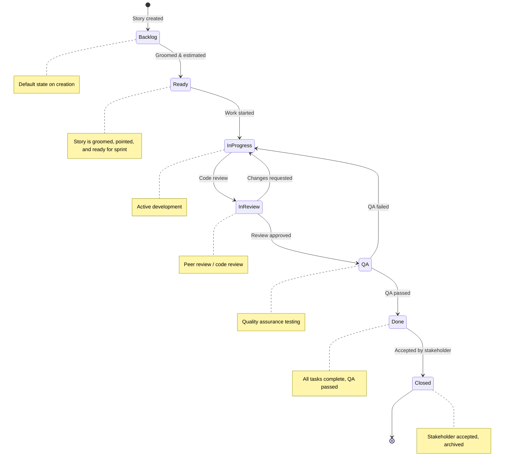
```mermaid
stateDiagram-v2
    [*] --> Backlog: Story created
    Backlog --> Ready: Groomed & estimated
    Ready --> InProgress: Work started
    InProgress --> InReview: Code review
    InReview --> InProgress: Changes requested
    InReview --> QA: Review approved
    QA --> InProgress: QA failed
    QA --> Done: QA passed
    Done --> Closed: Accepted by stakeholder
    Closed --> [*]

    note right of Backlog: Default state on creation
    note right of Ready: Story is groomed, pointed, and ready for sprint
    note right of InProgress: Active development
    note right of InReview: Peer review / code review
    note right of QA: Quality assurance testing
    note right of Done: All tasks complete, QA passed
    note right of Closed: Stakeholder accepted, archived
```

**Valid transitions:**

| From | To | Condition |
|------|----|-----------|
| Backlog | Ready | Story has title, description, and story points |
| Ready | InProgress | Story is assigned to a team member |
| InProgress | InReview | At least one task exists and all dev tasks are done |
| InReview | InProgress | Reviewer requests changes |
| InReview | QA | Reviewer approves |
| QA | InProgress | QA finds defects |
| QA | Done | All tasks complete, QA passed |
| Done | Closed | Stakeholder accepts |

**State machine enforcement:**

```csharp
public static class WorkflowStateMachine
{
    private static readonly Dictionary<string, HashSet<string>> StoryTransitions = new()
    {
        ["Backlog"] = new() { "Ready" },
        ["Ready"] = new() { "InProgress" },
        ["InProgress"] = new() { "InReview" },
        ["InReview"] = new() { "InProgress", "QA" },
        ["QA"] = new() { "InProgress", "Done" },
        ["Done"] = new() { "Closed" },
        ["Closed"] = new()
    };

    public static bool IsValidStoryTransition(string from, string to)
        => StoryTransitions.TryGetValue(from, out var targets) && targets.Contains(to);
}
```

### 6.2 Task Management

Tasks are the actionable work items within a story. Each story can have multiple tasks, and tasks are assigned to specific departments based on their type.

#### 6.2.1 Task Entity

| Field | Type | Description |
|-------|------|-------------|
| `TaskId` | `Guid` (PK, auto) | Primary key |
| `OrganizationId` | `Guid` (required, FK) | Organization reference |
| `StoryId` | `Guid` (required, FK) | Parent story reference |
| `Title` | `string` (required, max 200) | Task title |
| `Description` | `string?` (max 3000) | Task description |
| `TaskType` | `string` (required) | `Development`, `Testing`, `DevOps`, `Design`, `Documentation`, `Bug` |
| `Status` | `string` (required, default: `ToDo`) | Workflow state |
| `Priority` | `string` (required, default: `Medium`) | `Critical`, `High`, `Medium`, `Low` |
| `AssigneeId` | `Guid?` (FK) | Assigned team member |
| `DepartmentId` | `Guid?` (FK) | Assigned department |
| `EstimatedHours` | `decimal?` | Estimated effort in hours |
| `ActualHours` | `decimal?` | Actual effort logged |
| `DueDate` | `DateTime?` | Target completion date |
| `CompletedDate` | `DateTime?` | Actual completion date |
| `FlgStatus` | `string` | A/D (Active/Deleted) |
| `DateCreated` | `DateTime` | Creation timestamp |
| `DateUpdated` | `DateTime` | Last update timestamp |

#### 6.2.2 Task Types and Department Mapping

| Task Type | Default Department | Description |
|-----------|-------------------|-------------|
| Development | Engineering | Feature implementation, refactoring |
| Testing | QA | Test case creation, test execution |
| DevOps | DevOps | CI/CD, infrastructure, deployment |
| Design | Design | UI/UX design, mockups, prototypes |
| Documentation | Product | Technical docs, user guides, specs |
| Bug | Engineering | Bug fixes, hotfixes |

**Auto-assignment logic:**

When a task is created with a `TaskType` but no `AssigneeId`, the system suggests an assignee:

```csharp
public class TaskAssignmentService
{
    public async Task<Guid?> SuggestAssigneeAsync(
        Guid organizationId, string taskType, CancellationToken ct)
    {
        // 1. Resolve department from task type mapping
        var departmentCode = TaskTypeDepartmentMap[taskType];
        var department = await _profileClient
            .GetDepartmentByCodeAsync(organizationId, departmentCode, ct);

        if (department == null) return null;

        // 2. Get available members in department
        var members = await _profileClient
            .GetDepartmentMembersAsync(department.DepartmentId, ct);

        var available = members
            .Where(m => m.Availability == "Available" && m.FlgStatus == "A")
            .ToList();

        if (!available.Any()) return null;

        // 3. Get current task counts for available members
        var taskCounts = await _taskRepository
            .GetActiveTaskCountsByMemberIdsAsync(
                available.Select(m => m.TeamMemberId).ToList(), ct);

        // 4. Select member with lowest workload under their max
        return available
            .Where(m => taskCounts.GetValueOrDefault(m.TeamMemberId, 0)
                        < m.MaxConcurrentTasks)
            .OrderBy(m => taskCounts.GetValueOrDefault(m.TeamMemberId, 0))
            .Select(m => (Guid?)m.TeamMemberId)
            .FirstOrDefault();
    }

    private static readonly Dictionary<string, string> TaskTypeDepartmentMap = new()
    {
        ["Development"] = "ENG",
        ["Testing"] = "QA",
        ["DevOps"] = "DEVOPS",
        ["Design"] = "DESIGN",
        ["Documentation"] = "PROD",
        ["Bug"] = "ENG"
    };
}
```

#### 6.2.3 Task Workflow State Machine

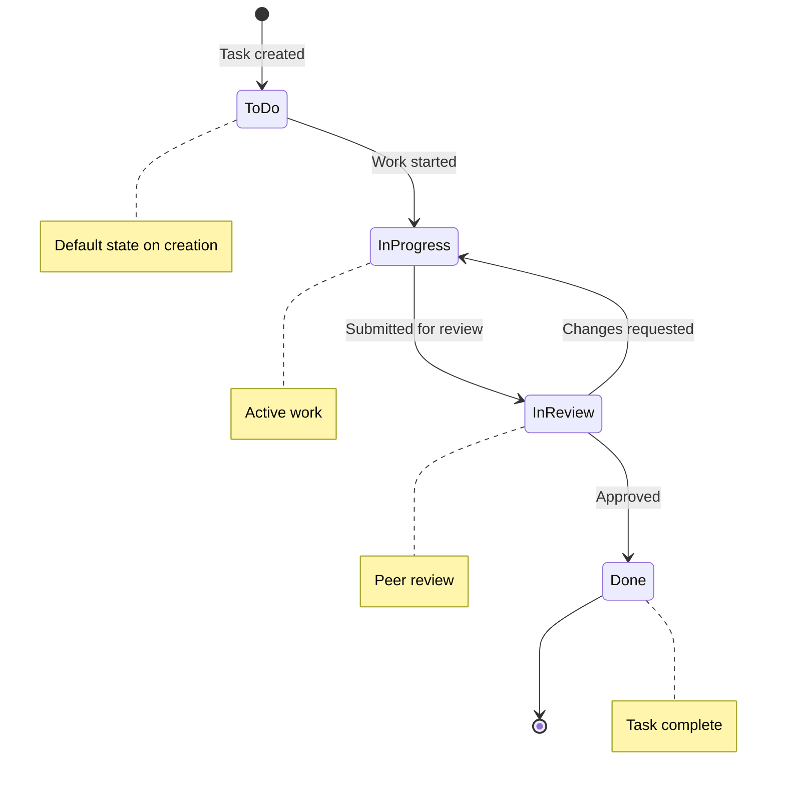
```mermaid
stateDiagram-v2
    [*] --> ToDo: Task created
    ToDo --> InProgress: Work started
    InProgress --> InReview: Submitted for review
    InReview --> InProgress: Changes requested
    InReview --> Done: Approved
    Done --> [*]

    note right of ToDo: Default state on creation
    note right of InProgress: Active work
    note right of InReview: Peer review
    note right of Done: Task complete
```

**Valid transitions:**

| From | To | Condition |
|------|----|-----------|
| ToDo | InProgress | Task has an assignee |
| InProgress | InReview | Assignee submits for review |
| InReview | InProgress | Reviewer requests changes |
| InReview | Done | Reviewer approves |

**Task state machine code:**

```csharp
// In WorkflowStateMachine (same class as story transitions)
private static readonly Dictionary<string, HashSet<string>> TaskTransitions = new()
{
    ["ToDo"] = new() { "InProgress" },
    ["InProgress"] = new() { "InReview" },
    ["InReview"] = new() { "InProgress", "Done" },
    ["Done"] = new()
};

public static bool IsValidTaskTransition(string from, string to)
    => TaskTransitions.TryGetValue(from, out var targets) && targets.Contains(to);
```

### 6.3 Sprint Management

Sprints are time-boxed iterations containing a set of stories.

#### 6.3.1 Sprint Entity

| Field | Type | Description |
|-------|------|-------------|
| `SprintId` | `Guid` (PK, auto) | Primary key |
| `OrganizationId` | `Guid` (required, FK) | Organization reference |
| `SprintName` | `string` (required, max 100) | Sprint name (e.g., "Sprint 14") |
| `Goal` | `string?` (max 500) | Sprint goal description |
| `StartDate` | `DateTime` (required) | Sprint start date |
| `EndDate` | `DateTime` (required) | Sprint end date |
| `Status` | `string` (required, default: `Planning`) | `Planning`, `Active`, `Completed`, `Cancelled` |
| `Velocity` | `int?` | Completed story points (calculated on completion) |
| `DateCreated` | `DateTime` | Creation timestamp |
| `DateUpdated` | `DateTime` | Last update timestamp |

#### 6.3.2 SprintStory (Junction Table)

| Field | Type | Description |
|-------|------|-------------|
| `SprintStoryId` | `Guid` (PK) | Primary key |
| `SprintId` | `Guid` (FK) | Sprint reference |
| `StoryId` | `Guid` (FK) | Story reference |
| `AddedDate` | `DateTime` | When story was added to sprint |
| `RemovedDate` | `DateTime?` | When story was removed (null = still in sprint) |
| Unique index on `(SprintId, StoryId)` where `RemovedDate IS NULL` |

#### 6.3.3 Sprint Lifecycle

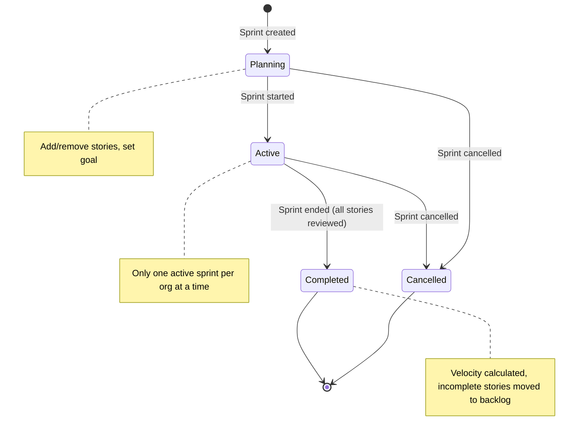
```mermaid
stateDiagram-v2
    [*] --> Planning: Sprint created
    Planning --> Active: Sprint started
    Active --> Completed: Sprint ended (all stories reviewed)
    Active --> Cancelled: Sprint cancelled
    Planning --> Cancelled: Sprint cancelled
    Completed --> [*]
    Cancelled --> [*]

    note right of Planning: Add/remove stories, set goal
    note right of Active: Only one active sprint per org at a time
    note right of Completed: Velocity calculated, incomplete stories moved to backlog
```

**Business rules:**
- Only one sprint can be `Active` per organization at a time
- Stories can only be added to a sprint in `Planning` status
- When a sprint is completed, incomplete stories are automatically moved back to `Backlog` status
- Velocity is calculated as the sum of story points for stories that reached `Done` or `Closed` during the sprint

#### 6.3.4 Sprint Metrics

```csharp
public class SprintMetricsResponse
{
    public Guid SprintId { get; set; }
    public string SprintName { get; set; } = string.Empty;
    public int TotalStories { get; set; }
    public int CompletedStories { get; set; }
    public int TotalStoryPoints { get; set; }
    public int CompletedStoryPoints { get; set; }
    public decimal CompletionRate { get; set; }         // CompletedStories / TotalStories * 100
    public int Velocity { get; set; }                    // CompletedStoryPoints
    public List<BurndownDataPoint> BurndownData { get; set; } = new();
    public Dictionary<string, int> StoriesByStatus { get; set; } = new();
    public Dictionary<string, int> TasksByDepartment { get; set; } = new();
}

public class BurndownDataPoint
{
    public DateTime Date { get; set; }
    public int RemainingPoints { get; set; }
    public int IdealRemainingPoints { get; set; }
}
```

**Burndown calculation:**
- `IdealRemainingPoints`: Linear decrease from total points to 0 over sprint duration
- `RemainingPoints`: Total points minus completed points as of each day
- Data points generated daily from sprint start to current date (or end date if completed)

### 6.4 Board Views

Board views provide structured data for frontend rendering of kanban boards, backlogs, and department boards.

#### 6.4.1 Kanban Board

Returns stories/tasks grouped by workflow status columns.

```csharp
public class KanbanBoardResponse
{
    public Guid? SprintId { get; set; }
    public string? SprintName { get; set; }
    public List<KanbanColumn> Columns { get; set; } = new();
}

public class KanbanColumn
{
    public string Status { get; set; } = string.Empty;
    public int CardCount { get; set; }
    public int TotalPoints { get; set; }
    public List<KanbanCard> Cards { get; set; } = new();
}

public class KanbanCard
{
    public Guid Id { get; set; }
    public string StoryKey { get; set; } = string.Empty;  // e.g., "NEXUS-42"
    public string Title { get; set; } = string.Empty;
    public string Priority { get; set; } = string.Empty;
    public int? StoryPoints { get; set; }
    public string? AssigneeName { get; set; }
    public string? AssigneeAvatarUrl { get; set; }
    public List<string> Labels { get; set; } = new();
    public int TaskCount { get; set; }
    public int CompletedTaskCount { get; set; }
}
```

#### 6.4.2 Backlog View

Returns prioritized list of stories not assigned to any sprint.

```csharp
public class BacklogResponse
{
    public int TotalStories { get; set; }
    public int TotalPoints { get; set; }
    public List<BacklogItem> Items { get; set; } = new();
}

public class BacklogItem
{
    public Guid StoryId { get; set; }
    public string StoryKey { get; set; } = string.Empty;
    public string Title { get; set; }  = string.Empty;
    public string Priority { get; set; } = string.Empty;
    public int? StoryPoints { get; set; }
    public string Status { get; set; } = string.Empty;
    public string? AssigneeName { get; set; }
    public List<string> Labels { get; set; } = new();
    public int TaskCount { get; set; }
    public DateTime DateCreated { get; set; }
}
```

#### 6.4.3 Department Board

Returns tasks grouped by department, showing workload distribution.

```csharp
public class DepartmentBoardResponse
{
    public Guid? SprintId { get; set; }
    public List<DepartmentColumn> Departments { get; set; } = new();
}

public class DepartmentColumn
{
    public Guid DepartmentId { get; set; }
    public string DepartmentName { get; set; } = string.Empty;
    public string DepartmentCode { get; set; } = string.Empty;
    public int TotalTasks { get; set; }
    public int CompletedTasks { get; set; }
    public List<DepartmentTaskCard> Tasks { get; set; } = new();
}

public class DepartmentTaskCard
{
    public Guid TaskId { get; set; }
    public string StoryKey { get; set; } = string.Empty;
    public string Title { get; set; } = string.Empty;
    public string TaskType { get; set; } = string.Empty;
    public string Status { get; set; } = string.Empty;
    public string Priority { get; set; } = string.Empty;
    public string? AssigneeName { get; set; }
    public decimal? EstimatedHours { get; set; }
}
```

### 6.5 Activity Feed / Timeline

Activity logs capture all significant events on stories and tasks using an event-sourcing-inspired pattern. Each state change, assignment, comment, or update creates an immutable activity log entry.

#### 6.5.1 ActivityLog Entity

| Field | Type | Description |
|-------|------|-------------|
| `ActivityLogId` | `Guid` (PK, auto) | Primary key |
| `OrganizationId` | `Guid` (required) | Organization reference |
| `EntityType` | `string` (required) | `Story` or `Task` |
| `EntityId` | `Guid` (required) | Story or Task ID |
| `StoryKey` | `string?` | Story key for display (e.g., `NEXUS-42`) |
| `Action` | `string` (required) | Action type (see below) |
| `ActorId` | `Guid` (required) | Team member who performed the action |
| `ActorName` | `string` (required) | Display name of actor |
| `OldValue` | `string?` | Previous value (JSON) |
| `NewValue` | `string?` | New value (JSON) |
| `Description` | `string` (required) | Human-readable description |
| `DateCreated` | `DateTime` | Event timestamp |

**Activity action types:**

| Action | EntityType | Description |
|--------|-----------|-------------|
| `Created` | Story/Task | Entity was created |
| `StatusChanged` | Story/Task | Workflow state transition |
| `Assigned` | Story/Task | Assignee changed |
| `Unassigned` | Story/Task | Assignee removed |
| `PriorityChanged` | Story/Task | Priority updated |
| `PointsChanged` | Story | Story points updated |
| `SprintAdded` | Story | Story added to sprint |
| `SprintRemoved` | Story | Story removed from sprint |
| `LabelAdded` | Story | Label attached |
| `LabelRemoved` | Story | Label detached |
| `CommentAdded` | Story/Task | New comment posted |
| `DescriptionUpdated` | Story/Task | Description changed |
| `DueDateChanged` | Story/Task | Due date updated |
| `TaskAdded` | Story | New task linked to story |
| `DepartmentChanged` | Task | Task reassigned to different department |

### 6.6 Comments

Comments support threaded discussions on stories and tasks with @mention notifications.

#### 6.6.1 Comment Entity

| Field | Type | Description |
|-------|------|-------------|
| `CommentId` | `Guid` (PK, auto) | Primary key |
| `OrganizationId` | `Guid` (required) | Organization reference |
| `EntityType` | `string` (required) | `Story` or `Task` |
| `EntityId` | `Guid` (required) | Story or Task ID |
| `AuthorId` | `Guid` (required, FK) | Comment author |
| `Content` | `string` (required, max 5000) | Comment body (Markdown supported) |
| `ParentCommentId` | `Guid?` (FK) | Parent comment for threading |
| `IsEdited` | `bool` | Whether comment has been edited |
| `FlgStatus` | `string` | A/D (Active/Deleted) |
| `DateCreated` | `DateTime` | Creation timestamp |
| `DateUpdated` | `DateTime` | Last edit timestamp |

#### 6.6.2 @Mention Processing

Comments are scanned for `@{displayName}` patterns. When a mention is detected:

1. Resolve the mentioned team member by display name within the organization
2. Create a notification event: `MentionedInComment`
3. Publish to outbox for UtilityService dispatch

```csharp
public class MentionProcessor
{
    private static readonly Regex MentionPattern =
        new(@"@(\w+(?:\.\w+)*)", RegexOptions.Compiled);

    public List<string> ExtractMentions(string content)
    {
        return MentionPattern.Matches(content)
            .Select(m => m.Groups[1].Value)
            .Distinct()
            .ToList();
    }
}
```

### 6.7 Labels

Labels provide flexible categorization for stories.

#### 6.7.1 Label Entity

| Field | Type | Description |
|-------|------|-------------|
| `LabelId` | `Guid` (PK, auto) | Primary key |
| `OrganizationId` | `Guid` (required, FK) | Organization reference |
| `Name` | `string` (required, max 50) | Label name (e.g., "frontend", "backend", "urgent") |
| `Color` | `string` (required, max 7) | Hex color code (e.g., `#FF5733`) |
| `DateCreated` | `DateTime` | Creation timestamp |
| Unique index on `(OrganizationId, Name)` |

#### 6.7.2 StoryLabel (Junction Table)

| Field | Type | Description |
|-------|------|-------------|
| `StoryLabelId` | `Guid` (PK) | Primary key |
| `StoryId` | `Guid` (FK) | Story reference |
| `LabelId` | `Guid` (FK) | Label reference |
| Unique index on `(StoryId, LabelId)` |

### 6.8 Search

Full-text search across stories and tasks with filtering capabilities.

#### 6.8.1 Search Strategy

**PostgreSQL full-text search** using `tsvector` and `tsquery`:

```sql
-- Add tsvector columns (via migration)
ALTER TABLE stories ADD COLUMN search_vector tsvector
    GENERATED ALWAYS AS (
        setweight(to_tsvector('english', coalesce(story_key, '')), 'A') ||
        setweight(to_tsvector('english', coalesce(title, '')), 'A') ||
        setweight(to_tsvector('english', coalesce(description, '')), 'B')
    ) STORED;

CREATE INDEX idx_stories_search ON stories USING GIN (search_vector);

ALTER TABLE tasks ADD COLUMN search_vector tsvector
    GENERATED ALWAYS AS (
        setweight(to_tsvector('english', coalesce(title, '')), 'A') ||
        setweight(to_tsvector('english', coalesce(description, '')), 'B')
    ) STORED;

CREATE INDEX idx_tasks_search ON tasks USING GIN (search_vector);
```

#### 6.8.2 Search Request/Response

```csharp
public class SearchRequest
{
    public string? Query { get; set; }              // Full-text search query
    public string? Status { get; set; }             // Filter by status
    public string? Priority { get; set; }           // Filter by priority
    public Guid? AssigneeId { get; set; }           // Filter by assignee
    public Guid? DepartmentId { get; set; }         // Filter by department
    public Guid? SprintId { get; set; }             // Filter by sprint
    public string? TaskType { get; set; }           // Filter by task type
    public List<string>? Labels { get; set; }       // Filter by labels
    public string? EntityType { get; set; }         // "Story", "Task", or null (both)
    public int Page { get; set; } = 1;
    public int PageSize { get; set; } = 20;
    public string SortBy { get; set; } = "relevance"; // relevance, created, updated, priority
}

public class SearchResponse
{
    public int TotalCount { get; set; }
    public int Page { get; set; }
    public int PageSize { get; set; }
    public List<SearchResultItem> Items { get; set; } = new();
}

public class SearchResultItem
{
    public Guid Id { get; set; }
    public string EntityType { get; set; } = string.Empty;  // "Story" or "Task"
    public string? StoryKey { get; set; }
    public string Title { get; set; } = string.Empty;
    public string Status { get; set; } = string.Empty;
    public string Priority { get; set; } = string.Empty;
    public string? AssigneeName { get; set; }
    public string? DepartmentName { get; set; }
    public decimal Relevance { get; set; }
}
```

### 6.9 API Endpoints (Complete)

#### Story Endpoints

| Method | Path | Auth | Description |
|--------|------|------|-------------|
| POST | `/api/v1/stories` | Bearer (Member+) | Create story |
| GET | `/api/v1/stories` | Bearer | List stories (paginated, filtered) |
| GET | `/api/v1/stories/{id}` | Bearer | Get story detail (by GUID) |
| GET | `/api/v1/stories/by-key/{key}` | Bearer | Get story by key (e.g., `NEXUS-42`) |
| PUT | `/api/v1/stories/{id}` | Bearer (Member+) | Update story |
| PATCH | `/api/v1/stories/{id}/status` | Bearer (Member+) | Transition story status |
| PATCH | `/api/v1/stories/{id}/assign` | Bearer (DeptLead+) | Assign story to member |
| PATCH | `/api/v1/stories/{id}/unassign` | Bearer (DeptLead+) | Unassign story |
| DELETE | `/api/v1/stories/{id}` | Bearer (DeptLead+) | Soft-delete story |
| GET | `/api/v1/stories/{id}/tasks` | Bearer | List tasks for story |
| GET | `/api/v1/stories/{id}/activity` | Bearer | Get story activity feed |
| GET | `/api/v1/stories/{id}/comments` | Bearer | List story comments |
| POST | `/api/v1/stories/{id}/comments` | Bearer (Member+) | Add story comment |
| POST | `/api/v1/stories/{id}/labels` | Bearer (Member+) | Attach label to story |
| DELETE | `/api/v1/stories/{id}/labels/{labelId}` | Bearer (Member+) | Detach label from story |

#### Task Endpoints

| Method | Path | Auth | Description |
|--------|------|------|-------------|
| POST | `/api/v1/tasks` | Bearer (Member+) | Create task (linked to story) |
| GET | `/api/v1/tasks/{id}` | Bearer | Get task detail |
| PUT | `/api/v1/tasks/{id}` | Bearer (Member+) | Update task |
| PATCH | `/api/v1/tasks/{id}/status` | Bearer (Member+) | Transition task status |
| PATCH | `/api/v1/tasks/{id}/assign` | Bearer (DeptLead+) | Assign task to member |
| PATCH | `/api/v1/tasks/{id}/self-assign` | Bearer (Member+) | Self-assign task |
| PATCH | `/api/v1/tasks/{id}/unassign` | Bearer (DeptLead+) | Unassign task |
| PATCH | `/api/v1/tasks/{id}/log-hours` | Bearer (Member+) | Log actual hours |
| DELETE | `/api/v1/tasks/{id}` | Bearer (DeptLead+) | Soft-delete task |
| GET | `/api/v1/tasks/{id}/activity` | Bearer | Get task activity feed |
| GET | `/api/v1/tasks/{id}/comments` | Bearer | List task comments |
| POST | `/api/v1/tasks/{id}/comments` | Bearer (Member+) | Add task comment |
| GET | `/api/v1/tasks/suggest-assignee` | Bearer | Get auto-assignment suggestion |

#### Sprint Endpoints

| Method | Path | Auth | Description |
|--------|------|------|-------------|
| POST | `/api/v1/sprints` | Bearer (DeptLead+) | Create sprint |
| GET | `/api/v1/sprints` | Bearer | List sprints |
| GET | `/api/v1/sprints/{id}` | Bearer | Get sprint detail |
| PUT | `/api/v1/sprints/{id}` | Bearer (DeptLead+) | Update sprint |
| PATCH | `/api/v1/sprints/{id}/start` | Bearer (DeptLead+) | Start sprint |
| PATCH | `/api/v1/sprints/{id}/complete` | Bearer (DeptLead+) | Complete sprint |
| PATCH | `/api/v1/sprints/{id}/cancel` | Bearer (DeptLead+) | Cancel sprint |
| POST | `/api/v1/sprints/{id}/stories` | Bearer (DeptLead+) | Add story to sprint |
| DELETE | `/api/v1/sprints/{id}/stories/{storyId}` | Bearer (DeptLead+) | Remove story from sprint |
| GET | `/api/v1/sprints/{id}/metrics` | Bearer | Get sprint metrics |
| GET | `/api/v1/sprints/{id}/board` | Bearer | Get sprint kanban board |
| GET | `/api/v1/sprints/active` | Bearer | Get current active sprint |

#### Board & View Endpoints

| Method | Path | Auth | Description |
|--------|------|------|-------------|
| GET | `/api/v1/boards/kanban` | Bearer | Get kanban board (optional `?sprintId=`) |
| GET | `/api/v1/boards/backlog` | Bearer | Get backlog view |
| GET | `/api/v1/boards/department` | Bearer | Get department board (optional `?sprintId=`) |

#### Label Endpoints

| Method | Path | Auth | Description |
|--------|------|------|-------------|
| POST | `/api/v1/labels` | Bearer (DeptLead+) | Create label |
| GET | `/api/v1/labels` | Bearer | List labels for organization |
| PUT | `/api/v1/labels/{id}` | Bearer (DeptLead+) | Update label |
| DELETE | `/api/v1/labels/{id}` | Bearer (DeptLead+) | Delete label |

#### Comment Endpoints

| Method | Path | Auth | Description |
|--------|------|------|-------------|
| PUT | `/api/v1/comments/{id}` | Bearer (Author) | Edit comment |
| DELETE | `/api/v1/comments/{id}` | Bearer (Author, DeptLead+) | Delete comment |

#### Search Endpoints

| Method | Path | Auth | Description |
|--------|------|------|-------------|
| POST | `/api/v1/search` | Bearer | Full-text search across stories and tasks |

#### System Endpoints

| Method | Path | Auth | Description |
|--------|------|------|-------------|
| GET | `/health` | None | Health check |
| GET | `/ready` | None | Readiness check |

### 6.10 Error Codes (4001–4040)

| Code | Value | HTTP | Description |
|------|-------|------|-------------|
| VALIDATION_ERROR | 1000 | 422 | FluentValidation failure |
| STORY_NOT_FOUND | 4001 | 404 | Story does not exist |
| TASK_NOT_FOUND | 4002 | 404 | Task does not exist |
| SPRINT_NOT_FOUND | 4003 | 404 | Sprint does not exist |
| INVALID_STORY_TRANSITION | 4004 | 400 | Invalid story state transition |
| INVALID_TASK_TRANSITION | 4005 | 400 | Invalid task state transition |
| STORY_ALREADY_IN_SPRINT | 4006 | 409 | Story already assigned to this sprint |
| SPRINT_NOT_IN_PLANNING | 4007 | 400 | Cannot add stories to non-planning sprint |
| ACTIVE_SPRINT_EXISTS | 4008 | 409 | Organization already has an active sprint |
| SPRINT_DATE_OVERLAP | 4009 | 400 | Sprint dates overlap with existing sprint |
| STORY_HAS_INCOMPLETE_TASKS | 4010 | 400 | Cannot close story with incomplete tasks |
| TASK_REQUIRES_ASSIGNEE | 4011 | 400 | Cannot start task without assignee |
| STORY_REQUIRES_ASSIGNEE | 4012 | 400 | Cannot start story without assignee |
| STORY_REQUIRES_POINTS | 4013 | 400 | Cannot move to Ready without story points |
| LABEL_NAME_DUPLICATE | 4014 | 409 | Label name already exists in org |
| LABEL_NOT_FOUND | 4015 | 404 | Label does not exist |
| COMMENT_NOT_FOUND | 4016 | 404 | Comment does not exist |
| COMMENT_NOT_AUTHOR | 4017 | 403 | Only author can edit/delete comment |
| ASSIGNEE_NOT_IN_DEPARTMENT | 4018 | 400 | Assignee not a member of target department |
| ASSIGNEE_AT_CAPACITY | 4019 | 400 | Assignee has reached max concurrent tasks |
| STORY_KEY_NOT_FOUND | 4020 | 404 | Story key does not resolve |
| SPRINT_ALREADY_ACTIVE | 4021 | 400 | Sprint is already active |
| SPRINT_ALREADY_COMPLETED | 4022 | 400 | Sprint is already completed |
| INVALID_STORY_POINTS | 4023 | 400 | Story points must be Fibonacci (1,2,3,5,8,13,21) |
| INVALID_PRIORITY | 4024 | 400 | Unknown priority value |
| INVALID_TASK_TYPE | 4025 | 400 | Unknown task type |
| STORY_IN_ACTIVE_SPRINT | 4026 | 400 | Cannot delete story in active sprint |
| TASK_IN_PROGRESS | 4027 | 400 | Cannot delete task that is in progress |
| SEARCH_QUERY_TOO_SHORT | 4028 | 400 | Search query must be at least 2 characters |
| MENTION_USER_NOT_FOUND | 4029 | 400 | @mentioned user not found in organization |
| ORGANIZATION_MISMATCH | 4030 | 403 | Cross-organization access |
| DEPARTMENT_ACCESS_DENIED | 4031 | 403 | User not in target department |
| INSUFFICIENT_PERMISSIONS | 4032 | 403 | Role lacks access for this operation |
| SPRINT_END_BEFORE_START | 4033 | 400 | End date must be after start date |
| STORY_SEQUENCE_INIT_FAILED | 4034 | 500 | Failed to initialize story sequence |
| HOURS_MUST_BE_POSITIVE | 4035 | 400 | Logged hours must be > 0 |
| NOT_FOUND | 4036 | 404 | Generic entity not found |
| CONFLICT | 4037 | 409 | Duplicate or state conflict |
| SERVICE_UNAVAILABLE | 4038 | 503 | Downstream timeout or circuit open |
| STORY_DESCRIPTION_REQUIRED | 4039 | 400 | Description required for Ready transition |
| MAX_LABELS_PER_STORY | 4040 | 400 | Maximum 10 labels per story |

### 6.11 Redis Key Patterns

| Pattern | Purpose | TTL |
|---------|---------|-----|
| `org_prefix:{organizationId}` | Cached organization story ID prefix | 60 min |
| `sprint_active:{organizationId}` | Cached active sprint ID | 5 min |
| `board_kanban:{organizationId}:{sprintId}` | Cached kanban board data | 2 min |
| `board_backlog:{organizationId}` | Cached backlog data | 2 min |
| `board_dept:{organizationId}:{sprintId}` | Cached department board data | 2 min |
| `sprint_metrics:{sprintId}` | Cached sprint metrics | 5 min |
| `story_detail:{storyId}` | Cached story detail | 5 min |
| `search_results:{hash}` | Cached search results by query hash | 1 min |
| `outbox:work` | Outbox queue for audit events and notifications | Until processed |
| `blacklist:{jti}` | Token deny list (shared) | Remaining token TTL |

### 6.12 Data Models Summary

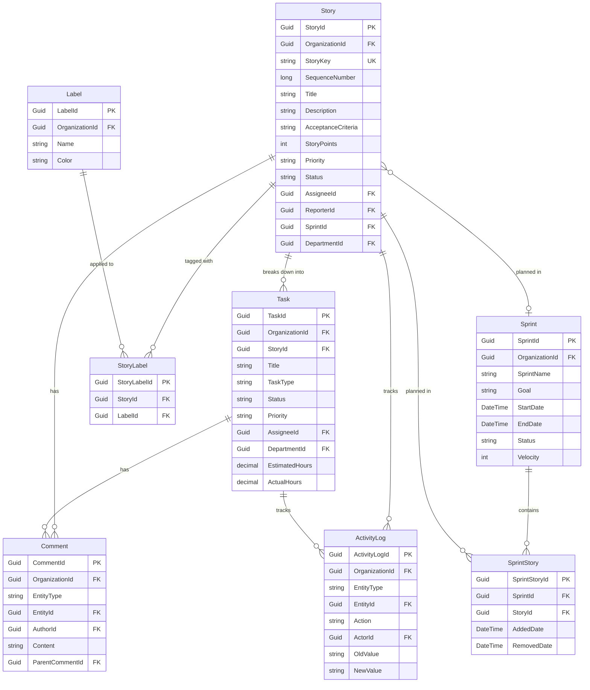
```mermaid
erDiagram
    Story ||--o{ Task : "breaks down into"
    Story ||--o{ Comment : "has"
    Story ||--o{ ActivityLog : "tracks"
    Story ||--o{ StoryLabel : "tagged with"
    Story }o--o| Sprint : "planned in"
    Task ||--o{ Comment : "has"
    Task ||--o{ ActivityLog : "tracks"
    Sprint ||--o{ SprintStory : "contains"
    Story ||--o{ SprintStory : "planned in"
    Label ||--o{ StoryLabel : "applied to"

    Story {
        Guid StoryId PK
        Guid OrganizationId FK
        string StoryKey UK
        long SequenceNumber
        string Title
        string Description
        string AcceptanceCriteria
        int StoryPoints
        string Priority
        string Status
        Guid AssigneeId FK
        Guid ReporterId FK
        Guid SprintId FK
        Guid DepartmentId FK
    }

    Task {
        Guid TaskId PK
        Guid OrganizationId FK
        Guid StoryId FK
        string Title
        string TaskType
        string Status
        string Priority
        Guid AssigneeId FK
        Guid DepartmentId FK
        decimal EstimatedHours
        decimal ActualHours
    }

    Sprint {
        Guid SprintId PK
        Guid OrganizationId FK
        string SprintName
        string Goal
        DateTime StartDate
        DateTime EndDate
        string Status
        int Velocity
    }

    SprintStory {
        Guid SprintStoryId PK
        Guid SprintId FK
        Guid StoryId FK
        DateTime AddedDate
        DateTime RemovedDate
    }

    Comment {
        Guid CommentId PK
        Guid OrganizationId FK
        string EntityType
        Guid EntityId FK
        Guid AuthorId FK
        string Content
        Guid ParentCommentId FK
    }

    ActivityLog {
        Guid ActivityLogId PK
        Guid OrganizationId FK
        string EntityType
        Guid EntityId FK
        string Action
        Guid ActorId FK
        string OldValue
        string NewValue
    }

    Label {
        Guid LabelId PK
        Guid OrganizationId FK
        string Name
        string Color
    }

    StoryLabel {
        Guid StoryLabelId PK
        Guid StoryId FK
        Guid LabelId FK
    }
```

---

## 7. UtilityService Specification

UtilityService provides cross-cutting operational capabilities consumed by all other services, adapted for the Agile domain with specific notification templates for story-driven workflow events.

### 7.1 Audit Logging

Immutable, queryable, archivable audit trail for all significant platform events.

**AuditLog entity:**

| Column | Type | Description |
|--------|------|-------------|
| `AuditLogId` | `Guid` (PK) | Primary key |
| `OrganizationId` | `Guid` (required) | Organization reference |
| `ServiceName` | `string` (required) | Originating service |
| `Action` | `string` (required) | Action performed (e.g., "StoryCreated", "TaskAssigned", "SprintStarted") |
| `EntityType` | `string` (required) | Entity type affected |
| `EntityId` | `string` (required) | Entity identifier |
| `UserId` | `string` (required) | Acting user |
| `OldValue` | `string?` | Previous state (JSON) |
| `NewValue` | `string?` | New state (JSON) |
| `IpAddress` | `string?` | Request IP |
| `CorrelationId` | `string` (required) | Trace identifier |
| `DateCreated` | `DateTime` (required) | Event timestamp |

**Business rule:** Audit logs are immutable — no UPDATE or DELETE operations allowed (`AUDIT_LOG_IMMUTABLE`, 405).

**ArchivedAuditLog** has the same fields plus `ArchivedAuditLogId` and `ArchivedDate`.

### 7.2 Error Logging with PII Redaction

| Column | Type | Description |
|--------|------|-------------|
| `ErrorLogId` | `Guid` (PK) | Primary key |
| `OrganizationId` | `Guid` (required) | Organization reference |
| `ServiceName` | `string` (required) | Originating service |
| `ErrorCode` | `string` (required) | Error code |
| `Message` | `string` (required) | Error message (PII redacted) |
| `StackTrace` | `string?` | Stack trace (PII redacted) |
| `CorrelationId` | `string` (required) | Trace identifier |
| `Severity` | `string` (required) | Info/Warning/Error/Critical |
| `DateCreated` | `DateTime` (required) | Event timestamp |

PII fields (emails, names, IPs) are detected and replaced with `[REDACTED]` before persistence.

### 7.3 Error Code Registry

Centralized registry of all error codes across all services. Used by `ErrorCodeResolverService` in each service for multi-tier cache resolution.

**ErrorCodeEntry entity:**

| Column | Type | Description |
|--------|------|-------------|
| `ErrorCodeEntryId` | `Guid` (PK) | Primary key |
| `Code` | `string` (required, unique index) | Error code string (e.g., "INVALID_CREDENTIALS") |
| `Value` | `int` (required) | Numeric error value |
| `HttpStatusCode` | `int` (required) | HTTP status code |
| `ResponseCode` | `string` (required, max 10) | Response code for envelope |
| `Description` | `string` (required) | Human-readable description |
| `ServiceName` | `string` (required) | Owning service |
| `DateCreated` | `DateTime` | Creation timestamp |
| `DateUpdated` | `DateTime` | Last update timestamp |

**Resolution chain (per service):**
1. In-memory `ConcurrentDictionary` (singleton lifetime)
2. Redis hash: `error_codes_registry` (24h TTL)
3. HTTP call to UtilityService: `GET /api/v1/error-codes` (full refresh)
4. Local static fallback map

### 7.4 Notification Dispatch

Notifications are dispatched via the outbox pattern. Each service publishes notification events to its Redis outbox queue. UtilityService processes all queues and dispatches via the appropriate channel.

**Channels:** Email, Push, In-App

**NotificationLog entity:**

| Column | Type | Description |
|--------|------|-------------|
| `NotificationLogId` | `Guid` (PK) | Primary key |
| `OrganizationId` | `Guid` (required) | Organization reference |
| `UserId` | `Guid` (required) | Recipient user |
| `NotificationType` | `string` (required) | Type (see below) |
| `Channel` | `string` (required) | Email/Push/InApp |
| `Recipient` | `string` (required) | Email/device token |
| `Subject` | `string?` | Email subject |
| `Status` | `string` (required) | Pending/Sent/Failed/PermanentlyFailed |
| `RetryCount` | `int` | Number of retry attempts |
| `LastRetryDate` | `DateTime?` | Last retry timestamp |
| `DateCreated` | `DateTime` | Creation timestamp |

**Agile-specific notification types:**

| Type | Trigger | Template Variables |
|------|---------|-------------------|
| `StoryAssigned` | Story assigned to member | `StoryKey`, `StoryTitle`, `AssignerName` |
| `TaskAssigned` | Task assigned to member | `StoryKey`, `TaskTitle`, `TaskType`, `AssignerName` |
| `SprintStarted` | Sprint activated | `SprintName`, `StartDate`, `EndDate`, `StoryCount` |
| `SprintEnded` | Sprint completed | `SprintName`, `Velocity`, `CompletionRate` |
| `MentionedInComment` | @mention in comment | `MentionerName`, `StoryKey`, `CommentPreview` |
| `StoryStatusChanged` | Story state transition | `StoryKey`, `StoryTitle`, `OldStatus`, `NewStatus` |
| `TaskStatusChanged` | Task state transition | `StoryKey`, `TaskTitle`, `OldStatus`, `NewStatus` |
| `DueDateApproaching` | Due date within 24 hours | `EntityType`, `StoryKey`, `Title`, `DueDate` |

**Outbox message format:**
```json
{
  "Type": "notification",
  "Payload": {
    "OrganizationId": "guid",
    "NotificationType": "StoryAssigned",
    "Channel": "Email,Push",
    "Recipient": "user@example.com",
    "Subject": "Story NEXUS-42 assigned to you",
    "TemplateVariables": {
      "StoryKey": "NEXUS-42",
      "StoryTitle": "Implement user authentication",
      "AssignerName": "Jane Smith"
    }
  },
  "Timestamp": "2025-01-01T00:00:00Z",
  "Id": "guid"
}
```

### 7.5 Reference Data Management

Static reference data with Redis caching (24h TTL).

**DepartmentType:**

| Column | Type | Description |
|--------|------|-------------|
| `DepartmentTypeId` | `Guid` (PK) | Primary key |
| `TypeName` | `string` (required) | Department type name |
| `TypeCode` | `string` (required) | Short code |
| `FlgStatus` | `string` | A/S/D |

**PriorityLevel:**

| Column | Type | Description |
|--------|------|-------------|
| `PriorityLevelId` | `Guid` (PK) | Primary key |
| `Name` | `string` (required) | Priority name |
| `SortOrder` | `int` (required) | Display order |
| `Color` | `string` (required) | Hex color |
| `FlgStatus` | `string` | A/S/D |

**TaskTypeRef:**

| Column | Type | Description |
|--------|------|-------------|
| `TaskTypeRefId` | `Guid` (PK) | Primary key |
| `TypeName` | `string` (required) | Task type name |
| `DefaultDepartmentCode` | `string` (required) | Default department mapping |
| `FlgStatus` | `string` | A/S/D |

**WorkflowState:**

| Column | Type | Description |
|--------|------|-------------|
| `WorkflowStateId` | `Guid` (PK) | Primary key |
| `EntityType` | `string` (required) | `Story` or `Task` |
| `StateName` | `string` (required) | State name |
| `SortOrder` | `int` (required) | Display order |
| `FlgStatus` | `string` | A/S/D |

### 7.6 Background Services

| Service | Description | Interval |
|---------|-------------|----------|
| `OutboxProcessorHostedService` | Polls Redis outbox queues from all services (`outbox:profile`, `outbox:security`, `outbox:work`), dispatches notifications and creates audit logs | Configurable (default 30s) |
| `RetentionArchivalHostedService` | Moves audit logs older than retention period to archive table | Daily at configured hour |
| `NotificationRetryHostedService` | Retries failed notification dispatches with exponential backoff (2^retryCount minutes), max 3 retries | Every 60 seconds |
| `DueDateNotificationHostedService` | Scans for stories/tasks with due dates within 24 hours and publishes `DueDateApproaching` notifications | Every 6 hours |

### 7.7 Email/Notification Templates

The `Templates/` folder contains pre-built notification templates for Agile events:

**Email templates (8):**
- `story-assigned.html` — Story assignment notification
- `task-assigned.html` — Task assignment notification
- `sprint-started.html` — Sprint kickoff notification
- `sprint-ended.html` — Sprint completion summary
- `mentioned-in-comment.html` — @mention notification
- `story-status-changed.html` — Story state transition
- `task-status-changed.html` — Task state transition
- `due-date-approaching.html` — Due date reminder

**Push/In-App templates (8):**
- Corresponding plain-text versions for each email template above

### 7.8 API Endpoints

| Method | Path | Auth | Description |
|--------|------|------|-------------|
| POST | `/api/v1/audit-logs` | Service | Create audit log entry |
| GET | `/api/v1/audit-logs` | Bearer | Query audit logs (paginated, filtered) |
| GET | `/api/v1/audit-logs/archive` | Bearer | Query archived audit logs |
| POST | `/api/v1/error-logs` | Service | Create error log (PII redacted) |
| GET | `/api/v1/error-logs` | OrgAdmin | Query error logs |
| POST | `/api/v1/error-codes` | OrgAdmin | Create error code entry |
| GET | `/api/v1/error-codes` | Bearer | List all error codes |
| PUT | `/api/v1/error-codes/{code}` | OrgAdmin | Update error code |
| DELETE | `/api/v1/error-codes/{code}` | OrgAdmin | Delete error code |
| POST | `/api/v1/notifications/dispatch` | Service | Dispatch notification event |
| GET | `/api/v1/notification-logs` | Bearer | User notification history |
| GET | `/api/v1/reference/department-types` | None | List department types |
| GET | `/api/v1/reference/priority-levels` | None | List priority levels |
| GET | `/api/v1/reference/task-types` | None | List task types with department mapping |
| GET | `/api/v1/reference/workflow-states` | None | List workflow states |
| POST | `/api/v1/reference/department-types` | OrgAdmin | Create department type |
| POST | `/api/v1/reference/priority-levels` | OrgAdmin | Create priority level |
| GET | `/health` | None | Health check |
| GET | `/ready` | None | Readiness check |

### 7.9 Error Codes (6001–6015)

| Code | Value | HTTP | Description |
|------|-------|------|-------------|
| VALIDATION_ERROR | 1000 | 422 | FluentValidation failure |
| AUDIT_LOG_IMMUTABLE | 6001 | 405 | Cannot modify/delete audit logs |
| ERROR_CODE_DUPLICATE | 6002 | 409 | Duplicate ErrorCode |
| ERROR_CODE_NOT_FOUND | 6003 | 404 | Unknown ErrorCode |
| NOTIFICATION_DISPATCH_FAILED | 6004 | 500 | All channels failed |
| REFERENCE_DATA_NOT_FOUND | 6005 | 404 | Unknown reference ID |
| ORGANIZATION_MISMATCH | 6006 | 403 | Cross-organization access |
| TEMPLATE_NOT_FOUND | 6007 | 404 | Notification template not found |
| NOT_FOUND | 6008 | 404 | Entity not found |
| CONFLICT | 6009 | 409 | Duplicate or state conflict |
| SERVICE_UNAVAILABLE | 6010 | 503 | Downstream timeout or circuit open |
| INVALID_NOTIFICATION_TYPE | 6011 | 400 | Unknown notification type |
| INVALID_CHANNEL | 6012 | 400 | Unknown notification channel |
| RETENTION_PERIOD_INVALID | 6013 | 400 | Retention period must be > 0 days |
| REFERENCE_DATA_DUPLICATE | 6014 | 409 | Duplicate reference data entry |
| OUTBOX_PROCESSING_FAILED | 6015 | 500 | Outbox message could not be processed |

### 7.10 Redis Key Patterns

| Pattern | Purpose | TTL |
|---------|---------|-----|
| `ref:department_types` | Cached department type list | 24h |
| `ref:priority_levels` | Cached priority level list | 24h |
| `ref:task_types` | Cached task type list | 24h |
| `ref:workflow_states` | Cached workflow state list | 24h |
| `notif_pref:{userId}:{typeId}` | Cached notification preferences | 5 min |
| `outbox:profile` | Inbound outbox from ProfileService | Until processed |
| `outbox:security` | Inbound outbox from SecurityService | Until processed |
| `outbox:work` | Inbound outbox from WorkService | Until processed |
| `blacklist:{jti}` | Token deny list (shared) | Remaining token TTL |
| `error_codes_registry` | Cached error code registry (hash) | 24h |

---

## 8. Cross-Cutting Patterns

### 8.1 Standardized Error Handling

#### DomainException Hierarchy

Every service defines a `DomainException` base class in its Domain layer. All business rule violations throw a subclass of `DomainException`.

```csharp
public class DomainException : Exception
{
    public int ErrorValue { get; }
    public string ErrorCode { get; }
    public HttpStatusCode StatusCode { get; }
    public string? CorrelationId { get; internal set; }

    public DomainException(
        int errorValue,
        string errorCode,
        string message,
        HttpStatusCode statusCode = HttpStatusCode.BadRequest)
        : base(message)
    {
        ErrorValue = errorValue;
        ErrorCode = errorCode;
        StatusCode = statusCode;
    }
}

// Example subclass (WorkService):
public class InvalidStateTransitionException : DomainException
{
    public InvalidStateTransitionException(string entityType, string from, string to)
        : base(
            ErrorCodes.InvalidStoryTransitionValue,
            ErrorCodes.InvalidStoryTransition,
            $"Invalid {entityType} state transition from '{from}' to '{to}'.",
            HttpStatusCode.BadRequest) { }
}

// Example subclass (SecurityService):
public class AccountLockedException : DomainException
{
    public AccountLockedException()
        : base(
            ErrorCodes.AccountLockedValue,
            ErrorCodes.AccountLocked,
            "Account is locked due to too many failed attempts.",
            HttpStatusCode.Locked) { }
}

// Rate limit exception with Retry-After support:
public class RateLimitExceededException : DomainException
{
    public int RetryAfterSeconds { get; }

    public RateLimitExceededException(int retryAfterSeconds)
        : base(
            ErrorCodes.RateLimitExceededValue,
            ErrorCodes.RateLimitExceeded,
            "Rate limit exceeded. Please try again later.",
            (HttpStatusCode)429)
    {
        RetryAfterSeconds = retryAfterSeconds;
    }
}
```

#### GlobalExceptionHandlerMiddleware

Catches all exceptions and maps them to the standardized `ApiResponse` envelope.

```csharp
public class GlobalExceptionHandlerMiddleware
{
    private const string ServiceName = "WorkService"; // per-service constant
    private readonly RequestDelegate _next;
    private readonly ILogger<GlobalExceptionHandlerMiddleware> _logger;
    private readonly IErrorCodeResolverService _errorCodeResolver;

    private static readonly JsonSerializerOptions JsonOptions = new()
    {
        PropertyNamingPolicy = JsonNamingPolicy.CamelCase
    };

    public GlobalExceptionHandlerMiddleware(
        RequestDelegate next,
        ILogger<GlobalExceptionHandlerMiddleware> logger,
        IErrorCodeResolverService errorCodeResolver)
    {
        _next = next;
        _logger = logger;
        _errorCodeResolver = errorCodeResolver;
    }

    public async Task InvokeAsync(HttpContext context)
    {
        try
        {
            await _next(context);
        }
        catch (DomainException ex)
        {
            await HandleDomainExceptionAsync(context, ex);
        }
        catch (Exception ex)
        {
            await HandleUnexpectedExceptionAsync(context, ex);
        }
    }

    private async Task HandleDomainExceptionAsync(
        HttpContext context, DomainException ex)
    {
        var correlationId = GetCorrelationId(context);
        ex.CorrelationId = correlationId;

        _logger.LogWarning(ex,
            "Domain exception. CorrelationId={CorrelationId} ErrorCode={ErrorCode} " +
            "ErrorValue={ErrorValue} Service={ServiceName} Path={RequestPath}",
            correlationId, ex.ErrorCode, ex.ErrorValue, ServiceName,
            context.Request.Path);

        context.Response.StatusCode = (int)ex.StatusCode;
        context.Response.ContentType = "application/problem+json";

        if (ex is RateLimitExceededException rateLimitEx)
            context.Response.Headers["Retry-After"] =
                rateLimitEx.RetryAfterSeconds.ToString();

        var resolved = await _errorCodeResolver.ResolveAsync(ex.ErrorCode);

        var response = new ApiResponse<object>
        {
            ResponseCode = resolved.ResponseCode,
            ResponseDescription = resolved.ResponseDescription,
            Success = false,
            ErrorValue = ex.ErrorValue,
            ErrorCode = ex.ErrorCode,
            Message = ex.Message,
            CorrelationId = correlationId
        };

        await context.Response.WriteAsync(
            JsonSerializer.Serialize(response, JsonOptions));
    }

    private async Task HandleUnexpectedExceptionAsync(
        HttpContext context, Exception ex)
    {
        var correlationId = GetCorrelationId(context);

        _logger.LogError(ex,
            "Unhandled exception. CorrelationId={CorrelationId} " +
            "Service={ServiceName} Path={RequestPath} " +
            "ExceptionType={ExceptionType}",
            correlationId, ServiceName, context.Request.Path,
            ex.GetType().Name);

        context.Response.StatusCode =
            StatusCodes.Status500InternalServerError;
        context.Response.ContentType = "application/problem+json";

        var response = new ApiResponse<object>
        {
            ResponseCode = "98",
            ResponseDescription = "Internal error",
            Success = false,
            ErrorValue = 0,
            ErrorCode = "INTERNAL_ERROR",
            Message = "An unexpected error occurred.",
            CorrelationId = correlationId
        };

        await context.Response.WriteAsync(
            JsonSerializer.Serialize(response, JsonOptions));
    }

    private static string GetCorrelationId(HttpContext context)
    {
        if (context.Items.TryGetValue("CorrelationId", out var existingId)
            && existingId is string id)
            return id;
        var newId = Guid.NewGuid().ToString();
        context.Items["CorrelationId"] = newId;
        return newId;
    }
}
```

### 8.2 ApiResponse Envelope

All endpoints return responses wrapped in `ApiResponse<T>`:

```csharp
public class ApiResponse<T>
{
    public string ResponseCode { get; set; } = "00";
    public string ResponseDescription { get; set; } = "Request successful";
    public bool Success { get; set; }
    public T? Data { get; set; }
    public string? ErrorCode { get; set; }
    public int? ErrorValue { get; set; }
    public string? Message { get; set; }
    public string? CorrelationId { get; set; }
    public List<ErrorDetail>? Errors { get; set; }

    public static ApiResponse<T> Ok(T data, string? message = null) => new()
    {
        ResponseCode = "00",
        ResponseDescription = message ?? "Request successful",
        Success = true,
        Data = data,
        Message = message
    };

    public static ApiResponse<T> Fail(
        int errorValue, string errorCode, string message) => new()
    {
        ResponseCode = MapErrorToResponseCode(errorCode),
        ResponseDescription = message,
        Success = false,
        ErrorValue = errorValue,
        ErrorCode = errorCode,
        Message = message
    };

    public static ApiResponse<T> ValidationFail(
        string message, List<ErrorDetail> errors) => new()
    {
        ResponseCode = "96",
        ResponseDescription = message,
        Success = false,
        ErrorCode = "VALIDATION_ERROR",
        Message = message,
        Errors = errors
    };

    private static string MapErrorToResponseCode(string errorCode) =>
        errorCode switch
        {
            "INVALID_CREDENTIALS" => "01",
            "ACCOUNT_LOCKED" or "ACCOUNT_INACTIVE" => "02",
            "INSUFFICIENT_PERMISSIONS" or "DEPARTMENT_ACCESS_DENIED"
                or "ORGANIZATION_MISMATCH" => "03",
            var c when c.StartsWith("OTP_") => "04",
            var c when c.StartsWith("PASSWORD_") => "05",
            "CONFLICT" or var c2 when c2.Contains("DUPLICATE") => "06",
            "NOT_FOUND" or var c3 when c3.Contains("NOT_FOUND") => "07",
            "RATE_LIMIT_EXCEEDED" => "08",
            var c when c.StartsWith("INVALID_") => "09",
            "VALIDATION_ERROR" => "96",
            "INTERNAL_ERROR" => "98",
            _ => "99"
        };
}

public class ErrorDetail
{
    public string Field { get; set; } = string.Empty;
    public string Message { get; set; } = string.Empty;
}
```

### 8.3 FluentValidation Pipeline

**Registration:**
- Validators auto-discovered from assembly via `AddValidatorsFromAssemblyContaining<T>()`
- Auto-validation enabled via `AddFluentValidationAutoValidation()`
- ASP.NET Core's built-in `ModelStateInvalidFilter` disabled via `SuppressModelStateInvalidFilter = true`

**Behavior:**
- Validators execute before the controller action
- On failure: returns HTTP 422 with `errorCode = "VALIDATION_ERROR"`, `errorValue = 1000`
- Per-field errors in the `errors` array as `{ field, message }` objects

**Example validator (WorkService):**

```csharp
public class CreateStoryRequestValidator
    : AbstractValidator<CreateStoryRequest>
{
    public CreateStoryRequestValidator()
    {
        RuleFor(x => x.Title)
            .NotEmpty().WithMessage("Title is required.")
            .MaximumLength(200).WithMessage("Title cannot exceed 200 characters.");

        RuleFor(x => x.Description)
            .MaximumLength(5000)
            .WithMessage("Description cannot exceed 5000 characters.");

        RuleFor(x => x.AcceptanceCriteria)
            .MaximumLength(5000)
            .WithMessage("Acceptance criteria cannot exceed 5000 characters.");

        RuleFor(x => x.StoryPoints)
            .Must(p => p == null || new[] { 1, 2, 3, 5, 8, 13, 21 }.Contains(p.Value))
            .WithMessage("Story points must be a Fibonacci number (1,2,3,5,8,13,21).");

        RuleFor(x => x.Priority)
            .Must(p => new[] { "Critical", "High", "Medium", "Low" }.Contains(p))
            .WithMessage("Priority must be Critical, High, Medium, or Low.");
    }
}
```

### 8.4 Inter-Service Typed Clients

Each inter-service communication path is wrapped in a dedicated interface + implementation.

**Interface pattern (WorkService → ProfileService):**

```csharp
public interface IProfileServiceClient
{
    Task<OrganizationSettingsResponse> GetOrganizationSettingsAsync(
        Guid organizationId, CancellationToken ct = default);
    Task<TeamMemberResponse?> GetTeamMemberAsync(
        Guid memberId, CancellationToken ct = default);
    Task<List<TeamMemberResponse>> GetDepartmentMembersAsync(
        Guid departmentId, CancellationToken ct = default);
    Task<DepartmentResponse?> GetDepartmentByCodeAsync(
        Guid organizationId, string code, CancellationToken ct = default);
}
```

**Implementation pattern:**

```csharp
public class ProfileServiceClient : IProfileServiceClient
{
    private const string DownstreamServiceName = "ProfileService";
    private readonly IHttpClientFactory _httpClientFactory;
    private readonly IServiceAuthService _serviceAuthService;
    private readonly IHttpContextAccessor _httpContextAccessor;
    private readonly ILogger<ProfileServiceClient> _logger;

    private string? _cachedToken;
    private DateTime _tokenExpiry = DateTime.MinValue;

    public async Task<OrganizationSettingsResponse>
        GetOrganizationSettingsAsync(
            Guid organizationId, CancellationToken ct = default)
    {
        var endpoint = $"/api/v1/organizations/{organizationId}/settings";
        var client = _httpClientFactory.CreateClient(DownstreamServiceName);
        await AttachHeadersAsync(client);

        var sw = Stopwatch.StartNew();
        var response = await client.GetAsync(endpoint, ct);
        sw.Stop();

        if (!response.IsSuccessStatusCode)
            await HandleDownstreamErrorAsync(
                response, endpoint, sw.ElapsedMilliseconds);

        var json = await response.Content.ReadAsStringAsync(ct);
        var apiResponse = JsonSerializer
            .Deserialize<ApiResponse<OrganizationSettingsResponse>>(json);
        return apiResponse?.Data
            ?? throw new DomainException(
                ErrorCodes.ServiceUnavailableValue,
                ErrorCodes.ServiceUnavailable,
                $"{DownstreamServiceName} returned a null response.");
    }

    private async Task AttachHeadersAsync(HttpClient client)
    {
        var token = await GetServiceTokenAsync();
        client.DefaultRequestHeaders.Authorization =
            new AuthenticationHeaderValue("Bearer", token);

        var orgId = _httpContextAccessor.HttpContext?
            .Items["OrganizationId"] as string;
        if (!string.IsNullOrEmpty(orgId))
            client.DefaultRequestHeaders
                .TryAddWithoutValidation("X-Organization-Id", orgId);
    }

    private async Task<string> GetServiceTokenAsync()
    {
        if (_cachedToken != null
            && DateTime.UtcNow.AddSeconds(30) < _tokenExpiry)
            return _cachedToken;

        var result = await _serviceAuthService
            .IssueServiceTokenAsync("WorkService", "WorkService");
        _cachedToken = result.Token;
        _tokenExpiry = DateTime.UtcNow
            .AddSeconds(result.ExpiresInSeconds);
        return _cachedToken;
    }

    private async Task HandleDownstreamErrorAsync(
        HttpResponseMessage response, string endpoint, long elapsedMs)
    {
        var correlationId = _httpContextAccessor.HttpContext?
            .Items["CorrelationId"] as string ?? "unknown";

        _logger.LogWarning(
            "Downstream call failed. CorrelationId={CorrelationId} " +
            "Downstream={DownstreamService} " +
            "Endpoint={DownstreamEndpoint} " +
            "Status={HttpStatusCode} Elapsed={ElapsedMs}ms",
            correlationId, DownstreamServiceName, endpoint,
            (int)response.StatusCode, elapsedMs);

        var body = await response.Content.ReadAsStringAsync();
        try
        {
            var downstream = JsonSerializer
                .Deserialize<ApiResponse<object>>(body);
            if (downstream != null
                && !string.IsNullOrEmpty(downstream.ErrorCode))
                throw new DomainException(
                    downstream.ErrorValue ?? 0,
                    downstream.ErrorCode,
                    downstream.Message ?? "Downstream error.",
                    response.StatusCode);
        }
        catch (JsonException) { /* fall through */ }
        catch (DomainException) { throw; }

        throw new DomainException(
            ErrorCodes.ServiceUnavailableValue,
            ErrorCodes.ServiceUnavailable,
            $"{DownstreamServiceName} returned HTTP " +
            $"{(int)response.StatusCode}.",
            HttpStatusCode.ServiceUnavailable);
    }
}
```

### 8.5 Polly Resilience Policies

Registered at `AddHttpClient` time:

```csharp
services.AddHttpClient("ProfileService", client =>
    {
        client.BaseAddress = new Uri(appSettings.ProfileServiceBaseUrl);
    })
    .AddHttpMessageHandler<CorrelationIdDelegatingHandler>()
    .AddPolicyHandler(Policy.TimeoutAsync<HttpResponseMessage>(
        TimeSpan.FromSeconds(10)))
    .AddTransientHttpErrorPolicy(p =>
        p.WaitAndRetryAsync(3, attempt =>
            TimeSpan.FromSeconds(Math.Pow(2, attempt - 1))))
    .AddTransientHttpErrorPolicy(p =>
        p.CircuitBreakerAsync(5, TimeSpan.FromSeconds(30)));
```

| Policy | Parameter | Value |
|--------|-----------|-------|
| Retry | Max retries | 3 |
| Retry | Backoff | Exponential: 1s, 2s, 4s |
| Retry | Triggers | 5xx, 408 (transient HTTP errors) |
| Circuit Breaker | Failure threshold | 5 consecutive failures |
| Circuit Breaker | Break duration | 30 seconds |
| Timeout | Per-request | 10 seconds |

### 8.6 CorrelationIdDelegatingHandler

Propagates `X-Correlation-Id` on all outgoing inter-service HTTP calls:

```csharp
public class CorrelationIdDelegatingHandler : DelegatingHandler
{
    private readonly IHttpContextAccessor _httpContextAccessor;

    public CorrelationIdDelegatingHandler(
        IHttpContextAccessor httpContextAccessor)
    {
        _httpContextAccessor = httpContextAccessor;
    }

    protected override Task<HttpResponseMessage> SendAsync(
        HttpRequestMessage request,
        CancellationToken cancellationToken)
    {
        var correlationId = _httpContextAccessor.HttpContext?
            .Items["CorrelationId"] as string
            ?? Guid.NewGuid().ToString();
        request.Headers.TryAddWithoutValidation(
            "X-Correlation-Id", correlationId);
        return base.SendAsync(request, cancellationToken);
    }
}
```

### 8.7 Multi-Tenancy (Organization = Tenant)

#### IOrganizationEntity Interface

```csharp
public interface IOrganizationEntity
{
    Guid OrganizationId { get; set; }
}
```

All organization-scoped entities implement this interface.

#### OrganizationScopeMiddleware

Extracts `OrganizationId` from JWT claims and validates against route/query parameters:

```csharp
public class OrganizationScopeMiddleware
{
    private readonly RequestDelegate _next;

    private static readonly HashSet<string> PublicPaths =
        new(StringComparer.OrdinalIgnoreCase)
    {
        "/api/v1/auth/login",
        "/api/v1/auth/otp/request",
        "/api/v1/auth/otp/verify",
        "/api/v1/auth/refresh",
        "/api/v1/password/reset/request",
        "/api/v1/password/reset/confirm",
        "/api/v1/invites"
    };

    public async Task InvokeAsync(HttpContext context)
    {
        if (IsPublicEndpoint(context.Request.Path) ||
            context.User.Identity?.IsAuthenticated != true)
        {
            await _next(context);
            return;
        }

        // Service-auth tokens skip org scope
        var serviceId = context.User.FindFirst("serviceId")?.Value;
        if (!string.IsNullOrWhiteSpace(serviceId))
        {
            await _next(context);
            return;
        }

        var orgId = ExtractOrganizationIdFromContext(context);
        if (orgId == null)
        {
            await _next(context);
            return;
        }

        ValidateNoOrganizationMismatch(context, orgId.Value);

        var dbContext = context.RequestServices
            .GetService<DbContext>();
        if (dbContext is IOrganizationAwareDbContext orgDb)
            orgDb.OrganizationId = orgId.Value;

        await _next(context);
    }
}
```

#### Global Query Filters

In each service's `DbContext.OnModelCreating`:

```csharp
protected override void OnModelCreating(ModelBuilder modelBuilder)
{
    // Apply organization filter to all org-scoped entities
    modelBuilder.Entity<Story>()
        .HasQueryFilter(e => e.OrganizationId == OrganizationId);
    modelBuilder.Entity<Task>()
        .HasQueryFilter(e => e.OrganizationId == OrganizationId);
    modelBuilder.Entity<Sprint>()
        .HasQueryFilter(e => e.OrganizationId == OrganizationId);
    modelBuilder.Entity<Comment>()
        .HasQueryFilter(e => e.OrganizationId == OrganizationId);
    modelBuilder.Entity<Label>()
        .HasQueryFilter(e => e.OrganizationId == OrganizationId);
    modelBuilder.Entity<ActivityLog>()
        .HasQueryFilter(e => e.OrganizationId == OrganizationId);
    // ... all IOrganizationEntity implementations
}
```

**Organization-scoped entities per service:**

| Service | Organization-Scoped Entities |
|---------|------------------------------|
| ProfileService | Department, TeamMember, DepartmentMember, Invite, Device, NotificationSetting |
| SecurityService | (None — SecurityService does not own user records) |
| WorkService | Story, Task, Sprint, SprintStory, Comment, ActivityLog, Label, StoryLabel |
| UtilityService | AuditLog, ErrorLog, NotificationLog |

**Non-organization-scoped entities:**
- ProfileService: Organization, Role
- SecurityService: PasswordHistory, ServiceToken
- UtilityService: ErrorCodeEntry, DepartmentType, PriorityLevel, TaskTypeRef, WorkflowState, ArchivedAuditLog

### 8.8 Redis Outbox Pattern

**Publish (any service):**
```csharp
public interface IOutboxService
{
    Task PublishAsync(string queueKey, string serializedMessage);
}
```

Each service publishes to its own queue: `outbox:security`, `outbox:profile`, `outbox:work`.

**Poll (UtilityService):**
`OutboxProcessorHostedService` polls all queues on a configurable interval (default 30s). Messages are deserialized and routed to the appropriate handler (notification dispatch, audit log creation).

**Dead-letter retry:**
Failed messages are re-queued with a retry counter. After max retries (3), moved to a dead-letter queue (`dlq:{service}`) for manual inspection.

### 8.9 Database Migrations

Auto-applied on startup via `DatabaseMigrationHelper`:

```csharp
public static class DatabaseMigrationHelper
{
    public static void ApplyMigrations(WebApplication app)
    {
        using var scope = app.Services.CreateScope();
        var dbContext = scope.ServiceProvider
            .GetRequiredService<WorkDbContext>();

        if (dbContext.Database.IsInMemory())
        {
            dbContext.Database.EnsureCreated();
            return;
        }

        var pendingMigrations = dbContext.Database
            .GetPendingMigrations().ToList();
        if (pendingMigrations.Count == 0) return;

        dbContext.Database.Migrate();
    }
}
```

### 8.10 Health Checks

Each service exposes:
- `GET /health` — Liveness probe (always returns 200 if the process is running)
- `GET /ready` — Readiness probe (checks database connectivity and Redis connection)

### 8.11 API Versioning

All endpoints use URL path versioning: `/api/v1/...`

### 8.12 Structured Logging Conventions

All log entries follow structured logging with named properties:

**DomainException:**
```
Domain exception. CorrelationId={CorrelationId} ErrorCode={ErrorCode}
ErrorValue={ErrorValue} Service={ServiceName} Path={RequestPath}
```

**Unhandled exception:**
```
Unhandled exception. CorrelationId={CorrelationId} Service={ServiceName}
Path={RequestPath} ExceptionType={ExceptionType}
```

**Downstream call failure:**
```
Downstream call failed. CorrelationId={CorrelationId}
Downstream={DownstreamService} Endpoint={DownstreamEndpoint}
Status={HttpStatusCode} Elapsed={ElapsedMs}ms
```

### 8.13 CorrelationIdMiddleware

Generates or propagates `X-Correlation-Id` for end-to-end request tracing:

```csharp
public class CorrelationIdMiddleware
{
    private const string HeaderName = "X-Correlation-Id";
    private readonly RequestDelegate _next;

    public CorrelationIdMiddleware(RequestDelegate next)
    {
        _next = next;
    }

    public async Task InvokeAsync(HttpContext context)
    {
        var correlationId = context.Request.Headers[HeaderName]
            .FirstOrDefault() ?? Guid.NewGuid().ToString();

        context.Items["CorrelationId"] = correlationId;
        context.Response.OnStarting(() =>
        {
            context.Response.Headers[HeaderName] = correlationId;
            return Task.CompletedTask;
        });

        await _next(context);
    }
}
```

---

## 9. Data Models

### 9.1 Entity Relationship Overview

#### ProfileService ER Diagram

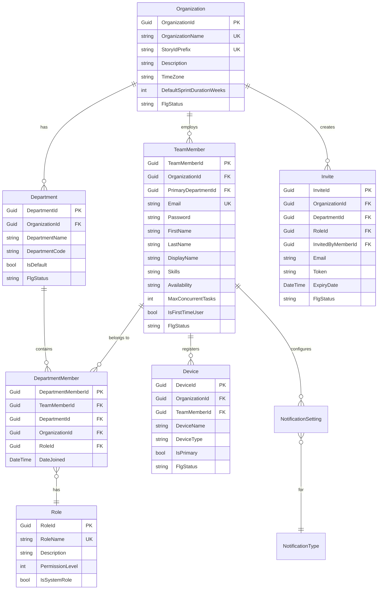
```mermaid
erDiagram
    Organization ||--o{ Department : "has"
    Organization ||--o{ TeamMember : "employs"
    Organization ||--o{ Invite : "creates"
    Department ||--o{ DepartmentMember : "contains"
    TeamMember ||--o{ DepartmentMember : "belongs to"
    DepartmentMember }o--|| Role : "has"
    TeamMember ||--o{ Device : "registers"
    TeamMember ||--o{ NotificationSetting : "configures"
    NotificationSetting }o--|| NotificationType : "for"

    Organization {
        Guid OrganizationId PK
        string OrganizationName UK
        string StoryIdPrefix UK
        string Description
        string TimeZone
        int DefaultSprintDurationWeeks
        string FlgStatus
    }

    Department {
        Guid DepartmentId PK
        Guid OrganizationId FK
        string DepartmentName
        string DepartmentCode
        bool IsDefault
        string FlgStatus
    }

    TeamMember {
        Guid TeamMemberId PK
        Guid OrganizationId FK
        Guid PrimaryDepartmentId FK
        string Email UK
        string Password
        string FirstName
        string LastName
        string DisplayName
        string Skills
        string Availability
        int MaxConcurrentTasks
        bool IsFirstTimeUser
        string FlgStatus
    }

    DepartmentMember {
        Guid DepartmentMemberId PK
        Guid TeamMemberId FK
        Guid DepartmentId FK
        Guid OrganizationId FK
        Guid RoleId FK
        DateTime DateJoined
    }

    Role {
        Guid RoleId PK
        string RoleName UK
        string Description
        int PermissionLevel
        bool IsSystemRole
    }

    Invite {
        Guid InviteId PK
        Guid OrganizationId FK
        Guid DepartmentId FK
        Guid RoleId FK
        Guid InvitedByMemberId FK
        string Email
        string Token
        DateTime ExpiryDate
        string FlgStatus
    }

    Device {
        Guid DeviceId PK
        Guid OrganizationId FK
        Guid TeamMemberId FK
        string DeviceName
        string DeviceType
        bool IsPrimary
        string FlgStatus
    }
```

#### WorkService ER Diagram

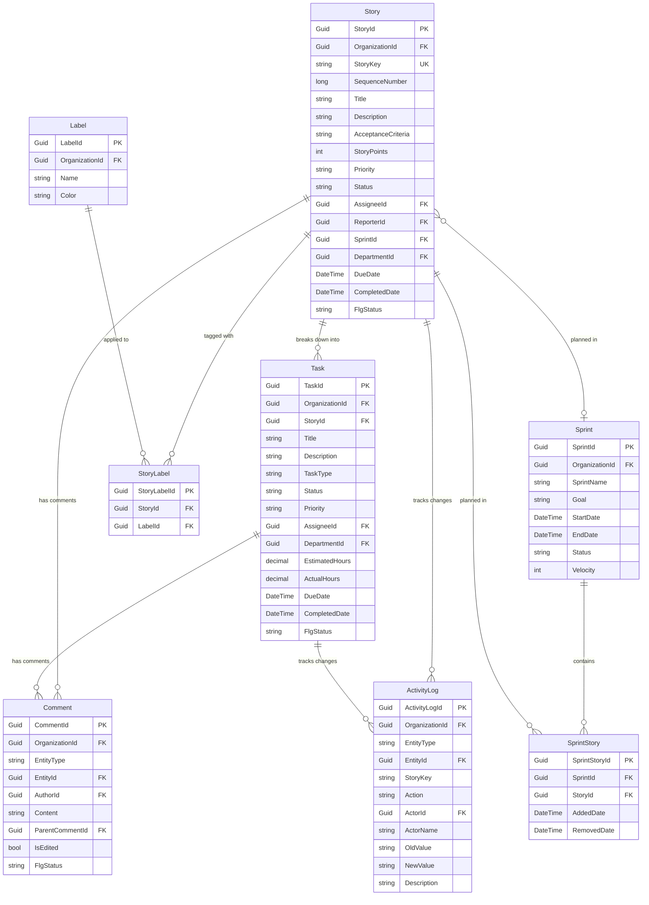
```mermaid
erDiagram
    Story ||--o{ Task : "breaks down into"
    Story ||--o{ Comment : "has comments"
    Story ||--o{ ActivityLog : "tracks changes"
    Story ||--o{ StoryLabel : "tagged with"
    Story }o--o| Sprint : "planned in"
    Task ||--o{ Comment : "has comments"
    Task ||--o{ ActivityLog : "tracks changes"
    Sprint ||--o{ SprintStory : "contains"
    Story ||--o{ SprintStory : "planned in"
    Label ||--o{ StoryLabel : "applied to"

    Story {
        Guid StoryId PK
        Guid OrganizationId FK
        string StoryKey UK
        long SequenceNumber
        string Title
        string Description
        string AcceptanceCriteria
        int StoryPoints
        string Priority
        string Status
        Guid AssigneeId FK
        Guid ReporterId FK
        Guid SprintId FK
        Guid DepartmentId FK
        DateTime DueDate
        DateTime CompletedDate
        string FlgStatus
    }

    Task {
        Guid TaskId PK
        Guid OrganizationId FK
        Guid StoryId FK
        string Title
        string Description
        string TaskType
        string Status
        string Priority
        Guid AssigneeId FK
        Guid DepartmentId FK
        decimal EstimatedHours
        decimal ActualHours
        DateTime DueDate
        DateTime CompletedDate
        string FlgStatus
    }

    Sprint {
        Guid SprintId PK
        Guid OrganizationId FK
        string SprintName
        string Goal
        DateTime StartDate
        DateTime EndDate
        string Status
        int Velocity
    }

    SprintStory {
        Guid SprintStoryId PK
        Guid SprintId FK
        Guid StoryId FK
        DateTime AddedDate
        DateTime RemovedDate
    }

    Comment {
        Guid CommentId PK
        Guid OrganizationId FK
        string EntityType
        Guid EntityId FK
        Guid AuthorId FK
        string Content
        Guid ParentCommentId FK
        bool IsEdited
        string FlgStatus
    }

    ActivityLog {
        Guid ActivityLogId PK
        Guid OrganizationId FK
        string EntityType
        Guid EntityId FK
        string StoryKey
        string Action
        Guid ActorId FK
        string ActorName
        string OldValue
        string NewValue
        string Description
    }

    Label {
        Guid LabelId PK
        Guid OrganizationId FK
        string Name
        string Color
    }

    StoryLabel {
        Guid StoryLabelId PK
        Guid StoryId FK
        Guid LabelId FK
    }
```

#### SecurityService ER Diagram

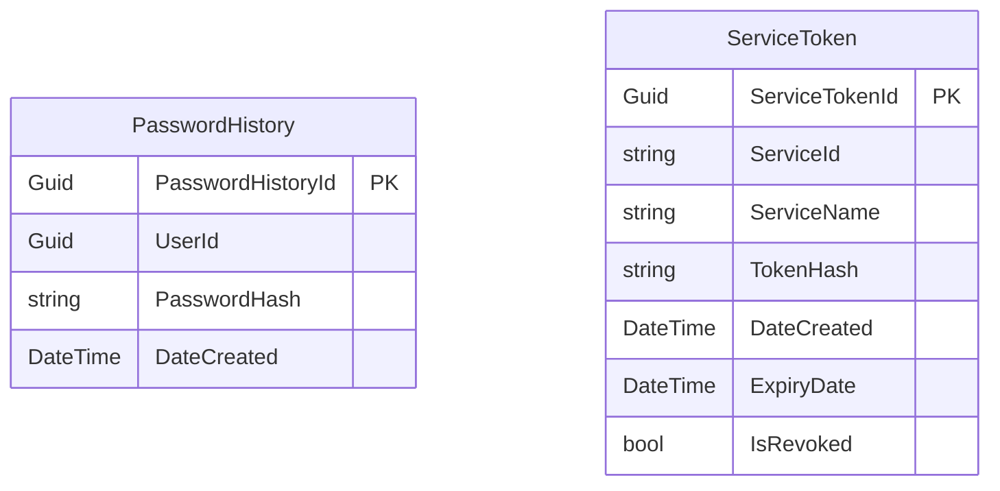
```mermaid
erDiagram
    PasswordHistory {
        Guid PasswordHistoryId PK
        Guid UserId
        string PasswordHash
        DateTime DateCreated
    }

    ServiceToken {
        Guid ServiceTokenId PK
        string ServiceId
        string ServiceName
        string TokenHash
        DateTime DateCreated
        DateTime ExpiryDate
        bool IsRevoked
    }
```

#### UtilityService ER Diagram


```mermaid
erDiagram
    AuditLog {
        Guid AuditLogId PK
        Guid OrganizationId
        string ServiceName
        string Action
        string EntityType
        string EntityId
        string UserId
        string OldValue
        string NewValue
        string IpAddress
        string CorrelationId
        DateTime DateCreated
    }

    ArchivedAuditLog {
        Guid ArchivedAuditLogId PK
        Guid AuditLogId
        DateTime ArchivedDate
    }

    ErrorLog {
        Guid ErrorLogId PK
        Guid OrganizationId
        string ServiceName
        string ErrorCode
        string Message
        string StackTrace
        string CorrelationId
        string Severity
        DateTime DateCreated
    }

    ErrorCodeEntry {
        Guid ErrorCodeEntryId PK
        string Code UK
        int Value
        int HttpStatusCode
        string ResponseCode
        string Description
        string ServiceName
    }

    NotificationLog {
        Guid NotificationLogId PK
        Guid OrganizationId
        Guid UserId
        string NotificationType
        string Channel
        string Recipient
        string Subject
        string Status
        int RetryCount
    }

    DepartmentType {
        Guid DepartmentTypeId PK
        string TypeName
        string TypeCode
        string FlgStatus
    }

    PriorityLevel {
        Guid PriorityLevelId PK
        string Name
        int SortOrder
        string Color
        string FlgStatus
    }

    TaskTypeRef {
        Guid TaskTypeRefId PK
        string TypeName
        string DefaultDepartmentCode
        string FlgStatus
    }

    WorkflowState {
        Guid WorkflowStateId PK
        string EntityType
        string StateName
        int SortOrder
        string FlgStatus
    }
```

### 9.2 Story ID Generation Strategy

The story ID system is a critical differentiator. Here is the complete flow:

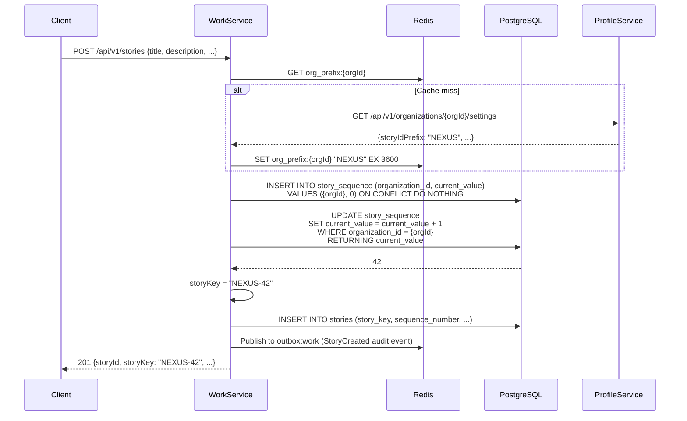
```mermaid
sequenceDiagram
    participant Client
    participant WorkService
    participant Redis
    participant PostgreSQL
    participant ProfileService

    Client->>WorkService: POST /api/v1/stories {title, description, ...}
    WorkService->>Redis: GET org_prefix:{orgId}
    alt Cache miss
        WorkService->>ProfileService: GET /api/v1/organizations/{orgId}/settings
        ProfileService-->>WorkService: {storyIdPrefix: "NEXUS", ...}
        WorkService->>Redis: SET org_prefix:{orgId} "NEXUS" EX 3600
    end
    WorkService->>PostgreSQL: INSERT INTO story_sequence (organization_id, current_value)<br/>VALUES ({orgId}, 0) ON CONFLICT DO NOTHING
    WorkService->>PostgreSQL: UPDATE story_sequence<br/>SET current_value = current_value + 1<br/>WHERE organization_id = {orgId}<br/>RETURNING current_value
    PostgreSQL-->>WorkService: 42
    WorkService->>WorkService: storyKey = "NEXUS-42"
    WorkService->>PostgreSQL: INSERT INTO stories (story_key, sequence_number, ...)
    WorkService->>Redis: Publish to outbox:work (StoryCreated audit event)
    WorkService-->>Client: 201 {storyId, storyKey: "NEXUS-42", ...}
```

### 9.3 Workflow State Machine Definitions

**Story states:** `Backlog` → `Ready` → `InProgress` → `InReview` → `QA` → `Done` → `Closed`

**Task states:** `ToDo` → `InProgress` → `InReview` → `Done`

**Sprint states:** `Planning` → `Active` → `Completed` | `Cancelled`

### 9.4 Status Convention

All entities with a lifecycle use `FlgStatus` with values:
- `A` — Active
- `S` — Suspended (organizations, departments, team members)
- `D` — Deactivated / Deleted (soft delete for stories, tasks, comments)

### 9.5 Timestamp Convention

All entities include:
- `DateCreated` — Set to `DateTime.UtcNow` on creation
- `DateUpdated` — Updated on every modification

---

## 10. Configuration

### 10.1 Environment Variables

#### SecurityService (Port 5001)

| Variable | Description | Default |
|----------|-------------|---------|
| `ASPNETCORE_ENVIRONMENT` | Runtime environment | `Development` |
| `ASPNETCORE_URLS` | Listening URL | `http://*:5001` |
| `ALLOWED_ORIGINS` | CORS origins (comma-separated) | `http://localhost:5001,http://localhost:3000` |
| `DATABASE_CONNECTION_STRING` | PostgreSQL connection string | — (required) |
| `JWT_ISSUER` | JWT issuer claim | — (required) |
| `JWT_AUDIENCE` | JWT audience claim | — (required) |
| `JWT_SECRET_KEY` | JWT signing key (≥32 bytes) | — (required) |
| `ACCESS_TOKEN_EXPIRY_MINUTES` | Access token TTL | `15` |
| `REFRESH_TOKEN_EXPIRY_DAYS` | Refresh token TTL | `7` |
| `REDIS_CONNECTION_STRING` | Redis connection | — (required) |
| `RATE_LIMIT_LOGIN_MAX` | Max login attempts per window | `5` |
| `RATE_LIMIT_LOGIN_WINDOW_MINUTES` | Login rate limit window | `15` |
| `RATE_LIMIT_OTP_MAX` | Max OTP requests per window | `3` |
| `RATE_LIMIT_OTP_WINDOW_MINUTES` | OTP rate limit window | `5` |
| `OTP_EXPIRY_MINUTES` | OTP code TTL | `5` |
| `OTP_MAX_ATTEMPTS` | Max OTP verification attempts | `3` |
| `ACCOUNT_LOCKOUT_MAX_ATTEMPTS` | Failed logins before lockout | `10` |
| `ACCOUNT_LOCKOUT_WINDOW_HOURS` | Lockout tracking window | `24` |
| `ACCOUNT_LOCKOUT_DURATION_MINUTES` | Lockout duration | `60` |
| `UTILITY_SERVICE_BASE_URL` | UtilityService URL | — (required) |
| `PROFILE_SERVICE_BASE_URL` | ProfileService URL | — (required) |

#### ProfileService (Port 5002)

| Variable | Description | Default |
|----------|-------------|---------|
| `ASPNETCORE_ENVIRONMENT` | Runtime environment | `Development` |
| `ASPNETCORE_URLS` | Listening URL | `http://*:5002` |
| `ALLOWED_ORIGINS` | CORS origins | `http://localhost:5002,http://localhost:3000` |
| `DATABASE_CONNECTION_STRING` | PostgreSQL connection string | — (required) |
| `JWT_ISSUER` | JWT issuer claim | — (required) |
| `JWT_AUDIENCE` | JWT audience claim | — (required) |
| `JWT_SECRET_KEY` | JWT signing key (≥32 bytes) | — (required) |
| `ACCESS_TOKEN_EXPIRY_MINUTES` | Access token TTL | `15` |
| `REDIS_CONNECTION_STRING` | Redis connection | — (required) |
| `UTILITY_SERVICE_BASE_URL` | UtilityService URL | — (required) |
| `SECURITY_SERVICE_BASE_URL` | SecurityService URL | — (required) |

#### WorkService (Port 5003)

| Variable | Description | Default |
|----------|-------------|---------|
| `ASPNETCORE_ENVIRONMENT` | Runtime environment | `Development` |
| `ASPNETCORE_URLS` | Listening URL | `http://*:5003` |
| `ALLOWED_ORIGINS` | CORS origins | `http://localhost:5003,http://localhost:3000` |
| `DATABASE_CONNECTION_STRING` | PostgreSQL connection string | — (required) |
| `JWT_ISSUER` | JWT issuer claim | — (required) |
| `JWT_AUDIENCE` | JWT audience claim | — (required) |
| `JWT_SECRET_KEY` | JWT signing key (≥32 bytes) | — (required) |
| `ACCESS_TOKEN_EXPIRY_MINUTES` | Access token TTL | `15` |
| `REDIS_CONNECTION_STRING` | Redis connection | — (required) |
| `UTILITY_SERVICE_BASE_URL` | UtilityService URL | — (required) |
| `PROFILE_SERVICE_BASE_URL` | ProfileService URL | — (required) |
| `SECURITY_SERVICE_BASE_URL` | SecurityService URL | — (required) |
| `SEARCH_MIN_QUERY_LENGTH` | Minimum search query length | `2` |
| `MAX_LABELS_PER_STORY` | Maximum labels per story | `10` |
| `MAX_STORY_POINTS` | Maximum story points value | `21` |

#### UtilityService (Port 5200)

| Variable | Description | Default |
|----------|-------------|---------|
| `ASPNETCORE_ENVIRONMENT` | Runtime environment | `Development` |
| `ASPNETCORE_URLS` | Listening URL | `http://*:5200` |
| `ALLOWED_ORIGINS` | CORS origins | `http://localhost:5200,http://localhost:3000` |
| `DATABASE_CONNECTION_STRING` | PostgreSQL connection string | — (required) |
| `JWT_ISSUER` | JWT issuer claim | — (required) |
| `JWT_AUDIENCE` | JWT audience claim | — (required) |
| `JWT_SECRET_KEY` | JWT signing key (≥32 bytes) | — (required) |
| `ACCESS_TOKEN_EXPIRY_MINUTES` | Access token TTL | `15` |
| `REDIS_CONNECTION_STRING` | Redis connection | — (required) |
| `RETENTION_PERIOD_DAYS` | Audit log retention before archival | `90` |
| `RETENTION_SCHEDULE_CRON` | Cron schedule for archival job | `0 2 * * *` |
| `OUTBOX_POLL_INTERVAL_SECONDS` | Outbox polling frequency | `30` |
| `DUE_DATE_CHECK_INTERVAL_HOURS` | Due date notification check interval | `6` |
| `EMAIL_GATEWAY_URL` | Email provider endpoint | — (required) |
| `EMAIL_GATEWAY_API_KEY` | Email provider API key | — (required) |
| `PUSH_GATEWAY_URL` | Push notification endpoint | — (required) |
| `PUSH_GATEWAY_API_KEY` | Push notification API key | — (required) |

### 10.2 .env File Pattern

Each service uses `DotNetEnv` to load a `.env` file at startup:

```csharp
// Program.cs
using DotNetEnv;
Env.Load();

var builder = WebApplication.CreateBuilder(args);
builder.Services.AddWorkServiceDependencies();
var app = builder.Build();
DatabaseMigrationHelper.ApplyMigrations(app);
app.UseWorkServicePipeline();
app.Run();

// Make Program class accessible for integration tests
public partial class Program { }
```

### 10.3 AppSettings Class Pattern

Each service defines an `AppSettings` class populated from environment variables:

```csharp
public class AppSettings
{
    public string DatabaseConnectionString { get; set; } = string.Empty;
    public string JwtIssuer { get; set; } = string.Empty;
    public string JwtAudience { get; set; } = string.Empty;
    public string JwtSecretKey { get; set; } = string.Empty;
    public int AccessTokenExpiryMinutes { get; set; }
    public string RedisConnectionString { get; set; } = string.Empty;
    public string[] AllowedOrigins { get; set; } = [];
    public string ProfileServiceBaseUrl { get; set; } = string.Empty;
    public string SecurityServiceBaseUrl { get; set; } = string.Empty;
    public string UtilityServiceBaseUrl { get; set; } = string.Empty;
    // ... service-specific properties ...

    public static AppSettings FromEnvironment()
    {
        return new AppSettings
        {
            DatabaseConnectionString =
                GetRequiredEnv("DATABASE_CONNECTION_STRING"),
            JwtIssuer = GetRequiredEnv("JWT_ISSUER"),
            JwtAudience = GetRequiredEnv("JWT_AUDIENCE"),
            JwtSecretKey = GetRequiredEnv("JWT_SECRET_KEY"),
            AccessTokenExpiryMinutes =
                GetEnvInt("ACCESS_TOKEN_EXPIRY_MINUTES", 15),
            RedisConnectionString =
                GetRequiredEnv("REDIS_CONNECTION_STRING"),
            AllowedOrigins = (Environment
                .GetEnvironmentVariable("ALLOWED_ORIGINS") ?? "")
                .Split(',', StringSplitOptions.RemoveEmptyEntries),
            ProfileServiceBaseUrl =
                GetRequiredEnv("PROFILE_SERVICE_BASE_URL"),
            SecurityServiceBaseUrl =
                GetRequiredEnv("SECURITY_SERVICE_BASE_URL"),
            UtilityServiceBaseUrl =
                GetRequiredEnv("UTILITY_SERVICE_BASE_URL"),
        };
    }

    private static string GetRequiredEnv(string key) =>
        Environment.GetEnvironmentVariable(key)
        ?? throw new InvalidOperationException(
            $"Required environment variable '{key}' is not set.");

    private static int GetEnvInt(string key, int defaultValue) =>
        int.TryParse(
            Environment.GetEnvironmentVariable(key), out var value)
            ? value : defaultValue;
}
```

Registered as singleton: `services.AddSingleton(AppSettings.FromEnvironment());`

---

## 11. Testing Strategy

### 11.1 Unit Tests (xUnit)

Each service has a dedicated test project: `{Service}.Tests/`

**Coverage areas:**
- Error code constants (correct values and strings)
- Validator existence and rule enforcement
- DI registration verification
- Service client interface methods
- Typed DTO property existence
- DomainException constructor and hierarchy
- Business rule enforcement in service classes
- Workflow state machine transitions (valid and invalid)
- Story ID generation logic
- Task auto-assignment logic
- Sprint metrics calculation

### 11.2 Property-Based Tests (FsCheck)

FsCheck with xUnit integration (`FsCheck.Xunit`) for universal invariant verification.

**Configuration:** Minimum 100 iterations per property test.

**Example properties:**
- `ApiResponse` always includes `CorrelationId` when created via error path
- `GlobalExceptionHandlerMiddleware` always returns `application/problem+json` content type
- Validation pipeline always returns HTTP 422 for invalid inputs
- `CorrelationIdDelegatingHandler` always attaches `X-Correlation-Id` header
- Service client always throws `DomainException` on downstream 4xx/5xx
- `WorkflowStateMachine.IsValidStoryTransition` rejects all invalid transitions
- `WorkflowStateMachine.IsValidTaskTransition` rejects all invalid transitions
- Story ID generator always produces `{PREFIX}-{N}` format where N > 0
- Task auto-assignment never assigns to members at capacity
- Sprint velocity equals sum of completed story points

### 11.3 Integration Tests (WebApplicationFactory)

Shared project: `Nexus2.IntegrationTests/`

**Infrastructure:**
- `WebApplicationFactory<Program>` for each service
- InMemory EF Core database (auto-detected by `DatabaseMigrationHelper`)
- `FakeRedis` — Mock `IConnectionMultiplexer` backed by `ConcurrentDictionary`
- `TestEnvironment` — Sets all required environment variables before host creation

**FakeRedis implementation:**

```csharp
public static class FakeRedis
{
    public static IConnectionMultiplexer Create()
    {
        var store = new ConcurrentDictionary<string, RedisValue>();
        var hashStore = new ConcurrentDictionary<string,
            ConcurrentDictionary<string, RedisValue>>();

        var mockDb = new Mock<IDatabase>();

        // StringSet, StringGet, KeyDelete, KeyExists
        // HashSet, HashGet
        // ScriptEvaluate (rate limiter) returns 0

        var mockMux = new Mock<IConnectionMultiplexer>();
        mockMux.Setup(m => m.GetDatabase(
                It.IsAny<int>(), It.IsAny<object>()))
            .Returns(mockDb.Object);
        mockMux.Setup(m => m.IsConnected).Returns(true);

        return mockMux.Object;
    }
}
```

**Test environment setup:**

```csharp
public static class TestEnvironment
{
    public static void EnsureInitialized()
    {
        Environment.SetEnvironmentVariable(
            "DATABASE_CONNECTION_STRING", "InMemory");
        Environment.SetEnvironmentVariable(
            "JWT_ISSUER", "nexus-test");
        Environment.SetEnvironmentVariable(
            "JWT_AUDIENCE", "nexus-test");
        Environment.SetEnvironmentVariable(
            "JWT_SECRET_KEY",
            "test-secret-key-that-is-at-least-32-bytes-long!");
        Environment.SetEnvironmentVariable(
            "REDIS_CONNECTION_STRING", "localhost:6379");
        Environment.SetEnvironmentVariable(
            "PROFILE_SERVICE_BASE_URL", "http://localhost:5002");
        Environment.SetEnvironmentVariable(
            "SECURITY_SERVICE_BASE_URL", "http://localhost:5001");
        Environment.SetEnvironmentVariable(
            "UTILITY_SERVICE_BASE_URL", "http://localhost:5200");
        Environment.SetEnvironmentVariable(
            "EMAIL_GATEWAY_URL", "http://localhost:9999");
        Environment.SetEnvironmentVariable(
            "EMAIL_GATEWAY_API_KEY", "test-key");
        Environment.SetEnvironmentVariable(
            "PUSH_GATEWAY_URL", "http://localhost:9998");
        Environment.SetEnvironmentVariable(
            "PUSH_GATEWAY_API_KEY", "test-key");
    }
}
```

**Test flows:**
- `SecurityAuthFlowTests` — Login, token refresh, session management
- `ProfileOrganizationFlowTests` — Organization CRUD, department management, team member invite
- `WorkStoryFlowTests` — Story creation with ID generation, task breakdown, status transitions
- `WorkSprintFlowTests` — Sprint lifecycle, story planning, metrics calculation
- Cross-service integration via mocked HTTP handlers

### 11.4 Test Organization

```
{service_root}/
├── {Service}.Api/
├── {Service}.Domain/
├── {Service}.Application/
├── {Service}.Infrastructure/
└── {Service}.Tests/
    ├── Unit/
    │   ├── ErrorCodesTests.cs
    │   ├── ValidatorTests.cs
    │   ├── ServiceClientTests.cs
    │   ├── DomainExceptionTests.cs
    │   ├── WorkflowStateMachineTests.cs      (WorkService)
    │   ├── StoryIdGeneratorTests.cs           (WorkService)
    │   └── TaskAssignmentServiceTests.cs      (WorkService)
    ├── Property/
    │   ├── ErrorHandlingPropertyTests.cs
    │   ├── ValidationPropertyTests.cs
    │   ├── InterServicePropertyTests.cs
    │   ├── WorkflowPropertyTests.cs           (WorkService)
    │   └── StoryIdPropertyTests.cs            (WorkService)
    └── {Service}.Tests.csproj

integration_tests/
└── Nexus2.IntegrationTests/
    ├── Fixtures/
    │   ├── FakeRedis.cs
    │   └── TestEnvironment.cs
    ├── Tests/
    │   ├── SecurityAuthFlowTests.cs
    │   ├── ProfileOrganizationFlowTests.cs
    │   ├── WorkStoryFlowTests.cs
    │   └── WorkSprintFlowTests.cs
    └── Nexus2.IntegrationTests.csproj
```

**Test project references:**
- `{Service}.Tests` → `{Service}.Api` (and optionally Domain, Application, Infrastructure)
- `IntegrationTests` → All `{Service}.Api` projects

---

## 12. Key Workflows

### 12.1 Organization Setup → Department Creation → Team Member Invite → Member Joins

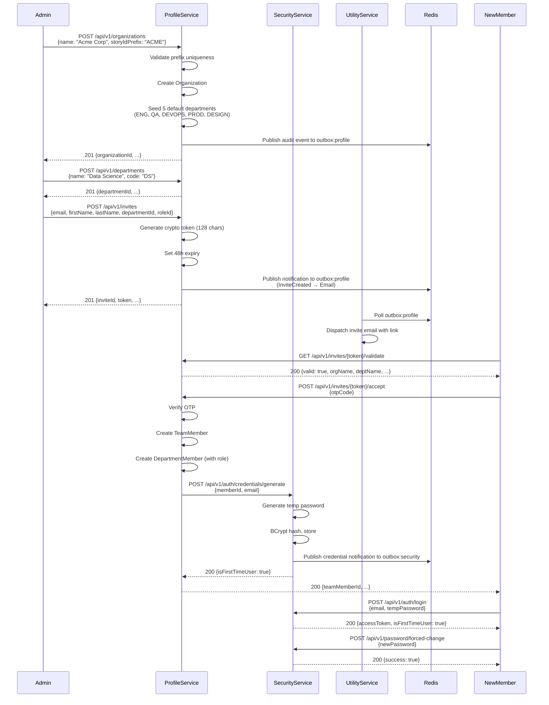
```mermaid
sequenceDiagram
    participant Admin
    participant ProfileService
    participant SecurityService
    participant UtilityService
    participant Redis
    participant NewMember

    Admin->>ProfileService: POST /api/v1/organizations<br/>{name: "Acme Corp", storyIdPrefix: "ACME"}
    ProfileService->>ProfileService: Validate prefix uniqueness
    ProfileService->>ProfileService: Create Organization
    ProfileService->>ProfileService: Seed 5 default departments<br/>(ENG, QA, DEVOPS, PROD, DESIGN)
    ProfileService->>Redis: Publish audit event to outbox:profile
    ProfileService-->>Admin: 201 {organizationId, ...}

    Admin->>ProfileService: POST /api/v1/departments<br/>{name: "Data Science", code: "DS"}
    ProfileService-->>Admin: 201 {departmentId, ...}

    Admin->>ProfileService: POST /api/v1/invites<br/>{email, firstName, lastName, departmentId, roleId}
    ProfileService->>ProfileService: Generate crypto token (128 chars)
    ProfileService->>ProfileService: Set 48h expiry
    ProfileService->>Redis: Publish notification to outbox:profile<br/>(InviteCreated → Email)
    ProfileService-->>Admin: 201 {inviteId, token, ...}

    UtilityService->>Redis: Poll outbox:profile
    UtilityService->>UtilityService: Dispatch invite email with link

    NewMember->>ProfileService: GET /api/v1/invites/{token}/validate
    ProfileService-->>NewMember: 200 {valid: true, orgName, deptName, ...}

    NewMember->>ProfileService: POST /api/v1/invites/{token}/accept<br/>{otpCode}
    ProfileService->>ProfileService: Verify OTP
    ProfileService->>ProfileService: Create TeamMember
    ProfileService->>ProfileService: Create DepartmentMember (with role)
    ProfileService->>SecurityService: POST /api/v1/auth/credentials/generate<br/>{memberId, email}
    SecurityService->>SecurityService: Generate temp password
    SecurityService->>SecurityService: BCrypt hash, store
    SecurityService->>Redis: Publish credential notification to outbox:security
    SecurityService-->>ProfileService: 200 {isFirstTimeUser: true}
    ProfileService-->>NewMember: 200 {teamMemberId, ...}

    NewMember->>SecurityService: POST /api/v1/auth/login<br/>{email, tempPassword}
    SecurityService-->>NewMember: 200 {accessToken, isFirstTimeUser: true}

    NewMember->>SecurityService: POST /api/v1/password/forced-change<br/>{newPassword}
    SecurityService-->>NewMember: 200 {success: true}
```

### 12.2 Story Creation → Task Breakdown → Department Assignment → Sprint Planning

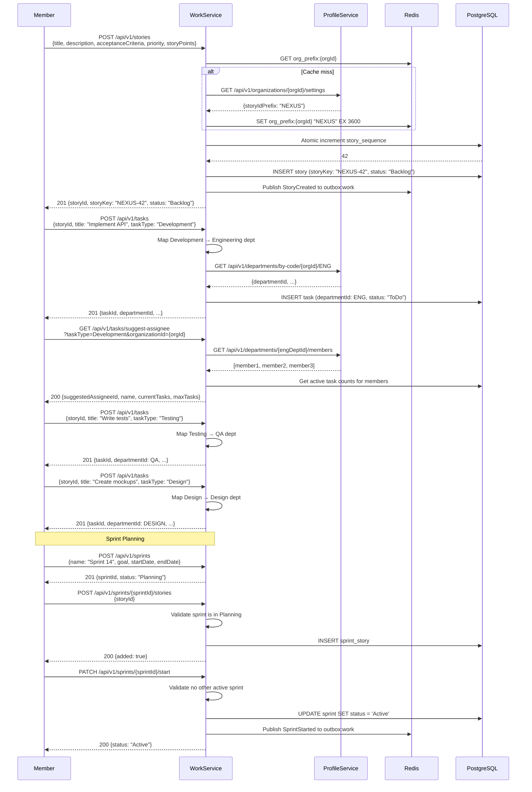
```mermaid
sequenceDiagram
    participant Member
    participant WorkService
    participant ProfileService
    participant Redis
    participant PostgreSQL

    Member->>WorkService: POST /api/v1/stories<br/>{title, description, acceptanceCriteria, priority, storyPoints}
    WorkService->>Redis: GET org_prefix:{orgId}
    alt Cache miss
        WorkService->>ProfileService: GET /api/v1/organizations/{orgId}/settings
        ProfileService-->>WorkService: {storyIdPrefix: "NEXUS"}
        WorkService->>Redis: SET org_prefix:{orgId} "NEXUS" EX 3600
    end
    WorkService->>PostgreSQL: Atomic increment story_sequence
    PostgreSQL-->>WorkService: 42
    WorkService->>PostgreSQL: INSERT story (storyKey: "NEXUS-42", status: "Backlog")
    WorkService->>Redis: Publish StoryCreated to outbox:work
    WorkService-->>Member: 201 {storyId, storyKey: "NEXUS-42", status: "Backlog"}

    Member->>WorkService: POST /api/v1/tasks<br/>{storyId, title: "Implement API", taskType: "Development"}
    WorkService->>WorkService: Map Development → Engineering dept
    WorkService->>ProfileService: GET /api/v1/departments/by-code/{orgId}/ENG
    ProfileService-->>WorkService: {departmentId, ...}
    WorkService->>PostgreSQL: INSERT task (departmentId: ENG, status: "ToDo")
    WorkService-->>Member: 201 {taskId, departmentId, ...}

    Member->>WorkService: GET /api/v1/tasks/suggest-assignee<br/>?taskType=Development&organizationId={orgId}
    WorkService->>ProfileService: GET /api/v1/departments/{engDeptId}/members
    ProfileService-->>WorkService: [member1, member2, member3]
    WorkService->>PostgreSQL: Get active task counts for members
    WorkService-->>Member: 200 {suggestedAssigneeId, name, currentTasks, maxTasks}

    Member->>WorkService: POST /api/v1/tasks<br/>{storyId, title: "Write tests", taskType: "Testing"}
    WorkService->>WorkService: Map Testing → QA dept
    WorkService-->>Member: 201 {taskId, departmentId: QA, ...}

    Member->>WorkService: POST /api/v1/tasks<br/>{storyId, title: "Create mockups", taskType: "Design"}
    WorkService->>WorkService: Map Design → Design dept
    WorkService-->>Member: 201 {taskId, departmentId: DESIGN, ...}

    Note over Member,WorkService: Sprint Planning

    Member->>WorkService: POST /api/v1/sprints<br/>{name: "Sprint 14", goal, startDate, endDate}
    WorkService-->>Member: 201 {sprintId, status: "Planning"}

    Member->>WorkService: POST /api/v1/sprints/{sprintId}/stories<br/>{storyId}
    WorkService->>WorkService: Validate sprint is in Planning
    WorkService->>PostgreSQL: INSERT sprint_story
    WorkService-->>Member: 200 {added: true}

    Member->>WorkService: PATCH /api/v1/sprints/{sprintId}/start
    WorkService->>WorkService: Validate no other active sprint
    WorkService->>PostgreSQL: UPDATE sprint SET status = 'Active'
    WorkService->>Redis: Publish SprintStarted to outbox:work
    WorkService-->>Member: 200 {status: "Active"}
```

### 12.3 Sprint Execution → Task Completion → Story Completion → Sprint Review

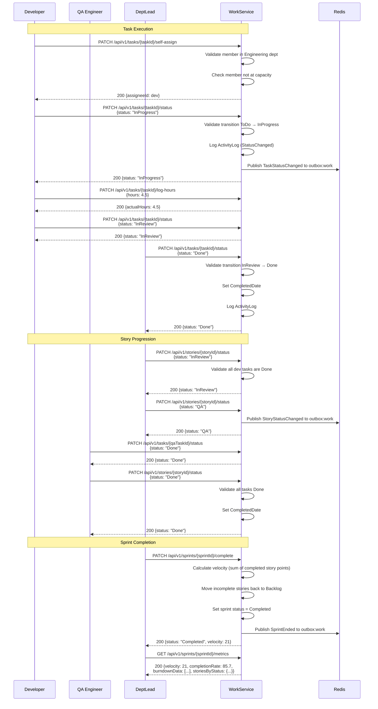
```mermaid
sequenceDiagram
    participant Dev as Developer
    participant QA as QA Engineer
    participant Lead as DeptLead
    participant WorkService
    participant Redis

    Note over Dev,WorkService: Task Execution

    Dev->>WorkService: PATCH /api/v1/tasks/{taskId}/self-assign
    WorkService->>WorkService: Validate member in Engineering dept
    WorkService->>WorkService: Check member not at capacity
    WorkService-->>Dev: 200 {assigneeId: dev}

    Dev->>WorkService: PATCH /api/v1/tasks/{taskId}/status<br/>{status: "InProgress"}
    WorkService->>WorkService: Validate transition ToDo → InProgress
    WorkService->>WorkService: Log ActivityLog (StatusChanged)
    WorkService->>Redis: Publish TaskStatusChanged to outbox:work
    WorkService-->>Dev: 200 {status: "InProgress"}

    Dev->>WorkService: PATCH /api/v1/tasks/{taskId}/log-hours<br/>{hours: 4.5}
    WorkService-->>Dev: 200 {actualHours: 4.5}

    Dev->>WorkService: PATCH /api/v1/tasks/{taskId}/status<br/>{status: "InReview"}
    WorkService-->>Dev: 200 {status: "InReview"}

    Lead->>WorkService: PATCH /api/v1/tasks/{taskId}/status<br/>{status: "Done"}
    WorkService->>WorkService: Validate transition InReview → Done
    WorkService->>WorkService: Set CompletedDate
    WorkService->>WorkService: Log ActivityLog
    WorkService-->>Lead: 200 {status: "Done"}

    Note over Dev,WorkService: Story Progression

    Lead->>WorkService: PATCH /api/v1/stories/{storyId}/status<br/>{status: "InReview"}
    WorkService->>WorkService: Validate all dev tasks are Done
    WorkService-->>Lead: 200 {status: "InReview"}

    Lead->>WorkService: PATCH /api/v1/stories/{storyId}/status<br/>{status: "QA"}
    WorkService->>Redis: Publish StoryStatusChanged to outbox:work
    WorkService-->>Lead: 200 {status: "QA"}

    QA->>WorkService: PATCH /api/v1/tasks/{qaTaskId}/status<br/>{status: "Done"}
    WorkService-->>QA: 200 {status: "Done"}

    QA->>WorkService: PATCH /api/v1/stories/{storyId}/status<br/>{status: "Done"}
    WorkService->>WorkService: Validate all tasks Done
    WorkService->>WorkService: Set CompletedDate
    WorkService-->>QA: 200 {status: "Done"}

    Note over Dev,WorkService: Sprint Completion

    Lead->>WorkService: PATCH /api/v1/sprints/{sprintId}/complete
    WorkService->>WorkService: Calculate velocity (sum of completed story points)
    WorkService->>WorkService: Move incomplete stories back to Backlog
    WorkService->>WorkService: Set sprint status = Completed
    WorkService->>Redis: Publish SprintEnded to outbox:work
    WorkService-->>Lead: 200 {status: "Completed", velocity: 21}

    Lead->>WorkService: GET /api/v1/sprints/{sprintId}/metrics
    WorkService-->>Lead: 200 {velocity: 21, completionRate: 85.7,<br/>burndownData: [...], storiesByStatus: {...}}
```

### 12.4 Department-Based Task Auto-Assignment Flow

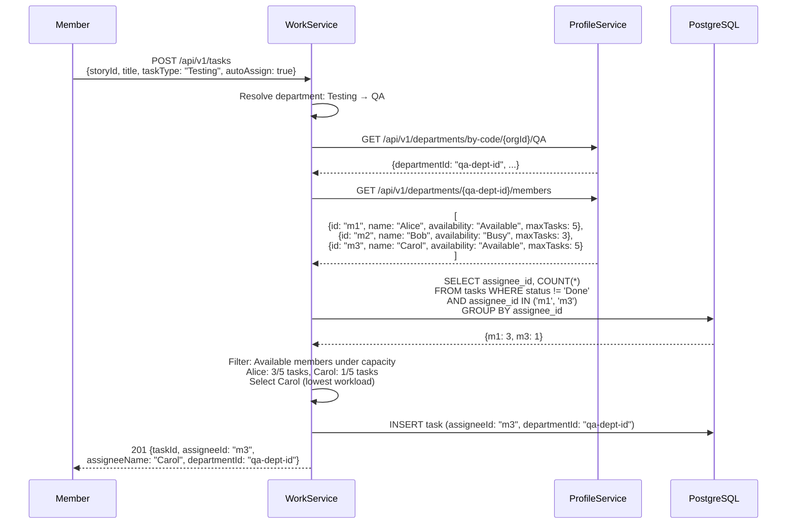
```mermaid
sequenceDiagram
    participant Member
    participant WorkService
    participant ProfileService
    participant PostgreSQL

    Member->>WorkService: POST /api/v1/tasks<br/>{storyId, title, taskType: "Testing", autoAssign: true}

    WorkService->>WorkService: Resolve department: Testing → QA

    WorkService->>ProfileService: GET /api/v1/departments/by-code/{orgId}/QA
    ProfileService-->>WorkService: {departmentId: "qa-dept-id", ...}

    WorkService->>ProfileService: GET /api/v1/departments/{qa-dept-id}/members
    ProfileService-->>WorkService: [<br/>  {id: "m1", name: "Alice", availability: "Available", maxTasks: 5},<br/>  {id: "m2", name: "Bob", availability: "Busy", maxTasks: 3},<br/>  {id: "m3", name: "Carol", availability: "Available", maxTasks: 5}<br/>]

    WorkService->>PostgreSQL: SELECT assignee_id, COUNT(*)<br/>FROM tasks WHERE status != 'Done'<br/>AND assignee_id IN ('m1', 'm3')<br/>GROUP BY assignee_id
    PostgreSQL-->>WorkService: {m1: 3, m3: 1}

    WorkService->>WorkService: Filter: Available members under capacity<br/>Alice: 3/5 tasks, Carol: 1/5 tasks<br/>Select Carol (lowest workload)

    WorkService->>PostgreSQL: INSERT task (assigneeId: "m3", departmentId: "qa-dept-id")
    WorkService-->>Member: 201 {taskId, assigneeId: "m3",<br/>assigneeName: "Carol", departmentId: "qa-dept-id"}
```

### 12.5 Comment with @Mention Notification Flow

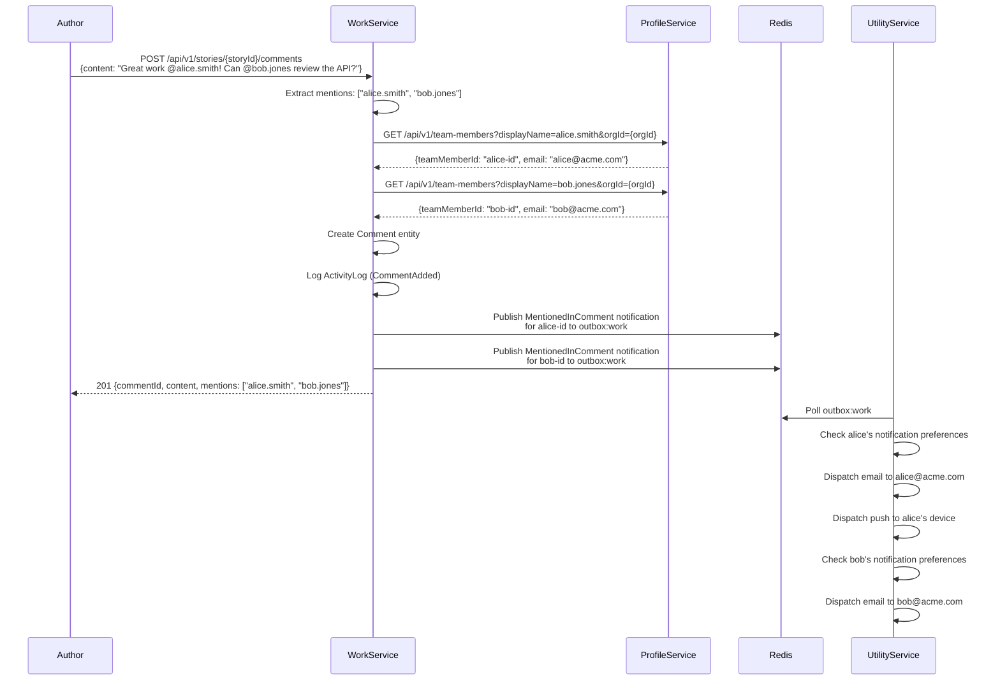
```mermaid
sequenceDiagram
    participant Author
    participant WorkService
    participant ProfileService
    participant Redis
    participant UtilityService

    Author->>WorkService: POST /api/v1/stories/{storyId}/comments<br/>{content: "Great work @alice.smith! Can @bob.jones review the API?"}

    WorkService->>WorkService: Extract mentions: ["alice.smith", "bob.jones"]

    WorkService->>ProfileService: GET /api/v1/team-members?displayName=alice.smith&orgId={orgId}
    ProfileService-->>WorkService: {teamMemberId: "alice-id", email: "alice@acme.com"}

    WorkService->>ProfileService: GET /api/v1/team-members?displayName=bob.jones&orgId={orgId}
    ProfileService-->>WorkService: {teamMemberId: "bob-id", email: "bob@acme.com"}

    WorkService->>WorkService: Create Comment entity
    WorkService->>WorkService: Log ActivityLog (CommentAdded)

    WorkService->>Redis: Publish MentionedInComment notification<br/>for alice-id to outbox:work
    WorkService->>Redis: Publish MentionedInComment notification<br/>for bob-id to outbox:work

    WorkService-->>Author: 201 {commentId, content, mentions: ["alice.smith", "bob.jones"]}

    UtilityService->>Redis: Poll outbox:work
    UtilityService->>UtilityService: Check alice's notification preferences
    UtilityService->>UtilityService: Dispatch email to alice@acme.com
    UtilityService->>UtilityService: Dispatch push to alice's device
    UtilityService->>UtilityService: Check bob's notification preferences
    UtilityService->>UtilityService: Dispatch email to bob@acme.com
```

---

## Appendix: Quick Reference

### Error Code Ranges

| Service | Range | Common Codes |
|---------|-------|-------------|
| Shared | 1000 | VALIDATION_ERROR |
| SecurityService | 2001–2025 | NOT_FOUND (2021), CONFLICT (2022), SERVICE_UNAVAILABLE (2023) |
| ProfileService | 3001–3025 | NOT_FOUND (3021), CONFLICT (3022), SERVICE_UNAVAILABLE (3023) |
| WorkService | 4001–4040 | NOT_FOUND (4036), CONFLICT (4037), SERVICE_UNAVAILABLE (4038) |
| UtilityService | 6001–6015 | NOT_FOUND (6008), CONFLICT (6009), SERVICE_UNAVAILABLE (6010) |

### Inter-Service Dependencies

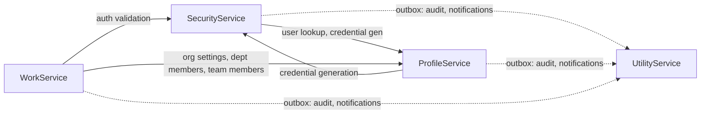
```mermaid
graph LR
    SEC[SecurityService] -->|user lookup, credential gen| PRO[ProfileService]
    PRO -->|credential generation| SEC
    WRK[WorkService] -->|org settings, dept members, team members| PRO
    WRK -->|auth validation| SEC
    SEC -.->|outbox: audit, notifications| UTL[UtilityService]
    PRO -.->|outbox: audit, notifications| UTL
    WRK -.->|outbox: audit, notifications| UTL
```

### NuGet Package Summary

| Package | Layer | Purpose |
|---------|-------|---------|
| `FluentValidation` | Application | Request validation |
| `Npgsql.EntityFrameworkCore.PostgreSQL` | Infrastructure | PostgreSQL provider |
| `StackExchange.Redis` | Infrastructure | Redis client |
| `BCrypt.Net-Next` | Infrastructure | Password hashing |
| `Microsoft.Extensions.Http.Polly` | Infrastructure | Resilience policies |
| `Polly` | Infrastructure | Retry, circuit breaker, timeout |
| `Microsoft.AspNetCore.Authentication.JwtBearer` | Infrastructure | JWT validation |
| `DotNetEnv` | Api | .env file loading |
| `Swashbuckle.AspNetCore` | Api | Swagger/OpenAPI |
| `FsCheck.Xunit` | Tests | Property-based testing |
| `Moq` | Tests | Mocking |
| `xunit` | Tests | Test framework |

### Solution Structure

```
Nexus2.sln
├── security_service/
│   ├── SecurityService.Domain/
│   ├── SecurityService.Application/
│   ├── SecurityService.Infrastructure/
│   ├── SecurityService.Api/              # Port 5001
│   └── SecurityService.Tests/
├── profile_service/
│   ├── ProfileService.Domain/
│   ├── ProfileService.Application/
│   ├── ProfileService.Infrastructure/
│   ├── ProfileService.Api/              # Port 5002
│   └── ProfileService.Tests/
├── work_service/
│   ├── WorkService.Domain/
│   ├── WorkService.Application/
│   ├── WorkService.Infrastructure/
│   ├── WorkService.Api/                 # Port 5003
│   └── WorkService.Tests/
├── utility_service/
│   ├── UtilityService.Domain/
│   ├── UtilityService.Application/
│   ├── UtilityService.Infrastructure/
│   ├── UtilityService.Api/              # Port 5200
│   └── UtilityService.Tests/
├── integration_tests/
│   └── Nexus2.IntegrationTests/
└── docs/
    └── nexus-2.0-backend-specification.md
```

### Response Code Mapping

| ResponseCode | Category |
|-------------|----------|
| `00` | Success |
| `01` | Authentication failed |
| `02` | Account locked/suspended |
| `03` | Authorization denied |
| `04` | OTP error |
| `05` | Password policy |
| `06` | Duplicate/conflict |
| `07` | Resource not found |
| `08` | Rate limit / capacity exceeded |
| `09` | Invalid value / state |
| `96` | Validation error |
| `98` | Internal error |
| `99` | Unknown |

### Seed Data Summary

**Roles (4):** OrgAdmin (100), DeptLead (75), Member (50), Viewer (25)

**Default Departments (5):** Engineering (ENG), QA (QA), DevOps (DEVOPS), Product (PROD), Design (DESIGN)

**Notification Types (8):** StoryAssigned, TaskAssigned, SprintStarted, SprintEnded, MentionedInComment, StoryStatusChanged, TaskStatusChanged, DueDateApproaching

**Task Types (6):** Development, Testing, DevOps, Design, Documentation, Bug

**Priority Levels (4):** Critical, High, Medium, Low

**Story Statuses (7):** Backlog, Ready, InProgress, InReview, QA, Done, Closed

**Task Statuses (4):** ToDo, InProgress, InReview, Done

**Sprint Statuses (4):** Planning, Active, Completed, Cancelled

**Story Points (Fibonacci):** 1, 2, 3, 5, 8, 13, 21
