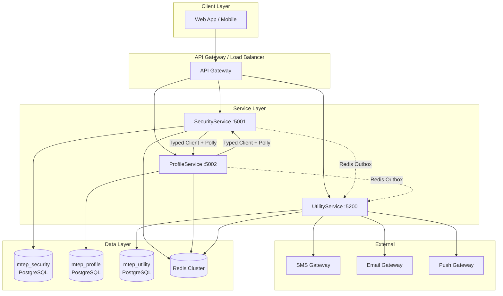
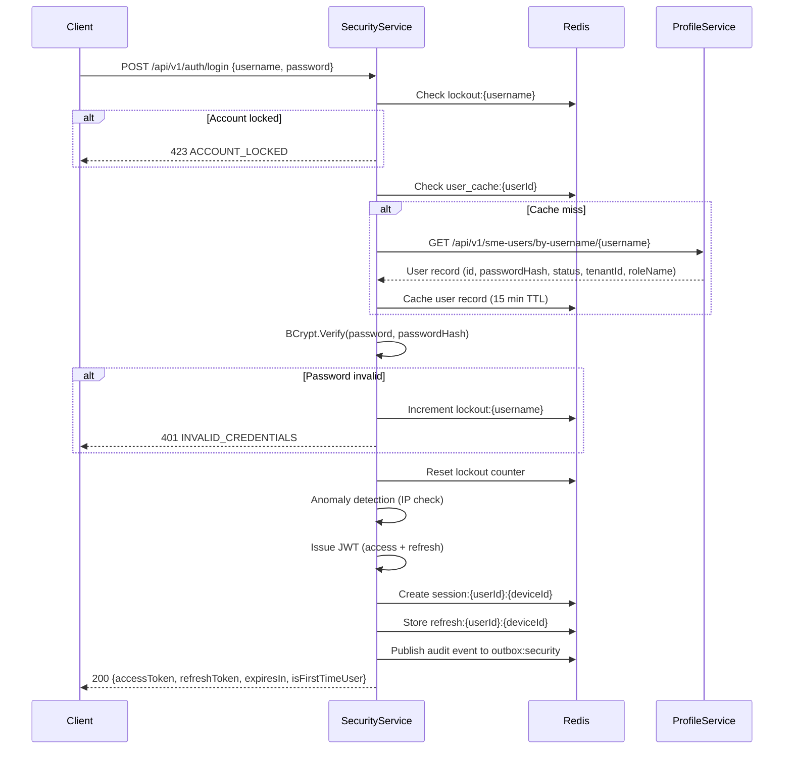
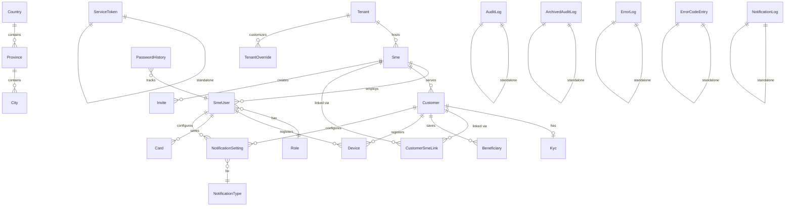
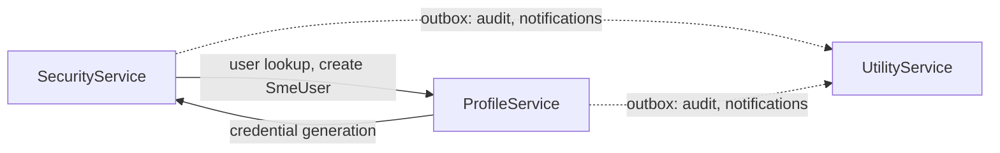

# Multi-Tenant Engagement Platform — Full Specification

> **Version:** 1.0  
> **Architecture:** Clean Architecture (.NET 8)  
> **Target:** Standalone build specification — no access to the original codebase required.

---

## Table of Contents

1. [Overview](#1-overview)
2. [Architecture](#2-architecture)
3. [Clean Architecture Layer Definitions](#3-clean-architecture-layer-definitions)
4. [SecurityService Specification](#4-securityservice-specification)
5. [ProfileService Specification](#5-profileservice-specification)
6. [UtilityService Specification](#6-utilityservice-specification)
7. [Cross-Cutting Patterns](#7-cross-cutting-patterns)
8. [Data Models](#8-data-models)
9. [Configuration](#9-configuration)
10. [Testing Strategy](#10-testing-strategy)

---

## 1. Overview

### 1.1 Platform Purpose and Scope

The Multi-Tenant Engagement Platform (MTEP) is a microservice-based backend enabling businesses (SMEs) to manage digital wallets, process transactions, onboard customers, and run engagement programs within a banking ecosystem. The platform is designed for multi-tenant isolation where each tenant represents a financial institution or partner organization, and each tenant hosts multiple SMEs (Small and Medium Enterprises) that interact with end customers.

Key capabilities:
- **Authentication & Security** — JWT-based auth, session management, RBAC, OTP, rate limiting, anomaly detection
- **Profile & Identity** — Multi-tenant management, SME onboarding, customer lifecycle, KYC, invites, devices, cards, beneficiaries
- **Utility & Operations** — Audit logging, error tracking with PII redaction, notification dispatch (SMS/email/push), reference data, retention archival

### 1.2 Multi-Tenant Architecture Overview

The platform enforces tenant isolation at every layer:

- **Database level:** EF Core global query filters automatically scope all queries by `TenantId`
- **API level:** `TenantScopeMiddleware` extracts `TenantId` from JWT claims and validates against route/query parameters
- **Entity level:** All tenant-scoped entities implement `ITenantEntity` interface
- **Inter-service level:** `X-Tenant-Id` header propagated on all service-to-service calls

Hierarchy: **Tenant → SME → SmeUser / Customer**

A Tenant is a financial institution. Each Tenant hosts multiple SMEs. Each SME has Admin and Operator staff (SmeUsers) and serves Customers. Customers can be shared across SMEs within the same Tenant via a link table.

### 1.3 Service Decomposition

| Service | Port | Database | Responsibility |
|---------|------|----------|----------------|
| SecurityService | 5001 | `mtep_security` | Authentication, JWT, sessions, RBAC, rate limiting, OTP, transaction PIN, anomaly detection, service-to-service auth |
| ProfileService | 5002 | `mtep_profile` | Tenants, SMEs, staff, customers, KYC, invites, devices, cards, beneficiaries, notification settings, form templates |
| UtilityService | 5200 | `mtep_utility` | Audit logs, error logs, notifications, error code registry, reference data, retention archival |

Each service owns its own PostgreSQL database and shares a Redis cluster for caching, rate limiting, sessions, outbox messaging, and token blacklisting.

---

## 2. Architecture

### 2.1 Clean Architecture Layer Structure

Each service is composed of four .NET projects:

```
{Service}.Domain/          — Entities, value objects, exceptions, error codes, interfaces
{Service}.Application/     — DTOs, validators, service interfaces, use-case orchestration
{Service}.Infrastructure/  — EF Core, Redis, HTTP clients, repository implementations
{Service}.Api/             — Controllers, middleware, Program.cs, DI composition root
```

### 2.2 High-Level Architecture Diagram



### 2.3 Inter-Service Communication Patterns

**Synchronous:** Typed service client interfaces (`IProfileServiceClient`, `ISecurityServiceClient`) with:
- Polly resilience policies (retry 3x exponential, circuit breaker 5/30s, timeout 10s)
- `CorrelationIdDelegatingHandler` for trace propagation
- Automatic service-to-service JWT attachment and refresh
- Downstream error deserialization and propagation as `DomainException`

**Asynchronous:** Redis outbox pattern for audit events and notifications:
- Each service publishes to its own outbox queue (`outbox:{service}`)
- UtilityService polls all queues via `OutboxProcessorHostedService`
- Dead-letter retry with exponential backoff

### 2.4 Data Stores

| Store | Purpose |
|-------|---------|
| PostgreSQL (per service) | Primary data store, EF Core with Npgsql |
| Redis (shared cluster) | Sessions, rate limiting, token blacklist, caching, outbox queues, OTP storage |

---

## 3. Clean Architecture Layer Definitions

### 3.1 Domain Layer (`{Service}.Domain`)

**What goes here:**
- Entity classes (e.g., `Tenant`, `Customer`, `AuditLog`)
- Value objects
- Domain exception classes (`DomainException` base + subclasses)
- Error code constants (`ErrorCodes` static class)
- Enums and helper constants (e.g., `RoleNames`, `EntityStatuses`)
- Repository interfaces (e.g., `IPasswordHistoryRepository`)
- Domain service interfaces (e.g., `IAuthService`, `ISessionService`)
- `ITenantEntity` marker interface

**Dependency rules:**
- Zero `ProjectReference` entries
- Zero ASP.NET Core or EF Core package references
- Target: `net8.0`

**Example folder structure:**
```
SecurityService.Domain/
├── Entities/
│   ├── PasswordHistory.cs
│   └── ServiceToken.cs
├── Exceptions/
│   ├── DomainException.cs
│   ├── ErrorCodes.cs
│   ├── AccountLockedException.cs
│   ├── InvalidCredentialsException.cs
│   └── RateLimitExceededException.cs
├── Interfaces/
│   ├── Repositories/
│   │   └── IPasswordHistoryRepository.cs
│   └── Services/
│       ├── IAuthService.cs
│       ├── IJwtService.cs
│       ├── ISessionService.cs
│       └── IOtpService.cs
├── Helpers/
│   ├── RoleNames.cs
│   └── EntityStatuses.cs
└── Common/
    └── ITenantEntity.cs
```

**NuGet restrictions:** None allowed except pure .NET Standard/8 libraries (no framework dependencies).

### 3.2 Application Layer (`{Service}.Application`)

**What goes here:**
- DTOs (request/response classes)
- `ApiResponse<T>` envelope class
- FluentValidation validator classes
- Application-level service interfaces (use-case orchestration)
- Inter-service contract DTOs (typed request/response for downstream calls)

**Dependency rules:**
- References only `{Service}.Domain`
- No ASP.NET Core hosting, EF Core, or infrastructure packages

**Example folder structure:**
```
SecurityService.Application/
├── DTOs/
│   ├── ApiResponse.cs
│   ├── ErrorDetail.cs
│   ├── Auth/
│   │   ├── LoginRequest.cs
│   │   ├── LoginResponse.cs
│   │   ├── RefreshTokenRequest.cs
│   │   └── CredentialGenerateRequest.cs
│   └── Otp/
│       ├── OtpRequest.cs
│       └── OtpVerifyRequest.cs
├── Contracts/
│   ├── CreateSmeUserRequest.cs
│   ├── CreateSmeUserResponse.cs
│   ├── ProfileUserResponse.cs
│   └── CreatePrimaryWalletRequest.cs
├── Validators/
│   ├── LoginRequestValidator.cs
│   ├── OtpRequestValidator.cs
│   └── RefreshTokenRequestValidator.cs
└── SecurityService.Application.csproj
```

**Allowed NuGet packages:** `FluentValidation` (no `.AspNetCore` variant).

### 3.3 Infrastructure Layer (`{Service}.Infrastructure`)

**What goes here:**
- EF Core `DbContext` class
- EF Core migration files
- Repository implementations
- Service implementations (Redis, HTTP clients, JWT, etc.)
- Typed service client implementations (`ProfileServiceClient`, etc.)
- Configuration classes (`AppSettings`, `JwtConfig`, `DatabaseMigrationHelper`)
- DI extension methods for infrastructure registration

**Dependency rules:**
- References `{Service}.Domain` and `{Service}.Application`
- Contains infrastructure-specific NuGet packages

**Example folder structure:**
```
SecurityService.Infrastructure/
├── Data/
│   ├── SecurityDbContext.cs
│   └── Migrations/
├── Repositories/
│   └── PasswordHistoryRepository.cs
├── Services/
│   ├── Auth/
│   │   └── AuthService.cs
│   ├── Jwt/
│   │   └── JwtService.cs
│   ├── Session/
│   │   └── SessionService.cs
│   ├── ServiceClients/
│   │   ├── IProfileServiceClient.cs (interface)
│   │   ├── ProfileServiceClient.cs
│   │   ├── IWalletServiceClient.cs (interface)
│   │   └── WalletServiceClient.cs
│   ├── ErrorCodeResolver/
│   │   └── ErrorCodeResolverService.cs
│   └── Outbox/
│       └── OutboxService.cs
├── Configuration/
│   ├── AppSettings.cs
│   ├── JwtConfig.cs
│   ├── DatabaseMigrationHelper.cs
│   └── DependencyInjection.cs
└── SecurityService.Infrastructure.csproj
```

**Allowed NuGet packages:**
- `Npgsql.EntityFrameworkCore.PostgreSQL`
- `StackExchange.Redis`
- `BCrypt.Net-Next`
- `Microsoft.Extensions.Http.Polly`
- `Polly`
- `Microsoft.AspNetCore.Authentication.JwtBearer` (for JWT validation)
- Health check packages

### 3.4 Api Layer (`{Service}.Api`)

**What goes here:**
- Controllers
- Middleware classes (all ASP.NET Core pipeline middleware)
- Custom authorization attributes
- `Program.cs` (composition root)
- Swagger configuration
- Health check endpoint registration
- CORS configuration
- Middleware pipeline ordering
- `Dockerfile`, `.env`, `.env.example`

**Dependency rules:**
- References `{Service}.Application` and `{Service}.Infrastructure`
- Serves as the composition root where all DI registrations are wired

**Example folder structure:**
```
SecurityService.Api/
├── Controllers/
│   ├── AuthController.cs
│   ├── PasswordController.cs
│   ├── SessionController.cs
│   ├── ServiceTokenController.cs
│   └── TransactionPinController.cs
├── Middleware/
│   ├── CorrelationIdMiddleware.cs
│   ├── GlobalExceptionHandlerMiddleware.cs
│   ├── RateLimiterMiddleware.cs
│   ├── JwtClaimsMiddleware.cs
│   ├── TokenBlacklistMiddleware.cs
│   ├── FirstTimeUserMiddleware.cs
│   ├── AuthenticatedRateLimiterMiddleware.cs
│   ├── RoleAuthorizationMiddleware.cs
│   ├── TenantScopeMiddleware.cs
│   └── CorrelationIdDelegatingHandler.cs
├── Attributes/
│   ├── PlatformAdminAttribute.cs
│   └── ServiceAuthAttribute.cs
├── Extensions/
│   ├── MiddlewarePipelineExtensions.cs
│   ├── ControllerServiceExtensions.cs
│   ├── SwaggerServiceExtensions.cs
│   └── HealthCheckExtensions.cs
├── Program.cs
├── Dockerfile
├── .env
├── .env.example
└── SecurityService.Api.csproj
```

---

## 4. SecurityService Specification

SecurityService handles all authentication, authorization, and security concerns. It does NOT own user records — ProfileService is the single source of truth for SmeUser and Customer data. SecurityService resolves user identity by calling ProfileService via service-to-service JWT, with a 15-minute Redis cache.

### 4.1 Authentication Flow



**JWT Claims:**
- `userId` (Guid)
- `tenantId` (Guid)
- `roleName` (string: Admin, Operator, PlatformAdmin, Service)
- `userType` (string: SmeUser, Customer)
- `smeUserId` or `custId` (Guid)
- `deviceId` (string)
- `jti` (unique token ID for blacklisting)

**Token Lifecycle:**
- Access token: configurable TTL (default 15 minutes)
- Refresh token: configurable TTL (default 7 days), BCrypt-hashed before storage
- Refresh rotation: old refresh token invalidated on use, new pair issued
- Refresh reuse detection: if a previously-used refresh token is presented, all sessions for the user are revoked

### 4.2 Session Management (Redis-Backed, Multi-Device)

Each user can have multiple active sessions (one per device). Sessions are stored in Redis with the key pattern `session:{userId}:{deviceId}`.

**Operations:**
- `GET /api/v1/sessions` — List all active sessions for the authenticated user
- `DELETE /api/v1/sessions/{sessionId}` — Revoke a specific session
- `DELETE /api/v1/sessions/all` — Revoke all sessions except the current one

When a session is revoked, the corresponding JWT's `jti` is added to the token blacklist (`blacklist:{jti}`) with TTL equal to the remaining token lifetime.

### 4.3 RBAC (Role-Based Access Control)

Roles: `Admin`, `Operator`, `PlatformAdmin`, `Service`

Enforcement via `RoleAuthorizationMiddleware` in the pipeline:
- Extracts `RoleName` from JWT claims (set by `JwtClaimsMiddleware`)
- Compares against endpoint-level role requirements defined via custom attributes
- Returns 403 `INSUFFICIENT_PERMISSIONS` if role lacks access

### 4.4 OTP Verification

- 6-digit numeric code
- 5-minute TTL (`OTP_EXPIRY_MINUTES`)
- Maximum 3 verification attempts (`OTP_MAX_ATTEMPTS`)
- Redis key: `otp:{identity}` storing code + attempt counter
- Rate limited: max 3 OTP requests per 5-minute window

**Endpoints:**
- `POST /api/v1/auth/otp/request` — Generate and send OTP
- `POST /api/v1/auth/otp/verify` — Verify OTP code

### 4.5 Account Lockout

- Configurable max attempts (default: 10)
- Tracking window (default: 24 hours)
- Lockout duration (default: 60 minutes)
- Redis keys: `lockout:{identity}` (counter, 24h TTL), `lockout:locked:{identity}` (flag, 1h TTL)
- Audit event published on lockout

### 4.6 Password Management

**Complexity rules:**
- Minimum 8 characters
- At least 1 uppercase, 1 lowercase, 1 digit, 1 special character (`!@#$%^&*`)
- Cannot match the temporary password (on first change)
- Cannot match any of the last 5 passwords (tracked in `password_history` table)

**First-time user flow:**
- `IsFirstTimeUser` flag set on credential generation
- `FirstTimeUserMiddleware` blocks all endpoints except `POST /api/v1/password/forced-change`
- Returns 403 `FIRST_TIME_USER_RESTRICTED` for any other request

**Password reset:**
- `POST /api/v1/password/reset/request` — Sends OTP to registered phone/email
- `POST /api/v1/password/reset/confirm` — Verifies OTP and sets new password

### 4.7 Transaction PIN

- 4-digit numeric PIN
- BCrypt-hashed before storage
- Max 3 failed attempts before lockout (30 min)
- Redis key: `pin_attempts:{userId}` (counter, 30 min TTL)

**Endpoints:**
- `POST /api/v1/transaction-pin/create` — Create PIN (first time)
- `POST /api/v1/transaction-pin/verify` — Verify PIN for transaction authorization
- `POST /api/v1/transaction-pin/reset` — Reset PIN via OTP verification

### 4.8 Anomaly Detection

- Maintains a set of trusted IPs per user: `trusted_ips:{userId}` (90-day TTL)
- On login, compares request IP against trusted set
- If IP is new and geo-location differs significantly, flags as suspicious
- Publishes audit event and throws `SUSPICIOUS_LOGIN` (403)

### 4.9 Rate Limiting

**Sliding window algorithm** implemented via Redis Lua script.

| Endpoint Category | Max Requests | Window | Key Pattern |
|-------------------|-------------|--------|-------------|
| Login | 5 | 15 min | `rate:{ip}:/api/v1/auth/login` |
| OTP Request | 3 | 5 min | `rate:{ip}:/api/v1/auth/otp/request` |
| Authenticated (per-user) | Configurable | Configurable | `rate:{userId}:{endpoint}` |

Returns 429 `RATE_LIMIT_EXCEEDED` with `Retry-After` header.

### 4.10 Service-to-Service JWT Auth

**Issuance:**
- `POST /api/v1/service-tokens/issue` — Issues a short-lived JWT for service-to-service calls
- Requires `ServiceAuth` attribute (validated via shared secret or pre-registered service credentials)
- Token cached in Redis: `service_token:{serviceId}` (23-hour TTL)
- Token contains `serviceId` and `serviceName` claims (no `tenantId`)

**Validation:**
- Downstream services validate the service JWT using the shared secret
- ACL check: `ServiceNotAuthorized` (2016) if the calling service is not permitted

**Service client token refresh:**
- Cached locally in the client implementation
- Refreshed if within 30 seconds of expiry

### 4.11 API Endpoints

| Method | Path | Auth | Description |
|--------|------|------|-------------|
| POST | `/api/v1/auth/login` | None | SmeUser/Customer login |
| POST | `/api/v1/auth/logout` | Bearer | Invalidate session |
| POST | `/api/v1/auth/refresh` | None | Rotate refresh token |
| POST | `/api/v1/auth/otp/request` | None | Request OTP |
| POST | `/api/v1/auth/otp/verify` | None | Verify OTP |
| POST | `/api/v1/auth/credentials/generate` | Service | Generate SME Admin credentials |
| POST | `/api/v1/password/forced-change` | Bearer | First-time password change |
| POST | `/api/v1/password/reset/request` | None | Request password reset |
| POST | `/api/v1/password/reset/confirm` | None | Confirm password reset |
| POST | `/api/v1/transaction-pin/create` | Bearer | Create transaction PIN |
| POST | `/api/v1/transaction-pin/verify` | Bearer | Verify transaction PIN |
| POST | `/api/v1/transaction-pin/reset` | Bearer | Reset PIN via OTP |
| GET | `/api/v1/sessions` | Bearer | List active sessions |
| DELETE | `/api/v1/sessions/{sessionId}` | Bearer | Revoke specific session |
| DELETE | `/api/v1/sessions/all` | Bearer | Revoke all except current |
| POST | `/api/v1/service-tokens/issue` | Service | Issue service-to-service JWT |
| GET | `/health` | None | Health check |
| GET | `/ready` | None | Readiness check |

### 4.12 Error Codes (2001–2022)

| Code | Value | HTTP | Description |
|------|-------|------|-------------|
| VALIDATION_ERROR | 1000 | 422 | FluentValidation failure |
| INVALID_CREDENTIALS | 2001 | 401 | Wrong username/password |
| ACCOUNT_LOCKED | 2002 | 423 | Too many failed attempts |
| ACCOUNT_INACTIVE | 2003 | 403 | Account suspended or deactivated |
| PASSWORD_REUSE_NOT_ALLOWED | 2004 | 400 | Same as temporary password |
| PASSWORD_RECENTLY_USED | 2005 | 400 | Matches last 5 passwords |
| FIRST_TIME_USER_RESTRICTED | 2006 | 403 | Must change password first |
| OTP_EXPIRED | 2007 | 400 | OTP past TTL |
| OTP_VERIFICATION_FAILED | 2008 | 400 | Wrong OTP code |
| OTP_MAX_ATTEMPTS | 2009 | 429 | 3 failed OTP attempts |
| RATE_LIMIT_EXCEEDED | 2010 | 429 | Sliding window exceeded |
| INSUFFICIENT_PERMISSIONS | 2011 | 403 | Role lacks access |
| TOKEN_REVOKED | 2012 | 401 | Blacklisted JWT |
| REFRESH_TOKEN_REUSE | 2013 | 401 | Rotation reuse detected |
| TRANSACTION_PIN_LOCKED | 2014 | 423 | 3 failed PIN attempts |
| TRANSACTION_PIN_INVALID | 2015 | 400 | Wrong PIN |
| SERVICE_NOT_AUTHORIZED | 2016 | 403 | Service ACL denied |
| SUSPICIOUS_LOGIN | 2017 | 403 | Geo anomaly detected |
| PASSWORD_COMPLEXITY_FAILED | 2018 | 400 | Does not meet rules |
| TENANT_MISMATCH | 2019 | 403 | Cross-tenant access |
| NOT_FOUND | 2020 | 404 | Entity not found |
| CONFLICT | 2021 | 409 | Duplicate or state conflict |
| SERVICE_UNAVAILABLE | 2022 | 503 | Downstream timeout or circuit open |

### 4.13 Redis Key Patterns

| Pattern | Purpose | TTL |
|---------|---------|-----|
| `rate:{identity}:{endpoint}` | Sliding window rate limit counters | Window duration |
| `otp:{identity}` | OTP code + attempt counter | 5 min |
| `session:{userId}:{deviceId}` | Active session metadata | Access token expiry |
| `refresh:{userId}:{deviceId}` | Refresh token hash | 7 days |
| `blacklist:{jti}` | Revoked access token JTI | Remaining token TTL |
| `lockout:{identity}` | Failed login attempt counter | 24 hours |
| `lockout:locked:{identity}` | Account locked flag | 1 hour |
| `pin_attempts:{userId}` | Transaction PIN failure counter | 30 min |
| `trusted_ips:{userId}` | Set of known IP addresses | 90 days |
| `service_token:{serviceId}` | Service-to-service JWT cache | 23 hours |
| `outbox:security` | Outbox queue for audit events | Until processed |
| `user_cache:{userId}` | Cached user record from ProfileService | 15 min |

### 4.14 Middleware Pipeline Order

```
CORS → CorrelationId → GlobalExceptionHandler → RateLimiter → Routing →
Authentication → Authorization → JwtClaims → TokenBlacklist →
FirstTimeUserGuard → AuthenticatedRateLimiter → RoleAuthorization →
TenantScope → Controllers
```

`FirstTimeUserMiddleware` intercepts all requests for users with `IsFirstTimeUser=true` and returns 403 unless the path is `/api/v1/password/forced-change`.

### 4.15 Data Models

**PasswordHistory**

| Column | Type | Description |
|--------|------|-------------|
| `PasswordHistoryId` | `Guid` (PK) | Primary key |
| `UserId` | `Guid` (indexed) | User reference |
| `PasswordHash` | `string` (required) | BCrypt hash |
| `DateCreated` | `DateTime` | Creation timestamp |

**ServiceToken**

| Column | Type | Description |
|--------|------|-------------|
| `ServiceTokenId` | `Guid` (PK) | Primary key |
| `ServiceId` | `string` (indexed, required) | Calling service identifier |
| `ServiceName` | `string` (required) | Human-readable service name |
| `TokenHash` | `string` (required) | Hash of issued token |
| `DateCreated` | `DateTime` | Issuance timestamp |
| `ExpiryDate` | `DateTime` | Token expiry |
| `IsRevoked` | `bool` | Revocation flag |

---

## 5. ProfileService Specification

ProfileService is the identity and profile management hub. It owns all user records (SmeUsers and Customers) and serves as the source of truth for user identity resolution by other services.

### 5.1 Tenant Management

**CRUD operations** for tenants (financial institutions/partner organizations).

**Status lifecycle:** `A` (Active) → `S` (Suspended) → `D` (Deactivated)

| Field | Type | Description |
|-------|------|-------------|
| `TenantId` | `Guid` (PK, auto) | Primary key |
| `TenantName` | `string` (required, unique) | Institution name |
| `Address` | `string?` | Physical address |
| `CountryId` | `int?` | Reference to country |
| `CurrencyId` | `Guid?` | Default currency |
| `FlgStatus` | `string` | A/S/D |
| `DateCreated` | `DateTime` | Creation timestamp |
| `DateUpdated` | `DateTime` | Last update timestamp |

**Endpoints:**
- `POST /api/v1/tenants` (PlatformAdmin) — Create tenant
- `GET /api/v1/tenants/{id}` (PlatformAdmin) — Get tenant
- `PUT /api/v1/tenants/{id}` (PlatformAdmin) — Update tenant
- `PATCH /api/v1/tenants/{id}/status` (PlatformAdmin) — Activate/deactivate

### 5.2 SME Management

SMEs (Small and Medium Enterprises) are businesses registered under a tenant.

**Registration flow:**
1. PlatformAdmin creates SME via `POST /api/v1/smes`
2. SME status set to `A` (Active) or pending approval
3. On approval (`PATCH /api/v1/smes/{id}/status`), SecurityService is called to generate Admin credentials
4. Credentials sent to SME owner via notification (SMS + Email)

**Entity fields:**

| Field | Type | Description |
|-------|------|-------------|
| `SmeId` | `Guid` (PK, auto) | Primary key |
| `TenantId` | `Guid` (required, FK) | Tenant reference |
| `BusinessTypeId` | `Guid?` (FK) | Business type reference |
| `Username` | `string` (required) | SME login username |
| `Password` | `string` (required) | BCrypt hash |
| `FirstName` | `string` (required) | Owner first name |
| `LastName` | `string` (required) | Owner last name |
| `PhoneNo` | `string` (required) | Primary phone |
| `PersonalEmailAddress` | `string?` | Personal email |
| `BusinessName` | `string?` | Registered business name |
| `Tin` | `string?` | Tax identification number |
| `BusinessEmailAddress` | `string?` | Business email |
| `BusinessRegistrationNo` | `string?` | Registration number |
| `BusinessRegistrationDoc` | `string?` | Document path/URL |
| `BusinessAddress` | `string?` | Business address |
| `CountryOfRegistration` | `int?` | Country reference |
| `FlgStatus` | `string` | A/S/D |

### 5.3 User Management (SmeUsers)

SmeUsers are staff members of an SME with roles `Admin` or `Operator`.

| Field | Type | Description |
|-------|------|-------------|
| `SmeUserId` | `Guid` (PK, auto) | Primary key |
| `SmeId` | `Guid` (required, FK) | SME reference |
| `TenantId` | `Guid` (required, FK) | Tenant reference |
| `RoleId` | `Guid` (required, FK) | Role reference |
| `Username` | `string` (required) | Login username |
| `Password` | `string` (required) | BCrypt hash |
| `FirstName` | `string` (required) | First name |
| `LastName` | `string` (required) | Last name |
| `EmailAddress` | `string?` | Email |
| `PhoneNo` | `string` (required) | Phone number |
| `IsFirstTimeUser` | `bool` | Must change password on first login |
| `TransactionPinRequired` | `bool` | Whether PIN is required for transactions |
| `TransactionPin` | `string?` | BCrypt-hashed PIN |
| `FlgStatus` | `string` | A/S/D |

**Business rule:** The last Admin of an SME cannot be deactivated (`LAST_ADMIN_CANNOT_DEACTIVATE`).

### 5.4 Customer Management

Customers are end-users served by SMEs. A customer can be shared across multiple SMEs within the same tenant via the `customer_sme_link` table.

**Operations:**
- `POST /api/v1/customers` (Admin, Operator) — Create customer under SME
- `GET /api/v1/customers` (Admin, Operator) — Search customers (paginated, filtered)
- `PUT /api/v1/customers/{id}` (Admin) — Update customer (phone change requires OTP verification)
- `POST /api/v1/customers/attach` (Operator) — Attach existing customer to another SME
- `POST /api/v1/customers/self-register` (None) — Customer self-registration
- `GET /api/v1/customers/{id}/sme-associations` — List SME associations
- `DELETE /api/v1/customers/{id}/sme-associations/{smeId}` — Detach customer from SME

| Field | Type | Description |
|-------|------|-------------|
| `CustId` | `Guid` (PK, auto) | Primary key |
| `SmeId` | `Guid` (required, FK) | Primary SME |
| `TenantId` | `Guid` (required, FK) | Tenant reference |
| `Username` | `string` (required) | Login username |
| `Password` | `string` (required) | BCrypt hash |
| `FirstName` | `string` (required) | First name |
| `LastName` | `string` (required) | Last name |
| `PhoneNo` | `string` (required) | Phone number |
| `EmailAddress` | `string?` | Email |
| `HomeAddress` | `string?` | Address |
| `KycStatus` | `string?` | KYC verification status |
| `FlgStatus` | `string` | A/S/D |

**CustomerSmeLink** (many-to-many):

| Field | Type | Description |
|-------|------|-------------|
| `CustomerSmeLinkId` | `Guid` (PK) | Primary key |
| `CustId` | `Guid` (FK) | Customer reference |
| `SmeId` | `Guid` (FK) | SME reference |
| `TenantId` | `Guid` (FK) | Tenant reference |
| Unique index on `(TenantId, CustId, SmeId)` |

### 5.5 KYC Tier Management

KYC (Know Your Customer) documents are uploaded per customer. Tiers determine wallet limits.

**Levels:** Level1, Level2, Level3

**Document types:** ProofOfAddress, ProofOfIncome, IdentityInfo, IdentityDocument

**Validation:**
- Max file size: 5 MB (`KYC_DOCUMENT_TOO_LARGE`)
- Allowed formats: PDF, JPEG, PNG (`KYC_INVALID_FORMAT`)

**Endpoints:**
- `POST /api/v1/kyc/{custId}/documents` (Admin) — Upload KYC documents
- `GET /api/v1/kyc/{custId}` (Admin) — Get KYC record
- `GET /api/v1/kyc/{custId}/documents/{type}` (Admin) — Download specific document

| Field | Type | Description |
|-------|------|-------------|
| `KycId` | `Guid` (PK, auto) | Primary key |
| `CustId` | `Guid` (required, FK) | Customer reference |
| `TenantId` | `Guid` (required) | Tenant reference |
| `ProofOfAddress` | `string?` | Document path |
| `ProofOfIncome` | `string?` | Document path |
| `IdentityInfo` | `string?` | Document path |
| `IdentityDocument` | `string?` | Document path |
| `KycLevel` | `string?` | Level1/Level2/Level3 |

### 5.6 Invite System

Invites allow SME Admins to invite new Operators to join the platform.

**Flow:**
1. Admin creates invite with recipient details
2. System generates a cryptographic token (128 chars max) and sets 48-hour expiry
3. Invite link sent via notification (SMS + Email)
4. Recipient validates invite token via `GET /api/v1/invites/{token}/validate`
5. Recipient accepts invite via `POST /api/v1/invites/{token}/accept` with OTP verification
6. New SmeUser created with Operator role

| Field | Type | Description |
|-------|------|-------------|
| `InviteId` | `Guid` (PK, auto) | Primary key |
| `SmeId` | `Guid` (required, FK) | SME reference |
| `TenantId` | `Guid` (required) | Tenant reference |
| `FirstName` | `string` (required) | Invitee first name |
| `LastName` | `string` (required) | Invitee last name |
| `PhoneNo` | `string` (required) | Invitee phone |
| `EmailAddress` | `string` (required) | Invitee email |
| `Token` | `string` (required, max 128) | Cryptographic token |
| `ExpiryDate` | `DateTime` (required) | 48 hours from creation |
| `FlgStatus` | `string` | A (Active) / U (Used) / E (Expired) |

### 5.7 Device Management

Users can register up to 5 devices. One device can be marked as primary.

| Field | Type | Description |
|-------|------|-------------|
| `DeviceId` | `Guid` (PK, auto) | Primary key |
| `DeviceTypeId` | `Guid` (required, FK) | Device type reference |
| `TenantId` | `Guid` (required) | Tenant reference |
| `SmeUserId` | `Guid?` | SmeUser reference |
| `CustId` | `Guid?` | Customer reference |
| `DeviceName` | `string?` | Device name |
| `IpAddress` | `string?` | Last known IP |
| `Location` | `string?` | Last known location |
| `IsPrimary` | `bool` | Primary device flag |
| `FlgStatus` | `string` | A/S/D |

**Endpoints:**
- `GET /api/v1/devices` (Bearer) — List user devices
- `PATCH /api/v1/devices/{id}/primary` (Bearer) — Set primary device
- `DELETE /api/v1/devices/{id}` (Bearer) — Remove device

**Business rule:** Max 5 devices per user (`MAX_DEVICES_REACHED`).

### 5.8 Card Management

Tokenized card storage — no raw card numbers, CVVs, or full expiry dates are stored.

| Field | Type | Description |
|-------|------|-------------|
| `CardId` | `Guid` (PK, auto) | Primary key |
| `TenantId` | `Guid` (required) | Tenant reference |
| `SmeUserId` | `Guid` (required, FK) | Owner reference |
| `NameOnCard` | `string` (required) | Cardholder name |
| `PaymentGatewayToken` | `string` (required) | Gateway token reference |
| `MaskedLastFour` | `string` (required, max 4) | Last 4 digits |
| `CardType` | `string` (required) | Visa/Mastercard/Verve |
| `FlgStatus` | `string` | A/S/D |

**Business rule:** Max 10 cards per user (`MAX_CARDS_REACHED`).

### 5.9 Beneficiary Management

Customers can save beneficiaries for quick transfers.

| Field | Type | Description |
|-------|------|-------------|
| `BeneficiaryId` | `Guid` (PK, auto) | Primary key |
| `TenantId` | `Guid` (required) | Tenant reference |
| `CustId` | `Guid?` | Customer reference |
| `AccountNo` | `string?` | Bank account number |
| `BankName` | `string?` | Bank name |
| `BeneficiaryName` | `string?` | Display name |
| `IsPrimaryWallet` | `bool` | Whether this is a platform wallet |
| `WalletId` | `Guid?` | Platform wallet reference |
| `FlgStatus` | `string` | A/S/D |

**Business rules:**
- Max 50 beneficiaries per customer (`MAX_BENEFICIARIES_REACHED`)
- Duplicate detection on `AccountNo + BankName` combination (`BENEFICIARY_ALREADY_EXISTS`)

### 5.10 Notification Settings

Per-user preferences for each notification type, controlling which channels (SMS, Email, Push) are enabled.

| Field | Type | Description |
|-------|------|-------------|
| `NotificationId` | `Guid` (PK, auto) | Primary key |
| `NotificationTypeId` | `Guid` (required, FK) | Notification type reference |
| `TenantId` | `Guid` (required) | Tenant reference |
| `CustId` | `Guid?` | Customer reference |
| `SmeUserId` | `Guid?` | SmeUser reference |
| `IsPush` | `bool` | Push notification enabled |
| `IsEmail` | `bool` | Email notification enabled |
| `IsSms` | `bool` | SMS notification enabled |

**Seed notification types (9):** CreditAlert, DebitAlert, FailedTransaction, LowBalance, SpendingLimit, SweepAlert, SecurityAlert, CustomerCredit, CustomerDebit

### 5.11 Form Templates

Metadata-driven JSON schema system for dynamic forms. Templates define field types, sections, validation rules, and reference data. Tenants can override field visibility, labels, and validation.

**FormTemplateEntity:**

| Field | Type | Description |
|-------|------|-------------|
| `FormTemplateId` | `Guid` (PK, auto) | Primary key |
| `TemplateKey` | `string` (required, max 100) | Unique template identifier |
| `Title` | `string` (required, max 200) | Display title |
| `Description` | `string` (max 500) | Template description |
| `HttpMethod` | `string` (required, max 10) | POST/PUT/PATCH |
| `Endpoint` | `string` (required, max 300) | Target API endpoint |
| `SectionsJson` | `string` (required) | JSON array of section names |
| `FieldsJson` | `string` (required) | JSON array of field definitions |
| `IsActive` | `bool` | Active flag |

**TenantOverride:**

| Field | Type | Description |
|-------|------|-------------|
| `TenantOverrideId` | `Guid` (PK, auto) | Primary key |
| `TenantId` | `Guid` (required, FK) | Tenant reference |
| `TemplateKey` | `string` (required, max 100) | Template to override |
| `OverrideJson` | `string` (required) | JSON override payload |

**Caching:** Merged templates cached in Redis: `template:{tenantId}:{templateKey}` (60 min TTL)

### 5.12 API Endpoints

| Method | Path | Auth | Description |
|--------|------|------|-------------|
| POST | `/api/v1/tenants` | PlatformAdmin | Create tenant |
| GET | `/api/v1/tenants/{id}` | PlatformAdmin | Get tenant |
| PUT | `/api/v1/tenants/{id}` | PlatformAdmin | Update tenant |
| PATCH | `/api/v1/tenants/{id}/status` | PlatformAdmin | Activate/deactivate |
| POST | `/api/v1/smes` | PlatformAdmin | Register SME |
| GET | `/api/v1/smes/{id}` | Admin | Get SME |
| PUT | `/api/v1/smes/{id}` | PlatformAdmin | Update SME |
| PATCH | `/api/v1/smes/{id}/status` | PlatformAdmin | Approve/suspend SME |
| GET | `/api/v1/sme-users` | Admin | List staff |
| GET | `/api/v1/sme-users/{id}` | Admin | Get staff profile |
| PATCH | `/api/v1/sme-users/{id}/status` | Admin | Deactivate operator |
| POST | `/api/v1/invites` | Admin | Create invite |
| GET | `/api/v1/invites/{token}/validate` | None | Validate invite link |
| POST | `/api/v1/invites/{token}/accept` | None | Accept invite |
| POST | `/api/v1/customers` | Admin, Operator | Create customer |
| GET | `/api/v1/customers` | Admin, Operator | Search customers |
| GET | `/api/v1/customers/{id}` | Admin, Operator | Get customer profile |
| PUT | `/api/v1/customers/{id}` | Admin | Update customer |
| POST | `/api/v1/customers/attach` | Operator | Attach existing customer |
| GET | `/api/v1/customers/{id}/sme-associations` | Admin, Operator | List SME associations |
| DELETE | `/api/v1/customers/{id}/sme-associations/{smeId}` | Admin | Detach customer |
| POST | `/api/v1/customers/self-register` | None | Customer self-registration |
| POST | `/api/v1/kyc/{custId}/documents` | Admin | Upload KYC documents |
| GET | `/api/v1/kyc/{custId}` | Admin | Get KYC record |
| GET | `/api/v1/kyc/{custId}/documents/{type}` | Admin | Download KYC document |
| GET | `/api/v1/devices` | Bearer | List user devices |
| PATCH | `/api/v1/devices/{id}/primary` | Bearer | Set primary device |
| DELETE | `/api/v1/devices/{id}` | Bearer | Remove device |
| POST | `/api/v1/cards` | Bearer | Save card |
| GET | `/api/v1/cards` | Bearer | List saved cards |
| DELETE | `/api/v1/cards/{id}` | Bearer | Delete card |
| POST | `/api/v1/beneficiaries` | Customer | Save beneficiary |
| GET | `/api/v1/beneficiaries` | Customer | List beneficiaries |
| DELETE | `/api/v1/beneficiaries/{id}` | Customer | Delete beneficiary |
| GET | `/api/v1/notification-settings` | Bearer | Get preferences |
| PUT | `/api/v1/notification-settings/{typeId}` | Bearer | Update preference |
| GET | `/api/v1/notification-types` | Bearer | List notification types |
| GET | `/api/v1/form-templates/{key}` | Bearer | Get merged template |
| POST | `/api/v1/form-templates/{key}/overrides` | PlatformAdmin | Create override |
| PUT | `/api/v1/form-templates/{key}/overrides` | PlatformAdmin | Update override |
| DELETE | `/api/v1/form-templates/{key}/overrides` | PlatformAdmin | Delete override |
| GET | `/api/v1/sme-users/by-username/{username}` | Service | Internal: fetch user for auth |
| GET | `/api/v1/customers/by-phone/{phone}` | Service | Internal: fetch customer for auth |
| PATCH | `/api/v1/sme-users/{id}/password` | Service | Internal: update password hash |
| GET | `/health` | None | Health check |
| GET | `/ready` | None | Readiness check |

### 5.13 Error Codes (3001–3019)

| Code | Value | HTTP | Description |
|------|-------|------|-------------|
| VALIDATION_ERROR | 1000 | 422 | FluentValidation failure |
| CUSTOMER_ALREADY_EXISTS | 3001 | 409 | Duplicate PhoneNo under SME |
| CUSTOMER_ALREADY_ATTACHED | 3002 | 409 | Customer already linked to SME |
| INVITE_EXPIRED_OR_INVALID | 3003 | 410 | Bad or expired invite token |
| BENEFICIARY_ALREADY_EXISTS | 3004 | 409 | Duplicate AccountNo+BankName |
| MAX_BENEFICIARIES_REACHED | 3005 | 400 | 50 beneficiary limit |
| MAX_DEVICES_REACHED | 3006 | 400 | 5 device limit |
| MAX_CARDS_REACHED | 3007 | 400 | 10 card limit |
| LAST_ADMIN_CANNOT_DEACTIVATE | 3008 | 400 | Must keep one Admin |
| CUSTOMER_HAS_PENDING_TRANSACTIONS | 3009 | 400 | Cannot detach |
| PHONE_ALREADY_REGISTERED | 3010 | 409 | Duplicate phone (self-reg) |
| TENANT_MISMATCH | 3011 | 403 | Cross-tenant access |
| TEMPLATE_NOT_FOUND | 3012 | 404 | Unknown template key |
| TENANT_NAME_DUPLICATE | 3013 | 409 | Duplicate TenantName |
| KYC_DOCUMENT_TOO_LARGE | 3014 | 400 | Exceeds 5 MB |
| KYC_INVALID_FORMAT | 3015 | 400 | Not PDF/JPEG/PNG |
| RATE_LIMIT_EXCEEDED | 3016 | 429 | Rate limit exceeded |
| NOT_FOUND | 3017 | 404 | Entity not found |
| CONFLICT | 3018 | 409 | Duplicate or state conflict |
| SERVICE_UNAVAILABLE | 3019 | 503 | Downstream timeout or circuit open |

### 5.14 Redis Key Patterns

| Pattern | Purpose | TTL |
|---------|---------|-----|
| `template:{tenantId}:{templateKey}` | Cached merged form templates | 60 min |
| `outbox:profile` | Outbox queue for audit events | Until processed |
| `blacklist:{jti}` | Token deny list (shared) | Remaining token TTL |

### 5.15 Seed Data

**Roles:**
- `Admin` — Full access to all modules
- `Operator` — Access to Customers, Transactions, and Bill Payments

**Notification Types (9):**
CreditAlert, DebitAlert, FailedTransaction, LowBalance, SpendingLimit, SweepAlert, SecurityAlert, CustomerCredit, CustomerDebit

---

## 6. UtilityService Specification

UtilityService provides cross-cutting operational capabilities consumed by all other services.

### 6.1 Audit Logging

Immutable, queryable, archivable audit trail for all significant platform events.

**AuditLog entity:**

| Column | Type | Description |
|--------|------|-------------|
| `AuditLogId` | `Guid` (PK) | Primary key |
| `TenantId` | `Guid` (required) | Tenant reference |
| `ServiceName` | `string` (required) | Originating service |
| `Action` | `string` (required) | Action performed (e.g., "LoginSuccess", "CustomerCreated") |
| `EntityType` | `string` (required) | Entity type affected |
| `EntityId` | `string` (required) | Entity identifier |
| `UserId` | `string` (required) | Acting user |
| `OldValue` | `string?` | Previous state (JSON) |
| `NewValue` | `string?` | New state (JSON) |
| `IpAddress` | `string?` | Request IP |
| `CorrelationId` | `string` (required) | Trace identifier |
| `DateCreated` | `DateTime` (required) | Event timestamp |

**Business rule:** Audit logs are immutable — no UPDATE or DELETE operations allowed (`AUDIT_LOG_IMMUTABLE`, 405).

**ArchivedAuditLog** has the same fields plus `ArchivedAuditLogId` and `ArchivedDate`.

### 6.2 Error Logging with PII Redaction

Error logs capture exceptions across all services with automatic PII redaction.

| Column | Type | Description |
|--------|------|-------------|
| `ErrorLogId` | `Guid` (PK) | Primary key |
| `TenantId` | `Guid` (required) | Tenant reference |
| `ServiceName` | `string` (required) | Originating service |
| `ErrorCode` | `string` (required) | Error code |
| `Message` | `string` (required) | Error message (PII redacted) |
| `StackTrace` | `string?` | Stack trace (PII redacted) |
| `CorrelationId` | `string` (required) | Trace identifier |
| `Severity` | `string` (required) | Info/Warning/Error/Critical |
| `DateCreated` | `DateTime` (required) | Event timestamp |

PII fields (phone numbers, emails, names) are detected and replaced with `[REDACTED]` before persistence.

### 6.3 Error Code Registry

Centralized registry of all error codes across all services. Used by `ErrorCodeResolverService` in each service for multi-tier cache resolution.

**ErrorCodeEntry entity:**

| Column | Type | Description |
|--------|------|-------------|
| `ErrorCodeEntryId` | `Guid` (PK) | Primary key |
| `Code` | `string` (required, unique index) | Error code string (e.g., "INVALID_CREDENTIALS") |
| `Value` | `int` (required) | Numeric error value |
| `HttpStatusCode` | `int` (required) | HTTP status code |
| `ResponseCode` | `string` (required, max 10) | Response code for envelope |
| `Description` | `string` (required) | Human-readable description |
| `ServiceName` | `string` (required) | Owning service |
| `DateCreated` | `DateTime` | Creation timestamp |
| `DateUpdated` | `DateTime` | Last update timestamp |

**Resolution chain (per service):**
1. In-memory `ConcurrentDictionary` (singleton lifetime)
2. Redis hash: `error_codes_registry` (24h TTL)
3. HTTP call to UtilityService: `GET /api/v1/error-codes` (full refresh)
4. Local static fallback map

### 6.4 Notification Dispatch

Notifications are dispatched via the outbox pattern. Each service publishes notification events to its Redis outbox queue. UtilityService processes all queues and dispatches via the appropriate channel.

**Channels:** SMS, Email, Push

**NotificationLog entity:**

| Column | Type | Description |
|--------|------|-------------|
| `NotificationLogId` | `Guid` (PK) | Primary key |
| `TenantId` | `Guid` (required) | Tenant reference |
| `UserId` | `Guid` (required) | Recipient user |
| `NotificationType` | `string` (required) | Type (e.g., "CreditAlert") |
| `Channel` | `string` (required) | SMS/Email/Push |
| `Recipient` | `string` (required) | Phone/email/device token |
| `Subject` | `string?` | Email subject |
| `Status` | `string` (required) | Pending/Sent/Failed/PermanentlyFailed |
| `RetryCount` | `int` | Number of retry attempts |
| `LastRetryDate` | `DateTime?` | Last retry timestamp |
| `DateCreated` | `DateTime` | Creation timestamp |

**Outbox message format:**
```json
{
  "Type": "notification",
  "Payload": {
    "TenantId": "guid",
    "NotificationType": "CredentialGenerated",
    "Channel": "SMS,Email",
    "Recipient": "+2348012345678",
    "Email": "user@example.com",
    "Subject": "Your Login Credentials",
    "TemplateVariables": {
      "FirstName": "John",
      "Username": "john.doe1234",
      "TempPassword": "xK9#mP2q"
    }
  },
  "Timestamp": "2025-01-01T00:00:00Z",
  "Id": "guid"
}
```

### 6.5 Reference Data Management

Static reference data with Redis caching (24h TTL).

**Country:**

| Column | Type | Description |
|--------|------|-------------|
| `CountryId` | `int` (PK) | Primary key |
| `CountryName` | `string` (required) | Country name |
| `FlgStatus` | `string` | A/S/D |

**Province:**

| Column | Type | Description |
|--------|------|-------------|
| `ProvinceId` | `int` (PK) | Primary key |
| `CountryId` | `int` (required, FK) | Country reference |
| `ProvinceName` | `string` (required) | Province/state name |
| `FlgStatus` | `string` | A/S/D |

**City:**

| Column | Type | Description |
|--------|------|-------------|
| `CityId` | `int` (PK) | Primary key |
| `ProvinceId` | `int` (required, FK) | Province reference |
| `CityName` | `string` (required) | City name |
| `FlgStatus` | `string` | A/S/D |

**Currency:**

| Column | Type | Description |
|--------|------|-------------|
| `CurrencyId` | `Guid` (PK, auto) | Primary key |
| `CurrencyName` | `string` (required) | Currency name |
| `CurrencyDescription` | `string?` | Description |
| `CurrencySymbol` | `string?` | Symbol (e.g., ₦) |
| `CurrencyCode` | `string?` | ISO code (e.g., NGN) |
| `FlgStatus` | `string` | A/S/D |

**BusinessType:**

| Column | Type | Description |
|--------|------|-------------|
| `BusinessTypeId` | `Guid` (PK, auto) | Primary key |
| `BusinessTypeName` | `string` (required) | Type name |
| `FlgStatus` | `string` | A/S/D |

### 6.6 Retention Archival

Scheduled background job that moves audit logs older than the configured retention period to an archive table.

**Configuration:**
- `RETENTION_PERIOD_DAYS` — Days before archival (default: 90)
- `RETENTION_SCHEDULE_CRON` — Cron schedule (default: `0 2 * * *` = 2:00 AM UTC daily)

**Process:**
1. Calculate cutoff date: `DateTime.UtcNow.AddDays(-RetentionPeriodDays)`
2. Query `audit_log` for records older than cutoff (bypassing tenant query filter)
3. Process in batches of 500
4. For each batch: create `ArchivedAuditLog` entries, remove originals, save changes
5. Log total archived count

### 6.7 Background Services

| Service | Description | Interval |
|---------|-------------|----------|
| `OutboxProcessorHostedService` | Polls Redis outbox queues from all services (`outbox:profile`, `outbox:security`, etc.), dispatches notifications and creates audit logs | Configurable (default 30s) |
| `RetentionArchivalHostedService` | Moves audit logs older than retention period to archive table | Daily at configured hour |
| `NotificationRetryHostedService` | Retries failed notification dispatches with exponential backoff (2^retryCount minutes), max 3 retries | Every 60 seconds |

### 6.8 Email/SMS Templates

The `Templates/` folder contains pre-built notification templates:
- **10 email templates** (HTML with Razor-style placeholders)
- **13 SMS templates** (plain text with token substitution)

Templates are rendered at dispatch time by `TemplateRendererService`, which merges tenant-specific variables and recipient data into the template body.

### 6.9 API Endpoints

| Method | Path | Auth | Description |
|--------|------|------|-------------|
| POST | `/api/v1/audit-logs` | Service | Create audit log entry |
| GET | `/api/v1/audit-logs` | Bearer | Query audit logs (paginated, filtered) |
| GET | `/api/v1/audit-logs/archive` | Bearer | Query archived audit logs |
| POST | `/api/v1/error-logs` | Service | Create error log (PII redacted) |
| GET | `/api/v1/error-logs` | PlatformAdmin | Query error logs |
| POST | `/api/v1/error-codes` | PlatformAdmin | Create error code entry |
| GET | `/api/v1/error-codes` | Bearer | List all error codes |
| PUT | `/api/v1/error-codes/{code}` | PlatformAdmin | Update error code |
| DELETE | `/api/v1/error-codes/{code}` | PlatformAdmin | Delete error code |
| POST | `/api/v1/notifications/dispatch` | Service | Dispatch notification event |
| GET | `/api/v1/notification-logs` | Bearer | User notification history |
| GET | `/api/v1/countries` | None | List countries |
| GET | `/api/v1/countries/{id}/provinces` | None | List provinces by country |
| GET | `/api/v1/provinces/{id}/cities` | None | List cities by province |
| POST | `/api/v1/countries` | PlatformAdmin | Create country |
| PUT | `/api/v1/countries/{id}` | PlatformAdmin | Update country |
| GET | `/api/v1/currencies` | None | List currencies |
| POST | `/api/v1/currencies` | PlatformAdmin | Create currency |
| PUT | `/api/v1/currencies/{id}` | PlatformAdmin | Update currency |
| GET | `/api/v1/business-types` | None | List business types |
| POST | `/api/v1/business-types` | PlatformAdmin | Create business type |
| PUT | `/api/v1/business-types/{id}` | PlatformAdmin | Update business type |
| GET | `/health` | None | Health check |
| GET | `/ready` | None | Readiness check |

### 6.10 Error Codes (6001–6010)

| Code | Value | HTTP | Description |
|------|-------|------|-------------|
| VALIDATION_ERROR | 1000 | 422 | FluentValidation failure |
| AUDIT_LOG_IMMUTABLE | 6001 | 405 | Cannot modify/delete audit logs |
| ERROR_CODE_DUPLICATE | 6002 | 409 | Duplicate ErrorCode |
| ERROR_CODE_NOT_FOUND | 6003 | 404 | Unknown ErrorCode |
| NOTIFICATION_DISPATCH_FAILED | 6004 | 500 | All channels failed |
| REFERENCE_DATA_NOT_FOUND | 6005 | 404 | Unknown reference ID |
| TENANT_MISMATCH | 6006 | 403 | Cross-tenant access |
| NOT_FOUND | 6008 | 404 | Entity not found |
| CONFLICT | 6009 | 409 | Duplicate or state conflict |
| SERVICE_UNAVAILABLE | 6010 | 503 | Downstream timeout or circuit open |

### 6.11 Redis Key Patterns

| Pattern | Purpose | TTL |
|---------|---------|-----|
| `ref:countries` | Cached country list | 24h |
| `ref:provinces:{countryId}` | Cached provinces by country | 24h |
| `ref:cities:{provinceId}` | Cached cities by province | 24h |
| `ref:currencies` | Cached currency list | 24h |
| `ref:business_types` | Cached business type list | 24h |
| `notif_pref:{userId}:{typeId}` | Cached notification preferences | 5 min |
| `outbox:profile` | Inbound outbox from ProfileService | Until processed |
| `outbox:security` | Inbound outbox from SecurityService | Until processed |
| `blacklist:{jti}` | Token deny list (shared) | Remaining token TTL |
| `error_codes_registry` | Cached error code registry (hash) | 24h |

---

## 7. Cross-Cutting Patterns

### 7.1 Standardized Error Handling

#### DomainException Hierarchy

Every service defines a `DomainException` base class in its Domain layer. All business rule violations throw a subclass of `DomainException`.

```csharp
public class DomainException : Exception
{
    public int ErrorValue { get; }
    public string ErrorCode { get; }
    public HttpStatusCode StatusCode { get; }
    public string? CorrelationId { get; internal set; }

    public DomainException(
        int errorValue,
        string errorCode,
        string message,
        HttpStatusCode statusCode = HttpStatusCode.BadRequest)
        : base(message)
    {
        ErrorValue = errorValue;
        ErrorCode = errorCode;
        StatusCode = statusCode;
    }
}

// Example subclass:
public class AccountLockedException : DomainException
{
    public AccountLockedException()
        : base(ErrorCodes.AccountLockedValue, ErrorCodes.AccountLocked,
               "Account is locked due to too many failed attempts.",
               HttpStatusCode.Locked) { }
}

// Rate limit exception with Retry-After support:
public class RateLimitExceededException : DomainException
{
    public int RetryAfterSeconds { get; }

    public RateLimitExceededException(int retryAfterSeconds)
        : base(ErrorCodes.RateLimitExceededValue, ErrorCodes.RateLimitExceeded,
               "Rate limit exceeded. Please try again later.",
               (HttpStatusCode)429)
    {
        RetryAfterSeconds = retryAfterSeconds;
    }
}
```

#### GlobalExceptionHandlerMiddleware

Catches all exceptions and maps them to the standardized `ApiResponse` envelope.

```csharp
public class GlobalExceptionHandlerMiddleware
{
    private const string ServiceName = "SecurityService"; // per-service constant
    private readonly RequestDelegate _next;
    private readonly ILogger<GlobalExceptionHandlerMiddleware> _logger;
    private readonly IErrorCodeResolverService _errorCodeResolver;

    private static readonly JsonSerializerOptions JsonOptions = new()
    {
        PropertyNamingPolicy = JsonNamingPolicy.CamelCase
    };

    public GlobalExceptionHandlerMiddleware(
        RequestDelegate next,
        ILogger<GlobalExceptionHandlerMiddleware> logger,
        IErrorCodeResolverService errorCodeResolver)
    {
        _next = next;
        _logger = logger;
        _errorCodeResolver = errorCodeResolver;
    }

    public async Task InvokeAsync(HttpContext context)
    {
        try
        {
            await _next(context);
        }
        catch (DomainException ex)
        {
            await HandleDomainExceptionAsync(context, ex);
        }
        catch (Exception ex)
        {
            await HandleUnexpectedExceptionAsync(context, ex);
        }
    }

    private async Task HandleDomainExceptionAsync(HttpContext context, DomainException ex)
    {
        var correlationId = GetCorrelationId(context);
        ex.CorrelationId = correlationId;

        _logger.LogWarning(ex,
            "Domain exception. CorrelationId={CorrelationId} ErrorCode={ErrorCode} " +
            "ErrorValue={ErrorValue} Service={ServiceName} Path={RequestPath}",
            correlationId, ex.ErrorCode, ex.ErrorValue, ServiceName, context.Request.Path);

        context.Response.StatusCode = (int)ex.StatusCode;
        context.Response.ContentType = "application/problem+json";

        if (ex is RateLimitExceededException rateLimitEx)
            context.Response.Headers["Retry-After"] = rateLimitEx.RetryAfterSeconds.ToString();

        var resolved = await _errorCodeResolver.ResolveAsync(ex.ErrorCode);

        var response = new ApiResponse<object>
        {
            ResponseCode = resolved.ResponseCode,
            ResponseDescription = resolved.ResponseDescription,
            Success = false,
            ErrorValue = ex.ErrorValue,
            ErrorCode = ex.ErrorCode,
            Message = ex.Message,
            CorrelationId = correlationId
        };

        await context.Response.WriteAsync(JsonSerializer.Serialize(response, JsonOptions));
    }

    private async Task HandleUnexpectedExceptionAsync(HttpContext context, Exception ex)
    {
        var correlationId = GetCorrelationId(context);

        _logger.LogError(ex,
            "Unhandled exception. CorrelationId={CorrelationId} Service={ServiceName} " +
            "Path={RequestPath} ExceptionType={ExceptionType}",
            correlationId, ServiceName, context.Request.Path, ex.GetType().Name);

        context.Response.StatusCode = StatusCodes.Status500InternalServerError;
        context.Response.ContentType = "application/problem+json";

        var response = new ApiResponse<object>
        {
            ResponseCode = "98",
            ResponseDescription = "Internal error",
            Success = false,
            ErrorValue = 0,
            ErrorCode = "INTERNAL_ERROR",
            Message = "An unexpected error occurred.",
            CorrelationId = correlationId
        };

        await context.Response.WriteAsync(JsonSerializer.Serialize(response, JsonOptions));
    }

    private static string GetCorrelationId(HttpContext context)
    {
        if (context.Items.TryGetValue("CorrelationId", out var existingId) && existingId is string id)
            return id;
        var newId = Guid.NewGuid().ToString();
        context.Items["CorrelationId"] = newId;
        return newId;
    }
}
```

### 7.2 ApiResponse Envelope

All endpoints return responses wrapped in `ApiResponse<T>`:

```csharp
public class ApiResponse<T>
{
    public string ResponseCode { get; set; } = "00";
    public string ResponseDescription { get; set; } = "Request successful";
    public bool Success { get; set; }
    public T? Data { get; set; }
    public string? ErrorCode { get; set; }
    public int? ErrorValue { get; set; }
    public string? Message { get; set; }
    public string? CorrelationId { get; set; }
    public List<ErrorDetail>? Errors { get; set; }

    public static ApiResponse<T> Ok(T data, string? message = null) => new()
    {
        ResponseCode = "00",
        ResponseDescription = message ?? "Request successful",
        Success = true,
        Data = data,
        Message = message
    };

    public static ApiResponse<T> Fail(int errorValue, string errorCode, string message) => new()
    {
        ResponseCode = MapErrorToResponseCode(errorCode),
        ResponseDescription = message,
        Success = false,
        ErrorValue = errorValue,
        ErrorCode = errorCode,
        Message = message
    };

    public static ApiResponse<T> ValidationFail(string message, List<ErrorDetail> errors) => new()
    {
        ResponseCode = "96",
        ResponseDescription = message,
        Success = false,
        ErrorCode = "VALIDATION_ERROR",
        Message = message,
        Errors = errors
    };
}

public class ErrorDetail
{
    public string Field { get; set; } = string.Empty;
    public string Message { get; set; } = string.Empty;
}
```

**Response code mapping:**

| ResponseCode | Category |
|-------------|----------|
| `00` | Success |
| `01` | Authentication failed |
| `02` | Account locked/suspended |
| `03` | Authorization denied |
| `04` | OTP error |
| `05` | Password policy |
| `06` | Duplicate/conflict |
| `07` | Resource not found |
| `08` | Limit exceeded |
| `09` | Wallet status error |
| `10` | Transfer blocked |
| `96` | Validation error |
| `97` | Rate limit |
| `98` | Internal error |
| `99` | Unknown |

### 7.3 FluentValidation Pipeline

**Registration:**
- Validators auto-discovered from assembly via `AddValidatorsFromAssemblyContaining<T>()`
- Auto-validation enabled via `AddFluentValidationAutoValidation()`
- ASP.NET Core's built-in `ModelStateInvalidFilter` disabled via `SuppressModelStateInvalidFilter = true`

**Behavior:**
- Validators execute before the controller action
- On failure: returns HTTP 422 with `errorCode = "VALIDATION_ERROR"`, `errorValue = 1000`
- Per-field errors in the `errors` array as `{ field, message }` objects

**Standard validation rules:**

| Field Pattern | Rule | Example |
|---------------|------|---------|
| Nigerian phone | Regex: `^(0[7-9][01]\d{8}|\+234[7-9][01]\d{8})$`, max 15 chars | `08012345678` or `+2348012345678` |
| Email | `EmailAddress()` rule, max 255 chars | `user@example.com` |
| Monetary amount | Min `0.01`, max `50,000,000` | Naira amounts |
| PageSize | Min `1`, max `100` | Pagination |
| Page | Min `1` | Pagination |
| String fields | `MaximumLength` matching database column constraint | Per-entity |

### 7.4 Inter-Service Typed Clients

Each inter-service communication path is wrapped in a dedicated interface + implementation.

**Interface pattern:**
```csharp
public interface IProfileServiceClient
{
    Task<CreateSmeUserResponse> CreateSmeUserAsync(
        CreateSmeUserRequest request, CancellationToken cancellationToken = default);
    Task<ProfileUserResponse?> GetUserByUsernameAsync(
        string username, CancellationToken cancellationToken = default);
}
```

**Implementation pattern:**
```csharp
public class ProfileServiceClient : IProfileServiceClient
{
    private const string DownstreamServiceName = "ProfileService";
    private readonly IHttpClientFactory _httpClientFactory;
    private readonly IServiceAuthService _serviceAuthService;
    private readonly IHttpContextAccessor _httpContextAccessor;
    private readonly ILogger<ProfileServiceClient> _logger;

    private string? _cachedToken;
    private DateTime _tokenExpiry = DateTime.MinValue;

    // ... constructor ...

    public async Task<CreateSmeUserResponse> CreateSmeUserAsync(
        CreateSmeUserRequest request, CancellationToken cancellationToken = default)
    {
        const string endpoint = "/api/v1/sme-users";
        var client = _httpClientFactory.CreateClient(DownstreamServiceName);
        await AttachHeadersAsync(client);

        var content = new StringContent(
            JsonSerializer.Serialize(request), Encoding.UTF8, "application/json");

        var sw = Stopwatch.StartNew();
        var response = await client.PostAsync(endpoint, content, cancellationToken);
        sw.Stop();

        if (!response.IsSuccessStatusCode)
            await HandleDownstreamErrorAsync(response, endpoint, sw.ElapsedMilliseconds);

        var json = await response.Content.ReadAsStringAsync(cancellationToken);
        var apiResponse = JsonSerializer.Deserialize<ApiResponse<CreateSmeUserResponse>>(json);
        return apiResponse?.Data
            ?? throw new DomainException(ErrorCodes.ServiceUnavailableValue,
                ErrorCodes.ServiceUnavailable,
                $"{DownstreamServiceName} returned a null response.");
    }

    private async Task AttachHeadersAsync(HttpClient client)
    {
        var token = await GetServiceTokenAsync();
        client.DefaultRequestHeaders.Authorization =
            new AuthenticationHeaderValue("Bearer", token);

        var tenantId = _httpContextAccessor.HttpContext?.Items["TenantId"] as string;
        if (!string.IsNullOrEmpty(tenantId))
            client.DefaultRequestHeaders.TryAddWithoutValidation("X-Tenant-Id", tenantId);
    }

    private async Task<string> GetServiceTokenAsync()
    {
        if (_cachedToken != null && DateTime.UtcNow.AddSeconds(30) < _tokenExpiry)
            return _cachedToken;

        var result = await _serviceAuthService.IssueServiceTokenAsync(
            "SecurityService", "SecurityService");
        _cachedToken = result.Token;
        _tokenExpiry = DateTime.UtcNow.AddSeconds(result.ExpiresInSeconds);
        return _cachedToken;
    }

    private async Task HandleDownstreamErrorAsync(
        HttpResponseMessage response, string endpoint, long elapsedMs)
    {
        var correlationId = _httpContextAccessor.HttpContext?
            .Items["CorrelationId"] as string ?? "unknown";

        _logger.LogWarning(
            "Downstream call failed. CorrelationId={CorrelationId} " +
            "Downstream={DownstreamService} Endpoint={DownstreamEndpoint} " +
            "Status={HttpStatusCode} Elapsed={ElapsedMs}ms",
            correlationId, DownstreamServiceName, endpoint,
            (int)response.StatusCode, elapsedMs);

        var body = await response.Content.ReadAsStringAsync();
        try
        {
            var downstream = JsonSerializer.Deserialize<ApiResponse<object>>(body);
            if (downstream != null && !string.IsNullOrEmpty(downstream.ErrorCode))
                throw new DomainException(downstream.ErrorValue ?? 0,
                    downstream.ErrorCode,
                    downstream.Message ?? "Downstream error.",
                    response.StatusCode);
        }
        catch (JsonException) { /* fall through */ }
        catch (DomainException) { throw; }

        throw new DomainException(ErrorCodes.ServiceUnavailableValue,
            ErrorCodes.ServiceUnavailable,
            $"{DownstreamServiceName} returned HTTP {(int)response.StatusCode}.",
            HttpStatusCode.ServiceUnavailable);
    }
}
```

### 7.5 Polly Resilience Policies

Registered at `AddHttpClient` time:

```csharp
services.AddHttpClient("ProfileService", client =>
    {
        client.BaseAddress = new Uri(appSettings.ProfileServiceBaseUrl);
    })
    .AddHttpMessageHandler<CorrelationIdDelegatingHandler>()
    .AddPolicyHandler(Policy.TimeoutAsync<HttpResponseMessage>(
        TimeSpan.FromSeconds(10)))
    .AddTransientHttpErrorPolicy(p =>
        p.WaitAndRetryAsync(3, attempt =>
            TimeSpan.FromSeconds(Math.Pow(2, attempt - 1))))
    .AddTransientHttpErrorPolicy(p =>
        p.CircuitBreakerAsync(5, TimeSpan.FromSeconds(30)));
```

| Policy | Parameter | Value |
|--------|-----------|-------|
| Retry | Max retries | 3 |
| Retry | Backoff | Exponential: 1s, 2s, 4s |
| Retry | Triggers | 5xx, 408 (transient HTTP errors) |
| Circuit Breaker | Failure threshold | 5 consecutive failures |
| Circuit Breaker | Break duration | 30 seconds |
| Timeout | Per-request | 10 seconds |

### 7.6 CorrelationIdDelegatingHandler

Propagates `X-Correlation-Id` on all outgoing inter-service HTTP calls:

```csharp
public class CorrelationIdDelegatingHandler : DelegatingHandler
{
    private readonly IHttpContextAccessor _httpContextAccessor;

    public CorrelationIdDelegatingHandler(IHttpContextAccessor httpContextAccessor)
    {
        _httpContextAccessor = httpContextAccessor;
    }

    protected override Task<HttpResponseMessage> SendAsync(
        HttpRequestMessage request, CancellationToken cancellationToken)
    {
        var correlationId = _httpContextAccessor.HttpContext?
            .Items["CorrelationId"] as string ?? Guid.NewGuid().ToString();
        request.Headers.TryAddWithoutValidation("X-Correlation-Id", correlationId);
        return base.SendAsync(request, cancellationToken);
    }
}
```

### 7.7 Multi-Tenancy

#### ITenantEntity Interface

```csharp
public interface ITenantEntity
{
    Guid TenantId { get; set; }
}
```

All tenant-scoped entities implement this interface.

#### TenantScopeMiddleware

Extracts `TenantId` from JWT claims and validates against route/query parameters:

```csharp
public class TenantScopeMiddleware
{
    private readonly RequestDelegate _next;
    private readonly ILogger<TenantScopeMiddleware> _logger;

    private static readonly HashSet<string> PublicPaths = new(StringComparer.OrdinalIgnoreCase)
    {
        "/api/v1/auth/login",
        "/api/v1/auth/otp/request",
        "/api/v1/auth/otp/verify",
        "/api/v1/auth/refresh",
        "/api/v1/password/reset/request",
        "/api/v1/password/reset/confirm"
    };

    public async Task InvokeAsync(HttpContext context)
    {
        // Skip for public endpoints and unauthenticated requests
        if (IsPublicEndpoint(context.Request.Path) ||
            context.User.Identity?.IsAuthenticated != true)
        {
            await _next(context);
            return;
        }

        // Service-auth tokens may not have TenantId — skip
        var serviceId = context.User.FindFirst("serviceId")?.Value;
        if (!string.IsNullOrWhiteSpace(serviceId))
        {
            await _next(context);
            return;
        }

        var tenantId = ExtractTenantIdFromContext(context);
        if (tenantId == null)
        {
            await _next(context);
            return;
        }

        // Validate route/query tenantId matches JWT tenantId
        ValidateNoTenantMismatch(context, tenantId.Value);

        // Set TenantId on the scoped DbContext for global query filters
        var dbContext = context.RequestServices.GetService<DbContext>();
        if (dbContext is ITenantAwareDbContext tenantDb)
            tenantDb.TenantId = tenantId.Value;

        await _next(context);
    }
}
```

#### Global Query Filters

In each service's `DbContext.OnModelCreating`:

```csharp
protected override void OnModelCreating(ModelBuilder modelBuilder)
{
    // Apply tenant filter to all tenant-scoped entities
    modelBuilder.Entity<Customer>().HasQueryFilter(e => e.TenantId == TenantId);
    modelBuilder.Entity<Sme>().HasQueryFilter(e => e.TenantId == TenantId);
    modelBuilder.Entity<SmeUser>().HasQueryFilter(e => e.TenantId == TenantId);
    // ... all ITenantEntity implementations
}
```

Use `IgnoreQueryFilters()` for cross-tenant operations (e.g., retention archival, admin queries).

### 7.8 Redis Outbox Pattern

**Publish (any service):**
```csharp
public interface IOutboxService
{
    Task PublishAsync(string queueKey, string serializedMessage);
}
```

Each service publishes to its own queue: `outbox:security`, `outbox:profile`, etc.

**Poll (UtilityService):**
`OutboxProcessorHostedService` polls all queues on a configurable interval (default 30s). Messages are deserialized and routed to the appropriate handler (notification dispatch, audit log creation).

**Dead-letter retry:**
Failed messages are re-queued with a retry counter. After max retries, moved to a dead-letter queue for manual inspection.

### 7.9 Database Migrations

Auto-applied on startup via `DatabaseMigrationHelper`:

```csharp
public static class DatabaseMigrationHelper
{
    public static void ApplyMigrations(WebApplication app)
    {
        using var scope = app.Services.CreateScope();
        var dbContext = scope.ServiceProvider.GetRequiredService<AppDbContext>();

        // Skip for InMemory provider (integration tests)
        if (dbContext.Database.IsInMemory())
        {
            dbContext.Database.EnsureCreated();
            return;
        }

        var pendingMigrations = dbContext.Database.GetPendingMigrations().ToList();
        if (pendingMigrations.Count == 0) return;

        dbContext.Database.Migrate();
    }
}
```

### 7.10 Health Checks

Each service exposes:
- `GET /health` — Liveness probe (always returns 200 if the process is running)
- `GET /ready` — Readiness probe (checks database connectivity and Redis connection)

### 7.11 API Versioning

All endpoints use URL path versioning: `/api/v1/...`

### 7.12 CORS Configuration

Configurable via `ALLOWED_ORIGINS` environment variable (comma-separated list of allowed origins).

### 7.13 Structured Logging Conventions

All log entries follow structured logging with named properties:

**DomainException:**
```
Domain exception. CorrelationId={CorrelationId} ErrorCode={ErrorCode}
ErrorValue={ErrorValue} Service={ServiceName} Path={RequestPath}
```

**Unhandled exception:**
```
Unhandled exception. CorrelationId={CorrelationId} Service={ServiceName}
Path={RequestPath} ExceptionType={ExceptionType}
```

**Downstream call failure:**
```
Downstream call failed. CorrelationId={CorrelationId}
Downstream={DownstreamService} Endpoint={DownstreamEndpoint}
Status={HttpStatusCode} Elapsed={ElapsedMs}ms
```

### 7.14 CorrelationIdMiddleware

Generates or propagates `X-Correlation-Id` for end-to-end request tracing:

```csharp
public class CorrelationIdMiddleware
{
    private const string HeaderName = "X-Correlation-Id";
    private readonly RequestDelegate _next;

    public async Task InvokeAsync(HttpContext context)
    {
        var correlationId = context.Request.Headers[HeaderName].FirstOrDefault()
                            ?? Guid.NewGuid().ToString();

        context.Items["CorrelationId"] = correlationId;
        context.Response.OnStarting(() =>
        {
            context.Response.Headers[HeaderName] = correlationId;
            return Task.CompletedTask;
        });

        await _next(context);
    }
}
```

---

## 8. Data Models

### 8.1 Entity Relationship Overview



### 8.2 Global Query Filter Pattern

All tenant-scoped entities implement `ITenantEntity` and have a global query filter applied in `OnModelCreating`:

```csharp
// In DbContext
public Guid TenantId { get; set; } // Set by TenantScopeMiddleware

protected override void OnModelCreating(ModelBuilder modelBuilder)
{
    // For each ITenantEntity:
    modelBuilder.Entity<Customer>().HasQueryFilter(e => e.TenantId == TenantId);
    modelBuilder.Entity<Sme>().HasQueryFilter(e => e.TenantId == TenantId);
    // ... etc
}
```

**Tenant-scoped entities per service:**

| Service | Tenant-Scoped Entities |
|---------|----------------------|
| ProfileService | Sme, SmeUser, Customer, Kyc, Invite, Device, Card, Beneficiary, NotificationSetting, CustomerSmeLink, TenantOverride |
| SecurityService | (None — SecurityService does not own user records) |
| UtilityService | AuditLog, ErrorLog, NotificationLog |

**Non-tenant-scoped entities:**
- ProfileService: Tenant, Role, NotificationType, DeviceType, BusinessType, FormTemplateEntity
- SecurityService: PasswordHistory, ServiceToken
- UtilityService: ErrorCodeEntry, Country, Province, City, Currency, BusinessType, ArchivedAuditLog

### 8.3 Status Convention

All entities with a lifecycle use `FlgStatus` with values:
- `A` — Active
- `S` — Suspended
- `D` — Deactivated

### 8.4 Timestamp Convention

All entities include:
- `DateCreated` — Set to `DateTime.UtcNow` on creation
- `DateUpdated` — Updated on every modification

---

## 9. Configuration

### 9.1 Environment Variables

#### SecurityService

| Variable | Description | Default |
|----------|-------------|---------|
| `ASPNETCORE_ENVIRONMENT` | Runtime environment | `Development` |
| `ASPNETCORE_URLS` | Listening URL | `http://*:5001` |
| `ALLOWED_ORIGINS` | CORS origins (comma-separated) | `http://localhost:5001,http://localhost:3000` |
| `DATABASE_CONNECTION_STRING` | PostgreSQL connection string | — (required) |
| `JWT_ISSUER` | JWT issuer claim | — (required) |
| `JWT_AUDIENCE` | JWT audience claim | — (required) |
| `JWT_SECRET_KEY` | JWT signing key (≥32 bytes) | — (required) |
| `ACCESS_TOKEN_EXPIRY_MINUTES` | Access token TTL | `15` |
| `REFRESH_TOKEN_EXPIRY_DAYS` | Refresh token TTL | `7` |
| `REDIS_CONNECTION_STRING` | Redis connection | — (required) |
| `RATE_LIMIT_LOGIN_MAX` | Max login attempts per window | `5` |
| `RATE_LIMIT_LOGIN_WINDOW_MINUTES` | Login rate limit window | `15` |
| `RATE_LIMIT_OTP_MAX` | Max OTP requests per window | `3` |
| `RATE_LIMIT_OTP_WINDOW_MINUTES` | OTP rate limit window | `5` |
| `OTP_EXPIRY_MINUTES` | OTP code TTL | `5` |
| `OTP_MAX_ATTEMPTS` | Max OTP verification attempts | `3` |
| `ACCOUNT_LOCKOUT_MAX_ATTEMPTS` | Failed logins before lockout | `10` |
| `ACCOUNT_LOCKOUT_WINDOW_HOURS` | Lockout tracking window | `24` |
| `ACCOUNT_LOCKOUT_DURATION_MINUTES` | Lockout duration | `60` |
| `TRANSACTION_PIN_MAX_ATTEMPTS` | Failed PIN attempts before lockout | `3` |
| `TRANSACTION_PIN_LOCKOUT_MINUTES` | PIN lockout duration | `30` |
| `UTILITY_CORE_SERVICE_BASE_URL` | UtilityService URL | — (required) |
| `PROFILE_CORE_SERVICE_BASE_URL` | ProfileService URL | — (required) |
| `WALLET_CORE_SERVICE_BASE_URL` | WalletService URL | — (required) |

#### ProfileService

| Variable | Description | Default |
|----------|-------------|---------|
| `ASPNETCORE_ENVIRONMENT` | Runtime environment | `Development` |
| `ASPNETCORE_URLS` | Listening URL | `http://*:5002` |
| `ALLOWED_ORIGINS` | CORS origins | `http://localhost:5002,http://localhost:3000` |
| `DATABASE_CONNECTION_STRING` | PostgreSQL connection string | — (required) |
| `JWT_ISSUER` | JWT issuer claim | — (required) |
| `JWT_AUDIENCE` | JWT audience claim | — (required) |
| `JWT_SECRET_KEY` | JWT signing key (≥32 bytes) | — (required) |
| `ACCESS_TOKEN_EXPIRY_MINUTES` | Access token TTL | `15` |
| `REDIS_CONNECTION_STRING` | Redis connection | — (required) |
| `UTILITY_CORE_SERVICE_BASE_URL` | UtilityService URL | — (required) |
| `SECURITY_CORE_SERVICE_BASE_URL` | SecurityService URL | — (required) |
| `WALLET_CORE_SERVICE_BASE_URL` | WalletService URL | — (required) |

#### UtilityService

| Variable | Description | Default |
|----------|-------------|---------|
| `ASPNETCORE_ENVIRONMENT` | Runtime environment | `Development` |
| `ASPNETCORE_URLS` | Listening URL | `http://*:5200` |
| `ALLOWED_ORIGINS` | CORS origins | `http://localhost:5200,http://localhost:3000` |
| `DATABASE_CONNECTION_STRING` | PostgreSQL connection string | — (required) |
| `JWT_ISSUER` | JWT issuer claim | — (required) |
| `JWT_AUDIENCE` | JWT audience claim | — (required) |
| `JWT_SECRET_KEY` | JWT signing key (≥32 bytes) | — (required) |
| `ACCESS_TOKEN_EXPIRY_MINUTES` | Access token TTL | `15` |
| `REDIS_CONNECTION_STRING` | Redis connection | — (required) |
| `RETENTION_PERIOD_DAYS` | Audit log retention before archival | `90` |
| `RETENTION_SCHEDULE_CRON` | Cron schedule for archival job | `0 2 * * *` |
| `OUTBOX_POLL_INTERVAL_SECONDS` | Outbox polling frequency | `30` |
| `SMS_GATEWAY_URL` | SMS provider endpoint | — (required) |
| `SMS_GATEWAY_API_KEY` | SMS provider API key | — (required) |
| `EMAIL_GATEWAY_URL` | Email provider endpoint | — (required) |
| `EMAIL_GATEWAY_API_KEY` | Email provider API key | — (required) |
| `PUSH_GATEWAY_URL` | Push notification endpoint | — (required) |
| `PUSH_GATEWAY_API_KEY` | Push notification API key | — (required) |

### 9.2 .env File Pattern

Each service uses `DotNetEnv` to load a `.env` file at startup:

```csharp
// Program.cs
using DotNetEnv;
Env.Load(); // Populates environment variables from .env file

var builder = WebApplication.CreateBuilder(args);
builder.Services.AddSecurityCoreServices();
var app = builder.Build();
DatabaseMigrationHelper.ApplyMigrations(app);
app.UseSecurityCorePipeline();
app.Run();

// Make Program class accessible for integration tests
public partial class Program { }
```

### 9.3 AppSettings Class Pattern

Each service defines an `AppSettings` class populated from environment variables:

```csharp
public class AppSettings
{
    public string DatabaseConnectionString { get; set; } = string.Empty;
    public string JwtIssuer { get; set; } = string.Empty;
    public string JwtAudience { get; set; } = string.Empty;
    public string JwtSecretKey { get; set; } = string.Empty;
    public int AccessTokenExpiryMinutes { get; set; }
    public string RedisConnectionString { get; set; } = string.Empty;
    public string[] AllowedOrigins { get; set; } = [];
    // ... service-specific properties ...

    public static AppSettings FromEnvironment()
    {
        return new AppSettings
        {
            DatabaseConnectionString = GetRequiredEnv("DATABASE_CONNECTION_STRING"),
            JwtIssuer = GetRequiredEnv("JWT_ISSUER"),
            // ... etc
        };
    }

    private static string GetRequiredEnv(string key) =>
        Environment.GetEnvironmentVariable(key)
        ?? throw new InvalidOperationException(
            $"Required environment variable '{key}' is not set.");

    private static int GetEnvInt(string key, int defaultValue) =>
        int.TryParse(Environment.GetEnvironmentVariable(key), out var value)
            ? value : defaultValue;

    internal static int GetEnvIntClamped(
        string key, int defaultValue, int min, int max)
    {
        var raw = Environment.GetEnvironmentVariable(key);
        if (string.IsNullOrWhiteSpace(raw)) return defaultValue;
        if (!int.TryParse(raw, out var value)) return defaultValue;
        if (value < min || value > max) return defaultValue;
        return value;
    }
}
```

Registered as singleton: `services.AddSingleton(AppSettings.FromEnvironment());`

---

## 10. Testing Strategy

### 10.1 Unit Tests (xUnit)

Each service has a dedicated test project: `{Service}.Tests/`

**Coverage areas:**
- Error code constants (correct values and strings)
- Validator existence and rule enforcement
- DI registration verification
- Service client interface methods
- Typed DTO property existence
- DomainException constructor and hierarchy
- Business rule enforcement in service classes

### 10.2 Property-Based Tests (FsCheck)

FsCheck with xUnit integration (`FsCheck.Xunit`) for universal invariant verification.

**Configuration:** Minimum 100 iterations per property test.

**Example properties:**
- `ApiResponse` always includes `CorrelationId` when created via error path
- `GlobalExceptionHandlerMiddleware` always returns `application/problem+json` content type
- Validation pipeline always returns HTTP 422 for invalid inputs
- `CorrelationIdDelegatingHandler` always attaches `X-Correlation-Id` header
- Service client always throws `DomainException` on downstream 4xx/5xx

### 10.3 Integration Tests

Shared project: `WalletEngagementPlatform.IntegrationTests/`

**Infrastructure:**
- `WebApplicationFactory<Program>` for each service
- InMemory EF Core database (auto-detected by `DatabaseMigrationHelper`)
- `FakeRedis` — Mock `IConnectionMultiplexer` backed by `ConcurrentDictionary`
- `TestEnvironment` — Sets all required environment variables before host creation

**FakeRedis implementation:**
```csharp
public static class FakeRedis
{
    public static IConnectionMultiplexer Create()
    {
        var store = new ConcurrentDictionary<string, RedisValue>();
        var hashStore = new ConcurrentDictionary<string, ConcurrentDictionary<string, RedisValue>>();

        var mockDb = new Mock<IDatabase>();

        // StringSet, StringGet, KeyDelete, KeyExists, HashSet, HashGet
        // ScriptEvaluate (rate limiter) returns 0 (not rate limited)

        var mockMux = new Mock<IConnectionMultiplexer>();
        mockMux.Setup(m => m.GetDatabase(It.IsAny<int>(), It.IsAny<object>()))
            .Returns(mockDb.Object);
        mockMux.Setup(m => m.IsConnected).Returns(true);

        return mockMux.Object;
    }
}
```

**Test environment setup:**
```csharp
public static class TestEnvironment
{
    public static void EnsureInitialized()
    {
        // Sets all required environment variables:
        // DATABASE_CONNECTION_STRING, JWT_ISSUER, JWT_AUDIENCE, JWT_SECRET_KEY,
        // REDIS_CONNECTION_STRING, inter-service URLs, gateway URLs, etc.
    }
}
```

**Test flows:**
- `SecurityAuthFlowTests` — Login, token refresh, session management
- `ProfileCustomerFlowTests` — Customer CRUD, attach, search
- Cross-service integration via mocked HTTP handlers

### 10.4 Test Organization

```
{service_root}/
├── {Service}.Api/
├── {Service}.Domain/
├── {Service}.Application/
├── {Service}.Infrastructure/
└── {Service}.Tests/
    ├── Unit/
    │   ├── ErrorCodesTests.cs
    │   ├── ValidatorTests.cs
    │   ├── ServiceClientTests.cs
    │   └── DomainExceptionTests.cs
    ├── Property/
    │   ├── ErrorHandlingPropertyTests.cs
    │   ├── ValidationPropertyTests.cs
    │   └── InterServicePropertyTests.cs
    └── {Service}.Tests.csproj

integration_tests/
└── WalletEngagementPlatform.IntegrationTests/
    ├── Fixtures/
    │   ├── FakeRedis.cs
    │   └── TestEnvironment.cs
    ├── Tests/
    │   ├── SecurityAuthFlowTests.cs
    │   └── ProfileCustomerFlowTests.cs
    └── WalletEngagementPlatform.IntegrationTests.csproj
```

**Test project references:**
- `{Service}.Tests` → `{Service}.Api` (and optionally Domain, Application, Infrastructure)
- `IntegrationTests` → All `{Service}.Api` projects

**Test count target:** 174+ tests across unit, property-based, and integration suites.

---

## Appendix: Quick Reference

### Error Code Ranges

| Service | Range | Common Codes |
|---------|-------|-------------|
| Shared | 1000 | VALIDATION_ERROR |
| SecurityService | 2001–2022 | NOT_FOUND (2020), CONFLICT (2021), SERVICE_UNAVAILABLE (2022) |
| ProfileService | 3001–3019 | NOT_FOUND (3017), CONFLICT (3018), SERVICE_UNAVAILABLE (3019) |
| UtilityService | 6001–6010 | NOT_FOUND (6008), CONFLICT (6009), SERVICE_UNAVAILABLE (6010) |

### Inter-Service Dependencies



### NuGet Package Summary

| Package | Layer | Purpose |
|---------|-------|---------|
| `FluentValidation` | Application | Request validation |
| `Npgsql.EntityFrameworkCore.PostgreSQL` | Infrastructure | PostgreSQL provider |
| `StackExchange.Redis` | Infrastructure | Redis client |
| `BCrypt.Net-Next` | Infrastructure | Password hashing |
| `Microsoft.Extensions.Http.Polly` | Infrastructure | Resilience policies |
| `Polly` | Infrastructure | Retry, circuit breaker, timeout |
| `Microsoft.AspNetCore.Authentication.JwtBearer` | Infrastructure | JWT validation |
| `DotNetEnv` | Api | .env file loading |
| `Swashbuckle.AspNetCore` | Api | Swagger/OpenAPI |
| `FsCheck.Xunit` | Tests | Property-based testing |
| `Moq` | Tests | Mocking |
| `xunit` | Tests | Test framework |
